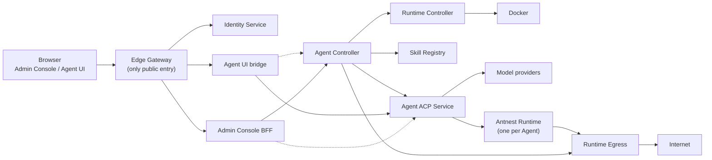

<div align="center">

# Antnest Platform

**Self-hosted platform for running AI Agents in isolated, policy-controlled sandboxes.**

Give every Agent its own container, network identity and durable lifecycle,
and keep your organization in control of what it can reach.

[](https://github.com/tf4fun/antnest-platform/actions/workflows/ci.yml)
[](LICENSE)
[](https://agentclientprotocol.com/)
[](https://modelcontextprotocol.io/)


English | [简体中文](README.zh-CN.md)

</div>

Antnest Platform runs AI Agents for an organization. Users talk to Agents from a
browser workspace over the [Agent Client Protocol (ACP)](https://agentclientprotocol.com/).
Each Agent works inside its own Runtime container through
[MCP](https://modelcontextprotocol.io/) tools, and all of its network traffic
passes an egress policy you control. Administrators manage identities, model
providers, Templates, Skills and Agents from one admin console.

## Why Antnest

- **Real isolation, not prompt-level guardrails.** One container per Agent,
  commands run as an unprivileged user, and every outbound flow is allowed or
  rejected at the packet level by versioned, per-Agent policy.
- **Open protocols end to end.** Clients speak standard ACP, tools are standard
  MCP. There is no proprietary Agent API to integrate against.
- **Built for organizations.** Organizations, users and groups, local login,
  OIDC single sign-on and SCIM 2.0 provisioning. When a person leaves, their
  Agents are taken offline automatically.
- **Agents that get better over time.** A Skill Registry distributes immutable,
  versioned Skills, and Agents can learn new Skills from their own work under
  administrator policy.
- **Durable and observable.** Lifecycle operations run as Temporal workflows
  that survive restarts, and OpenTelemetry traces cover every HTTP, RPC,
  database and workflow boundary.
- **Small services, clear contracts.** Ten independently deployable services in
  Go, Rust and TypeScript. Each owns its data and talks to the others only
  through language-neutral [contracts](contracts/README.md).

## How it works

1. An administrator connects a model provider, defines a Template (model and
   fallbacks, system prompt, Runtime image, Skills) and creates an Agent from it.
2. Agent Controller runs the creation workflow. Runtime Controller starts the
   Agent's Runtime container, and Runtime Egress assigns its network address and
   policy.
3. A user opens the Agent in the browser workspace and sends a prompt. Agent ACP
   Service runs the model and calls tools on the Agent's Runtime over MCP,
   asking the user for permission when policy requires it.
4. Results stream back over ACP. Sessions, Runs, costs and an execution audit
   trail are stored durably.

## Features

- **Isolated Agent Runtimes.** The Runtime exposes a workspace with built-in
  `read`, `write`, `edit` and `bash` tools plus platform-managed stdio MCP
  servers.
- **Per-Agent network policy.** Runtime traffic is tunneled to Runtime Egress,
  which gives each Agent a stable address and enforces its policy.
- **ACP v1 and v2 execution.** Sessions, Runs, permissions, plans, multimodal
  input, cost tracking and execution audit.
- **Durable lifecycle.** Create, rebuild, enable, disable and delete Agents
  through Temporal workflows, with execution configuration published to ACP.
- **Model providers.** DeepSeek and OpenRouter with encrypted credentials, model
  discovery and provider fallback.
- **Skills.** Templates pin exact Skill versions, and Runtimes receive them
  read-only. Automatic Skill learning activates checked changes when the Agent
  is idle and notifies the user.
- **Observability.** Traces and metrics for every service, viewable in Jaeger.

## Architecture



| Component | Language | Role |
| --- | --- | --- |
| [Antnest Runtime](runtimes/antnest-runtime/README.md) | Rust | Executes one Agent's tools and filesystem operations inside its container |
| [Runtime Egress](services/runtime-egress/README.md) | Rust | Agent network addresses, egress policy and packet forwarding |
| [Runtime Controller](services/runtime-controller/README.md) | Go | Realizes and observes one Runtime Environment per Agent on Docker |
| [Agent Controller](services/agent-controller/README.md) | Go | Agent lifecycle, configuration, provider credentials and execution publication |
| [Agent ACP Service](services/agent-acp-service/README.md) | TypeScript | ACP Sessions, Runs, model and tool execution, execution audit |
| [Identity Service](services/identity-service/README.md) | Go | Organizations, users, local login, OIDC, SCIM and access credentials |
| [Edge Gateway](services/edge-gateway/README.md) | Go | Browser ingress, sessions, admission, routing and security headers |
| [Admin Console](services/admin-console/README.md) | Go + React | Administrator application and thin backend-for-frontend |
| [Agent UI](services/agent-ui/README.md) | TypeScript + React | End-user conversation workspace and its server-side bridge |
| [Skill Registry](services/skill-registry/README.md) | Go | Immutable Skill packages, versions and distribution |

Planned components: Channel Manager (external chat channels), Task Scheduler
(scheduled Agent tasks) and a Kubernetes adapter for Runtime Controller. See
[docs/stage-4-services.md](docs/stage-4-services.md).

Ownership rules, identities and dependency directions are described in
[docs/service-layout.md](docs/service-layout.md). Wire contracts live in
[contracts/](contracts/README.md).

## Project status

Antnest is under active development and has no tagged release yet. Interfaces
and storage schemas can still change between commits. Known gaps and planned
work are tracked in [GitHub issues](https://github.com/tf4fun/antnest-platform/issues).
Feedback and contributions are very welcome.

## Quick start

Requirements: Linux or macOS with Docker Engine and Compose v2, and GNU Make.
The stack below is for local evaluation only.

```bash
git clone https://github.com/tf4fun/antnest-platform.git
cd antnest-platform
cp .env.example .env

# Build all images (sequential builds keep memory use predictable).
COMPOSE_PARALLEL_LIMIT=1 make -j1 docker-build-stage3

# Start the platform with Jaeger.
ANTNEST_ADMIN_DEFAULT_RUNTIME_IMAGE_REF=antnest/antnest-runtime:local \
  docker compose -f compose.yaml -f compose.stage3.yaml \
  --profile stage3 --profile observability up -d --wait
```

Then open:

- Admin Console: <http://127.0.0.1:8090>
- Agent UI: <http://127.0.0.1:8090/workspace/>
- Jaeger: <http://127.0.0.1:16686>

Sign in to organization `engineering` as `admin@example.com` with password
`antnest-admin-dev`. Connect a model provider, create a Template, then create an
Agent. Only Edge Gateway publishes an application port.

> The values in `.env.example` are public development defaults. Replace all
> passwords, tokens and encryption keys before using any other environment. See
> [SECURITY.md](SECURITY.md).

Stop the stack with `docker compose -f compose.yaml -f compose.stage3.yaml
--profile stage3 --profile observability down`. Add `-v` to delete its data.

For configuration, secrets, readiness checks, backups and troubleshooting, follow
the [single-node operations runbook](docs/docker-single-node-operations.md) and
the [backup and restore guide](docs/docker-backup-restore.md).

## Development

Toolchains: Go 1.27.1, Rust 1.98.1, Node.js 24.21.0 and Docker. Install the locked
Node dependencies first:

```bash
npm --prefix services/agent-acp-service ci
npm --prefix services/admin-console/web ci
npm --prefix services/agent-ui/web ci
```

Common commands, run from the repository root:

```bash
make fmt-check        # formatting for Go, Rust and TypeScript
make lint             # golangci-lint, cargo clippy, ESLint and type checks
make test             # unit and integration tests without a running stack
make test-postgres    # persistence suites against a disposable PostgreSQL
make docker-build-stage3
make e2e-stage3       # disposable full-stack Docker acceptance
```

Each service README lists its own build, test and configuration details. The
[test guide](tests/README.md) explains the test layout and the Docker E2E
targets. E2E targets create disposable Compose projects and clean them up on
success and failure; run them one at a time.

Development and test Compose files share one PostgreSQL server to save resources,
but every service still has its own database, role and migrations. Services never
read each other's tables.

## Documentation

- [Service layout and ownership](docs/service-layout.md)
- [Runtime and Egress design](docs/stage-1-runtime.md)
- [Identity design](docs/stage-2-identity.md)
- [Administrator control plane](docs/stage-3-admin-control-plane.md)
- [Agent lifecycle and Runtime state](docs/agent-lifecycle-state-model.md)
- [Provider credentials and models](docs/provider-credentials-and-models.md),
  [model discovery](docs/model-discovery.md) and
  [provider fallback](docs/provider-failover.md)
- [Runtime context and managed MCP](docs/runtime-context-and-managed-mcp.md)
- [Skill Registry design](docs/skill-registry-minimal-design.md),
  [Skill learning](docs/skill-learning-design.md) and
  [Skill deployment](docs/skill-deployment.md)
- [Observability contract](docs/observability-contract.md)
- [Product surfaces](docs/product-surfaces.md) and
  [design language](docs/design-language.md)
- [Contracts index](contracts/README.md)

## Contributing

Contributions are welcome. Read [CONTRIBUTING.md](CONTRIBUTING.md) for the
development workflow and review expectations. Report security issues privately
as described in [SECURITY.md](SECURITY.md).

## License

Antnest Platform is released under the [MIT License](LICENSE).
