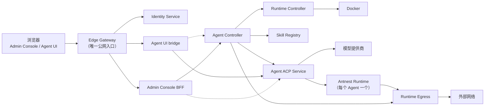

<div align="center">

# Antnest Platform

**自托管的 AI Agent 运行平台：每个 Agent 都运行在隔离、受策略控制的沙箱中。**

为每个 Agent 提供独立的容器、网络身份和持久生命周期，
同时让组织始终掌控它能访问什么。

[](https://github.com/tf4fun/antnest-platform/actions/workflows/ci.yml)
[](LICENSE)
[](https://agentclientprotocol.com/)
[](https://modelcontextprotocol.io/)


[English](README.md) | 简体中文

</div>

Antnest Platform 是一个面向组织运行 AI Agent 的平台。用户在浏览器工作区中通过
[Agent Client Protocol（ACP）](https://agentclientprotocol.com/) 与 Agent 对话；
每个 Agent 在自己的 Runtime 容器里通过 [MCP](https://modelcontextprotocol.io/)
工具工作，它的全部网络流量都要经过由你控制的出口策略。管理员在同一个管理控制台中
管理身份、模型提供商、模板、Skill 和 Agent。

## 为什么选择 Antnest

- **真正的隔离，而不是提示词层面的约束**：每个 Agent 一个容器，命令以非特权用户运行，
  每条出站连接都在数据包层面按版本化的 Agent 策略放行或拒绝。
- **端到端的开放协议**：客户端使用标准 ACP，工具使用标准 MCP，无需对接私有的 Agent API。
- **为组织而建**：组织、用户与用户组、本地登录、OIDC 单点登录和 SCIM 2.0 同步；
  成员离职时，其 Agent 会被自动下线。
- **越用越聪明的 Agent**：Skill Registry 分发不可变、带版本的 Skill；在管理员策略下，
  Agent 还能从自己的工作中学习新的 Skill。
- **持久且可观测**：生命周期操作以 Temporal 工作流运行，进程重启也不会丢失；
  OpenTelemetry 追踪覆盖每个 HTTP、RPC、数据库和工作流边界。
- **小服务、清晰契约**：十个可独立部署的服务，分别用 Go、Rust 和 TypeScript 编写；
  每个服务只拥有自己的数据，彼此只通过与语言无关的[契约](contracts/README.md)通信。

## 工作方式

1. 管理员连接模型提供商，定义模板（模型及备用模型、系统提示词、Runtime 镜像、Skill），
   再基于模板创建 Agent。
2. Agent Controller 运行创建工作流：Runtime Controller 启动该 Agent 的 Runtime 容器，
   Runtime Egress 为其分配网络地址和策略。
3. 用户在浏览器工作区中打开 Agent 并发送提示。Agent ACP Service 调用模型，并通过 MCP
   在该 Agent 的 Runtime 上执行工具；策略要求时会先征得用户许可。
4. 结果通过 ACP 流式返回。Session、Run、成本和执行审计记录都会被持久保存。

## 功能

- **隔离的 Agent Runtime**：Runtime 暴露一个工作区，内置 `read`、`write`、`edit`、
  `bash` 工具以及平台托管的 stdio MCP 服务器。
- **按 Agent 的网络策略**：Runtime 流量经隧道进入 Runtime Egress，后者为每个 Agent
  分配稳定地址并执行其策略。
- **ACP v1 / v2 执行**：Session、Run、权限确认、计划、多模态输入、成本统计和执行审计。
- **持久生命周期**：通过 Temporal 工作流创建、重建、启用、停用和删除 Agent，并向 ACP
  发布执行配置。
- **模型提供商**：支持 DeepSeek 和 OpenRouter，凭据加密存储，支持模型发现和提供商回退。
- **Skill**：模板固定引用精确的 Skill 版本，Runtime 以只读方式接收。自动 Skill 学习会在
  Agent 空闲时激活已检查的变更，并通知用户。
- **可观测性**：每个服务都有追踪和指标，可在 Jaeger 中查看。

## 架构



| 组件 | 语言 | 职责 |
| --- | --- | --- |
| [Antnest Runtime](runtimes/antnest-runtime/README.md) | Rust | 在容器内执行单个 Agent 的工具调用和文件操作 |
| [Runtime Egress](services/runtime-egress/README.md) | Rust | Agent 网络地址、出口策略和数据包转发 |
| [Runtime Controller](services/runtime-controller/README.md) | Go | 在 Docker 上为每个 Agent 实现并观测一个 Runtime Environment |
| [Agent Controller](services/agent-controller/README.md) | Go | Agent 生命周期、配置、提供商凭据和执行配置发布 |
| [Agent ACP Service](services/agent-acp-service/README.md) | TypeScript | ACP Session、Run、模型与工具执行、执行审计 |
| [Identity Service](services/identity-service/README.md) | Go | 组织、用户、本地登录、OIDC、SCIM 和访问凭据 |
| [Edge Gateway](services/edge-gateway/README.md) | Go | 浏览器入口、会话、准入、路由和安全响应头 |
| [Admin Console](services/admin-console/README.md) | Go + React | 管理员应用及其轻量 BFF |
| [Agent UI](services/agent-ui/README.md) | TypeScript + React | 终端用户对话工作区及其服务端 bridge |
| [Skill Registry](services/skill-registry/README.md) | Go | 不可变 Skill 包、版本和分发 |

规划中的组件：Channel Manager（外部聊天渠道）、Task Scheduler（定时任务）以及
Runtime Controller 的 Kubernetes 适配器，见 [docs/stage-4-services.md](docs/stage-4-services.md)。

服务归属、身份标识和依赖方向见 [docs/service-layout.md](docs/service-layout.md)，
接口契约见 [contracts/](contracts/README.md)。

## 项目状态

Antnest 仍在积极开发中，尚未发布正式版本，接口和存储结构仍可能变化。升级前请查看
[发布说明](CHANGELOG.md)（英文）。已知问题和后续计划
记录在 [GitHub issues](https://github.com/tf4fun/antnest-platform/issues) 中，欢迎反馈和贡献。

## 快速开始

环境要求：Linux 或 macOS，安装 Docker Engine、Compose v2、Node.js 24.21.0、
OpenSSL 和 GNU Make。
以下步骤仅用于本地体验。

```bash
git clone https://github.com/tf4fun/antnest-platform.git
cd antnest-platform
# 生成独立的随机密码和加密密钥，仅打印一次管理员密码。
scripts/generate-dev-env.sh

# 生成私有的服务间认证、Identity CCT 和 Runtime 实例凭据。
node scripts/dev-service-tokens.mjs
set -a
. artifacts/service-authentication/deployment.env
set +a

# 构建全部镜像（串行构建，内存占用更可控）
COMPOSE_PARALLEL_LIMIT=1 make -j1 docker-build-stage3

# 启动平台和 Jaeger
ANTNEST_ADMIN_DEFAULT_RUNTIME_IMAGE_REF=antnest/antnest-runtime:local \
  docker compose -f compose.yaml -f compose.stage3.yaml \
  --profile stage3 --profile observability up -d --wait
```

然后访问：

- Admin Console：<http://127.0.0.1:8090>
- Agent UI：<http://127.0.0.1:8090/workspace/>

使用组织 `engineering`、邮箱 `admin@example.com` 和生成器打印的管理员密码登录；
密码也保存在私有 `.env` 中。先连接模型提供商，再创建模板，最后创建 Agent。
基础 Compose 只发布 Edge Gateway 端口。PostgreSQL、Temporal 和 Jaeger 不发布宿主机端口。
本地诊断时，在同一组启动和停止命令中显式添加 `-f compose.debug.yaml`，
即可通过 <http://127.0.0.1:16686> 访问 Jaeger；公开部署不应加载该文件。
诊断转发保留接收服务的认证规则，业务监听地址仍由对应服务管理。

服务凭据输出保持私有，生成器不会覆盖已有凭据。若要在新部署中启用可选的 Skill
学习与发现能力，生成服务凭据时添加 `--with-skill-learning`。挂载、密钥保留和轮换规则
见 [部署认证与网络合同](contracts/platform/development-authentication.md)（英文）。

`.env.example` 的密码和加密密钥均为空，Compose 要求显式配置；服务启动时拒绝公开
凭据和重复字节密钥。生成器默认拒绝覆盖已有 `.env`，`--force` 仅用于一次性环境，
不能轮换已有数据的凭据，详见 [SECURITY.md](SECURITY.md)。

停止：`docker compose -f compose.yaml -f compose.stage3.yaml --profile stage3
--profile observability down`，加 `-v` 会同时删除数据。

配置、密钥、就绪检查、备份和故障排查请参阅
[单节点运维手册](docs/docker-single-node-operations.md) 和
[备份与恢复指南](docs/docker-backup-restore.md)（英文）。

## 开发

工具链：Go 1.27.1、Rust 1.98.1、Node.js 24.21.0 和 Docker。先安装锁定版本的 Node 依赖：

```bash
npm --prefix services/agent-acp-service ci
npm --prefix services/admin-console/web ci
npm --prefix services/agent-ui/web ci
```

常用命令（在仓库根目录执行）：

```bash
make fmt-check        # Go、Rust、TypeScript 格式检查
make lint             # golangci-lint、cargo clippy、ESLint 和类型检查
make test             # 不依赖运行中环境的单元测试与集成测试
make test-postgres    # 使用一次性 PostgreSQL 运行持久化测试
make docker-build-stage3
make e2e-stage3       # 一次性完整 Docker 验收
```

每个服务的 README 列出了各自的构建、测试和配置说明。[测试指南](tests/README.md)
说明测试目录结构和 Docker E2E 目标。E2E 目标会创建一次性 Compose 项目，并在成功或
失败时清理；请一次只运行一个。

开发和测试用的 Compose 共用一个 PostgreSQL 实例以节省资源，但每个服务仍有独立的
数据库、角色和迁移，服务之间不读取彼此的表。

## 文档

详细文档均为英文，入口见 [README.md](README.md#documentation)。

## 参与贡献

欢迎贡献。开发流程和评审要求见 [CONTRIBUTING.md](CONTRIBUTING.md)。安全问题请按
[SECURITY.md](SECURITY.md) 私下报告。所有参与者都需遵守
[行为准则](CODE_OF_CONDUCT.md)。

## 许可证

Antnest Platform 以 [MIT 许可证](LICENSE) 发布。
