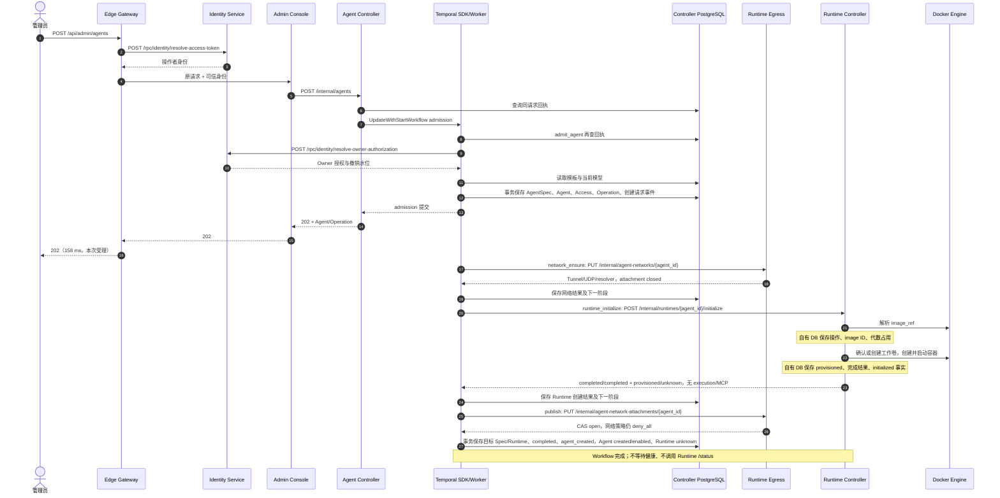
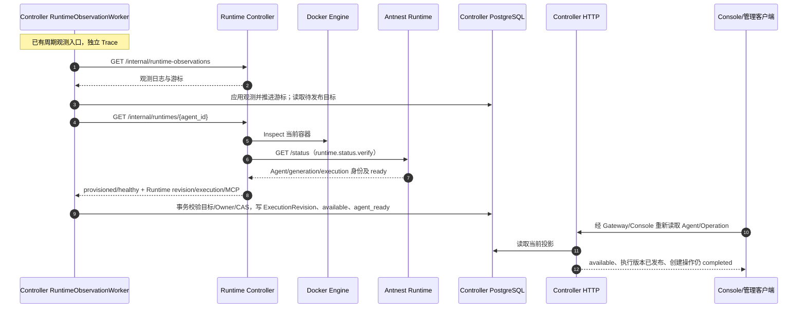

# BF-AGENT-04 创建 Agent

> 更新：2026-09-13；实例：antnest-dev-20260911。
> 状态：创建/就绪分离的新镜像联调、Trace 和持久化关联通过，等待人工验收。
> 本轮从 Gateway 管理 API 发起，不冒充重新执行了浏览器表单与 SSE 验收。
> 本文替换旧的“创建等待健康”时序；旧版本证据保留在 Git 历史，不证明当前合同。

## 1. 用户入口与完成语义

管理员选择 Owner、模板及修订，提交 POST /api/admin/agents。
Gateway 认证操作者，Console 限定组织与管理权限，Controller 验证 Owner 并启动 Temporal 工作流。
两次 Identity 调用分别回答“谁在操作”和“谁将使用 Agent”，不是重复登录。

现在有三个明确的完成点：

1. **受理**：HTTP 202 返回 Agent 和 Operation 标识，后台继续创建资源。
2. **创建完成**：容器已创建并启动、目标配置已保存；Operation completed，Agent created/enabled，Runtime unknown，随后独立观测为 waiting、available 或故障状态。
   此时不发布执行版本，不允许 Run；不把健康状态并入创建结果。
3. **可用**：独立观测读取当前 Runtime，验证身份与健康后发布 ExecutionRevision；
   Agent available，追加 agent_ready，原创建 Operation 保持 completed。

agent_created 和 agent_ready 是同一业务场景中的两个事实，不新增第二个用户操作。
“创建成功”不等于“可立即聊天”，也不保证进程之后永不退出。

模板原始 image_ref 保留；Runtime Controller 在执行时解析实际 image ID，并作为操作审计保存。
同一次操作重试复用实际 ID，后续新的重建可重新解析标签。本次没有改变 Provider/模型或 ACP 消费合同。

## 2. 创建链路

本图依据创建 Trace 的 HTTP 路由、Temporal SDK 阶段及存储边界绘制。
Docker 子步骤以其 CLIENT Span 和当前适配器源码核对；不声称 Trace 包含 Docker 内核操作。



完整创建 Trace 以 Gateway 为根，异步 Workflow/Activity 由 SDK 传播上下文。
Activity 顺序执行但互不伪装成父子关系。Temporal 负责调度与重试，服务幂等/CAS 负责已提交结果；
不声称分布式副作用 exactly-once。每个服务只访问自己的数据库。

## 3. 独立就绪观测



末尾读取通过 Gateway/Console；图中省略已在创建链路列出的身份与代理层。本轮以 Gateway API 重读替代 UI 操作核对状态，
没有重新证明浏览器 SSE 的及时性。独立观测可能在创建事务之前已看到 healthy，
因此每轮还会检查待发布目标，不依赖“一次健康事件恰好在创建后到达”。

就绪 Trace 不伪造为已经结束的创建请求的子 Span。关联依据是
Agent ID、Operation request_id、Runtime revision、两个持久化事件的 trace_id。
GET Inspect 没有请求正文，验收按路由、响应 Agent ID、直接 CLIENT 父级及 status verifier 的进程标识校验。

## 4. 实际 Trace 与耗时

本地时间 2026-09-13 15:09；下表耗时为单个开发样本，不是性能基准。

| 链路 | Jaeger | Span | 耗时/事实 |
| --- | --- | ---: | --- |
| Gateway 创建到 Workflow 完成 | [创建 Trace](http://127.0.0.1:16686/trace/386cf02b78bbea839d333aace2a57e5e) | 164 | 全链路 851.952 ms；HTTP 202 为 158.352 ms |
| Runtime initialize RPC | 同一创建 Trace | 包含在上项 | 489.508 ms；容器 start 268.483 ms；无健康等待 |
| 独立就绪观测 | [就绪 Trace](http://127.0.0.1:16686/trace/0114beaea12884d22156264ecf520e8d) | 40 | 61.055 ms；Inspect RPC 2.731 ms，Runtime status 0.133 ms |

admit_agent、network_ensure、runtime_initialize、publish 各执行一次，无 Activity 重试。
两条 Trace 的缺父、重复 Span ID、Jaeger warning 均为零。
创建 Trace 有两条 Docker CLIENT 404，是工作卷/容器的创建前存在性探测；随后创建/启动成功。
因此不写成“所有 Span 零错误”；就绪 Trace 没有 error Span。

| 服务 | 创建 Span / SQL / 事务父节点 | 就绪 Span / SQL / 事务父节点 |
| --- | --- | --- |
| Gateway | 3 / 0 / 0 | 0 / 0 / 0 |
| Identity | 5 / 3 / 0 | 0 / 0 / 0 |
| Console | 2 / 0 / 0 | 0 / 0 / 0 |
| Agent Controller | 91 / 65 / 9 | 26 / 21 / 2 |
| Runtime Egress | 26 / 18 / 2 | 0 / 0 / 0 |
| Runtime Controller | 37 / 20 / 2 | 13 / 6 / 1 |
| Antnest Runtime | 0 / 0 / 0 | 1 / 0 / 0 |

SQL 包含 BEGIN/COMMIT/ROLLBACK；事务父节点另计，不代表重复 SQL。
历史创建约 4.48 s、181 Span 的样本含健康等待；当前移走了这段等待，
不能把 0.85 s 的创建完成冒充 Agent 可用耗时同等降低。

agent_created 时间 UTC 07:09:00.985786，agent_ready 时间 UTC 07:09:04.736403，
间隔约 3.751 s；入口到可用约 4.56 s。这是启动、平台探针与独立观测调度共同形成的延迟，
不等于 Runtime 初始化本身耗时 3.751 s。

## 5. 目标、数据与资源核对

分层状态模型的最新验收见
[Agent 生命周期与 Runtime 状态](agent-lifecycle-state-model.md#creation-integration-2026-09-13)。
下文保留之前的 Trace 与原始字段，不冒充本轮验证结果。

- Agent：`agent_5693113b9d7cb1bfd4636293015277b5`。
- Operation：`lifecycle-050f31d91f82a42dad09359a5f7ebb19ceff9574bfd277b8ebe9423fa2a1ea0a`。
- Runtime revision：`rtv_2930476bac123c9955059490abf10369`。
- Runtime execution ID：`b5585b7e-9e71-413b-b096-71542bc9a845`。
- ExecutionRevision：`execution-observed_fab4f28deaccda110608eb696b4b0f1e`。
- [保留的 Agent 页面](http://127.0.0.1:8090/agents/agent_5693113b9d7cb1bfd4636293015277b5)。

以下保留的是分层状态改造之前的真实 Gateway 响应，不能作为新字段的验收证据：
running/provisioning/无执行版本 → completed/provisioning/无执行版本 →
completed/available/已发布执行版本。首次执行还同键同参数重放一次，Operation 和事件列表未变。

Agent Controller 自有库只读联查确认：
1 个当前执行版本；Agent、Spec、Execution、创建 Operation、agent_created、agent_ready
指向同一目标，`binding_coherent=true`；Operation 保留原始未知健康、空执行绑定，
`creation_unbound=true`。SQL Span 只证明事务结构，目标关联由这份查询另证，
不把同一观测批次里另一个 Agent 的 INSERT 当成当前 Agent 的证据。
事务原子性与并发 CAS 由服务组件测试保证，不由 Trace 顺序单独证明。

Runtime Controller 自有库为 generation 1、provisioned，initialize completed/effect completed；
保存的 inspection 仍为 unknown 且无执行标识，不会随健康观测改写历史结果。
实际容器 running/healthy，与 status verifier 的执行标识一致：
工作卷 `antnest-workspace-agent_5693113b9d7cb1bfd4636293015277b5` 可写挂到 /workspace，
系统 Skills 卷只读挂到 /skills。实际 image ID 与 Runtime operation 相同：
`sha256:d074ed9e6099443e319b1657f548c9bab179d003be7270b046a8878875f66461`。

## 6. 复验方法与范围

已完成：串行重建/替换两个 Controller、真实创建与同键重放、独立就绪、只读持久化/容器检查。
Provider/模板及其他服务数据库保留；没有请求外部模型、执行 ACP Run、重建/停启/删除验收 Agent。

复核现有目标（不再次创建或重放）：

```sh
node tests/e2e/observability/exercise-creation-observation.mjs \
  --confirm-development --retain-for-review \
  --agent agent_5693113b9d7cb1bfd4636293015277b5 \
  --request lifecycle-050f31d91f82a42dad09359a5f7ebb19ceff9574bfd277b8ebe9423fa2a1ea0a \
  --trace 386cf02b78bbea839d333aace2a57e5e \
  --postgres-container antnest-dev-20260911-postgres-1
```

脚本通过开发 .env 登录，等待六秒导出后读取指定 Trace，不保存凭证或原始 Trace。
新建模式使用 --template/--revision，单次创建失败后只报告身份，不换键偷偷创建另一个 Agent。
PG 查询是仅限本地验收的运维操作，不是服务跨库访问。
302 项观测脚本与 306 项生命周期脚本回归通过；make fmt-check、make lint（Go 0 issues、Rust Clippy、前端检查）通过。
本轮未重跑整套历史 Docker closeout，未把本机合成协议 fixture 测试计作 ACP 产品验收。

## 7. 审查边界与后续项

只读对抗审查指出的验收误判已补证：GET 无正文、跨目标 RPC/进程/修订关联、
任意创建阶段/失败重试中隐藏健康等待、SQL 结构与具体行归属混淆、MCP 地址交叉比对、重放 Agent 身份。
两轮只读审查者已关闭，补充反例先失败后通过；最终对同一实例只读复验通过。
没有为此增加业务手写 Span、SQL 参数采集、消息队列或新的服务。

仍不据此关闭：Controller 阶段完整快照的重复读取、旧 closeout 场景搭建合同漂移、
浏览器 SSE 正常取消/租期的观测噪声。旧“发布直接使用初始化健康快照”的流程已移除；
新观测 CAS 的服务测试不能替代本轮未执行的进程崩溃/网络故障注入。

本次只完成创建场景的技术联调。保留 Agent 与卷，等待用户查看两个 Trace；
下一项重建/停启/删除不自动继续。
