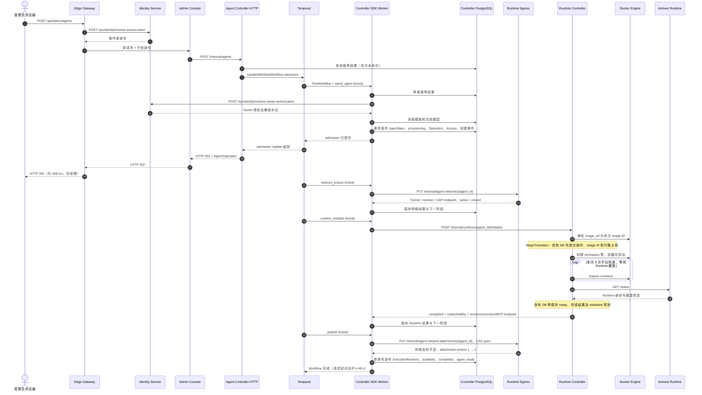

# BF-AGENT-04 创建 Agent

> 更新：2026-09-13。实例：antnest-dev-20260911，沿用刚验收的 Provider 与模板。
> 状态：真实浏览器创建、最终页面与刷新、持久化及主 Trace 核对完成，用户已确认正常创建场景通过。
> 正常创建成功不等于所有异常路径通过；事件流观测问题与静态审查风险见 §6。

## 1. 用户入口与输入

管理员打开 Agents，点击 Create Agent，填写“日常工作助手”，选择目录中的
Antnest Administrator 和“日常工作助手 · revision 1”，提交一次。
页面自动进入详情，最终显示 Available、Runtime Assigned、Executable configuration Published、
Create Completed。整页刷新后仍一致，Live updates 为 Live。

创建入口为 POST /api/admin/agents，包含 Owner、名称、模板 ID/revision，携带 Cookie、CSRF
和 Idempotency-Key。Gateway 认证操作者；Console 校验管理权限、附加可信组织与操作者范围；
Controller 在 admission 中另核验 Owner 的有效性与撤销水位。
两次 Identity 调用分别是“谁在操作”和“Agent 属于谁”，不是重复登录。

两个冻结时点：

1. admission 读取指定模板 revision 和模板所指模型的**当前配置**，保存 AgentSpec。
   本次 deepseek-v4-flash version 1；不是冻结模板创建时的模型历史。
2. Runtime initialize 才把原始 antnest/antnest-runtime:local 解析为本次 Docker image ID。
   操作记录保存引用和实际 ID；同次操作重试复用 ID。模板/AgentSpec 中的 tag 不被改写。

Provider 使用合成测试凭证。本次没有请求 DeepSeek，也没有执行 ACP Run；
ACP 消费者适配仍按用户要求暂缓，不能由 Agent 创建成功推导聊天已可用。

## 2. 创建与异步构建时序



Temporal Workflow/Activity Span 由 SDK 拦截器延续 Gateway Trace；异步工作晚于 HTTP 返回结束是正常的。
阶段顺序执行，但前一 Activity 不成为后一 Activity 的父 Span。
Temporal 保存调度、重试和执行历史，Controller 的阶段 CAS 防止已提交阶段重做副作用；
不是把 Activity 当成 exactly-once。各服务只写自己的数据库。

attachment=open 只表示运行时可挂接到 Egress，不代表放行互联网。
本次策略仍为 deny_all，与页面 Public internet access: Blocked 一致。

## 3. 页面读取与通知

以下是同一个用户流程中的独立 HTTP 请求，不人为挂到创建 POST 下。
每个受保护请求经过 Gateway 身份校验；表中列出此后的业务下游。

| 浏览器入口 | Console 后续接口 | 用途 |
| --- | --- | --- |
| GET /api/session | Gateway → Identity resolve-access-token | 页面进入/刷新恢复会话，不是独立业务场景 |
| GET /api/admin/account | Identity POST /rpc/identity/get-current-account | 账号及组织展示 |
| GET /api/admin/directory | Identity POST /rpc/identity/list-directory | Owner 选项及姓名展示 |
| GET /api/admin/templates | Controller GET /internal/agent-templates | 模板选项及模板展示 |
| GET /api/admin/agents | Controller GET /internal/agents | 初始列表 |
| GET /api/admin/agents/{agent_id} | Controller GET /internal/agents/{agent_id} | 首次 provisioning，发布后 available |
| GET /api/admin/operations/{request_id} | Controller GET /internal/agent-operations/{request_id} | 操作进度及 completed 终态 |
| GET /api/admin/agents/{agent_id}/events | Controller 同路径 /internal 前缀 | 事件历史和恢复游标 |
| GET /api/admin/agents/{agent_id}/events/watch | Controller 同路径 /internal 前缀 | SSE 失效通知；触发重新读取 Agent/Operation/网络状态 |
| GET /api/admin/agents/{agent_id}/network-policy | Controller 同路径 /internal 前缀 → Egress 三个 GET（见下文） | 网络策略显示 |

网络状态读取的实际 Egress 下游依次为 GET /internal/agent-policy-assignments/{agent_id}、
GET /internal/policies/{policy_id}/revisions/{revision}、GET /internal/agent-networks/{agent_id}。
分别读取已分配策略、规则正文、当前网络/attachment 状态；本次没有修改策略。

本次首次详情在构建中加载；agent_ready 后约 16:58:57 UTC 发起 Agent、Operation、网络状态查询。
刷新重建页面快照和订阅，不能以浏览器内存中的旧状态冒充持久化恢复。
SSE 不采集消息正文；通知与页面查询的对应根据时间、Agent ID、两个持久化事件及最终页面核对，
不声称 Trace 包含逐条 SSE 消息。

## 4. 本轮实际证据

### 4.1 主创建链路

- [本次浏览器创建 Trace](http://127.0.0.1:16686/trace/7fd1c30f9100cd89e94673fe886979b3)：181 Span，7 个服务，零缺父、重复 ID 和 Jaeger warning。
- Gateway POST 202：458.230 ms；完整异步链路约 4475 ms。admit 与三个推进 Activity 均执行一次。
- 本地时间：2026-09-13 00:58:53 至 00:58:57；Trace UTC：2026-09-12 16:58:53 至 16:58:57。
- Agent：`agent_116c8b47b1e9e5edc2c654cdd8cd0edf`。
- Operation：`lifecycle-d52c40b188f502cc03751a676210eee264c0fd0b207b3b83afc4fab400d2ba74`。
- [刷新后详情](http://127.0.0.1:16686/trace/8e4431631b7ca3a998de3ab459b77117)、[完成操作查询](http://127.0.0.1:16686/trace/a9b882ea20ffb733246a124cb03efbc3)均成功。

两条 Docker CLIENT Span 标记 error/404，分别属于 ensure_storage 和 create 的存在性探测，
随后对应创建返回 201、启动返回 204。生命周期和业务 RPC 成功，不能写成“所有 Span 零错误”。

| 主 Trace 服务 | Span 总数 | SQL 次数（含 BEGIN/COMMIT/ROLLBACK） | 额外事务父 Span |
| --- | ---: | ---: | ---: |
| Edge Gateway | 3 | 0 | 0 |
| Identity Service | 4 | 2 | 0 |
| Admin Console | 2 | 0 | 0 |
| Agent Controller | 92 | 66 | 9 |
| Runtime Egress | 26 | 22 | 2 |
| Runtime Controller | 53 | 23 | 2 |
| Antnest Runtime | 1 | 0 | 0 |

Controller 的 9 个事务包含两次未命中的只读幂等查询，结束为 ROLLBACK，不是写事务失败。
admission 写入 5 INSERT + 1 UPDATE；network/runtime 两阶段各 1 UPDATE；
publish 写入 2 INSERT + 3 UPDATE。额外 SELECT 的精简空间见 §6。
Runtime Controller 记录操作、资源映射、代数占用及观测；其中观测保留期 DELETE 是清理语句，
不能把语句次数直接解释成删掉了本次数据。

### 4.2 页面请求索引

时间窗 UTC 16:56:00 至 17:01:21：23 个有限业务请求已做结构及成功状态检查；
除创建中的两条预期 Docker 404 外无错误。另两条 SSE 长连接单独记录，不能宣称全部零 warning。
静态资源不计入业务请求数。

| 用户阶段 | 请求 | Trace ID |
| --- | --- | --- |
| 进入 | session | a47099d03533f1ae44533e81a24400c0 |
| 进入 | agents | 27dbb099893cde9ca611343433575b0c |
| 进入 | directory | 3b91720dcdbbd418c47ca551f6104499 |
| 进入 | account | b5cb522575be4c7059b6de34e8a2930e |
| 进入 | templates | db1f84199935bb2deab3fb127170b224 |
| 创建 | POST agents | 7fd1c30f9100cd89e94673fe886979b3 |
| 构建中 | agent detail | fd44bb835dcf980e87514b0668647e05 |
| 构建中 | directory | dd7c978063b9c525312b1dec2e79b36f |
| 构建中 | templates | 8081747f0718febbcd38215d1f1139f3 |
| 构建中 | events | 38ea206f7e36638b8e23a899b9f81381 |
| 构建中 | operation | 5f90a98e313113c046bc8a0887ceb484 |
| 构建中 | network-policy | 60e84c2b2e8295c670afc99838ff2ce6 |
| 构建中 | events/watch，刷新取消 | eb21f9a2ce70d1619e2abe9117358ef5 |
| 完成通知后 | agent detail | 4c63ceb7ada91ebffd5f2377cd379ef6 |
| 完成通知后 | operation | a9b882ea20ffb733246a124cb03efbc3 |
| 完成通知后 | network-policy | dee263f13e96f5bfacedc3fd9882dd08 |
| 刷新 | session | 19356ebbfe20d9590d064abbc406bf91 |
| 刷新 | templates | 717b1da2c0883fd61be559ecdcc30528 |
| 刷新 | agent detail | 8e4431631b7ca3a998de3ab459b77117 |
| 刷新 | events | f4e5cb2290494372239f2cd388b486ca |
| 刷新 | directory | 0467f803129bd7058edca1cc7403472c |
| 刷新 | account | 5ece45ed60d2731a423b3ea093c1ccd7 |
| 刷新 | operation | cfae4397969ff085d77db151f854cb25 |
| 刷新 | network-policy | c22911fc69d82b8446a53b5605ca05fa |
| 刷新 | events/watch，五分钟租期结束 | 95631be26e035043debf95f8277ecea4 |

### 4.3 持久化与真实资源

- Controller：1 Agent、1 AgentSpec、1 ExecutionRevision、1 active access binding、1 completed create operation；
  事件仅 agent_create_requested / agent_ready，aggregate sequence 为 1/2，两者关联主创建 Trace。
- Agent 清空 active_operation；Spec 模型参数、Runtime 输入、system prompt 与前一步模板/模型一致；
  execution 与 Agent 当前 revision/execution ID/MCP endpoint 相同。四项数据库布尔比对均为 true。
- Runtime Controller 自有库：generation 1、ready、初始化 operation completed/effect completed；
  保留 initialized 观测，后台另产生 healthy 观测，不冒充创建 Trace 中的写入。
- 实际容器 `antnest-runtime-agent_116c8b47b1e9e5edc2c654cdd8cd0edf` 为 running/healthy。
  独占卷 `antnest-workspace-agent_116c8b47b1e9e5edc2c654cdd8cd0edf` 可写挂载 /workspace，
  系统 Skills 卷只读挂载 /skills。
- Docker image ID、Runtime operation 的 image_id、Runtime OTEL Resource 元数据一致：
  `sha256:d074ed9e6099443e319b1657f548c9bab179d003be7270b046a8878875f66461`。
- Runtime revision：`rtv_30831efae790291ab5a0f085fcfb9285`；
  execution ID：`9833f106-c99e-4249-b0ad-789a2fcc39ce`。
  MCP endpoint 使用该 Agent 容器 DNS 的 :8093/mcp，没有经 Controller 代理工具流量。
- Egress 自有库：Tunnel 100.64.0.10、active、attachment open/version 2、策略 deny_all。
  Trace 中逐字段核对 closed → initialize 网络参数 → CAS open 的交接一致。

## 5. 验证方式与范围

```sh
node scripts/observability/check-lifecycle.mjs \
  --kind create \
  --admission 7fd1c30f9100cd89e94673fe886979b3 \
  --request lifecycle-d52c40b188f502cc03751a676210eee264c0fd0b207b3b83afc4fab400d2ba74 \
  --agent agent_116c8b47b1e9e5edc2c654cdd8cd0edf
```

验收器等待六秒导出后只读查询，检查 SDK 阶段、父子关系、阶段所属 RPC/事务。
它不是业务终态的全部证据；§4.3 另以响应字段、PostgreSQL 与实际 Docker 资源核对。
不落盘原始 Trace 正文或凭证。本轮只更新验收文档，不修改服务或重建镜像。
没有再次执行幂等重放、失败注入、Runtime 崩溃、ACP、外部模型或其他生命周期操作。
此前 0eef9d706c4a5c163a11bf429192ec2b 为旧 API 验收，不能代替本轮浏览器证据。
本轮串行执行观测脚本单测 235 项通过；文档链接检查和 git diff --check 通过。
没有修改生产代码，不把此前 Go/Rust 全量门禁作为本轮重新执行的结果。

## 6. 对抗审查与未关闭项

1. **发布前 Runtime 失效的竞态候选，待定向验证。** publish 使用已保存的初始化结果；
   Runtime observation 失效处理仅更新 available 且无活动操作的 Agent，但未命中也推进游标。
   “initialize 成功 → 消费失效事件 → publish”可能发布过期绑定。见
   [发布阶段](../services/agent-controller/internal/application/lifecycle.go:437)、
   [失效过滤及游标](../services/agent-controller/internal/repository/postgres/runtime_observation.go:134)。
   这是源码交错风险，本次没有注入故障，不写成已复现或已修复。
2. **重复快照读取，源码和 Trace 均已确认。** network/runtime/publish 入口及事务结束都读取
   Agent/Access/Spec，Activity 最终只使用 Operation。应收窄阶段返回合同，不能删除重试所需 CAS。
   见 [持久化返回](../services/agent-controller/internal/repository/postgres/lifecycle.go:191)、
   [Activity 返回](../services/agent-controller/internal/application/create_workflow.go:59)。
3. **事件流取消的观测噪声，已实际出现。** 刷新取消产生 canceled/cancelled/handler_aborted；
   刷新后的订阅在 Gateway 五分钟 StreamLease 到期时同样标错。后者有约 247 µs 的父子结束偏差，
   Jaeger 报 clock skew adjustment disabled，严格校验器明确失败，未放宽门槛。
   主创建 Trace 和 23 个有限请求不受影响，但不能声称整个页面所有 Trace 均已通过。
   后续应统一正常流结束/租期/客户端取消的记录语义，而非由业务吞错。
4. **验收工具合同漂移。** scripts/lifecycle-closeout/flow.mjs 的旧建模前置仍缺连接 ID、使用
   旧模板模型字段且假定模板镜像已解析；本轮没有使用它，也未宣称整套 closeout 重跑通过。
   evidence.mjs 的 phase_traces: 3 实为阶段数，本次只有一条主创建 Trace。

两轮只读子 agent 已完成源码/文档复核并关闭；最后复核修正了 Owner 授权和镜像 ID 保存的时序，
未发现本链路跨服务直连其他数据库。
正常创建场景已获用户确认，以上问题仍保留为后续评审输入，不因人工验收而关闭。
Agent、卷和页面继续保留；本次确认未执行重建、聊天或其他场景。
