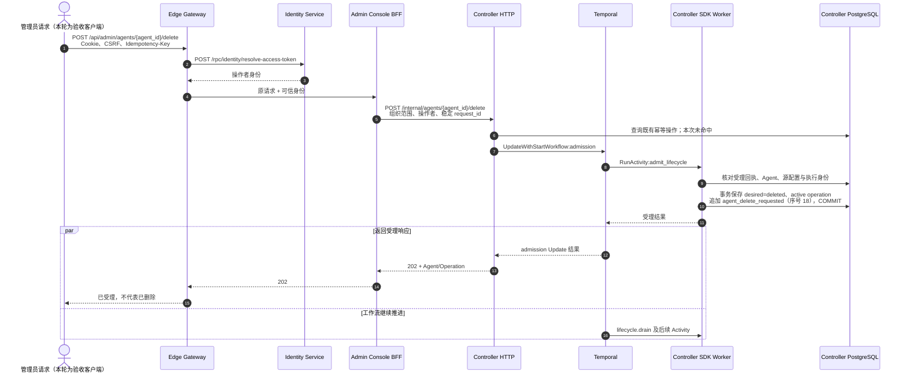
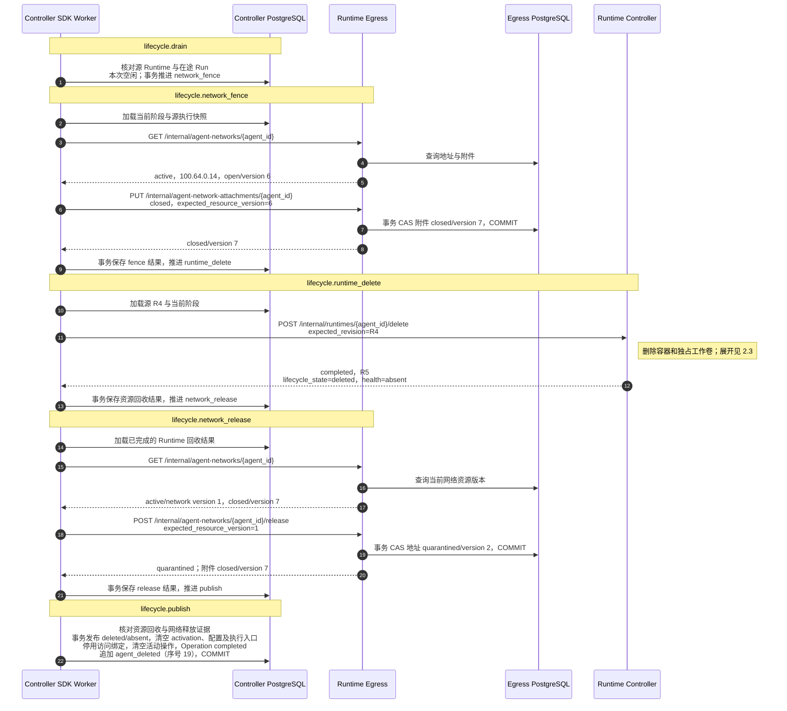
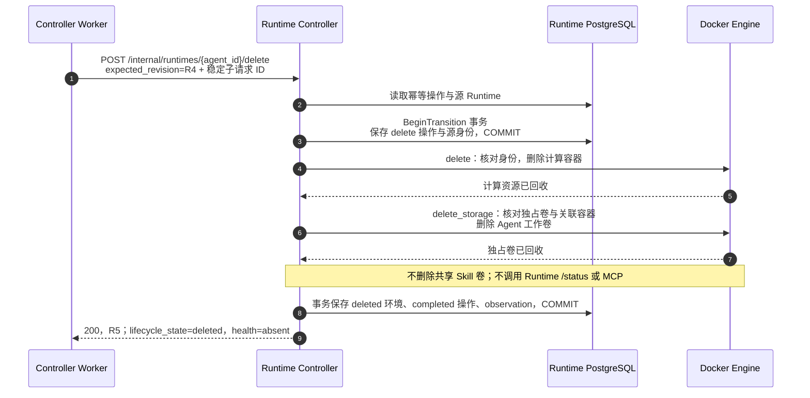

# BF-AGENT-08 删除 Agent 与资源回收

> 更新：2026-09-14。分层状态模型下的技术复验通过，用户已确认。
> 真实 Gateway/Console BFF API、Docker 资源、持久化与 Trace 交叉核对。
> 本轮未做浏览器点击/SSE、真实 ACP 对话、外部模型调用或故障注入，不沿用旧镜像的页面验收结论。

## 1. 入口与业务终点

管理员发起 `POST /api/admin/agents/{agent_id}/delete`，携带登录 Cookie、CSRF 与 Idempotency-Key。
Gateway 认证，Console 校验管理权限，Agent Controller 受理删除意图并阻止新 Run。
HTTP 202 仅表示受理；终点是资源回收和删除发布完成，不能只看 Operation completed。

本轮 Agent 为 `agent_204318bb785ce79d72f8b10387c384ab`，沿用此前创建、停用、启用和显式重建场景。
删除前为 `created/enabled/available`；删除后为 `deleted/absent`，不再具有 activation、当前配置、
执行绑定、Runtime 入口和活动操作。历史 Spec、ExecutionRevision、事件及已停用的访问绑定保留。

当前拆分实现会立即回收容器与独占工作卷，不是将工作卷保留到业务审计到期。
网络地址先进入隔离期，再由 Egress 回收；共享 Skill 卷不属于 Agent 独占资源，不删除。

## 2. 实测链路与时序

依据 [Gateway 完整 Trace](http://127.0.0.1:16686/trace/cc9511b93902874d3ed750d49ee799b4)：
175 个 Span，零缺失父 Span、零 Jaeger warning；HTTP 202 为 114.725 ms，
异步业务路径 680.699 ms，其中 Runtime delete RPC 为 353.239 ms。

图中只展开本次成功路径，合并同类读取，箭头不等于 SQL 数量。
Worker 是 Agent Controller 进程内的 Temporal SDK Worker；各 DB 表示服务自有持久化，
不是跨服务共享事务。R4/R5 完整标识见第 4 节。

### 2.1 请求受理



两支都依赖受理完成，不要求等客户端收到 202 才开始后台工作。异步步骤继承 Gateway Trace。
受理时 lifecycle 仍是 created，不能把 desired=deleted 当成回收已完成。

### 2.2 阶段推进与发布



admit_lifecycle 及后续五个 Activity 本轮各执行一次。阶段后事务不是跨库原子提交，
下游仍以稳定请求 ID 和资源版本约束副作用；Temporal 不提供副作用 exactly-once 保证。
关闭附件与释放地址不等于修改用户 deny_all 策略。隔离期回收在此 Trace 之外，见第 3 节。

### 2.3 Runtime 资源回收

这是上图 Runtime RPC 的展开，不是新增一次调用。



不可变 delete Operation 回执的 inspection 为 `phase=unknown / lifecycle_state=deleted / health=absent`；
事后 `GET /internal/runtimes/{agent_id}` 的当前 tombstone 为 `phase=absent / deleted / absent`。
两个读模型不应混写；当前 Agent 的 runtime_state 为 absent，执行入口为空。
删除与创建/启用不同，不需要另等一次就绪事件才能完成。

### 2.4 用户可见状态

本轮通过 Console BFF API 观测下列快照，未用浏览器确认渲染或 SSE：

| Operation | lifecycle / desired / activation | runtime | 当前执行绑定 |
| --- | --- | --- | --- |
| running / drain | created / deleted / enabled | available | 旧绑定仍可见 |
| running / publish | created / deleted / enabled | available | 旧绑定仍可见 |
| completed / completed | deleted / deleted / 空 | absent | 空 |

中间的 available 是旧观测，不表示已经回收的容器仍在线；desired 和 active operation 已阻止新 Run。
本轮没有在运行中的删除阶段并发注入 Run；阶段内准入保护沿用既有服务测试，不冒充本轮实测。
删除后 Current 列表不含目标，Deleted 列表恰有一条，管理员仍可查询详情和事件。
用户工作区列表不含目标，状态与 ACP 入口均返回 404；内部 acquire-run 返回 403 access_denied。
网页订阅后的刷新逻辑见 [Console 状态合同](../services/admin-console/docs/agent-state.md)，不是本轮浏览器证据。

## 3. 数据与资源边界

| 所有者 | 删除完成后的事实 | 证据 |
| --- | --- | --- |
| Agent Controller | deleted/absent；当前 Spec、执行入口、Runtime 身份/地址、activation、活动操作清空 | API 与自有库交叉核对 |
| Agent Controller | 原 2 份 Spec、3 份 ExecutionRevision、4 个先前生命周期操作、17 条先前事件不变；新增 2 条删除事件，共 19 条 | 对旧行集合做删除前后一致性校验；只输出计数与一致性结果，不保留敏感快照 |
| Agent Controller | 访问绑定保留 1 条，active 为 0；无 active Run admission | 只读库核对与被拒绝的合成 acquire-run |
| Runtime Controller / Docker | 目标容器与独占工作卷不存在，Runtime tombstone 保留 | Docker 查询与当前 Runtime GET |
| Docker | `antnest-dev-20260911-system-skills` 共享卷仍存在 | volume inspect |
| Egress | release 回执为 quarantined/version 2、closed/version 7；地址 100.64.0.14 | 主 Trace 实际 RPC 响应 |
| Egress | 实例隔离期 300 秒；之后复查该 Agent 的地址、附件、策略绑定均不存在 | 自有库只读查询；源码说明为 sweep 清理后 FK CASCADE，不是 Controller 跨库删除 |

隔离期 sweep 是独立维护流程，不包含在 680.699 ms 的删除业务路径内。
本轮观察到其前后结果，未单独截取 sweep Trace、验证地址被另一 Agent 复用或执行故障注入。
策略定义/修订与 Agent 的策略绑定不同，不能把绑定回收说成共享策略也已删除。
业务审计保留期到期后的清理不在本轮范围内。

独占卷为 `antnest-workspace-agent_204318bb785ce79d72f8b10387c384ab`。
此前跨停用、启用、重建保留的 marker 随该卷删除，符合删除语义。
没有清空整个实例：另一 Agent 仍在 Current 库存，本轮没有操作其资源。
跨库读取仅为协调者验收核对，产品服务没有读取其他服务的表。

## 4. 请求与修订对照

| 标识 | 值 |
| --- | --- |
| Lifecycle request | `lifecycle-8d15b8f362e6f750fe18566e6c1eaaf4797959dfab87cf7611e8d901907b50dc` |
| Runtime delete request | `acr_208540f82612a62c08eec5409e14fc35` |
| 源 R4 | `rtv_705941f367bbd5a62f69f104061d0b0a` |
| 删除 tombstone R5 | `rtv_9ac46ebda26843dac7a1c381c9cbd470` |
| 删除前 Spec | `agentspec-rebuild_c5683ed845d873819368cecdac51966e` |
| 删除前执行修订 | `execution-observed_ff2d160506560abf03452517248af2bd` |
| agent_delete_requested | 序号 18；`2026-09-13T16:38:01.986411Z` |
| agent_deleted | 序号 19；`2026-09-13T16:38:02.570908Z` |

时间为 UTC，对应本地 2026-09-14。两个删除事件均关联上述 Gateway Trace。
同一 Idempotency-Key 重放返回同一操作，完成回执与事件集合均未变化。

## 5. 可复用检查与限制

验收 runner 在 Operation 完成后调用 `assertAgentDeleted`，不再只检查 desired_state。
断言覆盖终态、无活动配置/执行/Runtime 入口，并允许保留历史执行修订；
对应单测逐一拒绝十一种残留或错误状态，包括配置修订已清空但 configuration 投影仍残留的情况。
本轮相关脚本测试 311 项通过，零失败/跳过；全仓库 `make -j1 fmt-check lint` 通过。

```sh
node --test --test-concurrency=1 scripts/observability/*.test.mjs \
  scripts/verification/agent-state.test.mjs

node scripts/observability/check-lifecycle.mjs \
  --kind delete \
  --admission cc9511b93902874d3ed750d49ee799b4 \
  --request lifecycle-8d15b8f362e6f750fe18566e6c1eaaf4797959dfab87cf7611e8d901907b50dc \
  --agent agent_204318bb785ce79d72f8b10387c384ab
```

后一个命令等待六秒导出窗口，再只读核对 Trace，不再执行删除。
它验证 SDK 阶段、成功下游 RPC、SQL 归属、缺失父 Span 和 warning；Docker 存在性检查中的
真实 404 不能被误报为整个生命周期失败，零 warning 也不等于底层 HTTP 从未出现 404。
资源存在性、库存可见性和旧行一致性由额外的只读核对提供，不宣称单个 Trace 检查器覆盖全部验证。
完整产品合同见 [Lifecycle workflows](../services/agent-controller/docs/lifecycle-workflows.md)。
独立只读复核未发现时序或职责边界问题；提出的 configuration 残留断言缺口已按先失败测试、后补断言修正。
