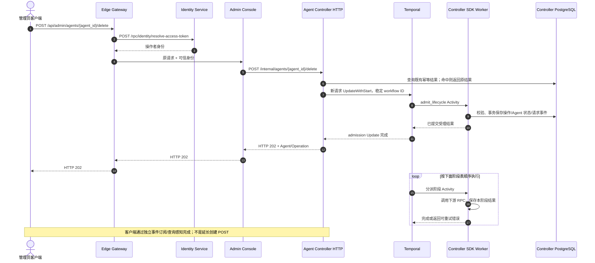

# BF-AGENT-08 删除 Agent 与资源回收

> 更新：2026-09-12。当前实现：统一 Temporal 生命周期，task queue 为 agent-lifecycle。
> 本轮 Gateway API、业务终态、幂等重放和 Jaeger 核对已通过；等待用户审阅。
> 不把旧 PostgreSQL worker 的多 Trace 记录或此前浏览器验收当成本次证据。

## 1. 入口与输入

管理员从 Console 发起 `POST /api/admin/agents/{agent_id}/delete`，携带 Cookie、CSRF 和 Idempotency-Key。
Agent 标识。受理删除意图并锁定新 Run 准入。删除计算与独占工作卷，业务记录和审计事实保留；不删除共享 Skill 卷。

Gateway 认证操作者，Console 校验管理权限并组装组织范围请求；服务之间不直接访问对方数据库。
HTTP 202 仅表示意图已持久化，不表示运行资源已经处理完毕。

## 2. 受理时序



## 3. 阶段与持久化边界

| Activity 阶段 | 对外接口 | 工作与数据 |
| --- | --- | --- |
| drain | 无外部 RPC | 检查在途执行以及源 Runtime 的可证明状态。 |
| network_fence | GET /internal/agent-networks/{agent_id}；PUT /internal/agent-network-attachments/{agent_id} | 确认当前阶段，再 CAS close。已确认网络不存在时按缺失合同推进。 |
| runtime_delete | POST /internal/runtimes/{agent_id}/delete | Runtime Controller 回收容器和独占工作卷并证明不存在；源 Runtime 已证实缺失时可跳过此副作用。 |
| network_release | GET /internal/agent-networks/{agent_id}；POST /internal/agent-networks/{agent_id}/release | 确认资源回收后才释放地址至 quarantine，避免提前复用；不等待隔离期到期。 |
| publish | 无外部 RPC | 事务标记 deleted、停用访问绑定、清空执行入口、完成操作并追加 agent_deleted。 |

Controller 的 `agents`、`agent_lifecycle_operations`、`agent_events` 保存业务状态与审计。
Spec、ExecutionRevision 和访问绑定按上述业务步骤更新；Runtime Controller 和 Egress 各自持有平台/网络数据。
Temporal 保存工作流历史、调度和重试，不再使用业务库里的 claim、worker lease 或 recovery trace carrier。
阶段写入继续使用业务 CAS；下游复用确定的请求 ID / 资源版本，不能把 Activity 当成 exactly-once。

## 4. 当前验收证据

- 实例：`antnest-dev-20260911`；独立测试 Agent：`agent_2908b99c22e7174725f354880854d5c6`。
- [Gateway 完整 Trace](http://127.0.0.1:16686/trace/397d8f02ec43e5ad91bfeb4a0e0b8b54)：176 个 Span，零缺失父 Span、零 Jaeger warning。
- 请求受理 HTTP 202，operation 最终 completed；目标 Agent 业务状态为 `deleted`。
- 同一幂等键重放未更改 operation 终态或事件历史。五阶段验收结束后，此测试 Agent 的容器与独占卷均已回收。
- 未调用外部模型、未执行 ACP Run，也未重做浏览器/UI 或 Docker SIGKILL 专项验收。

官方 SDK Workflow/Activity 均延续同一 Gateway Trace；顺序执行不代表让前一 Activity Span 包住后一 Activity。
事务/SQL 与确切的下游成功 SERVER RPC 必须归属对应 Activity。Docker 存在性检查可能产生真实 404；
不能因此虚报生命周期失败，也不能把零 warning 写成所有底层 HTTP 都无错误。

```sh
node scripts/observability/check-lifecycle.mjs \
  --kind delete \
  --admission 397d8f02ec43e5ad91bfeb4a0e0b8b54 \
  --request lifecycle-5f666c7f358d03c2502893c17e71f2e79d8fd301ac13693ef4bf88fa77a2b2d0 \
  --agent agent_2908b99c22e7174725f354880854d5c6
```

命令等待六秒导出窗口后只读查询，不保留原始 RPC 正文或凭证。
完整测试、复核与统一合同见 [Lifecycle workflows](../services/agent-controller/docs/lifecycle-workflows.md)。
