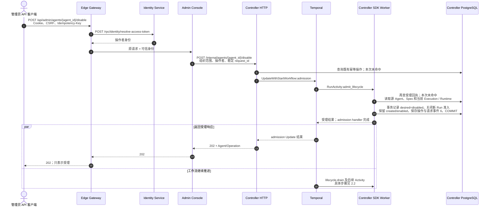
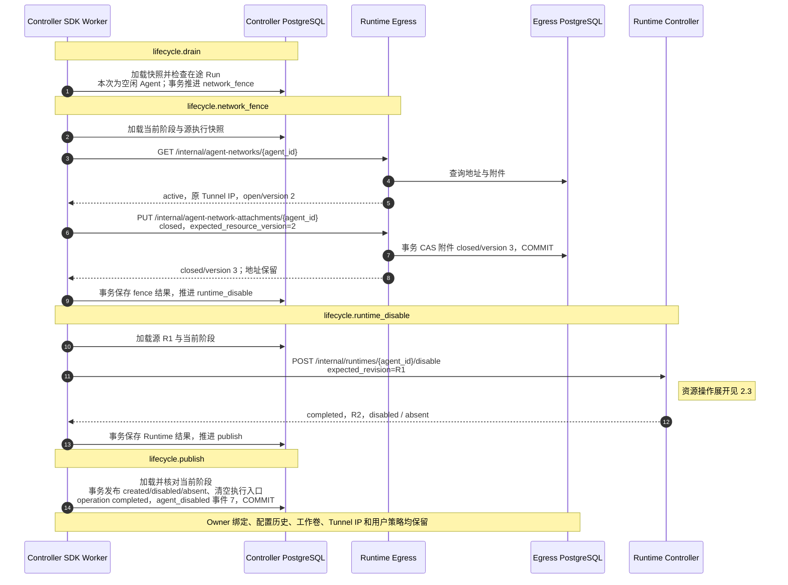
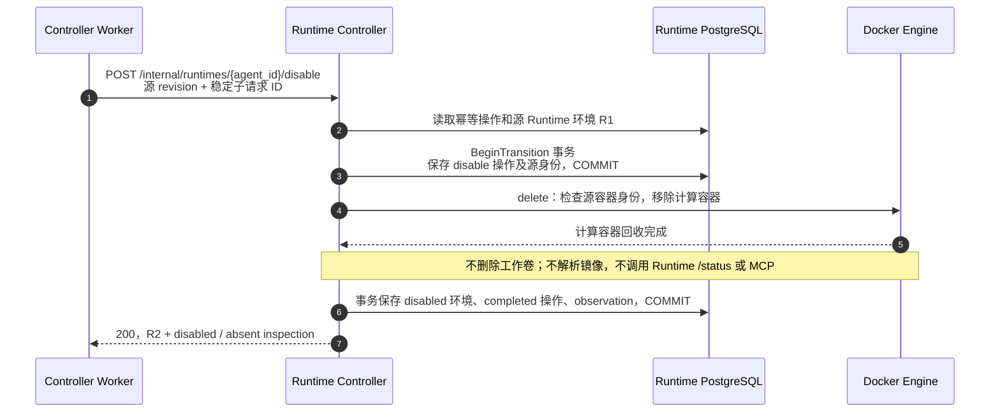

# BF-AGENT-06 停用 Agent

> 更新：2026-09-13。当前实现：统一 Temporal 生命周期，task queue 为 agent-lifecycle。
> 分层状态改造后的 Gateway/Console BFF 调用、业务终态、资源保留/回收和主 Trace 核对通过，等待用户审阅。
> 本轮使用受控 API 客户端，不是浏览器操作；同键重放已验证。之前的浏览器批次见
> [历史四项 Trace 汇总](business-flow-agent-lifecycle-traces.md)，不能替代本次证据。

## 1. 入口与输入

管理员从 Console 发起 `POST /api/admin/agents/{agent_id}/disable`，携带 Cookie、CSRF 和 Idempotency-Key。
Agent 标识。受理阶段校验组织和源状态，写入 desired=disabled，关闭新 Run 准入。身份撤销也提交这一工作流，不另建后台执行器。

Gateway 认证操作者，Console 校验管理权限并组装组织范围请求；服务之间不直接访问对方数据库。
HTTP 202 仅表示意图已持久化，不表示运行资源已经处理完毕。

## 2. 本轮实际时序

依据 [本轮 Trace](http://127.0.0.1:16686/trace/f6ac45b9cb246be61b0b2ce9085d145e)，将同一业务拆为受理、阶段编排和 Runtime 内部三个视图。
只画本次首次成功路径；重放单独验证，没有触发重试或故障分支。图中合并同类读取，不代表一箭头等于一条 SQL。
`Worker` 是 Agent Controller 进程中的 Temporal SDK Worker，不是新增服务；
各 PostgreSQL 参与者分别代表服务自有库/表。本次 R1 为
`rtv_190d4b4164d625274b9f25497aff6add`，停用结果 R2 为
`rtv_0db487eda5e35029ad1194ba79c63a9c`。

### 2.1 用户请求与受理



本次 Gateway 202 在约 146 ms 返回，整条异步业务在约 0.721 s 结束。
首个推进 Activity 在 HTTP 响应完成前已开始；两支仅共享“受理已完成”这一前提，
不能画成客户端收到 202 后才启动工作流。全部推进仍延续同一 Gateway Trace。

### 2.2 生命周期阶段与跨服务数据



每个 `lifecycle.*` 对应独立 Activity，本轮各执行一次；上一个完成后 SDK 再调度下一个。
图中阶段前读取与阶段后事务均保留，不能把多服务事务画成跨库原子提交。
网络附件开闭不改写用户的 `deny_all` 策略。

### 2.3 Runtime Controller 内部资源操作

以下为 2.2 中 Runtime RPC 的展开，不是额外调用；源 R1 变为 R2。



BeginTransition 先保存操作，再执行资源回收，最后保存完成事实；没有用 MCP 调用代替平台资源管理。

### 2.4 页面如何获知完成

页面已有的 SSE 提供事件提示，随后独立查询 Agent 与 Operation，再更新终态和按钮。
这不是 POST 的续传，也不是 Temporal 直接通知浏览器。完整接口及源码边界见
[共同页面状态同步图](business-flow-agent-lifecycle-traces.md#5-共同页面状态同步)；
本轮验证的是 BFF 返回的完整状态，没有执行浏览器/SSE 场景；组件测试负责状态刷新与按钮行为，不能将其称为实测浏览器证据。

本次独立查询捕获的状态如下。Operation 进度和确认状态不是一个字段：

| Operation | 阶段 | 生命周期 | 目标 | 确认启停 | Runtime | 执行绑定 |
| --- | --- | --- | --- | --- | --- | --- |
| running | drain | created | disabled | enabled | available | 保留，用于已受理执行 |
| running | publish | created | disabled | enabled | available | 尚未完成最终发布 |
| completed | completed | created | disabled | disabled | absent | 已清空 |

停用中不因为旧的 `available` 观测而允许新 Run。Run 门禁同时检查目标状态和在途 Operation。
本次在终态做了实际 `acquire-run` 拒绝验证；受理阶段的并发门禁由既有真实 PostgreSQL
生命周期/准入集成测试覆盖，没有宣称本次在两个中间快照之间发起过并发 Run。

## 3. 阶段与持久化边界

| Activity 阶段 | 对外接口 | 工作与数据 |
| --- | --- | --- |
| drain | 无外部 RPC | 等待已受理执行结束；无在途 Run 时直接推进。 |
| network_fence | GET /internal/agent-networks/{agent_id}；PUT /internal/agent-network-attachments/{agent_id} | 校验当前阶段后按资源版本 CAS close；不改写用户网络策略。 |
| runtime_disable | POST /internal/runtimes/{agent_id}/disable | 带源 Runtime revision，移除计算容器并保留工作卷；不请求被删除容器的 MCP。 |
| publish | 无外部 RPC | 单事务发布 created/disabled/absent、清空可执行入口、完成操作，保留配置/历史/Owner 绑定并追加 agent_disabled。 |

Controller 的 `agents`、`agent_lifecycle_operations`、`agent_events` 保存业务状态与审计。
Spec、ExecutionRevision 和访问绑定按上述业务步骤更新；Runtime Controller 和 Egress 各自持有平台/网络数据。
Temporal 保存工作流历史、调度和重试，不再使用业务库里的 claim、worker lease 或 recovery trace carrier。
阶段写入继续使用业务 CAS；下游复用确定的请求 ID / 资源版本，不能把 Activity 当成 exactly-once。

## 4. 当前验收证据

- 实例：`antnest-dev-20260911`；沿用刚通过创建验收的 Agent：`agent_204318bb785ce79d72f8b10387c384ab`。
- [Gateway 完整 Trace](http://127.0.0.1:16686/trace/f6ac45b9cb246be61b0b2ce9085d145e)：166 个 Span，零缺失父 Span、零 Jaeger warning；五个 Activity 均只有一次 attempt。
- HTTP 202；最终 Operation completed；Agent `created/disabled/absent`，而不是将生命周期改写为 disabled。
- 源计算容器已移除。独占卷 `antnest-workspace-agent_204318bb785ce79d72f8b10387c384ab` 及停用前由 UID 1000 写入的测试标记均保留；通过无网络、只读挂卷、UID 1000 的临时容器读取确认，该检查容器已清理。
- 原 AgentSpec、last-successful execution 和 access revision 保留，当前执行入口清空；只读统计为一份执行修订、一条活跃身份绑定、零 Run 准入记录。
- 用户策略仍为 `deny_all/version 1`；网络附件从 `open/version 2` 变为 `closed/version 3`，未改写用户策略。
- 使用相同有效 Owner 与 access revision 发起新 `acquire-run`，返回 `409 agent_not_ready`。这是已认证用户面对停用资源的状态冲突，不是 `403 access_denied` 的身份错误。
- 同键同参数重放没有改变 Operation、事件列表或资源版本；停用请求事件 6 和完成事件 7 均关联本次 Gateway Trace。
- 未调用外部模型，没有执行 ACP Run、浏览器或故障注入。本次不启用、不删除 Agent，保留停用现场等待用户审查。

官方 SDK Workflow/Activity 均延续同一 Gateway Trace；顺序执行不代表让前一 Activity Span 包住后一 Activity。
事务/SQL 与确切的下游成功 SERVER RPC 必须归属对应 Activity。Docker 存在性检查可能产生真实 404；
不能因此虚报生命周期失败，也不能把零 warning 写成所有底层 HTTP 都无错误。

```sh
node scripts/observability/check-lifecycle.mjs \
  --kind disable \
  --admission f6ac45b9cb246be61b0b2ce9085d145e \
  --request lifecycle-f7697387dbf6c4e63e226e5320f3392573f9b6cc28a37640fccb730e85349762 \
  --agent agent_204318bb785ce79d72f8b10387c384ab
```

命令等待六秒导出窗口后只读查询，不保留原始 RPC 正文或凭证。
`exercise-lifecycles.mjs --kind disable --agent <id> --confirm-development`
可独立执行这一个场景；不传单场景选择时才运行原有完整生命周期序列。
完整测试、复核与统一合同见 [Lifecycle workflows](../services/agent-controller/docs/lifecycle-workflows.md)。
