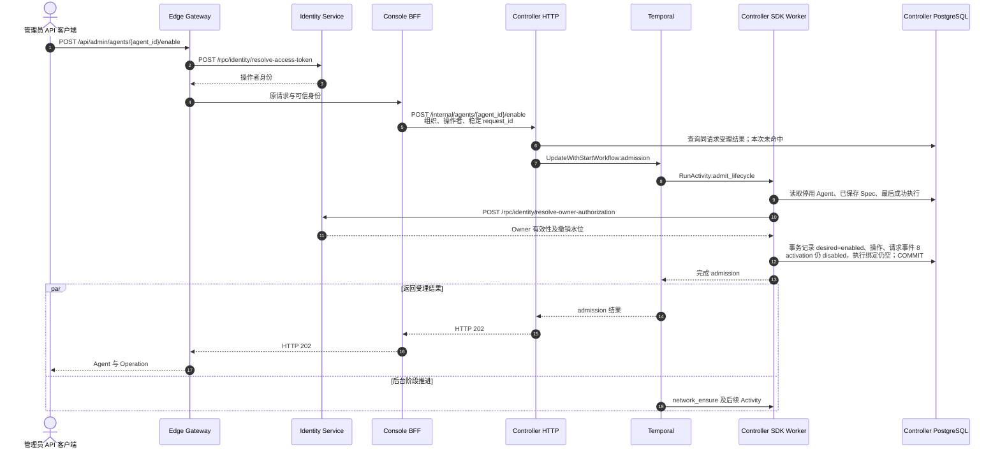
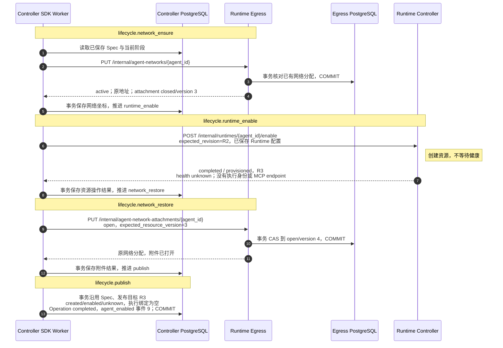
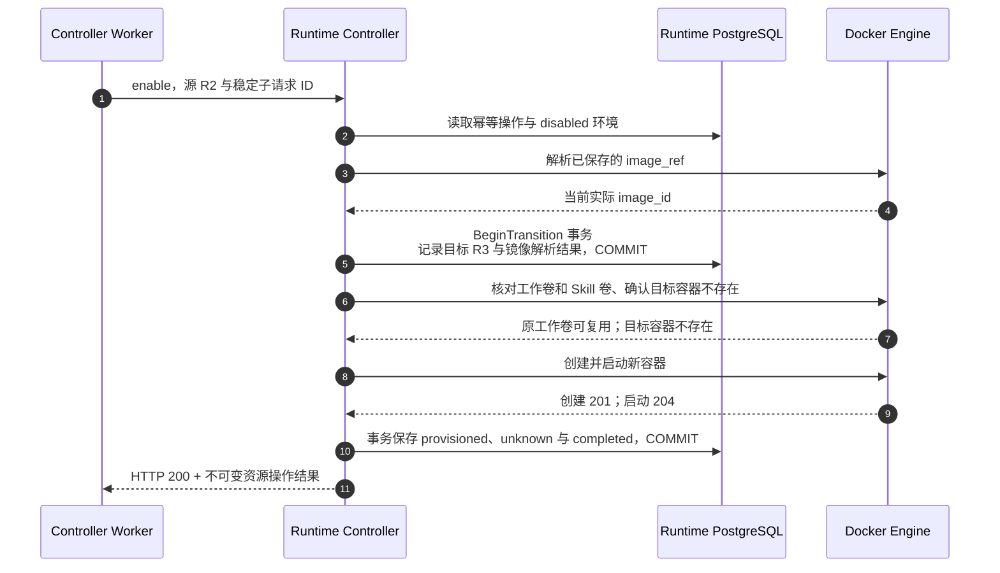
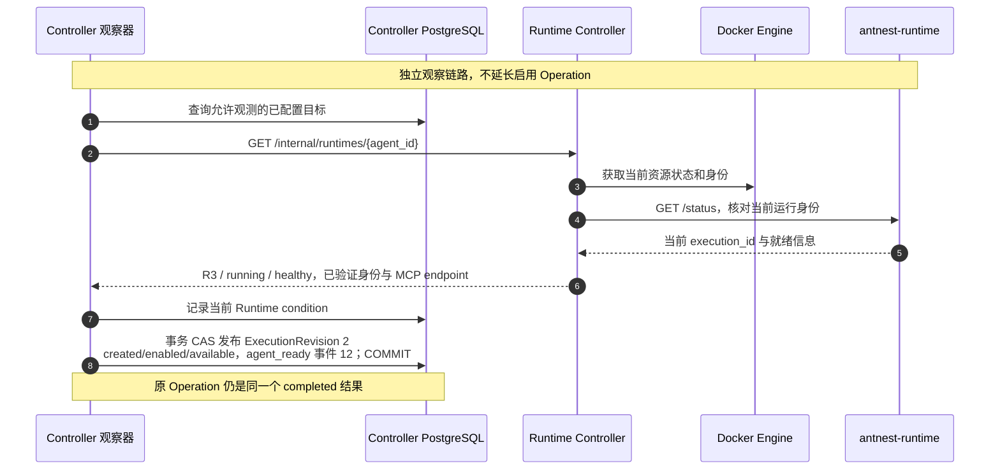

# BF-AGENT-07 启用 Agent

> 更新：2026-09-13。分层状态改造后的启用、独立就绪、资源保留和 Trace 核对通过，等待用户审阅。
> 本轮通过受控 API 客户端调用 Gateway/Console BFF，不是浏览器操作；同键重放已验证。
> [历史四项 Trace](business-flow-agent-lifecycle-traces.md)属于创建/就绪分离前的实现，不能替代本轮证据。

## 1. 入口与结果边界

管理员发起 `POST /api/admin/agents/{agent_id}/enable`，携带 Cookie、CSRF 和 Idempotency-Key。
Gateway 认证操作者，Console 校验管理权限并组装组织范围请求；Controller 再确认 Owner 有效。
启用沿用停用前已保存的 AgentSpec，不自动采用模板的最新修订，不改变网络访问策略。

本业务需要区分三个结果：

1. HTTP 202：启用意图已受理，尚未完成资源操作。
2. Operation completed：新容器已创建启动、配置目标已发布，Agent 为 `created/enabled`，不保证进程已可用。
3. 独立就绪：当前 Runtime 的身份与健康得到确认，发布新执行修订后才允许新的 Run。

运行时不健康、退出、缺失或观测失败都不是“仍在创建”；它们属于已创建 Agent 的运行状态。
不把后续健康变化回写为原 Operation 的失败，也不因为启用完成就直接使用旧执行绑定。
完整模型见 [Agent lifecycle state](agent-lifecycle-state-model.md)。

## 2. 本轮实际时序

[启用主 Trace](http://127.0.0.1:16686/trace/f310cb870db0673ef61424469d2176ee)
包含受理和全部 Temporal Activity；就绪由
[独立观察 Trace](http://127.0.0.1:16686/trace/dffd78c1f21ab7f87b1acf9c954b3865)
确认，通过 Agent、Runtime revision、Operation 和事件关联。

下图只画首次成功路径；同键重放单独核对，没有触发失败重试。
图中合并同类读取，不代表一箭头等于一条 SQL。
Worker 是 Agent Controller 内的 Temporal SDK Worker；各数据库参与者只代表该服务自有数据。

### 2.1 受理与后台推进



Gateway 返回 202 用时 **164 ms**，整条异步业务跨度约 **818 ms**。
后台推进无需等待 HTTP 响应送达；所有生命周期 Activity 仍继承 Gateway Trace，
不是另起一条没有来源的后台请求。

### 2.2 资源与目标发布

本次源 Runtime 为 R2，启用后为 R3，完整标识见第 4 节。



四个推进 Activity 各执行一次，阶段前读取、阶段后事务是本服务的持久化边界，
不是横跨多个服务的数据库事务。打开 attachment 不等于允许公网：
本次 `deny_all/resource_version=1` 始终未变。

### 2.3 Runtime Controller 内部



此 RPC 实际耗时 **397 ms**，没有旧实现中的健康等待循环，也没有调用 Runtime `/status`。
创建前的一次 Docker 404 表示目标容器不存在，是本次存在性检查，不是生命周期失败。
原镜像引用保留在配置中，实际解析出的 SHA-256 单独记录用于追溯。

### 2.4 独立就绪与执行绑定



本轮分别捕获：

| Operation | 已确认启用状态 | Runtime 状态 | 当前可执行绑定 |
| --- | --- | --- | --- |
| running / network_ensure | disabled | absent | 无 |
| running / network_restore | disabled | absent | 无 |
| completed | enabled | unknown | 无 |
| completed | enabled | waiting | 无 |
| completed | enabled | available | 新绑定 |

`agent_enabled` 时间为 `2026-09-13T15:27:21.150229Z`，
`agent_ready` 时间为 `2026-09-13T15:27:24.450824Z`，间隔约 **3.301 s**。
这段时间不是启用 RPC 的耗时。事件序号之间允许插入运行状态变化，不要求相邻加一。
观察器是独立状态核对，因此拥有独立 Trace；不能伪造它是原 HTTP 请求的同步子调用。

### 2.5 页面同步边界

产品页面通过 SSE 事件提示，再查询 Agent 与 Operation 更新状态。
Operation 完成不再代表按钮立即进入可执行状态，仍需当前 Agent 的 activation/runtime/binding。
本轮验收客户端按独立查询记录上述状态，**没有重新验收真实浏览器的 SSE 与交互**。
不能从 API 通过推导页面已通过，也不把查询轮询写成生产页面轮询方案。

## 3. 持久化职责

| 所有者 | 保存内容 |
| --- | --- |
| Agent Controller | Agent 的目标/确认状态、生命周期操作、配置、执行修订、身份绑定、领域事件 |
| Runtime Controller | Runtime 资源修订、镜像引用和实际 image_id、平台资源关联、资源操作、当前观测 |
| Runtime Egress | Agent 的网络分配、策略、attachment 与资源版本 |
| Temporal | 工作流历史、Activity 调度与重试 |

启用目标发布不插入执行修订；独立就绪后才插入新修订，旧执行历史保留。
本轮 PostgreSQL 只读联查确认：Agent 当前绑定、完成操作的目标、就绪事件数据和实际 ExecutionRevision
在 Agent、Spec、Runtime revision、execution_id、endpoint 及发布时间上对应一致。
操作完成时的持久化快照仍是 `provisioned/unknown`，没有执行身份和 endpoint。
检查由验收工具执行，不是服务访问其他服务的表。

## 4. 验收标识与结果

| 项目 | 本轮值 |
| --- | --- |
| 实例 | `antnest-dev-20260911` |
| Agent | `agent_204318bb785ce79d72f8b10387c384ab` |
| 请求 | `lifecycle-04b4ccd53a0b333c17aa34cd2828386d7da32eda8fe43bd4b18c32b141249373` |
| R2，停用源 | `rtv_0db487eda5e35029ad1194ba79c63a9c` |
| R3，启用目标 | `rtv_7f2fc978bdb3a8e298e08f2c428b7c9d` |
| 沿用 Spec | `agentspec_9d75de75caa49df2445fc076ad3f5302` |
| 新执行修订 | `execution-observed_5831427fab92130871bb317f6d4a89ab` |
| 新 Runtime execution_id | `f4debee9-5e3b-42ce-afa3-061e4407ee7e` |
| 原镜像引用 | `antnest/antnest-runtime:local` |
| 实际 image_id | `sha256:d074ed9e6099443e319b1657f548c9bab179d003be7270b046a8878875f66461` |

- [启用 Trace](http://127.0.0.1:16686/trace/f310cb870db0673ef61424469d2176ee)：177 Span，Gateway 根，零缺失父 Span、零 Jaeger warning；五个 Activity（含受理）各执行一次。
- [就绪 Trace](http://127.0.0.1:16686/trace/dffd78c1f21ab7f87b1acf9c954b3865)：61 Span，包含当前 Runtime 身份校验和执行绑定事务，零缺失父 Span、零 warning。
- 同键重放返回同一 Operation，其不可变终态与事件列表均未改变。
- 新容器 `54e70b372845` 为 running/healthy；仍挂载 `antnest-workspace-agent_204318bb785ce79d72f8b10387c384ab`。
  UID 1000 读取 `/workspace/.antnest-disable-acceptance` 得到停用前的完整标记，内容一致。
- 保留原 Spec、原网络策略与身份绑定；执行修订总数从 1 增至 2。
- 独立内部 RPC 探针通过原 Owner 的 `acquire-run` 获得新 Runtime 绑定，
  随即以 `cancelled/none` 调用 `finish-run` 释放；最终活跃准入数为 0。
  这是准入层正向验证，不是一次真实 ACP 对话，没有请求凭证或调用外部模型/工具。
- Agent 保持 `created/enabled/available`，容器与工作卷保留供人工检查；本轮不进入重建或删除场景。

## 5. 复查命令与范围

只读复查已经存在的主 Trace：

```sh
node scripts/observability/check-lifecycle.mjs \
  --kind enable \
  --admission f310cb870db0673ef61424469d2176ee \
  --request lifecycle-04b4ccd53a0b333c17aa34cd2828386d7da32eda8fe43bd4b18c32b141249373 \
  --agent agent_204318bb785ce79d72f8b10387c384ab
```

后续在另一已停用的开发 Agent 上可复用单场景脚本：

```sh
node scripts/observability/exercise-lifecycles.mjs \
  --kind enable --agent <disabled-agent-id> --confirm-development
```

脚本单独观察完成后的就绪，不改变生产 Workflow 的完成语义；
Trace 查询等待六秒导出窗口，不保存原始 RPC 正文和凭证。
本轮没有重新构建服务镜像、故障注入或再次执行完整服务测试。
相关可复用脚本测试串行通过 310 项，`make -j1 fmt-check lint` 通过。
独立只读审查已完成，未发现新增时序或职责边界问题；审查者未运行测试或操作实例，已关闭。
失败/过时观察/重试等正确性证据见此前服务测试及 [状态模型进度](agent-lifecycle-state-model.md)；
不将这一次正常业务链路扩写为所有异常场景均已通过。
