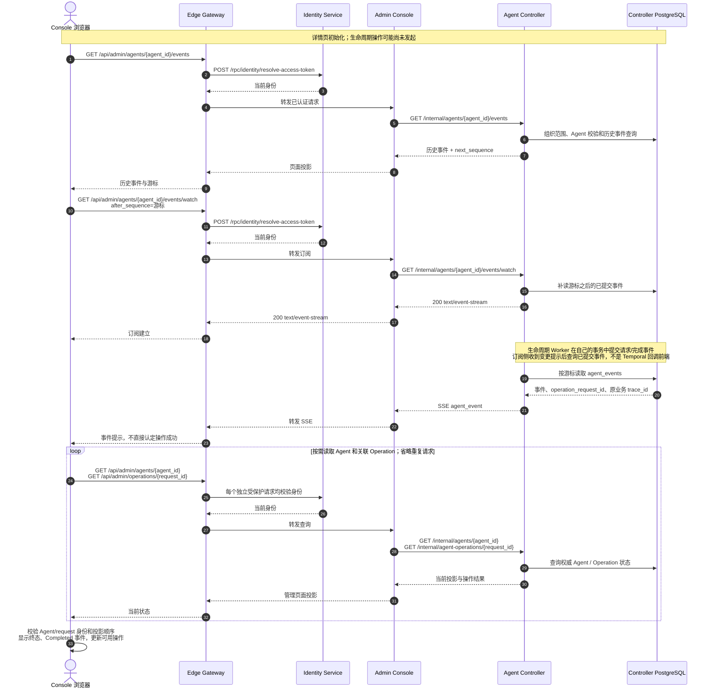

# Agent 生命周期 Trace 验收列表

> 日期：2026-09-13；本文件是创建/就绪分离前的四项流程历史记录，不代表当前状态模型已全部复验。
> 当前创建、停用、启用的独立复验见 [状态模型进度](agent-lifecycle-state-model.md#progress)及各场景文档；历史耗时与就绪等待图不能套用到新版本。
> 实例：`antnest-dev-20260911`；代码基线：`017c105`；入口：`http://127.0.0.1:8090/`。

## 1. 本轮结果

从已通过创建验收的“日常工作助手”开始，在真实 Chrome Console 中依次执行重建、停用、启用、删除。
没有通过内部接口跳过 Gateway，没有重建镜像或重置数据库。每次先确认页面和业务终态，
等待至少六秒后查询 Jaeger，再交叉检查 RPC 参数、数据库记录和 Docker 资源。

| 场景 | Gateway 完整业务 Trace | Span / 服务 | HTTP 202 耗时 | 完整链路耗时 | 业务结果 |
| --- | --- | --- | --- | --- | --- |
| BF-AGENT-05 显式重建 | [c172c47f3f76e84140f1e877bd82dff8](http://127.0.0.1:16686/trace/c172c47f3f76e84140f1e877bd82dff8) | 231 / 7 | 260 ms | 4.009 s | available；新容器、新执行修订，工作文件保留 |
| BF-AGENT-06 停用 | [c15ef62847db390ac1a2dcb472d6ccfe](http://127.0.0.1:16686/trace/c15ef62847db390ac1a2dcb472d6ccfe) | 164 / 6 | 150 ms | 0.981 s | disabled；容器回收、独占卷保留、执行入口清空 |
| BF-AGENT-07 启用 | [c657588ec7ba0662845ff480de9030b1](http://127.0.0.1:16686/trace/c657588ec7ba0662845ff480de9030b1) | 196 / 7 | 181 ms | 3.241 s | available；沿用已保存配置、恢复原卷，发布新执行修订 |
| BF-AGENT-08 删除 | [c1554a3fd194e8444ce2d475421897c2](http://127.0.0.1:16686/trace/c1554a3fd194e8444ce2d475421897c2) | 173 / 6 | 208 ms | 0.777 s | deleted；容器和独占卷回收，审计保留 |

完整链路耗时从 Gateway 接收请求算到该 Trace 的最后一个 Span 结束，不是浏览器渲染时间或性能基准。
四条均只有一个 Gateway SERVER 根，Console 转发、Controller 受理、官方 Temporal Workflow/Activity、
下游 CLIENT/SERVER、事务和 SQL 因果关系完整。缺失父 Span、重复 Span ID、Jaeger warning 均为零。
重建和启用各有一条 Docker CLIENT 404，是创建前确认目标容器不存在；停用、删除无 error Span。
因此不能把“业务成功、零 warning”表述为四条 Trace 的所有 HTTP 都没有错误。

前置创建已经过用户确认：[7fd1c30f9100cd89e94673fe886979b3](http://127.0.0.1:16686/trace/7fd1c30f9100cd89e94673fe886979b3)，181 Span / 7 服务。
其事实与独立遗留见 [创建场景](business-flow-agent-create.md)，不计入本轮四项数量。

## 2. 请求与阶段对照

Agent：`agent_116c8b47b1e9e5edc2c654cdd8cd0edf`。
模板：`template_18e0d318a66f7324024e6334e3e79bd2` revision 1。
操作者与 Owner 均为开发管理员 `admin@example.com`。

| 操作 | Controller request_id | Runtime 子请求 | 本轮事件序号 |
| --- | --- | --- | --- |
| rebuild | `lifecycle-1aa42e417f8c229a19de50062e2b853545a5b335ef361e3f31461c33bd6f5cc5` | `acr_c71eca5e3b17a3e3b06a58e483f44b10` | 3、4 |
| disable | `lifecycle-b945206d8d839b3e5b5e99e1a24d271f8a911b32c31ae0c561dbc5e0e54ddd90` | `acr_f975840b94db51edf5e9a7d58b999900` | 5、6 |
| enable | `lifecycle-af4f99f856478922724d6dae1637096105dbd75f4673b1dff5cd73603eb2c4a6` | `acr_ebadfb780570c18278f955eccf0fe3a7` | 7、8 |
| delete | `lifecycle-56811e7ed887b1d4a57052b04463a76b217d58b79ea8c62aa332357b94881c64` | `acr_4626030c16f0b284aa80ce8295da187c` | 9、10 |

每项均有一次 `admit_lifecycle`，之后以下 Activity 各执行一次，未发生重试：

| 场景 | 实际阶段顺序 | 接口与时序详解 |
| --- | --- | --- |
| 重建 | drain → network_fence → runtime_update → network_ensure → publish | [重建流程](business-flow-agent-rebuild.md) |
| 停用 | drain → network_fence → runtime_disable → publish | [停用流程](business-flow-agent-disable.md) |
| 启用 | network_ensure → runtime_enable → network_restore → publish | [启用流程](business-flow-agent-enable.md) |
| 删除 | drain → network_fence → runtime_delete → network_release → publish | [删除流程](business-flow-agent-delete.md) |

所有源 revision 串联一致；Runtime 返回的 Agent、子请求 ID、目标 revision、completed/effect、
inspection 与其自有操作表相符。重建和启用返回 ready/healthy，停用和删除返回 absent。
启用在受理 Activity 中重新调用 Identity 的 `resolve-owner-authorization`。
重建/启用的 Runtime 执行 ID、MCP endpoint 与 Controller 发布的 ExecutionRevision 一致。
同 revision 重建的两份 Spec 内容相同；启用复用重建后的 Spec，而非生成另一份配置。

## 3. 资源和数据后置条件

### 资源修订对照

四份流程图中的 R1–R5 仅为本次验收的缩写，不是新增协议字段；revision 与 generation 不是同一个概念。

| 图内缩写 | 实际 Runtime revision | 业务时点 | generation |
| --- | --- | --- | --- |
| R1 | `rtv_30831efae790291ab5a0f085fcfb9285` | 创建完成 | 1 |
| R2 | `rtv_4a3a9be2fa25b0b4d669b4a5c5a1ca4e` | 重建完成 | 2 |
| R3 | `rtv_80c2151c9f1becd0e72af9e5f1d48d42` | 停用完成 | 2 |
| R4 | `rtv_40c594134820c332fb3f6e70f6c7a493` | 启用完成 | 3 |
| R5 | `rtv_0d24eb4587c83e51e40b425962761adc` | 删除完成 | 3 |

### 容器、网络与数据

| 时点 | Docker 容器 ID 前缀 / generation | 网络附件 | 实际保留或回收 |
| --- | --- | --- | --- |
| 创建基线 | `2750bdf6fc6e` / 1 | open，version 2 | 原始容器和工作卷 |
| 重建完成 | `04d09ea43ca2` / 2 | closed 3 → open 4 | 旧容器移除，原卷和文件保留 |
| 停用完成 | 无容器 / 2 | closed，version 5 | 原卷仍在，以临时只读容器核对文件后立即回收检查容器 |
| 启用完成 | `e778f94aa7e5` / 3 | open，version 6 | 新容器健康，原卷和文件保留 |
| 删除完成 | 无容器 / 3 | closed，version 7 | 独占卷不存在，共享 Skill 卷仍在 |

- 工作卷为 `antnest-workspace-agent_116c8b47b1e9e5edc2c654cdd8cd0edf`，创建时间始终为 00:58:54，直到删除回收。
- 合成文件 `/workspace/.lifecycle-acceptance-20260913.txt` 在重建前、重建后、停用期间、启用后四次 SHA-256 一致：
  `f8eeab5f60852e31bc283eed76832e9105f21a25dc18074a51a73d89bb45ce5e`。删除时随独占卷回收。
- 原始镜像引用仍为 `antnest/antnest-runtime:local`；重建/启用解析得到的镜像 ID 与实际容器一致：
  `sha256:d074ed9e6099443e319b1657f548c9bab179d003be7270b046a8878875f66461`。本轮未改动标签对应镜像。
- Tunnel IP 始终为 `100.64.0.10`。删除先取得 Runtime 回收结果，再调用 release，将地址从 active/version 1 改为 quarantined/version 2。
  隔离期截止为北京时间 02:03:32；仅验证进入隔离期，不将等待复用计入删除完成条件。
- `deny_all` 用户策略始终未变；附件 open 只代表绑定恢复，不代表开放互联网。
- Controller 保留 1 条 deleted Agent、5 条 completed 生命周期操作、2 份 Spec、3 份执行修订和连续 1–10 的事件。
  每个操作恰有请求/完成两条事件，关联各自主 Trace；删除后的访问绑定 inactive、执行入口为空、无活动操作。
- Console 每次自动显示终态和对应 Completed 事件；删除详情显示 Retained For Audit。
  Current 列表为 0，Deleted 列表为 1，管理员仍可查看该记录。

这些是跨服务验收时只读检查各自数据库的事实，不是让产品服务访问其他服务的数据表。
没有启动模型、ACP Run 或外部 Provider 请求；保留的 DeepSeek 连接仍为合成凭证。

## 4. 简洁性与证据边界

Controller SQL 统计按具有 `db.query.text` 的 Span 计数，包含 BEGIN/COMMIT/ROLLBACK；不是写入行数：

| 场景 | Controller SQL / 写 SQL / 事务 | Egress SQL / 写 SQL | Runtime Controller SQL / 写 SQL |
| --- | --- | --- | --- |
| 重建 | 109 / 15 / 13 | 16 / 2 | 23 / 7 |
| 停用 | 87 / 11 / 11 | 9 / 1 | 19 / 6 |
| 启用 | 87 / 12 / 11 | 11 / 1 | 22 / 7 |
| 删除 | 75 / 13 / 13 | 15 / 2 | 19 / 6 |

只读子 agent 复核指出，现有 Trace 检查器的“阶段有写 SQL + COMMIT”和“RPC 200”不能单独证明业务结果。
本轮补做了请求/资源版本、实际数据库终态、事件完整性、Docker 容器/卷和文件内容交叉断言，四项均通过。
上述交叉检查只保留最终结论，没有将原始 RPC、凭证或 Trace JSON 写入仓库。

仍需单独处理的事项：

- 阶段重复读取完整快照仍然存在，尤其重建有 109 次 Controller SQL。正常链路成功不代表查询已足够精简。
- 创建场景记录的 SSE 正常取消/租期到期标错与 clock-skew warning 仍未修复；本表零 warning 只指四条主业务 Trace，
  不声称所有页面订阅 Trace 都通过。本轮页面自动终态与库存行为已实际查看。
- 发布前 Runtime 失效被游标消费的竞态候选、旧 closeout runner 合同漂移，仍按创建场景记录待处理。
- 本轮为空闲 Agent、无在途 Run、相同模板和镜像输入；不涵盖故障注入、重启恢复、并发准入、标签更新、
  新配置生效、完整页面请求集合、SSE 全量检查或同键重放。既有专项测试不能冒充本轮实机证据。

重查可使用 `scripts/observability/check-lifecycle.mjs`，按 §2 的 kind/request/agent 和 §1 Trace ID 传参。
其输出 `phase_traces` 当前表示阶段数而不是不同 Trace 数；本轮始终是四个操作对应四条主 Trace。
本地 Jaeger 数据依赖当前实例的保存时间，清空观测存储后链接不再是可用证据。

## 5. 共同页面状态同步

四份流程图的 2.1–2.3 来自各自主 Trace；本图补充浏览器如何呈现结果，依据当前页面和服务端实现，
并由本轮实际终态展示佐证。它不是把所有查询和 SSE 拼入同一条主 Trace，也不是本轮新增的 SSE 完整验收。
进入 Agent 详情时即加载历史和建立订阅；不必等本次生命周期 POST 返回 202 才订阅。

图中成对 GET 不是批量 RPC，也不约束它们必须串行；重复刷新和到达竞态由页面状态选择逻辑处理。
流断开时先补读事件和权威状态，再按游标重连，不重新提交生命周期操作。
当前实现入口见 [Console 详情页](../services/admin-console/web/src/pages/agents.tsx)、
[事件查询与订阅](../services/agent-controller/internal/application/event.go)、
[Controller SSE 入口](../services/agent-controller/internal/server/handler.go)。
SSE 的 Trace 独立于生命周期 POST，`operation_request_id` 和事件中的 `trace_id` 提供业务关联，
不能把它伪造成原主 Trace 下的一次长期 RPC。取消/租期的观测噪声仍按 §4 保留。

## 6. Runtime Controller 耗时与重复流程复核

### 6.1 实际耗时

以下按四条主 Trace 的 Runtime Controller SERVER Span 及其子 Span 起止计算，单位 ms。
“就绪等待”从 create 返回到 `runtime.status.verify` 完成，包含采样等待、Inspect 和最终 `/status`；
不能再把其内部 Inspect 耗时叠加一次。数据库事务列为两个事务包裹 Span 的总和，已包含内部 SQL。

| 操作 | Runtime RPC 总时长 | 镜像解析 | 删除容器 | 创建/启动 | 就绪等待 | 删除卷 | 两次 DB 事务 |
| --- | --- | --- | --- | --- | --- | --- | --- |
| 重建 | 3387.027 | 56.414 | 342.595 | 414.354 | 2503.631 | 无 | 47.792 |
| 停用 | 359.235 | 无 | 342.709 | 无 | 无 | 无 | 14.578 |
| 启用 | 2799.261 | 1.476 | 无 | 252.345 | 2502.417 | 无 | 38.620 |
| 删除 | 289.697 | 无 | 249.503 | 无 | 无 | 23.703 | 11.096 |

重建和启用的就绪等待分别占 Runtime RPC 的约 74% 和 89%；六次 Inspect 的实际执行总和分别只有
10.833 ms、10.121 ms，最终 status verify 分别为 0.616 ms、0.578 ms。因此主要瓶颈是等待与采样，
不是数据库或六次 HTTP 请求本身。停用/删除则主要耗在实际容器回收，没有同样的就绪等待。
表中非穷举所有小步骤，不要求各列之和精确等于总时长；也不据此声称运行时提前可用或能节省全部 2.5 秒。

### 6.2 重复与必要复查的区别

1. **启动就绪串联了两层探测，优先复核这个模型。** [waitUntilReady](../services/runtime-controller/internal/control/service.go)
   每 500 ms Inspect，只有 Docker 报 healthy 才执行 Runtime Verify。
   [Docker 配置](../services/runtime-controller/internal/platform/docker/driver.go)启动期每 2 s 执行一次容器内
   `curl --fail /status`，常态间隔 10 s；[Runtime Verify](../services/runtime-controller/internal/runtimeclient/client.go)
   又从控制器访问 `/status`，严格检查 Agent、generation、ready 和 execution ID。
   本地 HTTP 成功与远端可达/身份匹配并不等价，不能直接删除 Verify。
   建议统一启动就绪权威：容器 running 且身份匹配后，由控制器 `/status` 校验决定业务就绪；
   Docker HEALTHCHECK 留作平台健康观测。此方案尚未实施，需同步检查观察器对 starting/healthy 的解释，
   防止刚发布的 Runtime 被旧平台健康结果反向标记。保守替代是健康事件唤醒等待，但它只能减少采样延迟，
   不消除等首次平台探测的时间。实施前需补独立“首次 status ready”测量，不能只凭这条 Trace 估算可省时长。
2. **启用重复检查同一个工作卷，是明确可收敛的一处。** `executeOperation` 先调用 VerifyStorage，
   接着 `Driver.Create` 的 `requireCreateStorage` 又调用同一个 `requireWorkspace`，并额外检查共享 Skill 卷。
   建议把“创建、启动或复用前验证存储”明确为 Create 的合同，再删除 enable 外层重复校验。
   缺卷/所有权冲突/平台异常的错误语义必须保留，不能自动补建空工作卷。本轮外层调用约 0.817 ms，
   这是职责精简项，不是秒级瓶颈；其他独立场景的 VerifyStorage 不因此删除。
3. **重建的源 Inspect 与 Delete 内 Inspect 重复，但承担恢复和破坏前检查。**
   [updateRuntime](../services/runtime-controller/internal/control/update.go)先区分源存在、源已删、目标已创建；
   `Driver.Delete` 再验证 scope/generation/digest，并按实际 container ID 删除。
   可将两者收敛为平台层“检查并删除预期源”的原语，返回足够的源/目标分类，减少一次读取；
   不能简单删掉破坏前身份校验，或把失败后的重新检查替换成缓存的删除前结果。
4. **事务外预读和事务内锁行重读不能全部视为冗余。** `prepareOperation` 先处理终态幂等和源状态，
   [BeginTransition](../services/runtime-controller/internal/repository/postgres/repository.go)在事务内再次核对源、
   锁行并认领操作；完成时仍需验证 attempt。可考虑合并事务外预读的往返，保留事务内 CAS/隔离保护。
   不把镜像解析移进长事务，不因已有 Agent 锁而去掉数据库条件校验。它不是本次主要耗时来源。

独立只读子 agent 已复核上述重复点及安全边界；没有启动额外测试、容器或修改服务代码。
本次只更新现状图与优化建议，尚未执行优化实验；现状图不提前画成建议中的新流程。
