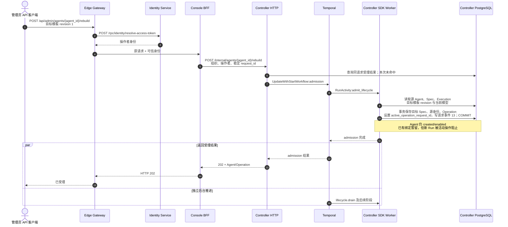
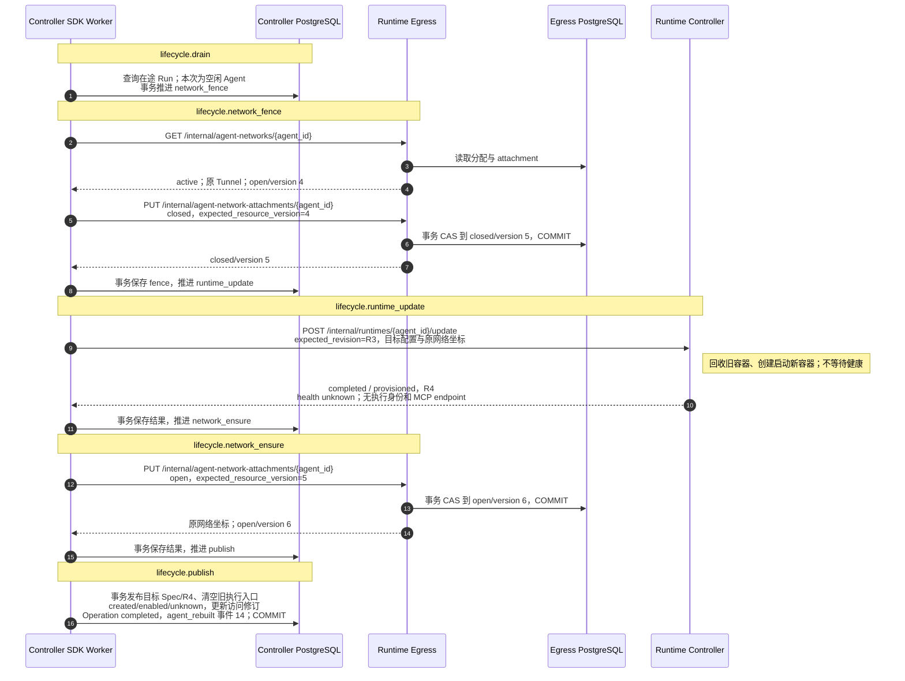
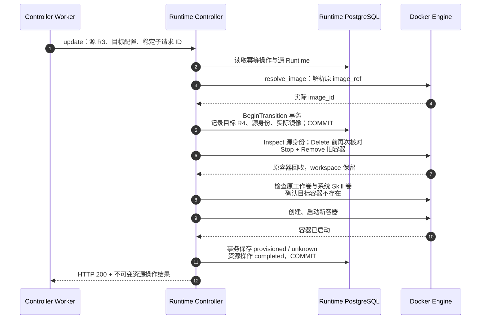
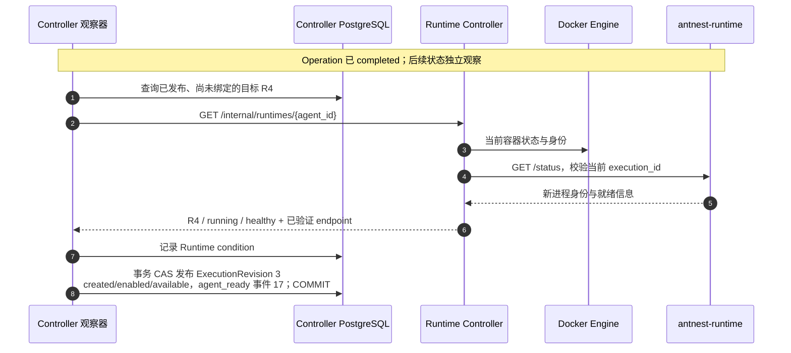
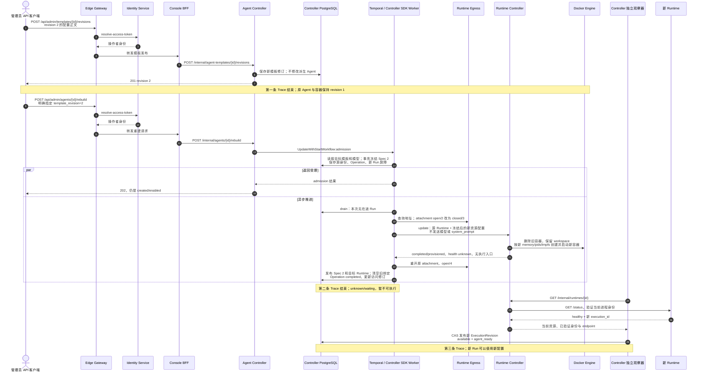

# BF-AGENT-05 显式重建 Agent

> 更新：2026-09-14（Asia/Shanghai）。同配置重建已获用户确认；追加“模板配置变更后重建”复验，进度见第 6 节。
> 本轮通过 Gateway/Console BFF 的受控 API 客户端操作，不是浏览器验收；没有调用外部模型。
> 分离前的重建耗时与健康等待图保留在[历史四项记录](business-flow-agent-lifecycle-traces.md)，不能代表本轮实现。

## 1. 业务入口与边界

管理员发起 `POST /api/admin/agents/{agent_id}/rebuild`，提交目标模板 ID 与 revision，
携带 Cookie、CSRF 和 Idempotency-Key。Gateway 认证操作者，Console 校验管理权限并组装组织范围请求。

重建在受理时冻结目标配置和源 Runtime/执行身份，占用 Agent 的生命周期操作槽位，从而阻止新的 Run。
它不把 Agent 从 `created` 改回 `not_created`，也不增加 `rebuilding` 作为生命周期枚举；
“正在重建”来自当前 Operation。模板发布不会自行重建派生 Agent。

本场景选择与重建前相同的模板 revision 1：仍需显式替换 Runtime。
本次目标 Spec 是新修订，但配置正文和 canonical digest 与原 Spec 相同。
重建有三个不同完成点：

1. HTTP 202：重建已受理。
2. Operation completed：原容器已替换，新配置目标发布；不等于运行时可用。
3. 独立观察确认当前 Runtime 后：发布新的执行修订，开放新的 Run 准入。

## 2. 实际时序

[主 Trace](http://127.0.0.1:16686/trace/ff312d3edadaafc2d21d5059f4ca416b)
从 Gateway 开始，包含 Temporal 受理和全部生命周期 Activity。
[独立就绪 Trace](http://127.0.0.1:16686/trace/92040d8a2892332db0cb4e4af6303e68)
通过同一 Agent、Operation 和目标 Runtime revision 关联，不伪装成创建 RPC 内部健康等待。

图中合并同类读取，不把一箭头当作一条 SQL；各 DB 只代表对应服务的自有数据。
Worker 是 Controller 进程内的 Temporal SDK Worker，不是新增服务。
R3/R4 的完整值见第 4 节。本图只覆盖首次成功路径，同键重放在终态后另行验证。

### 2.1 受理与新 Run 屏障



Gateway 返回 HTTP 202 用时 **189 ms**，整条异步主链路约 **1.332 s**。
后台推进与响应返回没有先后依赖，均始于受理完成；所有 Activity 延续原 Gateway Trace。

### 2.2 阶段与跨服务数据



六个 Activity（含受理）各执行一次，未触发重试。
`network_ensure` 在重建中是重新打开原 attachment，不是新分配地址；
本次用户策略始终为 `deny_all/resource_version=1`。
阶段事务各自提交，不存在跨服务共用事务；Temporal 负责调度、历史和重试，
服务仍负责自身 CAS、幂等和资源事实校验。

### 2.3 Runtime 替换



Runtime update RPC 用时 **814 ms**，没有健康等待循环，也没有内嵌 Runtime `/status`。
旧镜像引用仍是 `antnest/antnest-runtime:local`；本次重新解析的 image_id 与上一轮相同。
因此本轮证明“重建时重新解析原引用并创建新容器”，不证明远端同名标签升级后的拉取行为。

### 2.4 独立就绪



`agent_rebuilt` 时间为 `2026-09-13T16:06:15.564163Z`，
`agent_ready` 时间为 `2026-09-13T16:06:18.475991Z`，间隔 **2.912 s**。
这些时间是 UTC，对应北京时间 9 月 14 日。
就绪后原 Operation 仍为同一个 completed 结果，不随健康变化改写。

实际 API 快照：

| Operation | 生命周期/确认启用状态 | Runtime 状态 | 执行绑定 | 新 Run |
| --- | --- | --- | --- | --- |
| running / drain | created/enabled | available（源观察） | 旧绑定 | 被活动操作阻止 |
| running / runtime_update | created/enabled | available（源观察） | 旧绑定 | 被活动操作阻止 |
| running / publish | created/enabled | available（源观察） | 旧绑定 | 被活动操作阻止 |
| completed | created/enabled | unknown | 无 | 不可准入 |
| completed | created/enabled | waiting | 无 | 不可准入 |
| completed | created/enabled | available | 新绑定 | 按当前权限准入 |

“旧绑定存在”不是可执行性的充分条件。`runtime_state` 是已观察事实，不是对每个阶段进行实时平台探测；
重建中应同时展示 Operation，不能拿源状态 available 当作新容器已经健康。
本轮没有在上述短暂中间阶段实时插入新 Run；中间准入屏障由现有服务集成测试支持，
快照本身不冒充并发竞态测试。

### 2.5 页面与客户端

Console 通过 SSE 提示后查询 Agent/Operation，分别显示重建进度和 Runtime 条件。
本轮使用受控 API 客户端查询捕获上述快照，没有重新验收浏览器表单、SSE 或按钮状态。

重建发布同时轮换 `access_revision`，并在同一事务中更新现有活跃身份绑定及模型输入能力。
Owner 并未改变；旧访问快照不能直接跨越重建继续发起新 Run。
本轮内部 RPC 探针验证旧修订拒绝、新修订准入，不等同于验证 ACP 客户端会自动重新获取访问配置。

## 3. 持久化核对

- Controller 冻结目标 Spec、保留原 Spec 和执行历史，发布目标时不生成已就绪 ExecutionRevision。
- 观察器在独立事务中插入当前执行修订，并将 Agent 与 `agent_ready` 事件关联到本次重建。
- PostgreSQL 只读核对确认：源 Spec/Execution/Runtime 与重建前一致；目标配置正文和摘要与原配置相同。
  总计 2 份 Spec、3 份执行修订，当前绑定只有一份。
- Agent 当前 Spec、Runtime revision、execution_id、endpoint、完成操作和就绪事件对应一致。
  Operation 原始结果仍为 `provisioned/unknown`，无执行身份和 endpoint。
- 同一 Owner 的活跃绑定保留，访问修订变更且与 Agent 一致。测试探针释放后，活跃准入数为 0。
- Runtime Controller 只维护部署资源和观测；Egress 只维护网络分配、规则与附件。
  只读数据库联查是主审验收操作，不是服务跨库访问。

## 4. 本轮证据与保留状态

| 项目 | 值 |
| --- | --- |
| 实例 | `antnest-dev-20260911` |
| Agent | `agent_204318bb785ce79d72f8b10387c384ab` |
| 请求 | `lifecycle-f0e8e3017875037377e0107c040773e577a96b7f48607ceefe14416086cf474c` |
| 源 R3 | `rtv_7f2fc978bdb3a8e298e08f2c428b7c9d` |
| 目标 R4 | `rtv_705941f367bbd5a62f69f104061d0b0a` |
| 目标 Spec | `agentspec-rebuild_c5683ed845d873819368cecdac51966e` |
| 新执行修订 | `execution-observed_ff2d160506560abf03452517248af2bd` |
| 新进程 execution_id | `ee986883-4d22-4c6f-9a10-257ad44bb291` |
| 新访问修订 | `access-rebuild_62134e76cb45821276ffbf5fa584319b` |

- [重建主 Trace](http://127.0.0.1:16686/trace/ff312d3edadaafc2d21d5059f4ca416b)：215 Span，Gateway 根，零缺失父 Span、零 Jaeger warning。
- [独立就绪 Trace](http://127.0.0.1:16686/trace/92040d8a2892332db0cb4e4af6303e68)：61 Span，当前身份验证与执行绑定提交完整，零缺失父 Span、零 warning。
- 同键重放返回原 Operation，完整终态和事件列表均未改变。
- 旧容器 `54e70b372845` 已不存在，新容器 `8f56b0ae45ca` running/healthy。
- 原卷 `antnest-workspace-agent_204318bb785ce79d72f8b10387c384ab` 继续挂载；
  UID 1000 读取 `/workspace/.antnest-disable-acceptance`，内容与重建前完全一致。
- `deny_all/version 1` 不变，attachment 经 `open/4 → closed/5 → open/6`。
- 旧访问修订的合成 `acquire-run` 返回 `403 access_denied`；
  新修订请求返回当前执行绑定，随后 `finish-run(cancelled, none)` 成功释放。
  没有获取 Provider 凭证、执行模型调用或 Agent 工具。
- 此场景结束时 Agent 为 `created/enabled/available`；随后已完成并验收
  [删除回收场景](business-flow-agent-delete.md)，该 Agent 的容器和独占卷已回收。

## 5. 复验方式与限制

只读复查现有重建主 Trace：

```sh
node tests/e2e/observability/check-lifecycle.mjs \
  --kind rebuild \
  --admission ff312d3edadaafc2d21d5059f4ca416b \
  --request lifecycle-f0e8e3017875037377e0107c040773e577a96b7f48607ceefe14416086cf474c \
  --agent agent_204318bb785ce79d72f8b10387c384ab
```

可复用的单场景执行脚本：

```sh
node tests/e2e/observability/exercise-lifecycles.mjs \
  --kind rebuild --agent <available-agent-id> \
  --template <template-id> --revision <revision> --confirm-development
```

第二条命令会实际重建，不能当作只读检查重复执行。
脚本观察 Operation 完成后的独立就绪，并等待六秒导出窗口后核对 Trace。
本轮未执行 ACP 对话、真实在途 Run 排空、镜像损坏/进程退出等故障注入或浏览器验收，
也没有重建服务镜像。已存在的服务集成/竞态测试见
[状态模型进度](agent-lifecycle-state-model.md#progress)，不能将历史测试计作本轮重新执行。

本轮复跑可复用观测/状态脚本测试共 310 项，全部通过；`git diff --check` 通过。
独立只读子 Agent 已复核时序、职责与证据口径，无新增问题，现已关闭。
本轮只更新文档，未改业务代码；没有重复运行上一轮已通过的全部服务编译、lint 和测试。

## 6. 新模板配置重建复验

状态：技术核对通过，等待用户检查。使用新的专用模板和 Agent，不改动既有保留 Agent。
先发布 revision 1 并创建；revision 2 修改模型引用、system_prompt、max_model_requests
及 Runtime memory/pids/tmpfs 配额。镜像引用保持不变，不调用外部模型，不配置新的 MCP。

验收要求：

1. 发布模板 revision 2 只更新模板，不修改已有 Agent 的 Spec、Runtime、当前执行绑定和配置。
2. 显式重建指定 revision 2；配置在受理时冻结，经原有阶段发布后等待独立就绪。
3. Agent 详情、持久化 Spec、新 Run 准入快照和 Docker 实际配额均对应新配置；原历史 Spec 不变。
4. 容器/进程/执行修订被替换，原工作卷和 marker 保留；网络策略与地址不因模板修改而改变。
5. 旧访问修订拒绝新准入，新修订返回新执行快照后立即释放，不调用模型或执行 Agent 工具。
6. 主链路与独立就绪 Trace 均无缺失父 Span / warning，同键重放不重复更改配置或追加事件。

本轮沿用 Gateway/Console BFF API 验收，不包含浏览器、真实 ACP 会话自动刷新配置、
镜像远端标签更新、MCP 配置切换或异常注入。这些不能由配置投影正确推导为已通过。

### 6.1 配置变更与生效证据

| 项目 | revision 1 | revision 2 | 验证位置 |
| --- | --- | --- | --- |
| 模型引用 | `model_3f437e00d041b31e91fe69a2b34d3d10` / DeepSeek V4 Flash | `model_32c60482d4e55762e0734d5f2e77857c` / DeepSeek V4 Pro | Agent 详情、Spec、合成 acquire-run 的 execution_spec |
| system_prompt | `Configuration rebuild acceptance baseline.` | `Configuration rebuild acceptance revised.` | Spec 与合成 acquire-run；公开 Agent 详情不暴露此字段 |
| max_model_requests | 16 | 24 | 详情、Spec、合成 acquire-run |
| memory_bytes | 536870912（512 MiB） | 805306368（768 MiB） | 详情、Spec、Runtime update 请求、Docker HostConfig.Memory |
| pids_limit | 128 | 192 | 详情、Spec、Runtime update 请求、Docker HostConfig.PidsLimit |
| tmpfs_bytes | 67108864（64 MiB） | 100663296（96 MiB） | 详情、Spec、Runtime update 请求、Docker /tmp 的 size |

仅发布 revision 2 后，旧 Agent 的配置、Spec/执行/Runtime 修订、事件集合完全未变，
旧容器和实际配额也未变；同键重放模板发布未产生 revision 3。
显式重建后上述目标全部生效。两份 Spec 的 canonical digest 不同；原 Spec 的整行一致性校验未变，
证明是新增目标配置，不是改写原历史。所有模型信息均来自当前开发库，不是对提供商现行参数的外部验证。

### 6.2 跨配置重建时序



图内跨层返回箭头为响应汇总，实际仍经 Console 和 Gateway 返回。
阶段内各服务使用自有事务，Temporal 不持有跨库原子事务；细化的五阶段和 Runtime 平台步骤沿用第 2 节。
模型、提示词和预算由 Agent Controller 冻结为执行配置；Runtime Controller 只接收部署配置。
这里的冻结指重建受理时的目标 Agent Spec，不表示所有后续 Run 永久使用这个模型修订。
新 Run 准入会按继承的模型 ID 或 Session 覆盖选择读取当前 ModelProfile，并冻结本次 Run 快照；
本轮未在重建与准入之间修改 ModelProfile，故新 Run 模型与目标 Spec 一致。
公开 Agent DTO 只提供 Runtime revision，进程 identity/endpoint 的替换通过 Runtime、持久化与准入 RPC 单独核对。

### 6.3 实际 Trace 与资源标识

| 链路 | Trace | Span / 耗时 |
| --- | --- | --- |
| 发布模板 revision 2 | [fa174dd83bcb9bd97e7d2ea7f4e78bc2](http://127.0.0.1:16686/trace/fa174dd83bcb9bd97e7d2ea7f4e78bc2) | 20 Span；仅 Gateway、Identity、Console、Agent Controller，无 Runtime/Egress 调用 |
| 显式重建 | [130448ae9bdb50399c8c24824d9696df](http://127.0.0.1:16686/trace/130448ae9bdb50399c8c24824d9696df) | 215 Span；202 为 164.187 ms，完整业务 1186.205 ms，Runtime update 661.686 ms |
| 独立就绪 | [94bb688334ebf3cbd8554639d1610086](http://127.0.0.1:16686/trace/94bb688334ebf3cbd8554639d1610086) | 61 Span；Operation 完成约 2.953 s 后发布 available |

三条 Trace 均无缺失父 Span / warning，重建的六个 Activity 各执行一次。
模板发布与随后显式重建是两个管理员请求，就绪是独立观测，不能强行伪造成单一 Gateway 根节点。
其通过同一模板 revision、Agent、Operation、目标 Runtime 和执行修订关联。

| 标识 | 值 |
| --- | --- |
| Agent | `agent_81d31b4536b04fbc9753176137351092` |
| 模板 | `template_30a8f0d888c991ab8350e9ff5faeead6`，revision 1 → 2 |
| 重建请求 | `lifecycle-099557e1fcb16e1d700722e2c97a49faf31b45c770a2d6629844fba1a0cdfa2d` |
| Runtime 子请求 | `acr_f298e55eba36bbded0cf266e7573c698` |
| Runtime 修订 | `rtv_36226c0fbd755e99a8dadaef4605c0b7` → `rtv_416e97ac9a5a7d8d87f04d8cc0762190` |
| Spec 修订 | `agentspec_fc9757f90e2e2363c14738716727b0d1` → `agentspec-rebuild_534bb062868f22ec3622de5c63988ca9` |
| 新执行修订 | `execution-observed_c5e3640a09b895d0468a3d6dca05dc93` |
| 进程身份 | `e96225e1-b6a0-43b5-a768-df576d002e70` → `47bdfc37-72a0-4f48-8dee-a9fbb26e59c8` |
| 容器 | `8f0d831e391f` 已回收 → `6c76abea40ff` 保留 |

镜像仍为 `antnest/antnest-runtime:local`，实际 image_id 仍为
`sha256:d074ed9e6099443e319b1657f548c9bab179d003be7270b046a8878875f66461`。
新容器挂载原 `antnest-workspace-agent_81d31b4536b04fbc9753176137351092`，
UID 1000 读取 `.configuration-rebuild-acceptance`，内容保持不变。
Tunnel 仍为 `100.64.0.15/version 1`，策略仍 `deny_all/version 1`，仅 attachment 经 open/2 → closed/3 → open/4。

重建完成于 `2026-09-13T17:10:25.509511Z`，就绪发布于 `2026-09-13T17:10:28.462028Z`。
就绪前实际观察到 completed/unknown 和 completed/waiting，均无当前执行绑定。
已核对 Agent、ExecutionRevision、Operation 目标、agent_ready 数据和发布时间一致；
不可变资源操作回执仍为 provisioned/unknown、无 execution_id 和 endpoint，没有被就绪结果改写。

旧 access_revision 的新准入返回 403；新 access_revision 返回新模型、提示词、预算和执行身份，
随后立即 finish-run(cancelled, none)，库中 active admission 为 0。这只是内部合成准入探针，
不是模型实际执行或 ACP 客户端自动切换配置的证据。重建同键重放后 Operation 和事件集合不变。
专用 Agent 目前保持 available，容器和工作卷保留供检查；未操作其他 Agent。

### 6.4 可复用验证

`tests/e2e/observability/rebuild-configuration.mjs` 提供公开 DTO 的模板发布隔离与配置切换断言，
配套反例覆盖隐式启动重建、旧配置/修订残留和 Owner 变化。配置正文中的提示词、Docker 配额、
进程身份、事件关联和准入快照另由上述集成检查提供，不能由公开 DTO 断言代替。

```sh
node --test tests/e2e/observability/rebuild-configuration.test.mjs
node tests/e2e/observability/check-lifecycle.mjs \
  --kind rebuild --admission 130448ae9bdb50399c8c24824d9696df \
  --request lifecycle-099557e1fcb16e1d700722e2c97a49faf31b45c770a2d6629844fba1a0cdfa2d \
  --agent agent_81d31b4536b04fbc9753176137351092
```

本批仅增加验收断言、测试和场景文档；未修改生产服务代码或重建服务镜像。
独立只读复核未发现生产职责边界问题，指出了“只验模型 ID、未验模型正文/修订”的断言缺口；
现已补齐失败反例和字段断言，并从冻结 Spec 独立取预期模型，对真实 Agent 详情再次核对通过。
模型冻结口径已补充到 6.2。审查者只读源码与当时文档，现场 Trace/资源由协调者核对，审查者现已关闭。
最终相关脚本测试 315 项通过，零失败/跳过；`make -j1 fmt-check lint` 与 `git diff --check` 通过。
