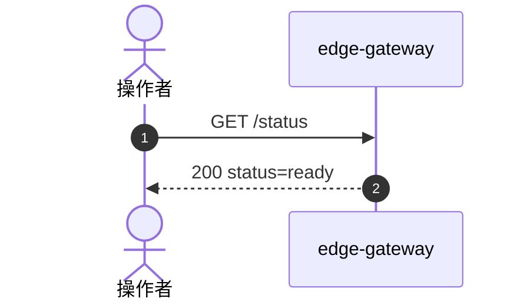

# 空白实例部署流程

> 入口：BF-OPS-01，包含 BF-OPS-02 部署后就绪检查。
> 日期：2026-09-11。部署与自动核验完成，等待用户逐场景复核。
> 当前实例：`antnest-dev-20260911`。不包含登录、模型配置、模板或 Agent 创建验收。

> 复核发现的 Gateway 递归 readiness 与出站 Span 缺口已按
> [统一埋点目标规范](observability-contract.md)改造。下文保留首次部署的旧 Trace，
> 不把历史结果当作当前验收。其他服务的边界改造及最终门禁见
> [服务级统一验收](observability-rollout.md)。

## 1. 发起点与完成条件

根入口是操作者执行 Docker 构建和 Compose 启动，不是 Gateway 业务 API。
完成条件为当前源代码镜像启动成功、服务初始化完成、存储隔离成立、空白业务状态成立，
以及 Gateway 就绪检查成功。容器进入 running 本身不构成通过。

构建与启动使用 [单节点运维手册](docker-single-node-operations.md) 中的命令，
同时加载 `compose.yaml` 和 `compose.stage3.yaml`。后者关闭内部应用的主机端口。
新项目使用独立数据库卷、系统 Skill 卷和 Runtime 管理网络，不复用旧验收数据。

## 2. 启动与数据初始化

| 发起位置                | 接收方 / 入口                       | 本流程中的工作与数据                                                              |
| ----------------------- | ----------------------------------- | --------------------------------------------------------------------------------- |
| 操作者                  | Docker build / Compose build        | 构建 Runtime 和八个应用服务镜像；可复用未变化的 BuildKit 层                       |
| 操作者                  | Docker Compose up                   | 创建本项目网络、卷和十个常驻容器；此时不创建 Agent Runtime 容器                   |
| PostgreSQL 容器启动     | `scripts/postgres-init.sh`          | 创建五个服务数据库及各自登录角色；撤销其他角色的默认数据库连接权限                |
| Runtime Egress 启动     | 自有迁移与网络初始化                | 初始化 `runtime_egress` 数据与转发基础设施；不预置 Agent 网络分配                 |
| Runtime Controller 启动 | 自有迁移与 Docker 观测              | 初始化 `runtime_controller` 数据；连接部署平台，不预置 Runtime 环境               |
| Identity Service 启动   | 自有迁移与 bootstrap                | 创建初始组织、用户、本地凭证、管理员成员关系及身份事件                            |
| Agent Controller 启动   | 自有迁移与 worker                   | 初始化 `agent_controller` 数据、生命周期恢复和身份/Runtime 观测；不预置模型或模板 |
| Agent ACP Service 启动  | 自有迁移、存储检查与恢复            | 初始化会话/Run 存储、取得 worker 所有权并处理未完成工作；空库中无工作可恢复       |
| Admin Console 启动      | 配置加载、内嵌前端和 HTTP listener  | 无自有数据库；默认镜像 tag 是模板输入，不在启动时解析 Docker 镜像                 |
| Agent UI 启动           | Nginx 静态应用入口                  | 仅提供静态资源和状态响应；本次不执行客户端交互验收                                |
| Edge Gateway 启动       | HTTP listener                       | 提供唯一应用主机入口；不创建登录会话或业务资源                                    |
| Jaeger 启动             | OTLP 接收端与查询 UI                | 接收已启用的 trace；本开发配置不承诺重建 Jaeger 后保留历史 trace                  |

Compose 依据依赖和健康状态推进。各服务只执行自己的迁移、只访问自己的数据库。
本次由协调者执行的只读数据库核验是验收操作，不是服务间调用链。

## 3. 就绪检查请求链

操作者发起 `GET /status` 到 `edge-gateway`。当前只检查 Gateway 自身初始化及
listener 可用性，不递归调用下游业务服务。部署整体可用性由每个容器的探针和
独立业务场景确认，而不是由入口服务重复访问整条依赖树。

Identity、Agent Controller、Runtime Controller、Egress 等由各自探针验证，
均不在这次 Gateway 请求中。Console 只检查自身初始化，ACP 只检查自身初始化及自有存储；
两者的 readiness 均不再探测下游服务。
因此还需检查 Compose 的完整服务清单和健康状态，不能只凭 Gateway 返回 200 宣称部署完成。
新建 Runtime 能否成功属于 Agent 创建场景，不由空白部署提前证明。

### 首轮 Gateway 改造复核（历史记录）

本次只重建并替换 `edge-gateway`，镜像为
`sha256:9cbf982a61cc4f8727a9c85ef19dd6f5af70c16733a8013e768417a6c2a3cb5c`。
沿用当前开发实例，未登录、未访问外部模型、未重建其他服务或删除卷。
Gateway 开启 `ANTNEST_TELEMETRY_MODE=diagnostic`。

| 请求 | Jaeger 证据 | 自动核对结果 |
| --- | --- | --- |
| `GET /status` | [自身就绪](http://127.0.0.1:16686/trace/64a98579d984b53b0057547a3cd5f3c6) | HTTP 200，1 个 Gateway SERVER，0 次下游调用；响应诊断事件含 `status=ready` |
| `GET /` | [首页代理层级](http://127.0.0.1:16686/trace/d57d2277fa395c39e5d0e46b20949be6) | HTTP 200，3 个 Span，Gateway SERVER → Gateway CLIENT → Console SERVER；两个 parent ID 精确对应 |

这是 Gateway 边界的验收，尚未证明登录、模型配置、模板创建或 Agent 创建流程。
当时 Console 的 SERVER 已接入公共 Transport 产生的 CLIENT，但内容诊断尚未实现。
本轮 Console 的安全 DTO 诊断已由其自身边界实现，不由 Gateway 猜测业务 DTO；
当前部署和 Trace 以服务级统一验收文档中的结果为准。

本轮代码验证：Gateway 全模块 race 回归通过；仓库 `make fmt-check`、`make lint`
通过。新增测试覆盖脱敏、内容及 Header 上限、未知/不完整内容拒绝采集、错误自动记录、
真实 HTTP 代理父子层级和流式不预读。旧 Jaeger 验收脚本改为检查 Span 类型、RPC
方法和精确父子关系，不再依赖已移除的手工 CLIENT 名称。

### 服务级改造后的当前复核

六个已改造的常驻服务和 Runtime 镜像已重新构建，常驻服务已逐个替换。
本轮没有删除卷或创建业务数据。当前状态及完整门禁见
[服务级统一验收](observability-rollout.md#部署与-jaeger-复核)。

- [当前 `/status`](http://127.0.0.1:16686/trace/227ca8bb7a9c33d60ea126cd4f38d581)：仅 Gateway 的 1 个 SERVER。
- [当前首页](http://127.0.0.1:16686/trace/7463e8fff26dae5adc807315471d8f41)：Gateway SERVER → CLIENT → Console SERVER，3 个 Span。

新的精确父子关系及安全诊断自动检查通过，等待用户检查后再推进登录场景。

## 4. 首次部署结果（历史基线）

| 核验项         | 最终结果                                                                                            |
| -------------- | --------------------------------------------------------------------------------------------------- |
| 镜像           | 九个项目镜像构建成功，允许缓存；运行中的八个应用镜像均与本地构建身份一致                            |
| 容器           | 十个常驻容器运行；九个配置了健康检查的容器 healthy，Jaeger 查询接口实际可用                         |
| 重启计数       | 当前十个容器均为 0；失败的旧 Console 容器已由修复镜像替换，不把首次失败记为通过                     |
| 对外端口       | 仅 loopback Gateway 8090、Jaeger 16686、开发用 PostgreSQL 55432；内部应用无主机端口                 |
| 数据隔离       | 五个数据库各自有同名所有者；25 个角色/数据库 CONNECT 组合中，仅五个本库组合允许                     |
| 初始身份       | 一个组织、一个用户、一个管理员成员关系、一个本地凭证；登录 token 为 0                               |
| Agent 管控数据 | Model Profile、模型修订、Provider 凭证、模板、Agent、生命周期操作均为 0                             |
| 使用与运行数据 | ACP Session/Run、Runtime 环境/操作、Egress Agent 网络/分配/attachment 均为 0；动态 Runtime 容器为 0 |
| 就绪请求       | Gateway 返回 200，`status=ready`                                                                    |
| 后续业务       | 未登录，未调用外部模型，未创建 Model Profile、模板或 Agent                                          |

开发地址为 <http://127.0.0.1:8090>。本项目保留供后续人类验收；旧项目遗留卷和网络未使用、未删除。
配置位于 Git 忽略的 `.env`，文件权限为 0600，三项加密密钥独立生成。

### 本次发现并修复

Admin Console 的环境配置仍要求默认镜像必须是 digest，与 `.env.example` 和页面接受
tag 的设计冲突。首次启动因此退出。修复移除 Console 的重复镜像格式约束，
保持 Controller 对模板发布时镜像解析与不可变绑定的权威。

回归测试先证明三个 tag 输入在旧实现中失败，再验证 tag、带端口的仓库地址、
镜像 ID、digest reference 与空默认值的预期行为。Console 全部 Go 测试含 race 通过；
根目录 `make fmt-check`、`make lint` 通过，Go standard 为 0 issues，Rust Clippy 拒绝警告。
修复后重新构建并启动 Console。其最终镜像为
`sha256:dc6c1d5deb0067d5023e44af3d2c375817c92d650948b8698167c55144b878e3`。
其余应用无本轮代码修改；缓存的 Docker 测试层不计为新执行的单测。

## 5. Jaeger 核对

[打开首次部署的历史就绪检查](http://127.0.0.1:16686/trace/22d2eeee5c58551b3cd7e3965fe3d3ea)。
该 Trace 是改造前的证据，不再代表当前 Gateway 的调用流程。

实际页面显示四个服务、12 个 spans，总时长约 5 ms；这是一次请求观测，不是性能基准。
首次查询时各服务尚未全部批量导出，只有 Gateway spans；等待导出后再次查询并在浏览器核对了完整的当前结果。

| 预期调用                      | 本 trace 的实际可见内容                                               |
| ----------------------------- | --------------------------------------------------------------------- |
| 操作者请求 Gateway            | Gateway 根 span，HTTP 200                                             |
| Gateway 检查 Identity         | `identity.status` 下的 Identity HTTP span 与 repository ping          |
| Gateway 检查 Agent Controller | Gateway 的 `agent_controller.status` 调用 span                        |
| Gateway 检查 Console          | Console HTTP span，HTTP 200                                           |
| Console 检查 Identity         | Console 调用 span 下的 Identity HTTP span 与 repository ping          |
| Console 检查 Agent Controller | Console 的 `agent-controller GET` span，HTTP 200                      |
| Gateway 检查 ACP              | ACP 的 `postgres.ready` 与 `agent_controller.status` 沿用本请求 trace |

当前可观测性边界不能隐去：

- Agent Controller 成功的健康请求刻意省略服务端 span，因此它没有作为第五个服务出现在本 trace 中。
- ACP 状态入口没有独立 HTTP server span，其 readiness 内部 spans 直接延续传入上下文。
- Agent UI 是静态 Nginx 服务，没有状态请求 span；本次图不能单独证明这一跳，只能结合完整状态检查代码、Gateway 最终响应与独立健康检查核对。
- Docker 镜像构建、数据库初始化和 Compose 调度没有统一 Gateway 根 trace。上述链接只证明已埋点的就绪检查，不能冒充完整启动 trace。

已埋点部分的调用关系与当前代码一致；是否要求进一步补齐健康检查的每个 HTTP 边界，
留待本场景人类复核。尚不标记为“所有部署步骤均已通过 Jaeger 可视化”。

## 6. 接下来才写入 Model Provider

本实例没有自动注入 Model Provider。它是模板创建的必需前置流程：

`管理员登录 -> 创建 Model Profile -> 创建模板 -> 创建 Agent`。

创建 Model Profile 从 Console 发起，经 Gateway 的 `POST /api/admin/model-profiles`
进入 Console BFF，再调用 Controller 的 `POST /internal/model-profiles`。
数据写入 `antnest_agent_controller` 数据库中的 `agent_controller.model_profiles`、
`model_profile_revisions` 与加密的 `provider_credentials`，不是内置模型目录，也不是直接填库。
此项等待登录场景复核后执行，本次仍保持零记录。

## 7. 实现依据

- [Compose 定义](../compose.yaml)与[对外入口覆盖配置](../compose.stage3.yaml)。
- [Gateway 就绪检查](../services/edge-gateway/internal/server/handler.go)与[HTTP trace](../services/edge-gateway/internal/telemetry/http.go)。
- [Console 就绪检查](../services/admin-console/internal/server/handler.go)与[默认镜像配置](../services/admin-console/internal/config/config.go)。
- [Agent Controller 健康请求观测策略](../services/agent-controller/internal/telemetry/http.go)。
- [ACP 状态入口](../services/agent-acp-service/src/transport/http-server.ts)。
- [数据库初始化](../scripts/postgres-init.sh)与[Identity bootstrap](../services/identity-service/internal/repository/bootstrap.go)。
- [Model Profile 持久化](../services/agent-controller/internal/repository/postgres/catalog.go)。
