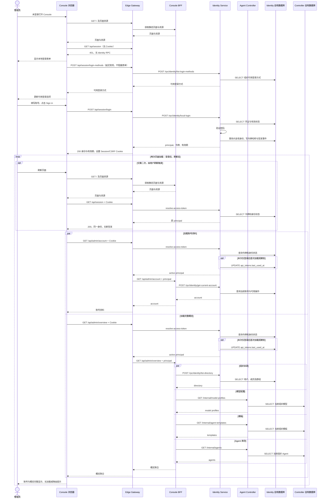

# BF-AUTH-01 管理员登录并进入可用的 Console

> 更新：2026-09-12；服务代码 `8082e34`；实例 `antnest-dev-20260911`。
> 前置：更新部署的入口检查已获用户确认；本轮保留已有数据库。
> 状态：真实浏览器流程及对应 Trace 已核对，用户已确认，允许继续 Provider 场景。

## 1. 用户目标与验收终点

**未登录打开 Console → 填写管理员账号并登录 → 账号与概览完整显示 → 刷新页面后仍可正常使用。**

这是一条端到端用户流程，不是登录、会话查询、账号查询四个独立场景。
`GET /api/session` 是页面初始化的自动步骤；各数据请求仍独立经过 Gateway 鉴权。
成功条件不是登录接口 200，也不是页面刚出现 `Session active`，而是账号资料和概览数据全部加载完成。

本次由协调者使用真实 Chrome 页面执行，未用 API 脚本代替表单操作：

1. 退出开发实例原有浏览器登录，重新加载首页，确认出现登录表单。这是测试前置，不清空数据库。
2. 使用部署引导的合成管理员填写表单，点击一次 Sign in，等待账号资料与概览加载完成。
3. 确认身份为 Antnest Administrator、组织 Engineering；成员 1、模型配置 3、模板 3、Agent 3。
   三个 Agent 均为 disabled，Available 为 0，与库存及状态分布一致。
4. 执行浏览器刷新，再次等待完整页面，确认同一身份、组织和数据；不重新输入密码。
5. 检查 DOM 与页面截图：没有停留在 loading、登录表单或降级数据提示。保留最终页面供人工检查。

浏览器日志中发现翻译扩展的网络错误，来源为 `chrome-extension://`，不是 Antnest 页面异常；
不能因此声称浏览器控制台完全零错误。未登录时的会话查询 401 是预期控制流。
本轮不改权限、Provider、模板或 Agent，不调用外部模型。

## 2. 真实页面动作对应的 Trace

业务接口时间窗口为 `2026-09-12T13:10:18.841Z` 至 `13:12:34.810Z`。
按浏览器动作时间、入口路由及下游 Console 路由核对，共 8 次业务接口请求：

| 用户流程阶段 | 自动请求 | Jaeger | Span 数 | 根请求耗时 |
| --- | --- | --- | ---: | ---: |
| 未登录打开页面 | `GET /api/session`，401，Gateway 本地返回 | [初始状态检查](http://127.0.0.1:16686/trace/63cae4d2668e08fecd7547b742ead323) | 1 | 0.198ms |
| 显示登录表单 | `POST /api/session/login-methods` | [查询可用登录方式](http://127.0.0.1:16686/trace/49f9aed3b376aab76d34eb4e1bb6286d) | 4 | 3.550ms |
| 提交表单 | `POST /api/session/login` | [管理员登录](http://127.0.0.1:16686/trace/ab2c085a03a913c831fac764b9dd3814) | 12 | 211.635ms |
| 登录后页面加载 | `GET /api/admin/account` | [加载账号](http://127.0.0.1:16686/trace/79e6f6722edd13f4006856f4af48b438) | 13 | 25.118ms |
| 登录后页面加载 | `GET /api/admin/overview` | [加载完整概览](http://127.0.0.1:16686/trace/0cff9b77ce9c8c69ff5e3441f4b8f116) | 21 | 26.189ms |
| 刷新同一页面 | `GET /api/session`，200 | [刷新时确认身份](http://127.0.0.1:16686/trace/945e20a33a9f90b95d84000068778604) | 4 | 3.273ms |
| 刷新后页面加载 | `GET /api/admin/account` | [重新加载账号](http://127.0.0.1:16686/trace/fe088e93de011dd02991481688978bd0) | 12 | 6.654ms |
| 刷新后页面加载 | `GET /api/admin/overview` | [重新加载完整概览](http://127.0.0.1:16686/trace/a68cd61c1c74643ef6f45f23aff76ef0) | 20 | 6.727ms |

上述不是八个业务场景。当前浏览器没有统一的前端操作根 Span，独立 HTTP 请求各有一条 Gateway 根 Trace；
本文按实际动作关联它们，不伪造一棵共同的 Trace 树。本次关联使用动作时间窗口与 Jaeger 请求集合，
不是浏览器网络拦截提供的逐请求 ID。静态资源通过 Gateway → Console 加载；平台探针不属于用户登录流程。

读取 Trace 前距请求完成已超过约定的 6 秒。八条 Trace 均无 Jaeger warning、缺失父节点或重复 ID；
除预期的初始 401 外，成功请求及子 Span 无错误记录。6 秒是等待窗口，不是迟到 Span 的绝对保证。
耗时仅是开发样本，不能将并行或嵌套 Span 相加作为页面耗时。

## 3. 端到端时序

图中两次加载表示本次两个页面呈现，不是后台轮询。登录方式查询是表单的自动发现步骤，
不是独立登录行为；本地登录不要求管理员再做一次“查询登录方式”。

## 4. 职责、成本与数据边界

- Gateway 接收全部外部请求，处理 Cookie、登录限流与逐请求认证；不访问业务数据库。
  登录调用 Identity；会话查询无 Cookie 时本地返回 401，携带格式有效的会话 Cookie 时调用 Identity 解析身份。
  账号、概览在鉴权后代理给 Console BFF。
- Console 浏览器负责页面交互，BFF 负责账号/概览的数据聚合；不直接访问其他服务的表。
- Identity 拥有身份和令牌数据。登录的一次事务包含 BEGIN、三次持锁 SELECT、两个 INSERT、COMMIT；
  事务外另有一次凭证 SELECT，共 8 次 SQL。`api_tokens` 仅存令牌哈希，
  `identity_events` 写 `access_token.issued`。刷新不重新签发令牌。
- Controller 只查询本组织的模型、模板、Agent；本次列表链不调用 Runtime、ACP、Egress 或 Temporal。
  概览的默认镜像来自 BFF 配置，不为渲染概览调用 Runtime Controller。
- 全流程有 **5 次 resolve-access-token**：登录后账号/概览各一次；刷新时身份检查、账号、概览各一次。
  页面初始化确认身份不能替代后续 API 自身的鉴权。这些不是五次登录。
- 登录后两个并行数据请求各观察到一次 `last_used_at` UPDATE；刷新后的三次校验均只有 SELECT。
  这是现有五分钟使用采样及并发首次使用的表现，不以 UPDATE 数量证明登录有效或强求它只有一次。
- SQL Span 来自驱动，标题为实际 OP；事务单独包裹内部 SQL。已核对 SQL 的服务归属和 HTTP CLIENT/SERVER
  父子关系，无 Repository 手工包装、pool.acquire 或 prepare 噪声。

概览 200 本身不够证明完整：BFF 对部分依赖允许降级。此次同时检查全部四类数据与页面状态。
页面“Model providers 3”的当前统计口径实际为 **model profiles 数量**，不是 provider connections 数量；
此处记录事实，不将文案一致性或其他页面宣称为已经完成新的产品验收。

## 5. 可复用检查与范围

[登录接口验收器](../scripts/observability/exercise-local-admin-login.mjs)仍用于 Cookie、令牌撤销及重放拒绝等
API 级回归，不作为真实浏览器流程的替代；其“新令牌首次 GET”样本不能冒充真实页面刷新。
[Trace 图检查](../scripts/observability/trace-tree.mjs)和
[成功 Span 检查](../scripts/observability/successful-span.mjs)用于本次现场核对父子关系、SQL 所属与错误记录。

复验应重复 §1 的浏览器动作，再按 §2 检查各页面阶段，不能只重放其中两个接口。
已有脚本回归命令为 `node --test --test-concurrency=1 scripts/observability/*.test.mjs`。
本次串行回归 230 项通过；三份相关文档 76 个本地文件链接有效，`git diff --check` 通过。
只读子 agent 复核后，已修正表单与自动发现的先后、首次使用 UPDATE 和无 Cookie 本地返回的图文表述；
审查者已关闭，没有执行测试、访问浏览器或凭证。
此前接口样本的数据库增量及撤销验证属于辅助证据，不作为本次浏览器令牌的新数据库取证。
本轮没有更改产品代码、重建镜像或扩大到失败分支、并发撤权及外部 IdP 的验收。

开发 Jaeger 按既定规范采集离散 RPC 正文，可能包含合成密码和令牌；本文与检查输出不保存这些内容。
普通 HTTP 不采集正文，SQL 不采集参数和结果。Jaeger 不应公开分享。

实现依据：[浏览器初始化](../services/admin-console/web/src/App.tsx)、
[登录表单](../services/admin-console/web/src/pages/login.tsx)、
[概览页面](../services/admin-console/web/src/pages/dashboard.tsx)、
[Console BFF](../services/admin-console/internal/server/handler.go)、
[Gateway](../services/edge-gateway/internal/server/handler.go)、
[Identity 认证](../services/identity-service/internal/localauth/service.go)、
[Identity 持久化](../services/identity-service/internal/repository/localauth.go)。

本场景已获用户确认，下一项为 [Provider 连接与模型](business-flow-provider-connection.md)。
