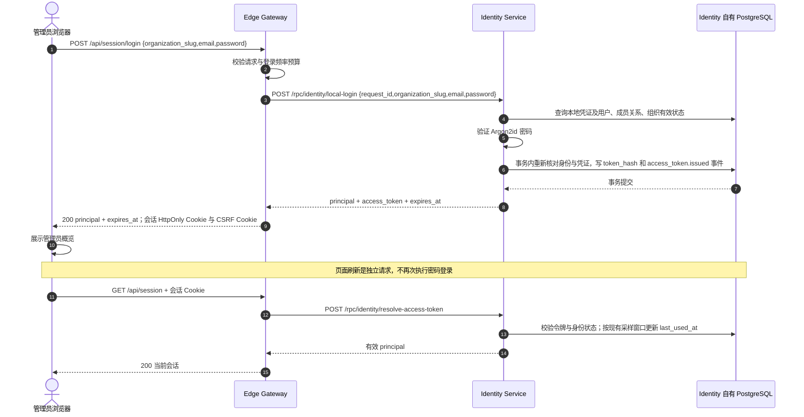

# BF-AUTH-01 管理员本地登录

> 更新日期：2026-09-12。实例：`antnest-dev-20260911`。
> 状态：用户已确认最新登录链路，当前推进模板创建。
> 前置：用户已确认 BF-OPS-01 部署场景，可以推进本地登录。

## 最新复验

用户已确认 [最新登录 Trace](http://127.0.0.1:16686/trace/f07f6ff96cd0d4a1ea1014f253b0d568)：
12 个 Span、Gateway → Identity 1 次、8 个实际 SQL Span，其中 7 个属于一个已提交事务，
0 Jaeger 警告。SQL 使用驱动默认操作名；没有 Repository 包裹、prepare 或 pool.acquire 噪声。
事务层级和统一采集方式见 [数据库埋点整改记录](observability-database-remediation.md)。
查询前固定等待 6 秒，无需修改服务的批量导出配置。

以下第 1 至 4 节保留初次验收快照，其中令牌行数、旧 Trace 和脱敏规则不是当前
运行状态。现行规则以 [埋点规范](observability-contract.md) 及
[采集简化复验](observability-simplification.md) 为准：当前开发实例开启离散 RPC
全量正文采集，因此登录密码和签发令牌可出现在本地 Jaeger；普通 HTTP 不采集正文。
后续场景见 [BF-CAT-02 Provider 连接](business-flow-provider-connection.md) 和
[BF-CAT-06 模板创建](business-flow-template-create.md)。

## 1. 场景与边界

从 <http://127.0.0.1:8090> 的 Console 登录页面发起，使用部署引导创建的
`engineering` 组织及合成管理员 `admin@example.com`。凭证不写入本文或 Trace。
本次只提交一次登录并刷新一次页面；不修改密码、权限、模型、模板或 Agent。

## 2. 请求与持久化



业务数据仅写入 Identity 自有数据库 `antnest_identity`：

| 数据 | 本次行为 |
| --- | --- |
| `users`、`local_credentials`、`organizations`、`organization_memberships` | 读取并验证已有身份，不创建用户或更改角色 |
| `api_tokens` | 新增一条令牌记录，保存哈希而非明文；后续请求解析同一令牌 |
| `identity_events` | 与签发同事务追加一条 `access_token.issued` |

Gateway 不另建登录数据库或服务端会话表。原始令牌只用于内部 RPC 返回和浏览器
HttpOnly Cookie，不放进浏览器 JSON 或诊断正文。

## 3. 实际 Jaeger 拓扑

[本地登录 Trace](http://127.0.0.1:16686/trace/e70748e743b745c98fd513708d460dcf)
共 5 个 Span，Gateway 根请求约 220.6 ms，HTTP 200：

```text
edge-gateway SERVER  HTTP POST /api/session/login
  edge-gateway CLIENT  HTTP POST identity-service
    identity-service SERVER  HTTP POST /rpc/identity/local-login
      identity-service CLIENT  identity.repository.find_local_credential
      identity-service CLIENT  identity.repository.issue_access_token
```

两个存储 Span 是存储边界操作，不代表只执行两条 SQL；签发 Span 包含事务内身份
重新校验、令牌写入和审计写入。没有额外密码验证 Span，密码验证耗时包含在 Identity
SERVER 中，不以未采集的细分耗时作诊断结论。

本链路不应出现 Console SERVER：页面已经加载，登录 API 由 Gateway 直接处理。
登录后 `/api/admin/*` 的鉴权与 BFF 数据读取属于独立 HTTP 请求，不是再次登录。
两条被核对的链路均无 `/status` 子调用。

[刷新会话 Trace](http://127.0.0.1:16686/trace/a7fbc328ea703255e5365adceb48ce27)
共 4 个 Span，HTTP 200：Gateway SERVER → Gateway CLIENT → Identity SERVER →
`identity.repository.resolve_access_token`。没有再次执行 `local-login` 或签发令牌。

## 4. 最终核对结果

| 检查 | 结果 |
| --- | --- |
| 浏览器真实表单登录 | 显示 `Antnest Administrator`、`System administrator`、`Engineering` 与 `Session active` |
| 页面刷新 | 无需重新输入密码，恢复同一管理员会话 |
| 配置数据未提前创建 | 概览显示模型 0、模板 0、Agent 0，组织成员 1 |
| 数据库只读核对 | 令牌总数 1、有效令牌 1；哈希长度符合实现；`last_used_at` 已更新 |
| 审计记录 | `access_token.issued` 1 条；保留原 `identity.bootstrap.completed` 1 条 |
| 统一 Jaeger 验证器 | 两条 Trace 均通过根、直接父子关系、字段类型与诊断预算检查；Gateway → Identity 各 1 次 |
| 诊断内容 | 登录 6 项、刷新 5 项安全正文投影；合成密码及其 URI/Base64 形式未进入 Trace |

复核方式复用 `scripts/observability/check-trace.mjs`，分别指定
`/api/session/login` 与 `/api/session`，预期根 `edge-gateway`、HTTP 200、
`hops=[["edge-gateway","identity-service",1]]`。不保留原始 Trace、Cookie、数据库
转储或过程截图。本次未修改产品代码，也未重复启动全量测试或临时实例。

本场景不代替 OIDC、普通用户隔离、密码修改、退出登录或故障场景的后续验收。
等待用户检查登录 Trace 后，下一项为 **BF-CAT-02 创建组织 Model Profile**，
再进入模板创建与 Agent 创建。

实现依据：[Gateway 登录](../services/edge-gateway/internal/server/handler.go)、
[Identity RPC](../services/identity-service/internal/rpc/handler.go)、
[本地认证](../services/identity-service/internal/localauth/service.go)、
[Identity 持久化](../services/identity-service/internal/repository/localauth.go)。
