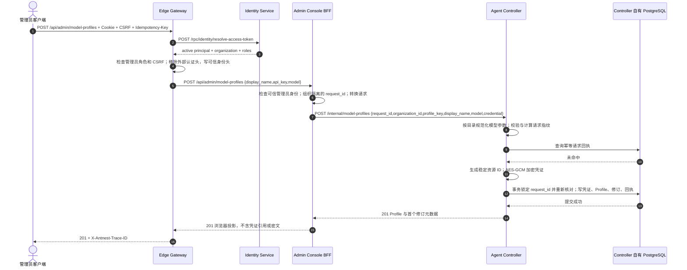

# BF-CAT-02 创建组织 Model Profile

> 日期：2026-09-11。实例：`antnest-dev-20260911`。
> 状态：旧合同历史验收；当前实例已改为 Provider 连接/模型分离，原资源已清理。
> 前置：BF-AUTH-01 登录链路已获用户确认；用户明确批准导入 DeepSeek Key。

本场景讨论后确定了 [Provider 凭证与模型分离](provider-credentials-and-models.md) 的
后续设计：DeepSeek 预填可编辑模型，凭证独立维护，并预留订阅认证扩展。本文保留
旧合同的实际验收结果，不作为新合同已经实现或验收的证据。
新合同的当前验收见 [Provider 连接与初始模型](business-flow-provider-connection.md)。

## 1. 场景与边界

管理员通过 Gateway 的 Console API 配置组织可用模型。模型目录只提供预设元数据，
不会自动创建 Provider 或凭证。此次按目录选择 `deepseek-v4-flash`，创建首个
Model Profile 和不可变修订，作为后续模板创建的前置资源。

本次创建由验收客户端调用 `POST /api/admin/model-profiles` 完成，使用与 Console
相同的 Cookie、CSRF 和幂等请求接口；浏览器验证新增表单、刷新后的列表及详情。
不将 API 提交宣称为浏览器点击提交。Key 从外层仓库根目录 `.secret` 读取，
不写入本文或终端输出。当前开发实例开启 RPC 全量采集，Key 会进入本地 Jaeger；
用户已知晓并批准。数据库密文存储与 Trace 全量采集是不同边界。

本轮不调用 DeepSeek，不验证 Key 的外部有效性，也不创建模板、Agent 或 Runtime。

## 2. 请求与时序



创建后的读取是独立请求：列表 `GET /api/admin/model-profiles`、详情
`GET /api/admin/model-profiles/{id}`、修订 `GET /api/admin/model-profile-revisions/{revision_id}`。
均经 Gateway 鉴权、Console BFF 转发、Controller 组织范围校验，不属于创建 Trace 的子调用。

## 3. 数据归属

配置只写入数据库 `antnest_agent_controller` 的 `agent_controller` schema：

| 表 | 本次业务数据 |
| --- | --- |
| `model_profiles` | 1 条组织模型配置，启用状态，指向当前修订 |
| `model_profile_revisions` | 1 条修订，固化模型参数、价格和凭证引用 |
| `provider_credentials` | 1 条 AES-GCM 密文、nonce 与密钥版本，不保存明文 Key |
| `catalog_requests` | 1 条创建请求回执及指纹，用于幂等重放 |

Gateway、Console 不保存 Provider 数据。Identity 在自己的存储中解析令牌，
不会访问上述表。Controller 的组织标识属于跨服务业务引用，不是跨库外键。

应用层幂等预读用于快速返回已有结果；事务内复查用于应对并发提交，不能用前者
替代后者。Trace 中两个存储 Span 是两次存储边界调用，不代表只执行两条 SQL。

## 4. Jaeger 核对

[Provider 创建 Trace](http://127.0.0.1:16686/trace/0ae97ef4bb45a3b42b5fb31975da768a)

```text
edge-gateway SERVER  POST /api/admin/{path...}
  edge-gateway CLIENT -> identity-service
    identity-service SERVER  POST /rpc/identity/resolve-access-token
      identity-service CLIENT  identity.repository.resolve_access_token
  edge-gateway CLIENT -> admin-console
    admin-console SERVER  POST /api/admin/model-profiles
      admin-console CLIENT -> agent-controller
        agent-controller SERVER  POST /internal/model-profiles
          agent-controller CLIENT  agent_controller.repository.replay_model_profile_request
          agent-controller CLIENT  agent_controller.repository.create_model_profile
```

共 4 个服务、10 个 Span；3 条跨服务调用各 1 次。创建 HTTP 201，身份解析 HTTP 200，
无错误 Span、缺失父 Span、重复调用或 Jaeger 警告，无 `/status` 或外部 Provider 调用。
2 个接收 RPC 边界各记录请求和响应，合计 4 条正文事件；HTTP BFF/代理不重复采集正文。
复用 `tests/e2e/observability/query.mjs`，查询前等待 6 秒，只执行一次普通 Trace 查询。

## 5. 验收结果与边界

| 核对项 | 结果 |
| --- | --- |
| 创建响应 | HTTP 201，启用，revision 1 |
| 读取一致性 | 列表、详情与修订的资源 ID、模型参数、价格一致 |
| 浏览器展示 | 刷新后显示 1 条 DeepSeek、`deepseek-v4-flash`、Enabled、revision 1；详情可打开 |
| 凭证边界 | 三类公开读取及创建响应不含明文 Key 或内部凭证字段；数据库密文非空、nonce 结构有效 |
| 数据行数 | Profile / revision / credential / create request 各 1；模板 0、Agent 0 |
| Trace | 10 Span，4 条 RPC 正文事件，0 warnings；父子关系与上图一致 |
| 外部连通性 | 未执行模型请求，不能据此宣称模型调用可用 |

记录一个非阻断差异：创建响应时间戳保留纳秒，数据库读回为微秒；此次
`created_at` / `updated_at` 相差 13 ns。最初全对象逐字比较因此失败；后续分别核对
全部业务字段及实际时间差，未重复创建，也未修改产品实现。需要逐字稳定的响应时，
应统一创建与读回时间精度，不应将该差异描述为已经修复。

资源：`model_e7740f7015c11bec13a8aec591730d72`，修订
`modelrev_73abf5972cacaa2c1a39fb10c7f1a300`。
等待用户确认本 Trace 后，再进入 BF-CAT-06 模板创建。

实现依据：[Console BFF](../services/admin-console/internal/server/handler.go)、
[Controller 应用层](../services/agent-controller/internal/application/catalog.go)、
[持久化事务](../services/agent-controller/internal/repository/postgres/repository.go)、
[自有表定义](../services/agent-controller/internal/repository/postgres/migrations/0001_initial.sql)、
[凭证加密](../services/agent-controller/internal/credentials/secretbox.go)。
