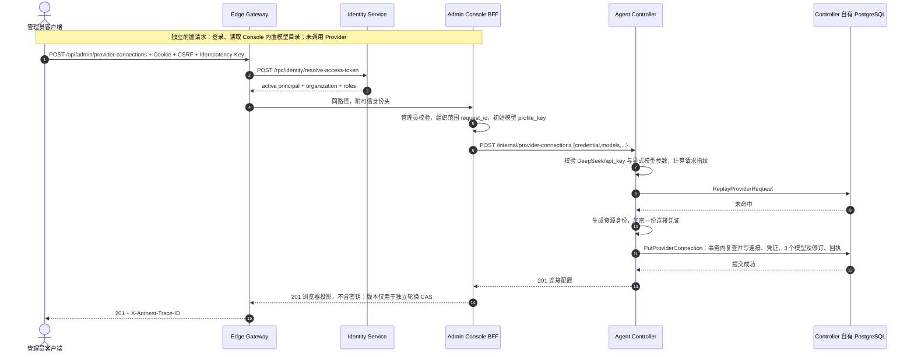

# BF-CAT-02 创建 Provider 连接与初始模型

> 日期：2026-09-11。实例：`antnest-dev-20260911`。
> 状态：管理 API、真实 PostgreSQL 与 Jaeger 核对通过，等待用户检查 Trace。
> ACP 按用户要求暂不修改；本场景不包含模型调用或浏览器表单点击验收。

## 1. 前置与部署范围

部署和管理员登录已由用户确认。本次回到模板前置场景，使用新的
[凭证与模型分离合同](provider-credentials-and-models.md)，不沿用
[旧 Model Profile 场景](business-flow-model-profile.md)的配置或验收结论。

仅构建并替换 Controller、Console。停止这两个服务后，先在事务内确认 Controller
没有 Agent、没有模板，再清理其自有 `agent_controller` schema，由新服务自动初始化。
清理前只有一个旧模型和一份旧凭证。未删除任何 volume；Identity、ACP、Runtime、Egress
的数据库均未重置，Jaeger 保留。ACP 容器未重建、未重启、未修改。

| 服务 | 本次镜像 | 最终状态 |
| --- | --- | --- |
| Agent Controller | `sha256:2913a9661ead4d58b61ae4960f9b3ef591d18b320a295df54668f6699f24fb3a` | healthy，restart 0 |
| Admin Console | `sha256:57d43493d3cc9ba5604940abbae21529e1739ee6d6fc6b32e003896dfdd730bb` | healthy，restart 0 |
| ACP（未变） | `sha256:950eb4b05bbba80f8cee9db2627dad64b01022610d7021dab19f1f9afa7a8320` | healthy，restart 0 |

## 2. 请求与调用链

验收客户端复用 `GatewayClient`，从本地 `.env` 读取部署管理员配置建立 Cookie 会话；
创建采用 Console 相同的 CSRF、Origin、Idempotency-Key 和管理 API。内置模型参数
直接读取 Console 目录，不手写第二份数据。按页面默认选中全部三个 DeepSeek 模型。
API Key 读取外层仓库 `.secret`，不输出、不写入文档；本开发环境按已批准规则全量
采集离散 RPC 正文，因此 Key 可进入本地 Jaeger。管理 API 不回显秘密是另一条边界。



目录、创建后的列表/详情/修订读取以及相同幂等键重放均是独立 HTTP 请求，不是创建
Trace 的子调用。本场景未执行模型编辑、凭证轮换、模板创建、Agent 创建或 ACP Run。

## 3. 持久化核对

以下均属于数据库 `antnest_agent_controller` 的自有 `agent_controller` schema。
只读 SQL 由验收操作者执行；Console 没有访问其他服务数据库的实现。

| 表 | 最终数据与关系 |
| --- | --- |
| `provider_connections` | 1 条启用的 DeepSeek/api_key 连接，credential revision 1 |
| `provider_credentials` | 1 条密文，ciphertext 非空、nonce 12 字节、key version 非空 |
| `model_profiles` | 3 条，全部引用同一 Provider 连接 |
| `model_profile_revisions` | 3 条 revision 1，不含 credential_ref/version、api_key 或 base_url |
| `catalog_requests` | 1 条连接创建回执；幂等重放未增加数据 |
| `agent_templates`、`agents` | 均为 0 |

连接列表、详情与创建结果的身份及业务字段一致；三种模型读取（列表、当前详情、
历史修订）的身份、模型参数、价格一致，endpoint 由连接组成公开读取结果。
当前模型：`deepseek-v4-flash`、`deepseek-v4-pro`、`deepseek-v4-flash-vision-exp`。
未向 DeepSeek 发出请求，不能据此证明这些模型或 Key 的外部有效性。

后续模板可选择的 Flash 模型 ID：`model_0f0f92fcb394054f6d7bed4224850a3f`。
连接 ID：`provider_3a9a4d0e95ff4858af29373680d21aa5`。

## 4. Jaeger 结果

[打开 Provider 创建 Trace](http://127.0.0.1:16686/trace/181161553db31fda1e905b03b7d8de16)

```text
edge-gateway SERVER  POST /api/admin/{path...}
  edge-gateway CLIENT -> identity-service
    identity-service SERVER  POST /rpc/identity/resolve-access-token
      identity-service CLIENT  identity.repository.resolve_access_token
  edge-gateway CLIENT -> admin-console
    admin-console SERVER  POST /api/admin/provider-connections
      admin-console CLIENT -> agent-controller
        agent-controller SERVER  POST /internal/provider-connections
          agent-controller CLIENT  agent_controller.repository.replay_provider_request
          agent-controller CLIENT  agent_controller.repository.create_provider_connection
```

复用 `scripts/observability/query.mjs`，查询前等待 6 秒，核对结果：

- 4 个服务、10 个 Span；三条跨服务调用均恰好一次，直接父子关系正确。
- 根请求 HTTP 201；0 错误 Span、0 Jaeger warnings、无缺失父 Span。
- 两个接收 RPC 边界各记录请求和响应，共 4 条正文事件；普通 HTTP/代理不重复记录正文。
- 无 `/status`、ACP、Runtime、Egress 或外部模型调用。

存储 Span 是 repository 边界，不代表单条 SQL；`create_provider_connection` 包含
原子写入及事务内幂等复查。审计用的旧模型 revision 页面仍可读，不以当前值冒充历史。

## 5. 验收边界

首次检查器使用字符串搜索字段名，将 `credential_method: "api_key"` 的合法枚举值
误判为秘密字段。修正为 JSON 键检查后，仅恢复只读核验；没有重复创建资源。原始 Key
的正文泄漏检查始终通过。相同幂等键重放在首次检查前已完成并核对通过。

浏览器控制本轮连接超时，不能宣称已通过浏览器表单点击或布局验收。当前通过的是
Gateway 管理请求、服务交互、数据库持久化及 Trace。未持久化 Cookie、原始 Trace 或密钥；
临时验收脚本执行完后删除，无额外测试容器或数据库需要保留。

等待用户检查本 Trace 后，再进入 **BF-CAT-06 模板创建**。ACP 消费者仍旧，不在此场景
修改，也不将此管理链路结论扩大为 Agent 运行链路已通过。
