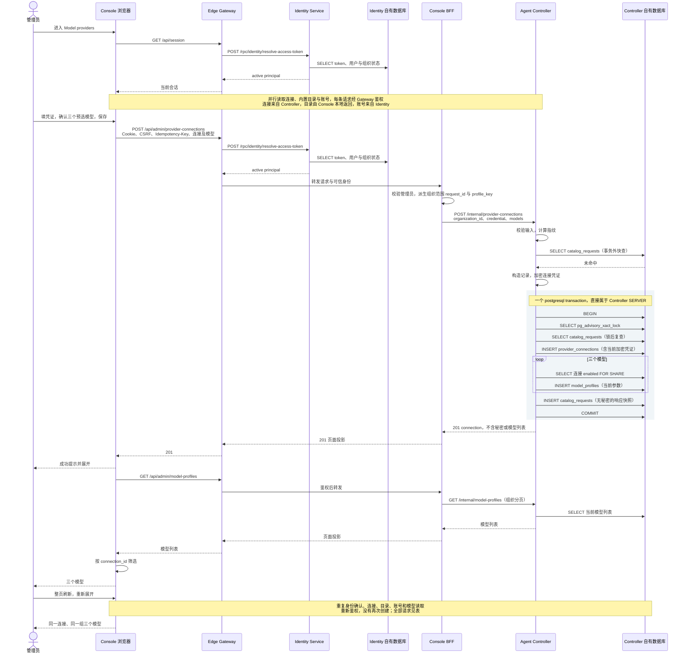

# BF-CAT-02 管理员添加 Provider 连接与初始模型

> 更新：2026-09-13（北京时间）；实例 `antnest-dev-20260911`。
> 版本：`8082e34` 加当前未提交的 Provider 精简与模型编辑修复，不是原提交镜像。
> 状态：新镜像的浏览器创建、刷新和 Trace 核对完成，用户已确认，已进入模板创建验收。

## 1. 用户流程与部署

**进入 Model providers → 添加 DeepSeek → 填写凭证、确认预选模型 → 保存 → 刷新后仍可看到同一连接与模型。**

本轮串行构建并替换 Controller 与 Console，两者健康检查通过。实际镜像 SHA256：

| 服务 | 镜像 |
| --- | --- |
| agent-controller | `7ba87fc6c2e1a6f5fd7f49a7613648a2a11ea4ecb1a928323b6540c9560b8084` |
| admin-console | `614e29fc11f3c3904eccf357c869f0629b3eae1a8adaa263b357d8d7ed213fcc` |

旧 Controller 的 5 个 Agent 为 3 个 disabled、2 个 deleted，16 条生命周期操作均已 completed，
没有 Run admission。停止两服务后，仅重置 Controller 自有 `agent_controller` schema，
新版完成 9 项初始化迁移。没有绕过迁移校验。Identity 账号、其他服务数据库、Temporal、
Jaeger 均保留，不是整个系统空白部署。Temporal 仅有自身两个扫描工作流运行，不予清理。

浏览器复用已有开发管理员会话，经 `http://127.0.0.1:8090` 进入新版 Console。
**本次使用明确的合成测试凭证，不是可调用 DeepSeek 的 API Key。** 不调用外部模型，
不修改 ACP，不创建模板或 Agent；只验证管理与持久化。

1. 初始列表为空；Add provider 打开 DeepSeek 表单，Flash、Pro、Flash Vision 默认选中。
2. 上下文、输出上限和价格由 Console 内置目录预填；没有要求输入 Provider name。
3. 填写测试凭证，仅点击一次 Connect provider，显示成功提示，新连接自动展开。
4. 三个模型及 credential revision 1 正常显示；整页刷新后重新展开，模型 ID 保持一致。
5. 最终截图中的列表与按钮完整显示，页面保留供人工检查。

## 2. 请求与 Trace

时间窗口：`2026-09-12T16:08:52.850Z` 至 `16:12:30.214Z`，对应北京时间 9 月 13 日。
以下 **11 条请求共同支撑一个用户流程**；会话与账号读取不是独立业务场景。
后台健康探针和静态资源不计入。创建为 201，其余为 200。

| 动作 | 浏览器请求 | Jaeger | Span 数 |
| --- | --- | --- | ---: |
| 进入 | GET /api/session | [已有会话确认](http://127.0.0.1:16686/trace/f0669556f84b3e2a9ccfb51986d82b44) | 4 |
| 进入 | GET /api/admin/provider-connections | [空连接列表](http://127.0.0.1:16686/trace/2270ef6738b1937ec2a417b996e3bf9b) | 9 |
| 进入 | GET /api/admin/model-catalog | [预填目录](http://127.0.0.1:16686/trace/73582ca7850f0f1ac92454703edc5a44) | 6 |
| 进入 | GET /api/admin/account | [账号资料](http://127.0.0.1:16686/trace/1c6785ef64508f2ef053ec1cf0b1a44f) | 12 |
| 保存 | POST /api/admin/provider-connections | [创建连接及模型](http://127.0.0.1:16686/trace/0709a295bf7d1cf04b348afdd28c2104) | 22 |
| 自动展开 | GET /api/admin/model-profiles | [创建后模型](http://127.0.0.1:16686/trace/4e8d649dc5ee790d291b3af2326c79a1) | 9 |
| 刷新 | GET /api/session | [刷新身份确认](http://127.0.0.1:16686/trace/0ee67f2b584676987c9919b39b049931) | 4 |
| 刷新 | GET /api/admin/provider-connections | [连接重载](http://127.0.0.1:16686/trace/b439055d193d3f0ed8711c497bdfa9d3) | 9 |
| 刷新 | GET /api/admin/model-catalog | [目录重载](http://127.0.0.1:16686/trace/7542c88432e08da126200cfb35195082) | 6 |
| 刷新 | GET /api/admin/account | [账号重载](http://127.0.0.1:16686/trace/a76cf5eb452267731020dfbcb81d823f) | 12 |
| 重新展开 | GET /api/admin/model-profiles | [同一模型再次展示](http://127.0.0.1:16686/trace/b45dd60b5228972559eb944ad5598385) | 10 |

按实际页面动作时间、路由与资源 ID 关联，不声称浏览器有操作级根 Span，不把独立 GET
挂成 POST 子请求。每条请求从 Gateway 开始，经 Identity 鉴权；account 另有
Console → Identity 账号读取。最后一条模型查询多一次 Identity `last_used_at` UPDATE，
是五分钟采样到期后的正常写入，不是每次鉴权都写库。

## 3. 实际时序



普通查询的认证细节在图中缩写。协调者的只读数据库核对不属于产品调用链。
没有 Runtime、ACP、Egress、Temporal 或外部 Provider 调用。

## 4. 事务与持久化

创建 Trace：**22 Span，44.018ms**。7 个 HTTP Span、Identity 1 个 SQL Span、
Controller 13 个 SQL Span、1 个事务 Span；耗时仅为开发样本，不是性能基准。

- Controller 事务外 1 SELECT；事务内 5 SELECT、5 INSERT、BEGIN、COMMIT，共 12 次 SQL。
- 5 INSERT = **1 连接（内含加密凭证）+ 3 当前模型 + 1 幂等回执**。
- 事务 committed，正确包裹事务内 SQL；Gateway → Identity、Gateway → Console、
  Console → Controller 三条跨服务调用各一次。
- 两个接收 RPC SERVER 各有一对请求/响应事件，共 4 条；普通 HTTP 不重复采集正文。
- 11 条 Trace 无缺父、重复 Span ID、错误观测或 Jaeger warning。无 Repository 手工包装、
  pool.acquire、prepare 噪声或 SQL 参数/结果；SQL 标题保持驱动 OP。

对比[上一版创建](http://127.0.0.1:16686/trace/36963a3516944c10434c5d022df4c00b)，
Controller INSERT 从 9 降至 5、SQL 从 17 降至 13。总 Span 从 27 降至 22，其中额外少的
1 个来自本次 Identity 不需 UPDATE，不能全部归因于 Provider 精简。

| Controller 自有表 | 创建前 → 后 | 只读核对结果 |
| --- | --- | --- |
| provider_connections | 0 → 1 | enabled、DeepSeek/api_key、credential revision 1，密文非空 |
| model_profiles | 0 → 3 | 同一连接、version 1；名称及完整 model JSON 与创建 RPC 逐项一致 |
| catalog_requests | 0 → 1 | 一条 create_provider_connection 回执 |
| provider_credentials / model_profile_revisions | 表不存在 | 不再单独保存凭证或模型历史 |
| agent_templates / agents | 0 → 0 | 本轮未创建 |

连接：`provider_c91b71199a53c6ed0952bc3513d466d5`。页面与数据库模型 ID 一致：

| API model ID | Model Profile ID |
| --- | --- |
| deepseek-v4-flash | model_3f437e00d041b31e91fe69a2b34d3d10 |
| deepseek-v4-pro | model_32c60482d4e55762e0734d5f2e77857c |
| deepseek-v4-flash-vision-exp | model_77fce53d549ccc485bacb9a64d2a12cb |

模型没有复制凭证或 endpoint；创建响应无 api_key、credential、ciphertext、nonce。
模型信息来自当前 Console 目录，本次不向 DeepSeek 求证模型或凭证有效性。

## 5. 遗留与边界

| 项目 | 本轮结论 |
| --- | --- |
| 按组织分页后前端筛连接 | 仍存在。三个模型的首屏样本不能证明大量模型正确；后续应在 Controller/BFF 按连接过滤后分页 |
| 初始模型重复锁定新建连接 | 仍有 3 次 enabled FOR SHARE，是三次执行，不是重复 Span；后续可精简初始批量插入，独立添加模型仍需校验 |
| 幂等快查与锁后复查 | 不同用途，锁后复查保证并发正确性；本次浏览器只提交一次，未重跑同键重放 |
| 会话 Trace 验收器 | 原先强制每次 SELECT 后必须 UPDATE，与五分钟采样不符；补只读分支和多余 SQL 回归测试后修正，未改 Identity 服务 |
| 模型编辑、凭证轮换 | 新代码已有单测/集成测试；本场景未操作，不借创建 Trace 声称其浏览器复验已完成 |
| ACP 与下游场景 | 暂缓 ACP 适配；模板和 Agent 创建须在本场景人工确认后逐项执行 |

核对复用 [trace-tree.mjs](../scripts/observability/trace-tree.mjs)、
[evidence.mjs](../scripts/observability/evidence.mjs)、
[successful-span.mjs](../scripts/observability/successful-span.mjs)。
等待至少 6 秒后查询 Jaeger，不保存原始 Trace、Cookie 或秘密文件。
开发 Jaeger 会采集离散 RPC 完整内容，不应作为公开数据源。

本轮最终验证：观测脚本串行回归 235 项通过，`make -j1 fmt-check lint` 通过（Go lint 0 issues，
两项 Rust Clippy 与 Node lint/typecheck 通过）；四份相关文档的 72 个本地文件链接有效，
`git diff --check` 通过。本轮没有重新执行全量产品测试，不把之前的服务单测计作本次新增证据。

现成 HTTP/RPC 边界检查命令（无需在 `.cache` 放脚本）：

```sh
node scripts/observability/check-trace.mjs http://127.0.0.1:16686 0709a295bf7d1cf04b348afdd28c2104 \
  '{"rootService":"edge-gateway","route":"/api/admin/{path...}","status":201,"hops":[["edge-gateway","identity-service",1],["edge-gateway","admin-console",1],["admin-console","agent-controller",1]]}'
```

保留测试连接及模型供人工检查。**真实模型调用前必须替换合成凭证，并完成 ACP 消费适配。**
用户已确认 BF-CAT-02，后续进度见 [BF-CAT-06 模板创建](business-flow-template-create.md)。
