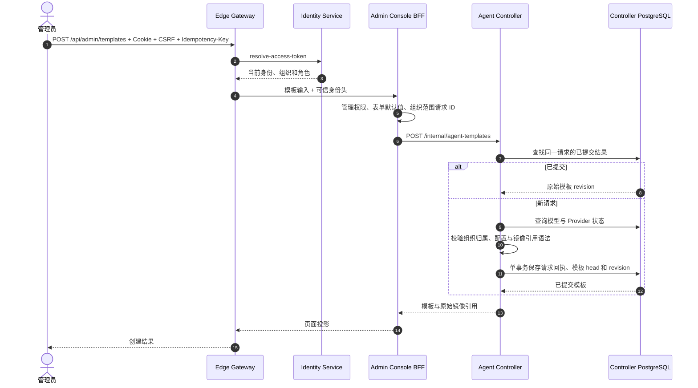

# BF-CAT-06 创建 Agent 模板

> 更新：2026-09-12。实例：`antnest-dev-20260911`。
> 当前设计：模板忠实保存镜像引用，实际镜像身份在 Runtime 构建时确定。
> 当前 Gateway API、持久化与 Trace 复验已通过；没有重做浏览器页面点击验收。

## 1. 入口与数据边界

管理员从 <http://127.0.0.1:8090/#templates> 创建模板，选择已配置的组织模型，
填写提示词、Runtime 镜像引用和可选的托管 MCP 配置。

模板保存原始 `image_ref`，例如 `antnest/antnest-runtime:local`、`latest` 标签或
显式 digest 引用。不会在保存时检查 Docker 中是否存在镜像，也不会将标签替换为
本次解析的 SHA-256。语法错误仍拒绝；合法但尚未安装的镜像在 Runtime 构建时失败。
模板不复制 Provider 凭证；零 Skill 和零托管 MCP 都是合法配置。

## 2. 调用时序



该流程没有 Runtime Controller、Docker、Egress、ACP 或外部模型调用。
SQL Span 使用标准操作名；事务 Span 包裹实际 SQL，不为业务方法另起存储 Span。

## 3. 后续构建的镜像身份

1. Agent Controller 将配置中的原始引用交给 Runtime Controller。
2. 新构建先检查本地镜像，取得 Docker image ID；没有镜像则在资源变更前失败。
3. 将 `image_reference`、`image_id` 与本次 operation 一起持久化，再执行容器创建。
4. Docker 使用该 ID 创建容器，Runtime 接收同一组启动元数据。标签在此期间移动也不会改变本次构建。
5. 同一次 operation 的恢复使用已保存 ID；新的显式重建才重新解析原始引用。
6. 删除容器和工作卷不删除构建 operation，保留可查询的镜像来源记录。

Docker image ID 是内容身份，不是仓库 manifest digest，不能拼成伪造的
`repository@digest`。本次不新增 registry 拉取策略或运行中自动升级。

## 4. 验证边界

代码测试覆盖模板引用原样保存、无 Runtime 依赖、非法引用拒绝、构建恢复固定
镜像、标签变化后的新构建，以及删除后的持久化记录。Docker 集成测试会在解析与
创建之间移动临时标签，验证执行镜像没有漂移。

独立 Runtime 联调已核对 operation、Docker 实际镜像、Runtime 启动日志和 Trace
resource 的一致性，并验证精确请求重放及删除后审计保留。
[镜像元数据联调 Trace](http://127.0.0.1:16686/trace/1e11a76aa4fd5bdb94e82f025a2a6a85)
从 Runtime Controller 开始，不是 Gateway 起点的模板创建验收。

复用脚本：`services/runtime-controller/scripts/build-image-smoke.mjs`。
临时容器、工作卷已清理，Egress 分配已释放；构建审计记录按设计保留。
本轮没有创建用户 Agent、调用模型，也没有修改 ACP 执行端。

## 5. 最终 Gateway 复验

[当前模板创建 Trace](http://127.0.0.1:16686/trace/c41f74713052fcce96f376e01f2b7b4b)
从 Gateway 发起，共 19 个 Span，三次跨服务调用各一次：
Gateway → Identity、Gateway → Console、Console → Controller。
Controller 内仅一个提交成功的目录写事务，SQL 使用驱动自动埋点；
没有 Runtime Controller、Docker、Egress、ACP 或 Temporal 调用，零 Jaeger warning。

独立验收模板 `template_451207aa59aa41e7c880420d06e33860`（revision 1）引用
已有组织模型 `model_0f0f92fcb394054f6d7bed4224850a3f`。
`image_ref=antnest/antnest-runtime:local` 在创建、相同幂等键重放和随后详情读取中保持原样。
创建响应和重放响应逐字段一致，没有额外生成模板修订或 Agent。

复验暴露并修复了模板时间精度遗漏：首次写入原先返回纳秒，PostgreSQL 重放为微秒。
现在沿用 Model Profile 的持久层归一化方式，不给领域模型增加数据库依赖；
真实 PostgreSQL 测试对创建及修订均注入非整微秒时间并断言重放一致。
修复后 Controller 全量 race/PostgreSQL/Temporal 回归与格式、lint 门禁均通过。

```sh
node scripts/observability/exercise-template.mjs --confirm-development \
  --model model_0f0f92fcb394054f6d7bed4224850a3f
```

该脚本会创建独立的验收模板并保留配置记录，不创建运行资源或修改原模板。
登录配置来自本地 `.env`，完成后使用 `DELETE /api/session` 退出；不保存 Cookie、
原始 RPC 正文或凭证。当前记录及首次失败验收留下的配置均未派生 Agent。
