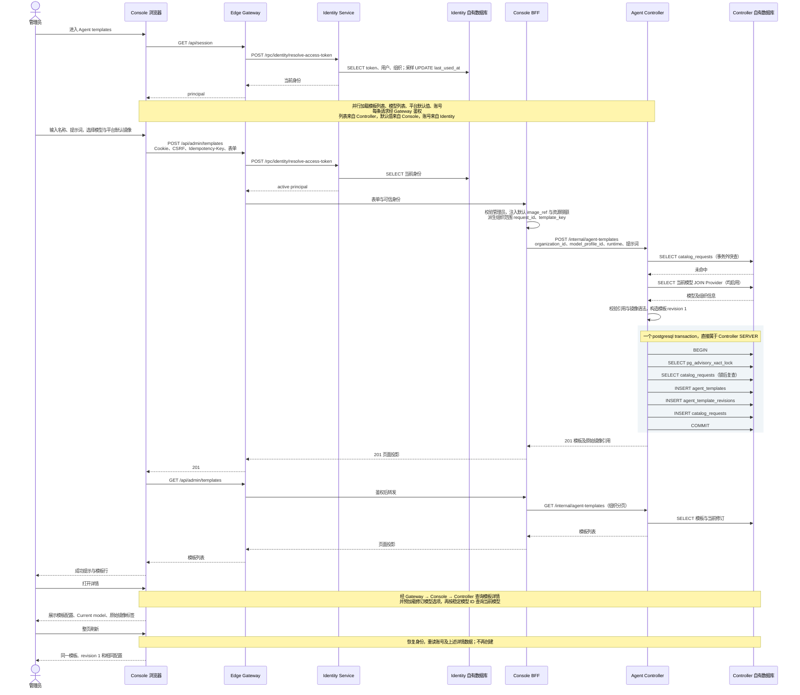

# BF-CAT-06 创建 Agent 模板

> 更新：2026-09-13（北京时间）；实例：`antnest-dev-20260911`。
> 版本：与 [BF-CAT-02](business-flow-provider-connection.md#1-用户流程与部署) 相同的新 Controller/Console 镜像，未再次重建或重置数据。
> 状态：真实浏览器创建、详情与刷新、PostgreSQL 和 Trace 技术核对完成，用户已确认并允许推进 Agent 创建。

## 1. 用户目标与实际结果

**管理员进入 Agent templates → 选择组织模型并填写模板 → 保存 → 查看详情 → 刷新后仍可读取相同配置。**

本轮复用已有管理员会话和上一场景创建的 DeepSeek 连接，不重新登录，不修改 Provider。
其凭证仍为合成测试值，模板保存无需调用外部模型，因此本次不证明该凭证可用于聊天。

1. 进入模板页，初始列表为空，模型和平台默认值加载完成后 Create template 可用。
2. 创建“日常工作助手”，选择 DeepSeek V4 Flash，填写中文系统提示词，保留最大模型请求数 32。
3. Runtime image 使用 Platform default，页面明示 `antnest/antnest-runtime:local`；不添加 MCP。
4. 保存后显示成功提示，列表显示模板、模型、revision 1、1.0 GiB 内存、Enabled。
5. 打开详情并整页刷新。名称、提示词、模型引用、镜像标签和资源配置均一致，没有重新创建。
   最终截图与页面保留供人工检查。

本轮只成功提交一次创建请求。选择模型时浏览器原生 required 校验阻止过空值提交，
没有发送创建请求；最终选中 Flash 后提交成功。不将自动化控件操作受阻当作产品接口失败。

新模板：`template_18e0d318a66f7324024e6334e3e79bd2`。
模型稳定引用：`model_3f437e00d041b31e91fe69a2b34d3d10`。
模板仅保存 `model_profile_id`，不复制模型参数或 Provider 凭证；模型当前值可独立更新。
模板修订不变不等于模型参数被冻结，详情页的 Current model 是当前值。

## 2. 整体请求集合

窗口：`2026-09-12T16:35:43.191Z` 至 `16:40:22.204Z`，北京时间为 9 月 13 日。
以下 15 条业务请求共同支撑一个场景；会话恢复、页面默认值加载不是独立业务场景。
后台探针和静态资源不计入。创建 201，其余 200。

| 动作 | 浏览器请求 | Jaeger | Span 数 |
| --- | --- | --- | ---: |
| 进入 | GET /api/session | [身份确认](http://127.0.0.1:16686/trace/4ef5680ac556c912cb6820a397349385) | 5 |
| 进入 | GET /api/admin/templates | [空模板列表](http://127.0.0.1:16686/trace/4fc5c6610e7f2fc8c9bf7ea853322a3f) | 9 |
| 进入 | GET /api/admin/template-defaults | [平台默认值](http://127.0.0.1:16686/trace/16ecedbe64094920e4791a5c723131ea) | 7 |
| 进入 | GET /api/admin/model-profiles | [可选模型](http://127.0.0.1:16686/trace/585f9bc68bfa9712b69202bdd58701ec) | 9 |
| 进入 | GET /api/admin/account | [账号](http://127.0.0.1:16686/trace/5a5ed5dde8b94d42ae9e56326c27884c) | 13 |
| 保存 | POST /api/admin/templates | [创建模板](http://127.0.0.1:16686/trace/0e76651c8fdebef9d3daddc7ccb907ff) | 18 |
| 保存后 | GET /api/admin/templates | [刷新列表](http://127.0.0.1:16686/trace/88aa146714cefa24e5b14f07fa21573d) | 9 |
| 详情 | GET /api/admin/templates/{template_id} | [模板详情](http://127.0.0.1:16686/trace/052f561810ccf660760106e10f50e416) | 9 |
| 详情 | GET /api/admin/model-profiles | [修订选项预加载](http://127.0.0.1:16686/trace/bfae974d8fc756b4f4d91963719ca410) | 9 |
| 详情 | GET /api/admin/model-profiles/{model_profile_id} | [被引用模型](http://127.0.0.1:16686/trace/26212860228ef8ed39800a8fb1b2036e) | 9 |
| 整页刷新 | GET /api/session | [身份恢复](http://127.0.0.1:16686/trace/57c45662d3bf32c743925cb7c2c2b82b) | 4 |
| 整页刷新 | GET /api/admin/templates/{template_id} | [模板再次读取](http://127.0.0.1:16686/trace/20ea2b5259a4897e3050771451868fe6) | 9 |
| 整页刷新 | GET /api/admin/model-profiles | [修订选项再次预加载](http://127.0.0.1:16686/trace/012cbb41d781d20640f9b9af79e87302) | 9 |
| 整页刷新 | GET /api/admin/account | [账号重载](http://127.0.0.1:16686/trace/37f3d304752bc600e864d7d503846e5a) | 12 |
| 整页刷新 | GET /api/admin/model-profiles/{model_profile_id} | [模型再次读取](http://127.0.0.1:16686/trace/210a382fbb6723d1bd267e6105f389ff) | 9 |

按页面动作、路由、时间和资源 ID 关联 Trace；没有浏览器操作级根 Span，
不强行将后续 GET 挂在 POST 下。每条管理请求均在 Gateway 验证身份；
account 另经 Console → Identity 读取账号，默认值在 Console 本地返回。
首次身份确认有 last_used_at 采样 UPDATE，刷新时只有 SELECT。

## 3. 根据 Trace 绘制的时序



图中普通查询缩写了重复认证和响应转发，实际请求见 §2。
**模板保存没有 Runtime Controller、Docker、Egress、ACP、Temporal 或外部模型调用。**
不做镜像存在性检查，也没有用 SHA256 替换标签。零 Skill 与零托管 MCP 合法。

## 4. 事务与持久化核对

[本次创建 Trace](http://127.0.0.1:16686/trace/0e76651c8fdebef9d3daddc7ccb907ff)：
**18 Span，39.698ms**，不是性能基准。7 个 HTTP Span、Identity 1 个 SQL、
Controller 9 个 SQL 和 1 个事务 Span。

- Controller 事务外 2 SELECT：幂等回执快查、模型与 Provider 校验。
- 事务内 7 次 SQL：BEGIN、2 SELECT、3 INSERT、COMMIT；事务 committed。
- **3 INSERT = 模板主记录 + 初始模板修订 + 幂等回执**。
- Gateway → Identity、Gateway → Console、Console → Controller 各一次。
- 接收 RPC SERVER 共 4 条请求/响应事件；完整父子关系，无错误、缺父、重复 ID 或 Jaeger warning。
- SQL 为驱动 OP，事务包裹 SQL；无 Repository 手工包装、pool.acquire、prepare 噪声或参数/结果采集。
- 15 条流程 Trace 已核对 HTTP/RPC、成功状态与 SQL 所属，不只检查创建响应。
  不同样本偶有驱动 connect Span，不计为 SQL 执行或额外业务调用。

协调者只读数据库核对不属于产品调用链。增量：

| 自有表 | 前 → 后 | 结果 |
| --- | --- | --- |
| agent_templates | 0 → 1 | 日常工作助手、Enabled、current_revision 1 |
| agent_template_revisions | 0 → 1 | 模型稳定 ID、提示词、请求上限、Runtime 配置 |
| catalog_requests | 1 → 2 | 新增 1 条 create_template；已有 Provider 回执保留 |
| agents | 0 → 0 | 没有派生 Agent |

保存的 Runtime：image_ref 原样为 `antnest/antnest-runtime:local`；
memory_bytes=1073741824、pids_limit=256、tmpfs_bytes=268435456，无托管 MCP。
模板字段及完整 Runtime JSON 与 Controller 创建 RPC 逐项一致；没有模型参数副本、凭证或解析镜像 ID。

本次没有额外重放请求、创建修订或修改当前模型。旧版
[API 创建/重放 Trace](http://127.0.0.1:16686/trace/c41f74713052fcce96f376e01f2b7b4b)
属于历史证据，不以它代替当前浏览器验收。复用 `scripts/observability/exercise-template.mjs`
会另建测试模板，本轮未运行它，不声称重新验收了其重放分支。

## 5. 独立复核与后续边界

只读子 agent 已审查表单、BFF、Controller 应用与持久层，报告后立即关闭。
协调者复核并记录：

| 项目 | 判断 |
| --- | --- |
| Provider 停用后的模型资格 | 模型列表使用 p.enabled，而创建校验 p.enabled AND c.enabled，确有资格投影不一致。当前无 Provider 停用管理入口，因此不是本次启用资源正常流程的阻断；开放停用前应统一选项与后端资格并补测试 |
| 详情页预加载修订模型选项 | 未点击 Create revision 就获取整页模型选项，进入详情和刷新各多一次请求。当前模型单独读取有必要，不能因首屏列表包含它就依赖分页结果；可将修订选项延迟到打开表单时加载 |
| 模板 revision 与模型当前值 | 模板修订固定引用与配置，不冻结模型内容；当前及历史模板详情均读当前模型。本次未验证修改模型后的跨页面联动 |
| 镜像有效性 | 仅保存并校验引用语法，合法但不存在的镜像应在后续构建失败；本次不等于镜像可启动或 Runtime 已验证 |
| MCP、外部模型与 ACP | 均未执行；Provider 仍为合成凭证，真实模型请求之前须换有效凭证并完成 ACP 消费适配 |

上述为正常路径验证与剩余项登记，没有修改服务代码，也没有扩展到 Provider 停用、模板修订或 Agent 创建。
后续构建依然按既定边界由 Runtime Controller 解析实际镜像 ID并记录元数据，模板不承担平台资源检查。
相关设计与历史镜像测试见 [Runtime Controller 镜像校验脚本](../services/runtime-controller/scripts/build-image-smoke.mjs)。

Trace 校验复用 [HTTP/RPC 边界](../scripts/observability/evidence.mjs)、
[图与 SQL 归属](../scripts/observability/trace-tree.mjs)、
[成功状态](../scripts/observability/successful-span.mjs)；等待至少 6 秒再读取 Jaeger。
仅记录最终指标和链接，不落盘原始 Trace、Cookie 或密钥。

本轮验证：观测脚本串行回归 235 项通过，四份相关文档 76 个本地文件链接有效，
`git diff --check` 通过。没有修改服务代码或重跑全仓库产品测试。
末轮独立文档复核仅发现入口索引残留的“模型历史修订”表述，已改为当前配置；审查者已关闭。

现成边界复核命令：

```sh
node scripts/observability/check-trace.mjs http://127.0.0.1:16686 0e76651c8fdebef9d3daddc7ccb907ff \
  '{"rootService":"edge-gateway","route":"/api/admin/{path...}","status":201,"hops":[["edge-gateway","identity-service",1],["edge-gateway","admin-console",1],["admin-console","agent-controller",1]]}'
```

模板和页面保留。**用户已确认本场景，已进入 BF-AGENT-04 Agent 创建。**
