# Docker 管控主流程：基于 Trace 的时序与技术评审

> 核对日期：2026-09-12；实例：`antnest-dev-20260911`。
> §18 保留此前逐场景复验；创建/就绪分离及分层状态改造后的最新进度见 [状态模型集成记录](agent-lifecycle-state-model.md#progress)。§1–17 是历史分析与代码验证，不代表新镜像全部重新验收。
> 用途：人类技术评审底稿，不是全部业务或异常路径已经验收的声明。
> 范围：部署、管理员本地登录、Provider 配置、模板创建、Agent 创建/重建/停用/启用/删除；补充本轮 Egress 数据库观测复验。
> 独立自查：已由三名只读审查者分别检查完整性、简洁性、职责隔离，并由主审交叉复核；结论与修正优先级见 §16。此次自查未执行测试、重新采集 Trace 或修改业务代码。

## 1. 先给结论

管理热路径的跨服务分工基本成立：Gateway 认证、Console 做管理端适配、Controller 编排、Runtime Controller 执行部署、Egress 管网络；模板保存不再构建 Runtime，Agent 生命周期不再等待同步长请求结束。

**但“调用成功”不等于“流程已足够简洁”。本轮应重点评审以下几项：**

1. 重建时 Controller 的 118 个数据库执行 Span 中有大量完整状态的重复装载，不能用 Temporal 重试语义为所有读取自动背书。
2. Runtime 创建/重建的主要时间处于等待就绪；Trace 显示约 500ms 一次 Docker inspect，再做一次 Runtime `/status`。这不是六次创建，却需要明确两个就绪判断的不同责任。
3. Runtime Controller 的包装 Span 需要按边界判断，不能一概视为业务手工埋点：RPC 分派包装可能重复，平台 decorator 和状态验证仍携带 HTTP 层不能判断的部署结果与合同错误。
4. Provider 创建现存 Trace 还是旧 Repository 粒度；可以确认调用路线，不能据此确认最新版本的逐 SQL/事务边界。
5. 当前 Compose 运行快照暴露了 Controller 的 loopback 调试端口，与“仅 Gateway 应用入口”的正式验收配置有偏差；部署成功与部署边界正确要分开判定。

自查进一步确认了三个优先修正项：删除失败不能可靠结束、普通管理代理未应用请求超时、生命周期 Trace 检查器的必要调用断言不完整。成功样本不能排除这些问题；详见 §16.2。

下文将已观察事实、源码解释、建议和未验证项分开；本轮不顺手改造上述业务逻辑。

## 2. 证据口径

### 2.1 Trace 清单

以下链接均在初稿整理时重新查询 Jaeger。除已明确失效的旧部署链接外，当时表内 Trace 均可读取，未发现缺失父 Span 或 Jaeger warning；§16 自查仅复用这些证据，没有再次访问实例。

| 场景 | Jaeger | Span 数 | HTTP 返回耗时 | 证据范围 |
| --- | --- | ---: | ---: | --- |
| Gateway 本地就绪 | [Trace](http://127.0.0.1:16686/trace/c71cce12d4eb9acfa529d79fbd98ece2) | 1 | 0.027ms | 本轮补采，仅 Gateway 自身 |
| 管理员本地登录 | [Trace](http://127.0.0.1:16686/trace/f07f6ff96cd0d4a1ea1014f253b0d568) | 12 | 131.641ms | 已确认的登录 SQL 链路 |
| Provider 连接与初始模型 | [Trace](http://127.0.0.1:16686/trace/181161553db31fda1e905b03b7d8de16) | 10 | 20.375ms | 历史业务路线；旧存储包装 |
| 模板创建 | [Trace](http://127.0.0.1:16686/trace/c41f74713052fcce96f376e01f2b7b4b) | 19 | 21.945ms | 原样保存镜像引用，不调用 Runtime |
| Agent 创建 | [Trace](http://127.0.0.1:16686/trace/0eef9d706c4a5c163a11bf429192ec2b) | 181 | 182.084ms | HTTP 202 + 后续 Workflow |
| Agent 重建 | [Trace](http://127.0.0.1:16686/trace/bad38570329dfc7a05573b386ece8c10) | 239 | 121.878ms | HTTP 202 + 后续 Workflow |
| Agent 停用 | [Trace](http://127.0.0.1:16686/trace/b1e7fa1f6e0201d822a4c96da8671d7e) | 165 | 145.768ms | HTTP 202 + 后续 Workflow |
| Agent 启用 | [Trace](http://127.0.0.1:16686/trace/23288db10fe37252c31dbf2ede957177) | 196 | 119.879ms | HTTP 202 + 后续 Workflow |
| Agent 删除 | [Trace](http://127.0.0.1:16686/trace/397d8f02ec43e5ad91bfeb4a0e0b8b54) | 176 | 117.450ms | HTTP 202 + 后续 Workflow |
| Egress 策略同值提交 | [Trace](http://127.0.0.1:16686/trace/08e698fc4975c209da3a2c84d32862db) | 21 | 24.871ms | 本轮新镜像，SQL/事务观测 |

五条生命周期 Trace 来自同一个隔离验收 Agent：`agent_2908b99c22e7174725f354880854d5c6`，按创建、重建、停用、启用、删除依次完成。其最终数据库与 Docker 资源核对见[生命周期验收记录](../services/agent-controller/docs/lifecycle-workflows.md#acceptance-2026-09-12)。本轮是重新取证和流程分析，没有再次执行五次生命周期，也没有调用外部模型。

### 2.2 不能混淆的边界

- 图中 HTTP 箭头按实际 SERVER 路由列出；CLIENT/SERVER 两个 Span 是一次调用的两端，不算两次 RPC。
- SQL OP 是数据库执行，不是业务步骤；事务包裹和 BEGIN/COMMIT 不算重复执行同一 SQL。
- 表内耗时是一个开发样本，不是 p95、容量或稳定性指标；父子耗时不能相加。
- 生命周期异步部分仍属于发起请求的 Trace。HTTP 根 Span 可以先结束，Workflow 后代继续执行，这不是断链。
- Workflow/Activity Span 由 Controller 的 Temporal SDK 产生；**不是 Temporal Server 内部调度/数据库已经被全量埋点的证明**。
- 生命周期 Trace 早于本轮 Egress 降噪，保留 `postgresql query_opt` 等旧标题；它们可证明业务顺序，但不能作为新 Egress 命名规范的验收。新规则见最后一条补采 Trace。
- 原部署 Trace `227ca8bb7a9c33d60ea126cd4f38d581` 本轮查询返回 404。本文用新 `/status` 替换健康检查证据，不伪造空白部署全过程 Trace。
- Jaeger 本地保留期有限。本文只保存链接、结构和最终计数，不复制原始 RPC 正文、密码、Cookie、密钥或数据库转储。
- 开发环境离散 RPC 正文采集已获批准，Jaeger 可能含敏感信息；SQL 采集不主动包含绑定参数/结果行，原生数据库错误却可能回显值。本文不是生产脱敏策略。

## 3. 服务与数据责任

| 服务 | 本组流程中的职责 | 自有持久化 |
| --- | --- | --- |
| Edge Gateway | 外部 HTTP、Cookie/CSRF、解析调用者身份、代理、请求 Trace 根 | 无业务数据库 |
| Admin Console | 页面及 BFF、管理员/组织语义、表单转换、内置模型目录 | 无业务数据库；内置目录是前端静态配置 |
| Identity Service | 本地认证、令牌、组织成员状态、Owner 授权判断 | `antnest_identity`；用户、凭证、成员、令牌、身份事件 |
| Agent Controller | Provider/模型/模板、Agent 聚合、Run 准入、生命周期业务阶段、审计 | `antnest_agent_controller` / `agent_controller` |
| Temporal Server | Workflow 历史、任务调度、重试与 Worker 续办 | `antnest_temporal`、`antnest_temporal_visibility`，不写 Agent 业务表 |
| Runtime Controller | 将逻辑 Runtime 请求转换为 Docker 资源、就绪检查和部署结果 | `antnest_runtime_controller` / `runtime_controller` |
| Runtime Egress | 地址分配、网络策略、attachment 开关、转发与释放隔离期 | `antnest_egress` / `runtime_egress` |
| Antnest Runtime | 容器内初始化、状态响应、MCP 工具及隔离执行 | 专属工作卷；不读取其他服务数据库 |
| Agent ACP Service | 后续会话/Run/模型与工具执行 | 本组生命周期 Trace 中未参与，不据此验证 ACP |

一个 PostgreSQL 容器托管多个数据库只是开发部署方式，不改变服务所有权。Trace 中 SQL 所属服务是可观察事实；数据库角色隔离还须结合初始化脚本与权限测试，不能仅凭 Span 标签证明。

## 4. 部署与就绪

### 4.1 部署是运维入口，不是 Gateway 请求

下图依据当前 [Compose](../compose.yaml) 和[覆盖配置](../compose.stage3.yaml)，不是从一条启动 Trace 推导的。初始化、构建和探针是不同的根流程，不能人为挂在一次 `/status` 下。

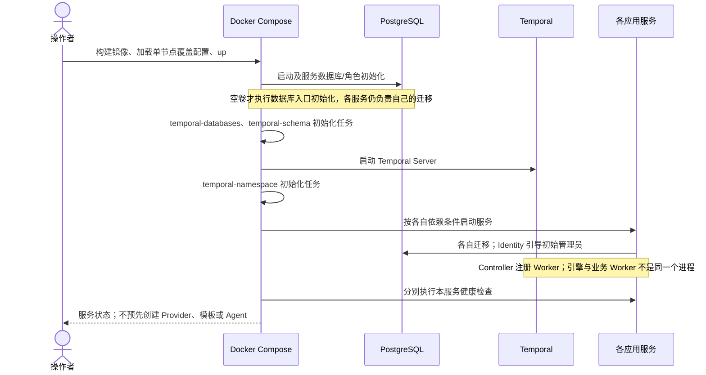

这只是依赖骨架，不宣称所有服务串行等待 Temporal；准确依赖以各服务 `depends_on` 为准。Temporal 容器是独立工作流引擎，不是通用事件总线。审计事件、Agent 状态仍由 Controller 维护。

### 4.2 已采集的本地探针

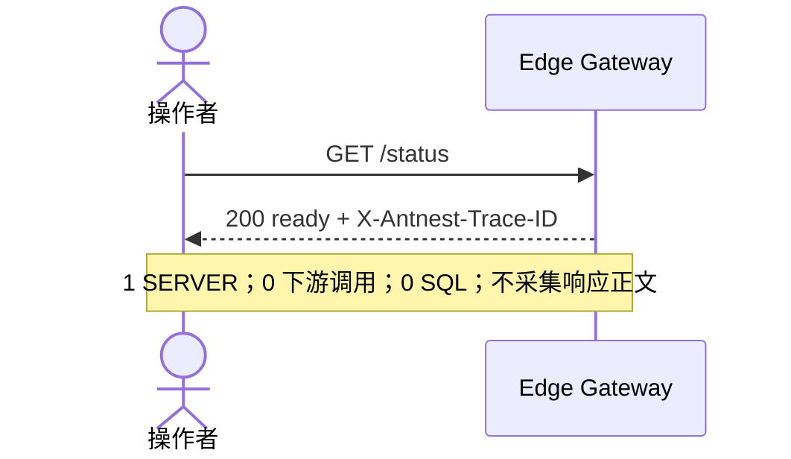

本轮快照：11 个常驻 Compose 服务运行，10 个带探针的服务 healthy；Jaeger 无 Compose 健康状态，但查询 API 实际可用。测试专用 `antnest_egress_test` 已清理。现有业务库保留，**当前不是空白实例**。

注意：Controller 当前发布 `127.0.0.1:58083 -> 8080`；其容器配置标签只列基础 Compose，其他多数应用使用基础文件加 `compose.stage3.yaml`。这是开发更新时的配置漂移，正式单入口验收应统一启动覆盖配置。loopback 不等于公网暴露，但仍不能写成“内部应用全部没有 host port”。

## 5. 管理员本地登录

### 5.1 实际请求顺序

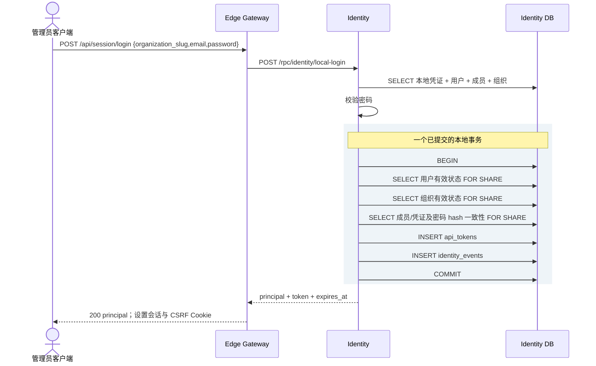

8 个执行 Span = 1 次事务外读取 + BEGIN、3 次复核、2 次 INSERT、COMMIT。不存在 `issue_access_token` 手工存储包装；没有 Console、ACP、Runtime 或健康检查子调用。

### 5.2 评审判断

先读凭证再在签发事务内复核有实际意义：密码校验期间账号、成员关系或凭证可能发生变化。事务内复核不是重复登录，也不应为了少几个 SELECT 把昂贵的密码计算放入持锁事务。

Trace 不含密码计算专属 Span，不能把 Identity SERVER 的全部剩余耗时归因为 Argon2 或数据库。`GET /api/session`、登录后的管理页面请求、退出登录是其他根请求，不在本图中。

## 6. Provider 连接与模型配置

### 6.1 两类数据，不是两次独立配置流程

Console 内置目录提供初始模型参数；管理员提交时将实际选择的模型和连接信息一起发送。Controller 持久化管理员提交，而不是由 ACP 内建目录决定管理数据。

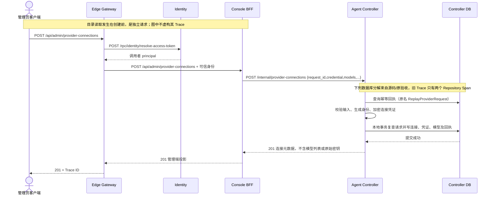

| 数据表 | 本场景语义 |
| --- | --- |
| `provider_connections` | 连接、类型、endpoint、启用状态、凭证修订关联 |
| `provider_credentials` | 一份加密凭证，不给每个模型复制一份秘密 |
| `model_profiles` | 连接下的模型身份及当前修订引用 |
| `model_profile_revisions` | 模型参数/价格等修订快照 |
| `catalog_requests` | 请求指纹及结果引用，支持相同请求重放 |

原验收创建 1 个连接、1 份凭证、3 个模型及其初始修订；幂等重放未增加记录，详见[Provider 场景](business-flow-provider-connection.md)。本轮未重新读取秘密，也没有调用 DeepSeek 来证明外部模型可用性。

模型与连接在同一创建事务内持久化，但创建响应是 `ProviderConnectionView`，不嵌套返回模型列表。页面随后通过独立的模型查询获取列表，该查询不属于此创建 Trace。不能为了与错误的时序图对齐而给 BFF 增加补查。

### 6.2 证据缺口

现存创建 Trace 能确认三条跨服务调用各一次、201 返回、无 Runtime/ACP；**不能数出实际 SQL 和事务**。另一个[Provider 只读 Trace](http://127.0.0.1:16686/trace/7c180ab71febd487663c64b839c62478)还带 prepare/acquire，也不能拿来冒充新创建链路。

后续应在受控测试连接上重新采集一次创建及相同请求重放，核对 `catalog_requests` 唯一性、原子提交和密钥加密。这里不为补观测而擅自新增真实 Provider。

## 7. 模板创建

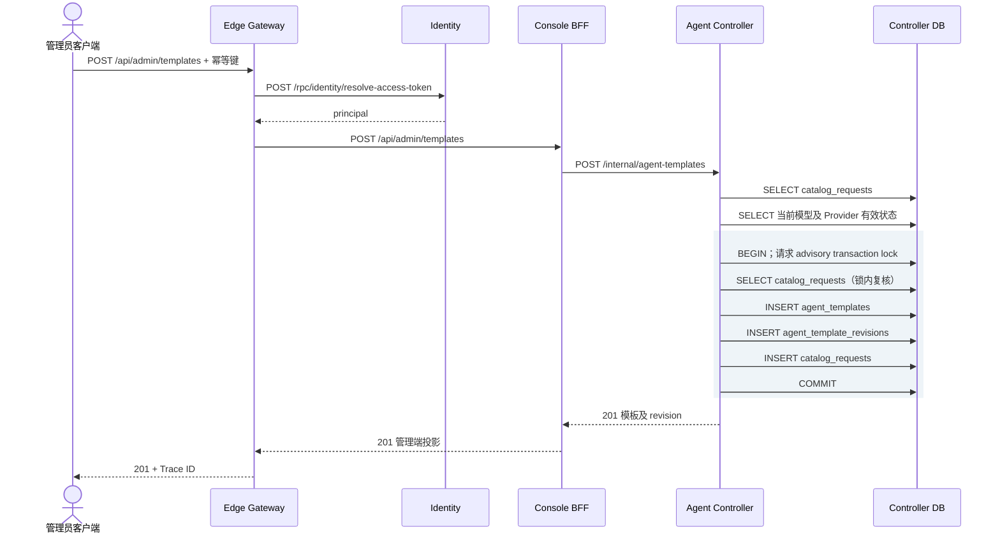

Controller 共 9 个执行 Span，1 个已提交事务；Identity 另有 SELECT 和按窗口更新 `last_used_at` 的 UPDATE。后者是会话使用记录，不是二次登录。

关键边界：模板保存原始 `runtime_input.image`。`latest`/tag 是用户意图，不在保存时解析为另一份固定配置。本次引用 `antnest/antnest-runtime:local`；实际构建时由 Runtime Controller 解析本次镜像，并保留原引用与解析结果。Trace 中没有 Runtime Controller、Egress、Temporal 或模型调用。

锁外幂等快查与锁内复核不同：前者让已完成请求尽早返回，后者防止并发同键写入。未来精简不能直接删掉锁内复核。模型启停与模板创建同时发生的语义不由这条成功 Trace 证明，仍需独立并发用例。

## 8. 五类生命周期的共同入口

### 8.1 准入、调度和实际执行分开

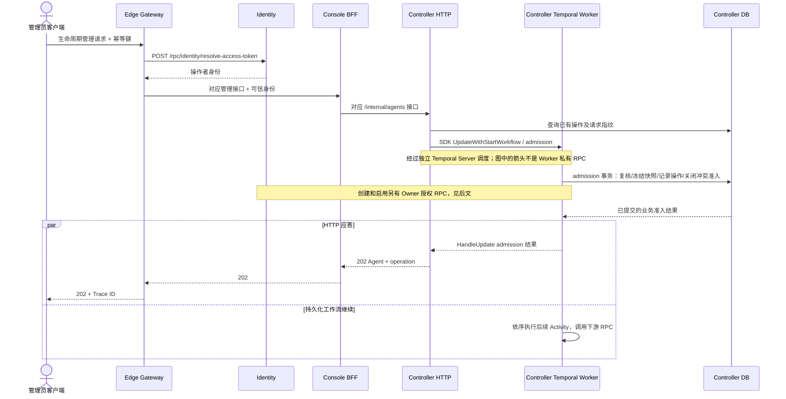

真实父子骨架是 `Gateway SERVER -> HTTP CLIENT/SERVER -> Controller SERVER -> UpdateWithStartWorkflow:admission -> RunWorkflow / HandleUpdate`，再由 `StartActivity -> RunActivity` 产生 SQL/RPC 后代。不是业务代码在每个 phase 创建 Trace，也不再依靠业务表扫描认领队列任务。

HTTP 202 只说明准入已提交，不说明 Agent 可用。新 Activity 可以在 202 返回完毕前开始，例如创建的 `network_ensure` 在 180.842ms 开始，Gateway 在 182.084ms 才结束；不能把两者画成严格串行。

### 8.2 仍然需要的持久化

| 位置 | 保留原因 | 不应承担的责任 |
| --- | --- | --- |
| Temporal history | 调度、Activity 至少一次执行、重试、Worker 续办 | 不做 Agent 列表/审计的业务查询权威 |
| `agents` | 当前生命周期、当前可执行修订、活动操作、准入门禁 | 不实现 MQ 消费租约 |
| `agent_spec_revisions` / `execution_revisions` | 冻结配置与实际部署结果；保证重试不偷读新配置 | 不代替 Temporal 调度历史 |
| `agent_lifecycle_operations` | 请求指纹、业务 phase、下游效果结果及失败诊断 | 不保存 Worker 调度状态和 Trace 传播载体 |
| `agent_events` / `event_journal_cursor` | 可追溯业务变化和读取游标 | 不驱动生命周期重试 |
| Runtime `operations` / `runtime_environments` / `generation_claims` / `observations` | 下游请求幂等、实际平台状态、物理 generation、观测 | 不理解 Provider、模板或身份 |
| Egress `agent_networks` / `agent_policy_assignments` / `runtime_attachments` | 稳定 Agent 网络、策略与部署通路；重建不丢规则 | 不调度 Runtime 创建 |

Temporal 不能让 Docker、网络写入或业务数据库自动变成 exactly-once，也不提供跨服务 ACID。保留稳定子请求 ID、CAS 与业务终态是合理的；是否每一步都需要完整聚合装载则是另一回事。

## 9. 创建 Agent

入口：`POST /api/admin/agents`，BFF 对应 `POST /internal/agents`。输入包含 Owner、模板及明确 revision、名称和请求身份；准入冻结配置，不在后续阶段重新从可变模板组装。

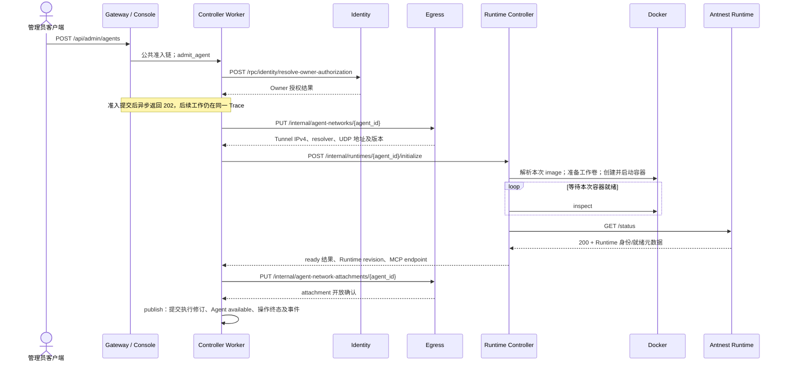

| Activity | 从 Gateway 请求开始的相对起点 | Activity 耗时 | 下游 |
| --- | ---: | ---: | --- |
| `admit_agent` | 63.008ms | 65.022ms | Owner 授权 |
| `network_ensure` | 180.842ms | 28.088ms | 网络分配 PUT 1 次 |
| `runtime_initialize` | 249.263ms | 2845.797ms | initialize 1 次；Runtime `/status` 1 次 |
| `publish` | 3134.493ms | 26.043ms | attachment PUT 1 次 |

整条 Trace 结束于 3191.475ms，不能用 HTTP 的 182ms 宣称构建已完成。Runtime Controller SERVER 占 2834.420ms；Docker 启动后有 6 次等待循环 inspect，约 500ms 间隔，然后一次 Runtime 状态核验。首个不存在资源的 Docker GET 404 后紧跟创建，是正常 ensure 路径；通用 HTTP Span 标为 error 并不代表整次构建失败。

本次解析元数据实际可见于 `runtime.platform.resolve_image/create`：原引用为 `antnest/antnest-runtime:local`，Docker image ID 为 `sha256:d074ed9e6099443e319b1657f548c9bab179d003be7270b046a8878875f66461`。这是本次本地镜像身份，不应冒充 registry manifest digest，也不能反写覆盖模板中的 tag。其长期持久化及 Runtime 自身上报范围须结合对应合同检查，不能因两个 Span 有值就推断所有后续 Span 都携带。

## 10. 重建 Agent

入口：`POST /api/admin/agents/{agent_id}/rebuild` → `POST /internal/agents/{agent_id}/rebuild`。

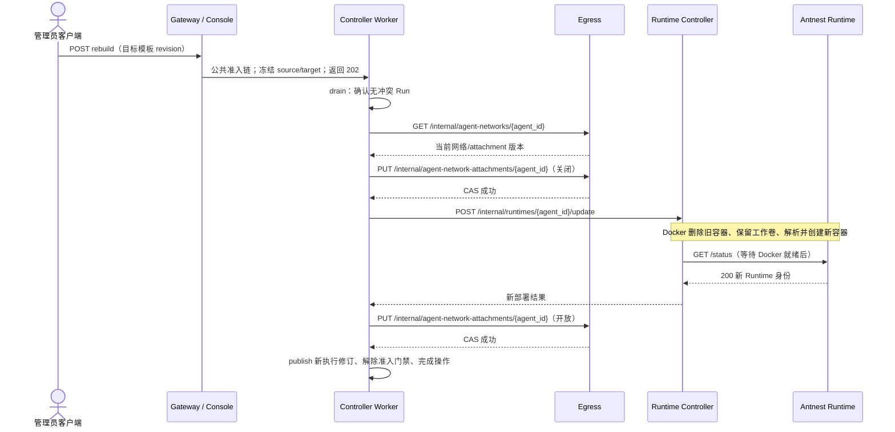

实际阶段为 `admit_lifecycle -> drain -> network_fence -> runtime_update -> network_ensure -> publish`。其中重建的 `network_ensure` **实际只做 attachment 开放**，不是重新分配 Tunnel IP。名称不能代替真实接口语义。

Runtime update SERVER 为 2945.284ms；Workflow 全链路 3312.521ms。先关闭网络，再替换容器，最后开放并发布，没有 ACP 网络调用。过程是显式重建，不是两个可写 Runtime 同时运行的滚动迁移；内存进程、`/tmp` 不能保证延续。

本样本没有运行中的 Run，因此 drain 只检查到可继续，不能证明繁忙时取消/等待、超时或未知工具效果处置正确。

## 11. 停用与启用 Agent

### 11.1 停用

入口：`POST /api/admin/agents/{agent_id}/disable` → `POST /internal/agents/{agent_id}/disable`。

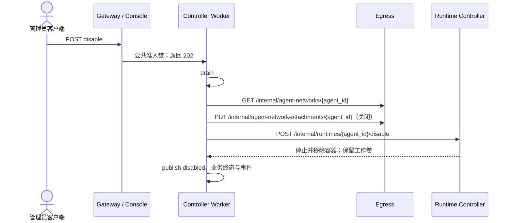

Activity 顺序为 `admit_lifecycle -> drain -> network_fence -> runtime_disable -> publish`。全链路 573.275ms，其中 Runtime disable SERVER 为 221.037ms。没有新容器 `/status`，也不释放 Agent Tunnel IP。

管理员与身份撤权可复用 Disable Workflow，但本 Trace 是管理员发起，不证明 SCIM 事件交付与撤权全链路。本图不能写成“停用用户已验收”。

### 11.2 启用

入口：`POST /api/admin/agents/{agent_id}/enable` → `POST /internal/agents/{agent_id}/enable`。

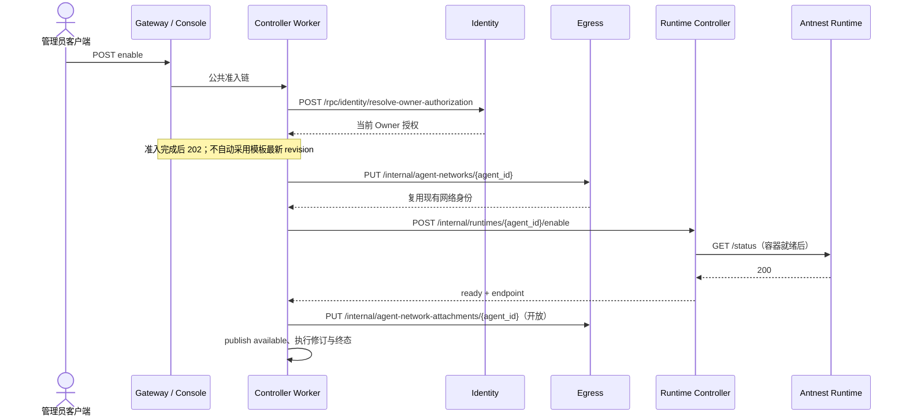

Activity 顺序为 `admit_lifecycle -> network_ensure -> runtime_enable -> network_restore -> publish`。全链路 3126.341ms，Runtime enable SERVER 为 2821.526ms。

Owner 授权与 Gateway token 解析不是重复身份 RPC：前者问“这个 Agent 的所属用户当前是否可拥有 Agent”，后者问“本次操作调用者是谁”，两者可能不是同一个人。

网络 ensure 的已有资源分支出现原生 Drop rollback，Trace outcome 为 `unconfirmed`，这是未等待数据库回滚确认的观测事实，不应标为成功提交，也不能等同业务失败。新 Egress 保留该语义。

## 12. 删除 Agent 与资源回收

入口：`POST /api/admin/agents/{agent_id}/delete` → `POST /internal/agents/{agent_id}/delete`。

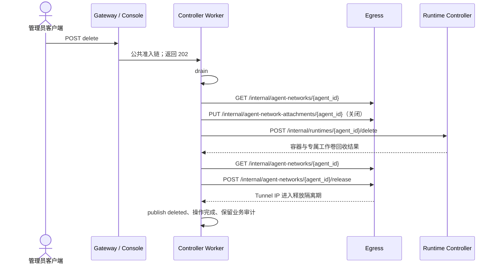

Activity 为 `admit_lifecycle -> drain -> network_fence -> runtime_delete -> network_release -> publish`。全链路 676.185ms，其中 Runtime delete SERVER 为 292.350ms。

两次网络 GET 分属关闭前与释放前，之间已经发生版本变更，不是同阶段重复查询。地址隔离期完成后复用由 Egress 自己处理，不让删除请求等待 TTL。共享系统 Skill volume 不属于此 Agent 的独占回收对象。

样本实际走了 Runtime delete；“已有可信缺失证明时跳过删除”是另一分支，不在本图中。Trace 的 RPC 成功还须结合资源终态断言，不能单独证明 Docker 中没有遗留对象；此前验收已经独立核对该测试 Agent 的容器与工作卷不存在。

## 13. 本轮 Egress 观测复验

最新镜像 `sha256:9a3e692d775bcb4d7775ddebf799cf0765cfb9a9fc100a4e846422d832214a3d` 已部署并健康。本轮通过 Gateway 对现有验收 Agent 提交相同网络 action 与当前版本，前后策略及版本不变；不是切换网络策略的 E2E，也不是 UDP 数据面验收。

入口为 `PUT /api/admin/agents/{agent_id}/network-policy`，经 Identity、Console、Controller 到 Egress `PUT /internal/agent-policy-assignments/{agent_id}`。四条跨服务调用各一次。

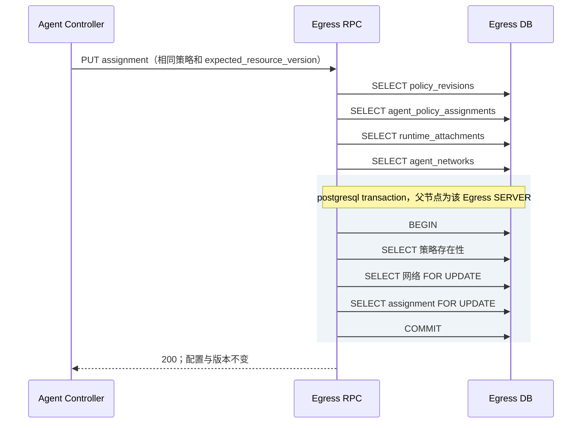

9 个数据库执行 Span，其中 5 个位于唯一事务内；7 个有原始占位符 SQL 正文。`db.namespace=antnest_egress`，数据库地址/端口来自连接配置，不再用 schema 或 Rust API 方法名充当数据库操作。没有 prepare/acquire、绑定参数/结果行或 IP 包 Span。

**“持久化值不变”不等于严格运行时 no-op**：采集此 Trace 的旧实现，在 attachment 开放时仍可能 fence 并重置流表后恢复路由。这不是 SQL Trace 能显示的数据面效果。后续代码修正及证据见 §17；本 Trace 不因源码更新而变成新版本的数据面证据。

检查器首次把四次事务外 SELECT 也当成事务内执行，已按真实父子关系修正；没有为让断言通过删除实际 SQL 或放宽事务层级检查。

## 14. 复杂度与可靠性评审

### 14.1 先量化，不把 Span 多直接当业务复杂

计数口径：含 BEGIN/COMMIT/ROLLBACK 的数据库执行 Span；不含事务包裹、connect、HTTP、SDK 工作流、Docker 或其他 INTERNAL Span。旧 Egress API 标签按实际执行计数，不按标题去重。

| 生命周期 | Controller 执行数 / 事务数 | Runtime Controller 执行数 / 事务数 | Egress 执行数 / 事务数 | Identity 执行数 |
| --- | ---: | ---: | ---: | ---: |
| 创建 | 66 / 9 | 22 / 2 | 22 / 2 | 3 |
| 重建 | 118 / 13 | 22 / 2 | 20 / 2 | 1 |
| 停用 | 87 / 11 | 19 / 2 | 11 / 1 | 1 |
| 启用 | 87 / 11 | 22 / 2 | 15 / 2 | 2 |
| 删除 | 75 / 13 | 19 / 2 | 19 / 2 | 1 |

Controller 每条请求都有两次幂等快查的只读事务以 rollback 结束；这是未命中返回的结束方式，不是发生了两次失败。活动阶段通常先在只读一致性事务中恢复状态，再在写事务中校验并推进 phase。跨 RPC 不维持同一数据库事务。

### 14.2 需要保留的保证

| 机制 | 保留理由 | 应避免的扩大解释 |
| --- | --- | --- |
| 调用者认证与 Owner 授权 | 管理员和 Agent 所属人是两种主体 | 不在每个下游重新做同一个 token 解析 |
| 请求指纹、锁内复核 | 避免并发同键创建和改参重放 | 快查不是名为 replay 的第二套业务执行 |
| 冻结 spec 与执行来源 | 异步执行、重试期间配置可能变化 | 不等于每个 phase 都要读取完整快照 |
| Temporal + 下游幂等 | Activity 是至少一次，响应可能丢失 | Temporal 不是跨服务事务原子性保证 |
| drain 与网络 fence | 避免仍有工具操作时撤换环境、避免旧通路继续工作 | 当前空闲样本不能证明繁忙分支 |
| CAS 与提交后终态 | 防止迟到阶段覆盖后续生命周期 | 不要因用工作流引擎就移除业务状态校验 |
| 原始镜像引用 + 本次解析身份 | 同时尊重管理员意图和支持追溯 | 不把本次镜像固定值偷偷替换模板 tag |

### 14.3 需要进一步精简或补证的项目

| 编号 | 已知事实与定位 | 建议与验收要求 |
| --- | --- | --- |
| R1 重复状态装载 | 重建每个 drain/network/runtime 阶段可见源/目标 spec 共 4 次读取、execution 2 次；publish 为 spec 6 次、execution 3 次。`AdvanceLifecycle -> loadLifecycleStage -> ReplayAgentRebuild` 返回完整状态，阶段写入后又装载返回状态 | 先设计阶段所需的窄结果，分开不可变执行输入与可变 phase/版本；保留提交时 CAS。用逐阶段 SQL 计数及重试、迟到 phase、快照不漂移测试验证，不以删锁或加跨请求缓存降数 |
| R2 就绪检查职责 | 创建和重建在容器启动后各有 6 次约 500ms inspect，后接 1 次 `/status`；主要耗时处于等待区间 | 自查确认应保留：Docker 本地探针证明进程健康；Controller 的 `/status` 额外证明可达性、Agent/generation 身份和 execution ID。当前循环有截止时间，不据此认定冗余，不另建事件系统 |
| R3 边界包装 Span | `runtime.lifecycle.*` 位于 RPC 分派；`runtime.platform.*` 是平台 Port decorator；`runtime.status.verify` 包裹 HTTP 调用 | 仅 RPC 分派的重复 INTERNAL 包装可进一步评估合并到 SERVER 边界。平台操作聚合部署效果，状态验证能标记 HTTP 200 中的合同错误；两者不等同于业务自己逐步骤埋点，不宜直接删除 |
| R4 Provider 创建证据旧 | 唯一现存创建 Trace 是 Repository 包装，不能审查逐 SQL | 补一次最新镜像下的受控创建 + 同键重放；不拿只读查询替代写事务验收 |
| R5 Egress 同值更新语义 | SQL 不变但应用仍可能重置流量状态；4 次锁外读与锁内 CAS 复核并存 | 先明确同值是否应该无扰动，再评估减少重复读取。用真实现有连接与并发版本用例验证；不能用最终 action 相同代替数据面连续性 |
| R6 部署覆盖配置漂移 | Controller 发布 loopback 调试端口，当前运行配置并非所有服务统一采用单入口覆盖文件 | 统一部署/更新入口并检查最终 `docker compose config` 与端口，不把健康状态当成入口隔离证据 |
| R7 确认到终态的前端链路 | 当前 5 条 Trace 证明后端准入及工作流推进，未包含浏览器订阅/重连/终态渲染 | 以后按独立读取/订阅根请求验证，不强行塞进原创建 Trace；保留页面冻结问题的专门回归 |

R1 源码依据：[阶段加载](../services/agent-controller/internal/application/lifecycle_workflow.go)、[重建恢复和完整状态装载](../services/agent-controller/internal/repository/postgres/lifecycle_rebuild.go)。Trace 不记录绑定参数，不能只凭 SQL 文本相同断言读取同一行；源/目标关系由这些函数的 ID 使用方式佐证。

R2/R3 源码依据：[有界就绪等待](../services/runtime-controller/internal/control/service.go)、[RPC 包装](../services/runtime-controller/internal/rpc/handler.go)、[平台观测 decorator](../services/runtime-controller/internal/telemetry/platform.go)、[Runtime 状态客户端](../services/runtime-controller/internal/runtimeclient/client.go)。这组 Trace 不能证明空闲 CPU 抬升由等待循环引起，不能把请求内等待与常驻后台负载混为一谈。

### 14.4 失败边界不能靠 happy path 推断

| 故障窗口 | 应维持的语义 | 当前证据 |
| --- | --- | --- |
| 202 前拒绝或改参重放 | 不创建第二份业务效果；请求身份冲突应可解释 | 有既有回归；本组 Trace 主要为成功准入 |
| 已准入、客户端断开 | 后台继续，客户端以后读取终态 | 架构及既有测试支持；本轮未做断网浏览器验收 |
| 下游完成但响应丢失 | 相同子请求重试，不能重建第二份环境或反向破坏 attachment | 既有测试记录，不是本组成功 Trace 直接证明 |
| Runtime 构建失败 | 不发布 available；明确失败阶段并保留诊断 | 本轮不新增故障 Trace |
| Worker 重启/Temporal 故障 | 可重试阶段续办；不重新使用变化后的模板 | 真实引擎测试另见生命周期文档；不是本轮 Docker 中断实验 |
| 并发模型停用/模板更新/身份撤权 | 不能以过期权限或快照绕过准入 | 需按各自业务场景审查，不能扩大本报告结论 |

## 15. 本轮验证与后续评审顺序

Egress 本轮串行验证：完整本地套件 107 通过；真实 PostgreSQL 私有事务 3 项与生产 Repository 7 项通过；Linux 镜像测试 108 通过；Node 观测脚本套件 126 通过；根级 `make fmt-check lint` 通过，Go standard 0 issues、两个 Rust Clippy 均拒绝 warning。真实 PostgreSQL 用例的默认忽略项已在专用数据库单独执行，不以 ignored 冒充通过。

本轮新取证是 Egress 同值策略提交与 Gateway 本地就绪，其他场景是重新查询已保留 Trace；未重跑完整 ACP、外部 Provider、浏览器或高负载测试。新 Egress 的负载/导出队列压力边界仍未做专门压测。

建议人工评审按以下顺序推进，每项确认后再决定是否修改：

1. 确认部署与登录图，接受本地 `/status` 不代表整套部署的区分。
2. 确认 Provider 与模型两层，以及模板仅保存原引用；补齐 R4 最新写入 Trace。
3. 以创建图检查准入、地址分配、Runtime ready、发布顺序。
4. 比较重建/停用/启用/删除，确认保留卷、释放地址、Owner 授权和准入语义。
5. 先处理 §16 的失败收敛、入口超时和验收断言，再精简 R1 阶段状态装载；R2 保留，R3 只评估重复包装，不以盲目减少 Span 数为目标。
6. 将 R5/R6 作为明确的小任务处理；前端/外部/故障验收继续保持独立范围。

复用入口：[业务总索引](business-flow-entrypoints.md)、[观测规范](observability-contract.md)、[数据库整改记录](observability-database-remediation.md)、[观测脚本](../tests/e2e/observability/)、[单节点运维](docker-single-node-operations.md)。本文件是评审底稿，不自动将上述待审议项标为完成。

## 16. 独立自查结论

本节保留修正前的问题及推理，当前处理状态见 §17。

### 16.1 范围与判断

三名只读审查者分别从流程完整性、简洁性、职责隔离进行检查，主审对候选问题沿调用链复核，所有审查者已关闭。仅审查上述管理热路径，不扩大到 ACP 聊天、其他身份流程、未启动服务或平台横向扩展。

| 维度 | 判断 | 限定 |
| --- | --- | --- |
| 完整性 | 成功主链成立，但失败收敛和入口超时有明确缺口 | 不能将五个成功生命周期样本推广为所有失败可恢复 |
| 简洁性 | 服务调用方向合理，阶段存储接口返回过宽 | 不必推翻 Temporal，也不应靠删 CAS、锁或冻结快照来减少 SQL |
| 职责隔离 | 本次所查链路未发现跨服务读写业务表 | Gateway/BFF 不拥有 Agent 生命周期；模板保存不应调用 Runtime；数据库权限隔离仍须运行证据 |

### 16.2 已确认的修正项

#### S1 / P1：删除的确定失败被降为无限等待

**触发链路：** Runtime Controller 在尚未产生删除副作用时返回终态 `failed / not_started`；Agent Controller 调用 `reconcileDeletedRuntime`，只要检查仍能看见 Runtime，就将结果改成 `ErrDependencyUnavailable`。Activity 无限重试仍复用同一个 `ChildRequestID`，而 Runtime Controller 对该请求直接返回已经保存的失败，不再执行删除。仅修正 Docker 环境不足以让这个同键请求恢复执行。

同时，`settleDeleteDrain` 的排空期限超过后也只返回可重试依赖错误，未形成可查询的失败终态。排空后来完成仍可推进，不能说所有超时都永久卡死；问题是该期限没有给持续未排空的操作提供结束或显式恢复语义。上层保留 `running/deleting` 和活动操作占用，既无法完成，也不能正常发起下一次生命周期。原始下游失败诊断保存在下游操作中，却没有作为此次上层失败结果返回。

依据：[删除阶段](../services/agent-controller/internal/application/lifecycle_delete.go)、[阶段适配](../services/agent-controller/internal/application/lifecycle_workflow.go)、[Activity 重试策略](../services/agent-controller/internal/orchestration/create.go)、[Runtime 操作终态重放](../services/runtime-controller/internal/control/service.go)。

**最小修正方向：** 区分仍在等待、执行效果未知、已明确拒绝三种结果。明确拒绝应保留原因并结束当前执行尝试；保留删除意图及必要的准入/fence，不能假装 Agent 恢复可用。修正配置后的显式恢复必须使用合法的新执行尝试身份，不能在定时重试中随机换 ID。未知效果继续核对，未证明资源消失前不得释放地址或发布已删除。

**必须补的回归：** ① 活动 Run 超过 drain 期限，失败可查询且不能越过隔离屏障；② 真实下游语义的 `failed/not_started` 重放不再无限重试，原始原因可见；③ 未知效果仍保守等待；④ 修正后显式恢复不会重复删除或提前释放网络。不要仅给 Workflow 增加总超时而遗漏业务状态收尾。

#### S2 / P2：Gateway 普通管理代理没有请求截止时间

`authenticate` 的 `requestTimeout` 只约束身份解析。`admin` 在成功认证后，仅对事件订阅设置 `streamLease`，普通管理请求直接进入 ReverseProxy。代理使用的是 `httpClient.Transport`，不是 `Client.Do`；服务器的 Read/Idle timeout 也不等于下游响应截止时间。Console 若接收连接却一直不返回，普通管理请求可持续等待到客户端断开。

依据：[管理代理和认证上下文](../services/edge-gateway/internal/server/handler.go)、[生产 HTTP Client/Server 配置](../services/edge-gateway/cmd/edge-gateway/main.go)。

**最小修正方向：** 在统一代理边界应用普通请求超时，订阅单独使用长连接租期；不在每个业务 handler 单独补计时器，不自动重试创建请求。

**必须补的回归：** 身份解析成功、下游阻塞时代理有界退出且取消下游；写请求只发一次；订阅不被普通请求期限误杀。

#### S3 / P2：Trace 检查器不能充分证明必要调用存在

`phaseRPC` 每阶段只列一条 RPC；`network_fence` 只要求 GET 当前网络，不要求随后 PUT 关闭 attachment。Runtime 阶段只要求 Controller 命令，不要求新建/重建样本中的 Runtime `/status` 验证。持久化断言仅查找任意后代 `db.query.text`，下游 Egress SQL 也能满足“Controller 业务投影存在”；链路断言主要检查祖先关系，不能完整约束各跳 CLIENT/SERVER 的配对。

这不表示已采集的成功 Trace 实际漏掉这些调用，而是以后删错步骤，当前检查器可能依然通过。

依据：[生命周期检查器](../tests/e2e/observability/lifecycle-workflow.mjs)、[合成 Trace 样本](../tests/e2e/observability/workflow-fixtures.mjs)。

**最小修正方向：** 按场景给出必要依赖调用序列、服务归属和提交结果。已证实资源缺失等合法分支单列，不要求它们虚构未发生的 RPC。SQL 数量用于比较成本，不能代替调用和业务效果断言；不新增一套通用流程引擎来做验证。

**必须补的反例：** 缺关闭网络 PUT、缺必要的就绪验证、仅留下下游 SQL、CLIENT/SERVER 断层，均应失败；合法的缺失资源分支和同键恢复应通过。

### 16.3 精简项与已排除的误判

| 项目 | 自查结果 | 后续方向 |
| --- | --- | --- |
| R1 完整状态反复加载 | 确认。`AdvanceAgentRebuild` 写完又通过 `loadAgentRebuildState` 装载 Agent、源/目标 spec 和 execution，而阶段调用最终只取 Operation | 先收窄写接口返回值，再分开页面投影与阶段执行输入；保留事务内必要判断，逐项比较查询成本和重试语义 |
| R5 同值策略重置流表 | 确认存在运行时副作用，不是已证明所有连接必然断开 | 若规定健康同值提交无扰动，应同时确认版本已应用、路由未 fence；fenced/未应用状态仍须修复。可参考本服务 `ensure_agent_network`，保留 CAS，补活动连接测试 |
| Provider 列表查询范围 | 连接详情查询组织全部模型后才按连接过滤，分页边界不匹配页面对象 | Controller 提供按连接过滤后分页；不能把遍历组织全部页面的补丁放进 BFF。当前有后续页时不会显示“No models added”，不夸大为固定空列表故障 |
| R2 两层就绪检查 | 不列为缺陷 | 平台健康与远端可达性/身份合同不同，保留有界检查 |
| R3 所有包装都应删除 | 不采纳 | 只考虑合并重复 RPC 分派 Span；平台副作用和 HTTP 200 中的合同错误仍需统一边界记录 |
| Temporal 与 Controller DB 是双重业务权威 | 未发现该问题 | Temporal 保存执行历史，业务 DB 保存 Agent/操作投影与 CAS；它们不是同一职责，也不能相互替代 |
| 后台正常等待返回依赖错误 | 可改善表达，不作为另起框架的理由 | 结合 S1 明确 pending 与失败，不能简单返回成功而让 Workflow 越过当前阶段 |

Provider 查询依据：[连接详情](../services/admin-console/web/src/pages/providers.tsx)、[Controller 列表输入](../services/agent-controller/internal/server/handler.go)。以上是局部合同优化，不要求 Gateway、Runtime 或 ACP 理解 Provider 模型分页。

### 16.4 证据边界与推进顺序

本次是静态审查，§15 为自查之前的执行结果，不是本次重新运行。没有启动测试、Docker、浏览器、外部 Provider，也没有读取秘密或修改业务代码。

当前真实 Temporal Worker 更换用例使用计数型 Activity；真实 PostgreSQL 的生命周期组件用例使用 Temporal test environment。两组证据各自有价值，但尚不能共同充当“真实业务事务提交后、Activity 完成确认前 Worker 中断”的直接证据。建议补一个真实 Temporal + PostgreSQL、幂等下游替身的交叉用例，在提交后故障注入，断言阶段、审计事件与外部效果不会重复，不扩成全平台故障矩阵。

依据：[真实引擎用例](../tests/integration/go/agent-controller/internal/orchestration/lifecycle_engine_test.go)、[PostgreSQL 组件用例](../tests/integration/go/agent-controller/internal/repository/postgres/workflow_component_test.go)。

建议实施顺序：**S1 失败收敛 → S2 请求超时 → S3 验收断言 → R1 阶段存储合同 → R5 同值语义**。每项单独补测试、验收后再推进；R4 新 Provider Trace、R6 部署入口和上述交叉故障测试分别补证，继续遵守每个场景提交 Jaeger 链接后等待人类检查的流程。前端订阅验收不因这次后端自查被标为完成。

## 17. 自查后的修正与验收边界

### 17.1 已实施的局部修正

| 项目 | 实际修改 | 保留的边界 |
| --- | --- | --- |
| S1 删除失败收敛 | drain 超期或 `failed/not_started` 结束当前操作、保留原始原因；Agent 为 unavailable、保留删除意图；新请求在 fence 后重新读取 Runtime 来源 | 未证明 Runtime 删除前不释放网络/Run；未知效果不被当成成功；旧请求只重放原结果 |
| S1 管理端闭环 | 默认管理员查询按实际 lifecycle_state 过滤，失败删除仍可见且只能显式再次删除；Console 以观察到的终态操作区分下一次意图 | 用户 workspace 仍排除删除意图；进行中禁用重复提交；HTTP 结果未知时继续复用原键 |
| S2 Gateway 超时 | 统一 admin 代理边界应用请求期限；事件 watch 使用独立 stream lease | 不在业务 handler 加计时器；不自动重发 POST；认证期限和转发期限分别有界 |
| S3 Trace 证据 | 校验各跳 SERVER/CLIENT、Controller 本地写事务/COMMIT、fence 写入与 Runtime status；失败启动需失败 RPC/journal；成功重投需同一 SDK Activity 身份 | 已关闭/隔离网络、权威资源缺失允许省略副作用，但须有对应 Agent 的 RPC 响应证明；关闭内容采集时不能从空白 Trace 猜这些分支 |
| R1 重建存储返回合同 | `AdvanceAgentRebuild` 仅返回 Agent、Operation 和 Run-release outcome，不再次装载源/目标 spec 与 execution | 不改锁、CAS、冻结输入；初始阶段恢复和最终 publish 未一并重写 |
| R5 Egress 健康同值请求 | 策略/版本相同且 open、已应用、未 fence 时只做 Repository CAS，不清除既有流或 conntrack | 陈旧版本仍冲突；fenced/未应用状态仍走完整修复屏障；不假装 DB 一致就等于运行态健康 |

R1 的明确收益是每次 advance 去掉 3 次不可变快照 SELECT，成功重建的三个 advance 合计 9 次；这是接口收窄的源码与驱动 Span 回归结果，不是重新测得的全链路总数。§14 的 118 次 Controller 执行计数属于旧 Trace，尚未覆盖替换。

### 17.2 回归与复核

主审串行运行全部验证；审查 agent 仅只读查代码、提出反例，不运行测试或操作共享实例。复查新增的真实遗漏包括：服务端默认列表仍按删除意图隐藏失败项、丢失响应保留的幂等键被下一次明确重试复用，以及 Trace 检查器误拒绝正常恢复分支。相应回归先复现失败，再修改实现。

| 验证 | 本轮结果 |
| --- | --- |
| Controller 全量、真实 PostgreSQL + Temporal、race | 14 packages，410 tests、382 subtests，0 skipped/failed |
| Console Web | 100 单元测试、220 组件测试通过；包括丢失响应、关闭重进、读取失败终态、再次删除获得新请求键 |
| Egress | 109 项非 PostgreSQL 测试通过；默认忽略的 3 项私有事务和 7 项 Repository PostgreSQL 测试单独全部通过 |
| Trace 与验收脚本 | 观测、生命周期和部署脚本合计 453 项通过；包含错子请求 journal、旧 attempt 状态混用、失败只读、意外副作用等反例，以及同 Activity 重放和权威资源缺失正例 |
| Gateway | 全量 race 回归通过；新增 GET/POST 阻塞有界取消、写请求仅一次、watch 不被短期限截断 |
| 根级准入 | `make -j1 fmt-check lint` 通过：Go standard 0 issues；两个 Rust Clippy 均 `-D warnings`；前端 lint/typecheck 通过 |
| 最终独立复核 | 服务侧无新增问题；Trace 脚本追加反例并修正后再次定点确认，原三类漏洞无残留；所有只读审查者已关闭 |

新增 [真实 Temporal + PostgreSQL 交叉测试](../tests/integration/go/agent-controller/internal/repository/postgres/workflow_commit_engine_test.go)：在 Runtime delete 阶段业务事务提交后、Activity 完成确认前停止 Worker，换新 Worker，验证 Runtime 删除、网络释放、最终审计事件各一次。下游是幂等测试替身；不是 Docker SIGKILL、真实 Runtime 故障或全栈断网测试。

Egress 无扰动测试通过数据面输入建立流并验证反向报文 peer、流计数和 kernel cleanup 调用次数；它不是新的真实内核长连接 E2E。保留同值但未应用、fence 修复及陈旧 CAS 反例，不以返回 action 相同替代验证。两个专用测试数据库已清理，没有新增验收容器。

最终检查器重新只读验证了 §12 所列五条已保存 Trace，全部通过，缺失父节点和 Jaeger warning 均为 0。这只能确认历史链路仍满足加强后的规则，不能替代新服务镜像的业务验收。

### 17.3 人工检查入口与未扩大范围

§17 代码验证完成时尚未替换运行中的服务镜像，也没有重跑浏览器、外部模型或五个线上生命周期；既有 Jaeger 链接仅作历史调用链参照。之后的更新部署与逐场景 Trace 复验单独记录在 §18，并在每个场景后等待确认。

R4 最新 Provider 写入 Trace、R6 部署入口配置统一、Provider 按连接分页的合同优化和新版本浏览器验收仍是独立后续项。R1 全阶段装载进一步精简也未宣称完成；不为这轮修正引入新缓存、消息队列或跨服务存储访问。

## 18. 新镜像逐场景复验（2026-09-12）

服务镜像基于 `8082e34` 已构建部署，保留 Temporal，不更换编排组件。本轮沿用已有数据库，
不是再次空白部署。逐场景执行真实入口请求、等待 6 秒后读取 Jaeger、以实际父子关系绘图，
再交给只读子 agent 审查完整性、简洁性和职责边界。未完成场景不沿用历史通过状态。

**9 月 13 日创建/就绪分离更新：** 两个 Controller 已重新构建部署。最新 BF-AGENT-04 证据以[创建场景](business-flow-agent-create.md)为准；下文第四项 181 Span 及四项生命周期仍为旧等待就绪版本的历史结果，不代表新合同已全量复验。

**9 月 13 日 Provider 复验更新：** Controller 与 Console 已重新构建为当前工作树版本，
仅重置 Controller 自有 schema，保留 Identity、其他服务数据、Temporal、Jaeger。
下表 Provider 状态与本节末尾结果已更新，其余场景不借此宣称重新通过。

**验收单位修正为真实用户流程。** 从页面动作到最终页面/业务结果，覆盖其间所有必要接口；
自动会话查询不是独立场景，HTTP 成功也不能替代页面完整可用。多条 Trace 可以共同支撑一条业务流程，
但必须说明关联依据；后台异步操作需验证最终状态，不能停在受理响应。

| 顺序 | 场景 | 本轮状态 |
| --- | --- | --- |
| 1 | BF-OPS-02 更新部署后的入口就绪 | 两条新 Trace 通过自动检查；[新时序与部署事实](business-flow-deployment.md#8-2026-09-12-更新部署后的入口复验)，用户已确认 |
| 2 | BF-AUTH-01 管理员登录并进入 Console | 真实表单登录 → 账号/概览完整显示 → 刷新后继续使用；8 条业务接口 Trace 与页面结果核对通过，[实际时序与证据](business-flow-local-admin-login.md)，用户已确认 |
| 模板前置 | BF-CAT-02 Provider 连接与模型 | 9 月 13 日新镜像：真实表单创建 → 三模型展示 → 刷新后核对；11 条请求 Trace、5 INSERT、持久化与模型参数一致，[时序与遗留](business-flow-provider-connection.md)，用户已确认；合成凭证、未调用外部模型 |
| 3 | BF-CAT-06 模板创建 | 浏览器创建 → 列表 → 详情 → 整页刷新；15 条请求 Trace 完整，创建 18 Span、3 INSERT，镜像标签和模型稳定引用正确，[场景记录](business-flow-template-create.md)，用户已确认 |
| 4 | BF-AGENT-04 Agent 创建 | 9 月 13 日创建/就绪分离新镜像：Gateway API 创建 164 Span + 独立观测 40 Span，持久化/容器一致；[最新时序](business-flow-agent-create.md)待人工验收，未重新进行浏览器/SSE 验收 |
| 5 | BF-AGENT-05 Agent 重建 | 9 月 13 日真实 Console 操作，231 Span；新容器、原工作文件保留，技术验收通过，待用户审阅 |
| 6 | BF-AGENT-06 Agent 停用 | 164 Span；容器回收、工作卷保留、入口清空，技术验收通过，待用户审阅 |
| 7 | BF-AGENT-07 Agent 启用 | 196 Span；Owner 复核、沿用 Spec、恢复原卷并发布新执行修订，技术验收通过，待用户审阅 |
| 8 | BF-AGENT-08 Agent 删除 | 173 Span；容器/独占卷回收、地址隔离、审计保留，技术验收通过，待用户审阅 |

第一项：[Gateway 自身就绪](http://127.0.0.1:16686/trace/a1a843bf002cffcc07dc359e1cc8aa25)，1 Span；
[首页代理](http://127.0.0.1:16686/trace/8774cde179262f76418e2b662de7151b)，3 Span。
两者均无错误、缺父、重复节点、正文或 Jaeger warning；首页无 Identity/Controller/ACP/SQL 调用。
R6 运行时应用端口漂移已修正，Temporal 的 loopback `7233` 作为基础设施调试端口明确列出，
不等于第二个应用入口。R4 最新写事务证据见下文；R1 和其他场景仍待逐项取证。

第二项已补真实 Chrome 交互：[提交管理员登录](http://127.0.0.1:16686/trace/ab2c085a03a913c831fac764b9dd3814)，12 Span；
[登录后概览](http://127.0.0.1:16686/trace/0cff9b77ce9c8c69ff5e3441f4b8f116)，21 Span；
[刷新后概览](http://127.0.0.1:16686/trace/a68cd61c1c74643ef6f45f23aff76ef0)，20 Span。
账号与概览在登录和刷新后均完整呈现；8 条业务接口请求均无缺父或 Jaeger warning，
初始未登录 401 为预期，其他成功链路无错误。概览由 Console BFF 并行汇总 Identity 目录与 Controller 三类库存，
本轮没有 Runtime/ACP/Egress/Temporal 业务调用。每个受保护请求单独鉴权不等于重新登录。
之前独立 Cookie 验收器只保留为 API 辅助证据，不再作为完整用户流程的通过依据。
该登录步骤保留最终浏览器页面，不创建 Provider、模板或 Agent；用户已确认，已推进以下 Provider 场景。

模板前置最新事实：[浏览器创建 Provider](http://127.0.0.1:16686/trace/0709a295bf7d1cf04b348afdd28c2104)，22 Span；
Controller 13 次 SQL，其中 12 次属于一个已提交事务，5 INSERT；Identity 另有 1 SELECT。
[创建后模型展示](http://127.0.0.1:16686/trace/4e8d649dc5ee790d291b3af2326c79a1)为 9 Span，
[刷新后模型展示](http://127.0.0.1:16686/trace/b45dd60b5228972559eb944ad5598385)为 10 Span，
多出的 1 次 UPDATE 属于 Identity 五分钟 last_used_at 采样，而非 Provider 写入。
11 条业务请求无错误、缺父或 warning；新增 1 连接（包含当前加密凭证）、3 当前模型、1 回执，
不再有 provider_credentials/model_profile_revisions 表。模型参数与请求逐项一致。
R4 最新存储结构的写事务证据已补，同键重放没有在这次浏览器中执行。
只读复核与 Trace 确认两项非阻塞待改：模型按组织分页后前端筛选连接、初始模型重复锁定同事务新建连接。
不因本次首屏样本正常而关闭这些问题；测试连接保留，用户已确认 Provider 场景并允许推进模板创建。
本轮为合成凭证，真实模型调用前需要换为有效凭证并完成 ACP 消费适配。仅修正了会话 Trace
验收器强制 UPDATE 的误判并补测试，没有扩展任何服务实现或重新声称完整 ACP 验收通过。

第三项已完成：[浏览器创建模板](http://127.0.0.1:16686/trace/0e76651c8fdebef9d3daddc7ccb907ff)，
18 Span；Controller 9 次 SQL，其中 7 次在同一已提交事务内，3 INSERT 分别为模板、初始修订和回执。
[创建后详情](http://127.0.0.1:16686/trace/052f561810ccf660760106e10f50e416)与
[刷新后详情](http://127.0.0.1:16686/trace/20ea2b5259a4897e3050771451868fe6)均为 9 Span。
完整页面流程 15 条业务请求已核对，零错误、缺父、重复 ID 和 warning。保存没有 Runtime Controller、
ACP、Egress、Temporal 或外部模型调用，原始 image_ref 和稳定 model_profile_id 保持一致。
新增“日常工作助手”模板及 revision 1，Agent 仍为 0；没有重放请求或生成额外修订。
只读子 agent 已报告并关闭：Provider 停用后选项资格与创建校验不一致应在停用入口开放前处理；
详情页提前加载修订模型选项是非阻塞精简项。完整边界与数据核对见模板场景文档。
用户已确认 BF-CAT-06，以下为第四项结果。

第四项：[浏览器创建 Agent](http://127.0.0.1:16686/trace/7fd1c30f9100cd89e94673fe886979b3)，
181 Span / 7 服务；POST 202 约 458 ms，完整异步创建约 4.48 s。三个推进阶段各执行一次，
主 Trace 无缺父、重复 ID 或 warning。两条 Docker 404 为创建前存在性探测，不是构建失败。
Agent `agent_116c8b47b1e9e5edc2c654cdd8cd0edf` 实际 available，operation completed，
Runtime running/healthy；模板/模型配置快照、执行绑定、真实镜像 ID 与 OTEL Resource 元数据一致。
23 个有限页面业务请求已核对；创建事件与完成事件关联同一主 Trace。当时保留 Agent 和独占卷供后续验收，
本节末尾的删除流程已回收运行资源。

本项不能宣称所有 Trace 均通过：刷新取消及五分钟 StreamLease 到期的 SSE 被标错；后者出现约
247 µs 的父子结束偏差 warning，严格检查失败已保留，没有修改门槛。源码只读审查另发现
发布前失效事件可能被游标消费的竞态候选（未动态复现）、阶段重复读取完整快照、旧 closeout runner
合同漂移，均记录在场景文档。没有扩大到故障注入或修改服务。用户已确认本次正常创建 Trace，
上述待改项不因此关闭；ACP/模型调用尚未推进。

第五至第八项已按用户要求连续完成：[四项生命周期 Trace 列表](business-flow-agent-lifecycle-traces.md)。
以 `017c105` 为基线，无服务实现改动，使用创建步骤的同一 Agent，真实 Console 操作均自动呈现终态。
四条主 Trace 均以 Gateway 为根，各 Activity 一次完成，缺父/重复 ID/warning 为零；
重建和启用各有一次预期 Docker 存在性检查 404。交叉断言确认请求身份、Runtime 修订、
网络 CAS、执行发布与事件关联一致；合成工作文件在重建和停启期间保持相同 SHA-256。
删除后计算容器与独占卷已回收，共享 Skill 卷、两份 Spec、三份执行修订和十条事件保留。

只读审查提醒现有 Trace 检查器不独立证明业务后置条件，本轮已用实际数据库、资源和页面补证。
Controller 重建/停用/启用/删除仍分别有 109/87/87/75 次 SQL（含事务控制语句），完整快照重复装载仍待精简。
本轮不重复故障、在途 Run、同键重放或所有 SSE/页面请求专项验收，也不关闭第四项的竞态和观测噪声。
