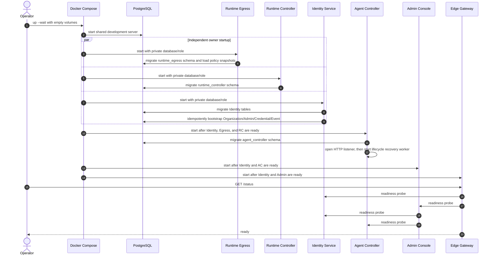
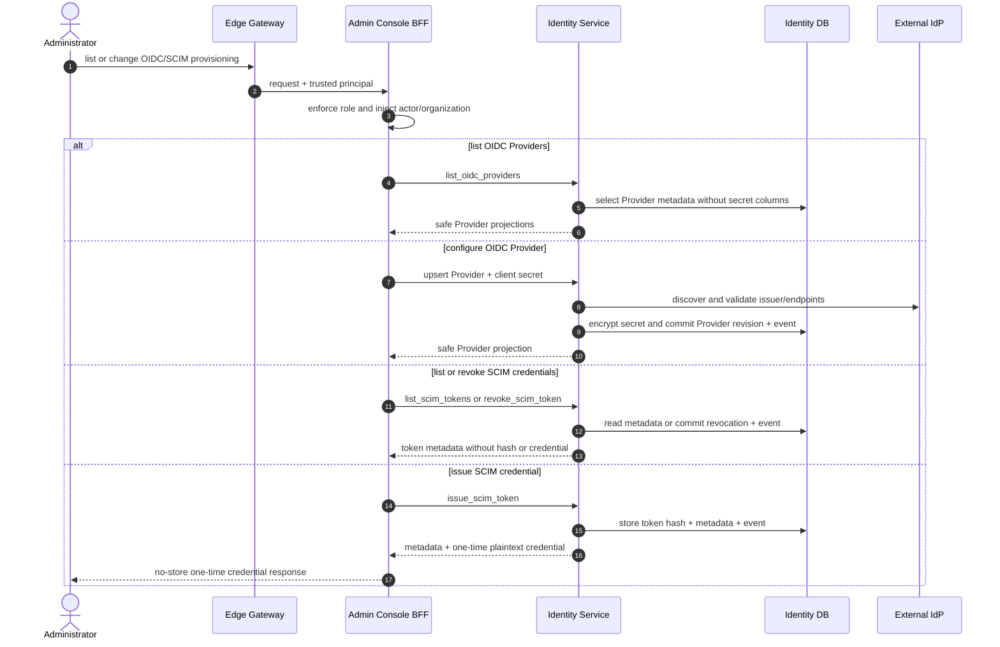
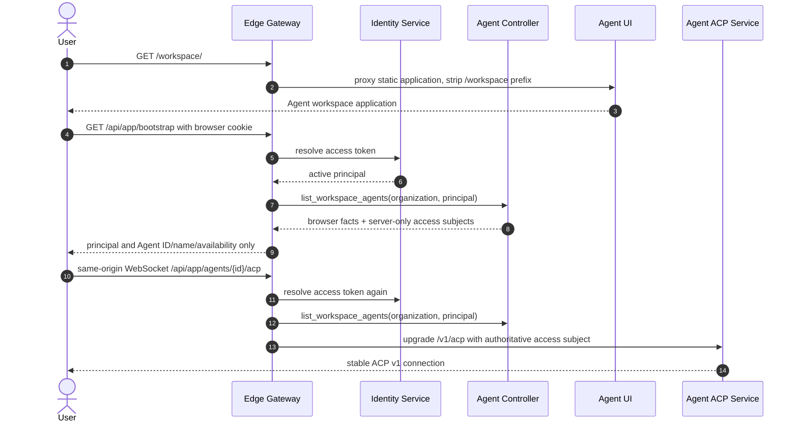
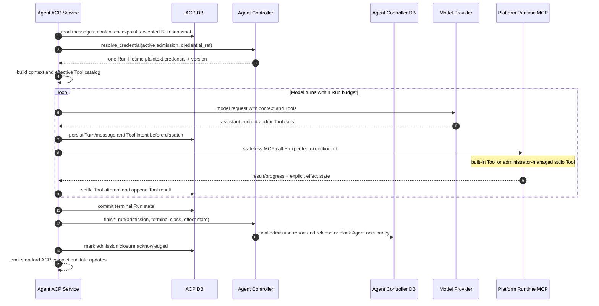
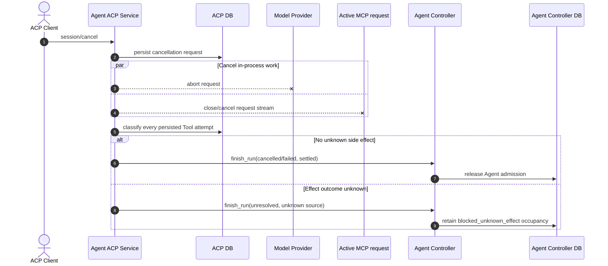
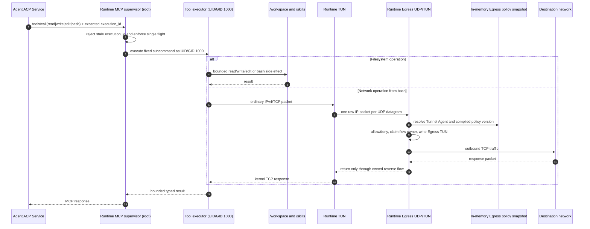
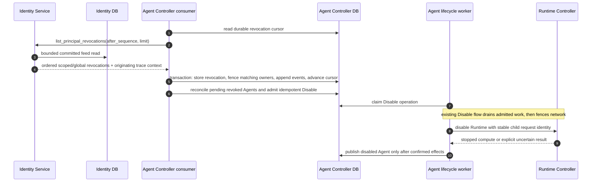

# Implemented Business Sequences

> Lifecycle execution update (2026-09-12): all five commands now use Temporal
> workflows and SDK Activities. The PostgreSQL worker, claim/lease scheduler and
> custom recovery spans described in the earlier analysis below are superseded
> by [the current lifecycle contract](../services/agent-controller/docs/lifecycle-workflows.md).
> The business ordering and domain transactions remain; there is no dual executor.

> Status: implemented-flow baseline and architecture review aid
> Updated: 2026-09-10
> Scope: Stage 1, Stage 2, and Stage 3 services currently implemented in this repository

The [business-flow entrypoint index](business-flow-entrypoints.md) catalogs the
current entries for subsequent per-flow expansion and Jaeger reconciliation;
the grouped scenarios below are not the complete entrypoint inventory.

The [Provider credential/model separation plan](provider-credentials-and-models.md)
defines the next DeepSeek-focused change and subscription-auth extension boundary.
It is not implemented yet; B04 and the current wire contracts below remain the
implementation baseline until their service-owned batches are delivered.

This document follows Antnest operations from their real entrypoints through
service calls, durable commits, deployment side effects, and user-visible
results. Its purpose is not to repeat every wire schema. Its purpose is to make
the cost and ownership of each business flow visible enough to challenge:

- redundant calls and duplicated authority checks;
- domain behavior in presentation or infrastructure adapters;
- reliability machinery that has no corresponding failure mode;
- ambiguous commit points and premature success responses;
- accidental coupling through another service's database or deployment facts.

The machine contracts under [`../contracts`](../contracts/README.md) remain the
wire authority. The Stage documents remain the domain-invariant authority.
When this document disagrees with code, the disagreement is a defect to resolve;
it is not permission to treat the sequence as an aspirational design.

## 1. Reading Rules

Each sequence starts at a deployed entrypoint and names its current exposure:

- **Edge public**: supported browser entry through Edge Gateway.
- **Internal RPC**: trusted deployment-network API, not public OpenAPI.

Database participants are always private service databases. A line to `Identity
DB`, for example, never means another service can issue Identity SQL.

Telemetry is omitted from most arrows for readability. Every HTTP boundary
propagates W3C trace context. Runtime packet forwarding deliberately has no
per-packet spans or payload logs.

Lifecycle admission and lifecycle execution are not one synthetic trace.
Admission retains its ordinary request trace. Every durable worker attempt
starts an independent root trace linked to the admission request and previous
attempt, and carries the lifecycle request ID, kind, and phase. Operators and
acceptance tests reconstruct the asynchronous Saga by querying that request ID
and aggregating the returned phase traces; an event's trace ID identifies only
the phase that emitted the event.

After B02 establishes the common authentication path, later administrator
diagrams may label `Edge -> Admin` as an authenticated command instead of
repeating the same `resolve_access_token` exchange. The Identity RPC still
occurs on every protected request.

### 1.1 Scenario catalog

| ID  | Business scenario                                  | Current entry                         | Durable authority                                 | User-visible completion                                 |
| --- | -------------------------------------------------- | ------------------------------------- | ------------------------------------------------- | ------------------------------------------------------- |
| B01 | Start an empty administrator platform              | Compose/operator                      | Each owner service                                | Edge `/status` becomes ready                            |
| B02 | Local administrator login and logout               | Edge public                           | Identity Service                                  | HttpOnly browser session created or cleared             |
| B03 | View dashboard and organization directory          | Edge public                           | Identity and Agent Controller                     | Current projections rendered                            |
| B04 | Create a Model Profile                             | Edge public                           | Agent Controller                                  | Immutable first revision returned; secret never echoed  |
| B05 | Create an Agent Template                           | Edge public                           | Agent Controller                                  | Immutable first revision returned                       |
| B06 | Create an Agent and Runtime                        | Edge public                           | Agent Controller                                  | Agent becomes available or visibly unavailable          |
| B07 | Observe lifecycle state                            | Edge public SSE                       | Agent Controller                                  | Ordered events and authoritative projection converge    |
| B08 | Disable and enable an Agent                        | Edge public                           | Agent Controller                                  | Compute removed/restored and state published            |
| B09 | Rebuild an Agent                                   | Edge public                           | Agent Controller                                  | New execution revision published after full replacement |
| B10 | Delete an Agent                                    | Edge public                           | Agent Controller                                  | Runtime/workspace removed and Agent marked deleted      |
| B10a | Open Agent workspace and admit an ACP connection  | Edge public                           | Identity and Agent Controller access projection    | Browser receives safe bootstrap and ACP v1 connection   |
| B11 | Create/resume an ACP Session and execute a Run     | Edge public ACP v1                    | Agent ACP Service plus Agent Controller admission | ACP response/state update reaches terminal state        |
| B12 | Execute Runtime tools and outbound network traffic | Internal MCP                          | Runtime execution; Egress policy                  | Tool result or explicit failure                         |
| B13 | OIDC login                                         | Edge public browser flow              | Edge Gateway and Identity Service                 | Existing Membership receives a browser session          |
| B14 | SCIM directory provisioning                        | Edge public protocol path             | Edge Gateway and Identity Service                 | SCIM resource and Identity event commit together        |

### 1.2 Cross-service data objects

| Object crossing a boundary | Producer -> consumer                      | Included                                                                 | Deliberately excluded                                    |
| -------------------------- | ----------------------------------------- | ------------------------------------------------------------------------ | -------------------------------------------------------- |
| Principal projection       | Identity -> Edge/Admin/Agent Controller   | opaque User, Organization, Membership IDs; active state; roles           | password, token hash, email where not needed, IdP claims |
| Model Profile request      | Admin -> Agent Controller                 | organization, model protocol/configuration, one plaintext credential     | credential in response, logs, events, traces             |
| Template revision          | Agent Controller -> Admin/Agent lifecycle | immutable model revision reference, prompt/context/runtime policy        | Provider secret, physical Runtime facts                  |
| Agent network attachment   | Runtime Egress -> Agent Controller        | Tunnel IPv4, resolver, UDP endpoint, packet contract revision            | Runtime generation, flow table, policy implementation    |
| Runtime configuration      | Agent Controller -> Runtime Controller    | image, resource limits, network attachment                               | Agent desired state, network policy rules, Run state     |
| Ready Runtime binding      | Runtime Controller -> Agent Controller    | opaque Runtime revision, MCP endpoint, execution ID                      | container/Pod ID, private generation, workspace name     |
| Run execution snapshot     | Agent Controller -> Agent ACP Service     | immutable execution/model/runtime facts and credential reference/version | plaintext credential, client MCP, conversation history   |
| Run-scoped credential      | Agent Controller -> Agent ACP Service     | plaintext secret for one active admission                                | durable Run copy, log/event/trace copy                   |
| Agent event                | Agent Controller -> Admin                 | sequence, Agent/operation identity, bounded event data, trace ID         | Tool payloads, Provider secret, platform logs            |

## 2. Platform And Administrator Entry

### B01. Empty platform bootstrap and readiness



**Commit points and data**

- Every service runs only its own migrations and uses its own database role.
- Identity bootstrap creates `organizations`, `users`, `local_credentials`,
  `organization_memberships`, and `identity_events` in one owner service.
- Admin Console and Edge Gateway have no database and no migrations.
- Runtime containers are not created at platform startup; they are Agent
  lifecycle resources.
- Agent Controller readiness checks its database. The HTTP listener can become
  reachable just before the lifecycle recovery worker starts, and readiness does
  not wait for stale operations to finish recovery.

**Complexity review**

- Sharing one PostgreSQL process in development is resource reuse, not shared
  ownership. The independent databases/roles preserve the production split.
- Edge probes Identity directly and indirectly through Admin Console. This is a
  duplicate health request, but both are direct runtime dependencies of Edge:
  Identity serves login/session resolution and Admin serves the application.
  It is low-cost readiness evidence, not a business workflow mechanism.
- Readiness is deliberately shallow. It proves immediate dependency access; it
  does not try to prove Docker can build a future Agent or that an external IdP
  is online.

### B02. Local administrator login, request authentication, and logout

```mermaid
sequenceDiagram
    autonumber
    actor Browser
    participant Edge as Edge Gateway
    participant Identity as Identity Service
    participant IDDB as Identity DB
    participant Admin as Admin Console

    Browser->>Edge: GET /api/session
    alt Existing valid session
        Edge-->>Browser: principal
        Browser->>Browser: enter administrator surface or Agent workspace
    else No valid session
        Edge-->>Browser: 401
        Browser->>Browser: show login
    else Session service unavailable
        Edge-->>Browser: transient error
        Browser->>Browser: offer session-read retry without document reload
    else Terminal access or missing endpoint
        Edge-->>Browser: 403 / 404 / 410
        Browser->>Browser: show terminal failure without retry
    end

    opt Login is required
        Browser->>Edge: POST /api/session/login {organization_slug,email,password}
        Edge->>Edge: consume source + normalized-account admission budget
        Edge->>Identity: local_login
        Identity->>IDDB: read Organization, Membership, User, LocalCredential
        Identity->>Identity: verify Argon2id password
        Identity->>IDDB: commit hashed API token and login event
        Identity-->>Edge: principal + one-time plaintext access token
        Edge-->>Browser: HttpOnly token cookie + readable CSRF cookie
    end

    Browser->>Edge: protected /api/admin request + CSRF header when mutating
    Edge->>Identity: resolve_access_token(token)
    Identity->>IDDB: validate token and effective active principal
    Identity-->>Edge: IDs, roles, active state
    Edge->>Edge: require administrator and replace X-Antnest-* headers
    Edge->>Admin: request with trusted principal projection
    Admin-->>Edge: response
    Edge-->>Browser: response

    Browser->>Edge: GET /api/admin/account
    Edge->>Admin: account request + trusted principal projection
    Admin->>Identity: get_current_account(actor, organization)
    Identity->>IDDB: read active Membership and local-credential existence
    Identity-->>Admin: safe profile + Organization presentation + local-password capability
    Admin->>Admin: strip User, Membership, and Organization IDs
    Admin-->>Edge: allowlisted current-account DTO
    Edge-->>Browser: account + Organization labels + capability

    Browser->>Edge: DELETE /api/session + CSRF
    Browser->>Browser: keep current page; disable duplicate sign-out
    Edge->>Identity: revoke_access_token(token)
    alt Revoked or already invalid
        Identity->>IDDB: commit revocation and event when active
        Identity-->>Edge: revoked | already_invalid
        Edge-->>Browser: expire access and CSRF cookies; 204
        Browser->>Browser: close account interactions; show login
    else Retryable Identity failure
        Identity--xEdge: unavailable
        Edge-->>Browser: preserve cookies for retry; 503
        Browser->>Browser: keep current page and show sign-out failure
    end
```

**Commit points and data**

- The raw token is returned once by Identity, held only in an HttpOnly cookie,
  and never returned in Edge JSON.
- Identity owns token hashes and effective User/Membership/Organization state.
- Identity also owns the current-account profile, Organization name and slug,
  and whether the User has a local credential. The BFF does not infer password
  capability from Membership source and never returns identity IDs, a
  credential row, or a password hash in this browser DTO.
- Edge owns cookie shape and CSRF policy but stores no server-side session row.
- Incoming identity headers are discarded before verified headers are added.

**Complexity review**

- Resolving the opaque token on every protected request adds one Identity RPC.
  It also makes revocation, User disable, Membership disable, and Organization
  disable effective on the next request. Keep this simple behavior until load
  data proves a bounded cache is necessary; caching would add invalidation and
  stale-authorization semantics.
- Token resolution is an authoritative `SELECT`. A conditional best-effort
  `last_used_at` update occurs only after the five-minute sampling window and
  cannot change the authorization result.
- CSRF is required because authentication uses cookies. It is not redundant
  with SameSite: browser and deployment behavior can change, while the explicit
  token makes mutation intent visible.
- Edge bounds Argon2 work with replica-local source and normalized-account
  admission windows. The maps are capacity-bounded and fail closed for new keys.
- Logout is remote-first and idempotent. Cookies are cleared only after Identity
  confirms `revoked` or `already_invalid`, so a retryable outage cannot discard
  the credential required to retry revocation.
- Console mirrors that outcome, not a `finally` block: pending sign-out disables
  repeat submission, a failure remains actionable in the account area, and
  confirmed logout or session expiration clears the previous session's open
  navigation and account dialogs.
- Current-account loading is optional presentation work after authentication.
  Its failure leaves the Console session and primary pages usable, exposes a
  local retry, uses neutral labels rather than opaque identity IDs, and fails
  closed by hiding local-password rotation.
- Edge performs coarse administrator admission. Owner services enforce their
  state and reference invariants, but Agent Controller's administrator actor and
  tenant scope are currently supplied only by the BFF pre-read; closing that gap
  is listed in Section 8. Trusted networking removes service authentication, not
  business authorization.

### B03. Dashboard and directory reads

```mermaid
sequenceDiagram
    autonumber
    actor Browser
    participant Edge as Edge Gateway
    participant Identity as Identity Service
    participant Admin as Admin Console
    participant AC as Agent Controller
    participant IDDB as Identity DB
    participant ACDB as Agent Controller DB

    Browser->>Edge: GET /api/admin/overview
    Edge->>Identity: resolve_access_token
    Identity-->>Edge: administrator principal
    Edge->>Admin: GET /api/admin/overview + trusted headers
    par bounded buffered reads under one deadline
        Admin->>Identity: list_directory(actor, organization)
        Identity->>IDDB: read Organization, Memberships, Users, Groups
        Identity-->>Admin: scoped directory projection
    and
        Admin->>AC: list Model Profiles by organization
        AC->>ACDB: read current heads
    and
        Admin->>AC: list Templates by organization
        AC->>ACDB: read current heads
    and
        Admin->>AC: list Agents by organization
        AC->>ACDB: read current Agent projections
    end
    Admin-->>Edge: browser DTO section envelopes
    Edge-->>Browser: overview response
    Browser->>Browser: derive Model → Template → Directory → Agent readiness
    opt transient section failure
        Browser->>Edge: explicit GET /api/admin/overview (refresh disabled while pending)
        Edge->>Admin: trusted aggregate refresh
        Admin-->>Edge: refreshed envelopes or safe required-read failure
        Edge-->>Browser: HTTP status + safe errors
        Browser->>Browser: preserve loaded data on failure; terminal errors have no retry
    end
```

**Complexity review**

- The overview performs four buffered reads concurrently under one bounded
  context. Its latency is bounded by the slowest dependency, and no worker
  goroutine writes the HTTP response.
- Identity data and Agent data are not joined in SQL. The BFF returns separate
  projections instead of inventing a cross-service aggregate record.
- Agent inventory is required. Directory and catalog sections use stable
  availability envelopes, so optional dependency failure does not erase fleet
  state. A degraded envelope names only the affected business resource and
  carries a safe HTTP status and omits upstream addresses and error details.
  A failed required read preserves its safe status rather than turning a
  `403`/`404`/`410` into `503`. Successful responses are explicit browser allowlists and contain no
  Provider credential reference, access subject/revision, Runtime execution
  identity, or MCP endpoint.
- The browser derives the first-run path only from these section envelopes. It
  persists no setup workflow. `unavailable` is retryable only for transient
  failures; terminal failures remain visible without retry. An available
  empty list remains a prerequisite action, and later resources stay blocked
  until their real owner-service dependencies exist.
- Active Directory readiness requires both User and Organization Membership
  state to be active; disabled records remain administrable but do not count as
  available Agent owners.
- The aggregate is an Overview-only read model. The Template page independently
  reads Templates, Model choices, and the Console's Runtime image default; the
  Agent page independently reads Agents, Template choices, and Directory owners.
  Those resource pages therefore neither duplicate their primary query through
  `/overview` nor inherit failure from an unrelated overview section.
- Model Profile inventory/detail and release-managed Catalog metadata are also
  independent browser reads. Catalog failure preserves stored Profile facts and
  human labels, closes only connect/revise actions, and remains locally
  retryable without replacing the primary page.
- Revision-qualified Catalog detail reads only the requested immutable Model or
  Template revision; it does not fan out to the mutable current head. Template
  detail resolves its referenced Model revision independently, so that lookup
  can fail and retry without hiding the Template configuration.
- Inventory continuation follows Browser -> Edge -> Admin -> owner service
  using the same organization scope and opaque cursor. A later-page
  `403`/`404`/`410` preserves loaded records but stops traversal; a transient
  failure offers one explicit retry of that cursor, with duplicate submission
  disabled while pending. Successful pages merge by resource identity.
- Current and Deleted Agent inventories keep separate cursors and failures.
  Selecting Deleted starts its first query. Failure remains a completed read
  attempt, not an instruction to fetch again from an effect. Switching tabs
  does not retry it or transfer its error into the Current Fleet; a transient
  failure is repeated only when the administrator requests retry.

### B03a. Directory administration

```mermaid
sequenceDiagram
    autonumber
    actor Browser as Administrator
    participant Edge as Edge Gateway
    participant Admin as Admin Console BFF
    participant Identity as Identity Service
    participant IDDB as Identity DB

    Browser->>Edge: create local user or update local Membership
    Edge->>Admin: command + trusted principal
    Admin->>Admin: inject actor, organization, request ID
    Admin->>Identity: scoped directory command
    Identity->>IDDB: authorize and commit fact + audit + revocation when deactivating
    IDDB-->>Identity: committed projection
    Identity-->>Admin: secret-free result
    Admin-->>Edge: explicit browser DTO
    Edge-->>Browser: successful command result
    Browser->>Browser: close dialog; retain dismissible success; keep row actions closed
    Browser->>Edge: GET /api/admin/directory
    Edge->>Admin: refreshed read + trusted principal
    Admin->>Identity: list_directory
    Identity-->>Admin: directory projection or safe error
    Admin-->>Edge: browser projection or safe error
    Edge-->>Browser: refresh result
    alt refresh succeeds
        Browser->>Browser: replace snapshot; reopen eligible member actions
    else refresh fails
        Browser->>Browser: retain old records + command success; keep member actions closed
    end
```

- SCIM Memberships and Groups are visible but not locally editable. Identity,
  not the browser, enforces this ownership boundary.
- Membership deactivation affects one Organization. Global User activation is
  a separate command restricted to system administrators and can affect every
  Organization; deactivation locks and validates every affected Organization.
- Identity locks the Organization while removing administrator access and
  rejects the command when no other effective administrator remains.
- Refresh failure does not undo command success or resubmit the command. A
  transient read failure retries only the Directory query, with one read in
  flight; a terminal failure offers no retry. Both compact and desktop row
  controls require a fresh snapshot before capturing the next mutation target.

### B03b. Enterprise provisioning administration



- OIDC Provider reads and writes require a system administrator. The list query
  never selects encrypted secret columns, so a later projection bug cannot
  redisclose the secret.
- SCIM credential management accepts an organization administrator. Multiple
  active credentials support rotation; revoked credentials remain visible as
  audit metadata.
- The BFF uses explicit browser DTOs. Client secrets, token hashes, and SCIM
  credentials are absent from ordinary reads, logs, and traces. A newly issued
  SCIM credential exists only in the no-store response and in transient page
  memory until the administrator closes the dialog.
- Provider save/toggle and SCIM revocation retain their success acknowledgement
  if the following section read fails. While a Provider change is pending,
  another edit cannot capture the pre-change Provider. SCIM issuance exposes
  its one-time credential independently of token-list refresh; a clipboard
  failure keeps that credential visible for explicit retry, and closing the
  dialog clears it from page state.

## 3. Catalog Management

### B04. Create a Model Profile

```mermaid
sequenceDiagram
    autonumber
    actor AdminUser as Administrator
    participant Edge as Edge Gateway
    participant Identity as Identity Service
    participant Admin as Admin Console BFF
    participant AC as Agent Controller
    participant ACDB as Agent Controller DB

    AdminUser->>Edge: GET /api/admin/model-catalog
    Edge->>Admin: trusted administrator principal
    Admin->>AC: GET /internal/model-catalog
    AC-->>Admin: supported providers, models, and authoritative limits
    Admin-->>AdminUser: provider and model choices
    AdminUser->>Edge: POST /api/admin/model-profiles + CSRF + stable Idempotency-Key
    Edge->>Identity: resolve_access_token
    Identity-->>Edge: administrator principal
    Edge->>Admin: trusted organization and actor IDs
    Admin->>Admin: validate input; derive request_id and profile_key from organization + key
    Admin->>AC: POST /internal/model-profiles with credential
    AC->>AC: canonicalize known model metadata and seal credential
    AC->>ACDB: transaction: catalog request + credential + head + revision
    AC-->>Admin: profile head + immutable revision, no secret
    Admin-->>Edge: created Model Profile
    Edge-->>AdminUser: created Model Profile
    opt response lost after commit
        AdminUser->>Edge: retry unchanged form values + same Idempotency-Key
        Edge->>Admin: trusted principal + same creation request
        Admin->>AC: identical request_id, profile_key, and payload
        AC->>ACDB: replay catalog_requests
        AC-->>Admin: existing Model Profile
        Admin-->>AdminUser: creation confirmed; no duplicate Profile or credential
    end
```

**Durable records**

- `catalog_requests` provides fingerprinted idempotency for an exact internal
  `request_id` replay.
- `provider_credentials` stores only encrypted secret material and version.
- `model_profiles` is the mutable head; `model_profile_revisions` is immutable.
- The built-in model catalog is release metadata and creates no durable record.

**Complexity review**

- A transport timeout after credential commit must not create another
  secret/profile pair on retry. Browser request identity survives ambiguous
  failures. The BFF derives the resource key from that identity and trusted
  organization; no timestamp or browser-generated key changes the replay
  fingerprint. A later confirmed new action gets a new key.
- Admin Console generates authority fields and the request ID. Agent Controller
  validates the organization-owned model and is the sole writer, but the actor
  itself is not part of the owner command or audit fact.
- Returning only the revision and credential reference keeps later Template and
  Run paths independent from secret storage shape.
- Provider/model presets are constrained to protocols implemented by Agent ACP
  Service. For known models the administrator cannot override endpoint or
  token limits; custom OpenAI-compatible APIs remain explicit and fully
  configurable.

### B05. Create an Agent Template

```mermaid
sequenceDiagram
    autonumber
    actor AdminUser as Administrator
    participant Edge as Edge Gateway
    participant Identity as Identity Service
    participant Admin as Admin Console BFF
    participant AC as Agent Controller
    participant ACDB as Agent Controller DB
    AdminUser->>Edge: POST /api/admin/templates + CSRF + stable Idempotency-Key
    Edge->>Identity: resolve_access_token
    Identity-->>Edge: administrator principal
    Edge->>Admin: trusted organization and actor IDs
    Admin->>Admin: apply defaults; derive request_id and template_key from organization + key
    Admin->>AC: POST /internal/agent-templates
    AC->>ACDB: replay original request before resolving mutable inputs
    alt completed request exists
        AC-->>Admin: original immutable revision
    else new command
        AC->>ACDB: read exact Model Profile revision
        AC->>AC: validate same organization
        AC->>AC: validate Runtime configuration and image reference syntax; preserve submitted reference
        AC->>ACDB: transaction: catalog request + Template head + immutable revision
        AC-->>Admin: Template head + revision
    end
    Admin-->>Edge: created Template
    Edge-->>AdminUser: created Template
```

**Complexity review**

- Template creation has no Runtime, Egress, or Identity side effect. It should
  remain one Agent Controller transaction.
- As with Model Profile creation, unchanged browser retries retain the command
  identity. The BFF derives a stable Template key from the organization-scoped
  request ID, and the owner ledger replays the committed result. A confirmed
  subsequent creation starts a new command identity.
- The Console currently supplies product defaults such as context policy and
  default Runtime image. This is acceptable for the Stage 3A product surface,
  but behavior-critical defaults must ultimately have one versioned owner. If
  another client appears, move those defaults into Agent Controller rather than
  duplicating them across clients.
- A zero-Skill Template remains valid. Skill Registry is not involved in the
  current flow.
- The browser defaults to the platform image without a digest input. An explicit
  tag may be selected, and is required when no default is configured.
  Revision requests preserve the Template's image reference even after deployment
  defaults change. Ordinary details show an available repository/tag, not its
  digest; an unnamed image ID is displayed as `Platform runtime`.
- Template publication never calls Runtime Controller or Docker. During a later
  Runtime build, Runtime Controller resolves the configured reference, persists
  the image ID in its operation, and creates the container by that ID. Replaying
  that build uses the persisted ID; a new build resolves the reference again.

### B05a. Publish a Catalog revision

- Model and Template forms call their BFF revision endpoint through Edge, using
  the existing trusted organization and request-identity boundary. Agent
  Controller commits the revision and returns its authoritative number.
- A rejected command leaves the dialog and input intact. While publication is
  pending, the dialog cannot close or submit a duplicate command. Success closes
  it, updates the displayed record from the returned projection, and leaves a
  dismissible acknowledgement; the browser does not increment a revision number
  optimistically.
- A Template's referenced Model is a separate immutable read after publication.
  Failure cannot erase the published Template or turn success into a request to
  publish again. A transient retry repeats only that Model query.
- Historical Model/Template routes read the requested revision directly and
  expose no publish action. Terminal detail failures keep a return path but no
  automatic or manual retry of the failed read.

## 4. Agent Lifecycle

### B06. Create an Agent and its first Runtime

```mermaid
sequenceDiagram
    autonumber
    actor AdminUser as Administrator
    participant Edge as Edge Gateway
    participant Identity as Identity Service
    participant Admin as Admin Console BFF
    participant AC as Agent Controller
    participant Worker as Agent Lifecycle Worker
    participant ACDB as Agent Controller DB
    participant Egress as Runtime Egress
    participant EDB as Egress DB
    participant RC as Runtime Controller
    participant RCDB as Runtime Controller DB
    participant Docker
    participant Runtime as Antnest Runtime

    AdminUser->>Edge: POST /api/admin/agents + CSRF
    Edge->>Identity: resolve_access_token
    Identity-->>Edge: administrator principal
    Edge->>Admin: trusted organization and actor IDs
    Admin->>AC: CreateAgent(stable request_id, organization, actor, owner, Template revision, name)
    AC->>Identity: resolve_owner_authorization(organization, owner_user_id)
    Identity-->>AC: active owner Membership + last_revocation_sequence
    AC->>ACDB: read exact Template and Model Profile revisions
    AC->>ACDB: transaction: Agent + owner authorization sequence + AgentSpec + access binding + operation + event
    AC-->>Admin: 202 running operation + provisioning Agent
    Admin-->>Edge: accepted operation and Agent projection
    Edge-->>AdminUser: creation accepted; subscribe to progress
    Worker->>ACDB: claim due operation with lease + fencing attempt
    Note over Worker,ACDB: every completed external phase stores evidence and the next phase before another claim
    Worker->>Egress: EnsureAgentNetwork(agent_id)
    Egress->>EDB: allocate/reuse Tunnel IPv4 and policy assignment
    Egress-->>Worker: network attachment
    Worker->>RC: InitializeRuntime(child_request_id, agent_id, configuration)
    RC->>Docker: inspect configured image reference and resolve actual image ID
    RC->>RCDB: persist operation, image reference/ID, and logical Runtime Environment
    RC->>Docker: create workspace volume and compute generation
    Docker->>Runtime: start with one RuntimeSpec and image diagnostic metadata
    Runtime->>Runtime: initialize executor, TUN, MCP, and status
    RC->>Runtime: bounded GET /status
    Runtime-->>RC: ready + execution_id
    RC->>RCDB: commit ready Runtime revision and observations
    RC-->>Worker: runtime_revision + MCP endpoint + execution_id
    Worker->>Egress: CAS open attachment at publication barrier; retain desired policy
    Worker->>ACDB: transaction: ExecutionRevision + available Agent + completed operation + ready event
    ACDB-->>AdminUser: SSE wake-up; browser re-reads Agent and Operation
```

The Console derives two Owner views from its scoped Directory read. Only Users
with an active account and active Organization Membership appear in the create
selector. The full retained Directory projection remains available for current
and deleted Fleet presentation, so a later deactivation prevents new
assignment without erasing the historical Owner name or email.

**Commit points and owned data**

- Agent Controller first commits intent and immutable Agent configuration. It
  never reports `available` before Runtime readiness and final publication.
- Runtime Egress owns `agent_networks` and `agent_policy_assignments`.
- Runtime Controller owns `operations`, `runtime_environments`, private
  `generation_claims`, and `observations`; Docker owns the actual volume and
  container.
- Agent Controller's second publication transaction creates the executable
  binding and semantic event.

**Complexity review**

- Lifecycle execution now follows the smaller reviewed design: the request
  commits intent and returns `202`; the same PostgreSQL-leased worker claims new
  and retrying operations. No queue or workflow platform was introduced.
- Request fingerprinting and child request IDs are justified around ambiguous
  Egress/Docker side effects. They are not needed as durable Edge/Admin state,
  but the browser retains one organization-scoped idempotency key across an
  ambiguous retry, and Admin deterministically derives the internal request ID.
- Re-reading the Egress attachment before publication is a real consistency
  barrier: Agent Controller must not publish a Runtime wired to an address that
  was concurrently fenced, released, or replaced.
- No distributed transaction is attempted. A visible `unavailable` Agent and a
  replayable operation are the recovery model.

### B07. Lifecycle events and browser convergence

```mermaid
sequenceDiagram
    autonumber
    actor Browser
    participant Edge as Edge Gateway
    participant Identity as Identity Service
    participant Admin as Admin Console BFF
    participant AC as Agent Controller
    participant ACDB as Agent Controller DB

    par Browser loads separate resources
        Browser->>Edge: GET Agent projection
        Edge->>Identity: resolve_access_token
        Edge->>Admin: trusted Agent request
        Admin->>AC: GET Agent (organization scope check)
        AC->>ACDB: read current projection + executable AgentSpec lineage
        AC-->>Admin: Agent projection + safe configuration lineage
        Admin-->>Edge: allowlisted Agent projection
        Edge-->>Browser: Agent state + exact Template/Model revisions
    and
        Browser->>Edge: GET Agent events after sequence N
        Edge->>Identity: resolve_access_token
        Edge->>Admin: trusted event-list request
        Admin->>AC: GET Agent events after N with organization
        AC->>ACDB: scoped Agent check + ordered journal read
        AC-->>Admin: event replay
        Admin-->>Edge: event replay
        Edge-->>Browser: event replay
    and
        Browser->>Edge: GET enabled Templates for rebuild UI
        Edge->>Identity: resolve_access_token
        Edge->>Admin: trusted Template request
        Admin->>AC: list Templates by organization
        AC->>ACDB: read Template heads
        AC-->>Admin: Template list
        Admin-->>Edge: Template list
        Edge-->>Browser: Template list
    end

    Browser->>Edge: EventSource events/watch?after_sequence=N
    Edge->>Identity: resolve_access_token once for stream admission
    Edge->>Admin: authenticated stream
    Admin->>AC: SSE watch after N with organization
    AC->>ACDB: scoped Agent check + replay committed events after N
    AC-->>Admin: agent_event SSE
    Admin-->>Edge: scoped event stream
    Edge-->>Browser: agent_event SSE
    Note over Edge,Browser: Edge closes the stream at its authentication lease; reconnect re-authenticates
    Edge--xBrowser: stream interrupted
    par Recover event authority
        Browser->>Edge: GET events after latest applied sequence
        Edge-->>Browser: event replay or event-local failure
        alt Replay succeeds
            Browser->>Browser: merge replay and advance cursor
            Browser->>Edge: follow-up GET current Agent projection
            Edge-->>Browser: Agent projection or Agent-local failure
            Browser->>Browser: commit fresh authority or retain local failure
            Browser->>Edge: reconnect watch after replay cursor
        else Replay fails
            Browser->>Browser: retry replay only if transient; no follow-up Agent read
        end
    and Recover Agent authority
        Browser->>Edge: GET current Agent projection
        Edge-->>Browser: Agent projection or Agent-local failure
        Browser->>Browser: apply lifecycle state on success
    end
    opt Agent active request or replayed operation hint
        Browser->>Edge: GET referenced durable operation
        Edge-->>Browser: operation progress or operation-local failure
    end
```

The initial Agent projection and lifecycle-event baseline are independent
browser reads. Event-list or SSE recovery failure degrades only the evidence
section: the Agent, executable configuration, and valid lifecycle commands
remain usable. Previously loaded events stay visible, replayed event IDs are
de-duplicated, and a section-local retry re-establishes the authoritative
cursor before opening a new stream only after a transient failure. A terminal
`403`, `404`, or `410` response preserves evidence but stops automatic replay
and exposes no futile retry action.
If the Agent identifies an active operation, operation progress is fetched as a
third independent resource. Failure is shown beside that operation and retried
only when transient without replacing Agent detail. The active request on the Agent projection
continues to close conflicting lifecycle commands, while responses for an older
request or another Agent are discarded.
The browser does not automatically fetch the same terminally failed Operation
again. If Agent refresh fails, the last projection stays readable but lifecycle
commands close until a fresh authoritative projection is accepted.
Recovery preserves separate projections but orders the final recovery read:
after successful event replay, the browser awaits one Agent refresh before
reopening SSE. Refresh failure stays local and does not prevent reopening;
independent successful Agent reads still commit their state. Failed replay
retries do not issue repeated Agent reads. Operation selection
prefers the Agent's active request and otherwise uses the newest
operation-bearing replayed event, independent of response arrival order.
Concurrent Agent responses are applied by aggregate sequence, not by request
completion order, so recovery cannot discard the only valid initial snapshot
or regress a newer one.

Lifecycle writes have an explicit admission boundary in the browser. A rejected
command stays in its originating form; a successful admission closes that form
and acknowledges the accepted request without claiming completion. The following
Agent read is independent: its failure preserves the receipt and last projection,
and offers a read-only retry only for a transient response. Lifecycle actions
remain closed during this retry and reopen only from fresh authoritative state.
No refresh path re-sends the accepted command. Agent detail state belongs to its
resource identity, so navigating to another Agent cannot carry over a pending
dialog or a late rejection from the previous one.

**Complexity review**

- The detail query resolves lineage from the Agent's executable AgentSpec, not
  from current Template or Model heads. Current catalog names are labels only;
  immutable revision IDs and numbers remain the authority. Agent lists omit the
  additional join, and the BFF removes credential and Runtime routing fields.
- SSE is a latency channel, not authority. The browser owns its last applied
  sequence and, after any stream error, closes the native connection, re-lists
  events after that sequence and independently re-reads the Agent projection.
  Replay owns cursor advancement, then awaits one follow-up Agent read before
  reopening the watch even if that read fails locally. Event IDs still
  deduplicate an ambiguous replay. A
  cross-reconnect operation hint lets either response order resolve the active
  or newest replayed operation, so terminal progress observed during
  disconnection cannot leave the Console permanently busy.
- Admin forwards organization to the event owner without an Agent
  pre-read. Agent Controller enforces organization scope in its own list/watch
  query. The BFF shapes browser fields but is not the sole tenant boundary.
- Two streaming proxies are operationally non-trivial but preserve the single
  public ingress and BFF authorization boundary. A direct public Agent Controller
  stream would duplicate Edge security policy and is not simpler overall.
- Edge authenticates when the SSE connection is admitted and enforces a bounded
  stream lease. Revocation or principal disable therefore takes effect no later
  than the next reconnect without an Identity call for every event.

### B08. Disable and enable

```mermaid
sequenceDiagram
    autonumber
    actor AdminUser as Administrator
    participant Edge as Edge Gateway
    participant Admin as Admin Console BFF
    participant AC as Agent Controller
    participant Worker as Agent Lifecycle Worker
    participant ACDB as Agent Controller DB
    participant Identity as Identity Service
    participant Egress as Runtime Egress
    participant RC as Runtime Controller
    participant Docker

    AdminUser->>Edge: POST Agent/disable
    Edge->>Admin: authenticated administrator command
    Admin->>AC: DisableAgent(request_id, agent_id, organization, actor)
    AC->>ACDB: validate scope; commit disable intent; close new Run admission
    AC-->>Admin: 202 running operation
    Admin-->>Edge: accepted operation
    Edge-->>AdminUser: running; observe operation/events
    Worker->>ACDB: claim operation; persist phase progress and evidence
    Worker->>Worker: wait for active admission to settle
    Worker->>Egress: close Runtime attachment (CAS + flow cleanup)
    Worker->>RC: DisableRuntime(expected_runtime_revision)
    RC->>Docker: remove compute, retain workspace
    RC-->>Worker: disabled Runtime revision
    Worker->>ACDB: publish disabled Agent, completed operation and event
    Note over AdminUser,ACDB: scoped operation/event reads report completion after publication

    AdminUser->>Edge: POST Agent/enable
    Edge->>Admin: authenticated administrator command
    Admin->>AC: EnableAgent(request_id, agent_id, organization, actor)
    AC->>Identity: resolve_owner_authorization(organization, owner)
    Identity-->>AC: active owner + latest revocation sequence
    AC->>ACDB: commit enable intent and authorization watermark; keep admission closed
    AC-->>Admin: 202 running operation
    Admin-->>Edge: accepted operation
    Edge-->>AdminUser: running; observe operation/events
    Worker->>ACDB: claim enable operation
    Worker->>Egress: ensure active allocation remains closed
    Worker->>RC: EnableRuntime(expected_revision, full configuration)
    RC->>Docker: resolve original image reference for this build
    RC->>RC: persist operation with original reference and actual image ID
    RC->>Docker: reuse workspace and create new compute generation using the image ID
    RC->>RC: verify Runtime status and persist ready binding
    RC-->>Worker: ready Runtime binding
    Worker->>Egress: open attachment with CAS and verify coordinates
    Worker->>ACDB: publish ExecutionRevision + available Agent + completed operation + event
    Note over AdminUser,ACDB: scoped operation/event reads report completion after publication
```

**Complexity review**

- Disable is not Agent deletion: retaining workspace while removing compute is a
  distinct business requirement and justifies its own Runtime Controller method.
- Closing the attachment before compute removal prevents a stale Runtime peer
  from retaining flows. Desired policy and the lifecycle gate are separate
  durable Egress records, so policy changes made while disabled survive Enable.
- One Egress-owned close operation performs packet gating, writer drain, userspace
  flow removal, and conntrack cleanup. Agent Controller does not duplicate those
  data-plane steps or persist Egress policy state.
- Like create, disable/enable return admission immediately after commit. The
  existing worker performs physical effects; HTTP 202 is never a terminal result.

The idle Docker disable acceptance, including retained workspace, closed network
attachment, and linked traces, is recorded in
[BF-AGENT-06](business-flow-agent-disable.md). It does not claim an active-Run
drain test. The subsequent enable acceptance is separately recorded in
[BF-AGENT-07](business-flow-agent-enable.md), verifying a new compute generation,
the retained AgentSpec/workspace, and restoration of the network attachment.

### B09. Explicit Agent rebuild

```mermaid
sequenceDiagram
    autonumber
    actor AdminUser as Administrator
    participant Edge as Edge Gateway
    participant Admin as Admin Console BFF
    participant AC as Agent Controller
    participant Worker as Agent Lifecycle Worker
    participant ACDB as Agent Controller DB
    participant Egress as Runtime Egress
    participant RC as Runtime Controller
    participant Docker
    participant Runtime as Antnest Runtime

    AdminUser->>Edge: POST Agent/rebuild with Template revision
    Edge->>Admin: authenticated administrator command
    Admin->>AC: RebuildAgent(request_id, target revision, organization, actor)
    AC->>ACDB: validate scope/target; freeze source revisions; commit AgentSpec + operation + admission fence
    AC-->>Admin: 202 running operation
    Admin-->>Edge: accepted operation
    Edge-->>AdminUser: running; observe operation/events
    Worker->>ACDB: claim operation; read frozen source and persist phase evidence
    Worker->>Worker: wait for current Run executor to become quiescent
    Worker->>Egress: close Runtime attachment (CAS + flow cleanup)
    Worker->>RC: UpdateRuntime(expected_revision, complete target configuration)
    RC->>Docker: resolve the original image reference for this build
    RC->>RC: persist build operation, original reference, and resolved image ID
    RC->>Docker: delete old compute
    RC->>Docker: reuse workspace and create replacement generation using the resolved image ID
    Docker->>Runtime: start replacement
    RC->>Runtime: verify /status and execution_id
    RC-->>Worker: ready replacement Runtime binding
    Worker->>Egress: open attachment with CAS and verify unchanged coordinates
    Worker->>ACDB: publish AgentSpec + ExecutionRevision + available + completed operation + event
    Note over AdminUser,ACDB: scoped operation/event reads report completion after publication
```

The Docker/Console acceptance for this normal idle rebuild is recorded in
[BF-AGENT-05](business-flow-agent-rebuild.md). Its original image reference remains
in the Agent configuration; the resolved image ID is build evidence in Runtime
Controller and Runtime telemetry, not a replacement for that reference.

**Complexity review**

- Full replacement deliberately removes candidate/active rollout, stable MCP
  proxy, endpoint switching, and rollback state machines. The temporary absence
  of compute is a chosen simplification, not a failure.
- The Run drain, Egress attachment close, Runtime revision CAS, readiness check,
  attachment open, and atomic publication correspond to distinct shared-resource or
  external-side-effect boundaries. None is merely defensive decoration.
- There is no attempt to preserve `/tmp`, PIDs, ports, or background processes.
  The next Run receives an environment-change fact when its execution revision
  differs.
- Recovery replays the same operation and child request identities. It must
  adopt or conclusively remove an ambiguous Runtime; starting a second rebuild
  would create a real orphan/resource race.

### B10. Delete an Agent

The normal idle Docker deletion acceptance is recorded in
[BF-AGENT-08](business-flow-agent-delete.md): compute and the owned workspace are
removed, the network allocation is quarantined, and lifecycle evidence remains
available from the deleted inventory.

```mermaid
sequenceDiagram
    autonumber
    actor AdminUser as Administrator
    participant Edge as Edge Gateway
    participant Admin as Admin Console BFF
    participant AC as Agent Controller
    participant Worker as Agent Lifecycle Worker
    participant ACDB as Agent Controller DB
    participant Egress as Runtime Egress
    participant EDB as Egress DB
    participant RC as Runtime Controller
    participant Docker

    AdminUser->>Edge: POST Agent/delete
    Edge->>Admin: authenticated administrator command
    Admin->>AC: DeleteAgent(request_id, agent_id, organization, actor)
    AC->>ACDB: validate scope; commit desired deleted + operation + admission fence
    AC-->>Admin: 202 running operation
    Admin-->>Edge: accepted operation
    Edge-->>AdminUser: removing; observe operation/events
    Worker->>ACDB: claim operation; commit phase evidence incrementally
    Worker->>Worker: settle active Run or retain unresolved effect
    Worker->>Egress: close attachment (CAS + flow reset)
    Worker->>RC: DeleteRuntime(expected_revision)
    RC->>Docker: remove compute, then owned workspace
    RC-->>Worker: Runtime conclusively absent
    Worker->>Egress: ReleaseAgentNetwork
    Egress->>EDB: quarantine Tunnel address
    Worker->>ACDB: mark deleted, deactivate access, complete operation and append event
    Note over AdminUser,ACDB: scoped operation/event reads report completion after publication
    AdminUser->>Edge: GET current Agent inventory
    Edge-->>AdminUser: deleted Agent omitted
    AdminUser->>Edge: GET inventory with view=deleted
    Edge-->>AdminUser: retained deleted projection and event-history link
```

**Complexity review**

- Successful deletion is delayed until compute and workspace are conclusively
  absent. Reporting success earlier would leak resources and could reuse a
  Tunnel address while an old Runtime still exists.
- Agent configuration revisions, execution revisions, operations, admissions,
  and events remain as audit facts. Physical retention purge is intentionally a
  separate future concern, not part of interactive deletion.
- Console does not mix retained records into the normal Fleet. The explicit
  deleted view asks the BFF for `view=deleted`; the BFF maps that product view
  to Agent Controller's retained lifecycle filter and exposes the resource as
  read-only lifecycle evidence.
- Loading a completed deletion from history is a read, not a navigation command.
  Its arrival through SSE also leaves the now-read-only detail open; returning
  to the Fleet remains an explicit user action. An idle Agent labels its retained
  operation `Last operation`, and a phase identical to its state is not repeated.
  Distinct failure phases and error details remain available.
- Address quarantine is analogous to delayed PID/address reuse and protects late
  packets. It belongs in Egress, not Agent Controller.

## 5. ACP Session And Run Execution

The ACP service implements stable ACP v1 at `/v1/acp` and draft ACP v2 at
`/v2/acp`. Agent UI uses stable v1 through an authenticated same-origin Edge
Gateway bridge; draft v2 is not silently selected by the browser.

### B10a. Agent Workspace entry and ACP bridge admission



**Boundary and data review**

- The bootstrap is an authoritative bounded read. It never returns an Agent
  access subject, Runtime endpoint, Provider credential, or internal service
  address.
- WebSocket admission resolves the selected Agent again rather than trusting a
  stale bootstrap or browser-supplied subject. Cookies and authorization are
  not forwarded to ACP Service. Edge also revalidates the browser credential
  after assembling each client message and before forwarding it; this is not
  retroactive cancellation of work admitted before revocation.
- Agent UI owns no Session persistence. It lists and loads Sessions through ACP,
  renders replayed message/Tool updates, and disables submission when bootstrap
  or local prompt state reports the Agent busy.
- Transport loss leaves existing content readable and disables mutation.
  Workspace Watch and reconnect recovery re-read authoritative state and load
  durable Session history before reopening input. Recovery never resubmits a
  prompt or uses periodic polling as its normal state channel. Service and
  component evidence does not replace the remaining C4 browser acceptance.

### B11. Connection binding, Session creation, and prompt admission

```mermaid
sequenceDiagram
    autonumber
    actor ACPClient as ACP Client
    participant ACP as Agent ACP Service
    participant ACPDB as ACP DB
    participant AC as Agent Controller
    participant ACDB as Agent Controller DB
    participant Identity as Identity Service

    ACPClient->>ACP: connect with opaque Agent access subject
    ACP->>AC: resolve_agent_access(subject)
    AC->>ACDB: resolve active access binding
    AC->>Identity: resolve_principal(organization, owner)
    Identity-->>AC: effective active principal
    AC-->>ACP: principal_id + agent_id + access_revision + capabilities
    ACP->>ACP: bind transport connection; Agent cannot change

    ACPClient->>ACP: session/new or session/resume
    ACP->>AC: resolve_agent_access(subject) to assert current binding
    AC->>Identity: resolve_principal
    ACP->>ACP: require empty mcpServers before writes, activation or replay
    ACP->>ACPDB: create/load Session and empty MCP revision envelope
    ACP-->>ACPClient: standard ACP Session result

    ACPClient->>ACP: session/prompt
    ACP->>ACPDB: require Session owned by this connection binding
    ACP->>ACPDB: commit admitting Run intent and pending prompt
    ACP->>AC: acquire_run(request_id, agent, principal, access_revision, session)
    AC->>ACDB: resolve Agent/access and exact-request replay
    AC->>Identity: resolve_principal for authoritative admission
    AC->>ACDB: transaction: lock Agent, create admission, freeze execution snapshot
    AC-->>ACP: admission + immutable execution spec + Runtime binding
    ACP->>ACPDB: transaction: accept prompt + snapshot + optional environment fact
    ACP-->>ACPClient: v2 acknowledgement or v1 waits for terminal Run
```

**Commit points and data**

- ACP DB owns `acp_sessions`, `client_mcp_revisions`, `runs`, and accepted
  `session_messages`.
- Agent Controller owns only Agent-wide `run_admissions` and the immutable
  non-secret execution input copied into that admission.
- The pending prompt becomes accepted conversation history only after admission
  is durably acquired and the snapshot is stored locally.

**Complexity review**

- Prompt handling performs local Session ownership validation, then calls
  authoritative `acquire_run` without a redundant preliminary access RPC.
  Connection and non-Run Session methods retain binding assertions. The
  Controller validates access revision and Identity for a new admission;
  exact-request replay returns the original durable admission.
- Two databases participate because they own different invariants: ACP needs
  messages/Tool recovery; Agent Controller needs one Agent-wide lock across all
  Sessions. Collapsing them would either couple services or lose serialization.
- There is no distributed transaction. An `admitting` intent plus exact request
  replay closes the crash gap between the two local commits.
- New Runs are rejected as `agent_busy`; no hidden queue or scheduler is present.

### B11 continued. Model and Tool loop completion



**Complexity review**

- The Run snapshot prevents configuration, credential, or Runtime changes from
  altering an executing Run. This is a business consistency boundary, not a
  cache.
- Tool intent is persisted before dispatch because an interrupted external side
  effect may be unknown. Unknown `runtime_mcp` effects can later be fenced by
  proving Runtime absence. This stops further execution; it does not prove that
  a previous external side effect never happened. Nonempty client MCP is rejected.
- The MCP adapter preserves Runtime's explicit `none|settled|unknown` result,
  including structured `outcome_unknown`. Pre-dispatch failure is `none`, not
  an ambiguous executed call. Post-dispatch loss without terminal proof remains
  `unknown`, ends the Run and retains its admission fence instead of letting the
  model retry an unobserved side effect.
- Agent Controller receives only terminal coordination facts, not messages,
  Turns, or Tool payloads. Audit detail remains in ACP DB.
- A single active Run worker owns recovery in Stage 2. This is an explicit MVP
  scaling limit and avoids pretending that active-active Tool execution is safe.

### Cancellation and interrupted side effects



Cancellation proves that the local executor is quiescent; it does not prove a
remote side effect never started. Automatic replay would be the unsafe and more
complex behavior. The current fail-closed outcome is conservative but rational
for filesystem/process mutations.

## 6. Runtime Tool And Network Data Plane

### B12. Runtime MCP Tool execution and outbound traffic



**Complexity review**

- Runtime has no database and Egress does not persist packets, UDP peers, flows,
  DNS cache, or conntrack. Only address and policy authority is durable.
- The expected execution ID prevents a delayed Run from mutating a restarted or
  replacement Runtime at the same endpoint. It is a consistency fence, not an
  authentication protocol.
- A Runtime write/edit can rename the replacement file successfully and then
  fail directory `fsync` or read-back verification. The executor reports this
  post-commit ambiguity as `outcome_unknown`, distinct from an ordinary known
  pre-commit failure. ACP preserves that classification and does not replay the
  write merely because its acknowledgement is incomplete.
- Docker may restart the same generation automatically, while Runtime creates a
  fresh execution ID on every PID 1 start. Agent Controller consumes Runtime
  Controller's ordered observation journal with its own persisted cursor. A
  restart of the current Runtime revision atomically clears the executable
  binding, marks the Agent unavailable, and emits audit evidence; recovery is an
  explicit rebuild. Startup and expired-cursor recovery compare the current
  Runtime list so bounded-journal retention cannot preserve a stale execution.
- Raw-IP-over-UDP plus a separate Egress is materially more complex than
  `HTTP_PROXY`, but it closes the bypass where tools use non-HTTP sockets. This
  complexity directly serves the isolated Agent network requirement.
- Egress packet processing emits aggregate metrics only. Adding distributed
  tracing or payload logs to every packet would be expensive and provide little
  business diagnostic value.

## 7. Enterprise Identity Protocols

### B13. OIDC login

Identity Service owns OIDC semantics and Admin Console configures Providers.
Edge Gateway exposes organization-aware method discovery, login start, and the
callback-to-browser-session boundary.

```mermaid
sequenceDiagram
    autonumber
    actor Browser
    participant Edge as Edge Gateway
    participant Identity as Identity Service
    participant IDDB as Identity DB
    participant IdP as External OIDC Provider

	Browser->>Edge: POST login-methods(organization)
	Edge->>Identity: list_login_methods(organization)
	Identity-->>Edge: enabled methods
	Edge-->>Browser: organization sign-in choices
	Browser->>Edge: POST oidc/start(provider)
	Edge->>Identity: start_oidc_login(provider)
    Identity->>IDDB: read enabled Provider and pinned discovery metadata
    Identity->>IDDB: persist expiring hashed state, nonce, PKCE, Provider revision
	Identity-->>Edge: authorization URL containing one-time state
	Edge-->>Browser: authorization URL
    Browser->>IdP: authenticate and authorize
	IdP-->>Edge: GET /protocol/oidc/callback?code&state
	Edge->>Identity: complete callback(code, state)
    Identity->>IDDB: atomically claim state
    Identity->>IdP: token exchange with pinned client method and PKCE
    IdP-->>Identity: ID token and optional access token
    Identity->>Identity: verify signature, issuer, audience, expiry, nonce, subject
    opt ID token lacks usable verified email
        Identity->>IdP: bounded UserInfo request
        IdP-->>Identity: matching subject and email
    end
    Identity->>IDDB: bind existing Membership only; persist ExternalIdentity, token, event
	Identity-->>Edge: principal and one-time Antnest token
	Edge->>Edge: establish HttpOnly session cookies
	Edge-->>Browser: 303 /
```

**Complexity review**

- State claim, nonce, PKCE, issuer pinning, signature validation, and replay rules
  are protocol/security requirements. Removing them would create account
  takeover or code replay risks rather than simplify the business model.
- OIDC discovery and endpoint/signing-algorithm validation happen when an
  administrator upserts the Provider. Login start uses that persisted Provider
  revision; it does not rediscover the IdP on every login.
- OIDC never provisions a User. It binds only an existing active Membership;
  SCIM/local directory ownership remains authoritative.
- Edge keeps OIDC state, authorization code, and the one-time Antnest token out
  of response bodies, redirect locations, logs, and traces. Unknown OIDC paths
  fail closed instead of falling through to the Console SPA.

### B14. SCIM provisioning

```mermaid
sequenceDiagram
    autonumber
    participant IdP as Enterprise IdP
	participant Edge as Edge Gateway /scim/v2
    participant Identity as Identity Service /scim/v2
    participant IDDB as Identity DB

	IdP->>Edge: SCIM request + scoped Bearer token
	Edge->>Identity: preserve method/path/body/Bearer; strip browser identity
    Identity->>IDDB: resolve hashed SCIM token and Organization
    Identity->>Identity: validate schema, ownership, filter, version, and body limit
    alt User mutation
        Identity->>IDDB: transaction: User/Membership + audit + revocation when deactivating/deleting
    else Group mutation
        Identity->>IDDB: row-locked transaction: Group + SCIM-owned edges + event
    end
	Identity-->>Edge: canonical SCIM resource or error envelope
	Edge-->>IdP: preserve protocol response
```

**Complexity review**

- SCIM-owned resources and edges are separated from local-owned records so an
  IdP cannot silently take over administrator data.
- The general Identity event journal is private. User/Membership deactivation
  or SCIM User deletion also appends the narrow transactional
  `principal_revocations` feed. Synchronous authorization rejects new work
  immediately after it observes the change; the Controller independently
  consumes revocations and disables affected Agents as described below.
- Bulk, sorting, ETags, and password mutation are deliberately unsupported.
  Implementing the useful enterprise subset is simpler than claiming complete
  RFC surface with untested behavior.

### B14 continued. Owner revocation to Agent Disable



The directory/SCIM response confirms Identity's own transaction, not completed
Agent shutdown. The Controller owns its cursor, matching and lifecycle records;
it never reads Identity tables. Workspace/history are retained. An uncertain
Runtime remains fenced/pending; restoring a User or Membership does not Enable
Agents automatically. Explicit Create/Enable captures the current revocation
sequence so replay of older events cannot undo a later authorization. This
narrow offboarding workflow is accepted in C2-05; a generic event bus is deferred.
See the [revocation contract](../contracts/identity/principal-revocations.md).

## 8. Cross-Flow Architecture Findings

### 8.1 Mechanisms with a demonstrated reason to exist

| Mechanism                                        | Failure or invariant it addresses                        | Assessment                                 |
| ------------------------------------------------ | -------------------------------------------------------- | ------------------------------------------ |
| Local transaction plus owner event               | Domain fact and audit fact must not diverge              | Keep                                       |
| Request fingerprint and idempotent replay        | Timeout after an external/durable effect                 | Keep on mutations; do not spread to reads  |
| Runtime revision and policy resource-version CAS | Concurrent/stale lifecycle mutation                      | Keep                                       |
| Agent-wide Run serialization                     | Shared workspace, processes, Memory, and Personal Skills | Keep                                       |
| Immutable Run execution snapshot                 | Mid-Run configuration and Runtime drift                  | Keep                                       |
| Egress-owned attachment gate and flow reset      | Stable Tunnel address with changing UDP peer             | Keep invariant; simplify ownership         |
| Authoritative list/cursor plus SSE               | Recover from disconnect, lag, and duplication            | Implemented; retain recovery tests          |
| Unknown Tool-effect classification               | Cancellation/crash cannot prove side-effect absence      | Implemented explicit effect contract       |

### 8.2 Confirmed findings after adversarial review

All findings in this table are now implemented by the remediation packages in
`business-flow-remediation-plan.md`; the table is retained as the decision
record rather than a live defect list.

| Priority | Confirmed problem                                                                                                                           | Preferred treatment                                                                                                                                         |
| -------- | ------------------------------------------------------------------------------------------------------------------------------------------- | ----------------------------------------------------------------------------------------------------------------------------------------------------------- |
| P1       | Runtime can report `outcome_unknown`, but the ACP MCP adapter drops structured error state and labels every received response `settled`     | Extend the Runtime MCP result projection with explicit `none\|settled\|unknown`; terminate the Run on unknown before the model can retry                    |
| P1       | Runtime write/edit reports an ordinary known failure when rename committed but directory sync or verification failed                        | Split pre-commit failure from post-commit ambiguity and return `outcome_unknown` for the latter                                                             |
| P1       | Browser lifecycle requests synchronously advance a durable Saga through Edge and Admin, despite an existing recovery worker                 | Commit intent, return `202`, and let the existing worker claim fresh operations immediately; do not add a workflow platform                                 |
| P1       | Admin performs an unscoped Agent read and is the sole tenant/actor authorization boundary for lifecycle and event calls                     | Carry actor and organization in the internal command; enforce organization in Agent Controller's owner query and audit record, eliminating the BFF pre-read |
| P1       | Browser retries receive newly generated request IDs and timestamp-derived catalog keys                                                      | Generate and retain one idempotency key per user action through ambiguous retries; owner ledgers remain authoritative                                       |
| P1       | Egress uses the durable desired policy itself as the lifecycle deny-all gate, and Agent Controller duplicates fence/reset choreography      | Separate desired policy from an attachment gate and expose one Egress-owned close/open operation with CAS                                                   |
| P1       | Logout hides Identity resolution/revocation failure, clears all local credentials, and returns success                                      | Revoke directly by the presented raw token; clear cookies only after revoked/already-invalid confirmation, with an explicit retryable failure otherwise     |
| P1       | Existing SSE streams are authorized only at connection admission, so token revocation or principal disable does not end them                | Give streams a bounded authorization lease and reconnect through Edge for fresh authorization; no per-event Identity call is required                       |
| P1       | Public password login has no rate limit or lockout before Argon2 verification                                                               | Add bounded Edge admission by source and account key, with low-cardinality metrics and generic failure responses                                            |
| P2       | A first successful prompt performs `resolve_agent_access` and then authoritative `acquire_run`, reaching Identity twice                     | Let prompt call `acquire_run` directly; retain access assertions for non-Run ACP methods                                                                    |
| P2       | MCP connection/initialization errors are caught with post-dispatch disconnects and labeled unknown                                          | Mark failures before `tools/call` dispatch as `none`; only an interrupted dispatched call is ambiguous                                                      |
| P2       | Same-generation container restart creates a new execution ID, but Agent Controller retains the old executable snapshot                      | Consume the Runtime observation and make the Agent unavailable pending explicit rebuild, or disable implicit restart                                        |
| P2       | Dashboard performs four sequential reads and fails the whole aggregate on any one failure                                                   | Run bounded reads concurrently or let each page own its request; do not persist the aggregate                                                               |
| P2       | SSE reconnect does not propagate `Last-Event-ID` or re-list after cursor expiry                                                             | Resume from the latest delivered sequence and fall back to authoritative list plus projection before reopening the stream                                   |
| P2       | Every token resolution executes a PostgreSQL `UPDATE`, even within the five-minute sampling window                                          | Keep authorization read-only; sample last-use telemetry through a conditional/best-effort path that does not lock every request                             |
| P2       | Admin raw-proxies unused credential references, access revisions, Runtime endpoints/execution IDs, and Agent access subjects to the browser | Define browser-specific response DTOs and retain private control-plane fields inside the BFF                                                                |
| P3       | Edge probes Identity directly and through Admin readiness                                                                                   | Accept as cheap direct-dependency evidence unless measured probe load justifies shallow Admin readiness                                                     |

Agent Controller storing an admission terminal projection is not itself a second
Run owner: it needs enough state to release or retain Agent occupancy. The
current projection can still be narrowed later to effect state and unknown
source; duplicating full stop/error vocabulary is a simplification opportunity,
not a demonstrated correctness failure.

### 8.3 Preferred end-to-end flow

1. **Administrator mutation:** Edge authenticates; Admin forwards actor,
   organization, and the browser's stable idempotency key; Agent Controller
   atomically validates tenant scope and commits the operation; the existing
   worker advances one durable phase at a time; the browser converges through
   projection plus cursor replay/SSE.
2. **Prompt admission:** ACP connection and non-Run Session operations assert the
   binding independently; `session/prompt` goes directly to one authoritative
   `acquire_run`; Tool intent commits before dispatch; the MCP boundary preserves
   `none|settled|unknown` without inference from generic transport errors.
3. **Runtime lifecycle and network:** Agent Controller requests lifecycle intent;
   Egress owns desired policy plus a separate attachment gate and atomically
   closes or opens traffic; Runtime Controller replaces compute; Agent
   Controller publishes only after Runtime readiness and Egress confirmation.
4. **Session and stream:** Identity token resolution remains an authoritative
   read; logout revokes by the presented token; Edge gives long streams a
   bounded authorization lease; reconnect resumes by sequence and re-lists on
   cursor expiry.
5. **Read aggregation:** BFF fan-out is concurrent and deadline-bounded. It may
   shape browser DTOs but never copies owner state into another database.

### 8.4 Complexity explicitly rejected

The implemented flows do not require and must not grow the following without a
new demonstrated business need:

- distributed transactions across service databases;
- a generic event bus for request/response lifecycle coordination;
- zero-downtime candidate/active Runtime rollout;
- transparent Runtime endpoint proxying;
- automatic replay of ambiguous Tool side effects;
- a hidden queue of Agent Runs;
- service JWT/mTLS inside the trusted Docker/Kubernetes network;
- per-packet traces, packet persistence, or payload logging;
- Edge or Admin copies of Identity/Agent business records.

Internal trusted headers remain an explicit deployment trust boundary. A
compromised internal service can impersonate another internal caller; this is
not repaired by adding application JWTs after choosing a trusted network.
Production network policy must restrict service reachability to declared
dependencies, while owner services still enforce business scope.

### 8.5 Implemented cores not yet connected to a public business entry

1. The general Identity event journal remains private. The separate owner
   revocation feed and automatic Agent Disable are implemented in B14; other
   cross-service Identity event workflows are not implicitly supported.
2. Skill Registry and Channel Gateway are absent, so no sequence should imply
   Skill distribution or IM delivery is currently available.

## 9. Sequence Maintenance Rules

1. A new public or internal mutation must add or update its business sequence
   before implementation is considered complete.
2. Every sequence must identify the durable authority, first commit point,
   external side effects, terminal publication, and retry owner.
3. A new call in a sequence must state which invariant it protects. If no one
   can name that invariant, remove the call.
4. A reliability mechanism must correspond to a real ambiguous effect, shared
   resource, or recovery requirement. "More reliable" is not an explanation.
5. Presentation services may aggregate reads and shape requests but may not
   become a second business-state authority.
6. Watch/notification paths never replace authoritative reads and sequence
   cursors.
7. Cross-service identifiers remain opaque; diagrams never imply cross-service
   SQL or foreign keys.
