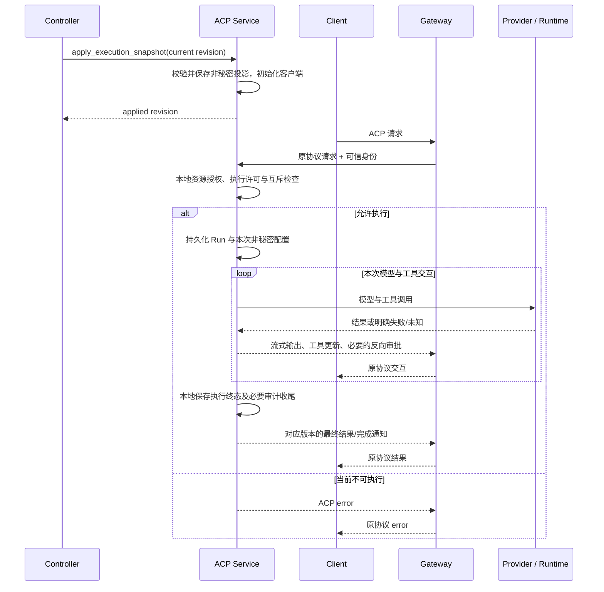
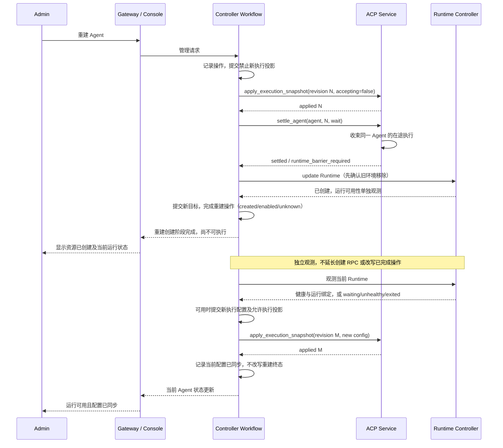

# Controller 与 ACP 执行边界重构方案

> 日期：2026-09-14。
> 状态：2026-09-15 用户批准关闭本轮 Controller/ACP 重构联调。B0-B5 本轮范围收口；九个真实业务场景及 trace 结构检查通过。Jaeger 时钟偏差单列 OBS-ACP-CLOCK 待办，严格脚本的失败结果原样保留，详见 §10.3。
> 最新范围裁决：Agent UI 暂缓，不修改其代码、不作为本轮完成条件；它只做 ACP 协议适配，不承担管理业务。优先完成 Controller 与 ACP 的重构、联调及职责边界验证。
> 既有在制工作树保留；§10.2 记录服务交付，§10.3 记录真实组合的最终结果。历史准备批次的待验收描述不覆盖最新结果，方案评审也不替代实现验收。
> 两服务及既有 Gateway、Console 入口已完成联调切换；不代表 Agent UI 或整个平台产品通过验收。
> 核心裁决：Controller 同步逻辑 Agent 配置和执行许可；ACP 自主处理协议请求，持久化 Session、执行及执行审计。

## 本轮审查入口

**最新范围优先于下文历史评审中的 B4U 要求。** B4U 标为暂缓，不标为完成；
T26 的协议、服务端授权、状态与取消断言继续执行，Agent UI 页面和 bootstrap 消费断言移至后续客户端方案。
B5 使用官方 ACP SDK 驱动真实服务，不依赖 Agent UI；Gateway、Console 仅在认证、管理和审计消费验收中作为已有入口，
不扩大其功能范围。两服务联调通过不等于 Agent UI 或整个平台产品验收通过。

本文是沿既有评审结果修订的技术方案，不是全系统实现完成报告。工作树的实施进度和代码验证单列 §10.2；
§12 区分历史评审、协调者本次复核与尚未完成的独立复核，不作为当前实现的测试通过证明。

建议先审查 §1 的权威边界、§8 的业务时序、§10 的服务交付包，再查看 §12 的评审裁决。
合同字段与故障语义是实现约束，不要求 Controller 实现 ACP 内部的执行状态机。

**一句话方案：Controller 管理“应当是什么”，ACP 管理“这一次实际执行什么”；
两者同步当前配置，但不共同批准、执行或结束一次 Run。**

| 关注点 | 最小决策 | 验证方式 |
| --- | --- | --- |
| Agent 不可用由谁回答 | ACP 将已同步的管理许可映射为当前协议版本的错误；Controller 不解释 ACP 方法 | 禁用 Agent 的协议请求仍到 ACP，返回错误而非聊天文本或 Gateway 业务错误 |
| 普通聊天依赖谁 | Gateway 认证后直接访问 ACP；ACP 使用本地配置、Provider 客户端及 Runtime MCP | 热路径无 Controller RPC；已同步时 Controller 短暂不可用不影响本地准入 |
| 谁保存状态 | Controller 保存配置与生命周期；ACP 保存 Session、执行和执行审计 | 不共享数据库，不双写 Run，不通过 Controller 回执决定终态 |
| 如何安全重建 | Controller 发布禁止新执行并得到确认，再请求 Agent 级收束，然后替换 Runtime | 收束不返回 Run/Tool 细节；新环境创建、就绪和配置应用各有完成点 |
| 如何更新凭证 | 逻辑 Provider 客户端接收认证更新；Run 不固定认证版本 | 同一 Run 的后续模型请求可用新凭证；已发出的请求不改写、不自动重放 |
| 如何避免无止境可靠性设计 | 接受传播延迟、快速失败与崩溃中断；仅维护当前投影和真实执行占用 | 无 Run 票据、TCC、自动续跑、额外 MQ 或配置历史队列 |

### 本次方案的最小闭环

1. **Controller 保存管理事实。** Agent 配置、当前 Provider 认证和模型目录、访问范围、生命周期操作属于它；不再保存一次 Run 的批准和完成状态。
2. **Controller 单向发布当前执行投影。** 变更提交后推送，后台重发同一来源的当前态；ACP 冷启动在收到配置与认证前不开放执行。选用这一条同步路径，不同时建设启动拉取和变更推送两套机制。
3. **ACP 独立处理协议。** Gateway 认证并传递可信身份，ACP 本地授权、处理协议错误、执行和落库；用户请求不经过 Controller，也不要求 Controller 预先保留客户端。
4. **生命周期仅协调 Agent 级边界。** 禁止新执行并确认应用 -> ACP 收束 -> Controller 操作 Runtime；新目标创建、独立就绪、执行配置应用分别完成。Controller 不看 Turn、Tool 或审批状态。
5. **Provider 认证不是 Run 状态。** Run 固定逻辑连接、模型参数和 Runtime 绑定，认证可透明轮换；退役仅等待实际客户端持有者。无客户端时快速失败，不补做跨服务预约。
6. **执行历史只存 ACP。** 当前配置删除不删除保留期内的 Session/Run/审计；管理端向 ACP 只读查询，不从 Controller 管理事件推测执行结果。

本方案有意保留的成本只有：一份组织当前投影、一个修订序列、本地执行占用，以及生命周期收束。
它们分别解决配置同步、乱序覆盖、共享 Runtime 的执行冲突、环境替换时机，不扩张为通用消息平台或分布式事务。
实施仍涉及 Gateway 和 Console 等既有消费者迁移，但不改变服务分工、不新增服务；详细批次见 §10。

## 1. 决策与范围

### 阅读摘要

**Controller 决定 Agent 应当如何配置、是否允许执行；ACP 根据本地配置决定一条协议请求如何处理，
并独立完成和记录执行。两者不再共同维护一次 Run。**

```text
管理：Admin -> Gateway -> Console BFF -> Controller -> ACP 管理 RPC
使用：ACP Client <-> Gateway <-> ACP Service -> Provider / Runtime MCP
```

- ACP 在这里是有状态存储的执行服务，不是无权限判断的 LLM 函数包装器；协议授权、Session 与执行审计属于它的本职。
- Controller 不理解 `session/prompt`、Turn、工具审批或 stop reason；ACP 不理解模板发布、容器构建或 Temporal 阶段。
- 新增协作只保留两类操作：应用当前执行配置、为生命周期操作收束 Agent 执行。没有逐 Run 的跨服务批准、预约或结束补报。
- 创建/重建操作完成仍表示平台目标已创建；运行就绪和执行配置同步独立推进，不改变已验收的生命周期分层。
- 主要改动在 ACP 和 Controller；Gateway 的可信身份转发、Console 的状态/审计数据源也必须有界跟进，不能把两服务编译通过视为整条链路完成。

以下是目标方案。第 2 节列出现有生产路径，第 10 节规定实施退出条件，两者不能混为当前能力。

**本版供审查的最小方案：**

| 问题 | 本版选择 | 没有引入的工作 |
| --- | --- | --- |
| 谁接收用户执行请求 | Gateway 认证后直接转发 ACP；ACP 生成协议结果和错误 | Controller 不充当 ACP 代理，不解析 prompt/Turn/stop reason |
| ACP 如何知道 Agent 是否可用 | Controller 发布组织当前执行快照；ACP 本地检查访问范围和执行许可 | 不逐请求向 Controller 查询，不额外发放 Run 票据 |
| 如何初始化及修复漏通知 | Controller 主动推送，复用后台 reconciliation 重发当前快照；ACP 冷启动未同步时拒绝执行 | 不另加 ACP 反向拉取、双向通知或持久消息队列 |
| 谁持有模型凭证 | Controller 持久化；ACP 的逻辑客户端仅在内存持有当前调用认证 | 不复制凭证库，不把认证固定进 Run |
| 谁允许替换执行环境 | Controller 先发布禁止新执行，再调用 ACP 的 Agent 级收束接口 | 不读取逐 Run/Tool 状态，不管理逐 Run 的批准/结束事务 |
| 谁记录实际执行 | ACP 持久化 Session、Run、工具与审批记录；Controller 仅记录管理操作 | 不双写执行审计，不等待 Controller 的完成回执 |

方案选择单向推送而非“ACP 启动拉取 + Controller 持续推送”，是为了只保留一套同步责任。
代价明确：ACP 冷启动时需要 Controller 完成初始推送；Controller 不可用时，已初始化进程可继续使用最后成功配置，
新启动进程则不能只凭磁盘上的旧许可开放执行。这是本期可接受的可用性边界，不通过隐藏的反向 RPC 补偿。

本文是本轮唯一主方案，继续修订本文件，不再复制一份平行设计。本文替代 [Provider 客户端旧方案](provider-client-lifecycle-plan.md) 中的 Controller Run 准入、
`acquire_run / finish_run`、反向凭证解析、启动补报和 Provider 禁用触发 Agent 自动重建等设计。
同时撤回上一轮候选的“客户端经 Controller 双向代理访问 ACP”：不再把 Controller 放在每次聊天请求路径上。
已有合同和服务 README 仍描述实现基线，不能据此认定新边界已经落地。

### 1.1 目标

1. 管理流：浏览器/Console 前端 -> Gateway -> Console BFF -> Controller -> ACP 内部管理 RPC。
2. 使用流：ACP 客户端 <-> Gateway <-> ACP Service <-> Provider / Runtime MCP。
3. Controller 管理 Agent、模板、Provider、凭证、生命周期和访问策略的权威数据。
4. ACP 根据已同步的执行配置处理访问与执行准入，独占 Session/Run/Tool 状态管理和审计。
5. Agent 停用或不可执行时，由 ACP 协议端点生成正确的协议响应；Controller 不理解 ACP 方法或错误映射。
6. 凭证更新属于逻辑 Provider 客户端内部行为，不固定到 Run；不承诺旧 Run 在进程重启后续跑。
7. Runtime/Egress/Identity 保持现有服务边界，不跨服务访问数据库，不启动横向扩展。

### 1.2 不做

- 不新增 Controller ACP 客户端、代理层、RunAdmission 替代物、分布式执行锁或每请求许可票据。
- 不引入新 MQ、通用事件平台或 Provider 专属 Workflow；沿用已有生命周期 Temporal 工作流。
- 不承诺网络分区下瞬时撤权、恰好一次远端工具效果、崩溃自动续跑或自动重放 prompt。
- 不实现新 Provider、订阅登录、客户端 MCP 注入、K8s、调度器或新审计服务。
- 不修改 Agent UI，不要求它消费管理 RPC 或承担管理职责；后续页面方案由用户另行确定。
- Provider/model 本期只实现禁用与再次启用，不新增物理删除或目录历史清理业务；Agent 删除仍属于现有生命周期范围。
- 本期保留会话软删除和执行历史的组织归属、授权查询；物理审计清理任务继续按既有计划另批，不自行设定保留天数。
- 不兼容开发环境旧数据库；切换批次使用空白测试库，但编写方案不清理现有实例。

### 1.3 评审基准

不是把 Controller 的 RunService 原样搬到 ACP，也不是让两者分别判断一次同样的业务。
以下五条是本次模型必须满足的约束：

1. **配置权威唯一。** Controller 决定平台是否允许使用；ACP 只能消费这个决定，不能自行启用被停用的 Agent。
2. **执行权威唯一。** 一次 Run 的接受、执行、取消、审批、终态及审计只由 ACP 管理；Controller 不保存第二份 Run 状态。
3. **协议端点唯一。** 已到达 ACP 的合法协议请求，由 ACP 按该版本的协议处理；Gateway 不因 Agent 尚未就绪截断路由。
4. **完成点明确。** 配置保存、配置生效、Runtime 创建、Runtime 就绪、执行结束是不同事实，任何一个都不能替代另一个。
5. **失败保证有边界。** 允许配置传播延迟、调用快速失败和崩溃中断，不承诺预留客户端、自动续跑或回滚远端副作用。

| 容易混淆的判断 | 实际所有者 | 另一服务只需要知道 |
| --- | --- | --- |
| 此 Agent 是否停用、重建或允许使用 | Controller | ACP 接收执行许可和必要配置，不接收平台生命周期状态机 |
| 这个主体能否访问这个 Session、当前能否开始执行 | ACP | Controller 无需知道 Session ID 或 Run ID |
| 外部请求的用户是谁 | Gateway / Identity | ACP 接收可信身份后再做本地资源授权，不能把认证等同于资源授权 |
| 当前执行是否完成、取消是否真的收束 | ACP | Controller 只接收生命周期操作所需的 Agent 级收束结果 |
| 管理员为何改了配置、一次执行实际做了什么 | 分别为 Controller、ACP | Console 经各自只读接口展示，不让管理事件反推执行结果 |

因此“ACP 是执行核”不等于“ACP 没有业务判断”。协议访问控制与执行状态属于执行核；
模板、部署平台、组织管理和生命周期编排才是不能进入执行核的管理业务。

Controller 发布的是管理决定的执行投影，不是对下一条 ACP 请求的预判。例如它发布“禁止开始新执行”，
而不是发布“拒绝 session/prompt、允许 session/load”。后一层方法语义只在 ACP 中解释。
不让 Controller 代理聊天的主要收益是消除逐请求依赖和重复执行状态，而不是禁止管理服务返回自身的领域错误。
Controller 的管理 RPC 仍能报告配置冲突、依赖被引用或生命周期未完成；这些不是 ACP 协议错误。

### 1.4 最小实现与复杂度预算

对外执行仍走 ACP 协议；对内增加配置应用、Agent 级执行收束，以及只读状态/审计查询。
既有工作台状态查询是呈现接口，不是第二套执行协议，也不能用来批准或预留 Run。
Controller 与 ACP 不共同处理一条 prompt，不共享一次 Run 的事务，不交换逐 Turn 状态。

| 必要模型 | 解决的实际问题 | 禁止借此扩张为 |
| --- | --- | --- |
| 组织当前执行快照 | 一次同步配置、访问范围、模型和认证，冷启动可重建 | 配置历史仓库、逐实体消息队列、跨服务提交事务 |
| ACP 本地 Agent 执行占用 | 同一 Runtime 的工具修改与生命周期替换不能交叉派发 | Controller Run 预约、分布式锁、资源保留票据 |
| 生命周期收束结果 | Controller 在替换或停止 Runtime 前确认可以继续 | Controller 对 Run/Tool 状态的归约、轮询每个工具 |
| 本地执行审计 | 会话恢复读取、诊断、组织追溯 | Controller 二次写入相同结果或以结束回执控制 UI |

下面的故障判据只限制允许做什么，不要求建设每类故障的自动修复系统。
默认允许快速失败、明确中断及用户重试；不能为了消灭一次可解释的失败新增全局协调机制。
本轮不把所有细节抽象成独立服务或通用框架，优先在现有应用服务和窄接口内实现。

### 1.5 这次究竟删掉什么

| 旧协作 | 新归属 | 保留的必要协作 |
| --- | --- | --- |
| ACP 每次访问反查 Controller | ACP 读取本地访问投影 | Controller 变更后同步当前投影 |
| Controller 批准并保留一次 Run，ACP 再执行 | ACP 本地接受并拥有整次执行 | 生命周期修改前，Controller 请求 Agent 级收束 |
| 每个 Run 固定凭证、再向 Controller 取秘密 | ACP 逻辑 Provider 客户端管理当前认证 | Controller 推送凭证轮换，不要求 Run 理解 |
| ACP 结束后补报 Controller，UI 等补报完成 | ACP 本地终态与执行审计直接作为读取事实 | Console 通过 ACP 只读查询展示 |
| 进程崩溃后试图继续旧 Run | 记录中断，下一次用户请求是新 Run | 明确旧 Runtime 前台调用无法确认停止的处理边界 |

普通聊天路径不再发生 Controller RPC，也不新增替代 admission_id 的票据。
本次新增的配置同步和收束仅出现在管理变更路径；它们不能反向进入每次模型/工具循环。

## 2. 已核实的实现差异

| 当前代码事实 | 依据 | 目标 |
| --- | --- | --- |
| Gateway 已直接连接 ACP | [workspace_relay.go](../services/edge-gateway/internal/server/workspace_relay.go)、[workspace_http.go](../services/edge-gateway/internal/server/workspace_http.go) | 保留数据路径；移除聊天热路径对 Controller 查询的依赖 |
| ACP 生产组装和 PostgreSQL 测试已使用本地目录/逻辑客户端输入；旧 Controller adapter、Port 及遥测包装已删除，下游消费路径尚未切换 | [配置 Port](../services/agent-acp-service/src/ports/execution-configuration.ts)、[生产组装](../services/agent-acp-service/src/composition.ts)、[PromptCoordinator](../services/agent-acp-service/src/application/prompt-coordinator.ts) | 完成收束、查询与其余消费者迁移，不恢复双路径 |
| 正常执行终态已在 ACP 本地保存，不再调用 Controller finish；读取端也不再等待该回执 | [RunExecutor](../services/agent-acp-service/src/application/run-executor.ts)、[Session 查询](../services/agent-acp-service/src/adapters/postgres/session-repository.ts) | 保留本地完成点；跨服务生产者/消费者未一起切换，不能单独部署为完整新方案 |
| Controller 的原执行配置合并已清退；ACP 本地解析已接入生产组装 | [当前配置发布](../services/agent-controller/internal/application/execution_projection.go)、[本地快照构建](../services/agent-acp-service/src/domain/run-snapshot.ts) | Controller 提供默认值和允许范围，ACP 本地核验与合并 Session 覆盖 |
| Controller 生命周期已改为 ACP Agent 级收束；工作台列表与状态接口已移除 Run 读取，旧表及未接线执行应用已清退 | [lifecycle_rebuild.go](../services/agent-controller/internal/repository/postgres/lifecycle_rebuild.go)、[初始 schema](../services/agent-controller/internal/repository/postgres/migrations/0001_initial.sql) | 等待 ACP 的 Agent 级收束操作结果，不读取 Run |
| ACP 已有自己的 Session/Run/事件/上下文存储 | [Postgres adapters](../services/agent-acp-service/src/adapters/postgres)、[SessionRepository](../services/agent-acp-service/src/ports/session-repository.ts) | 保留为唯一执行事实源；不是再建一套审计 |
| 启动中断收尾已改为只处理未结束的本地 Run | [run-recovery.ts](../services/agent-acp-service/src/application/run-recovery.ts) | 已移除启动续跑与 Controller 补报；生产执行路径的旧反向 RPC 也已清退，整批验收仍待完成 |
| 生命周期服务已注入共享执行 publisher 和 Agent 级收束 Port | [lifecycle.go](../services/agent-controller/internal/application/lifecycle.go) | 增加配置同步、执行收束协作，不引入执行状态机 |

## 3. 权威与存储所有权

| 概念 | 权威来源 | 消费方式 |
| --- | --- | --- |
| 组织与用户身份 | Identity | Gateway 认证；Controller 接收现有身份变更并生成访问策略 |
| Agent 生命周期、模板、Runtime 构建参数 | Controller | ACP 不保存模板，也不执行创建/重建编排 |
| Agent 执行许可、归属与配置 | Controller | ACP 接收执行投影；不能自行把停用 Agent 恢复启用 |
| 组织可用模型、当前 Provider 认证 | Controller | ACP 管理模型选择和本地客户端；不读取 Controller DB |
| Session、Run、Turn、审批、互斥、工具效果、上下文 | ACP | Controller 不维护副本状态机、不补写执行终态 |
| 生命周期与配置审计 | Controller | 记录谁变更、操作阶段和结果 |
| 会话与执行审计 | ACP | 按组织/主体/Agent 授权查询；管理端经服务接口访问 |
| 网络策略与物理 Runtime | Egress / Runtime Controller | Controller 编排；ACP 只使用 Runtime MCP |

ACP 的配置投影是只读消费副本，不是第二套管理实体。Session 的模型/模式覆盖归 ACP，
模型选择不得超出组织目录，资源访问不得超出主体权限；默认审批模式不是不可覆盖的安全上限。
保留已有用户选择 auto/approve 等模式以及覆盖默认规则的语义，本次不新增管理员强制审批策略。
身份/Agent/模型归属检查先于模式判断；auto 或长期批准不能绕过这些资源访问检查。
不得把模板 ID、部署平台状态机、
Provider 密文或 refresh token 带入 Loop 领域模型。

原 `set-agent-authorization` 挂在 Controller 的 RunService 下，实际是 Agent 默认偏好修改，不属于要删除的执行业务。
现已迁入 Controller 的 Agent 配置应用服务，保留当前活跃 owner 授权、配置版本 CAS 和管理审计，修改后触发配置发布；生产发布接线仍按 B2 推进。
不把该入口改成管理员专用，也不把 Session 的模式覆盖或长期批准挪回 Controller。

### 3.1 持久化最小变更

- Controller 保留现有 Agent、模板、当前 Provider/model、访问绑定、生命周期操作和管理事件。
  删除 `run_admissions` 及其执行占用、恢复、结束回执字段和查询。生命周期 drain 改为内部操作调用。
- ACP 复用现有 Session、Run、执行事件、上下文、审批表；清除 admission ID、Controller finish 待补报等字段。
- 原 admission 的运行超时不能随票据删除：迁为 ACP 本地 Run 的 `deadline_at`，接受时固定，
  不由 Controller 分配、不随快照重发或重连续期；详见 §5.4。
- Session 创建时保存不可变 `organization_id`，fork 继承；Run/审计通过所属 Session 获取组织归属。
  不能在查询历史时依赖当前 Agent 投影仍存在，也不把同一组织字段无差别复制进每张事件表。
- ACP 增加一份组织级非秘密执行快照和应用修订记录；优先一张当前态表，不按每个 DTO 新建一张表。
  其中 Agent 投影、访问范围和目录可以结构化保存，字段必须有明确 schema 校验。
- Provider 当前调用凭证仅在 ACP 内存持有；不另建 ACP 凭证历史、不放入 Session/Run/审计。
- Controller 需要一个组织执行配置修订值，用于排序完整快照。在现有组织同步元数据中复用或增加，
  不复用某一个 Provider 的 credential version，不新增事件日志来保存每个配置 payload。
- 独立数据库/账号/schema 所有权不变。测试可以共用物理 PostgreSQL 实例，不允许跨库 JOIN。

### 3.2 服务内分层与依赖方向

以下是职责落点，不要求为每一行新建框架、包或数据库表。优先改造现有应用服务与 Port。

| 所属服务 | 职责落点 | 输入与输出 | 不允许依赖 |
| --- | --- | --- | --- |
| Controller | 目录/Agent 应用服务 | 保存配置、验证依赖引用、推进有效配置修订；产出当前源数据 | ACP Session、Run、Tool 状态 |
| Controller | 执行配置发布 | 一致源数据 -> 执行投影 -> 解封当前认证 -> apply RPC -> 记录应用确认 | 逐 Run 准入、ACP 数据库、Provider 网络探活 |
| Controller | 既有生命周期编排 | 关闭执行投影 -> Agent 级收束 -> Runtime 操作 -> 提交目标；就绪观测独立推进 | 具体 Tool 结果、审批等待、模型循环与执行终态归约 |
| ACP | 协议适配 | 官方 SDK 的请求/通知 <-> 本地应用结果；接收可信身份 | Controller 生命周期枚举、模板实体、容器平台 API |
| ACP | 执行配置目录与逻辑客户端 | 接收当前投影；提供本地访问、默认配置、模型目录和当前调用认证 | Controller DB、逐请求反向配置查询 |
| ACP | 执行应用服务 | Session/Prompt -> 本地准入、上下文、模型/工具调用、取消与终态 | Template、Provider 管理流程、Temporal 工作流 |
| ACP | 执行存储/审计查询 | 自有 Session、Run、事件、审批与非秘密执行快照 | Controller 完成回执、当前 Agent 仍存在的假设 |

领域和应用层依赖本服务的窄 Port；数据库、HTTP/MCP、Provider SDK 是适配器。Controller 的
`ExecutionSource` 不对外暴露为管理 API，ACP 也不复用 Controller 的 ORM/记录类型。
共享部分只包括序列化合同和测试夹具，不共享可访问双方数据库的 Repository。

ACP 本地授权属于执行服务职责，不把“ACP 是执行核”误解成“不允许判断资源权限”。
反过来，Controller 管理 API 的权限校验和领域错误继续保留；只有 ACP 协议的错误映射与执行结果不能挪进 Controller。

持久化状态按三种用途区分：Controller 的目标配置、ACP 的已应用非秘密投影、ACP 的历史执行事实。
前两者通过 revision 对齐，不是两份可独立编辑的 Agent；第三种只描述发生过的执行，不参与配置同步排序。
Controller 的 `applied_revision/applied_at` 是上一次应用回执，不是 ACP 当前在线、空闲或可执行的永久证明。

## 4. 最小配置模型

### 4.1 ExecutionSnapshot

第一版采用每组织完整执行快照，避免首次分页、增量缺口、删除 tombstone 和多订阅排序协议。
这里的“完整”仅指执行所需的当前投影，不包含模板历史、审计或全组织用户目录。

| 字段组 | 内容 |
| --- | --- |
| 标识 | organization_id、单调 revision |
| providers | 稳定 connection_id、provider_key、请求协议、endpoint、是否可新用、当前有类型的调用认证材料与非秘密修订 |
| models | 稳定 model_profile_id、connection_id、模型参数、能力、价格、是否可选择 |
| agents | agent_id、归属/允许主体范围、access_revision、允许新执行、不可用原因、已有生命周期 operation_id、默认 model_profile_id、Agent 自身配置与 Runtime MCP 绑定 |

具体字段和大小边界在合同批次确定；不能静默截断，也不能将不完整响应当成删除。
同一快照从一致的 Controller 数据库视图构建。配置修订与影响快照的管理数据变更在同一事务提交。
只有执行配置、访问或认证等有效变更才递增修订；健康检查时间戳和相同状态重复观测不触发配置更新。

**完整快照必须始终可发布，不能只在接收端限制大小。** 如果普通创建先把组织配置撑到接收上限之外，
停用/删除前的禁止执行快照也可能被拒绝，形成“必须先同步才能缩小、但已经无法同步”的循环。
本期保留完整推送，不为解决容量问题新增分页、增量补丁或紧急撤权协议：

- B0 固定 JSON UTF-8 编码后的整体上限、字段长度及集合边界；同一部署给 Controller 生产端与 ACP 接收端配置一致上限。
  下调上限前必须验证当前配置与生命周期预留仍可容纳，不在运行中静默降低接收能力。
- Controller 在同一组织配置事务内校验候选投影，计算实际序列化字节和必要的生命周期最大增长预留。
  超出预算的普通新增/修改在提交前明确拒绝；并发创建不能各自基于旧快照通过校验。
- 预留覆盖所有必须可推进的关闭/撤权转换，而不只 Agent。Provider/model 的 `enabled` 按 `false` 的编码长度预算，
  因为 JSON 的 `true -> false` 每项增长一个字节，禁用且保留认证的目录并不一定缩小；零 Agent 的组织同样需要这项预留。
  Agent 还需覆盖 operation_id、原因码、Runtime 绑定与修订等有限增长。
  B0 必须以字段编码长度上界定义预留；新目标的可变配置在登记前计入预算，不能等 Runtime 创建成功后才发现无法发布。
  原始平台错误详情留在 Controller 诊断，不把无限增长的错误文本塞入执行快照。
- 每个 Agent 按当前配置、正在执行的生命周期目标、失败后仍可能保留的配置三者最大编码预留，而非相加。
  最后成功 execution 的自身 Spec 是保留来源；从未就绪的 Agent 则用其首个持久化候选。
  新的小配置尚未就绪时不能释放旧配置回退所需的预算。此规则不恢复失败关闭后的执行绑定或权限。
  Controller 产出的 Runtime MCP endpoint 限制为 2048 UTF-8 字节，预算包含 JSON 转义；不新增 ACP 字段。
- 减少引用、撤销访问、停用和删除必须在已预留容量内推进；新的 revision 位数、转义与多字节字符也计入编码边界。
  不新增容量账本或资源预约表；管理写入沿用当前快照构建与组织事务进行校验。

这一约束只在管理配置路径执行，不进入 prompt/模型/工具热路径。B0 固定预算规则，B2 实现，T30 验证边界仍可退出资源。

Agent 投影不再嵌入模型参数、能力、价格或另一份连接绑定。默认模型和 Session 显式选择都从同一当前目录解析，
ACP 接受 Run 时才固定本次非秘密执行快照。模型编辑不要求 Agent 重建，已经开始的 Run 保持其原参数。
完整快照中缺席的 Agent 撤销新执行和普通访问，缺席 Provider 停止新获取；这不删除历史 Session/审计。
空快照合法但必须带明确组织和修订；本期不增加组织删除业务流程，不能通过停止发布某组织快照模拟撤权。

只同步 Controller 已确认的当前执行配置，不把正在构建、尚未提交的新 Runtime 地址提前发布为可用。
凭证材料单独注入内存客户端；持久化快照前按类型分离秘密与非秘密部分，不使用通用序列化直接落库。

### 4.2 不复制平台状态机

ACP 只需要 `accepting_runs`、面向诊断的原因、执行配置和访问范围，不需要理解 Controller 的
created/waiting/unhealthy/exited、镜像拉取阶段、Temporal activity 或 Runtime generation 管理规则。
Controller 负责把这些状态投影成执行许可。不可用原因用于协议错误和诊断，不驱动第二套生命周期。

ACP 内部还有自己的本地事实：配置是否完成初始化、该 Agent 是否有执行、是否正在收束。
这不是 Controller 管理状态的复制。允许启动必须同时满足：启动收尾及保护恢复完成、配置已就绪、平台许可、
访问合法、本地执行入口允许。配置应用与启动收尾任一先完成，都不能单独开放执行。

### 4.3 不同状态的完成点

| 状态 | 谁决定 | 不能误解为 |
| --- | --- | --- |
| 资源已创建 / 重建操作完成 | Controller 收到 Runtime Controller 的创建结果并提交目标 | Runtime 已健康、ACP 已可执行 |
| Runtime available | Controller 独立观测当前目标的健康与绑定 | ACP 已收到最新配置 |
| 执行配置已应用 | ACP 完成当前修订的本地发布并返回确认 | 当前 Run 已完成或已停止 |
| Agent 执行已收束 | ACP 处理生命周期收束请求 | 所有历史命令成功、外部副作用已回滚 |

继续沿用 [Agent 生命周期分层](agent-lifecycle-state-model.md) 的 `created + activation + runtime condition`。
配置同步进度是服务协作状态，不增加第二套 created/waiting/unhealthy 状态机。Console 分别显示创建操作结果、
Runtime 状态和配置同步未完成；不得在只收到创建结果时显示“已可对话”。

### 4.4 哪些变更必须发布

完整快照不能只覆盖 Provider 保存入口。下表是 B2 的变更覆盖清单；每类测试都必须证明数据库提交、
组织 revision 与后续发布一致，而不是在某个 handler 中随手调用一次 RPC。

| 变更来源 | 当前投影变化 | 执行侧效果 |
| --- | --- | --- |
| Provider 创建、凭证轮换、启停 | 当前连接及有类型认证 | 初始化/更新逻辑客户端；停止新获取与旧持有者排空分开 |
| Model 创建、参数修改、启停 | 当前模型目录 | 后续 Run 本地解析新参数；不改写在途 Run 的非秘密快照 |
| Agent 首次创建、重建、启用、停用、删除 | 执行许可、管理操作标识、已提交配置与绑定 | 新执行准入与生命周期收束；不暴露 Run 细节给 Controller |
| 当前 Runtime 可用性发生有效变化 | 执行许可及当前有效绑定 | waiting/unhealthy/exited 不被误报为可执行；旧目标观测不能覆盖新目标 |
| 身份撤销、归属/访问范围修改 | 访问主体和访问修订 | 旧连接、审批及尚未发送的输出失效；不是仅禁用下一次 prompt |
| Agent 默认模型/授权配置修改 | 默认值和相应修订 | 后续会话配置/执行本地合并；Session 覆盖仍归 ACP |
| 模板发布或启停 | 仅当当前 Agent 执行投影实际变化时更新 | 不把模板实体同步到 ACP，不自动修改所有派生 Agent |
| 重复请求、相同健康观测、普通 Run 完成、应用回执；仅推进内部水位而投影不变的重复撤权 | 不生成新的目标配置 revision | 不因观测、ACK、执行事件或无效撤权重复形成配置刷新 |

所有影响快照的写入在本服务事务内推进同一组织 revision。后台重发读取最新完整状态，
补偿提交后推送失败或进程退出；它不能修复“写了配置却忘记推进修订”的代码遗漏，因此这部分必须有变更覆盖测试。
同版重发也不能作为接受内容变化的后门；无效/缺失来源必须报错，不能当作空组织发布。

“有效变更”以最终执行投影为准，不以发生过 UPDATE、管理事件序号或收到新事件为准。
例如先按组织撤权，再收到更高序号的全局撤权：内部消费游标、撤权水位与管理审计仍须推进，
但若主体、执行许可、配置及绑定等投影字段未改变，就不递增组织配置 revision。
不能通过跳过已撤权记录来省略比较，否则会漏掉防止旧授权重新生效所需的水位更新。
批量变更只为投影确实变化的组织各递增一次，和源数据、游标及审计保持本服务事务原子性。

## 5. 同步与内部 RPC

以下是目标内部方法，不是 ACP 扩展方法。配置应用和执行收束入口已有在制实现，但尚未完成两服务联调；
不能将路由存在等同于合同已验收。内部网络可信，接口不得暴露为外部 OpenAPI。

| 方法 | 输入 | 返回与含义 |
| --- | --- | --- |
| apply_execution_snapshot | organization_id、revision、完整快照 | 实际已应用 revision；返回前完成本地校验、非秘密存储和执行入口/客户端切换；撤权还包括审批与输出订阅失效 |
| settle_agent | organization_id、agent_id、最低已应用禁用修订、wait/cancel 模式、已有生命周期 operation_id、该操作固定的 deadline_at | outcome 为 settled / runtime_barrier_required / not_settled，及实际配置修订；只报告 Agent 级操作结果，不返回逐 Run 状态 |

不新增 acquire/finish/resolve RPC。管理查询按 §9.1 使用独立只读合同，不让 Controller 接管 Session API，
也不借用 owner 的会话连接获取管理员审计。

### 5.1 推送与初始同步

1. Controller 提交配置后主动推送；同一组织的推送由单一写入路径串行化，重复提交可合并为最新完整快照。
2. 复用 Controller 的后台 reconciliation 宿主，定期发送当前快照作为进程重启/通知丢失的修复路径。
   周期配置化、有退避；一次周期至多一个在途请求，不扫描 Run、不创建每用户后台任务。
3. 不持久化待发送快照队列。重试重新读取最新已提交状态；跨服务调用不放在数据库事务内。
4. ACP 启动先开放内部配置入口，执行入口保持关闭。不得因 DB 中有旧快照或旧 ready 状态而先接受 Run。
   遗留执行中断收尾、旧绑定保护恢复、当前快照及凭证应用全部成功后才具备执行条件。
   配置可先应用，但 ACK 仅确认配置，不替代启动收尾；任一未完成时返回协议层不可用。
5. 同一 revision 重发必须允许在 ACP 重启后重新加载当前秘密；不能看到 DB 修订相同就直接短路返回成功。
   较旧 revision 不覆盖新投影，同 revision 但配置不同应拒绝。序列号不包含秘密 hash。
6. `/status` 仅反映本服务初始化和本地同步状态，不在每次健康探测时访问 Controller/Identity/Provider。

新的完整快照可以替代丢失回执的旧快照。`settle_agent` 不能要求组织 revision 精确等于请求值：
ACP 应用修订至少达到要求，且该 Agent 仍禁止执行并匹配同一 lifecycle operation_id，才能继续。
无关 Agent 更新不阻塞当前操作；旧操作延迟到达时不得暂停/取消新的执行边界。复用已有管理操作 ID，
不新增 Run 许可标识。同修订重发只补初始化，不重置本地收束或旧 Runtime 保护。

第一版单个 ACP 执行服务，不设计多副本分发与全局确认协议。以后水平扩展需重新审查状态传播及执行归属。
已有 ACP 单执行进程所有权保护可以保留；本次不增加跨 Controller/ACP 的 Run 锁。
数据库中的修订表示已持久化配置，不是当前进程已经应用的证据。重启后若只收到比存储版本更旧的快照，
应拒绝初始化，等待当前版本，不能拿存储版本号返回 `applied`。

### 5.2 确认与失败语义

**普通配置保存与执行侧应用使用两个完成点。** Provider/model 创建、轮换、修改或启停等管理写入，
在数据库提交已确认后，管理 RPC 仍返回本次保存的资源/版本回执；提交后的推送超时、ACK 丢失或 ACK 落库失败，
不能把已保存结果改判为保存失败，也不回滚已提交配置。提交本身是否成功尚不能确认时，则沿用请求幂等查询判定，
不能无依据返回成功。生命周期命令的受理回执与操作完成仍按原合同区分，此规则不允许未收束的停用/重建提前完成。

同步进度另以组织当前 `revision`、最近 `applied_revision/applied_at` 呈现，复用同步元数据和现有管理读取入口；
Console 区分“已保存”和“执行侧应用未确认”，不把历史 ACK 当作 ACP 当前在线或 Agent 可以运行的保证。
不为普通配置保存新增 Workflow、持久任务表或执行票据。B0 固定响应/读取字段，B2 生产，B4 呈现。

同一 `request_id` 的合法重放沿用原保存回执，不重复修改或递增配置修订；若触发重推，则读取最新已提交完整快照，
不能从旧命令回执重建旧配置。后台重发同样读取当前态。保存结果与当前同步进度的来源不同，不把进度固化进幂等回执。

- 普通凭证轮换允许短暂传播延迟，旧请求继续，新模型请求在本地同步后使用新材料。
- 停用、删除、重建与权限撤销不得把“Controller DB 已提交”宣传为执行侧已生效。
  禁用配置未确认或本地尚未收束时，涉及旧环境的生命周期步骤保持进行中；失败显示未完成，不伪造成功。
  资源创建完成后，不继续等健康来延长创建操作；后续执行启用另按 §4.3、§8.2 的独立链路确认。
- 通知尚未应用前，ACP 可能按上一版配置接受请求，这是明确的传播窗口；不能靠后台通知声称瞬时禁止。
- Controller 不可用时，已初始化的 ACP 使用最后成功配置继续工作；不承诺分区期间即时撤权。
  需要立即隔离时由运维/现有生命周期处置平台资源，不新造租约服务。
- 同步失败不得部分启用 Agent。校验、无副作用准备或持久化失败时不发布新配置，保留上一完整运行版本。
  一旦进入撤权/本地发布步骤却未完成，该组织的受影响入口必须关闭，返回失败并等待同版或新版重新应用；
  不承诺能撤销已经发生的审批取消，也不能回退到旧许可继续服务。其他组织不受影响。
  同步“禁止新执行”不能依赖供应商网络探活或等待已经持有 Provider 的 Run 释放。
- 生命周期工作流的旧重试不重发历史快照。调用前核对当前操作/修订，开放执行只来自仍有效的当前操作。

应用过程只需要一份非秘密持久化配置和本进程的初始化标记，不建设 prepared/committed/compensated 队列。
保存成功但响应丢失，由当前快照重发修复；本地发布失败后的重发必须补完撤权/发布，不能仅比较数据库修订短路。
`applied` 是完成本地动作的确认，不是跨服务事务提交，也不对后续进程崩溃做存活担保。

### 5.3 Agent 收束

`settle_agent` 的前提是 ACP 已应用该 Agent 的禁止新执行配置；在 ACP 原子检查并关闭本地入口，
同一 Agent 所有 Session 共用这一边界。已接受但尚未进入模型调用的请求也计入，不允许 late start。

wait 模式允许当前执行正常完成；cancel 模式由 ACP 发出取消并等待实际前台执行收束。
等待是有界操作，超时返回未收束，不把取消信号、网络断开、Promise.race 返回当作执行结束。
重复调用只重复检查/等待同一个 Agent、同一个管理操作的关闭状态，不启动 Run，不需要 Controller Run 占用表。

接受成功后的执行启动或中断收尾由 ACP 执行应用服务持有，不依赖协议响应是否送达或连接是否继续存活。
Agent 占用必须在接受窗口内建立，直到实际任务及必要本地收尾结束才释放；协议适配器不能晚到后补建一个执行槽。
连接中断按已有协议取消/继续语义处理，但任何分支都不能遗留一个无人持有的已接受请求。

收束遵守既有生命周期操作的总截止点，单次 RPC 等待不得超过其剩余时间。重试不能重新计算一个无限延后的总期限。
内部请求用 UTC RFC3339 的 `deadline_at` 传递这个已固定截止点，不传 Run 的执行期限；过期请求不能再发出取消。
超时后 Controller 按原生命周期规则记录失败/允许重试；若尚未改动平台且业务允许保留原配置，提交当前许可的新版投影。
普通收束关闭随当前许可和 operation_id 变化解除，不另设须“提交/回滚”的持久暂停状态；仍在执行的 Run 继续占用本地互斥。
旧 Runtime 未确认停止的保护则独立保留，不能随失败操作恢复许可而清除。旧请求在实际取消前和返回前均核对当前操作边界。

| 结果 | 含义 | Controller 的操作 |
| --- | --- | --- |
| settled | 本地无后续派发；Runtime 前台调用尚未发出，或已有合同证实本次调用已停止；历史副作用仍可未知 | 按原生命周期流程继续，不把它当成历史操作全部成功 |
| runtime_barrier_required | 本地已无在途执行和未来派发，但旧 Runtime 内前台命令停止无法确认 | 显式重建/停用/删除可继续停止或移除旧环境；平台确认隔离前不开放新执行 |
| not_settled | 操作仍匹配，但本地仍有在途执行/派发可能或等待期限已到 | 等待、取消或报告未完成；不能直接替换环境 |

操作在调用前或等待期间已被替换时返回 409 `agent_operation_conflict`，不返回新操作的收束结果；
配置未初始化或停止证据无法读取返回 503，不以空闲或成功兜底。错误响应不携带 outcome。

固定截止点必须覆盖数据库连接获取及停止证据查询，不能只限制应用层等待。
读取证据在配置发布的短边界之外进行，返回前再检查当前操作与 Runtime 修订；数据库锁等待不得阻塞新的禁用/撤权配置发布。
等待取消后应取消读取或销毁相应借用连接，并配置标准连接/语句超时作为底层上限；
不把仍在执行的查询连接放回池中，也不通过单独的 Promise.race 遗留后台查询。
本地生命周期服务停止或执行所有权丢失时，中断尚未完成的收束请求，返回 503 而非成功或 not_settled。
操作正常但达到截止点才返回 not_settled；数据库自身失败仍是 503。无需为此新增取消协调服务。

Controller 对前两种结果复用同一套显式停止/替换流程，不按返回值再建立两套 Workflow。
区别只在于是否存在必须消除的旧绑定保护；不能为了让编排一致而丢掉停止未证实的事实。

收束对象是本次前台模型/工具调用，不要求杀死 Runtime 中所有历史后台进程。历史副作用未知不等于命令仍在运行，
不单独阻止后续使用。显式重建本身就授权替换旧环境，不另造“紧急重建”API 或人工恢复票据。
**收到 MCP 响应不自动等于停止已证实。** 现有托管 MCP 的 `outcome_unknown` 可能只表示取消已发出，
`child_process_containment_unproven` 更明确表示停止未确认；两者都不能因 RPC 已返回就进入 settled。
ACP 的 MCP adapter 必须把“历史效果是否确定”和“本次前台调用是否已停止”分别归类，依据已有结构化合同，
不能解析人类错误文案，也不能把 `effect_state` 单独当作停止证明。
尚未派发，或已有明确结束保证时可以收束；停止未确认及无法区分的托管 unknown 进入绑定保护。
已派发但响应丢失同样不能区分“执行完但回包丢失”和“仍在运行”，保守要求旧环境隔离，不增加远端完成查询协议。
已证实停止但历史副作用未知不因此冻结；若现有合同无法给出停止证明，不能由合成测试或本地超时补造证明。
停止保护与对应工具/Run 收尾在本服务同一事务落地，或由已持久化的未完成调用记录在启动时保守恢复，不能留出重启漏保护窗口。
模型服务商是否继续计算不在保证范围内，只保证本地结束后不再派发工具。

停止证据按下表固定，不能由不同 adapter 各自把“响应已返回”解释为停止：

| 可观察事实 | 对收束的判断 |
| --- | --- |
| 本地执行仍可能派发，包括已接受未启动 | not_settled；先收束本地执行 |
| 本地已收束，Runtime 调用从未发出 | settled；没有需要等待的远端前台调用 |
| 本地已收束，合同明确保证前台调用已经结束 | settled；即使历史副作用仍然未知 |
| 本地已收束，但远端只有取消 ACK、超时、断流、托管 unknown 或进程停止未证实 | runtime_barrier_required；不补造停止证明 |
| 一次有意保留的后台进程已经完成其启动调用 | 不因后台进程仍存活单独阻塞；不将所有容器进程纳入收束 |

现有 [Runtime 更新](../services/runtime-controller/internal/control/update.go) 会先移除旧环境再创建新环境，
因此可以作为隔离边界；本地仍可能派发时则不能借此跳过 ACP 收束。

ACP 保存与旧 Runtime 绑定关联的执行保护。平台确认旧环境已移除后，Controller 下发新 Runtime 绑定，
ACP 只解除对应旧绑定的保护，旧 Run 的未知结果不被改写。相同绑定的 accepting=true 或同修订重发不能解锁。
停用可通过确认停止旧环境完成；若随后启用仍复用受保护的旧绑定，则沿用现有 Runtime 重建流程取得新绑定，
不以进程已重启或 endpoint 仍能连接作为旧命令已结束的证明。普通跨 Turn 后台进程不因此被逐个审计和管理。
这里的新绑定指 Controller 经现有替换流程确认旧环境已隔离后提交的新目标，不是仅观察到一个不同的 execution ID。
健康恢复、地址变化或 execution ID 变化不能单独解除保护。无需新增证明票据或 Runtime 接口：
把旧环境隔离确认作为 Controller 发布可执行新绑定的前置条件，B2/B5 用流程测试证明普通健康观测不能绕过此条件。

### 5.4 本地边界与执行期限

短授权边界和长执行占用是两个不同概念。组织级串行边界仅覆盖本地授权复核、短持久化提交、
执行占用登记及配置发布；数据库操作必须有界。它不包住整次 Run、模型/MCP 网络调用、审批等待或 settle 等待。
Agent 的执行占用则持续到真正收尾；占用是本地所有权，不是让组织互斥一直保持锁定。

撤权在短边界内关闭入口、更新授权修订并使旧审批/输出失效；实际取消与收束在边界外等待。
发布回调不能在持锁期间等待需要同一边界才能收尾的任务。工具发送点仍检查当前授权及取消状态，
不能把早先的占用登记当成永久派发许可；已经发送的调用作为在途工作收束，不尝试撤销网络事实。
确定性测试必须证明：模型或 MCP 请求悬挂时，禁用快照仍能完成应用，取消仍能触发，不等远端返回才撤权。

ACP 保留当前 30 分钟的默认整次执行上限，将配置所有权从 Controller 的 RunAdmission TTL 移到 ACP 服务配置。
接受 Run 时计算并保存 `deadline_at`；启动前、审批提交前和后续派发均使用这个原始期限。
审批取得数据库锁后还须按实际当前时间复核，不能使用锁等待之前的事务时间。
已经过期但尚未启动的请求直接本地结束；运行中超时触发取消并按真实收束结果记录失败/中断/未知，
超时本身不是远端停止证明。进程重启仍只记录中断，不用这个字段安排自动恢复。

这与生命周期 `settle_agent` 的管理操作总期限不同：前者限制一次执行，后者限制管理员等待重建等操作的时间。
两者都不能因重试而无限续期。移除旧 admission 字段时，执行器、审批 SQL、测试夹具与运维配置必须一起迁移。

## 6. 请求与协议边界

### 6.1 身份与访问

Gateway 使用现有 Identity 会话/令牌验证外部请求，固定传递唯一可信元组
`(organization_id, principal_id, agent_id)`：前两项来自认证结果，agent_id 来自目标路由并由 ACP 授权。
外部输入的内部身份头必须被移除/重写，不能通过 ACP payload 改绑平台身份。
移除 opaque Agent access subject 和聊天路由中获取该 subject 的 Controller 列表查询，不保留旧头回退。
HTTP Connection ID、Session ID 和 WebSocket 连接均绑定同一元组。内部头名已列入
[RPC 合同草稿](../contracts/agent-acp/execution-api.md#transport-and-identity)，B0 固定并验证；不写入 ACP 私有必填字段。

ACP 初始化只协商协议与连接身份；在涉及资源的 Session 操作及执行/审批敏感入口核对本地访问投影与资源归属。
初始化成功不表示 Agent 已可执行，合法连接也不代表可以访问别人的 Session。
已有连接不得永远缓存首次鉴权结果；访问修订变化后，使用新投影复核，不逐消息远程查询 Controller。
Gateway 的外部身份认证不因此删除。Controller 各管理接口保留原有授权主体：目录与生命周期管理检查相应管理权限，
Agent 默认授权修改保留 owner 权限，不能因统一使用“管理流”名称就整体提升为管理员专用。

撤权投影应用与审批落库、长期批准保存、工具派发共享本地授权修订边界，不能“先查权限，再无条件提交”。
`applied` 确认前使相关审批等待和输出订阅失效；已读入但尚未发送的历史/流缓冲也必须复核。
生效后不再提交旧授权动作或发出新输出，不承诺追回已发送到传输层的字节。停用执行许可与撤销资源访问是两件事：
普通停用不自动取消用户历史读取权限；身份撤销必须终止相应访问和审批。

Gateway 的 Agent 列表/页面 bootstrap 可继续读 Controller；但不能依赖“仅列出可用 Agent”的列表结果才能路由聊天。
逻辑 Agent 不可用的请求应到 ACP，由 ACP 返回协议错误；网关不据模型/Runtime 状态生成自定义错误页。

### 6.2 方法处理

- ACP 是唯一协议语义端点；Gateway 保持 HTTP/SSE/WebSocket 的双向透明转发。
- 区分传输可服务和允许执行。进程、监听与本地依赖可服务后，不得把“尚未同步配置”或“Agent 停用”用于拒绝全部 WS/HTTP 握手。
  有效可信身份可建立协议连接，方法分发层返回配置未就绪/无权访问/不可执行的协议错误。进程尚未可服务或身份无效才在传输层拒绝。
- 禁止新 Run 不等于禁止所有 Session 操作。仍有访问权限的用户可以按现有合同查看历史、取消，
  并完成使现有执行结束所需的审批交互；不新增“所有请求一律失败”的开关。
- 身份实际撤销后，旧审批响应不能继续授权工具或保存长期批准规则；由 ACP 取消/收束现有执行，
  不能为了 drain 允许已撤权用户继续批准，也不能等待该用户完成审批。
- 未接受的请求使用所选 ACP 版本允许的 JSON-RPC error；已接受执行按对应版本的执行结果/通知合同结束。
  不把错误装成 assistant 文本，不新增私有必填字段或虚假的正常 stop reason。
- 协议定义了错误对象和扩展空间，但没有保证存在专用的“Antnest Agent 停用”错误码。
  固定错误映射时使用官方 SDK，覆盖 v1/v2；通知不得收到 JSON-RPC 错误响应。
- ACP 整个进程不可连接时，Gateway 的 HTTP 502/503 或 WebSocket 传输关闭是传输故障，不伪造 ACP 成功。
- 保留标准能力声明、反向请求 ID、流式 flush、HTTP 连接/会话标识、取消和错误语义。
  v2 接受响应不当成执行完成，不跨主体复用 ACP 连接，不自动重试 prompt。

官方依据：[v1 错误处理](https://agentclientprotocol.com/protocol/v1/overview#error-handling)、
[v1 执行与取消](https://agentclientprotocol.com/protocol/v1/prompt-turn)、[v1 schema](https://agentclientprotocol.com/protocol/v1/schema)、
[v2 协议](https://agentclientprotocol.com/protocol/v2/overview)。实施时以仓库锁定 SDK 和相应版本合同测试为准，
不把最新网站中尚未被 SDK 支持的提案声明成已实现。

### 6.3 逐方法迁移与回归范围

继承 [现有 ACP 完整性目标](../services/agent-acp-service/docs/protocol-conformance.md)：除已批准架构排除项和待稳定项，
适用能力不能因没有 UI、暂未声明或本次迁移不方便而降级。下表覆盖本次受身份/配置/执行边界影响的方法，
确切版本、方法形状和能力开关继续由锁定 SDK 与原有协议矩阵约束，不把 v2 草稿方法冒充 v1 稳定方法。

| 方法或交互 | ACP 内的判断与事实 | 停用但未撤权时 |
| --- | --- | --- |
| initialize / 现有认证适配 | 协议版本与可信连接身份；无需向 Controller 换取 subject | 保留协议初始化；能力不因临时健康状态虚假消失 |
| session/new | 当前组织/主体/Agent 访问权，写入不可变 Session 归属 | 可创建空会话，不启动模型或 Runtime |
| session/list | 本地访问范围、Session 组织及 owner 过滤 | 可读取获授权历史 |
| session/load / session/resume | Session 归属及协议恢复语义，当前配置目录与历史重放 | 可恢复已保存对话，不恢复旧 Run |
| session/fork | 源 Session 权限、无活动执行和已有一致性约束；继承组织归属 | 可复制已保存上下文，不复制执行或审批占用 |
| session/set_mode / session/set_config_option | 本地目录与 Session 覆盖 CAS；模式不可绕过资源权限 | 可配置后续使用；不能使不可用 Agent 开始执行 |
| session/prompt | 最新许可、Session 合法、选中模型/客户端可用、Agent 本地互斥；保存 Run 及输入 | 未接受时按该版本返回协议错误 |
| session/cancel | Session/Run 权限，取消现有执行；通知不生成响应 | 保留取消能力，不以停用为理由拒绝收尾 |
| session/close / session/delete | 本地会话生命周期、取消与软删除；保留审计 | 保留已有合法操作，不调用 Controller 生命周期 |
| 权限/结构化交互响应 | 连接、Session、请求 ID 与当前访问修订；本地审批提交 | 仅允许仍有权限的当前交互；撤权时取消等待 |
| session/update 与各版本通知 | 已持久化的执行事实和输出权限；顺序、去重、断线补读 | 在途执行允许输出；撤权后停止尚未发送的输出 |

平台配置未初始化时，除无资源访问的协议协商外，不能凭旧磁盘配置推定当前访问许可。
上述“可操作”始终受资源归属、会话状态和原有并发规则约束，不等于只要 Agent 停用就豁免检查。
客户端 MCP 注入仍按已确认范围暂缓，平台 Runtime MCP 不受此排除影响。

### 6.4 执行状态合同与暂缓的工作台消费者

本节保留服务端责任与已发现的旧消费者问题。按最新裁决，B4U 暂缓，以下 Agent UI 改动不在本轮执行，
也不阻塞 Controller/ACP 联调；不因此恢复 Controller 执行副本或缩减 ACP 协议能力。

原 [Controller 工作台查询](../services/agent-controller/internal/repository/postgres/query.go)
曾 JOIN `run_admissions` 得到忙闲和活动 Session；B2 已移除此依赖，但消费者尚未迁移，
[Agent UI](../services/agent-ui/web/src/App.tsx) 据此在刷新/另一连接中找到可以取消的执行。
删表后不能简单删除 JOIN 并总是返回 ready 或空 Session。

目标将现有工作台状态能力迁到 ACP，提供 `get-agent-execution-state` 和 `watch-agent-execution-state`
两个内部只读入口；快照读取与状态流复用 ACP 的配置目录、本地执行占用及已有事件，不新增状态表或消息队列。
Gateway 的既有工作台状态路由改为转发 ACP，Agent 列表中的名称和管理属性仍由 Controller 提供。
不让 Controller 再调用 ACP 拼装 Run 状态，不让 Gateway 推断 Turn 或把展示结果当执行准入。

**列表与 bootstrap 必须一起迁移。** 现有
[Gateway 列表校验器](../services/edge-gateway/internal/agentcontroller/client.go)
要求非空 `AgentAccessSubject` 和 ready/busy/offline，
[Agent UI bootstrap schema](../services/agent-ui/web/src/lib/bootstrap.ts) 也要求旧 availability。
B0 将 `list-workspace-agents -> Gateway bootstrap -> Agent UI` 定义为仅含获授权 Agent 的管理元数据，
移除 subject 和 Controller 派生的执行忙闲字段。列表仍检查组织、主体、活跃绑定及 owner 撤权水位；停用不等于撤权，删除意图立即退出列表。
页面尚未取得 ACP 状态时呈现明确的未知/连接中状态，
不能默认 ready，也不能把未知解释为 Agent 已停用。Gateway 不为填充旧字段向每个 Agent 扇出状态查询。
B2 已修改列表生产者，B3 已修改 Gateway DTO/校验器及 bootstrap；旧 Agent UI 的 schema 和初始呈现尚不匹配，
保留为后续客户端方案的输入，不将当前页面作为本批验收客户端。

执行视图包括当前能否访问、能否开始新执行、是否被占用，以及当前主体有权取消的活动 Session。
其他主体的 Session 标识不泄露；撤权时清除活动 Session 并终止旧订阅。未同步/读取失败不能冒充 idle/ready。
订阅先登记再读取当前状态，断线后重新获取快照，不要求完整重放所有中间状态。
回合完成和执行状态流重连直接重新获取/订阅 ACP 状态，不以重新加载 Controller 的管理 bootstrap 为前置条件。
当前工作台的 `observation.refresh()` 会先清空状态，再等待 `loadWorkspace()` 才订阅；此问题留待后续客户端方案，不在本轮修改。
管理元数据刷新独立失败、独立重试，不能永久卡住 ACP 状态恢复；认证和每次资源授权仍由 Gateway/ACP 检查，
不能借此用缓存绕过身份撤销。首次 Agent 列表发现仍可依赖 Controller，已进入工作台后的连续执行和状态重连不得因此依赖它在线。
其中配置变更标识与执行忙闲变化必须分开：不得以每次 Run 状态变化或无关 Agent 的组织修订触发客户端配置重置。
B0 固定该视图的字段、修订含义和错误合同；服务端不保留旧 subject 或 Controller 执行状态作为长期兼容层。
后续客户端是否消费这些辅助接口另行设计，不据此要求 Agent UI 引入管理业务。

验收必须包含：连接 A 执行，连接 B 重新进入后获知同一主体的活动 Session 并通过标准 ACP 取消；
执行结束后 B 可以再次请求执行，跨组织/跨主体看不到目标 Session。本批以协议测试客户端验证该链路，
不因 Agent UI 暂缓而把服务器的读取、订阅或取消能力降级。

## 7. Provider 与模型客户端

### 7.1 配置、认证与运行

- 连接按 `(organization_id, connection_id)` 隔离；不能只按厂商或模型名缓存。
- Controller 同步管理员确认的模型目录，builtin 初始数据继续由 Console 维护。
- ACP 保存 Session 的模型/模式覆盖，在配置设置和实际执行时本地检查模型归属、可用性和身份权限；
  审批默认值按现有语义允许用户覆盖，不悄悄增加 hard deny 策略层。
- Run 固定本次逻辑模型、模型参数、Runtime 与执行配置快照，不固定认证版本。
- 逻辑客户端在内部更新调用认证；已发送的请求持有发送时材料，后续请求可用新材料。
- “实例化客户端”仅指准备本地协议适配器与当前认证，不要求调用 Provider 探活或预先创建网络连接。
  配置应用不能因外部模型服务不可达而阻塞 Agent 禁用；认证是否有效由实际模型请求确认，失败不自动换模型或重放。
- `enabled` 只控制是否允许新获取，不控制既有客户端是否接收认证更新。禁用连接仍可携带成对的
  `credential_revision` 与当前认证；Controller 尚有当前材料时一并同步，ACP 只更新仍被持有的退休客户端。
  没有旧持有者时不为禁用连接重新创建客户端，最后一次释放后清除材料。没有新认证的禁用快照不开放新获取，
  也不承诺旧认证在 Provider 侧仍然有效；实际认证失败原样结束，不恢复准入。
- Provider 禁用/移除后停止新获取，已经实际持有客户端的执行正常释放后关闭。
  客户端引用绑定真实执行，而不是取消包装器提前返回的生命周期。
- 客户端不存在或已停止新获取时快速失败，不等待“Controller 已批准”的资源保留，不静默改用其他 Provider。
- 当前只实现已有 DeepSeek 支持；为认证方法保留有类型接口，不提前实现 OAuth 刷新或导入本机凭证。
- 现有连接管理仅创建连接、轮换认证，`provider_key / request_protocol / base_url` 不原地换语义。
  更换调用目标使用新连接和显式引用更新，避免把新目标的凭证发给旧 Run 固定的 endpoint。
  认证版本只用于客户端诊断，不成为 Run 拒绝执行的版本条件。

### 7.2 禁用的引用约束

本期只交付禁用/启用，保留当前记录与历史外键。Provider/model 物理删除不在本期，另审历史保留合同。

Provider/model 被启用模板的当前修订、未删除 Agent 的当前配置，或尚未结束生命周期操作已登记的目标配置引用时，
Controller 拒绝禁用并返回引用者（包含 Agent 与管理操作 ID）。
管理员先更新或停用模板，再显式更新或删除派生 Agent。不能只检查模板而漏掉尚未更新的 Agent。
引用检查与禁用、模板变更、Agent 配置变更、生命周期目标登记使用一致的事务锁定/约束，避免检查后又建立引用。
活跃目标直接读取现有 operation 的 `target_spec_revision_id`，不新建预约表：例如重建已固定 M，模板随后改为 Q，
此时 M 仍被待发布目标使用。终结且不再被当前 Agent 使用的目标只属历史，不永久阻塞禁用；
重试若重新登记目标，必须重新核验当前资源可用性，不能靠旧 operation 绕过约束。
重建或停用失败只撤销执行与 Runtime 绑定，不撤销已经提交的当前配置。当前 spec 与可执行性不是同一概念：
不得因清空当前 spec 而自动回退到 last-successful 或首版配置，否则已退出的历史模型会重新成为当前依赖。
从未完成首次配置发布的 Agent 仍使用初始候选配置，但保持不可执行；不把未发布的重建目标当作当前配置。

**模板必须有显式退出路径。** [模板表](../services/agent-controller/internal/repository/postgres/migrations/0001_initial.sql)
复用已有 `enabled` 字段；B2 已补齐 [目录启停应用入口](../services/agent-controller/internal/application/catalog_availability.go)
和管理合同，B4 已提供相应页面入口。不增设模板退役表或删除 Workflow。

- 停用只禁止模板作为新的创建/配置更新来源；保留当前修订和历史，不自动停用或重建派生 Agent。
- 停用模板本身不再占用 Provider/model 的可用引用；现役 Agent 和活跃生命周期目标仍独立保护其实际使用的依赖。
- 已登记的生命周期目标可以按既有约束完成；停用后不得再登记新的模板派生目标，不能用历史 revision 绕过停用。
- 修改模板修订不隐式重新启用。启用时重新校验当前模型、Provider 和组织归属；启用、引用登记与依赖禁用采用同一事务约束。
- 原模型已禁用时，管理员先将停用模板修改为可用模型，再显式启用；不允许启用一个没有可用模型的模板。

因此“删除所有 Agent -> 停用最后的模板 -> 禁用最后的 Provider”是可走通的管理流程。
模板启停属于 Controller 目录管理，不给 ACP 增加模板实体，也不在执行配置无变化时额外发布修订。

不扫描不可变历史快照作为永久阻塞，也不把空闲 Session 的临时模型选择变成管理依赖。
临时选择在下一次执行时重新本地核验，失效时明确失败；已经取得客户端的执行参与优雅关闭。
禁用不自动重写模板、不自动冻结并重建所有 Agent，不引入 Provider 级生命周期 saga。
Provider 禁用使其模型当前不可选，但不逐行重写模型各自的 enabled；重新启用 Provider 后仍保留模型自身的禁用选择。
只剩历史引用时允许禁用，因此历史外键无需删除，不能用 CASCADE 消掉审计。

## 8. 业务时序

### 8.1 初始化与普通对话



图中的循环允许实时输出，不要求先等待整个 Run 结束。最终完成以 ACP 本地持久化终态为依据；
不得先宣告成功，再等待 Controller 补写审计或释放占用。v2 接受 ACK 与最终完成仍是两个不同消息。
Controller 不参与单次执行、不接收 finish 回执；管理查询通过 ACP 读取执行事实。

### 8.2 显式重建



重建的可执行切换点是 ACP 应用新配置，不是创建操作完成或仅观测到健康；界面当前状态随后更新，
不能承诺两个数据库同一瞬间变化。上图的开放分支仅适用于观测可用，失败保持真实运行子状态和不可执行。
新 Run 固定新 Runtime 绑定并按已有上下文机制获知运行环境变化；不悄悄恢复旧 /tmp 或后台进程。
返回 not_settled 或平台未确认旧环境移除时，流程保持未完成，不走图中后续开放分支。
创建阶段的完成条件不能依赖可用性观测；观测在目标发布后独立推进，继续核对目标修订与操作来源，
不得把旧目标的健康结果绑定到新 Agent 配置。现有观测要求创建操作已完成的规则可以保留，不另造循环等待。

### 8.3 其他生命周期

| 场景 | Controller 编排 | ACP 行为 |
| --- | --- | --- |
| 创建 | 创建 Runtime 并完成创建操作；独立观测可用，再同步执行配置并确认 | 无配置或尚未可用时拒绝新执行；成功应用后本地准入 |
| 停用 | 同步禁止执行 -> 收束 -> 停止 Runtime -> 完成 | 保留 Session/审计，拒绝新 Run；不自行停止平台容器 |
| 启用 | 创建/启动目标并完成启用操作；独立观测可用 -> 同步新配置和许可 | 应用确认后接受新 Run，不重放上次任务 |
| 删除 | 禁止执行并撤销访问 -> cancel 收束 -> 删除平台资源 -> 删除执行投影 | 不等待已撤权用户审批；不级联删除历史审计；按授权与保留策略查询 |
| 身份停用 | 延续 Identity -> Controller 现有 offboarding；同步撤权并以 cancel 模式收束 | 旧连接/审批失效，不依赖用户继续确认 |
| Runtime 异常 | 由已有平台观测更新管理投影 | 本次工具失败按真实结果收尾；不承诺自动恢复旧 Run |

## 9. 崩溃、未知结果与审计

ACP 重启先取消遗留审批等待，按现有 Run/工具证据记录中断或结果未知；启动不能调用模型、工具或 acquire/finish。
已提交终态不覆盖，未完成的用户意图不自动重放，用户后续继续属于新 Run。
若远端前台调用停止无法确认，相关 Agent 保持与旧 Runtime 绑定关联的本地执行保护，重启后仍有效。
本地已收束时按 §5.3 返回 runtime_barrier_required，允许原显式重建流程通过旧环境移除消除阻塞；
不能因同步到相同绑定的 accepting=true 就忽略未知在途调用，也不因历史副作用未知永久冻结 Agent。
这不把旧 Run 改写为成功，不撤销对外部系统可能已经产生的效果，也不要求 Controller 理解具体工具状态。

Controller 记录管理操作结果与 ACP 收束 RPC 结果；ACP 保存输入、执行快照、模型/工具/审批事件、终态和使用量。
查询的聚合可以在 Console BFF 完成，但不复制一套可以被 Controller 修改的执行事实。
历史组织归属来自 Session 的不可变 organization_id，不从当前投影反推。删除投影后普通使用访问关闭，
保留期内管理员走独立授权的审计查询；角色来自可信管理认证上下文，不能由查询参数自报管理员身份。
Agent 删除与历史审计清理是不同动作。本批只保证软删除、归属和授权查询，不执行物理 purge。
沿用既有“物理清理另批”的范围；未来须先确定期限、起算点、fork 数据与清理对象，之后由各数据所有者执行，
不能跨库级联删除，也不把尚未实现的到期删除称为已验收。

### 9.1 审计查询的最小接口

以下为 B0 要固定的内部只读 RPC，不是 ACP 标准扩展，也不是本期新增的对外 OpenAPI。
统一使用 JSON-over-HTTP POST，基路径 `/rpc/agent-acp`；仅查询已有执行记录，不新增通用事件总线或二次归约状态机。

| 内部 RPC | 查询及返回 | 约束 |
| --- | --- | --- |
| list-execution-audits | 组织内按 Agent/Session/时间筛选的 Run 摘要、分页游标 | 复用 runs 与 acp_sessions；组织范围来自可信管理身份 |
| get-execution-audit | 单 Run 的输入、非秘密执行快照、状态/终态、使用量 | 不要求当前 Agent 投影存在，不加载或激活 ACP 会话 |
| list-execution-events | 单 Run 的工具/审批/输出等现有执行事件，按 ACP 自有序列分页 | 不派发工具、审批或模型；不返回 Provider 认证材料 |

管理身份由 Gateway 验证并交给受信 BFF，RPC 携带已验证的主体、组织及管理权限上下文；ACP 执行组织范围与角色校验。
外部请求的内部身份头必须覆盖，不能从查询参数自报 `admin=true`，也不能假扮 owner 调 `session/load` 代替审计查询。
用户自己的会话访问仍走 ACP 协议；这里只定义管理员只读审计，不能由这些接口取消执行、改终态或扩大普通会话权限。

审计授权需要同时覆盖真实消费链，而不只各自模拟上游。B0 固定 Gateway 身份字段到 BFF、ACP 管理上下文的映射，
区分系统管理员与组织管理员；保持既有管理权限语义，不把 system_role 与 organization_role 简化为客户端自报的布尔值。
B5 必须由真实登录取得的合成管理员会话，经 Gateway -> Console BFF -> ACP 查询实际执行记录；
删除 Agent 并重启 ACP 后仍能读取原输入、终态和事件。组织管理员跨组织、普通 owner 使用管理审计接口、伪造身份头及
越权游标必须拒绝；系统管理员仍按其已验证的组织访问范围处理，不能因新增审计接口擅自扩大或缩小现有权限。
ACP 查询不可用时仅审计区域报告失败；读操作不激活 Session、不调用模型/工具。T29 是整链路退出条件，不以两端 mock 代替。

Controller 的 `/internal/agents/{agent_id}/events`、`events/watch` 及全局管理事件 watch 继续保留，
只承载配置/生命周期事实。清退 admission 后不再产生逐 Run 的执行完成/异常事实；这些事实改从 ACP 查询。
Console 分别呈现管理事件和执行审计，保留各自游标与来源，不拼造跨服务全局递增序列。
若执行查询失败，显示该部分数据不可用，不能把缺数据当作“无执行异常”或用 Controller 管理事件补写 Run 结果。

### 9.2 可观测性

可观测性沿用统一 HTTP/RPC/DB/事务埋点：使用流 trace 根在 Gateway，执行 span 位于 ACP；
生命周期 trace 根在管理员 Gateway 请求，经现有 Temporal 分别传播到 ACP 配置同步/收束和 Runtime Controller。
这两条下游分支均由 Controller 发起，不能为了画成直线把 Runtime 创建 span 接到 ACP span 下。
后台修复同步是自己的有界后台任务，不假造过去用户 trace 的父子关系；用操作 ID/修订关联。
流量/消息流只记录基础元数据，凭证同步 RPC 也仅记录元数据和错误，不采集请求/响应内容。
这是一条按接口关闭 payload 的规则，不为秘密建立庞大字段白名单；普通非秘密 RPC 沿用现有采集规范。
生命周期中的同步 Activity 只接收组织/操作/修订标识，在 Activity 内构建并发送快照，返回非秘密确认；
不得把凭证快照放进 Temporal Workflow/Activity 参数、返回值、持久历史或错误详情。
业务层返回领域结果/error，由适配层与通用拦截器采集；不手写每一个业务步骤 span。
秘密排除测试必须开启通用 RPC 内容采集并经过生产拦截器，用虚构凭证标记覆盖成功、校验拒绝和依赖失败。
同时检查双方日志、trace、ACP 持久记录及 Temporal 历史均无该标记，并用非秘密 RPC 的内容确实被采集作为阳性对照。
关闭采集时的空记录不能充当秘密排除已生效的证据；测试不用真实凭证。

## 10. 服务级交付计划

每批先更新本服务文档和合同测试，再实现，只修改该服务及其必要合同。下一批消费前允许明确标注尚未接入，
但最终切换不能残留两套运行路径。不先修改 ACP Loop 之外无关的工具/上下文功能。

| 批次 | 修改所有者 | 交付与退出条件 |
| --- | --- | --- |
| B0 合同 | contracts + 设计文档 | 固定快照及编码容量/关闭转换预留、身份元组与管理身份映射、组织历史归属、保存回执与同步进度、修订/操作确认、收束结果、逐方法授权/错误、工作台列表/bootstrap/执行状态、只读审计、模板启停及软删除保留语义；无假实现接口 |
| B1 ACP | agent-acp-service | 内部配置入口、本地执行投影与客户端、Agent 级准入/收束及本地执行期限、工作台执行状态、Session/执行审计；移除反向业务依赖和启动续跑；合成生产者完成组件验证 |
| B2 Controller | agent-controller | 快照生产/推送/重同步与提交前容量校验；生命周期配置确认与收束；保持创建与独立就绪观测；Provider 引用保护与模板显式启停；迁移 owner 默认授权修改；工作台列表仅返回获授权管理元数据；清退 RunAdmission；合成 ACP 完成组件验证 |
| B3 Gateway | edge-gateway | 保留直接 ACP 路径，固定身份上下文；迁移列表 DTO/校验器/bootstrap；工作台状态查询/订阅改接 ACP；移除依赖 Agent 可用性列表的协议路由；v1/v2/SSE/审批/取消/隔离回归 |
| B4 Console | admin-console | 管理状态显示同步未完成；执行审计查询走 ACP；Provider 引用冲突展示与模板启停入口；不新增审批/停用协议解释 |
| B4U 暂缓 | agent-ui | 不修改；仅作为 ACP 客户端的后续方案由用户另行确定，不作为 B5 前置条件 |
| B5 联调与清理 | 协调者 | 空白 Docker 栈逐场景 E2E、删除 Agent 与 ACP 重启后的管理审计授权全链路、Gateway-rooted Jaeger、文档同步、旧合同/脚本/字段清退 |

Identity/Runtime/Egress 原则上不改合同；联调若证明确需变更，先单独提出本服务批次，不能顺手扩散。
ACP 协议客户端合同不变；本轮不改 Agent UI。协议自动化客户端直接验证服务行为，
服务端/Gateway 协议验证不得因此跳过。B5 是 Controller/ACP 重构的真实联调验收点，
不代表暂缓的 Agent UI 已适配；测试组合不依赖该页面，不向用户宣称整个平台客户端已可用。

### 10.1 实现边界与清退清单

| 服务 | 内部职责划分 | 必须移除或替换 |
| --- | --- | --- |
| ACP | 配置目录处理当前投影与本地权限；逻辑客户端管理认证与引用；执行应用服务管理 Run/收束；协议适配器映射消息；持久层保存本服务事实 | `AgentControllerPort` 的五种反向调用、逐 Run 凭证固定、admission 补报/重放、旧身份头 |
| Controller | 管理事务维护权威实体与组织修订；同步应用服务发布最新投影；Temporal 生命周期仅调用配置/收束操作；观测流程更新可用性 | `run_admissions`、工作台查询中的 admission JOIN 和执行订阅、Run 事件归约与结束补报、执行层模型/模式合并、Gateway 使用的 opaque subject 路由依赖 |
| Gateway | 认证、可信身份转发、双向 ACP 传输；管理路由不变 | 聊天请求先用 Controller 的可用 Agent 列表换取 subject 的路径；列表校验器与 bootstrap 的旧字段；工作台执行状态的旧下游 |
| Console | 管理状态与执行同步状态呈现；审计查询消费 ACP | 将 Controller 视为 Run/执行审计源、把资源创建完成显示为可对话 |

以上是职责清单，不要求每项再造一个框架或多个包。优先修改已有应用服务和窄 Port，
不能引入一个接收任意回调的“通用执行平台”来隐藏权限、提交和发布的顺序。
不可在服务内同时保留“本地准入”和“Controller 准入”作为配置开关；最终静态检查须确认旧入口及测试假设一并清退。

### 10.2 当前实施进度

B1 已完成服务内交付；B2 配置发布、生命周期协作及旧执行职责清退已完成代码改造和服务内准入，
B3 Gateway 已完成服务内切换，B4 Console 已完成服务内交付；B4U 按用户最新裁决暂缓，
B5 Controller/ACP 联调已按 §10.3 的最终证据和时钟问题延期裁决收口，不以 Agent UI 作为验收前置。

| 批次 | 当前已实现 | 剩余工作 |
| --- | --- | --- |
| B0 合同 | 执行快照、收束、执行状态和审计合同及严格 schema；管理合同 revision 28 包含默认授权、仅含 ID/名称的工作台列表和配置同步进度读取，移除 opaque subject 和 Run 事件字段；旧 Run 合同及工作台状态接口移除 | 本轮消费者迁移及 B5 联调完成 |
| B1 ACP | 本地访问与 Session 归属、逻辑 Provider 客户端、本地执行和期限、收束/停止保护、执行状态与审计；反向 Controller adapter、凭证查询、finish 回执、启动续跑均移除；B3 发现的 opaque ID 解析、配置及审计合同漂移已修正并通过服务内准入 | B5 两服务及已有入口联调完成 |
| B2 配置与目录 | 一致源、凭证解封、组织修订和 ACK、容量约束、引用保护、目录启停、owner 默认授权；事务提交通知和周期当前态重发；组织范围同步进度管理查询 | B5 联调完成 |
| B2 生产组装 | 共享 publisher、配置参数、提交观察、后台 worker 和生命周期执行 Port 已接入主进程 | B5 真实进程/Docker 验证完成 |
| B2 生命周期 | 先确认关闭配置，再调用 Agent 级收束；原始 deadline 覆盖确认事务；正常就绪仍独立观测；重建/停用/删除不再读写 RunAdmission 或制造 Run 事件 | 三项真实 Temporal 恢复及 B5 生命周期联调完成 |
| B2 旧入口 | 五个执行 RPC、HTTP RunService 依赖、主进程 RunService 注入和 RunAdmissionTTL 配置已移除；默认授权/列表迁管理合同 | 旧 Run 应用/Port/存储、Session 合并、schema/事件字段及本轮消费者依赖已清退 |
| B2 工作台 | 列表仅读授权管理元数据，移除 admission JOIN、subject/availability、状态 get/watch 与 Run 占用通知；管理事件 notifier 保留 | 服务端及 Gateway 验证完成；B4U 暂缓 |
| B3 Gateway | HTTP/SSE/v1-v2 WS 直接携带可信身份进入 ACP；Controller 仅供 ID/name bootstrap；状态 get/watch 迁入独立 ACP adapter；浏览器合同 revision 11；状态故障、撤权、重连及停机回归 | 服务内及 B5 协议、管理、审计链路验证完成；B4U 暂缓 |
| B4 Console | ACP 审计 BFF/独立页面；目录启停 BFF/三类详情入口；结构化引用冲突；独立配置同步呈现；管理身份传递和 admission_id 清退；服务内准入及合成浏览器验收通过 | B5 真实登录及组合审计验证完成 |
| B4U Agent UI | 暂缓，未修改 | 后续只做 ACP 协议适配；不阻塞本轮，也不计为完成 |
| B5 | 两服务及现有消费端镜像已重建；旧协议夹具清退；空白 Docker 的九个业务场景、真实登录审计消费和三项 Temporal 恢复测试已跑通；trace 结构错误 0 | 用户批准本轮关闭，时钟 warning 转 OBS-ACP-CLOCK；脚本退出码 1 保留，不宣称零 warning 通过；Agent UI 继续暂缓 |

职责保证目前限于已改造的 Controller、ACP 与 Gateway 路径，不宣称全系统已完成。Controller 仅发布配置与请求 Agent 级收束；
ACP 生成协议错误并持有全部执行状态。Controller 已不含旧 Run 表或执行读取代码，不保留兼容模式。

当前保留的正确性证据：
- B1 上次服务内完整准入通过：单元/组件 79 文件 882 项，PostgreSQL/协议及生产启动 29 文件 204 项；
  未调用真实外部 Provider，不替代 B5。
- B2 使用真实隔离 PostgreSQL、HTTP ACP 合成端和真实发布器验证配置、轮换、默认授权 CAS、身份拒绝；
  管理更新不触发 Runtime/Egress 调用；旧五个 RPC 有 404 回归。
- 生命周期测试在移走 RunAdmission 表后完成重建/停用/删除；过期确认、锁等待期限、已确认结果重放、
  失去 Agent 归属的旧操作均有回归。两项修复的独立只读复核已关闭。
- 最新旧模型清退批次：fmt-check、lint、Go 构建、git diff --check 通过；真实 PostgreSQL + race 覆盖 15 个包、510 项顶层测试、529 项子测试，0 失败。
  3 项真实 Temporal 恢复测试因未配置环境跳过，不计入验收，留待 B5。旧 Controller 执行职责及其专属测试移除；
  混合测试中的管理约束迁为当前配置发布、身份、目录和生命周期验证，不以保留旧 Run 模拟器维持测试数量。
- 保留 RPC 的请求 schema、Go wire type 和畸形授权拒绝测试随合同迁移；列表超时按查询依赖错误，
  不冒充生命周期超时。独立复核与最终准入不互相替代。

本批工作台职责清退已实现：列表项限定为 agent_id/name（分页不变），不返回 availability、subject 或 Session；删除 Controller 状态 get/watch 和 Run 占用通知。
组织、主体、活跃绑定、owner 撤权水位及删除意图过滤保留。无旧 Run 表的列表集成测试和旧状态入口 404 已完成先失败后通过验证；完整服务回归与独立只读复核完成。
复核未发现本批阻断问题；建议的撤权后显式恢复正向测试已补入真实组件链路，覆盖非零水位相等、仅身份恢复仍不可见、显式 Enable 后无需等待 Runtime 就绪即可发现。
旧执行模型清退已实现：删除 RunService/RunStore、Session 覆盖合并、run_admissions 和 Run 审计字段/事件；
清除创建响应的 opaque subject 与绑定上的重复模型能力。管理合同升为 revision 27。
保留 owner/组织/访问修订/默认授权、管理 journal 与不可变构建快照；授权绑定以 agent_id 为键。
新建数据库无旧表/列、Repository 不提供旧执行命令，均有回归。模型价格/能力变更按组织发布当前值，保持构建历史不变；
MVCC 测试覆盖同时修改凭证和模型时的快照一致性，管理 MCP 部署参数不进入 ACP Agent payload。
独立只读复核发现的 access_subject 排序残留及 inactive/缺失绑定仍发布 owner 两项问题，均完成先失败再通过验证；
旧 owner/access revision 用例改为一致更新 Agent 和绑定后验证旧请求拒绝、新请求成功。
旧开发库无需升级兼容。
B3 Gateway 本地验证：8 个包、96 项顶层测试、113 项子测试，race 通过，0 失败/跳过。
最终 fmt-check、标准 lint（Go 0 issues、Rust Clippy 与 TS 检查）、Go 构建及 diff 检查通过；
本服务/合同及主方案共 7 份文档的 44 个本地链接无缺失。
服务自有 Docker 关闭夹具以本次构建镜像验证 SIGTERM/SIGINT 两种信号、4 条接收路由、8 次上游取消，
两次退出码均为 0，测试容器和网络已清理；它不是 B5 的真实 ACP/Temporal/Jaeger 整链路验收。
缺失/null 发现列表不再冒充空列表；ACP 初始拒绝是脱敏 offline 视图，来源故障不合成为 ready。
B3 未改变 Console/Agent UI；不能将前端仍依赖旧字段的组合发布为完整版本。
仍保持单服务小批交付、协调者串行验证、只读子 agent 复核；全部生产者/消费者匹配后才部署。

ACP opaque ID 后续批次最终验证：79 文件 910 项单元/组件测试、29 文件 206 项 PostgreSQL/协议与启动测试，
均通过且无跳过；全仓 fmt-check、标准 lint、ACP 生产构建、共享 execution schema 生成一致性检查通过。
新增回归覆盖可信身份、v1 HTTP、v1/v2 WebSocket、真实本地状态 get/watch、审计、MCP 请求前拒绝与数据库保存/重应用。
PostgreSQL 仅复用既有物理实例，使用本批独立测试库和账号，完成后均已删除；未调用外部 Provider、未替换开发实例。
两轮 ACP 只读复核完成并关闭；最后一轮无新增阻断问题。Console 预审和协调者确认的接口遗漏见 §12.9，
不能将本批服务内通过结果当作 B4/B5 完成。

Controller 同步查询补齐批次最终验证：真实隔离 PostgreSQL + race，15 个包、524 项顶层测试、557 项子测试，
0 失败；原有 3 项真实 Temporal 恢复测试仍因未配置环境跳过，留待 B5，不计为通过。
fmt-check、标准 lint、Controller 构建和合同检查通过。查询的真实 HTTP/数据库链路只有一个 HTTP span
及其一条 SELECT；无记录、未确认/旧确认/当前确认、组织隔离、无发布副作用、执行中取消均有回归。
全套回归发现并修正了 trace 测试夹具的初始化顺序，修正后重新运行完整服务测试，不以单测单跑替代全套结果。
独立只读复核无新增阻断问题，评审员已关闭；临时数据库和账号已删除。未部署新服务组合或调用外部 Provider。

Console 审计交付批次：完整 Go/race 回归覆盖 6 个有测试的包（含真实本机 HTTP、身份头、trace、取消和合同），
前端逻辑 105 项、组件 18 文件 235 项均通过。fmt-check、标准 lint（Go 0 issues、Rust Clippy、TS）通过。
Playwright 使用生产前端产物及合成数据，桌面 1440x1000/手机 390x844 均无页面错误、意外请求或横向溢出；
已检查折叠/展开截图，刷新详情不重置执行事件和审批页。脚本保存在 Console tests，截图仅覆盖写入缓存。
只读复核发现的快照内部字段、缺失字段零值、详情刷新卸载分页均已修复并有回归；定点复核无阻断项，评审员已关闭。
三条审计读取不访问 Controller/Identity，也不激活 Session；Controller 同步读取独立。生命周期 DTO 的 admission_id 已清退。
本批未部署整套新组合、未调用外部 Provider，浏览器为单服务合成验收，不替代 B5 的真实登录、授权、删除/重启后查询或 Jaeger。

Console 目录与同步交付批次（2026-09-15）：合同 revision 44，三条启停 PUT 只调用 Controller；保留结构化冲突，不推断或自动修改引用。
回执只确认保存，随后读取当前值；读失败仅重试 GET，历史模板发布回执不覆盖当前启停值。命令键按主体隔离，旧登录完成不能清理新会话意图；详情读取取消及编辑互锁覆盖两个 Provider 刷新入口。
完整 Go/race 6 个测试包、前端 109 项逻辑与 21 文件 268 项组件测试通过；fmt-check、标准 lint、Go/前端构建和合同测试通过。
目录及审计两套 Playwright 脚本复用本机静态浏览器夹具；桌面/手机均无页面错误、意外请求或横向溢出，审计分页刷新保留。
只读复核暴露的测试幂等键缺失、会话键交错、历史回执及迟到读取问题均已修正并补回归；最后 Provider 定点复核确认关闭，评审员已关闭。
本批仍仅为服务内与合成浏览器验收；B4U、真实 Controller/ACP/Temporal/Docker 联调和 Jaeger 属于后续交付，不计作完成。

### 10.3 可执行的小步交付

**B5 联调进展（2026-09-15）：** `scripts/e2e-stage2.sh` 已使用真实 Controller 当前态发布、ACP、
Runtime MCP、Identity、PostgreSQL、Temporal 和 Jaeger，模型仅为本地确定性 HTTP 夹具，不使用外部凭证。
九个业务场景跑通：创建、同 Run 凭证轮换、Controller 离线连续执行/新连接、执行中重建、停用/启用、
ACP 崩溃中断且不重放、身份撤销、删除保留审计，以及真实登录后的 Gateway/Console/ACP 审计读取。
最后一项读取七条 Run 的输入与两类事件，包含删除后、ACP 重启后、普通用户/跨组织/伪造身份头/越界游标拒绝，
ACP 离线只使审计失败而不影响管理列表；本轮未启动或修改 Agent UI。
此前跳过的三项 Temporal 恢复测试全部通过（含四个生命周期子用例），使用同一物理 PostgreSQL 的独立测试库。
Controller 两个携带凭证的写入口改用既有 metadata-only 边界；六个成功/拒绝/依赖错误回归和非秘密阳性对照通过，HTTP/telemetry race 回归通过。

新增协议证据：经 Gateway 的 v1 HTTP 停用后 initialize/list/load 可用、prompt 拒绝、启用后真实 Tool 与最终回复；
Controller 离线时 Gateway 状态 SSE 断开/重连取得当前 ACP 状态；HTTP 连接 ID 的组织、主体和 Agent 三维混用均拒绝。
删除和 ACP 重启后的七条 Run 详情、输入与事件已与重启前完整基线比较通过，不再是待执行的脚本断言。
ACP 数据库、双方日志及五份实际 Temporal 生命周期历史未检出合成秘密；历史按 payload 编码解码，
Agent ID 为阳性对照，未知编码拒绝验收。旧无消费者的 `retry_admission` 恢复代码及测试已移除。

最终服务内准入：ACP 79 文件 / 918 项单测通过；联调、trace、部署夹具 390 项通过；
fmt-check、标准 lint（Go 0 issues / Rust Clippy / TS）、ACP 镜像构建通过。
只读复核发现的 HTTP 队列上下文丢失、拒绝 DELETE 误关闭连接、旧 tracestate 混入与 `_meta:null` 漏处理
已修复并补反例；复核关闭，未委派任何测试或写入。

最终 Docker 联调（2026-09-15）：九个业务场景、29 文件 / 206 项真实 PostgreSQL 测试、三项真实 Temporal 恢复测试通过。
Trace 检查覆盖 48 条管理员审计链路、6 条完整执行链路、2 条生命周期链路及 4 次 Gateway 连接关联，结构错误为 0；
故意 SIGKILL 的旧 Run 明确排除完整 trace 承诺，其执行中断和不重放已另行验证。
先导出此前成功场景，再发起故障注入，修复了已完成 HTTP 执行因后续 SIGKILL 丢失批量导出父节点的取证问题。
双方约 40 秒空闲窗口的三次采样：Controller CPU 0.33% / 0.00% / 0.14%，ACP 1.73% / 0.11% / 0.91%，新增日志 0 行；
这是短期空闲诊断，不等于长期性能保证。测试容器和卷已全部清理，Agent UI 无改动，尚未提交。

**本轮关闭裁决（2026-09-15）：** 用户明确批准将本次约 1.5 毫秒以内的 Jaeger 时钟偏差
单列为可观测性待办，关闭 Controller/ACP 两服务重构。B5 业务联调和结构验收完成，
但 Jaeger 严格零 warning 脚本仍返回失败（40 次 warning 检查失败，结构错误 0，退出码 1）。
本轮提示均为 clock skew，计算偏差绝对值最大约 1.47 毫秒；已确认存在 Go/Node 时间精度差异，
但不将所有提示未经逐项核对就归于相同原因。未修改 SDK 时间戳、Jaeger 调整配置或过滤 warning。
这是本轮明确批准的延期，不是修改准入阈值或把失败结果改写为通过。父 span 缺失、错误调用链、
重复 span 和凭证泄漏没有豁免；其原有检查继续严格执行。Agent UI 暂缓，不计入完成范围。

**SDK 计时独立复现（2026-09-15）：** 使用本次 ACP 镜像中的 Node 24.20.0 与
OpenTelemetry SDK Trace 2.10.0，在断网、只读、自动删除的容器中执行 10,000 对嵌套 span：
每对严格按 `start(parent) -> start(child) -> end(child) -> end(parent)` 调用，
通过官方 `InMemorySpanExporter` 读取原始时间，不注册 HTTP 服务、不修改时间戳、不调用 Antnest 业务代码。
全部 child 的开始时间均落在整数毫秒，61 对记录的 child 结束时间晚于 parent，最大差值 997,663 纳秒。
本机 Node 26.8.2 的独立 2,000 对采样也复现了 8 对，最大差值 995,408 纳秒；这些是诊断采样，不是稳定通过率断言。
当前安装的 SDK 以及核对到的[上游 Span 实现](https://github.com/open-telemetry/opentelemetry-js/blob/main/packages/sdk-trace/src/Span.ts)
均以每个 span 自己的 `Date.now()` 作为默认起点，再用高精度计时差计算默认结束时间。
因此精确执行顺序并不保证记录的父子时间包含关系；仅给 startTime 赋高精度值也不是完整修复，
SDK 在显式起点模式下的默认 endTime 仍使用 `Date.now()`。
这个反例证明至少一类警告可以独立于服务业务出现，不证明本次所有跨服务偏差均只有这一原因。
不修改生产时钟、SDK 私有字段或 Jaeger 数据，不扩大本轮两服务重构范围；严格门禁不变。

**独立待办 OBS-ACP-CLOCK（未解决，不阻塞本轮关闭）：**
- 范围：本次保留的 40 次 Jaeger 时钟 warning，最大约 1.47 毫秒；SDK 独立反例只证明其中一类来源。
- 后续核对 SDK 计时演进及跨语言时间精度，区分已确认的精度诊断和仍待解释的偏差；不把任意小偏差自动当作 SDK 问题。
- 保留原始 trace、warning 和严格脚本退出行为；不得过滤 warning、伪造父节点、修改已采集时间或扩展本轮延期到结构与秘密检查。
- 关闭依据：独立评审后的计时修复或正式分类验收方案及对应回归证据。本次只登记待办，不实现新的分类器，不重跑未变更的业务代码。
- 本轮已停止测试并清理临时容器；代码和文档保留在工作树，未自动提交。

B5 部署接线准备（2026-09-15）：移除 ACP 的 Controller URL/timeout 和启动依赖，
Controller 配置正向 ACP 发布地址、同步重试参数；两端显式使用相同快照上限，执行期限由 ACP 配置。
新增 [部署接线预检](../scripts/verification/README.md#controller-and-acp-deployment)，
对实际 Compose 渲染结果先失败后通过；部署/验证脚本共 29 项测试通过，fmt-check、标准 lint 通过。
Controller 与 ACP 的 Docker 镜像均构建成功；未启动新业务组合，不计为 E2E 或 Jaeger 验收。
只读复核发现的数值/URL 规范化漏报已补测试并修正；预检不复制两服务的完整配置解析器，
具体超时/重试参数仍由服务启动校验。旧开发实例两只循环重启的 Runtime 已停止，未删除数据卷。
上述接线准备之后，`scripts/e2e-stage2.sh` 及 ACP 脚本的旧 subject、模型 revision 和反向 Controller trace
断言已清退，实际新组合验收见本节开头；不以准备批次的构建成功替代 B5。B4U 继续暂缓。

B1/B2 是服务交付包，不是一口气改完所有文件的要求。批准方案后按下列顺序推进；每步先补合同/行为测试，
再改本服务代码。步骤完成可以保存进度，但只有通过仓库准入才能提交，不部署生产者/消费者不匹配的半套组合。

| 顺序 | 所属批次 | 集中改动 | 本步需要的正确性证据 |
| --- | --- | --- | --- |
| 1 | B0 | 固定内部 RPC、可信身份头、快照字段、收束与错误合同；区分拟定接口和已暴露接口 | 正反合同用例；官方 SDK 的 v1/v2 协议映射不新增私有必填参数 |
| 2 | B1 ACP | 接入配置入口、启动就绪条件、本地访问与 Session 配置目录；Session 保存组织归属 | 合成 Controller 输入；重复/乱序快照、冷启动、跨主体和跨组织会话测试 |
| 3 | B1 ACP | 正常 prompt 本地准入、Agent 级执行占用、本地执行期限、逻辑客户端调用；去掉固定凭证及逐 Run Controller RPC | 同 Agent 多 Session、接受未启动/过期、审批跨期限、凭证轮换/退休、无客户端快速失败 |
| 4 | B1 ACP | 生命周期收束、权限更新对审批/输出的影响、崩溃中断与旧 Runtime 保护 | 有界 wait/cancel、撤权提交窗口、终态与停止证据分离；不自动调用模型或 Runtime 恢复旧 Run |
| 5 | B1 ACP | 工作台执行状态查询/订阅、管理审计只读查询、终态读取与输出恢复；删除整个旧 Controller adapter 和 admission 依赖 | Session/Run/事件查询一致；重连可定位并取消活动 Session；删除当前 Agent 投影后仍可按组织审计；全服务准入通过 |
| 6 | B2 Controller | 当前态快照生产/同步、Provider/model 引用约束及模板启停、owner 默认授权迁移 | 一致数据库快照、同事务修订、并发引用保护、最后一个 Provider 可退役、同版重发、秘密不入 Temporal 历史 |
| 7 | B2 Controller | 生命周期改用配置确认/收束，独立就绪观测后发布许可；清退 RunAdmission | 合成 ACP 的三种收束结果；创建/就绪不互等；所有生命周期与旧表/旧入口清退检查 |
| 8 | B3/B4 | 已完成 Gateway 与 Console 服务内迁移；B4U 暂缓 | 保留已通过证据，不扩展 UI 功能；真实服务消费验收进入 B5 |
| 9 | B5 | 对齐 Compose 与协议夹具，以空白 Docker 按业务场景串行联调 Controller/ACP，最后检查依赖与文档清退 | §11 的 E2E/Trace；使用官方 ACP SDK，不依赖 Agent UI；每个场景提供 Jaeger 链接供人工检查，不用 mock 冒充整链路通过 |

清退必须同时检查写入端和读取端。此前
[Session 输出查询](../services/agent-acp-service/src/adapters/postgres/session-repository.ts)
通过 `admission_finished_at` 缺失把本地终态显示成 running；这一分支及对应占用索引条件已从工作树清退。
后续必须保持：ACP 已持久化的 Run 状态就是执行查询的事实源，不再等待 Controller 回执。
回归必须覆盖完成/失败/取消/中断后的实时输出、重新连接和历史查询，不能只验证数据库状态字段。
不得用补造回执来修复显示，否则旧跨服务状态机仍然存在。

## 11. 验收矩阵

以下是完整交付的可复用验收要求，是否已经实现或通过以 §10.2 的对应批次记录为准；
列入矩阵不等于验收通过。以代码测试为主，浏览器为最终产品验收补充。
Agent UI 页面验收不在本轮范围；T26 明确拆分为仍需完成的服务端验证与暂缓客户端项。

| 编号 | 层级/所有者 | 必须证明 |
| --- | --- | --- |
| T01 | 合同/ACP | 按 §6.3 与现有完整性矩阵逐方法验证；初次未同步/停用走协议错误而非握手 503；通知无响应；能力不缩水 |
| T02 | 组件/ACP | 每个 Session/Run/配置/审批入口在本地校验身份归属；跨组织/主体/Agent 组合拒绝 |
| T03 | 集成/ACP | 快照完整校验、修订乱序/重复、同修订重启补凭证；提交前失败保留旧版，发布失败关闭后重试；存储高修订不冒充已应用；默认/显式同模型一致 |
| T04 | 并发/ACP | 许可检查与接受原子化，跨 Session 同 Agent 互斥；接受未执行窗口也被 settle 覆盖；接受后连接中断不丢执行所有权，晚到 execute 不能补建占用 |
| T05 | 组件/ACP | 禁止新 Run 时历史/取消/现有审批可按权限继续；撤权穿过审批检查与提交窗口不能保存批准/派发工具；缓冲输出停止 |
| T06 | 组件/Postgres/ACP | cancel/超时/断流不伪造收束；总期限不被重试续期，连接池等待及 SQL 锁等待同样有界且无遗留查询；处理中服务停止返回 503，不返回成功；操作 A 超时后送达的取消不影响操作 B；普通关闭按新许可解除、旧环境保护不解除；返回错误但托管进程仍运行时必须保护；已证实停止而效果未知不阻塞；不清理所有后台进程 |
| T07 | Postgres/ACP | 启动中断收尾不调用模型/工具/Controller；旧终态不改写；保护与终态提交间崩溃不漏保护；禁用快照持久化后发布失败，再重启并重发同版时也不提前开放；配置应用与启动收尾两种顺序均覆盖 |
| T08 | 组件/ACP | 凭证轮换同 Run 后续请求用新材料；禁用后旧持有者仍可接收轮换但不能新获取；无持有者不重建禁用客户端；旧在途请求正常结束；失效凭证错误保真 |
| T09 | 组件/ACP | 退役只等待实际客户端持有者；缺客户端快速失败；关闭失败不覆盖执行终态 |
| T10 | 组件/ACP | 目录/默认策略同步后 Session get/set/新执行均本地核验；旧临时模型失效明确拒绝；用户可覆盖默认审批但不可突破资源归属 |
| T11 | Postgres/Controller | 启用模板/现役 Agent/活跃生命周期目标引用阻止 Provider/model 禁用；目标登记与禁用两种事务先后顺序均不穿透；终结目标仅剩历史时允许禁用并保留外键；删完 Agent、停用最后模板后可禁用最后 Provider；停用模板不可新派生，启用时重新验证依赖且不与禁用并发穿透；Provider 重新启用不覆盖模型独立禁用 |
| T12 | 组件/Controller | 生命周期先应用禁用再收束；not_settled 不修改 Runtime；runtime_barrier_required 经旧环境隔离才能开放；自动重启后的健康恢复/新 execution ID 不解锁，显式替换确认隔离才解锁 |
| T13 | 组件/Controller | 创建完成但 waiting/unhealthy/exited 不开放；健康后仅同步确认才可执行；ACK 丢失可修复；旧操作不影响新边界；观测不延长创建操作或改写其终态 |
| T14 | 集成/两服务 | 初次部署和两服务独立重启可恢复同步；无新 MQ；同一组织无重叠无界同步任务；保存已提交后发送失败、ACK 丢失及 ACK 落库失败不改变保存回执；已有新版时重放旧请求返回原回执、只推当前态，不重复写入或推进修订 |
| T15 | 协议/Gateway | v1 WS、v1 HTTP/SSE、v2 WS 的输出、反向审批、取消、重连和错误原样通过；不反查 Controller 准入 |
| T16 | 安全/Gateway+ACP | 伪造内部身份头、Connection/Session ID 混用、旧连接撤权均不能越权；Controller 不可用但已同步时仍可新建授权连接 |
| T17 | 审计/ACP | 输入/工具/终态保留；已经持久化的 Run 即使在接受前失败或取消，原始触发输入也可追溯，不能随 pending 字段清空丢失；v2 ACK、断流不被当成完成；Agent 删除不删除保留期内历史 |
| T18 | 静态/依赖 | ACP 无 Controller 业务客户端；Controller 无 Run/Tool 状态归约、跨库访问和旧 Admission 合同 |
| T19 | Docker E2E | 登录 -> Provider/model -> 模板 -> Agent -> ACP 会话/模型/真实 Runtime 工具闭环 |
| T20 | Docker E2E | 在途执行期间重建/停用/撤权；故障时明确未完成；后续新执行绑定正确环境 |
| T21 | Trace | 使用流 Gateway -> ACP -> Model/MCP/DB；管理流 Gateway -> Controller/Temporal 分别调用 ACP 管理 RPC 和 Runtime Controller；父子关系符合真实发起者，事务/SQL 不重复 |
| T22 | 诊断/秘密 | 开启 RPC 内容采集，生产拦截器成功/拒绝/依赖失败均不泄漏虚构秘密到双方日志、trace、ACP DB/审计或 Temporal 历史；非秘密采集阳性对照；正常同步周期无持续 CPU 或日志洪泛 |
| T23 | 审计归属/ACP | 删除投影并重启后历史组织归属不丢失；普通主体/跨组织拒绝，可信管理员可只读追溯；无 Session 激活/审批/执行副作用；物理 purge 不在本批 |
| T24 | 配置/Controller | 清退 RunService 后 owner 仍可更新 Agent 默认授权；原 CAS/归属与审计不变，快照推进；Session 覆盖不反写默认值 |
| T25 | 组件/Console | 管理事件仍来自 Controller，执行审计来自 ACP；独立游标、部分失败明确；已保存但应用未确认不显示保存失败，历史 ACK 不冒充当前就绪；created/waiting 与已可执行不混淆；模板显式启停与 Provider 引用冲突形成可操作的退出路径 |
| T26 | 协议/Gateway+ACP；Agent UI 暂缓 | 元数据列表无 subject/旧 availability；已同步 ACP 在 Controller 不可用时连续两轮执行与状态流重连仍成功；删 admission 表后状态读取/订阅有效；连接 A 执行，同主体连接 B 重进后定位并取消，再次执行可用；跨主体不泄漏 Session；无关组织修订不改变 Agent 配置标识。用协议客户端验证；页面 bootstrap、发送按钮及重连呈现留待后续 Agent UI 方案 |
| T27 | 组件/Postgres/ACP | 本地执行期限接受时固定，重发/重连不续期；过期未启动、审批锁等待跨期限、执行超时均正确收尾且输出可读；不再读取 admissionDeadline |
| T28 | 并发/ACP | 远端模型或 MCP 请求悬挂时禁用仍可应用、取消仍可触发；组织边界不覆盖网络/审批/收束等待，取消收尾不与发布互等；停止证据 SQL 被锁住时新配置仍可发布，旧收束返回前重新核对操作与目标 |
| T29 | Docker E2E/Gateway+Console+ACP | 合成管理员真实登录 -> Gateway -> Console BFF -> ACP 查询实际执行；删除 Agent、重启 ACP 后仍可读取输入、终态和事件；普通 owner、其他组织管理员、伪造身份头与越界游标拒绝；系统管理员权限不回退；查询无执行副作用，ACP 故障只使审计区域降级；对应 trace 必须经过实际消费链 |
| T30 | 合同/Postgres/Controller+ACP | 接近快照编码上限时并发新增不能共同越界，超额普通写入提交前拒绝；多字节/转义及 revision 增长计入容量；关闭转换预留覆盖禁止执行与新目标发布；零 Agent、满预算目录、保留认证时仍可逐项禁用 model/Provider，最后一项可保存并被 ACP 接收；边界内仍可撤权、停用/删除 Agent 并退出最后模板与 Provider，不靠截断、放宽上限或手工修库解围 |
| T31 | Postgres/Controller | 同一 Agent 先组织撤权、再全局更高水位撤权，无投影变化不递增 revision，但消费游标与水位正常推进；混合批次只推进实际变更组织；任何组织校验失败时源数据、所有组织 revision、审计与消费游标整笔回滚 |

协调者串行执行 fmt/lint/受影响模块测试及适用合同检查；再执行 Postgres、Docker、trace 验证。
子 Agent 只读审查，不运行测试、Docker、网络、凭证读取或修改代码。只保留测试和紧凑最终指标，不积累过程报告。
业务语义断言与 mock 交互计数同时存在：不能只证明“调用过 RPC”，而没证明执行禁用已生效。

### 11.1 本轮方案批准条件

方案批准只确认边界和实施路径，不确认当前代码可以部署。进入实现前，B0 必须固定表中仍标为草案的内部合同；
之后逐服务执行 doc -> test -> code，不能为赶进度恢复旧的 Controller Run 准入路径。

- 普通执行：网络拓扑只有 Gateway -> ACP -> Provider/Runtime，ACP 本地拥有准入、协议错误及执行记录。
- 管理变更：Controller 保存目标和发布许可；影响执行的生命周期操作使用 Agent 级收束，没有逐 Run 的准备/确认事务。
- 权限与故障：接受配置传播窗口和冷启动同步依赖；不宣称分区即时撤权、崩溃续跑或远端恰好一次。
- 可维护性：复用当前表、应用服务和 Temporal；除一份当前执行投影及必要修订外，不另造配置历史或执行票据仓库。
- 交付完整性：B1/B2 是主要重构，B3/B4 是已完成的必要入口迁移；B4U 明确暂缓，B5 以协议客户端验收两服务业务链路，不宣称 Agent UI 可用。

审查发现的具体反例归入 §12 的最终裁决，并指向 §11 对应测试；不能仅用“实现时注意”关闭问题。

## 12. 对抗性评审结论

本节只保留最终问题与裁决，不累积各轮过程报告。独立只读审查覆盖
职责/授权/Provider、生命周期与复杂度、交付与消费者完整性；补充有界复核检查职责和消费链漏项。
历史条目中的 B4U 必做措辞已被本轮范围裁决覆盖；发现的问题仍保留，不据此恢复暂缓工作。
未委派写入、测试、进程或外部服务操作。
源码只用于证明问题或可复用边界，不把工作树半成品当成实现已通过验收。

### 12.1 既有评审及已吸收的风险

下表保留此前已纳入方案的风险与评审记录，不表示本次新增评审已经再次确认，亦不表示这些实现项全部完成。

| 优先级 | 真实反例或结论 | 本版处理 | 验收 |
| --- | --- | --- | --- |
| P1 | 删 admission 表会破坏工作台忙闲和另一连接的取消定位，旧计划漏列消费者 | §6.4 将执行状态查询/订阅迁到 ACP，Gateway 改下游；B4U 有界适配 Agent UI，不保留 Controller Run 副本 | T26 |
| P2 | 只迁状态 get/watch 仍遗漏列表/bootstrap 对旧 subject 和 availability 的强制校验，首次加载可能 503 或解析失败 | §6.4 固定元数据列表与执行状态分离，B2/B3/B4U 同时迁生产者、校验器和消费者；未取得状态显示未知，不做 Gateway 扇出补值 | T26 |
| P2 | admissionDeadline 同时承担运行时限，随票据删除会导致无限执行或审批 SQL 失效 | §5.4 迁为 ACP 本地固定 deadline_at，区分 Run 超时与管理收束期限 | T27 |
| P2 | 仅在关闭采集时证明“无秘密”不构成有效证据 | §9.2/T22 开启生产内容采集、虚构秘密标记、非秘密阳性对照，覆盖两端日志/trace/存储/Temporal | T22 |
| P2 | 组织授权边界若覆盖远端等待，禁用发布与取消收尾可能互等 | §5.4 固定短本地边界与长执行占用分离，不在持锁回调中等待模型/MCP/审批/settle | T28 |
| P2 | 应用层等待超时不取消数据库查询；处理中停机也不能沿用之前的就绪判断返回成功 | §5.3 要求连接获取及 SQL 等待有界、取消释放资源、证据读取不阻塞配置发布，并在返回前检查操作和服务停止状态；在制适配器缺口列于 §10.2 | T06/T28 |
| P2 | 删除全部 Agent 后，最后一个模板仍引用最后的模型；没有模板退出入口，Provider 禁用永久受阻 | §7.2 复用模板 enabled 补显式启停；仅启用模板的当前引用阻止禁用，现役 Agent/活跃目标独立保护；B2/B4 补合同和管理入口 | T11/T25 |
| P2 | 只限制接收体积，普通创建可能使完整快照超限，连删除前的关闭配置也无法确认 | §4.1 增加组织事务内生产端容量不变量及生命周期字段预留；共用部署上限，超额普通写入提交前拒绝，不引入增量协议或容量表 | T30 |
| P2 | 只有 Agent 预留时，零 Agent 的满预算目录仍可能因 `enabled:true -> false` 增长而无法禁用最后一个 Provider | §4.1 将 Provider/model 的布尔编码最大长度纳入所有关闭转换预算，不靠省略认证或截断解围 | T30 |
| P2 | 普通管理写入已提交，后续推送失败可能被误报为保存失败；重放旧保存回执又可能重推旧配置 | §5.2 固定保存回执与当前同步进度分离，发布失败不改判已提交结果；同请求重放不重写，只能触发当前态发布 | T14/T25 |
| P2 | ACP 注入合法管理员、Console 模拟成功响应的测试均通过，真实 BFF 却可能漏传管理身份，删除后的审计仍不可用 | §9.1 固定管理身份映射，B5 必须真实登录走 Gateway/BFF/ACP，删除 Agent 与重启 ACP 后再查询及验证越权拒绝 | T29 |
| 通过 | 配置权威、执行权威及协议端点的划分，无须两服务共同拥有 Run | 维持 Controller 管理投影、ACP 本地协议授权与执行审计；清退旧反向调用 | T01-T05/T18 |
| 通过 | 三种收束结果与旧绑定保护有实际未知调用反例支撑，不是 TCC | 本期 settled 与 runtime_barrier_required 可复用同一显式替换流程；禁止本地仍派发时更换环境 | T06/T07/T12 |

上述问题已落实到方案的合同要求、服务批次和可复用测试要求，不能归为可忽略的实现细节，也不代表对应合同已全部实现。
此前评审继续修订同一份主方案，保留权威边界、变更覆盖清单和在制进度；未复制平行方案或扩大代码修改范围。
当时三位独立评审员分别检查下列专题，不把已明确排期的实现待办重复报成方案缺陷。
当次新增发现为保存结果与同步结果混淆、目录禁用编码增长两项 P2，已修改 §4.1/§5.2 及 T14/T25/T30，
并交原评审员有界复核，确认方案层面关闭且未新增矛盾。

| 独立专题 | 最终结论 | 成立条件 |
| --- | --- | --- |
| 职责、协议授权、审计与消费者（Pauli） | 未发现新增方案缺陷 | 聊天不反查 Controller；可信身份不替代资源授权；Session 不可变组织归属及独立管理员查询保证删除后审计；列表/bootstrap/取消定位一并迁移 |
| 同步、Provider 客户端与容量（Jason） | 两项 P2 已修订并复核关闭，其余指定边界未发现新增问题 | 保存回执与同步进度分离；当前态重发不重放管理写入；预算包含目录禁用增长；凭证不绑定 Run，客户端仅等待实际持有者排空；接受单向同步的管理写入成本与传播延迟 |
| 生命周期、故障边界与简洁性（Planck） | 未发现新增方案缺陷；三种收束结果有必要，但无需三套编排 | 单 ACP 实例；已接受未启动也计入本地占用；最低修订与操作标识保护边界；固定期限、本地收束后才替换；旧绑定保护有显式退出路径，不扩张为 TCC 或 Run 恢复 |

方案评审未新增服务、持久队列、TCC、恢复协议或交付批次。容量保护复用当前组织配置事务，
新增审计验收复用 B5；不引入通用配额系统或新审计服务。具体实施状态继续在 §10.2 跟踪。
上述历史方案复核仅委派文档和源码只读检查，没有委派写入或运行验证；三位审查员及修订复核均已关闭。
既有在制代码的未闭环项仍列在 §10.2，不以历史方案复核将其标记为完成。
这些结论是有限范围的设计可行性审查，不是全量源码正确性、完整协议兼容或运行验收结论。

### 12.2 保留的关键约束

- 不持久化跨服务 Run 预约，不以 Controller 批准保证客户端分配，不自动重放崩溃前的执行。
- 同一 Agent 本地互斥；已接受未启动也属于 ACP 所有，不能因协议连接断开丢失收尾责任。
- 取消 ACK、超时和停止未知不能伪造 settled；历史副作用未知但前台停止已证实，不单独冻结 Agent。
- Provider 认证轮换与新获取许可分开；连接目标不原地替换；启用模板/现役 Agent/活跃重建目标保护引用，停用模板保留历史但不永久占用依赖。
- Session 不可变组织归属用于历史；删除实时投影不删除审计，管理员通过独立只读授权入口查询。
- Runtime 创建、运行可用、配置应用分别完成；不重新把等待健康揉进创建 RPC。
- 配置传播和分区撤权存在明确延迟；失败可以显式暴露，不能为了隐藏错误再造消息队列、票据或恢复协议。

### 12.3 本次协调者复核与可行性

目标方案不需要新增服务、MQ、TCC、Run 预约或自动恢复。现有 ACP 执行存储、Controller 配置事务、
Temporal 生命周期与 Runtime 替换流程足以承载，新增内容限定为本地执行权威、管理同步及既有状态消费者的迁移。

本次核对后的关键结论：

| 问题 | 协调者裁决 |
| --- | --- |
| ACP 自行判断不可用，是否又变成管理服务 | 否。ACP 解释执行投影和协议方法，不决定模板、容器或生命周期；管理权威仍在 Controller |
| 配置发布与收束是否相当于 TCC | 否。仅协调显式生命周期，不为下一次 Run prepare/commit，不保留客户端票据，不回滚远端工具副作用 |
| 能否把停用做成所有协议方法统一拒绝 | 不能。停止新执行与撤销访问分开；历史、取消和合法审批收尾按 §6.3 处理 |
| 同步成功是否必须证明 Provider 在线 | 不需要。客户端本地准备即可，实际调用失败由 ACP 处理；停用发布不能依赖外部探活 |
| 崩溃后是否必须恢复原 Run | 不保证。保留历史与中断事实，恢复服务能力；下一次用户执行重新读取当前许可和客户端 |
| 哪些内部变化不值得同步 | 不改变执行投影的健康时间戳、ACK、Run 终态、重复撤权水位；它们可以有自有记录，但不制造新配置 revision |

**协调者判断：在单节点、单 ACP 执行实例的范围内方案可行，且符合当前确认的职责分工。
配额恢复后的独立方案复核已经完成；一个真实消费者漏项已明确纳入后续服务批次，不能把方案修正视为该消费者已完成。**

| 本次独立评审 | 结论 | 处理 |
| --- | --- | --- |
| Noether：同步、生命周期、崩溃边界与简洁性 | 未发现新增可成立的方案缺陷 | 继续按既定管理同步/Agent 级收束实施，不引入 Run 票据、TCC 或自动恢复 |
| Mendel：协议、身份、Provider、审计及消费者 | P2：每轮结束/状态重连等待 Controller bootstrap，Controller 离线时后续聊天被阻塞 | §6.4/B4U/T26 增加管理元数据与 ACP 执行状态恢复解耦；验收覆盖 Controller 离线时连续两轮及状态重连 |

两位评审均只读文档和源码，未运行验证、修改文件或访问外部服务，收到报告后均已关闭。
此前因配额限制退出的尝试不计入评审证据；本次结论不替代服务内正确性与整链路验收。
B2 Controller 服务内改造和准入已完成，其他服务消费者按各自批次再修改，未部署半套组合。
B0 的具体合同冻结与后续代码、协议、PostgreSQL、Docker/Jaeger 验收仍必须执行，按 B0-B5 及 B4U 逐服务推进。
既有实施状态另见 §10.2，不得将历史局部通过记录或本次方案判断作为当前代码可部署、跨服务已验收的结论。

### 12.7 B2 旧执行模型清退复核

- Kant（独立只读）：发现旧排序字段、绑定有效性漏入快照及旧证明测试不够隔离；
  协调者补充真实 PostgreSQL 回归，先验证失败，再修正查询和内部配置源。
- Pauli（独立只读）：复核当前生产 SQL/合同、绑定授权和管理测试承接，未发现新的代码阻断项；
  指出 README、退役合同说明和本方案仍有旧状态及失效链接，协调者已修正。
- 两位评审均未执行测试或修改文件，收到报告后已关闭。实际准入指标见 §10.2；
  独立静态复核不替代 PostgreSQL/race，也不覆盖 B3-B5 尚未迁移的消费者和部署。

本批复核后，21 份相关服务/合同/方案文档的 109 个本地文件链接均存在。
临时 controller_retirement_20260914_test 数据库和专用角色已移除，计数确认 0/0；
协调者确认无遗留 Controller 测试进程。未提交或部署这套尚未完成消费者切换的工作树。

### 12.8 B3 Gateway 独立复核与待办

- 协议/身份专题：未发现本批生产缺陷；补充 Controller 不可用下 HTTP 和 v1/v2 WS 的可信头覆盖、
  上游拒绝原样返回、审批反向请求/回复、取消及接受响应后的持续输出回归。合成协议序列不替代真实 ACP 兼容验收。
- 状态专题：发现编码斜杠 Agent ID 的 watch 漏过停机追踪，已先用测试复现，再按编码路径分段修复；
  实际 HTTP 停机回归验证正常退出、handler/trace 完成及上游取消。
- Gateway 自行限制 opaque ID 字符集的问题已修正为传输安全与长度校验。另一个服务的
  [trusted-identity.ts](../services/agent-acp-service/src/transport/trusted-identity.ts)
  当时仍只接收较窄字符集，未在 B3 跨服务修改；后续 ACP 自有批次已处理，见 §12.9。
- 修复只读复核未发现本批仍成立的生产 P2；建议的 source-error 后保持连接测试和
  busy/无 Session/禁止新执行组合已补充，由协调者运行验证。错误帧必须主动结束观察，不能等 EOF 或超时。
- Docker 夹具旧状态路径及字段已更新；补充独立上游就绪等待和失败响应诊断，避免把 Gateway 本地就绪
  误认为依赖已启动。最终隔离夹具通过，现有开发服务未被替换。
- 评审员均只读，收到报告后关闭；所有测试、格式、lint、构建与容器操作由协调者串行执行。

### 12.9 ACP opaque ID 修正与 Console 预审

ACP 配置、审计领域 schema 与共享生成 schema 移除自定义 ID 命名格式，保留长度和引用校验。
可信执行/管理头在 HTTP 边界拒绝歧义、控制字符和无法表示的值，不做 trim、大小写转换或解码；
具体资源访问和管理员角色检查不变。Runtime MCP 在连接前确认执行 ID 可无损表示，失败没有工具副作用。
真实 PostgreSQL 用例覆盖特殊 ID 保存、重启后同版重应用、相似主体和 operation 拒绝，以及不可存储值失败不发布。
HTTP 用例覆盖存储错误返回通用 503，不泄漏错误内容或成功确认新配置。

独立只读复核发现的 MCP Header 自动去空格问题已先复现再修复；存储表示边界已补测试。
最终只读复核未发现本批新增阻断问题。评审员均已关闭，验证只由协调者执行。
本批最终准入结果在 §10.2 记录，不替代 B5。

Console 只读预审确认以下实际迁移步骤，按服务边界逐批推进；第 1 至 6 项均已实现并完成服务内交付，真实组合验收留待 B5：

| 顺序 | 所属服务 | 必须交付 | 最小验证 |
| --- | --- | --- | --- |
| 1 | Controller（已完成） | `GET /internal/execution-synchronization`；复用已有 GetExecutionSynchronization，不新增状态表、执行状态机或 ACP 探活 | revision/applied_revision/updated_at/applied_at；无记录、旧 ACK、读取失败和组织隔离，不伪装实时在线 |
| 2 | Console（已实现） | 配置 ACP upstream；从已验证管理上下文显式传递五个身份头 | 真实 BFF Client 请求头、组织/角色、trace；不冒充 Agent owner |
| 3 | Console（已实现） | 三条执行审计 BFF 查询及独立审计视图，当前/已删除 Agent 都可进入 | 列表/详情/事件、各自分页；不依赖 Controller 当前 Agent 查询；无 ACP 执行副作用；删除后实际授权验收仍属 B5 |
| 4 | Console（已实现） | Provider、Model、Template 启停调用和页面入口，显式 expected_enabled/enabled | CAS/幂等、必填布尔、模板退出、不自动改写派生 Agent 或 Model 的 enabled |
| 5 | Console（已实现） | 结构化 references/references_truncated 错误与引用入口 | 模板/Agent/活跃目标三种引用；截断提示；冲突不能自动重试或自动改配置 |
| 6 | Console（已实现） | 区分管理保存、Runtime 状态与 ACP 配置应用确认；清退 admission_id 展示字段 | 保存未同步、同步未知、旧确认不等同当前可用；保留 Controller 生命周期事件 |

第 1 项原为 B2 接口遗漏，已在 Controller 自有批次补齐管理 HTTP/应用层及 revision 28 合同。
Console 已消费这个真实读取合同并提供独立状态展示，不直接读数据库或自造接口；它是历史应用确认，不是 ACP 实时健康或执行状态。
其余 UI bootstrap/状态恢复属于 B4U；真实登录、删除后与 ACP 重启后的审计查询属于 B5/T29。
