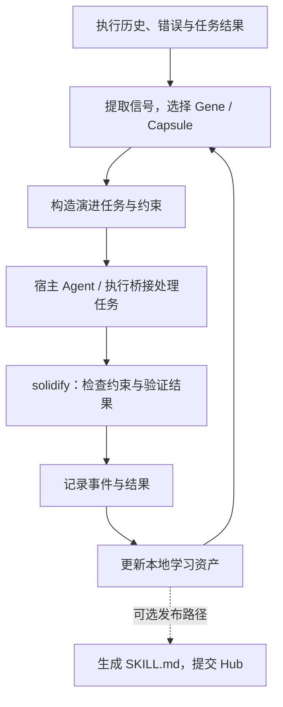

# Evolver 技术分析：经验演进、Skill 更新与 Antnest 的能力边界

> 调研日期：2026-09-26。
>
> 对象：[EvoMap/evolver](https://github.com/EvoMap/evolver)，固定到本次读取的
> [提交 `31b0691acd97ba18878019312e646f1f2d970d43`](https://github.com/EvoMap/evolver/commit/31b0691acd97ba18878019312e646f1f2d970d43)。
> 该提交的 `package.json` 标记版本为 `1.94.0`；这不表示已核实 npm 发布版本。
>
> 方法：静态阅读公开文档、入口、数据模型、资产存储、Skill 发布/更新、Proxy
> 及相关测试源码。未安装依赖、启动 Evolver、执行上游测试或访问登录后的 Hub。
> 本文是独立技术分析，不修改 Antnest 实现，也不扩大阶段四已经确定的范围。

## 1. 结论与参考价值

Evolver 的主要价值是将 Agent 的执行经验组织成可复用的策略、案例和演进记录，
再用于后续任务选择、提示构造与改进验证。Skill 发布是其中一条输出路径。
它覆盖的业务范围比当前 Antnest Skill Registry 首版更宽。
项目将这套资产与交互约定称为 GEP（Genome Evolution Protocol）。
[项目说明](https://github.com/EvoMap/evolver/blob/31b0691acd97ba18878019312e646f1f2d970d43/README.md)

对 Antnest 最有参考价值的是以下三点：

1. **区分交付的基础能力与运行中积累的经验。** Evolver 将随程序分发的种子资产
   与工作区中的可变资产分开保存。这支持“基础 Skill 只读、个人经验可写”的设计。
2. **将改进过程结构化。** 记录触发条件、采用的策略、结果和失败经验，便于之后
   选择与复用；仅有一份不断增长的 `SKILL.md` 难以表达这些关联。
3. **区分学习与正式发布。** 本地策略可以反复调整，但成为平台预设时，应经过
   Registry 的不可变版本、Template 固定引用与 Runtime 重建流程。

后两项与 Antnest 的结合方式是本文建议，尚未纳入实现计划。当前
[Skill Registry 最小方案](skill-registry-minimal-design.md)仍只承担托管、模板联动
和 Runtime 只读交付；[阶段四](stage-4-services.md)仍规划三个服务。

## 2. 架构与执行闭环

### 2.1 主要模块

| 模块 | 在本次阅读中确认的作用 | 边界 |
| --- | --- | --- |
| CLI 入口 `index.js` | 分派单次运行、循环、执行桥接、固化、发布与下载等命令 | 不同命令的写入与执行行为不同 |
| GEP 核心 | 信号分析、策略选择、演进任务构造与固化 | 核心文件存在混淆，不能仅凭可读外围代码确认完整算法 |
| Asset Store | 保存 Gene、Capsule、事件和候选资产 | 本地文件存储，包含可变记录 |
| 执行桥接 | 将演进任务交给宿主 Agent 执行 | `exec` 入口支持多个 harness；不等于所有模式都只输出文本 |
| Proxy / Mailbox | 本地消息接口、持久化排队、后台 Hub 同步及扩展处理 | 是与 EvoMap 交互的适配层 |
| Skill Publisher / Fetch | 将 Gene 转为 Skill、发布、下载到本地 | 不提供 Antnest 所需的模板快照与 Runtime 生命周期控制 |

依据：[CLI 入口](https://github.com/EvoMap/evolver/blob/31b0691acd97ba18878019312e646f1f2d970d43/index.js)、
[Proxy 组装](https://github.com/EvoMap/evolver/blob/31b0691acd97ba18878019312e646f1f2d970d43/src/proxy/index.js)、
[Skill Publisher](https://github.com/EvoMap/evolver/blob/31b0691acd97ba18878019312e646f1f2d970d43/src/gep/skillPublisher.js)。

### 2.2 演进闭环的理解

下面是依据文档、入口调用和数据模型整理的概念流程。它不是所有运行模式都必经
的严格时序图，也不表示已验证混淆代码中的所有分支。

这里的“学习”体现在后续可以读取的策略、匹配信号和案例上。本次读取的接口没有
显示模型权重训练流程，不能将其宣传中的“自我进化”等同于模型参数更新。

相关测试表达的预期包括：成功经验增加问题/领域匹配信号；失败经验写入
`anti_patterns`，不因此扩大匹配范围；纯验证失败与破坏性约束失败分别分类。
这说明其设计包含失败反馈，但这些是本次阅读到的测试断言，未经执行确认。
[学习反馈测试](https://github.com/EvoMap/evolver/blob/31b0691acd97ba18878019312e646f1f2d970d43/test/solidifyLearning.test.js)

### 2.3 运行模式决定实际副作用

| 路径 | 可确认行为 | 阅读时应采用的口径 |
| --- | --- | --- |
| 单次运行 | 入口调用 `evolve.run()`；README 描述为生成 GEP 提示 | 核心实现混淆，不能据此保证没有其他写入 |
| `--loop` | 未显式配置时启用 `EVOLVE_BRIDGE=true`，入口提示可能修改工作区 | 属于可驱动实际执行的模式 |
| `exec` | 调用 `runExecBridge`，接受 `claude-code/openclaw/codex/opencode` | 需要按执行系统理解，不能当成纯文档生成 |
| `solidify` | 调用固化逻辑，默认允许失败回滚，并处理返回的 Gene/Event/Capsule | 验证、记录、恢复均可能产生副作用 |

README 对整体能力的“仅生成提示词”描述不足以覆盖当前循环模式。
应以固定提交的具体命令分支判断行为，尤其是
[`--loop` 默认配置](https://github.com/EvoMap/evolver/blob/31b0691acd97ba18878019312e646f1f2d970d43/index.js#L1350-L1374)。
显式关闭执行桥接也不等于整个进程不写日志、状态或学习资产。

## 3. 资产模型：策略、案例、过程与验证

| 对象 | 核心含义 | 主要信息 |
| --- | --- | --- |
| Gene | 可复用的处理策略 | 匹配信号、前置条件、策略步骤、约束、验证命令、学习历史与反模式 |
| Capsule | 一次可被复用或参考的结果案例 | 触发条件、关联 Gene、摘要、结果、影响范围、环境、可选差异和执行轨迹 |
| EvolutionEvent | 演进过程记录 | 以 JSONL 追加，用于保留过程线索 |
| ValidationReport | 结构化验证结果 | 命令、各项成功状态、受限输出、环境信息、耗时与整体结果 |

Gene 的 `schema_version` 表示数据结构版本；它与程序版本、某份 Skill 的发布版本
不是同一概念。Gene 可带 `routing_hint`、`tool_policy`，但字段存在不证明所有
宿主执行器都会强制执行这些提示。
[Gene 模型](https://github.com/EvoMap/evolver/blob/31b0691acd97ba18878019312e646f1f2d970d43/src/gep/schemas/gene.js)

Capsule 的结果允许 `success` 和 `failed`，来源也包括生成、复用、参考及用户编写。
因此不能把所有 Capsule 都当成“验证通过的成功方案”。
[Capsule 模型](https://github.com/EvoMap/evolver/blob/31b0691acd97ba18878019312e646f1f2d970d43/src/gep/schemas/capsule.js)

ValidationReport 只有在结果非空且每项成功时才设置 `overall_ok=true`，并保留
每项最多 4,000 字符的标准输出/错误输出。它可帮助审阅验证依据，但不能自行证明
命令覆盖了真实业务目标。
[验证报告实现](https://github.com/EvoMap/evolver/blob/31b0691acd97ba18878019312e646f1f2d970d43/src/gep/validationReport.js)

## 4. 存储、版本与可变性

### 4.1 分发资产与运行资产分离

以下为未覆盖环境变量、未启用 session scope 时的目录语义；`<workspace>` 本身
也通过环境和项目结构解析，不应直接等同于进程当前目录。

| 路径 | 作用 |
| --- | --- |
| `<安装目录>/assets/gep/` | 随程序分发的种子资产 |
| `<workspace>/.evolver/gep/` | 可变的 Gene、Capsule、事件及候选记录 |
| `<workspace>/memory/` | 默认记忆目录 |
| `<workspace>/memory/evolution/` | 默认演进过程状态目录 |
| `<workspace>/skills/` | `getSkillsDir()` 的默认 Skill 目录 |

`GEP_ASSETS_DIR`、`MEMORY_DIR`、`EVOLUTION_DIR`、`SKILLS_DIR` 可分别覆盖路径；
`EVOLVER_SESSION_SCOPE` 会细分部分资产/状态目录。目录分隔是应用配置，不等于
操作系统权限隔离，也不能直接作为 Antnest 的组织隔离机制。
[路径实现](https://github.com/EvoMap/evolver/blob/31b0691acd97ba18878019312e646f1f2d970d43/src/gep/paths.js#L151-L210)

首次初始化会从 bundled seed 建立本地 Gene 集合。后续存在针对特定旧种子集合
追加缺失升级 Gene 的逻辑，并非永远只在第一次写入；已有本地 Gene 不被这条
种子升级路径整体替换。
[种子初始化实现](https://github.com/EvoMap/evolver/blob/31b0691acd97ba18878019312e646f1f2d970d43/src/gep/assetStore.js#L307-L382)

### 4.2 内容标识不等于不可变发布版本

本地 `_upsertGene` 按逻辑 `gene.id` 查找并替换记录；写入时重新计算 `asset_id`。
这让内容变化后的标识与新内容一致，但不阻止修改，也不自动保存同一 Gene 的完整
历史版本。事件采用追加写入，同样不等于存储介质具有防篡改能力。
[资产写入实现](https://github.com/EvoMap/evolver/blob/31b0691acd97ba18878019312e646f1f2d970d43/src/gep/assetStore.js#L679-L753)

需要区分四种身份：

| 身份 | 回答的问题 |
| --- | --- |
| 程序版本，如 `1.94.0` | 运行的是哪一版 Evolver |
| `schema_version` | 记录按哪一版结构解释 |
| Gene/Capsule 的逻辑 `id` | 这是哪一个策略或案例 |
| `asset_id` | 当前资产内容的标识是什么 |

这套本地更新方式不替代 Registry 的“发布后不可覆盖 + 模板精确引用”。Antnest
采用整数还是 SemVer 可以另行选择；**不可变版本、固定摘要和显式生效时机**才是
交付保证。本文不修改当前最小方案中的版本格式。

### 4.3 文件写入的一致性边界

Asset Store 用文件锁串行化部分读改写，并以临时文件替换 JSON；这是本地文件
并发保护。部分模型校验采取告警后继续保存的策略，不是 Registry 上传入口所需的
“不合格包整体拒绝”。不能据此推导跨多个文件的数据库事务、所有故障点下的持久性，
或多租户服务的并发保证。
[存储实现](https://github.com/EvoMap/evolver/blob/31b0691acd97ba18878019312e646f1f2d970d43/src/gep/assetStore.js#L10-L53)、
[对应存储测试](https://github.com/EvoMap/evolver/blob/31b0691acd97ba18878019312e646f1f2d970d43/test/assetStore.test.js)

## 5. Skill 的生成、发布与本地更新

### 5.1 Gene 转为 Skill

`geneToSkillMd` 将 Gene 中的匹配信号、前置条件、策略与避免事项组织成 Markdown。
发布使用 `POST /a2a/skill/store/publish`；冲突时可转到
`PUT /a2a/skill/store/update`。这是将经验资产导出到 Skill 分发体系的路径。
客户端称更新会产生新版本，但仅凭客户端不能确认 Hub 后端的完整版本不可变规则。
[生成与发布实现](https://github.com/EvoMap/evolver/blob/31b0691acd97ba18878019312e646f1f2d970d43/src/gep/skillPublisher.js)

生成出来的 Markdown 仍需通过目标仓库自己的格式检查。例如当前生成器会将
frontmatter 的名称转为展示形式，而 Antnest 最小方案要求规范的小写名称；因此
不能把“能生成 `SKILL.md`”理解成“能直接通过我们的包校验”。这是对两个格式的
静态比较，不是已完成的导入测试。

### 5.2 下载落盘

`fetch --skill` 从 Hub 下载内容，默认写入当前目录下 `skills/<id>/`。该分支检查
目标路径，对附属文件执行扩展名及单文件大小限制，并使用 basename 落盘。
文件逐个写入，部分不允许的附属文件会被跳过；这条路径没有显示完整包暂存后原子
切换的交付流程。
[下载实现](https://github.com/EvoMap/evolver/blob/31b0691acd97ba18878019312e646f1f2d970d43/index.js#L2432-L2595)

本次提交增加了本地写入后的 `install-success` 上报，上报失败不会撤销已写文件。
但 `skillInstallCommitted` 检查的是下载响应中是否带内容，没有接收实际成功写入
的文件清单。因此，不能把这个统计回执当作“完整制品已验证交付”的证明；仅有被
跳过的附属文件时，其判断仍可能为真。这是源码推断，未做运行复现。
[上报与判断实现](https://github.com/EvoMap/evolver/blob/31b0691acd97ba18878019312e646f1f2d970d43/src/gep/skillInstallSuccess.js)

### 5.3 Proxy 的直接覆盖路径

当 Proxy 配置了 `skillPath`，收到 `skill_update` 后，处理器会备份现有文件为
`.bak`，直接写入新正文，记录版本状态，再确认已处理消息。没有配置该路径时会
跳过，不能认为每次默认启动都会覆盖 Skill。
[SkillUpdater](https://github.com/EvoMap/evolver/blob/31b0691acd97ba18878019312e646f1f2d970d43/src/proxy/extensions/skillUpdater.js)、
[配置与调用入口](https://github.com/EvoMap/evolver/blob/31b0691acd97ba18878019312e646f1f2d970d43/src/proxy/index.js#L538-L540)

这条路径与 Antnest 预设 Skill 的要求直接冲突。备份是恢复手段，不能替代写保护；
若以后使用 Evolver，更新目标只能是获准修改的个人资产或候选区。预设目录仍应由
Registry → Template → Runtime Controller 的交付流程管理。

## 6. Proxy 与 Hub 的交互方式

Proxy 提供本地 HTTP 接口，将待发送消息写入 Mailbox，再由后台同步流程访问 Hub；
接收的消息可被轮询、确认或交给扩展处理。当前 HTTP 服务绑定 `127.0.0.1`，并校验
Bearer token；不能沿用 `SKILL.md` 中关于本地接口无需认证的描述。
[HTTP 实现](https://github.com/EvoMap/evolver/blob/31b0691acd97ba18878019312e646f1f2d970d43/src/proxy/server/http.js)、
[集成说明](https://github.com/EvoMap/evolver/blob/31b0691acd97ba18878019312e646f1f2d970d43/SKILL.md)

Mailbox 使用 JSONL 与状态文件恢复消息索引，提供 send/poll/ack；接收路径按消息 ID
去重。后台发送默认每 5 秒调度，接收轮询会调整活跃/空闲间隔，异常路径在 `finally`
中重新安排下一轮。这有助于避免一次异常使同步循环永久停止，但不等于业务副作用
具有 exactly-once 保证。
[Mailbox](https://github.com/EvoMap/evolver/blob/31b0691acd97ba18878019312e646f1f2d970d43/src/proxy/mailbox/store.js)、
[同步循环](https://github.com/EvoMap/evolver/blob/31b0691acd97ba18878019312e646f1f2d970d43/src/proxy/sync/engine.js)

对 Antnest 的启发是将外部同步与 Agent 执行解耦。这里的 Proxy 不直接对应
Agent UI 的交互 Bridge，也不足以成为替换现有 ACP 会话、工具和执行链路的理由。
是否需要 EvoMap 外部同步，应作为独立需求决定。

## 7. 验证、失败恢复与资源边界

### 7.1 验证能力需要按实际执行路径判断

Hub Validator 的 `sandboxExecutor` 创建临时工作目录、限制命令与超时，并截断
输出。当前白名单只允许 `node`，还拒绝 eval、预加载与调试等参数；它没有提供
容器级文件系统或网络隔离。源码所述的网络限制依赖约定，不能视为内核强制边界。

该模块不会自动准备 Gene 对应项目文件；临时目录为空时，运行一个项目脚本不能
自然验证业务。`node --version` 这类检查可以成功，但它只说明环境中的 Node
可以启动。以上判断仅针对该 Validator 路径，不泛化到全部 `solidify` 验证逻辑。
[Validator 执行实现](https://github.com/EvoMap/evolver/blob/31b0691acd97ba18878019312e646f1f2d970d43/src/gep/validator/sandboxExecutor.js)

### 7.2 Git 回滚不等于状态事务

`rollbackTracked` 默认采用包含未跟踪文件的 Git stash；显式配置可选择其他模式。
代码还存在 stash 失败后恢复/硬重置的分支。因此，“默认保留 stash”不能被扩展为
任何失败都无损恢复的承诺，也不能回滚外部 API、已发送消息或不在该仓库中的状态。
[Git 恢复实现](https://github.com/EvoMap/evolver/blob/31b0691acd97ba18878019312e646f1f2d970d43/src/gep/gitOps.js#L127-L154)

这更适合有明确工作区边界的本地演进任务。若以后用于 Antnest，应由现有执行与
生命周期系统提供隔离、任务身份和恢复记录，不能让一个演进进程自行重置多个任务
共用的工作区。此项是接入建议，不是当前新增需求。

### 7.3 内存与长期运行

| 已观察的机制 | 收益 | 限制 |
| --- | --- | --- |
| Mailbox 分块解析 JSONL，限制单行大小 | 避免启动时一次读取整个日志字符串 | 仍将消息对象存入内存 Map |
| Mailbox 压缩更新日志 | 减少重复状态更新记录 | 实现会收集、排序并序列化当前消息；不等于按保留期清除历史消息 |
| Asset Store 对部分历史读取采用尾部窗口 | 控制一次历史查询的读取量 | Gene/Capsule 集合仍存在整份 JSON 读改写 |
| 文件锁等待使用同步阻塞 | 减少锁等待时空转的 CPU 消耗 | 竞争期间仍会阻塞 Node 事件循环 |

依据：[Mailbox 读取与压缩](https://github.com/EvoMap/evolver/blob/31b0691acd97ba18878019312e646f1f2d970d43/src/proxy/mailbox/store.js)、
[Asset Store](https://github.com/EvoMap/evolver/blob/31b0691acd97ba18878019312e646f1f2d970d43/src/gep/assetStore.js)。

这些设计包含实际的资源控制，但本次没有压测或长期运行证据，不能给出稳定内存上限。
若作为平台常驻组件评估，需要另行确定历史保留量、单 Agent 配额、并发与积压限制。

## 8. 与 Antnest 当前方案的对应关系

### 8.1 基础能力只读，经验可以演进

| 维度 | Evolver 已观察行为 | Antnest 当前方案 |
| --- | --- | --- |
| 基础交付 | bundled seed 与本地资产分离 | Template 固定版本，RC 交付完整预设集合 |
| 运行中变化 | 本地 Gene 可更新，SkillUpdater 可覆盖指定文件 | 系统 Skill 只读；个人 Skill 保持可写 |
| 版本身份 | 程序版本、schema、逻辑 ID、内容标识分开 | Registry 版本与摘要随 Template/AgentSpec 冻结 |
| 生效时机 | 按命令执行或消息处理时更新 | 发布后显式修订模板，再重建 Agent |
| 保护方式 | 部分路径约束、验证与事后恢复 | 拟采用工具拒写与 Runtime 卷只读挂载共同保证 |

Antnest 上表中的 Registry 联动和按 Agent/generation 交付属于待实现方案，不能
描述为已经验收通过；现有系统 Skill 根是这套方案的基础。
[最小版本设计](skill-registry-minimal-design.md)

在该方案正确实现后，即使 Agent 通过 shell 绕过文件工具，预设卷的只读挂载仍
应拒绝原地修改。这比要求 Agent 遵守提示词或事后备份更强。保证的范围是普通
Runtime 执行权限下的预设文件完整性，前提是不给 Agent 主机 Docker 控制权、
重新挂载权限或同一卷的可写别名。

文件只读也不等于 Agent 必然采用其中的行为规则。它仍可能生成自己的副本或
个人 Skill；上下文优先级、同名处理与工具权限需要由平台规则定义，不能仅靠只读
挂载证明“基础能力无法被行为层绕过”。

### 8.2 可以保留的扩展方向

未来如果需要经验演进，可以保持以下两条路径分离：

基础 Skill 可以包含“如何记录经验”的说明；执行产生的记录写入工作区，不写回
该 Skill 包。个人策略经过整理后，可以作为一个新的 Registry 版本发布，但不应
自动修改正在运行的 Agent 预设。图中的经验整理与发布自动化尚未规划或实现。

职责上，Registry 继续负责制品与版本，不吸收模型调用、经验提取、循环执行或
调度。经验从哪里来、何时运行整理任务以及谁能批准正式发布，属于后续独立设计；
当前不因此增加第四个服务，也不让 Skill Registry 首版依赖 Evolver。

## 9. 阅读证据与未确认事项

本次除实现外，还静态查看了以下上游测试；测试名称和断言只能说明作者期望的
行为，不能作为本次运行通过的证据。

| 测试源码 | 对本分析的作用 |
| --- | --- |
| [assetStore.test.js](https://github.com/EvoMap/evolver/blob/31b0691acd97ba18878019312e646f1f2d970d43/test/assetStore.test.js) | 种子保留、只读加载、内容标识与告警后写入 |
| [paths.test.js](https://github.com/EvoMap/evolver/blob/31b0691acd97ba18878019312e646f1f2d970d43/test/paths.test.js) | 安装路径、项目路径和运行状态路径的区分 |
| [solidifyLearning.test.js](https://github.com/EvoMap/evolver/blob/31b0691acd97ba18878019312e646f1f2d970d43/test/solidifyLearning.test.js) | 成功信号、失败反模式与失败分类 |
| [solidify-helpers.test.js](https://github.com/EvoMap/evolver/blob/31b0691acd97ba18878019312e646f1f2d970d43/test/solidify-helpers.test.js) / [rollbackSafety.test.js](https://github.com/EvoMap/evolver/blob/31b0691acd97ba18878019312e646f1f2d970d43/test/rollbackSafety.test.js) | 部分验证命令和回滚边界的预期 |
| [skillPublisher.test.js](https://github.com/EvoMap/evolver/blob/31b0691acd97ba18878019312e646f1f2d970d43/test/skillPublisher.test.js) / [skill2gepParser.test.js](https://github.com/EvoMap/evolver/blob/31b0691acd97ba18878019312e646f1f2d970d43/test/skill2gepParser.test.js) | Skill 与结构化资产转换的预期 |
| [skillInstallSuccess.test.js](https://github.com/EvoMap/evolver/blob/31b0691acd97ba18878019312e646f1f2d970d43/test/skillInstallSuccess.test.js) | 安装统计上报及其失败处理 |

本次分析的明确限制：

- `src/evolve.js`、`src/gep/selector.js`、`src/gep/solidify.js` 等核心文件采用混淆
  形式；已确认外围调用与数据接口，但没有完成核心算法的逐分支审计。
- Hub 服务端的版本持久化、权限与验证机制不在本次已阅读实现范围内；不将
  客户端注释、接口名或返回字段当作服务端保证。
- 未复现项目宣称的质量、成本或基准收益，也未检验其在 Antnest 中的适用性。
- README 的 Node 最低版本说明与包声明不同；本次包声明为 `>=22.12`。
  如后续试验，应重新核对所选版本的实际依赖与命令行为。
  [包声明](https://github.com/EvoMap/evolver/blob/31b0691acd97ba18878019312e646f1f2d970d43/package.json)

本文形成的参考判断是：保留 Evolver 的经验资产分层、失败反馈和发布转换思路；
Antnest 的预设 Skill 继续遵循不可变发布、模板固定引用与 Runtime 只读交付。
直接接入 Evolver 或增加自动演进功能，需要另行设计与验证。
