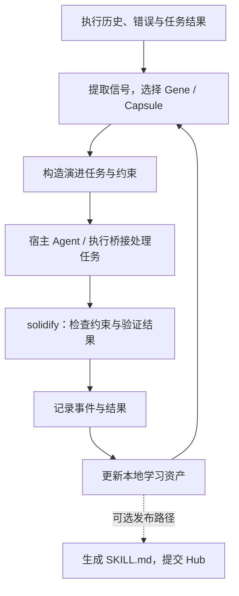
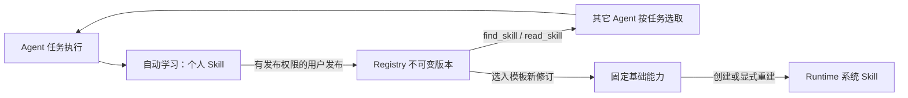
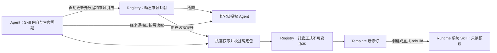

# Evolver 技术分析：经验演进、Skill 更新与 Antnest 的能力边界

> 2026-10-01 补充：第 10 节重新核对 Evolver main；第 11 节根据用户进一步澄清，
> 以 Vercel `find-skills` 为主要参考，记录用户确定的“Agent Skill 自动投影 →
> Registry 检索与临时使用 → 用户提升 → Template/rebuild 预设交付”四步流程。
> 产品路径以第 11 节为准；用户进一步明确投影是动态来源映射，仅登记目录与
> 来源引用，内容及生命周期仍归来源 Agent。只有提升后 Registry 托管完整制品。
> Registry/source 合同、Registry D1、ACP D2 自动投影/当前来源读取和 D3 模型
> 搜索/正文加载、Runtime D4 临时接口、ACP D4A 持久回收和 Console D6
> 来源预览/用户提升已交付；[DI1](skill-propagation-integration-delivery-20261001.md)
> 四步集成、[DI2](skill-source-lifecycle-delivery-20261001.md)正常来源生命周期与
> [DI3](skill-discovery-caller-integration-delivery-20261001.md)活动检索/来源 Trace
> 均已取得独立证据。第 10 节的早期范围不作为新的合同基线。
> 第 1–9 节保留 2026-09-26 的历史调研口径；其中 Antnest 尚未实现的描述不代表
> 当前状态。Registry 固定交付和个人 Skill 自动学习的现状分别以
> [Registry 方案](skill-registry-minimal-design.md)和[学习方案](skill-learning-design.md)
> 为准。动态工具目录/dispatch 及只读结果已有实现；所属批次边界见
> [Registry D1 交付](skill-discovery-registry-delivery-20261001.md)与
> [ACP D2 交付](skill-discovery-acp-delivery-20261001.md)和
> [ACP D3 交付](skill-discovery-tools-delivery-20261001.md)。

> 调研日期：2026-09-26。
>
> 对象：[EvoMap/evolver](https://github.com/EvoMap/evolver)，固定到本次读取的
> [提交 `31b0691acd97ba18878019312e646f1f2d970d43`](https://github.com/EvoMap/evolver/commit/31b0691acd97ba18878019312e646f1f2d970d43)。
> 该提交的 `package.json` 标记版本为 `1.94.0`；这不表示已核实 npm 发布版本。
>
> 方法：静态阅读公开文档、入口、数据模型、资产存储、Skill 发布/更新、Proxy
> 及相关测试源码。未安装依赖、启动 Evolver、执行上游测试或访问登录后的 Hub。
> 本文是独立技术分析，不修改 Antnest 实现，也不扩大阶段四已经确定的范围。

## 1. 结论与参考价值

Evolver 的主要价值是将 Agent 的执行经验组织成可复用的策略、案例和演进记录，
再用于后续任务选择、提示构造与改进验证。Skill 发布是其中一条输出路径。
它覆盖的业务范围比当前 Antnest Skill Registry 首版更宽。
项目将这套资产与交互约定称为 GEP（Genome Evolution Protocol）。
[项目说明](https://github.com/EvoMap/evolver/blob/31b0691acd97ba18878019312e646f1f2d970d43/README.md)

对 Antnest 最有参考价值的是以下三点：

1. **区分交付的基础能力与运行中积累的经验。** Evolver 将随程序分发的种子资产
   与工作区中的可变资产分开保存。这支持“基础 Skill 只读、个人经验可写”的设计。
2. **将改进过程结构化。** 记录触发条件、采用的策略、结果和失败经验，便于之后
   选择与复用；仅有一份不断增长的 `SKILL.md` 难以表达这些关联。
3. **区分学习与正式发布。** 本地策略可以反复调整，但成为平台预设时，应经过
   Registry 的不可变版本、Template 固定引用与 Runtime 重建流程。

后两项与 Antnest 的结合方式是本文建议，尚未纳入实现计划。当前
[Skill Registry 最小方案](skill-registry-minimal-design.md)仍只承担托管、模板联动
和 Runtime 只读交付；[阶段四](stage-4-services.md)仍规划三个服务。

## 2. 架构与执行闭环

### 2.1 主要模块

| 模块                    | 在本次阅读中确认的作用                               | 边界                                                    |
| ----------------------- | ---------------------------------------------------- | ------------------------------------------------------- |
| CLI 入口 `index.js`     | 分派单次运行、循环、执行桥接、固化、发布与下载等命令 | 不同命令的写入与执行行为不同                            |
| GEP 核心                | 信号分析、策略选择、演进任务构造与固化               | 核心文件存在混淆，不能仅凭可读外围代码确认完整算法      |
| Asset Store             | 保存 Gene、Capsule、事件和候选资产                   | 本地文件存储，包含可变记录                              |
| 执行桥接                | 将演进任务交给宿主 Agent 执行                        | `exec` 入口支持多个 harness；不等于所有模式都只输出文本 |
| Proxy / Mailbox         | 本地消息接口、持久化排队、后台 Hub 同步及扩展处理    | 是与 EvoMap 交互的适配层                                |
| Skill Publisher / Fetch | 将 Gene 转为 Skill、发布、下载到本地                 | 不提供 Antnest 所需的模板快照与 Runtime 生命周期控制    |

依据：[CLI 入口](https://github.com/EvoMap/evolver/blob/31b0691acd97ba18878019312e646f1f2d970d43/index.js)、
[Proxy 组装](https://github.com/EvoMap/evolver/blob/31b0691acd97ba18878019312e646f1f2d970d43/src/proxy/index.js)、
[Skill Publisher](https://github.com/EvoMap/evolver/blob/31b0691acd97ba18878019312e646f1f2d970d43/src/gep/skillPublisher.js)。

### 2.2 演进闭环的理解

下面是依据文档、入口调用和数据模型整理的概念流程。它不是所有运行模式都必经
的严格时序图，也不表示已验证混淆代码中的所有分支。



这里的“学习”体现在后续可以读取的策略、匹配信号和案例上。本次读取的接口没有
显示模型权重训练流程，不能将其宣传中的“自我进化”等同于模型参数更新。

相关测试表达的预期包括：成功经验增加问题/领域匹配信号；失败经验写入
`anti_patterns`，不因此扩大匹配范围；纯验证失败与破坏性约束失败分别分类。
这说明其设计包含失败反馈，但这些是本次阅读到的测试断言，未经执行确认。
[学习反馈测试](https://github.com/EvoMap/evolver/blob/31b0691acd97ba18878019312e646f1f2d970d43/test/solidifyLearning.test.js)

### 2.3 运行模式决定实际副作用

| 路径       | 可确认行为                                                       | 阅读时应采用的口径                     |
| ---------- | ---------------------------------------------------------------- | -------------------------------------- |
| 单次运行   | 入口调用 `evolve.run()`；README 描述为生成 GEP 提示              | 核心实现混淆，不能据此保证没有其他写入 |
| `--loop`   | 未显式配置时启用 `EVOLVE_BRIDGE=true`，入口提示可能修改工作区    | 属于可驱动实际执行的模式               |
| `exec`     | 调用 `runExecBridge`，接受 `claude-code/openclaw/codex/opencode` | 需要按执行系统理解，不能当成纯文档生成 |
| `solidify` | 调用固化逻辑，默认允许失败回滚，并处理返回的 Gene/Event/Capsule  | 验证、记录、恢复均可能产生副作用       |

README 对整体能力的“仅生成提示词”描述不足以覆盖当前循环模式。
应以固定提交的具体命令分支判断行为，尤其是
[`--loop` 默认配置](https://github.com/EvoMap/evolver/blob/31b0691acd97ba18878019312e646f1f2d970d43/index.js#L1350-L1374)。
显式关闭执行桥接也不等于整个进程不写日志、状态或学习资产。

## 3. 资产模型：策略、案例、过程与验证

| 对象             | 核心含义                     | 主要信息                                                            |
| ---------------- | ---------------------------- | ------------------------------------------------------------------- |
| Gene             | 可复用的处理策略             | 匹配信号、前置条件、策略步骤、约束、验证命令、学习历史与反模式      |
| Capsule          | 一次可被复用或参考的结果案例 | 触发条件、关联 Gene、摘要、结果、影响范围、环境、可选差异和执行轨迹 |
| EvolutionEvent   | 演进过程记录                 | 以 JSONL 追加，用于保留过程线索                                     |
| ValidationReport | 结构化验证结果               | 命令、各项成功状态、受限输出、环境信息、耗时与整体结果              |

Gene 的 `schema_version` 表示数据结构版本；它与程序版本、某份 Skill 的发布版本
不是同一概念。Gene 可带 `routing_hint`、`tool_policy`，但字段存在不证明所有
宿主执行器都会强制执行这些提示。
[Gene 模型](https://github.com/EvoMap/evolver/blob/31b0691acd97ba18878019312e646f1f2d970d43/src/gep/schemas/gene.js)

Capsule 的结果允许 `success` 和 `failed`，来源也包括生成、复用、参考及用户编写。
因此不能把所有 Capsule 都当成“验证通过的成功方案”。
[Capsule 模型](https://github.com/EvoMap/evolver/blob/31b0691acd97ba18878019312e646f1f2d970d43/src/gep/schemas/capsule.js)

ValidationReport 只有在结果非空且每项成功时才设置 `overall_ok=true`，并保留
每项最多 4,000 字符的标准输出/错误输出。它可帮助审阅验证依据，但不能自行证明
命令覆盖了真实业务目标。
[验证报告实现](https://github.com/EvoMap/evolver/blob/31b0691acd97ba18878019312e646f1f2d970d43/src/gep/validationReport.js)

## 4. 存储、版本与可变性

### 4.1 分发资产与运行资产分离

以下为未覆盖环境变量、未启用 session scope 时的目录语义；`<workspace>` 本身
也通过环境和项目结构解析，不应直接等同于进程当前目录。

| 路径                            | 作用                                 |
| ------------------------------- | ------------------------------------ |
| `<安装目录>/assets/gep/`        | 随程序分发的种子资产                 |
| `<workspace>/.evolver/gep/`     | 可变的 Gene、Capsule、事件及候选记录 |
| `<workspace>/memory/`           | 默认记忆目录                         |
| `<workspace>/memory/evolution/` | 默认演进过程状态目录                 |
| `<workspace>/skills/`           | `getSkillsDir()` 的默认 Skill 目录   |

`GEP_ASSETS_DIR`、`MEMORY_DIR`、`EVOLUTION_DIR`、`SKILLS_DIR` 可分别覆盖路径；
`EVOLVER_SESSION_SCOPE` 会细分部分资产/状态目录。目录分隔是应用配置，不等于
操作系统权限隔离，也不能直接作为 Antnest 的组织隔离机制。
[路径实现](https://github.com/EvoMap/evolver/blob/31b0691acd97ba18878019312e646f1f2d970d43/src/gep/paths.js#L151-L210)

首次初始化会从 bundled seed 建立本地 Gene 集合。后续存在针对特定旧种子集合
追加缺失升级 Gene 的逻辑，并非永远只在第一次写入；已有本地 Gene 不被这条
种子升级路径整体替换。
[种子初始化实现](https://github.com/EvoMap/evolver/blob/31b0691acd97ba18878019312e646f1f2d970d43/src/gep/assetStore.js#L307-L382)

### 4.2 内容标识不等于不可变发布版本

本地 `_upsertGene` 按逻辑 `gene.id` 查找并替换记录；写入时重新计算 `asset_id`。
这让内容变化后的标识与新内容一致，但不阻止修改，也不自动保存同一 Gene 的完整
历史版本。事件采用追加写入，同样不等于存储介质具有防篡改能力。
[资产写入实现](https://github.com/EvoMap/evolver/blob/31b0691acd97ba18878019312e646f1f2d970d43/src/gep/assetStore.js#L679-L753)

需要区分四种身份：

| 身份                     | 回答的问题               |
| ------------------------ | ------------------------ |
| 程序版本，如 `1.94.0`    | 运行的是哪一版 Evolver   |
| `schema_version`         | 记录按哪一版结构解释     |
| Gene/Capsule 的逻辑 `id` | 这是哪一个策略或案例     |
| `asset_id`               | 当前资产内容的标识是什么 |

这套本地更新方式不替代 Registry 的“发布后不可覆盖 + 模板精确引用”。Antnest
采用整数还是 SemVer 可以另行选择；**不可变版本、固定摘要和显式生效时机**才是
交付保证。本文不修改当前最小方案中的版本格式。

### 4.3 文件写入的一致性边界

Asset Store 用文件锁串行化部分读改写，并以临时文件替换 JSON；这是本地文件
并发保护。部分模型校验采取告警后继续保存的策略，不是 Registry 上传入口所需的
“不合格包整体拒绝”。不能据此推导跨多个文件的数据库事务、所有故障点下的持久性，
或多租户服务的并发保证。
[存储实现](https://github.com/EvoMap/evolver/blob/31b0691acd97ba18878019312e646f1f2d970d43/src/gep/assetStore.js#L10-L53)、
[对应存储测试](https://github.com/EvoMap/evolver/blob/31b0691acd97ba18878019312e646f1f2d970d43/test/assetStore.test.js)

## 5. Skill 的生成、发布与本地更新

### 5.1 Gene 转为 Skill

`geneToSkillMd` 将 Gene 中的匹配信号、前置条件、策略与避免事项组织成 Markdown。
发布使用 `POST /a2a/skill/store/publish`；冲突时可转到
`PUT /a2a/skill/store/update`。这是将经验资产导出到 Skill 分发体系的路径。
客户端称更新会产生新版本，但仅凭客户端不能确认 Hub 后端的完整版本不可变规则。
[生成与发布实现](https://github.com/EvoMap/evolver/blob/31b0691acd97ba18878019312e646f1f2d970d43/src/gep/skillPublisher.js)

生成出来的 Markdown 仍需通过目标仓库自己的格式检查。例如当前生成器会将
frontmatter 的名称转为展示形式，而 Antnest 最小方案要求规范的小写名称；因此
不能把“能生成 `SKILL.md`”理解成“能直接通过我们的包校验”。这是对两个格式的
静态比较，不是已完成的导入测试。

### 5.2 下载落盘

`fetch --skill` 从 Hub 下载内容，默认写入当前目录下 `skills/<id>/`。该分支检查
目标路径，对附属文件执行扩展名及单文件大小限制，并使用 basename 落盘。
文件逐个写入，部分不允许的附属文件会被跳过；这条路径没有显示完整包暂存后原子
切换的交付流程。
[下载实现](https://github.com/EvoMap/evolver/blob/31b0691acd97ba18878019312e646f1f2d970d43/index.js#L2432-L2595)

本次提交增加了本地写入后的 `install-success` 上报，上报失败不会撤销已写文件。
但 `skillInstallCommitted` 检查的是下载响应中是否带内容，没有接收实际成功写入
的文件清单。因此，不能把这个统计回执当作“完整制品已验证交付”的证明；仅有被
跳过的附属文件时，其判断仍可能为真。这是源码推断，未做运行复现。
[上报与判断实现](https://github.com/EvoMap/evolver/blob/31b0691acd97ba18878019312e646f1f2d970d43/src/gep/skillInstallSuccess.js)

### 5.3 Proxy 的直接覆盖路径

当 Proxy 配置了 `skillPath`，收到 `skill_update` 后，处理器会备份现有文件为
`.bak`，直接写入新正文，记录版本状态，再确认已处理消息。没有配置该路径时会
跳过，不能认为每次默认启动都会覆盖 Skill。
[SkillUpdater](https://github.com/EvoMap/evolver/blob/31b0691acd97ba18878019312e646f1f2d970d43/src/proxy/extensions/skillUpdater.js)、
[配置与调用入口](https://github.com/EvoMap/evolver/blob/31b0691acd97ba18878019312e646f1f2d970d43/src/proxy/index.js#L538-L540)

这条路径与 Antnest 预设 Skill 的要求直接冲突。备份是恢复手段，不能替代写保护；
若以后使用 Evolver，更新目标只能是获准修改的个人资产或候选区。预设目录仍应由
Registry → Template → Runtime Controller 的交付流程管理。

## 6. Proxy 与 Hub 的交互方式

Proxy 提供本地 HTTP 接口，将待发送消息写入 Mailbox，再由后台同步流程访问 Hub；
接收的消息可被轮询、确认或交给扩展处理。当前 HTTP 服务绑定 `127.0.0.1`，并校验
Bearer token；不能沿用 `SKILL.md` 中关于本地接口无需认证的描述。
[HTTP 实现](https://github.com/EvoMap/evolver/blob/31b0691acd97ba18878019312e646f1f2d970d43/src/proxy/server/http.js)、
[集成说明](https://github.com/EvoMap/evolver/blob/31b0691acd97ba18878019312e646f1f2d970d43/SKILL.md)

Mailbox 使用 JSONL 与状态文件恢复消息索引，提供 send/poll/ack；接收路径按消息 ID
去重。后台发送默认每 5 秒调度，接收轮询会调整活跃/空闲间隔，异常路径在 `finally`
中重新安排下一轮。这有助于避免一次异常使同步循环永久停止，但不等于业务副作用
具有 exactly-once 保证。
[Mailbox](https://github.com/EvoMap/evolver/blob/31b0691acd97ba18878019312e646f1f2d970d43/src/proxy/mailbox/store.js)、
[同步循环](https://github.com/EvoMap/evolver/blob/31b0691acd97ba18878019312e646f1f2d970d43/src/proxy/sync/engine.js)

对 Antnest 的启发是将外部同步与 Agent 执行解耦。这里的 Proxy 不直接对应
Agent UI 的交互 Bridge，也不足以成为替换现有 ACP 会话、工具和执行链路的理由。
是否需要 EvoMap 外部同步，应作为独立需求决定。

## 7. 验证、失败恢复与资源边界

### 7.1 验证能力需要按实际执行路径判断

Hub Validator 的 `sandboxExecutor` 创建临时工作目录、限制命令与超时，并截断
输出。当前白名单只允许 `node`，还拒绝 eval、预加载与调试等参数；它没有提供
容器级文件系统或网络隔离。源码所述的网络限制依赖约定，不能视为内核强制边界。

该模块不会自动准备 Gene 对应项目文件；临时目录为空时，运行一个项目脚本不能
自然验证业务。`node --version` 这类检查可以成功，但它只说明环境中的 Node
可以启动。以上判断仅针对该 Validator 路径，不泛化到全部 `solidify` 验证逻辑。
[Validator 执行实现](https://github.com/EvoMap/evolver/blob/31b0691acd97ba18878019312e646f1f2d970d43/src/gep/validator/sandboxExecutor.js)

### 7.2 Git 回滚不等于状态事务

`rollbackTracked` 默认采用包含未跟踪文件的 Git stash；显式配置可选择其他模式。
代码还存在 stash 失败后恢复/硬重置的分支。因此，“默认保留 stash”不能被扩展为
任何失败都无损恢复的承诺，也不能回滚外部 API、已发送消息或不在该仓库中的状态。
[Git 恢复实现](https://github.com/EvoMap/evolver/blob/31b0691acd97ba18878019312e646f1f2d970d43/src/gep/gitOps.js#L127-L154)

这更适合有明确工作区边界的本地演进任务。若以后用于 Antnest，应由现有执行与
生命周期系统提供隔离、任务身份和恢复记录，不能让一个演进进程自行重置多个任务
共用的工作区。此项是接入建议，不是当前新增需求。

### 7.3 内存与长期运行

| 已观察的机制                           | 收益                             | 限制                                                         |
| -------------------------------------- | -------------------------------- | ------------------------------------------------------------ |
| Mailbox 分块解析 JSONL，限制单行大小   | 避免启动时一次读取整个日志字符串 | 仍将消息对象存入内存 Map                                     |
| Mailbox 压缩更新日志                   | 减少重复状态更新记录             | 实现会收集、排序并序列化当前消息；不等于按保留期清除历史消息 |
| Asset Store 对部分历史读取采用尾部窗口 | 控制一次历史查询的读取量         | Gene/Capsule 集合仍存在整份 JSON 读改写                      |
| 文件锁等待使用同步阻塞                 | 减少锁等待时空转的 CPU 消耗      | 竞争期间仍会阻塞 Node 事件循环                               |

依据：[Mailbox 读取与压缩](https://github.com/EvoMap/evolver/blob/31b0691acd97ba18878019312e646f1f2d970d43/src/proxy/mailbox/store.js)、
[Asset Store](https://github.com/EvoMap/evolver/blob/31b0691acd97ba18878019312e646f1f2d970d43/src/gep/assetStore.js)。

这些设计包含实际的资源控制，但本次没有压测或长期运行证据，不能给出稳定内存上限。
若作为平台常驻组件评估，需要另行确定历史保留量、单 Agent 配额、并发与积压限制。

## 8. 与 Antnest 当前方案的对应关系

### 8.1 基础能力只读，经验可以演进

| 维度       | Evolver 已观察行为                            | Antnest 当前方案                              |
| ---------- | --------------------------------------------- | --------------------------------------------- |
| 基础交付   | bundled seed 与本地资产分离                   | Template 固定版本，RC 交付完整预设集合        |
| 运行中变化 | 本地 Gene 可更新，SkillUpdater 可覆盖指定文件 | 系统 Skill 只读；个人 Skill 保持可写          |
| 版本身份   | 程序版本、schema、逻辑 ID、内容标识分开       | Registry 版本与摘要随 Template/AgentSpec 冻结 |
| 生效时机   | 按命令执行或消息处理时更新                    | 发布后显式修订模板，再重建 Agent              |
| 保护方式   | 部分路径约束、验证与事后恢复                  | 拟采用工具拒写与 Runtime 卷只读挂载共同保证   |

Antnest 上表中的 Registry 联动和按 Agent/generation 交付属于待实现方案，不能
描述为已经验收通过；现有系统 Skill 根是这套方案的基础。
[最小版本设计](skill-registry-minimal-design.md)

在该方案正确实现后，即使 Agent 通过 shell 绕过文件工具，预设卷的只读挂载仍
应拒绝原地修改。这比要求 Agent 遵守提示词或事后备份更强。保证的范围是普通
Runtime 执行权限下的预设文件完整性，前提是不给 Agent 主机 Docker 控制权、
重新挂载权限或同一卷的可写别名。

文件只读也不等于 Agent 必然采用其中的行为规则。它仍可能生成自己的副本或
个人 Skill；上下文优先级、同名处理与工具权限需要由平台规则定义，不能仅靠只读
挂载证明“基础能力无法被行为层绕过”。

### 8.2 可以保留的扩展方向

未来如果需要经验演进，可以保持以下两条路径分离：


基础 Skill 可以包含“如何记录经验”的说明；执行产生的记录写入工作区，不写回
该 Skill 包。个人策略经过整理后，可以作为一个新的 Registry 版本发布，但不应
自动修改正在运行的 Agent 预设。图中的经验整理与发布自动化尚未规划或实现。

职责上，Registry 继续负责制品与版本，不吸收模型调用、经验提取、循环执行或
调度。经验从哪里来、何时运行整理任务以及谁能批准正式发布，属于后续独立设计；
当前不因此增加第四个服务，也不让 Skill Registry 首版依赖 Evolver。

## 9. 阅读证据与未确认事项

本次除实现外，还静态查看了以下上游测试；测试名称和断言只能说明作者期望的
行为，不能作为本次运行通过的证据。

| 测试源码                                                                                                                                                                                                                                                                          | 对本分析的作用                           |
| --------------------------------------------------------------------------------------------------------------------------------------------------------------------------------------------------------------------------------------------------------------------------------- | ---------------------------------------- |
| [assetStore.test.js](https://github.com/EvoMap/evolver/blob/31b0691acd97ba18878019312e646f1f2d970d43/test/assetStore.test.js)                                                                                                                                                     | 种子保留、只读加载、内容标识与告警后写入 |
| [paths.test.js](https://github.com/EvoMap/evolver/blob/31b0691acd97ba18878019312e646f1f2d970d43/test/paths.test.js)                                                                                                                                                               | 安装路径、项目路径和运行状态路径的区分   |
| [solidifyLearning.test.js](https://github.com/EvoMap/evolver/blob/31b0691acd97ba18878019312e646f1f2d970d43/test/solidifyLearning.test.js)                                                                                                                                         | 成功信号、失败反模式与失败分类           |
| [solidify-helpers.test.js](https://github.com/EvoMap/evolver/blob/31b0691acd97ba18878019312e646f1f2d970d43/test/solidify-helpers.test.js) / [rollbackSafety.test.js](https://github.com/EvoMap/evolver/blob/31b0691acd97ba18878019312e646f1f2d970d43/test/rollbackSafety.test.js) | 部分验证命令和回滚边界的预期             |
| [skillPublisher.test.js](https://github.com/EvoMap/evolver/blob/31b0691acd97ba18878019312e646f1f2d970d43/test/skillPublisher.test.js) / [skill2gepParser.test.js](https://github.com/EvoMap/evolver/blob/31b0691acd97ba18878019312e646f1f2d970d43/test/skill2gepParser.test.js)   | Skill 与结构化资产转换的预期             |
| [skillInstallSuccess.test.js](https://github.com/EvoMap/evolver/blob/31b0691acd97ba18878019312e646f1f2d970d43/test/skillInstallSuccess.test.js)                                                                                                                                   | 安装统计上报及其失败处理                 |

本次分析的明确限制：

- `src/evolve.js`、`src/gep/selector.js`、`src/gep/solidify.js` 等核心文件采用混淆
  形式；已确认外围调用与数据接口，但没有完成核心算法的逐分支审计。
- Hub 服务端的版本持久化、权限与验证机制不在本次已阅读实现范围内；不将
  客户端注释、接口名或返回字段当作服务端保证。
- 未复现项目宣称的质量、成本或基准收益，也未检验其在 Antnest 中的适用性。
- README 的 Node 最低版本说明与包声明不同；本次包声明为 `>=22.12`。
  如后续试验，应重新核对所选版本的实际依赖与命令行为。
  [包声明](https://github.com/EvoMap/evolver/blob/31b0691acd97ba18878019312e646f1f2d970d43/package.json)

本文形成的参考判断是：保留 Evolver 的经验资产分层、失败反馈和发布转换思路；
Antnest 的预设 Skill 继续遵循不可变发布、模板固定引用与 Runtime 只读交付。
直接接入 Evolver 或增加自动演进功能，需要另行设计与验证。

## 10. 2026-10-01 补充：Registry 作为动态发现入口

> 本节保留 Evolver 参考事实及第一轮建议。用户随后明确主要参考 Vercel
> `find-skills`，且其它 Agent 也可提供 Skill；来源范围、回流路径与批次调整
> 见第 11 节。不能按本节“仅正式发布库”的假设冻结 D0。

### 10.1 本次问题与证据范围

本次研究的问题是：个人学习成果回到 Registry 后，是否必须经过模板修订与
Agent 重建才能被其它 Agent 使用，还是可以通过动态 `find_skill` 按任务获取。

通过 GitHub API 重新读取默认分支及 main 提交，当前仍为
[`31b0691acd97ba18878019312e646f1f2d970d43`](https://github.com/EvoMap/evolver/commit/31b0691acd97ba18878019312e646f1f2d970d43)，
`package.json` 为 `1.94.0`，与首轮分析的固定源码相同。本次追加读取发现、代理、
选择、上下文丰富、下载、发布及反馈相关的 27 份文件。完整来源、文件摘要和
读取记录保存在被 Git 忽略的 `artifacts/verification/evolver-discovery-20261001/`。
没有安装依赖、运行上游代码或测试、调用登录后的 EvoMap Hub，也没有修改平台
服务实现。下文区分可读实现、测试表达的预期以及 Antnest 的设计建议。

**建议采用动态发现，但保持制品版本不可变。** 变化的是每次任务能找到哪些
Skill；某次选中并读取的内容仍须有明确版本和摘要。这样学习成果发布后可以被
其它 Agent 按需使用；只有纳入模板基础能力时才需要修订模板和显式重建。

### 10.2 Evolver 的发现、使用和反馈并非一个接口

| 路径               | 本次确认的行为                                                                                            | 可以借鉴的部分                                                |
| ------------------ | --------------------------------------------------------------------------------------------------------- | ------------------------------------------------------------- |
| 按信号搜索资产     | Proxy 的 `POST /asset/search` 将 `signals` 等参数转为 Hub 的 `GET /a2a/assets/search` 查询                | 按当前问题检索共享经验，而非预先把所有资产交付给 Agent        |
| 按自然语言搜索资产 | 非空 `query` 转为 `GET /a2a/assets/semantic-search?q=...`；客户端注释称其为向量相似度检索，Hub 算法未审计 | 在相同发现入口支持自然语言；具体检索实现可独立选择            |
| 获取选定资产       | `/asset/fetch` 转发到 `/a2a/fetch`，并使用 GEP-A2A 消息封装                                               | 发现后按明确内容身份读取，避免重复解析“最新”                  |
| 下载 Skill         | CLI `fetch --skill` 调用 `/a2a/skill/store/:id/download`，将正文和允许的附属文件写入本地                  | 多文件 Skill 使用需要解决实际文件交付，查询结果本身不等于安装 |
| 发布学习成果       | `skillPublisher` 将 Gene 转为 Skill 后发布；创建冲突时尝试更新                                            | 经验可以形成共享资产，供其它执行者检索                        |
| 声明复用结果       | Proxy 将选定的 `used_asset_ids` 和结果转发到 `/a2a/memory/record`；失败返回有界错误，不中断调用者         | 区分“发现、读取、复用”和结果；反馈失败不影响任务结果          |

搜索规划、读取封装和反馈的可读实现见
[Proxy](https://github.com/EvoMap/evolver/blob/31b0691acd97ba18878019312e646f1f2d970d43/src/proxy/index.js#L157-L201)、
[路由](https://github.com/EvoMap/evolver/blob/31b0691acd97ba18878019312e646f1f2d970d43/src/proxy/server/routes.js#L90-L124)；
下载和发布分别见
[CLI](https://github.com/EvoMap/evolver/blob/31b0691acd97ba18878019312e646f1f2d970d43/index.js#L2369-L2610)、
[Skill Publisher](https://github.com/EvoMap/evolver/blob/31b0691acd97ba18878019312e646f1f2d970d43/src/gep/skillPublisher.js)。
反馈是客户端声明，不是服务端证明 Skill 正确或实际导致成功。

需要避免两处误读：

- `asset/search` 搜索的是 GEP 资产，和 Skill Store 下载不是同一条路。不能推断
  Hub 已经用同一接口完成了 Antnest ZIP Skill 的检索、校验和 Runtime 交付。
- 上游 `SKILL.md` 的样例使用 `signals` 加 `mode=semantic`，但可读规划函数按
  非空 `query` 选择语义路径，`mode` 不参与判断。应以调用代码和
  [规划测试](https://github.com/EvoMap/evolver/blob/31b0691acd97ba18878019312e646f1f2d970d43/test/proxyAssetSearchPlan.test.js)
  为准，不能只照抄该样例。

动态检索也进入 Evolver 的演进准备阶段。
[enrich 测试](https://github.com/EvoMap/evolver/blob/31b0691acd97ba18878019312e646f1f2d970d43/test/evolveEnrich.test.js)
表达了调用 `hubSearch`、携带命中结果、空闲跳过以及问题未命中时记录信号的
预期；[selector 测试](https://github.com/EvoMap/evolver/blob/31b0691acd97ba18878019312e646f1f2d970d43/test/selector.test.js)
覆盖本地匹配、候选、历史建议及失败抑制。相关核心实现是混淆源码，本次没有
完成逐分支审计，因此不承诺照搬其评分公式、阈值或 Hub 检索质量。

Proxy 搜索还有可直接理解的资源控制：默认 30 秒缓存、最多 256 条、合并同查询
在途请求，以及 429 后遵循重试时间；限流期间可在五分钟宽限内返回旧发现结果。
见[实现](https://github.com/EvoMap/evolver/blob/31b0691acd97ba18878019312e646f1f2d970d43/src/proxy/index.js#L203-L217)
和[测试](https://github.com/EvoMap/evolver/blob/31b0691acd97ba18878019312e646f1f2d970d43/test/proxyAssetSearchRelief.test.js)。
这些是可选实现手段，不作为 Antnest 首版必须新增缓存的理由；尤其不能跨组织
或权限范围复用结果，也不能用缓存命中代替读取时的授权。

### 10.3 固定基础能力与动态任务能力可以共存

| 能力来源                       | 选择时机                             | 内容身份                                | 是否需要重建                               |
| ------------------------------ | ------------------------------------ | --------------------------------------- | ------------------------------------------ |
| 模板系统 Skill                 | 模板修订、创建或显式重建             | AgentSpec 固定的 Skill ID、版本、摘要   | 更新基础集合需要                           |
| 当前 Agent 的个人 Skill        | 本地发现、实际读取；学习在空闲时激活 | 个人路径及实际观察到的摘要              | 不需要                                     |
| 建议新增的 Registry 动态 Skill | 模型根据当前任务主动检索并选择       | 查询返回、随后读取的明确 ID、版本、摘要 | 只读参考使用不需要；持久纳入基础集合仍需要 |

**模板固定的是基础能力；动态入口固定的是可访问范围和使用规则。** 动态发现
不修改已交付系统 Skill，不改变模板修订，不把某个 Skill 的 latest 别名写进
AgentSpec。Registry 可以持续增加新版本，Agent 下一次查询看到的新结果随之变化。
同名不同来源仍保留明确身份，远端结果不遮蔽本地包。

表中的“Registry 动态 Skill”是设计分类，当前 Runtime 的 `source` 仍只有
`system/personal`。没有修改既有 source 枚举或宣称 `/` 菜单已能发现远端目录。
查找结果和正文只作为任务资料，不能授予新工具、网络或凭据权限，也不能从
工具结果提升为系统指令。

### 10.4 建议先定义发现与读取两个动作

以下是候选工具形状，不是已冻结的 HTTP API、MCP schema 或现有能力：

```text
find_skill(query, limit)
  -> [{skill_id, version, name, description, content_digest, ...}]

read_skill(skill_id, version, path = "SKILL.md")
  -> {content, content_digest, file_digest, completeness, ...}
```

`find_skill` 返回有界摘要，模型选择后才读取正文。第一版可从现有 PostgreSQL
中的名称、描述关键词匹配起步，并覆盖中文与多语言用例；实际命中不足时再
决定是否加入语义索引。不能承诺简单关键词搜索等同于 EvoMap 的语义检索。
Registry 继续管理搜索数据与不可变包，模型决策归 ACP，不在 Registry 内调用
复盘模型或运行 Skill。

建议合同至少明确：

1. **作用域来自服务身份。** ACP 按当前 Run 的可信组织和主体查询；模型只提交
   查询文本和上限，不能提交组织、角色、仓库地址或任意下载 URL。第一版建议
   限当前组织内已发布且获准读取的 Skill，自动学习权限不等于组织发布权限。
2. **搜索结果包含具体版本。** 搜索可以在查询时选择当前已发布版本，但读取
   必须使用返回的版本和摘要。查询后发布 v2，原 v1 读取仍取 v1；同 Run 后续
   引用同一选择保持该身份，明确改选时另记版本，不能静默换成 latest。
3. **正文按需、有界。** 先取 `SKILL.md`，配套文本文件按明确包内路径读取。
   校验路径、文件类型、实际大小与摘要，标明截断/完整性并纳入现有 Tool/context
   预算。模型不能将正文中的地址变成平台自由下载入口。
4. **可用性有明确语义。** 空结果表示本次没有匹配；503、429 和超时表示入口
   不可用，不能伪装为空结果。返回普通可恢复工具错误，让 Agent 根据当前任务
   选择继续或说明缺件；固定系统 Skill 和本地个人 Skill 仍可使用。
5. **观察到什么就记录什么。** ACP 将实际读取的 ID、版本、包/文件摘要关联
   到当前 Run/Tool 记录。发现与读取不能自动计为“成功使用”，Run 完成也不能
   自动证明其中每个 Skill 有效。现有 Trace 扩展检索和读取阶段即可，避免记录
   原始查询、正文或凭据。

这些身份与摘要是选中内容的使用记录，不是工作区快照、完整库冻结或个人 Skill
历史版本。动态检索不要求遍历下载整库，也不需要持续监听 Run 中所有文件。

### 10.5 查询入口与文件交付须分别安排

当前 Registry 只接受可信控制面调用，Runtime 直连和经 Egress 到 Registry 都
被禁止；ACP 的模型工具又全部来自 Runtime `tools/list`。这两条约束分别见
[Registry 网络边界](skill-registry-minimal-design.md#4-registry-接口与网络边界)、
[工具目录边界](runtime-context-and-managed-mcp.md#tool-discovery-and-dispatch)和
[ACP 当前目录检查](../services/agent-acp-service/src/domain/mcp.ts)。因此，新增动态
模型工具需要明确扩展合同，不能在 ACP 随意拼入定义后声称符合原有单源目录。

本次建议优先评估 **ACP 托管的只读平台工具**：ACP 根据可信执行身份调用
Registry 的受限搜索/读取 API，并把工具结果返回当前 Run。D0 须明确平台工具
目录及 dispatch 归 ACP、Runtime 工具仍以 `tools/list` 为权威，以及名称冲突、
权限、预算、取消和调用追踪。查询走现有服务，不另起 Evolver Proxy，不向
Runtime 分发 Registry 管理 token，也不为此开放 Runtime 到 Registry 的网络。
这是待批准的工具边界扩展，不是当前实现状态。

若最终决定所有模型工具仍必须出自 Runtime，则需要另行设计平台托管 MCP
适配器、受限凭据和允许的代理路径，并核对 Runtime 单槽与网络规则；现有
managed stdio MCP 配置本身不足以提供受控 Registry 查询。两种方案必须明确
选一，不能同时维护两套同名工具目录。对于当前只读发现需求，ACP 平台工具
需要的运行组件更少，因此作为本轮推荐方向。

**只读取得正文并不等于多文件包已经可以在 Runtime 执行。** Registry 包可以
包含 `scripts/`、`references/`、`templates/` 等文件；远端 Tool 结果不会自然
成为 Runtime 的真实路径。第一批可交付正文及文本参考的读取使用；若要求
直接执行包内脚本，必须另列 Runtime 文件交付批次，实际保存完整选定版本、
核验并返回真实路径，沿用当前权限及工具执行。不能让模型抄写文件来冒充完整
包交付，也不能用软链接、系统卷热更新或 RC 生命周期重建来隐藏这项新需求。
远端读取内容不能因为本地化就自动登记为受管个人学习资产。

### 10.6 对反向传播设计的调整

反向传播可以有两种消费者，不要求每个发布成果都升级所有模板：



这使经验共享的主要反馈周期成为“发布 → 可被发现 → 实际读取使用 → 新经验”，
不必把“模板修订 → 重建”作为所有共享经验的使用前提。Registry 仍只接受通过
包规则的不可变版本；个人自动学习、组织发布和动态读取分别核验授权。
新建或更新已有 Skill 的目标要明确，多个 Agent 的内容冲突沿用版本检查，
不因添加动态发现就默认启用自动合并或后台组织发布。

本地自动学习仍不依赖 Registry 在线。动态入口查询不到合适成果时，Agent 可
继续使用当前能力；后续学习继续按已交付策略进行，不因一次远端未命中而强制
生成新包。组织发布自动化是否启用，需要另定发布授权，当前用户只要求研究
动态入口，不能从本次讨论推导该授权已经存在。

### 10.7 范围与后续交付建议

本次结论是研究建议，尚未改动最小 Registry API、自动学习合同或服务实现。
首批建议集中在当前组织内的有界发现、按固定版本读取，以及真实 Run 的使用
记录；先使用已有数据库，不立即增加向量数据库、排行榜、质量分数、市场计费、
Mailbox 或后台同步组件。

后续按服务所有权拆分，而不是一次修改全部服务：

| 批次                   | 所属边界          | 应交付或决定的内容                                                                                        |
| ---------------------- | ----------------- | --------------------------------------------------------------------------------------------------------- |
| D0                     | 共享合同          | 动态访问范围、平台工具来源/dispatch、搜索和读取结果、版本/摘要/大小、错误与取消；明确多文件交付是否在首批 |
| D1                     | Skill Registry    | 有界搜索及固定版本文件读取，组织隔离、稳定身份、共享包校验；本地单元/合同/数据库组件门禁                  |
| D2                     | Agent Controller  | 若动态访问作为模板/Agent 配置，单独交付授权配置与执行投影；不能由模型参数开通范围                         |
| D3                     | Agent ACP Service | 平台工具目录与受控适配器、上下文/调用预算、固定选择、使用记录和 Trace；消费者本地门禁                     |
| D4（有包内执行需求时） | Runtime           | 完整包真实文件交付及普通工具使用；交付权限、配额、冲突和清理必须先定义                                    |
| DI1                    | 显式集成          | 真实 Run 按任务搜索/读取；发布新版本后其它 Agent 新查询可见、旧选择不变；跨组织拒绝与仓库故障退化         |

Agent UI 不作为动态发现后端流程的启动依赖；若需要展示远端 Skill 或补充
发布入口，再交付独立消费者批次。反向发布的打包、权限和来源记录仍须另外
写入正式合同，当前 `find_skill` 研究不表示该发布入口已经存在。

建议在 D0 前确定的产品范围是：**首批是否接受正文/参考只读使用，还是必须
同时执行完整包；动态可读范围是否采用当前组织已发布库；是否采纳 ACP 平台
工具扩展。** 这些决定直接影响合同和所属服务批次，不能用搜索接口已完成来
宣称整个动态 Skill 使用流程完成。

## 11. 主要参考修正：Vercel find-skills 与内部 Agent 来源

> 产品路径已由用户明确。以下落实四步流程的设计边界。Registry/source API
> 已登记共享合同，Registry D1、ACP D2 与 D3 门禁通过；Runtime D4 临时文件
> 接口与 [ACP D4A](skill-discovery-temporary-consumer-delivery-20261001.md) 文件交付/回收
> 消费者和 [Console D6](skill-discovery-console-delivery-20261001.md) 已通过所属门禁。
> [DI1](skill-propagation-integration-delivery-20261001.md) 已取得四步组合流程的
> 真实 Docker 证据，覆盖自动学习来源、临时使用、登录提升、模板及重建/Run。

### 11.1 find-skills 是发现流程，来源可以扩展

用户明确主要参考
[Vercel find-skills](https://github.com/vercel-labs/skills/tree/main/skills/find-skills)，
并指出系统内部的其它 Agent 本身也可以作为 Skill 来源。本节将其理解为
**其它 Agent 已产生或持有、且允许复用的 Skill 包**。若以后需要让其它 Agent
直接执行专长任务，那是另一种执行能力，不能把一次 Skill 读取描述为已完成
跨 Agent 任务调用。

本次固定 Vercel 仓库 main 到
[`3694740352eeef5cdd689af694c485f1ff62eec3`](https://github.com/vercel-labs/skills/commit/3694740352eeef5cdd689af694c485f1ff62eec3)，
包声明版本为 `1.7.0`。只读检查了引导 Skill、CLI 检索、来源解析、provider、
安装与对应测试共 15 份文件；来源与摘要在
`artifacts/verification/skill-discovery-20261001/vercel/`。没有执行 CLI、安装
Skill 或访问用户的外部账号。

| 可读参考事实                                                                                            | 对 Antnest 的意义                                                            |
| ------------------------------------------------------------------------------------------------------- | ---------------------------------------------------------------------------- |
| `find-skills/SKILL.md` 指导模型识别需求、搜索、说明候选和来源、按用户意愿获取；无结果时仍可直接处理任务 | 可以提供一份预设发现 Skill，让模型知道什么时候找能力；它本身不是后台搜索 API |
| CLI `find` 调用搜索 API，返回名称、来源及安装信息；有查询文本时输出候选并退出，交互选择是另一分支       | 发现与获取分开，适配 Agent 的非交互工具调用，不要求用户使用终端菜单          |
| HostProvider 定义匹配来源和获取 Skill 的接口，来源注册与 Skill 内容解析分离                             | 内部 Agent 可以成为一种逻辑来源，不必先把所有成果转换为正式发布版本          |
| well-known provider 支持目录元数据、独立 `skill-md` 或归档制品，归档/单文件模式核对制品摘要             | 借鉴“源目录 → 明确制品 → 核验内容”的模型，来源不必是 Git 仓库                |

依据分别为
[引导 Skill](https://github.com/vercel-labs/skills/blob/3694740352eeef5cdd689af694c485f1ff62eec3/skills/find-skills/SKILL.md)、
[find 实现](https://github.com/vercel-labs/skills/blob/3694740352eeef5cdd689af694c485f1ff62eec3/src/find.ts#L87-L116)、
[来源接口](https://github.com/vercel-labs/skills/blob/3694740352eeef5cdd689af694c485f1ff62eec3/src/providers/types.ts)、
[well-known 实现](https://github.com/vercel-labs/skills/blob/3694740352eeef5cdd689af694c485f1ff62eec3/src/providers/wellknown.ts#L502-L555)。
Vercel 的 provider 是客户端取源适配器，不等于已经实现了内部多 Agent 的
检索服务；把 Agent 学习成果纳入 Registry 是本平台的建议。

以下差异保留：CLI 会把网络错误折叠为空结果，Antnest 仍应区分无匹配与不可用；
Vercel 的安装模式包含软链接，本平台继续实际保存文件、遵守 Runtime 的禁链接
路径规则；安装数与仓库关注数不能替代内部 Skill 的适用性或正确性证据。
不需要为了参考这份 Skill 而在 Runtime 执行 `npx skills`、加入公网来源或
沿用其安装目录。

### 11.2 用户确定的四步产品流程

1. **Agent Skill 自动投影到 Registry。** 学习成果确认生效后，自动提交对应
   目录元数据、来源引用和当前摘要；更新学习成果时推进映射，不上传完整包，
   不要求逐次人工发布，内容及生命周期仍由来源 Agent 管理。
2. **Registry 提供检索和临时使用。** 其它获准访问的 Agent 按当前任务查找，
   经来源接口获取确定内容临时使用，无需先修订模板或重建。
3. **用户提升为系统 Skill。** 有发布权限的用户选择投影的确定内容，发布为
   正式不可变版本；此时才把完整包保存到 Registry，由 Registry 管理正式版本
   的生命周期，与来源后续变化分开。
4. **Template/rebuild 提供预设能力。** 模板选择正式版本并冻结；新 Agent
   创建时载入，已有目标 Agent 完成显式 rebuild 后载入。



这里的“系统内置 Skill”沿用本平台的**系统 Skill/模板预设**含义：它由 Registry
正式版本交付，不是编译进 Runtime 的内置工具，也不因提升而自动修改所有
运行中 Agent。对目标 Agent 应用相应模板修订并分别完成 rebuild，才能获得
新的预设集合。

### 11.3 自动投影登记动态来源映射

Registry 区分来源映射与正式托管资产：

| 资产           | 身份与更新                                                   | 内容与用途                                                                               |
| -------------- | ------------------------------------------------------------ | ---------------------------------------------------------------------------------------- |
| Agent 来源投影 | 来源 Agent、规范包身份、已生效变更与当前摘要；映射随来源更新 | 只登记名称、描述、来源引用与授权范围；按需回源读取，内容及生命周期归来源 Agent           |
| 正式系统 Skill | `skill_id + version`；沿用不可变整数版本                     | 提升或上传时独立托管完整包，由 Registry 管理正式版本生命周期，用于临时使用或模板固定交付 |

**投影是动态映射，不是完整复制。** Registry 拥有发现目录和来源关系，不在
投影阶段保存 Skill 正文、ZIP 或完整文件副本。来源 Agent 的学习事实、当前
内容及源包生命周期由其所属服务管理；来源 ACP 提供受保护的内容读取接口。
Registry 解析来源引用并按需调用该接口，当前读取授权和内容身份仍须校验。
Registry 不直接读取其它服务的数据库或共享卷，也不拥有复盘决策和对话证据。

来源更新时推进目录元数据与摘要；来源删除、撤销共享或不再符合可见条件时，
对应映射失效，不继续提供旧内容。来源读取接口不可用时临时获取明确失败，
不能从 Registry 的旧副本兜底。来源 Runtime 停用时能否仍由来源服务提供内容，
按来源读取合同定义，不由投影承诺离线供包。正式版本则由 Registry 独立提供。

现有实现可直接作为投影生产者的基础：

- [学习候选存储](../services/agent-acp-service/migrations/0012_skill_learning_candidates.sql)
  已保存 `skill_text`、ZIP `artifact`、制品与内容摘要。
- [应用结算](../services/agent-acp-service/src/adapters/postgres/learning-changes.ts)
  核对已确认 Runtime 提交后，在同一事务更新 `applied` 候选、学习变更及受管
  包的 `last_candidate_id`、`last_digest`。
- [包生成器](../services/agent-acp-service/src/domain/learning-candidate-package.ts)
  当前生成的是完整单文件 `SKILL.md` ZIP，内容身份与 Registry 清单算法一致。

这些现有记录可支持来源元数据、已生效身份及按需取包；它们不表示 Registry
自动接收制品。ACP 仅提交目录与来源引用，读取接口必须核对该引用仍对应
当前可共享内容，不能把保留的旧候选当作当前包。临时取包和提升时再获取实际
字节并按共享包规则校验。共享内容不附带原始对话、工具输出或学习证据全文。
第一批投影来源是已确认生效的受管个人学习成果；模板系统包已经在
Registry 托管，无需每个 Agent 再投影一遍。用户工作区的任意文件和未经结算的
手改内容不因同处个人目录而自动成为投影。

映射更新使用稳定来源键与已提交变更序号：同一次提交可重放，旧更新不能覆盖
较新的映射或恢复已失效的引用。草稿、失败候选及未知效果不进入目录。
学习结算之后异步更新目录，失败可按原已结算记录重试，不改变原 Run 或学习
结果，也不再次调用复盘模型。
恢复需要重扫持久记录，不能只靠内存回调；首批不要求新增消息队列。

投影保留组织、所有者、来源 Agent 和可读范围。范围内自动投影，不要求每次
学习点击；搜索和使用沿用当前读取授权，同组织身份不直接授予其它用户的
个人成果读取权。共享范围变化及来源 Agent 生命周期导致的目录可见性由 D0
明确，不能用缓存目录代替授权。

### 11.4 检索后临时使用确定内容

以下工具输入已登记在[共享 schema](../contracts/skill-registry/discovery-api.schema.json)，
实际模型工具目录、dispatch、权限、预算及正文结果已由
[D3](skill-discovery-tools-delivery-20261001.md)交付：

```text
find_skill(query, limit)
  -> [{name, description, source, skill_ref, content_digest, ...}]

load_skill(skill_ref, expected_digest)
  -> 确定正文、摘要和使用所需的包内文件信息
```

`source=agent` 的引用绑定来源 Agent、投影身份、已生效变更及摘要；正式版本
引用绑定 `skill_id + version + 摘要`。Agent 来源内容按需回源，正式版本从
Registry 托管制品读取。同名来源保持可辨别身份。模型不提交组织、角色、
来源服务 URL 或任意下载路径。`find-skills` 预设 Skill 可说明
何时搜索及如何选取；实际目录/dispatch 遵守
[平台工具合同](../contracts/agent-acp/skill-discovery-tools.md)。

前景搜索由 ACP 从已授权持久 Run 派生内部 `requesting_agent_id`。Registry 在
候选上限和回源之前排除调用方个人投影，避免活动 Run 对自身的空闲核验；
正式版本和其他授权来源仍可搜索。现有本地 Skill 通过普通 Runtime read 使用。
模型不能选择此字段，界面预览不携带它。
[D1A Registry 交付](skill-discovery-caller-registry-delivery-20261001.md)已通过
所属门禁，[D3A ACP 消费](skill-discovery-caller-acp-delivery-20261001.md)已派生
并发送调用方身份，通过单元、HTTP/合同、PostgreSQL 和静态检查；真实活动
Run 验收已由 [DI3](skill-discovery-caller-integration-delivery-20261001.md)
单独通过：自身正式版本与另一 Agent 来源均能精确加载，来源 Trace 父链
完整，原有本地 Skill 保持可用。

**临时使用以一次 Run 为范围。** 取得正文后进入当前工具结果/上下文，记录
实际获取的来源与摘要；不保存为模板引用、不改系统卷，也不自动注册为持久
个人 Skill。包内脚本或配套文件需要真实路径时，由受控流程把选定包下载、
校验并保存到当前 Runtime 的临时目录，沿用普通工具权限；不用软链接或
跨 Agent 卷挂载。Runtime 文件交付、Run 完成/取消后的清理及后台任务使用临时
路径的限制已在 Runtime D4 与 ACP D4A 合同中定义。原 D3 只有正文；D4A 对
多文件包核验实际安装后才返回路径，纯文本包保持 `temporary_files=null`。

投影只登记来源当前映射，不为发现而在 Registry 保留个人内容历史。搜索后、
加载前来源若已更新，即使目录更新尚未到达，也应在读取时返回内容已变化并
刷新选择；不能在旧摘要下返回新字节。已经加载的正文及临时文件保持本次
取得的内容，来源后续更新不会回写正在使用的
内容。正式版本仍按既有固定版本读取。这里不承诺冻结整个工作区或阻止用户
通过普通工具编辑文件。

Registry 查询不可用与无匹配保持不同结果；动态入口故障不影响已有模板 Skill
和本地个人 Skill。检索、读取和临时交付分别记录 Tool/Run 与 Trace 的有界身份、
摘要和结果；不把一次命中或 Run 成功等同于 Skill 已得到业务验证。

### 11.5 用户提升为正式系统 Skill

提升是一项明确用户操作，沿用现有 Registry 发布权限。用户选择当前投影的
具体内容和目标：创建新的系统 Skill，或者明确指定已有 Skill 发布新版本。
后一种仍采用相同名称及 `expected_version` 检查；名称冲突不自动合并。

Registry 核对用户选择的投影身份和读取权限，**按需从来源获取完整包**，核验
选定摘要及既有包规则后，保存为正式不可变版本。这是内容托管及正式版本
生命周期交给 Registry 的边界，记录来源 Agent/投影变更供追溯。正式提交前，
来源不可用、授权失效或内容变化均明确拒绝；内容变化需要重新选择。发布请求
按稳定请求 ID 幂等，提交成功后响应丢失则重放原回执，不再次回源或重复发布。
无需用户先下载到本机再重新上传，也不由模型替用户授予发布权限。

**提升后的版本拥有独立生命周期。** Agent 后续学习只更新投影；来源 Agent
停用、删除或投影内容变化不改变已发布制品。再次吸收改进需要用户发布新的
正式版本。提升也不删除来源个人包、不暂停其正常学习，源关系不赋予系统卷
写权限。移除来源映射不得清理已经正式发布的制品。

### 11.6 Template 与 rebuild 沿用固定交付

模板只引用正式系统 Skill 的 `skill_id + version`，不保存投影引用、当前
投影指针或 latest。Controller 解析包身份并冻结在模板修订和 AgentSpec，
RC 沿用生命周期前准备、完整下载校验、卷交付及只读挂载。

新建 Agent 取得所选模板修订的预设能力；已有目标 Agent 应用新修订并完成
rebuild 后取得。发布或提升成功、模板保存成功、Runtime 已应用和实际 Run
读取是四个不同结果；页面与验收须分别报告。为所有目标 Agent 提供能力仍须
对这些 Agent 执行已有重建流程，不因此新增自动全量升级或运行中热更新。

### 11.7 所有权批次与完成标准

本轮确定四步产品路径，接口、存储和执行规则按共享合同及所属批次实现。维持
服务所有权，不增加第四个服务，也不把 Registry 变成模型复盘或任务执行中心：

| 批次                    | 所属服务/边界     | 应交付内容                                                                                                                  |
| ----------------------- | ----------------- | --------------------------------------------------------------------------------------------------------------------------- |
| D0                      | 共享合同          | 动态来源映射、更新/失效顺序及幂等、共享范围、回源读取与确定内容、临时使用/清理、提升目标/版本和工具目录；模板只消费正式版本 |
| D1                      | Skill Registry    | 映射目录/检索、按需回源适配、提升时完整托管及独立正式版本；单元/合同/数据库组件门禁                                         |
| D2                      | Agent ACP Service | 已生效来源的元数据自动投影、失败重试/补扫/失效与受保护取包接口；记录待交付的 find/load 消费者                               |
| D3                      | Agent ACP Service | 模型发现/加载工具、前景预算/权限、来源与 Trace；需要的 Runtime 交付留待其所属批次                                           |
| D4                      | Runtime           | 包内文件临时真实交付、普通工具使用及完成/取消清理；不改系统卷或持久个人归属                                                 |
| D4A                     | Agent ACP Service | 消费 Runtime 文件交付；先持久登记 Run 范围，再安装，完成/取消/重启后核验回收；保护前景、学习及生命周期准入                  |
| D5（需配置/合同适配时） | Agent Controller  | 动态访问范围及投影来源生命周期；验证正式版本继续沿用模板/rebuild 规则                                                       |
| D6                      | Admin Console     | 投影内容展示与用户提升，沿用已有样式；后端功能先验证                                                                        |
| D7（需界面提示时）      | Agent UI          | 动态使用的来源及必要结果提示，单独交付消费者并验收                                                                          |
| DI1                     | 显式集成          | 双 Agent 投影/检索/临时使用、提升、模板与真实 rebuild/Run；验证四步分别完成                                                 |

必要业务用例包括：A 学习生效后 Registry 只保存映射、B 经来源取得同一摘要；
来源不可用时临时读取失败、来源删除或取消共享后旧映射不可再读取；映射乱序
与丢失一次提交可恢复；目录滞后时仍拒绝摘要不符的来源内容、加载后不回写；
提升时完整包才进入 Registry，提升后 A 更新、来源不可用及删除均不改变正式
版本的独立获取；模板更新后目标 Agent 完成 rebuild 才取得新系统包；临时
文件清理、同名及越权拒绝；
Registry 故障不破坏已完成学习或既有预设使用。

当前[Registry/source 合同](../contracts/skill-registry/discovery-api.md)和 D1 已落地，
本地、真实 HTTP/PostgreSQL 和隔离 Docker 门禁通过，详见
[交付记录](skill-discovery-registry-delivery-20261001.md)。D1 使用显式来源测试桩；
D2 自动投影/当前来源也已通过所属服务及真实学习 Docker 门禁，详见
[ACP 交付记录](skill-discovery-acp-delivery-20261001.md)。
[D3 模型搜索/正文加载](skill-discovery-tools-delivery-20261001.md)也已通过所属单元、
合同、HTTP/PostgreSQL 和真实双 Agent 模型调用/Trace 门禁。
[Runtime D4](skill-discovery-runtime-delivery-20261001.md) 已冻结
[私有交付 wire schema](../contracts/runtime/temporary-skills.schema.json)，真实文件、
普通工具使用、配额/冲突与 release/启动/正常退出清理通过所属门禁。
[ACP D4A](skill-discovery-temporary-consumer-delivery-20261001.md) 已完成真实文件
交付、持久回收及重启恢复并通过所属门禁。
[Console D6](skill-discovery-console-delivery-20261001.md) 已完成当前来源搜索、
正文/文件预览和显式新建/追加提升，并通过所属及桌面/手机 Docker 门禁。
[DI1 完整链路](skill-propagation-integration-delivery-20261001.md) 已通过隔离
Docker 验收：两个不同内容版本的正常登录提升、旧模板和预设冻结、创建及两次
显式重建、六个实际预设 Run、仓库故障与来源失效后的独立读取。既有首版及
所属门禁保持原有范围，完整四步由本次独立集成证据证明。
[DI2 来源生命周期](skill-source-lifecycle-delivery-20261001.md)进一步通过
正常 Controller 停用、启用和删除、来源 503/恢复/404 与失效墓碑送达，以及
正式版本和已安装预设独立使用的直接集成；未增加服务业务实现。
