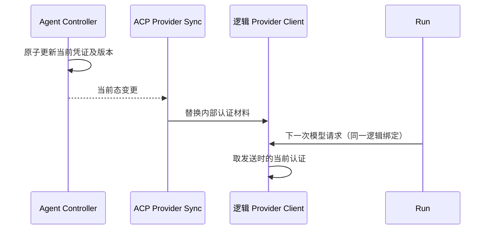
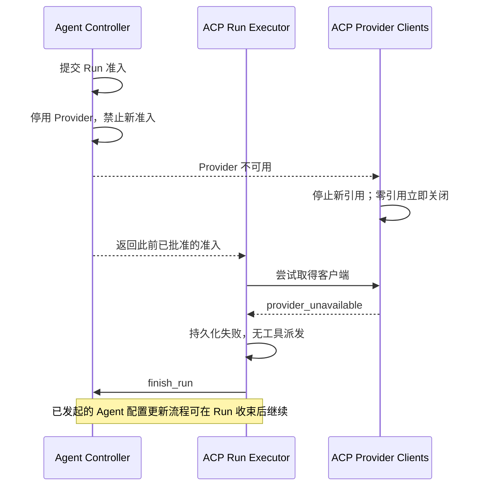

# Provider 客户端同步与优雅退役执行方案

> 日期：2026-09-14。
> 状态：已被替代的历史候选方案，不再作为实施依据。
> 2026-09-14 最新方案：[Controller 与 ACP 执行边界重构方案](controller-acp-execution-boundary-plan.md)。
> 新裁决为 Controller 同步状态/配置，Gateway 直接访问 ACP，ACP 本地准入并持久化执行审计。
> 下文保留讨论背景，其中 Controller RunAdmission、acquire/finish、反向同步、无 admission_id 补报等方案已撤回。
> 本文的“本次决定”“保留”“必须”等措辞均仅指历史候选，不是当前决策；新版文档是后续实施入口。
> 以下任务与验收项均未执行，不代表已经通过。
> 范围：Agent Controller、Agent ACP Service，以及共享合同和联调。
> 基于用户最新决定：Run 依赖逻辑 Provider 与模型，认证更新不属于 Run 配置变化。

## 1. 本次决定

1. Controller 是 Provider 连接、当前凭证、模型配置及 Run 准入的唯一权威。
2. ACP 启动加载执行所需的 Provider 配置，在内存管理客户端，持续同步后续修改。
3. Run 使用确定的逻辑 Provider 连接和本次模型参数，不绑定认证版本。
4. 同一 Run 的后续模型请求可以使用更新后的凭证；已发请求不因更新而重放。
5. Provider 停用禁止新准入；ACP 收到变更后停止新的客户端获取，仅等待已经持有客户端的执行。
6. 客户端由多个 Agent/模型共享，从实际取得引用到执行结束为本地引用周期，不以一次 HTTP 请求为周期。
7. 不再设计每次模型调用的 Controller 凭证校验 RPC、缓存版本握手或跨服务授权租约。
8. 凭证轮换、客户端回收与 Runtime 重建分离；不增加 Provider 专用 Temporal 工作流。
9. Controller 准入是执行许可，不是资源预留。获准后客户端缺失或退役时快速失败并收束 Run，
   不为了保证获准 Run 一定启动而增加跨服务准备、确认或保留阶段。
10. 进程崩溃后恢复持久化历史和服务能力，不承诺原 Run 自动续跑或最终成功。
    启动收尾不派发模型/工具；用户继续任务属于新的执行，需要重新准入。
11. 新进程从 Controller 加载当前启用配置，不恢复旧客户端、引用计数或历史认证。
    旧 Run 的结果收尾不能依赖旧凭证仍然存在；新凭证是否能访问原模型由实际请求决定。

本方案替代[原凭证与模型方案](provider-credentials-and-models.md)中 P3 尚未实施的
逐模型调用解析凭证方案。现有 Run API 仍描述旧生产者合同，必须在实施批次更新，
不能把本文当成当前接口已经支持的证明。

## 2. 已核实的代码基线

| 事实 | 源码依据 | 本次处理 |
| --- | --- | --- |
| Controller 准入已返回 Provider 绑定，不固定凭证版本 | [Run 合同](../contracts/agent-controller/run-api.md) | 保持非秘密快照，不把认证版本重新放回准入 |
| ACP 仍严格要求旧 credential_ref / credential_version | [Controller adapter](../services/agent-acp-service/src/adapters/controller/client.ts) | 同步 DTO、持久化解码和测试夹具 |
| ACP 共用一个 OpenAI-compatible adapter，不是每请求创建客户端 | [composition](../services/agent-acp-service/src/composition.ts) | 增加连接级客户端管理，不以预热 HTTP 连接为理由重写模型协议 |
| 当前 Run 只解析一次凭证，再传给 Loop 与 permission judge | [RunExecutor](../services/agent-acp-service/src/application/run-executor.ts) | 从执行链移除秘密参数，改为使用逻辑客户端 |
| 启动恢复会自动执行 admitting 记录，running 记录则按中断收尾 | [RunRecovery](../services/agent-acp-service/src/application/run-recovery.ts)、[启动入口](../services/agent-acp-service/src/composition.ts) | 目标改为仅做异常收尾，不自动继续旧任务；当前实现尚未修改 |
| Provider 尚无停用、恢复及退役接口 | [Provider 管理](../services/agent-controller/docs/provider-management.md) | 在 Controller 批次明确补齐内部停用/恢复语义 |
| Agent 重建/停用已有 Run drain | [重建](../services/agent-controller/internal/application/lifecycle_rebuild.go)、[停用](../services/agent-controller/internal/application/lifecycle_disable.go) | 复用已有业务流程，不把一个 Agent 的结束当成整个 Provider 无人使用 |

## 3. 领域边界

### 3.1 Controller

- 保存组织内 Provider 连接、加密认证材料和模型当前参数。
- 检查身份、Agent、模型与 Provider 是否允许新 Run 准入。
- 在事务内决定 Provider 停用和并发准入的先后顺序。
- 提供 Provider 执行配置当前态，不将 Agent 生命周期日志改造成凭证消息队列。
- 不管理 ACP 客户端引用，不因已准入 Run 尚未执行而保留或继续下发禁用凭证。
- 配置变更需要冻结/重建受影响 Agent 时复用既有生命周期流程，不等待 ACP 提供资源预留证明。
- 未来 OAuth 的刷新协调与 refresh token 仍由 Controller 持有；本次不实现 OAuth。

### 3.2 ACP Service

- Provider Registry：连接 ID 到本地逻辑客户端，核对组织与绑定关系。
- Provider Sync：单一、有序的配置更新来源，负责初始同步、重连及重新获取当前态。
- Model Transport：请求编码、流解析、认证注入；继续复用现有协议 adapter。
- Run 执行层：持有逻辑客户端、传入本次模型参数，执行结束后释放引用。

这是职责划分，不要求每项都建立多层 facade、接口或插件框架。领域层和 Loop 不应依赖
具体 SDK、数据库密文、认证 refresh token 或同步协议。

### 3.3 不修改的边界

- Console 继续维护 builtin 模型初始数据；不复制进 ACP。
- ACP v1/v2 对外协议、Runtime MCP、Egress 和 Runtime Controller 不因本需求改变。
- 不增加历史凭证表、模型历史表、ACP 凭证数据库或新的部署组件。
- 不引入第三方 Provider、Codex 登录、动态插件或通用凭证池。
- 不为开发阶段旧快照创建兼容层；生产者、消费者与夹具同批切换后使用空白测试数据库验收。
  当前人工验收实例不会在编写方案时被重置。

## 4. 配置与引用

逻辑 Provider 连接保持稳定身份，不能只按 `deepseek` 或模型名称作为客户端缓存键。
同组织可以有多个同厂商连接，不同组织也可能有同名模型。

| 信息 | 生命周期与使用方式 |
| --- | --- |
| connection_id / organization_id | 来自 Controller，标识归属与逻辑连接 |
| provider_key / request_protocol / endpoint | 创建具体协议适配器；当前连接 endpoint 不可变 |
| 当前认证材料与更新版本 | 仅由客户端层消费，后台更新，不进入 Run 配置比较 |
| Model 参数、能力、价格 | 来自 Run 准入快照，本次执行固定 |
| 实际使用的认证版本 | 可作为非秘密诊断标识，不是重建条件 |

优先复用 Controller 的凭证修订，不另外计算 secret hash。SDK 若将认证固化在实例内，
由逻辑客户端内部替换实例；调用者不因此获得版本对象。正在发送/读取的请求仍持有其
发送时的实例，完成后才释放底层资源。当前 fetch adapter 不需要人为增加专用连接池。

## 5. 内部合同

下列方法名为拟定名，在第一批以机器合同固定；不是已实现接口。

### 5.1 Provider 当前态同步

新增一个 `watch_provider_configurations` 内部合同：

- 首次或重新连接返回完整当前态；后续带上非秘密状态标识，有变化返回新快照。
- 无变化时有界等待；等待结束重新读取事实，不把没有收到通知当成未变化的证明。
- 快照为启用连接下发认证材料，禁用连接仅提供不可用状态；完整快照中消失的连接也视为
  不可新用。ACP 已持有的客户端自行完成本地优雅关闭，不要求 Controller 继续提供材料。
  空集合合法，部分响应或解析失败不能被解释为删除全部配置。
- 状态标识用于比较当前态，不承诺可重放历史事件；完整读取需具有一致的数据库视图，
  不能用普通分页拼出混合版本快照。响应边界由合同明确，不能静默截断。
- 先订阅再读取；提交通知只负责唤醒。仅由 Controller 访问自己的 PostgreSQL。
- 使用 Provider 专属变更提示；Run 结束不触发 Provider 同步，也不扫描准入表推导客户端状态。
- ACP 只有一个同步写入入口；强制重新同步也通过它合并处理。重连后丢弃旧请求响应，
  不允许旧快照覆盖更新后的认证或重新创建已退役客户端。

本期采用完整快照、同一时刻一个有效同步请求、客户端请求世代校验。状态标识可以是
规范化非秘密配置及启用状态的摘要，不要求额外持久化全局递增事件序列。连接自身的管理
CAS 和认证修订继续保留。未来若改为并发增量更新，需重新设计排序合同，不能沿用这一假设。

后台异步同步不承诺管理接口返回瞬间所有 ACP 都已切换。同步生效后发起的新模型请求
使用新认证；不为这个最终一致性边界添加逐请求权威校验。
同样，ACP 以本地应用停用通知的时点拒绝新的客户端获取；通知未到达时不能承诺已经生效。
Controller 提交停用后拒绝新准入，但此前已批准的请求可能已取得引用，也可能快速失败。

### 5.2 Provider 停用与恢复

在现有管理合同增加 `set_provider_enabled`，包含组织、连接、期望管理版本和幂等请求 ID。
停用禁止新准入，已有准入不被改写，但不保证仍能取得客户端。恢复重新开放新准入，
凭证和协议仍须受支持。ACP 未完成新配置同步时允许请求快速失败，不阻塞管理命令等待同步。
管理并发版本用于配置 CAS，不进入 Run 模型参数；不能复用旧认证版本来排序所有管理行为。

本次先保留禁用记录，不增加物理删除及审计保留期流程。未来删除沿用 ACP 本地优雅关闭，
不等待 Controller 已批准但尚未执行的 Run；不得级联删除历史 Run 中的非秘密执行快照。

### 5.3 Run 合同

- 保留 Controller 准入和结束报告；前者授权逻辑连接并冻结模型参数，但不预留客户端；
  后者收束 Run 和 Agent 占用，不承担客户端回收许可的职责。
- ACP 消费新的 `execution_spec.provider`，删除旧认证版本必填及版本一致性检查。
- 不在 `acquire_run` 响应或 ACP 持久化记录中加入 secret。
- 客户端必须使用 Controller 认可的 Provider 绑定，不能让外部 ACP 客户端提交任意连接 ID。
- 旧 `resolve_credential` 在 ACP 消费迁移完成后清理，不长期保留新旧两条调用链。

此前将“移除凭证 RPC 后终态准入可能重新执行”列为必修 P1，证据不足，撤回该定级及
由此推导的终态回放 DTO 必做项。现有正常顺序是先持久化 running 再执行、先持久化
本地终态再通知 Controller；完成通知丢回执只会补报，不会回到 admitting。尚未证明
普通进程崩溃会产生“ACP 仍 admitting、Controller 已终态”的组合，不为独立数据库回滚
等假设另造恢复协议。已完成结果不得改写或重跑的约束保留，由真实收尾路径测试支撑。

本次明确需要改变的是启动时自动执行 admitting 记录的产品语义，见 §6.5。普通请求内
按 request ID 做幂等处理仍然有意义，但不代表服务重启后必须继续原任务，也不代表
Controller 许可为旧请求保留客户端。

## 6. 生命周期与竞态

### 6.1 认证轮换



凭证更新不修改 Run、模型参数、模板、Agent revision 或 Runtime。
API Key 已在供应商侧被撤销时，已有 Run 仍可能失败；系统不能保证失效的 Key 可继续使用，
也不能未经判断自动重发具有未知执行结果的模型请求。

### 6.2 优雅退役

Controller 只提供 Provider 配置及可用状态。客户端的可用、关闭中、已关闭是 ACP 的
本地资源状态，不是需要同步到 Controller 的业务状态，也不保存在数据库中。

```text
ACP 应用 Provider 停用/移除通知
  -> 从可获取客户端集合中移除
  -> 没有本地引用：立即关闭
  -> 已有本地引用：已有执行继续，最后一个引用释放后关闭
```

Controller 已准入但 ACP 尚未取得客户端的窗口允许失败，这是明确接受的正常结果，
不是必须通过一致性协调消除的缺陷。ACP 的本地取得引用与应用停用操作按确定顺序执行：
先取得引用则参与优雅关闭；先停用则拒绝取得新引用，即使底层对象因其他 Run 使用而仍存在。
Controller 不查询准入表来决定保留材料，不发布 retiring/retired 投影，不等待客户端释放。

本地 `tryAcquire` 的状态检查与引用递增不可跨 `await`；`stopAccepting` 先封闭获取入口，
再进行异步关闭。释放闭包绑定原实例，不按 connection ID 去递减当时的 Map 当前值。
异步关闭完成时，仅在 Map 中仍是原对象才删除，避免误删停用后恢复的新客户端。

恢复启用时，若同一逻辑客户端仍在等待现有引用、尚未开始底层关闭，则更新认证并重新
开放获取，既有 Run 的后续请求也使用新认证；若已开始关闭则不复活，创建新客户端。
每个已经发出的请求继续使用发送时材料。停用期间 Controller 不再下发材料，旧持有者
不保证收到期间的认证轮换，这属于优雅关闭的限制，不能宣称所有 drain 请求永远最新。

取得客户端失败须在上下文准备、模型和工具调用之前返回可识别的 `provider_unavailable`
执行错误（最终错误码由合同批次固定），持久化 Run 失败并完成 `finish_run`。没有派发工具
时 `tool_effect_state=none`；若请求已被用户取消，则按既有取消语义收尾，不伪造成 Provider 失败。
不能因为已获准而静默重建旧客户端、绕回凭证解析接口、等待自动恢复或改用另一个 Provider。

正常结束顺序为：停止模型/工具派发，等待执行真正结束，释放本地客户端引用，再报告
`finish_run`；已有 ACP 本地终态持久化仍在 Controller 报告之前。取消信号到达不等于
执行已结束；不得提前释放仍被请求使用的实例。

当前 `withWorkerOwnership` 使用 `Promise.race`。外层等待因失去所有权返回时，底层任务
可能尚未结束。客户端引用必须绑定真实执行 Promise，而非 race 包装的生命周期。
实现中先把实际运行及资源释放封装成一个有边界的阶段，再保留现有 `execute()` 外层的
终态持久化和 Controller 收尾；不把 public execute 返回后才释放作为实现要求。
不能用一个外层 `finally` 掩盖未 settle 的任务。若底层不响应取消，保持引用并由现有
停服/进程退出规则收束，不伪造静止，也不声称能保证有界时间释放。

释放引用与关闭失败不能覆盖已经获得的 Run 终态和工具效果。尤其不能让 `finally` 中
抛出的关闭错误被通用准备异常路径改写成 `tool_effect_state=none`。资源所有者单独记录
关闭错误并承担清理，原结果仍正常持久化和报告；不能跳过 finish，也不做无界关闭重试。

本地执行已经结束，即使 `finish_run` 回执尚未成功，或未知工具效果仍保留协调占用，
客户端也可以在没有本地引用后关闭。Controller 占用由既有收尾/恢复流程处理，与客户端
回收互不作为前置条件。终态准入的幂等响应不是新的执行授权，ACP 不得重复启动同一 Run。



### 6.3 Agent 重建与多 Agent 共享

- Provider 回收不等待某一个 Agent 再次可用，重建失败也不能使已无人使用的客户端泄漏。
- 一个 Agent 结束不代表整个客户端无人使用；只统计 ACP 已实际取得的 Run 引用，
  不统计闲置 Session、模板引用或 Controller 已批准但尚未取得客户端的请求。
- Provider 停用不意味着系统可以猜一个替代模型。未提供替代配置时相关新准入明确不可用。
- 配置变更由 Controller 管理受影响 Agent 的冻结和重建；已有 Run 正常结束或快速失败后，
  既有 drain 即可继续推进。实际冻结新准入可以先于旧 Run 收尾，不必等待失败才阻止新请求。
- 重建使用明确的有效模板/模型，不因任意一次模型请求失败就自动重建或无限重试。
  Provider 删除后没有替代配置时，Agent 应保持不可用并说明原因，不能假装重建必定成功。
- 自动选择替代模型、批量修改模板的产品策略和 Console 页面增强不由 ACP 客户端管理实现。

当前源码并没有 Provider 管理命令自动调用 Agent 重建的入口。已有 `RebuildAgent` 需要
明确的目标模板及修订。因此本批首先证明：已经显式发起的生命周期操作不会被快速失败
Run 留下的占用阻塞。若要宣称 Provider 停用自动冻结/重建，还必须在 Controller 批次
明确实现其触发与目标配置选择，不得把本地客户端回收测试当成这个业务流程已经闭环。

### 6.4 启动、断线与取消

- 首次同步完成前不开放模型执行；没有任何 Provider 是合法的初始化结果。
- 同步断开时已持有客户端的执行可使用已有有效材料，不因为监听断线立即销毁客户端。
- 通知尚未到达或同步断线时，本地仍可用客户端也可能被此前已获准的 Run 获取；这不等于
  绕过新准入检查。不承诺远端停用提交瞬间本地立即失效，不为此增加等待或逐调用复核。
- 新 Run 仍需 Controller 准入；执行时客户端缺失、已停止新用或尚未同步完成，快速失败并
  收束准入，不在 Run 中等待重新同步。同步器独立恢复，用户在配置生效或重建完成后重试。
- 不增加任意的 Key 有效期；未来有明确到期时间的 OAuth 材料不能因缓存而被当成永不过期。
- ACP 重启按 §6.5 做异常收尾，不自动执行旧 admitting 记录，不恢复执行中 Loop/Tool。
  首次同步只创建当前启用的客户端；为收尾旧 Run 不读取历史秘密、不重新开启禁用连接。
- 服务正常退出和启动中途失败均要停止同步、使在途快照失效，再清理所持客户端；Registry
  覆盖可获取和正在关闭的实例。服务关闭后迟到响应不能重新插入资源。
- 快照同步允许停用后快速恢复被合并，只应用读到的当前态；它不是每次启停操作必达的事件流。
- 身份撤销、用户取消、Run deadline 和 Worker 所有权检查与 Provider 优雅停用不同。
  不能因移除凭证 RPC 而静默移除其既有职责，也不借此新增即时强杀的产品承诺。

已核对的身份联动目前是 Identity 事件进入 Controller，再调度 Agent 停用；并非每个模型
请求都有身份撤销通知。原凭证接口还附带一次开始阶段的身份检查。本次合同需显式规定：
新准入的身份授权仍由 Controller 完成，已准入正常执行依照现有 Agent 停用 drain 收束；
用户取消和审批时的 access 复核继续保留。不能宣称“移除该 RPC 后所有检查时点完全不变”，
也不在本批另造一套实时身份撤销总线。PCL-0 和 PCL-T14 必须把这些行为逐项映射。

### 6.5 进程崩溃后的异常收尾

“恢复历史”“恢复服务可用”“恢复原任务执行”不是同一个承诺。本期只实现前两者所需
的收尾与新请求入口，不实现崩溃现场恢复、未知副作用自动重放或原 Run 必达。
依赖服务和数据库仍不可用时不能承诺立即收尾成功；结果未知时不能强行解除 Agent 占用。

| 遗留事实 | 目标行为 | 是否依赖 Provider 凭证 |
| --- | --- | --- |
| admitting，尚未派发模型/工具 | 不自动开始执行；结束本地待执行意图，并确认、收束可能已提交的 Controller 准入 | 否 |
| running，原执行进程已消失 | 记录中断及已知工具效果；不续跑、不从头重放 | 否 |
| 已保存终态，Controller 完成回执未确认 | 仅补报相同终态；不改成认证失败或新的执行失败 | 否 |
| 用户查看旧会话或主动继续任务 | 查看持久化历史；继续则创建新 Run、重新准入并获取当前客户端 | 新执行需要，读取历史不需要 |

当前 admitting 收尾尚有合同缺口：本地可能没有 admission ID，现有 `acquire_run` 在
记录不存在时会创建新准入，不能把它当作无副作用查询直接保留。PCL-0 必须明确如何按
原 request ID 确认和收束已存在准入，并覆盖旧请求仍在途的竞态；不能只删 execute 调用
而泄漏占用，也不能为清理旧任务新增一次执行许可。选用最小的请求级收尾合同，不新增
客户端预留、凭证租约、全局工作流或任意 Run 的断点续跑。这是已知实施待办，不是已经闭环。

ACP 退出不证明远端 Runtime 命令已停止。未确认的工具效果保持 unknown，沿用现有
Runtime 停止/重建的收束边界；不能因为模型客户端已消失而写入 tool_effect_state=none，
也不能把它当作清理所有跨轮次后台进程的授权。

优雅关闭只保护仍存活进程中实际持有引用的执行。进程崩溃后内存对象已经消失，不为旧
引用恢复客户端或旧 Key；这与活进程内“停止新用、等待已有引用释放”是两个不同场景。

### 6.6 重启期间凭证变化

新进程同步 Controller 当前配置。模型参数和 Provider 逻辑绑定可以作为历史事实保留，
认证版本不是继续会话的前置条件。客户端构建成功只表示本地配置可用，不证明供应商接受
当前凭证；不为确认这一点在启动时调用真实模型。

| 当前权威配置 | 新请求行为 |
| --- | --- |
| 同一连接 Key 从 K1 轮换到 K2 | 用 K2 创建客户端；旧 Run 收尾不比较 K1/K2；用户新执行用 K2 |
| Key 删除或 Provider 禁用/移除 | 不还原旧客户端；新准入被拒绝，或此前已获准请求在本地快速失败 |
| Key 存在但供应商已撤销、额度不足或不具备模型权限 | 报告实际认证/权限/配额错误，不偷偷回退 K1 或改用其他组织连接 |
| 未来 OAuth access token 到期 | 由认证所有者按刷新能力处理；不可刷新则明确需要重新认证，不承诺原执行继续 |

更换凭证不一定只是换一串字符串，也可能更换供应商账号/项目。历史 response ID、文件 ID
等远端资源可能不再可访问；这不要求保留旧凭证，只要求如实报告。当前 DeepSeek 无状态
请求路径不因此增加远端会话迁移、历史账号保留或多凭证池。

## 7. 分服务交付计划

所有任务默认未完成，每一批先补行为测试，再实现。上一服务通过本地门禁后才进入下一服务。

| 顺序 | 批次 | 交付内容 | 出口条件 |
| --- | --- | --- | --- |
| 1 | PCL-0 合同与场景 | 固定同步 DTO、准入不保留资源、本地优雅关闭、停用/恢复 CAS、身份与快速失败语义；明确 §6.5 请求级异常收尾合同 | 人工确认；不得以自动执行或重新创建准入完成启动收尾；生产者/消费者待办明确 |
| 2 | PCL-1 Controller | 当前态读取/通知；停用阻断新准入；恢复；补齐 PCL-0 确定的最小异常收尾能力；核对 Agent 生命周期，明确自动触发尚缺；暂保留旧凭证接口供下一批清理 | Go 单元、HTTP 合同、自有 Postgres 集成测试通过；客户端回收不查询/等待准入记录 |
| 3 | PCL-2 ACP Service | 新 DTO/快照解码；同步器与 Registry；认证内聚；本地引用；Loop/judge 同一入口；v1/v2 错误映射；启动仅收尾不执行；启动/退出清理 | TypeScript 静态检查、单元/组件/合同及自有 Postgres 测试通过；重启不恢复旧认证或旧 Run |
| 4 | PCL-3 Controller 清理 | 在新消费者通过后移除旧凭证解析端点/只服务旧端点的 DTO 和辅助代码，更新共享合同 | 无旧消费者引用；Controller 门禁与合同通过，不留永久兼容分支 |
| 5 | PCL-4 联调与人工验收 | 更新脚本/部署说明，构建两服务；真实协议与模拟 Provider 回归，再做授权的真实 DeepSeek 验收 | 完整业务 Trace、数据库事实与回归断言一致；每个场景等待用户查验 |

基础事实仍由各服务的自有数据库管理。通知实现可以需要 Controller 自有 schema 的迁移，
但不引入新业务库、历史凭证表或跨服务 SQL。Provider 管理 CAS 如需独立计数，仅增加单一
配置更新计数，不保存第二套配置历史。新增字段及索引必须由对应并发用例说明必要性。

## 8. 正确性清单

- [ ] PCL-T01：新 Controller 响应可被 ACP 消费，旧认证字段不再必填；秘密不进入 Run JSONB。
- [ ] PCL-T02：启动空目录、多个组织/多个同厂商连接；一个连接多个模型不重复建立客户端。
- [ ] PCL-T03：运行中的凭证轮换影响后续模型调用；在途请求不取消、不重放；模型参数与价格不变。
- [ ] PCL-T04：普通模型调用和 permission judge 都使用逻辑客户端，没有遗留的 secret 参数旁路。
- [ ] PCL-T05：两个 Agent 同时使用一个连接，完成一个 Run 不回收另一个仍需使用的客户端。
- [ ] PCL-T06：Provider 停用与准入并发；允许已获准请求快速失败，只有 ACP 先取得引用的执行受优雅关闭保护。
- [ ] PCL-T07：准入提交后暂停响应，随后在 ACP 应用停用；恢复响应后精确得到 provider_unavailable，context/MCP 准备/模型/工具零调用；检查本地终态、真实 Controller 占用释放及 v1/v2 客户端可见失败。
- [ ] PCL-T08：本地引用归零即关闭停用客户端；分别注入 finish 未提交、已提交丢回执、本地标记写失败，恢复只补报原终态且无新增模型/工具调用；未知工具效果仍保留原协调占用。
- [ ] PCL-T09：工具等待期间客户端仍在；取消和 ownership race 提前返回后，底层请求未真正结束前不提前释放；每个底层实例最终 close 至多一次。
- [ ] PCL-T10：停用后恢复、旧同步响应迟到、重连全量同步，不覆盖新认证，不产生重复客户端泄漏。
- [ ] PCL-T11：首次同步/通知间隙、通知丢失、监听重连、有界超时都能重新读取权威当前态。
- [ ] PCL-T12：新增连接已被准入但客户端尚未同步，快速失败且保持终态；同步后只有用户新 runId/requestId 请求可执行，不自动复活旧 Run。
- [ ] PCL-T13：ACP 重启与停服清理；所有启动收尾分支均零模型/工具调用，不恢复 Loop 或以真实请求作预热；远端工具结果未知时不伪造 none 或解除占用。
- [ ] PCL-T14：组织、身份、Agent、Session 选择与取消权限仍按现有要求验证，不用全量凭证缓存授权。
- [ ] PCL-T15：模型编辑、Key 轮换不触发 Runtime 重建；显式使用新模板重建仍等待已有 Run。
- [ ] PCL-T16：Trace 正文开关、错误标记、版本诊断和同步断开可见；未开启采集时不序列化秘密。
- [ ] PCL-T17：显式发起 Agent 冻结/重建后，失败 Run 在真实 Controller 中释放准入，既有 drain 继续；不以 finish mock 代替，不声称 Provider 自动触发已实现；目标无效时不循环重建。
- [ ] PCL-T18：admitting 遗留分别覆盖 Controller 未提交、已提交但本地无 ID、旧准入请求仍在途；重启不继续任务、不重新创建执行许可、不泄漏占用；§6.5 合同确定后补齐真实双服务断言。
- [ ] PCL-T19：已有 settled/unknown 工具效果后注入客户端关闭失败，原终态、效果与 finish 参数不变，独立关闭错误可观测。
- [ ] PCL-T20：旧客户端异步关闭期间启用新客户端，迟到的旧 close 回调不删除新实例；尚未关闭的持有者在恢复并轮换后采用明确的认证更新规则。
- [ ] PCL-T21：正常停服及启动失败时暂停同步响应，清理后交付迟到快照也不重建客户端；关闭不遗留同步任务。
- [ ] PCL-T22：退出 ACP 后将 K1 更新为 K2，重启仅加载 K2；旧 Run 收尾不解析凭证，新 Run 使用 K2；模拟供应商确认未发送 K1。
- [ ] PCL-T23：退出期间停用/移除连接，或将 Key 更新为无效值；旧终态补报独立成功，新执行明确不可用/认证失败，不回退历史 Key；查看历史不依赖 Provider 可用。

测试优先使用可暂停的假 Provider、确定性的屏障和假时钟，不靠真实网络 sleep 猜测竞态。
跨服务测试使用真实 Controller/ACP 与各自的私有数据库，可共享一个测试 Postgres 实例。
真实 DeepSeek 只用于最终模型调用烟测，不用反复修改真实 Key 来模拟并发和撤销。
T13/T18/T22/T23 必须包含实际进程中断和重新启动的组件场景；正常 shutdown 或手工构造
状态只能作为单元补充，不能替代崩溃路径证据。新进程读取当前认证也不等于存活进程已支持热更新。

## 9. 验收与可观测性

- 按仓库门禁串行执行 `make fmt-check`、`make lint`，以及受影响服务完整测试、合同和
  Postgres 集成测试；ACP 另覆盖 typecheck/build。适用的架构/文档检查一并执行。
- 子 Agent 只读审查；只有协调者运行验证、管理容器、读取凭证、提交代码。
- 除最终紧凑结果与可复用测试外，不新增过程证据堆积。超时结果不得作为通过。
- 沿用 HTTP/RPC、模型请求及数据库边界自动埋点；不让 Run 自己手工维护凭证同步 Span。
- 记录连接标识、非秘密版本、同步/退役结果与错误；常驻注册表不持有某个用户请求的 Trace
  context，实际模型调用使用当前 Run 上下文，避免不同 Run 串成同一条链路。
- 后台 watch 是独立维护流，不伪造为早先保存凭证请求的子 Span。用连接/配置标识关联诊断。
- 快速失败的原因必须到达客户端，而不只存在 Trace/数据库。现有 v1 返回执行 errorClass，
  v2 的 state_update 没有转发该原因，需在 ACP 批次按所用 SDK 支持的标准错误/通知方式补齐。
  不为此自行新增私有 ACP 字段；PCL-0 固定预期报文，协议测试核对错误而不只检查 stopped。
- 沿用现有正文规则：单次 RPC 按总开关采集，消息流仅元数据。全量采集开启时批量凭证可能
  进入 Jaeger，不声称已脱敏，不把原始秘密或 Trace 正文提交仓库。
- 最终场景为：启动同步后首次对话、运行中轮换、共享连接优雅停用、恢复使用、显式更换配置
  后新 Run。用户请求 Trace 以 Gateway 为起点，查询前等待 6 秒，检查父子关系与 warnings；
  每完成一个场景发送 Jaeger 地址，等待用户确认后继续。
- 新增 Provider 停用/恢复若尚无 Console/BFF 入口，本批使用内部 RPC 完成组件联调并单独
  标记证据范围，不伪造 Gateway 父 Span 或宣称管理 UI 已闭环；已有公开入口的对话、轮换
  和 Agent 重建仍必须从 Gateway 验证。

## 10. 工作量边界

这是两个服务的中等规模改造，不是重写 ACP、模型协议或 Agent 生命周期。
文件数包含 DTO、夹具和共享合同的连带更新，不能据此扩展为全仓库治理。
准确清单在 PCL-0 固定，按服务分别提交；所有门禁未通过前不提交“完成”状态。

静态估算：Controller 约 10-15 个生产文件，ACP 约 15-20 个生产文件；测试与夹具合计
约 35-50 个文件，另有共享合同、文档和联调脚本。去掉准入保留协议后，主要语义工作是
本地取得引用与关闭的顺序、快速失败后的 Run 收尾、
真实任务资源释放；多数测试连带修改来自旧认证字段。此前预计约 5-8 个开发人日量级，
尚未包含本次确认的 admitting 异常收尾合同调整；PCL-0 明确其最小边界后更新估算，
不能继续将原数字作为当前完整工作量。外部服务等待、人工验收排期及完整 Agent 批量迁移
UI 不包含其中，不作为时间保证。

## 11. 对抗性审查收口

上一版两名子 Agent 分别审查 Controller 准入/退役边界和 ACP 引用/同步生命周期，
均仅阅读源码与合同，已收回报告并关闭。用户随后明确否决“已准入必须获得客户端”保证；
本版据此简化后，又由两名独立只读审查员分别核对快速失败收尾和本地客户端/同步生命周期。
两者均附条件批准：不恢复资源保留，补齐下列实现约束和测试；报告已收回，审查员已关闭。
上述审查针对此前版本。用户随后否决原 Run 必恢复的前提，本轮由协调者重新核对源码并
修改计划；不得将前次附条件批准当成对本次异常收尾合同的复审。未执行测试或修改实现，
条件已写进任务不等于验收通过。当前裁决如下：

| 审查点 | 裁决 |
| --- | --- |
| 已准入但未持有客户端的窗口 | 接受快速失败；不保留材料、不扫描准入、不设计 retiring/retired 的 Controller 投影 |
| blocked_unknown_effect 是否持续保留模型客户端 | 客户端只看真实本地引用；工具效果、准入占用和回执重试均不决定资源回收 |
| 外层 Promise 返回是否可以释放 | 不可以；绑定真实任务 settle，ownership 竞态列为专门用例 |
| finish 是否必须搬到另一个公开组件 | 不需要；调整实际运行与资源释放的内层边界，保持本地终态先于 Controller 报告 |
| 同步必须新增全局持久递增序列吗 | 单路完整快照可用请求世代防迟到响应，不新增历史流；管理 CAS 和认证版本保留 |
| Provider 配置变更与 Agent 重建 | 由 Controller 配置/生命周期流程驱动；ACP 失败并收束即可，不为任意错误自动重建或选择替代模型 |
| 去掉凭证 RPC 是否完全不影响权限检查 | 不是；在合同中显式对齐准入授权、停用 drain、取消及审批复核，不隐瞒检查时点改变 |
| 旧凭证接口拒绝终态准入的防线 | 撤回未证明可达的 P1 及额外 DTO 必做项；正常完成补报由 T08 覆盖，不据此扩展协议 |
| 进程崩溃后是否保证原 Run 续跑 | 不保证；T13/T18 核对启动仅收尾，用户继续属于新执行，admitting 收尾合同仍待 PCL-0 明确 |
| 重启后是否恢复旧客户端与认证 | 不恢复；读取 Controller 当前态，收尾不依赖凭证，T22/T23 验证 |
| 客户端关闭失败是否改变 Run 结果 | 不改变；独立诊断，不覆盖 settled/unknown 或跳过 finish，T19 验证 |
| 停用再启用与迟到清理 | 本地无 await 地取得/封闭引用，对象身份校验防旧回调删除新实例，T20 验证 |
| 停服后迟到同步是否可以创建 client | 不可以；启动失败与正常退出共同覆盖，T21 验证 |
| 快速失败是否已对所有 ACP 客户端可见 | v1 已有错误映射，v2 原因映射待补，不能只看数据库或停止通知宣称闭环 |

本轮仅完成方案整理与静态审查，不执行上述测试、构建、部署或旧实例清理。

## 12. 参考项目的重启与凭证行为

核对日期：2026-09-14。Pi 为本地 HEAD `8479bd8`，Goose 为本地 HEAD `5e90925`；
OpenCode 为官方 `dev` 源码，不把开发分支当成某个已发布版本保证。以下为静态源码结论，
未对参考项目执行崩溃/凭证轮换实验，也不概括所有第三方插件行为。

| 项目 | 已核对路径 | 重启后凭证改变的含义 |
| --- | --- | --- |
| Pi | AuthStorage 构造时 reload；getApiKey 按 CLI override、auth.json、环境变量解析；OAuth 到期加锁刷新 | 新进程从当前认证来源取 Key；不是从会话恢复旧 Key。刷新失败可返回无可用认证，要求重新登录 |
| Goose | ACP load_session 重新获取/创建 Agent；OpenAI Provider 从当前 Config/秘密存储构造；Codex 从 token 文件加载并按有效期刷新 | 新实例使用当前来源；缺失或失效不承诺继续，Codex 刷新失败转重新认证；不是从旧会话寻找 credential revision |
| OpenCode | Auth.all 读取 OPENCODE_AUTH_CONTENT 或当前 auth.json；Provider 初始化读取环境、认证和配置，OAuth loader 由插件接入；SDK 依配置选取 | 新进程重新解析实际生效的认证与配置；会话模型选择与认证来源分离。不能把某个插件刷新策略泛化为整个系统的保证 |

源码入口：

- [Pi AuthStorage](../../references/pi/packages/coding-agent/src/core/auth-storage.ts)：constructor / getApiKey / refreshOAuthTokenWithLock。
- [Pi 会话加载](../../references/pi/packages/coding-agent/src/core/sdk.ts)：buildSessionContext 与当前 ModelRegistry 分离。
- [Goose ACP 会话加载](../../references/goose/crates/goose/src/acp/server/load_session.rs)：prepare_acp_session_agent。
- [Goose API Key 来源](../../references/goose/crates/goose/src/providers/openai_def.rs)：from_env；[配置优先级](../../references/goose/crates/goose/src/config/base.rs)：get_secrets。
- [Goose OAuth](../../references/goose/crates/goose/src/providers/chatgpt_codex.rs)：TokenCache / get_valid_token。
- [OpenCode Auth](https://github.com/anomalyco/opencode/blob/dev/packages/opencode/src/auth/index.ts)：all / get；[Provider 初始化](https://github.com/anomalyco/opencode/blob/dev/packages/opencode/src/provider/provider.ts)：认证加载与 SDK 配置。

“读取当前来源”不等于自动获取供应商最新 Key。Goose 的环境变量可以覆盖秘密存储，Pi
显式 CLI Key 优先，OpenCode 的 OPENCODE_AUTH_CONTENT 可以覆盖文件；若启动配置仍注入
旧值，重启仍可能用旧值。配置文件变化也不必然热更新仍存活的进程；本方案的 Controller
同步机制承担后者，不把参考项目的重启加载当成已有热更新证据。

共同可借鉴的是认证与历史分离，不是照搬各项目的多来源回退。Antnest 的唯一认证权威是
Controller：重启读当前态，缺失明确失败，旧执行只收尾，不为保证续跑保留历史秘密。
