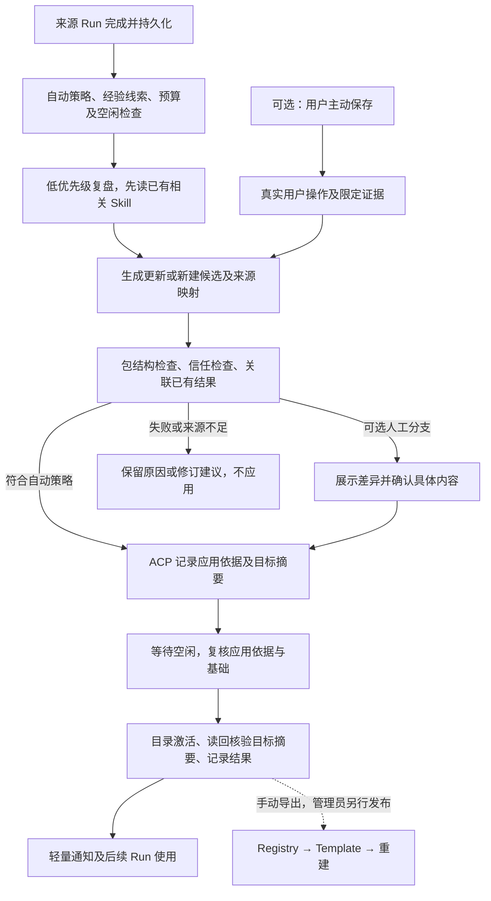

# Skill 驱动的经验学习与演进：技术方案草案

> 范围修正（2026-09-29）：首版只交付完成 Run 后自动复盘、生成/更新受管个人
> Skill、空闲激活、结果提示，以及后续 Run 使用。事后撤销、变更差异查看和旧版本
> 保留不是用户要求的首版能力。L0 首版合同与批次表已移除相关接口和验收条目；
> 已写入工作区的实验实现也不得作为当前开发或验收门禁。

> 后续传播设计（2026-10-01）：已生效的受管个人 Skill 自动登记到 Registry 的
> 动态来源目录，检索后按需回源临时使用，内容与生命周期仍归来源 Agent；
> 有发布权限的用户可提升为正式系统 Skill，此时才由 Registry 托管完整包，
> 再通过 Template/rebuild 交付。详见
> [四步流程](evolver-technical-analysis.md#112-用户确定的四步产品流程)。
> Registry/source 合同及 Registry D1 已交付，详见
> [本批记录](skill-discovery-registry-delivery-20261001.md)；ACP
> [D2 自动投影/真实来源](skill-discovery-acp-delivery-20261001.md)和
> [D3 模型搜索/正文加载](skill-discovery-tools-delivery-20261001.md)已通过门禁。
> [Runtime D4](skill-discovery-runtime-delivery-20261001.md) 的临时文件接口已通过
> 所属门禁；[ACP D4A](skill-discovery-temporary-consumer-delivery-20261001.md) 的
> 交付/回收及 [Console D6](skill-discovery-console-delivery-20261001.md) 提升入口
> 已通过所属门禁，[DI1](skill-propagation-integration-delivery-20261001.md) 四步
> 集成已通过，不改变本文个人学习验收范围。

> 更新日期：2026-09-30；依据用户意见将自动生成及自动更新调整为首版主流程。
> 开发顺序调整：沿用已有样式，优先完成功能与回归；样式细调在人类体验验收阶段进行，不再以样式审批阻塞开发回归。
>
> 状态：技术方案及 [L0 共享合同](../contracts/skill-learning/learning-api.md)；
> L0 已固定首版参数及边界；L1 Runtime 已开始入口隔离、公钥 bootstrap、
> 私有 HTTP 验签、`prepare`/`check` 候选包校验及 UID 1000 executor 目录发布已接入。
> `commit` 已通过 Actor 接入条件目录安装、后置摘要核验与同请求重放；`observe`
> 已通过 Docker HTTP 验证重启后确认、缺记录保持未知及活动内容冲突。
> `cancel` 已关闭并结算当前代次、持久阻止其跨重启提交。首版不包含事后撤销或保留旧包。
> 后台 Bash 执行组及 managed MCP 后代进程已纳入准入扫描，空闲 managed MCP
> 本体不阻塞；签名 `release`、256 MiB 隐藏目录上限及释放后重试已通过
> Runtime Docker HTTP 验证。交换后未写回执、release 脱离/删除后未写回执的
> 恢复由独立执行器测试覆盖；L1、L1R 本地门禁已通过。L2 策略持久化与接口门禁已通过，显式纳入已有个人 Skill 不属于首版。L3 自动创建/更新、前景抢占、未知效果恢复与候选清理，以及 LI1 的模型故障恢复后新来源学习已有本地/隔离 Docker 证据；L4 来源跳转和按需诊断现已通过144项前端组件、5项基础浏览器与2项真实 Docker 浏览器回归。当前首版功能门禁已通过，可进入人类体验验收；完整范围及证据边界见 [验收核对](skill-learning-acceptance-audit-20260930.md)。

源码复核及本轮决策见 [Hermes 自动学习研究](hermes-skill-learning-research-20260929.md)。
此前逐项回应见 [评审处理记录](skill-design-review-20260927.md)；其中人工优先及
逐次确认的旧产品选择已被本轮替代，其余适用的工程边界继续保留。

## 1. 目标、首版范围与本轮决定

采用 **Skill 作为可复用策略与经验的载体**，参考 Hermes 的生成/维护方式，保留
Evolver 的“执行 → 复盘 → 检查 → 更新 → 再使用”闭环。Skill 正文描述适用场景、
步骤和注意事项；来源证据、应用依据与控制状态独立保存，不随每次 Skill 使用
全部进入模型上下文。

首版目标调整为：**完成任务后有条件自动复盘，生成或更新受管个人 Skill；检查
通过后按 Agent 的自动学习策略，在空闲且满足受管调用静止条件时自动激活，
核验实际摘要，并在生效后提示用户。正常路径不要求用户逐次发起或确认。**
用户主动保存是补充选择。自动维护不接管系统包或未纳入范围的用户个人包；
静止不表示所有常驻进程退出，定义见第 7.3 节。

| 评审问题               | L0 的设计输入                                                                                          |
| ---------------------- | ------------------------------------------------------------------------------------------------------ |
| 后台占用 Run/Runtime   | 独立维护任务，不占前景 Run；共享准入门，前景取消复盘后再准备 Run                                       |
| 外部指令固化           | 证据分级、逐项可追溯；低可信内容不能独立支撑自动规则，自动候选须通过范围及来源检查；保留语义误判的限制 |
| 活动引用不兼容 Runtime | 真实目录、同卷候选；更新整体原子交换，新建不覆盖地 rename，不用符号链接/指针文件                       |
| 验证无隔离环境         | 仅结构检查和来源 Run 已有结果；用户确认是可选人工路径的应用依据，不是业务验证；不执行新候选来“自证”    |
| Run 一致性与成本       | 空闲激活；记录实际读取的个人 Skill 内容身份，不逐 Run 哈希全部包                                       |
| 维护入口暴露给模型     | 独立受保护的 Runtime 维护端点，不进 tools/list；Runtime 拒绝普通 tools/call，ACP 来源校验作第二层      |
| 自动/人工发起依据      | 自动任务绑定真实完成 Run 和 Controller 策略修订；可选用户入口绑定真实操作 ID；模型不创造授权           |
| 无须逐次确认           | `apply_basis=policy` 绑定自动策略、目标范围及精确摘要；人工采用用 `user_action`，两者不可互相冒充      |
| 配置与发布归属         | Controller 拥有 Agent 学习配置；已交付首版正式发布需手动导出、管理员上传，自动投影与用户提升另行交付   |

[Skill Registry 最小方案](skill-registry-minimal-design.md)已交付托管、模板引用
和只读交付。学习在现有服务中独立实现，既不增加阶段四第四个服务，也不要求
Registry 在线。首版的集成完成标准是自动触发到自动生效；人工保存作为补充批次，
不能用只有候选展示或文件工具的实现宣称自动学习已完成。

## 2. 参考依据及边界

下述参考是静态源码研究，不是本平台已实现或上游效果已实测的证明。Hermes
已在 2026-09-29 重新固定源码，核对方式及采用/调整说明见
[本轮研究](hermes-skill-learning-research-20260929.md)。不直接嵌入 Evolver 引擎、
GEP 资产选择器或 Hub 协议。

| 参考                                                | 采用的思路                                                      | 保留的区别                                                  |
| --------------------------------------------------- | --------------------------------------------------------------- | ----------------------------------------------------------- |
| Hermes，`1b91b8eaa576b3c3dfe08e4592bdd698d1aca019`  | 有条件自动生成/更新、受管归属、先读后改、优先已有主题、事后通知 | 独立 ACP 任务、Runtime 单槽准入、策略应用记录及系统只读边界 |
| Evolver，`31b0691acd97ba18878019312e646f1f2d970d43` | 策略、案例、失败反馈、验证与过程记录分工                        | 知识以 Skill 为主，不重复维护 Gene/Capsule 正文权威         |

Hermes 的后台复盘会实际写入受管 Skill，再发布结果摘要，并不逐次等待用户
批准；Curator 模型合并是另一功能，其默认关闭不能被解释为自动生成默认关闭。
参见 [触发](https://github.com/NousResearch/hermes-agent/blob/1b91b8eaa576b3c3dfe08e4592bdd698d1aca019/agent/turn_finalizer.py#L734-L764)、
[复盘](https://github.com/NousResearch/hermes-agent/blob/1b91b8eaa576b3c3dfe08e4592bdd698d1aca019/agent/background_review.py)、
[写入检查](https://github.com/NousResearch/hermes-agent/blob/1b91b8eaa576b3c3dfe08e4592bdd698d1aca019/tools/skill_manager_guards.py#L165-L244)、
[Curator 配置](https://github.com/NousResearch/hermes-agent/blob/1b91b8eaa576b3c3dfe08e4592bdd698d1aca019/agent/curator.py#L31-L35)。

Evolver 的资产和实现限制见 [独立分析](evolver-technical-analysis.md)。本文采用
可观察的概念分工，不依赖尚未完整审计的混淆核心算法。本轮没有重新运行或接入
这两个项目。

## 3. 知识、证据和控制记录分开

| 信息                                        | 保存位置与用途                                             |
| ------------------------------------------- | ---------------------------------------------------------- |
| Gene 的触发条件、前提、策略、反模式         | `SKILL.md` 的适用场景、步骤和注意事项                      |
| Capsule 中可推广的案例、失败机制            | 提炼后的正文及少量 `references/`、`templates/`、`scripts/` |
| 原始对话、工具输出、一次任务的轨迹          | 原有 Session/Run 记录；不整段复制到 Skill                  |
| 为什么变更、依据哪项策略/用户操作、应用结果 | ACP 维护任务/候选/变更记录，关联来源和前后摘要             |
| 结构检查、来源结果、未来独立验证            | 分类型证据记录，绑定具体内容和适用范围                     |

例如“超时后先查请求是否落地再重试”可以成为流程规则；当次请求 ID、日志全文
和凭据不能随规则进入共享包。普通事实、用户资料、短期任务状态仍按原上下文/
记忆职责处理，不因为引入学习就全部变成长流程 Skill。

文件在 Runtime 工作区，控制记录归 ACP；维护授权/预算配置归 Controller。工作区
文件不是可信审计存储，正文中的 `trusted`、`validated` 或自报来源不能提升权限。
检索索引是可重建派生数据，不成为第二份知识权威。

## 4. 资产格式、身份与模型可见范围

### 4.1 资产归属

本文统一称 Runtime `system` 来源为**系统 Skill**，`personal` 为**个人 Skill**。

| 资产                               | 修改方式                                                       |
| ---------------------------------- | -------------------------------------------------------------- |
| 模板交付的系统 Skill               | Registry 新版本 → 模板修订 → 显式重建；Runtime 只读            |
| 用户维护的个人 Skill               | 用户定向修改；不能仅因位于个人目录就允许后台维护               |
| 自动生成且登记受管身份的个人 Skill | 有效自动策略下可生成并自动应用后续更新；固定或人工改动后暂停   |
| 用户显式纳入维护的个人 Skill       | 首版不支持自动接管；后续如需支持，必须另行定义授权与完整包验证 |
| 候选包                             | 放在未被发现入口扫描的区域，不能自动成为普通 Run 的能力        |

包仍为 `SKILL.md` 加按需的 `references/`、`templates/`、`scripts/`、`assets/`。
较长背景放参考文件；优先更新主题，不按每次对话新增碎片。

自动创建权限来自 Controller 的 `auto_generated_personal` 范围，ACP 以创建意图
和已核验结果登记逐包来源。控制记录缺失的包按用户维护处理；路径前缀或
`created_by` 自报字段不授予后台权限。用户主动保存默认创建用户维护的个人包，
纳入持续自动维护是另外的明确选择。

### 4.2 候选从一开始使用可发布规则

候选结构检查**完整采用 Registry 第 3 节的包规则**：完整 `SKILL.md` ≤ 16 KiB，
包大小/路径/文件类型限制，frontmatter 无 BOM、精确分隔、单文档，以及 YAML AST
字符串类型检查，包括跨库数字拒绝并集、保守前缀/符号规则及禁止 merge key。
即使 Runtime 可以读取一个正文更长的文件，它也不能作为合规维护候选通过。
共享样例与包规则版本供 Registry、RC 和学习检查使用；不要求先有在线 Registry
才能运行本地校验。版本名明确如下，不能笼统记为“规范版本”或“规则版本”：

| 字段                    | 定义及归属                                                           | 记录方式                                                                          |
| ----------------------- | -------------------------------------------------------------------- | --------------------------------------------------------------------------------- |
| `package_rules_version` | 共享包准入规则及配套样例的版本；B0/L0 使用同一份规则，由共享合同登记 | 从 1 起的正整数；候选及每次结构检查记录所用版本，Registry/RC 校验记录同样保存     |
| `review_prompt_version` | ACP 内部复盘提示模板版本，标识提炼方法及其提示内容，不是包格式       | 从 1 起的正整数；ACP 保留不可变模板内容，任务创建时冻结；显式发起与后台建议都记录 |

两者均不是 Registry 集合的 `layout_version`，也不是 Skill 发布版本、Agent
配置修订或模型版本。任务同时记录包规则与提示版本，重试不静默改用新提示。
新包规则发布后，在当前规则下重新检查待应用候选，保留旧检查记录；不再合规
则阻止提交，需要修改字节时生成新候选并重新评估应用依据，不能沿用旧的通过
标记；人工确认分支仍须对新内容重新确认。

个人候选最初是目录，也须检查将来导出 ZIP 的 8 MiB 压缩上限；以受限的实际
打包/编码计数验证，不能由解包大小猜测。打包不执行脚本，产物及临时空间也计入
候选预算。导出的文件清单必须与应用记录绑定的候选一致。

托管时 ZIP 根只有包内容；个人活动目录使用 `name`。自动维护范围要求目录 basename
与 frontmatter `name` **完全相同**，固定到 `(organization, agent, personal, path)`
及维护授权修订，不能只依名称搜索后转移授权。新建前核对完整目录和 32 项容量，
不能仅用被截断的 Runtime 摘要推断没有重名。

用户改名、移动目录、修改 name 或改变内容基础时，原授权暂停，未应用候选变成
冲突/失效；用户明确重新纳入范围、读取新基础并重新评估后才能恢复。旧个人包不合规时
仍可按当前 Runtime 规则使用，但需要用户整理后才进入维护范围，不静默截断。

### 4.3 学习方法不是普通系统 Skill

复盘方法采用 ACP 内部、版本化的提示模板，只在维护上下文使用，不作为普通系统
Skill 出现在每个前景 Run 的摘要里。提示负责提炼方法，程序负责权限、预算、工具
范围和应用依据；提示不能授予发布权或改变系统只读边界。

L0 选择**独立的 Runtime 内部 HTTP 维护端点**，固定路径为
`POST /internal/skill-maintenance/{action}`，动作限定为候选准备、检查、提交、
观察、取消和清理；它不是 MCP Tool，不加入 `tools/list`、Runtime information 或模型
可调用定义。Runtime 的模型内置工具仍只有 `read/write/edit/bash`，现有 managed
MCP 工具继续按真实目录发现。[工具边界](runtime-context-and-managed-mcp.md)。

防护分为两层，不能只依赖 ACP 过滤：

1. Runtime 在普通 `tools/call` 上拒绝维护保留名称/别名，不为它们建立工具绑定；
   managed MCP 目录也不得注册保留名称。即使 ACP 漏过滤、模型猜名或重放历史
   调用，也无法从 Tool 通道提交。独立端点先验证维护凭据及 execution binding，
   再进入同一 Execution Actor，由降权 UID/GID 1000 的 executor 操作文件。
2. ACP 内部维护适配器只接受程序建立的维护上下文，模型 Tool dispatcher 没有
   转发到此端点的路由。调用来源不从参数、名称或 `role=maintenance` 文本取得；
   对意外出现在目录中的保留定义另行拒绝并报合同错误，作为第二层防护。

维护凭据采用 ACP 服务端签发、Runtime 校验的受限请求凭据，绑定 Agent、当前
`execution_id`、维护任务/世代、动作、请求及候选/参数摘要；重复请求只能恢复同一
效果，取消后的世代和旧 execution_id 不可续写。ACP 私钥留在 ACP，RC 通过受控
Runtime bootstrap 提供带 `kid` 的验证公钥集合；不把签发凭据交给模型、普通工具、
工作区或子进程。
当前 `X-Antnest-Expected-Execution-ID` 只是身份一致性字段，不能充当认证凭据。
凭据字段、下节的轮换/撤销边界、重放和取消观察已在 L0 冻结，L1 Runtime、L1R RC 与 L3 ACP
分别交付；端点未配置有效验证身份时保持关闭。此增量不改变普通 MCP 当前的内网
信任模式，也不使维护端点成为浏览器或前景脚本的授权入口。

L0 同步登记独立控制通道与保留名称规则；`tools/list` 仍是**模型工具**定义的唯一
权威，不再提出“真实目录先混入维护能力，再依赖过滤”的方案。

普通 `write/edit/bash` 仍允许用户按既有权限编辑个人目录。这类编辑属于人工/
前景变更，会使维护基础失效，不能冒充按策略完成的学习提交。上述入口隔离不声称把用户
可写工作区变成防篡改存储；可信应用依据与提交结果只来自 ACP 控制记录，不能由包内
文件或普通工具输出制造。

### 4.4 公钥集合、部署身份与轮换

现有 Runtime 从 `ANTNEST_RUNTIME_SPEC` 环境变量一次性加载 bootstrap；Docker
创建请求（包括环境变量）计入部署摘要，RC 恢复操作时会重算并比较。
[Runtime 配置](../runtimes/antnest-runtime/src/config.rs)、
[部署摘要](../services/runtime-controller/internal/platform/docker/driver.go)、
[操作恢复](../services/runtime-controller/internal/control/service.go)。因此首版明确
采用**不可变 bootstrap 公钥集合＋显式重建换集合**，不假设 Runtime 能热更新信任。

| 项目         | L0 固定的设计输入                                                                                                                                                          |
| ------------ | -------------------------------------------------------------------------------------------------------------------------------------------------------------------------- |
| 公钥身份     | 每把钥匙有不可复用的 `kid`，绑定算法与公钥字节；凭据携带 `kid`，Runtime 只在本地受信集合中匹配，不按请求提供的 URL 下载公钥                                                |
| 集合上限     | 启用维护时最多两把，即当前签发钥匙与预置的下一把；空集合表示维护关闭。重复 kid、同 kid 换字节及不支持的算法均拒绝配置，未知 kid 拒绝请求                                   |
| 当前签发选择 | ACP 的受保护配置指定唯一签发 `kid`。Runtime 的集合只有受信键，不靠可变的“当前”角色判定；在已预置的两把之间切换签发不修改部署摘要                                           |
| 部署身份     | 规范化排序的完整公钥集合及启用状态写入 RuntimeSpec，**计入 deployment/spec digest**。集合内容摘要只标识该信任集合，不是 layout_version 或包规则版本                        |
| 配置所有权   | ACP 管签发私钥；RC 管平台 bootstrap 公钥配置及逐操作快照。它们不归用户 Agent 学习配置，也不把公钥配置版本塞入 Controller 请求摘要来追随全局换钥                            |
| 已受理操作   | RC 在计算候选部署摘要时取得集合快照，与 BeginTransition 的操作受理原子持久化；请求重放、重启恢复、BeginTransition 并发重放均使用已存快照重建部署，不能重新读取当前 RC 配置 |

私有操作记录须保存公钥字节及其身份，只有一个配置修订号且旧配置不可找回不够。
新的全局配置只作用于之后新受理的创建/重建/Enable；已受理请求的输入摘要、
公钥快照和部署摘要不得回写。快照丢失或校验失败时明确阻止恢复并报告原因，
不能用最新公钥凑出目标，也不能跳过 `ErrRequestConflict` 检查。L1R 已加入
这些字段和恢复逻辑；更换受信集合会改变实际部署身份，
但不自动改动 Skill、模板或 Agent 的业务配置。

正常轮换流程：

1. RC 为新目标预置 `{K_current, K_next}`；运维核对运行中 Runtime **及未结操作的
   冻结目标**所持集合。现有 Runtime 不会因 RC 配置改动自动获得新钥匙；缺少
   K_next 的实例先在维护窗口显式重建，或暂停该 Agent 的学习维护。
2. 已确认目标信任 K_next 后，ACP 才切换签发 `kid`。不支持该 kid 的目标拒绝
   维护请求并保留候选，普通 Run 不因换钥被阻塞；不以试签、自动降级或忽略验签
   兜底。仍在恢复的旧快照必须纳入切换清单，不能在稍后完成时带回未准备实例。
3. RC 配置更新为 `{K_next, K_future}`，逐个显式重建/后续受控 Enable，核验新的
   执行绑定与集合后才恢复维护。已受理操作先按原快照结算，再用新请求更新；
   仅切换 ACP 签发并不撤销运行中 Runtime 对 K_current 的信任。首版不承诺在线
   即时撤销，删除旧受信键须完成这轮重建。

私钥泄露时先关闭学习新准入/签发并结算在途维护；**停 ACP 签发不等于撤销泄露
密钥**。必须隔离受影响 Runtime 的维护入口；若现有部署无法可靠阻断所有入口
（包括 Runtime 内普通进程的直连），则由 Controller 停用受影响 Runtime 并确认
执行停止，接受该 Agent 前景中断，不能只封外部网络后宣称已撤销。在隔离/维护
窗口内，清点运行实例、disabled 配置及在途目标，换新密钥并重建为不含泄露 kid
的集合；按事实恢复/结算旧操作，不能改写冻结快照绕过摘要冲突，也不能重开带
旧钥匙的目标。新 `execution_id` 与新信任集合核验通过后才开放维护。

RC 公钥快照/部署记录和 ACP 受保护私钥配置需纳入各自备份及恢复清单，不把私钥
写入 RuntimeSpec、业务日志或仓库。恢复旧备份时先核对撤销记录；不能重新启用
已泄露钥匙或带有该钥匙的旧目标。轮换、配置修改时的在途恢复、空集合/未知 kid、
泄露隔离及恢复限制分别纳入 L1/L1R/L3 本地门禁和 LI1 集成。L1R 已验证
配置、受理冻结、数据库重放和部署摘要。L3/LI1 的人工泄露处置路径已在
`make e2e-skill-learning-key-compromise` 通过：ACP 清除签发配置后，旧钥对原
Runtime 仍有效；Controller 停用后 Runtime 确实停止且原地址不可达。RC 数据库
以受保护 archive 备份、恢复到未接入服务的隔离数据库，冻结公钥集合与部署摘要
逐项一致，含泄露 kid 的恢复目标继续保持离线；新请求 Enable 使用安全配置，
新的 Runtime 拒绝旧钥、接受新钥，原 Session 的后续 Run 仍读取已学规则。
本例没有在途生命周期操作，不证明其泄露恢复场景，也不提供自动撤销/启动拦截
能力；恢复操作者仍须按本节清点和结算未结目标。私有证据为
`artifacts/verification/skill-learning/antnest-lifecycle-706dabfe.json`；archive
目录 0700、文件 0600，校验摘要随证据保存，测试容器已清理。
Runtime 的一次性 Docker HTTP 用例已在同一启动信任集合内
分别用下一把与当前钥匙签名重放同一 `prepare` 请求，并验证未知 `kid` 被拒；
同一 Runtime 门禁在保留工作区卷的条件下只带下一把公钥重建实例，旧钥匙对新请求
返回 401，下一把仍可成功准备。此项只证明 Runtime 本地信任移除，不代替 RC/ACP
协调的泄露隔离与旧备份恢复演练。
一次性全栈用例再用首把钥匙创建 Skill，仅重建 ACP 并切换下一把签发钥匙，
核对 Runtime 容器身份未变、更新 Skill 成功且后续 Run 读取更新内容；再将 RC
配置改为只信任下一把钥匙，显式重建 Agent，核对新 Runtime 的 bootstrap 和
`execution_id`，旧钥匙的签名请求返回 401、新钥匙的签名请求被受理。此用例覆盖
正常轮换后的跨服务旧钥匙移除；原 Session 的后续真实 Run 还会读取重建后保留的
两条 Skill 规则。它不代替泄露隔离或旧备份恢复演练。

## 5. 首版流程、状态与证据分级

主路径的触发是 ACP 观察到真实的完成 Run，并检查 Controller 下发的自动策略。
任务记为 `trigger=run_completed`；模型不能伪造完成事件、来源用户角色或策略。
**正常自动路径用策略授权生成并应用，不依赖 user_action_id、浏览器在线、
通知已读或逐次审批。** 检查后的候选仍是内部暂存内容，符合条件就自动进入
激活，不把“候选”强制等同于“等待人工”。

可选人工入口仍可采用 Agent UI 原生“保存为 Skill”，后续单独交付：

1. 用户选择本会话的消息/已完成 Run，点击操作，查看来源范围，并可输入希望
   保存的流程或纠正。UI 通过自己的已认证 BFF 调用 ACP 的学习请求接口；不直连
   Runtime，不提供可由助手文本自动提交的隐藏入口。
2. ACP 使用可信用户身份核对组织、Agent/Session 权限、来源归属与学习预算，
   生成并持久化 `user_action_id`，保存用户实际输入、所选消息/Run ID 及请求
   幂等身份。不能接受客户端自报的 actor、用户角色或模型伪造的消息 ID。
3. 维护任务以 `trigger=user_action` 绑定这个不可伪造的操作 ID 和授权证据范围。
   被选择的助手回复、网页或工具输出仍保留原可信等级；“用户要求整理它”只
   证明整理意图，不把其每一句内容升级为用户事实。来源被删除/无权访问时明确
   拒绝或使候选失效，不跨会话搜索替代证据。
4. 该人工分支生成候选后展示具体差异，用户确认内容后激活；它适用于用户定向
   保存/维护自己的包或采纳例外建议，不成为自动生成受管 Skill 的前置条件。

用户在普通聊天中说“记住这个流程”时，前景模型可以提示其点击入口，但这段对话
本身不创建 `user_action_id`。有效自动策略可以把真实用户纠正视作复盘证据，
其触发依据仍是 Run 完成与策略，工具输出里同样的句子不获得用户身份。首版
不以新增 `/learn` 为条件；将来显式命令映射到同一用户操作合同。主路径的
L0 合同已交付，L3/L4/LI1 的实现和验收状态见 [验收核对](skill-learning-acceptance-audit-20260930.md)；可选保存入口在 L5a/L5b/LI2 补充。

概念状态分开记录，正式枚举已在 L0 冻结：维护任务为待处理/运行/暂停/完成/取消/
失败/跳过；候选为草稿/检查失败/可应用待空闲/已应用/拒绝/冲突，人工分支另有
待确认。应用依据区分策略及用户操作；检查与证据分别记录结果和覆盖范围，
不使用一个含糊的“验证通过”覆盖全部业务效果。

### 5.1 来源信任不能在提炼时丢失

| 来源                               | 可作为依据的范围                                          | 限制                                                                                  |
| ---------------------------------- | --------------------------------------------------------- | ------------------------------------------------------------------------------------- |
| 经认证用户的明确要求、纠正         | 已持久化的真实 user 消息或 user_action 中的直接要求、纠正 | 自动任务按策略使用该证据；显式用户任务另需 user_action，粘贴/选择的外部内容不自动升级 |
| 平台实际观察到的执行结果           | 某操作、环境、输入下的明确事实，或独立结构断言            | exit 0 只证明退出码；工具文本“成功”不能变成业务正确性证明                             |
| 工具输出正文、网页、文件、外部文档 | 低可信资料，可引用并标明来源                              | 其中的命令不能变成维护指令或自动升级为长期规则                                        |
| 模型推断、复盘总结                 | 候选假设、组织语言                                        | 不创造新的可信来源，不以模型自评分替代证据                                            |

每条新增/强化的规则保留来源位置、可信等级、可支持的事实和适用范围；摘要或
多轮转述必须保留最低来源等级，不能把外部指令洗成“用户纠正”或“已执行事实”。
控制程序检查来源关联、主体、范围与引用有效性，模型内容审查仅作辅助。

**只有低可信内容支撑的规则一律不得自动应用。** 自动应用接受用户明确纠正、
用户明确要求或实际执行结果这三类依据，且须满足第 4 节受管范围和当前策略。
来源合格是必要条件，语义是否被正确概括仍可能被模型误判；引用关联、角色及
范围可程序化验证，不能声称程序能证明正文正确。来源不足则跳过或保留可选
人工建议，不中断用户继续使用 Agent，也不携带“已验证”标签。

展示应包含正文及全部配套文件的增删改、影响范围、基础/目标摘要、来源和验证
局限。自动路径在 ACP 记录 `apply_basis=policy`、组织/Agent、范围、策略修订和
完整候选摘要，提交前重新校验，事后可查看。人工分支则记录
`apply_basis=user_action`，绑定真实确认、候选摘要及授权修订；页面打开、通知
送达或模型代答均不是人工确认。候选内容变化时两种旧应用依据都失效。

### 5.2 学习完成提示与系统消息

通知方案见 [SDK notice 与可靠交付](skill-learning-notifications-design.md)。按用户
决定，首版实时链路采用 **ACP SDK notice → Node Bridge → 现有工作区 SSE →
前端系统提示**。ACP 先结算并持久保存学习变更，再发送关联 changeId 的 notice；
Node 协商能力、接收及去重，断线/重启后补读学习记录。恢复查询不作为常驻通知
长轮询。普通自动生成/更新仅在 Runtime 核验且 ACP 持久结算后提示成功。

系统提示可以事后查看，但不进入模型上下文，不改变来源 Run 的
完成状态/交付水位，不归入正在执行的 Tool 过程。断线、刷新和会话切换后从
持久结果恢复，通知送达不成为学习成功的条件。第一版按当前 Agent 范围观察。

当前 SDK 1.5.0 已有 UNSTABLE `notice`，本方案选用该能力。ACP 已协商并发布，
Node Bridge 已接收、补读和投影 View/SSE；前端呈现、来源跳转和去重恢复已通过组件及真实浏览器回归。
持久身份通过命名空间 `_meta` 关联平台变更；SDK HTTP 按 Session 分流，
notice 投递到连接已关联的真实会话，元数据另存真实学习来源，Bridge 独立于
Session transcript 缓存处理。标准 notice 仍是实时提示，
可靠性由 Server 的持久记录/发布恢复、Bridge 补读/SSE 恢复和 FE 去重共同保证。
不向标准 notice 添加回执或塞进 `session/load` 回放。相关协商/元数据/恢复语义
归 L0，ACP 生产者归 L3，Node/浏览器归 L4，完整链路纳入 LI1。

## 6. 后台复盘与前景准入

### 6.1 现有限制与维护任务身份

ACP 当前每 Agent 只有一个活动 Run，第二个返回 `agent_busy`；Runtime 对所有
工具和 `antnest://runtime/info` 共用单个执行位，忙时直接 `runtime_busy`，不排队。
[Run 准入](../services/agent-acp-service/src/application/run-supervisor.ts)、
[Runtime 合同](../runtimes/antnest-runtime/docs/mcp-contract.md)。后台流程不能直接
“沿用普通 Run”，也不能绕开 Run 后随意并发访问 Runtime。

后台复盘是 ACP 拥有的**维护任务**，复用模型客户端、计费和取消基础设施，但不
创建活动用户 Run、不占其 slot、不写伪造用户消息或修改来源 Run。每个 Agent
维护任务与前景 Run 共用一把程序准入门；Runtime 仍保留自己的单执行位约束。

任务按“读到有限证据 → 释放 Runtime → 模型推理 → 重新检查准入 → 写候选”运行：
推理期间不持有 Runtime slot；只有 Agent 没有前景 Run、没有前景准入意图且绑定
有效时，才能发起维护读写。资源读取也受同一门控制，不能在前景准备 `info` 时
偷偷读取个人目录。模型不持有通用 shell、外部业务工具或任意写路径能力。首版
优先采用有界的结构化生成：程序读取证据/相关 Skill，模型输出目标、变更及
逐项依据，再由程序校验和写候选；不复制 Hermes 整个自由工具循环。格式修正
计入同一任务预算。

### 6.2 前景、Drain 和取消的具体顺序

1. 前景提交先原子登记优先准入意图，禁止该 Agent 新的维护 Runtime 调用；如果
   原本已有另一个前景 Run，仍按既有 `agent_busy` 处理。
2. 取消复盘模型请求，使当前维护 generation/租约失效。晚到的模型响应只丢弃，
   不能重新写候选；无需等待模型服务把整次推理自然做完。
   纯模型调用不持有 Runtime 执行位。即使模型适配器忽略取消，ACP 也停止等待
   该响应；调用费用保守记为 unknown、不返还预算、不重发，晚到成功或错误都
   不进入候选。模型费用未结不能被当作 Runtime 文件副作用未结。
3. 对已发出的维护文件调用请求取消，并等待 Runtime 明确结束/观察结果。仅触发
   AbortSignal 或关闭 HTTP 不证明执行位已经释放。已进入短小原子提交的请求
   先完成或按目标摘要结算，不能把已完成交换说成取消未生效。
4. 确认维护调用已静止，才开始前景 Run 准备、读取 `info` 及进入正常执行。普通
   复盘不得导致 `agent_busy` 或让前景撞上 `runtime_busy`。
5. 取消/结算有独立短时限；超时且无法证明 Runtime 静止时，保留未结状态并报告
   可诊断的暂时不可用，不伪造成功、忙等或启动相撞的 Run。L1/L3 的取消时限须
   按真实文件操作验收确定；不承诺在未知副作用下仍强行接收前景。

Drain/停用/重建收到请求就封闭维护准入、撤销租约并取消复盘，**不等待复盘模型
自然结束**，也不把复盘加进前景 Run 的 Drain 等待列表。已经发出的短文件副作用
仍须有界结算或记为未结，再按既有生命周期语义处理；“直接取消”不能被解释为
忽略尚在写文件的子任务。新的 Runtime binding 必须使用新租约，旧任务无权续写。

后台学习暂缓不等于聊天不可用。首版沿用 Hermes 的前景优先和事后通知体验：
普通暂缓安静重试/保留状态，只有实际应用后发送 notice。不增加常驻“学习阻塞”
提示或单独状态轮询；诊断及处理指引放在用户主动打开的学习结果入口内。
“可通过普通 Run 请求停止后台任务”只是用户希望继续学习时的选项，不能成为
继续聊天的前置要求。Runtime 文件调用结果未知仍按本节有界结算处理，不把取消
HTTP 当成执行位已释放的证据；这项故障限制不得宣传为与 Hermes 完全相同。

实现进度：ACP 已在执行配置关闭时停止同 Agent 的维护准入，并让生命周期结算等待
维护调用有界静止；不明 Runtime 副作用仍按 `runtime_barrier_required` 处理。隔离
Docker Disable 和 Rebuild 验收覆盖模型请求取消、`lifecycle_closed` 暂停、零 Skill
变更和零成功提示；Rebuild 后新 Agent 也进入 ready。恢复 worker 可在关闭期间观察旧副作用，但重新派发候选前还会
验证当前生命周期准入；Disable/Rebuild Docker 用例均等待下一轮 worker 扫描并
确认任务仍暂停。ACP 服务内测试也覆盖已派发维护文件调用：生命周期结算等到
调用与账本明确静止，应答因取消丢失则记 `unknown` 并保留 Runtime 阻断。真正
Docker 用例还在 Runtime 已完成原子提交但 ACP 未收到应答时发起 Disable：活动
Skill 文件已存在，停用保持运行直到应答释放，然后只记录一次应用结果。文件系统
原子安装后、回执前的停用竞争另由测试专用 Runtime 闸门覆盖：停用后旧提交保持
`unknown`，新 Runtime 启用并恢复准入后读取保留卷中的真实内容，结算旧提交且只
登记一次变更；普通前景 Run 随后成功。配对的 Docker 故障用例丢弃这次应答，ACP
在 Runtime 停用前通过一次 `observe` 认领真实效果，原 `commit` 记录为
`observed_effect|applied`，没有再次提交，最终也只产生一条变更。
另一隔离 Docker 用例在 ACP 持久化提交意图之后、实际向 Runtime 发请求之前
发起 Disable：停用完成，工作区卷没有新增 Skill，变更数为零；ACP 对无法证明
是否已送达的提交及一次观察仍保留 `unknown`，不冒充确定拒绝。该用例只覆盖
提交前的传输窗口，不替代文件系统原子操作进行中的竞争验收。继续启用后，
Controller 创建了不同的 Runtime 容器，ACP 收到新执行配置，普通前景 Run
完成；旧执行的 `unknown` 记录保留，但其阻断不会错误地跨到新执行。

ACP 当前一个数据库只有一个活动 worker，但不同 Agent 可以执行各自的 Run，
不是全库只能一个 Run。[worker 约束](../services/agent-acp-service/docs/architecture.md)。
首版后台上限固定从**全局 1 个复盘、每 Agent 1 个**开始；有界队列按 Agent 合并
重复触发，待应用候选也限制数量和磁盘量。等待的后台任务不能占前景名额；worker
失去所有权时停止新调用，取消在途任务，恢复先观察原提交，不重放不明副作用。

### 6.3 触发、预算与优先更新

建议新 Agent 默认采用 `automatic` 策略，用户可关闭；技术配置失效或无有效
授权时暂停学习，不阻塞普通 Run。只考虑已持久化的 `completed` Run，先用
真实工具迭代、已用 Skill 和用户纠正线索做低成本筛选，再在预算内判断是否有
复用价值。线索不是权限来源，工具输出的“用户要求”不能伪造角色。
Controller 在策略读取结果中给出只读 `activation_cut_at`：懒创建的默认策略
使用 Agent 持久创建时间，避免 ACP 停机期间完成的 Run 被首次读取时间漏掉；
`off` 重新开启为 `automatic` 时才刷新切点。ACP 只有在切点变更时重置补扫
游标，不回扫关闭期间的 Run，也不让用户请求指定这个时间。

普通问答、状态查询、未完成/取消/失败及副作用未结任务不自动提炼成功流程。
来源 Run 已完成也不保证每条工具步骤正确；失败尝试不能被包装成可靠方案。
无新经验、已覆盖或证据不足都是正常跳过，维护任务不递归触发复盘。

复盘先列出本 Agent 已受管且自动生成的 Skill 名称与描述，并从当前 Runtime 读取
有来源线索关联的少量 `SKILL.md` 正文，核对受管摘要后作为模型参考。模型提出
更新时，仅接受本次已读取的目标；ACP 保留原有正文并追加本次有证据支持的新
规则。读取或摘要核对失败时不提交更新候选。输入只取授权来源片段，不复制完整
历史、全部 Trace 或全部 Skill 正文。
全局进程预算归 ACP 部署配置；Agent 的开启、范围、模型选择与用量预算归
Controller，不能只在 UI 或 ACP 临时内存保存。

任务幂等身份按组织、Agent、来源 Run 和触发类型固定，不因重试/改提示重复
创建；冻结策略及提示版本，提交前复查当前策略。Run 完成及回复不等待复盘或
其入队成功；ACP worker 从自身持久终态记录有界补扫，队列记录来源覆盖范围。
被新前景取消后可合并到下次空闲机会，但重试与已消耗预算不能清零。候选准备
或激活失败不回写来源 Run 的成功结果，也不通过无限重试持续消费模型。

建议的冷却、空闲、模型及磁盘预算见
[研究中的参数表](hermes-skill-learning-research-20260929.md#43-最小触发与成本建议)。
这些初值已进入 L0 合同，但不是已实测效果；全局 1/每 Agent 1、前景优先和不逐次确认
是首版语义，不能通过调参改变。

## 7. 候选、完整目录提交与恢复

### 7.1 内容和可信记录

| ACP 私有记录   | 至少包含                                                                                                                                                              |
| -------------- | --------------------------------------------------------------------------------------------------------------------------------------------------------------------- |
| 用户发起记录   | ACP 生成的 user_action_id、可信操作者、组织/Agent/Session、实际用户输入、消息/Run 范围、幂等请求                                                                      |
| 维护任务       | 组织、Agent、发起/归属主体、trigger 与 user_action_id（用户发起时必填）、来源消息/Run、review_prompt_version、package_rules_version、配置修订、预算、请求/worker 身份 |
| 候选           | 稳定个人路径、基础摘要、目标包清单/摘要、package_rules_version、原因、逐项来源等级、Runtime binding                                                                   |
| 检查/应用依据  | 候选摘要、检查类型/覆盖及 package_rules_version、结果、证据引用；apply_basis=policy 时保存范围和策略修订，user_action 时保存具体确认的身份/时间/授权修订              |
| 受管个人包身份 | 稳定路径、自动创建依据、最后已应用摘要、暂停原因；不得从普通工作区文件推断归属                                                                                        |
| 提交意图/结果  | 请求身份、前后摘要、绑定与准入租约、预期基础及观察结果                                                                                                                |

个人活动根仍是 `/workspace/.antnest/skills/`；候选和效果观察收据放同一工作区卷的
`/workspace/.antnest/skill-learning/`。这个位置不在 Skill 目录扫描下，也不是
`.cache/`。候选只是普通工作区数据，可能被用户改变；检查/展示/提交前须核验，
与 ACP 记录不符就使旧应用依据失效。Runtime 不新增业务数据库或拥有发布决策。

### 7.2 用真实目录原子替换

本节仅用于工作区内**个人 Skill** 的候选激活。系统 Skill 按
[Registry 方案](skill-registry-minimal-design.md)下载并将实际文件保存到专用 volume，
由 Runtime 只读挂载；更新通过准备目标卷和显式重建完成，不在 `/skills` 执行
本节的目录交换。

Runtime 用 `RESOLVE_NO_SYMLINKS` 解析路径，扫描只承认真目录。
[路径实现](../runtimes/antnest-runtime/src/roots.rs)。因此不采用软链接活动版本、
指针文件或另一套发现协议；候选和活动目录必须处于同一 mounted filesystem：

1. 在候选区准备**完整目录**，检查 Registry 包规则、配套文件、基础/目标摘要；
   保证候选停止写入。ACP 先持久化策略/人工应用依据与提交意图，再发起条件提交。
2. 提交时取得维护准入门及 Runtime 文件执行位，复核身份/授权、目标真实目录、
   基础内容和第 7.3 节的受管静止条件。只哈希本次目标包，不扫描哈希全部个人库。
3. 更新用 Linux `renameat2(RENAME_EXCHANGE)` 交换完整候选目录与活动目录；旧包
   留在原候选位置供未知效果观察，结算后清理。新建用 `renameat2(RENAME_NOREPLACE)`，已存在则
   冲突，不能把意外出现的用户目录覆盖掉。这两个标志分开使用。
4. 保持执行位，对新活动目录重新读回完整文件清单/内容/模式，与应用依据绑定的完整
   包摘要比较，再对新内容和相关父目录执行适用的持久化同步。匹配才向 ACP 报告
   已应用及核验时点；不匹配返回已发生交换的内容冲突，按第 7.3 节恢复。不得将
   多文件逐个 rename 或“先删旧再移动新”称为原子激活。

这些系统调用的原子交换/不覆盖语义来自
[Linux man-pages 的 rename(2)](https://man7.org/linux/man-pages/man2/rename.2.html)。
它们不支持跨挂载交换，也不保证每个文件系统支持所需标志。L1 必须在 Linux
Docker named volume 与 Docker Desktop 的真实卷上验证交换、新建、权限、同步
和崩溃观察；不支持时返回 `atomic_skill_replace_unsupported`、保留原包与候选，
不能降级为逐文件覆盖后仍报成功。当前 Linux Runtime 测试已验证该原语的
新建、交换和不覆盖语义；Docker Desktop 的 named volume 探针已验证两种
`renameat2` 标志及父目录 `fsync`。Runtime 的 `commit` 已接入条件安装、
后置核验和同请求重放，并通过 Docker HTTP 用例；独立 `observe` 也已通过
重启后的已应用、未知记录及内容冲突用例。`cancel` 已通过代次关闭、重复取消和
重启后拒绝提交的 Docker HTTP 用例。首版不提供 `revert` 入口。
后台 Bash 执行组已通过真实 HTTP 用例验证阻塞、释放执行位、前景停止和重试；
managed MCP 后代与空闲本体的区分已通过 Linux 进程组件测试，并用官方 SDK
fixture 在 Docker HTTP 链路验证跨调用存活的子进程阻塞及退出后重试。
中断、应答丢失及已结算候选清理的现有证据见 [验收核对](skill-learning-acceptance-audit-20260930.md)；真实目录操作未结仍按效果观察处理，不能仅凭 HTTP 取消就开放执行位。

### 7.3 受管调用静止、常驻进程与可重放边界

本方案将“静止”精确定义为**ACP 无前景 Run/优先准入意图，Runtime 除本次提交外
的受管调用已经结算，提交独占 Execution Actor，且没有下表所列阻塞项**。不再要求“所有
可写进程已经退出”，也不把此条件称为整个工作区没有写者。
[现有后台进程边界](runtime-context-and-managed-mcp.md)。

| 执行/进程状态                                                        | 是否阻止激活 | 处理                                                                    |
| -------------------------------------------------------------------- | ------------ | ----------------------------------------------------------------------- |
| 前景 Run、Tool/info、维护文件调用、未结取消                          | 是           | 等待/取消结算；新前景优先，维护不能跨调用检查后再抢占提交               |
| managed MCP 有在途请求、已观察到的关联异步工作未结算，或取消结果未知 | 是           | 由 Runtime 观察结算；未知状态不能当空闲                                 |
| managed MCP 进程已初始化、无在途协议操作，仅常驻等待请求             | 否           | 不因 PID 存在就永远阻塞；提交期间不向其派发新调用；后置摘要核验仍必须做 |
| Bash 发起的仍存活后台任务/后代进程组，含 dev server、watcher         | 是           | 首版不按 cwd 或自报“只读”豁免；用户自行停止，或保留候选稍后应用         |
| 发现来源不明的工作区执行进程、后台任务归属/退出无法确认              | 是           | `writers_unknown`，给出可诊断原因；补全 L1 观察能力前不默认放行         |
| 已确认退出的任务、已回收的僵尸记录                                   | 否           | 不能仅凭过期历史任务记录一直阻塞                                        |

检查后台状态、取得执行位以及封闭新派发必须在同一受管准入边界内完成；持有
执行位直至交换、后置摘要核验和结果观察结束。L1 必须补足可观察的 Bash 任务/
后代归属和 managed MCP 在途状态，不能仅拿“没有活动 Run”或某一刻的进程列表
代替这一机制。等待不占执行位，不杀用户进程，也不停止空闲 managed MCP。

空闲 managed MCP 仍与其它 executor 同为 UID 1000，理论上可以在协议调用之外
自行写文件；阻止派发并不撤销它的文件权限。因此本轮明确接受的是**受管调用
静止加前后内容核验**，不承诺强文件系统隔离或原子 CAS。提交后摘要必须匹配
目标内容；之后在正常读取或维护时发现人工/子进程改动则暂停该路径自动维护，
不持续监听，也不逐 Run 扫描全库。
若某 MCP 会自主修改受管 Skill、持续导致核验冲突，应由管理员停用/调整该 MCP
后显式重建，或暂缓应用；不能将它标成普通空闲就宣称已经证明无写者。需要防止
所有自主写入时另立进程/文件系统隔离批次，不能把后置哈希冒充这种隔离。

后置核验不匹配时返回 `skill_content_changed_during_activation`，明确已可能发生
目录交换，保留旧目录和当前目录证据，标记候选冲突并暂停维护；不返回成功，也
不盲目反向交换覆盖并发用户修改。观察结果未知则先恢复观察，不能重新应用。

Runtime 内部维护回执保留 `blocked_reason` 及已知受影响任务/managed server 的
稳定身份。对 UI 只投影 L0 `learning_status` 定义的有界原因、可访问来源及可选
Skill 名称，不扩展为任务管理、候选取消或进程目录。普通暂缓保持安静，用户
主动打开学习结果入口时才读取诊断并显示处理指引。**首版不新增 kill API 或
UI 停止按钮**：用户需要停止 Bash 后台任务时，
在普通前景 Run 中明确要求 Agent 停止所指任务，由现有 `bash` 权限/授权流程
执行，不能按 UID 批量终止进程，也不能将工具中的指令当作用户授权。
不可用诊断描述此前未完成的复盘，不是服务实时健康状态；文案不承诺重发未知
模型请求。服务恢复后可处理新的完成来源，仍受空闲、冷却和预算约束。

候选等待时释放维护执行位，保证上述普通 Run 可进入；不能为了等待 dev server
退出而占住用户停止它的入口。前景结束后，L1 必须观察所关联任务及后代确实退出，
再重新检查静止条件和基础/候选摘要；字节有变则旧应用依据失效。managed MCP 的
停用/重配置沿用前述管理员显式重建路径，不把杀其子进程冒充配置变更。页面不
显示无限 spinner、不自动杀进程，也不展示完整命令或敏感进程参数。

提交幂等绑定稳定请求和完整目标摘要。应答丢失或进程重启后先观察活动目录：若
已为目标内容则结算为效果已达成，**不得再交换一次而换回旧版**；若仍是原基础且
候选完整，在重新取得有效准入/授权后继续；其它状态保留冲突/未结，不猜测成功。
工作区收据可辅助定位，不能替代 ACP 意图和真实字节核验。

`release` 清理已经结算的候选目录；ACP 在未知效果观察完成前保留
所需字节，Runtime 核对稳定存储键、路径和摘要，并以可重放收据删除。Runtime
在新增隐藏字节前检查每 Agent 256 MiB 物理上限，空间不足先阻塞而不自动驱逐。
ACP 每轮最多处理一个终态任务的候选，包括前代已结算的准备记录；使用原
prepare 收据的存储键与目标摘要，不用交换后旧包的摘要替代。清理复用维护
准入；发送前允许前景抢占，发送后保留应答，最长五秒，worker 停止仍取消。
未知 release 按原请求重放；替代 worker 持有独占锁后恢复遗留 pending。
本批单元、PostgreSQL、共享合同和真实 Docker 丢失应答/物理清理回归已通过，
证据及完整工作流剩余门禁见 [当前状态](current-status.md)。
首版不保留供用户撤销的旧版本，也不提供撤销入口。

## 8. 验证边界与 Run 使用记录

### 8.1 首版不执行候选自测

目前可用 Runtime 属于用户，挂载其工作区和 Egress，也只有一个执行位；不把它
临时当作无副作用验证沙箱。首版区分执行证据与应用依据：

| 证据                  | 可以证明                                                | 不能证明                             |
| --------------------- | ------------------------------------------------------- | ------------------------------------ |
| 结构/身份/来源检查    | 包可解析，路径/大小/授权/引用满足规则                   | 流程正确、没有危险脚本或未来结果正确 |
| 来源 Run 已有执行结果 | 原输入与环境下实际观察到的事实                          | 新提炼或修改后的候选已经执行通过     |
| 自动策略及适用范围    | Controller 允许这一类受管个人更新，当前候选满足程序准入 | 正文语义正确、已做候选业务测试       |
| 人工分支的具体确认    | 用户在所示范围内允许应用该内容                          | 等于业务测试通过、允许突破其它权限   |

模型审查可辅助发现重复、泄露和明显错误，不是额外的事实验证等级。凭据/私人
资料应在候选检查时拦截或要求用户删去；不能认为模型说“无敏感信息”就足够。
结构结果绑定候选完整摘要；来源结果绑定来源执行及原内容身份，不能给新候选
复制一个“实测通过”徽标。

新的脚本或验证说明只作为文件，不在生成、结构检查和激活中执行。未来如需
可执行评估，另列 Controller/RC 所属批次提供隔离验证 Runtime、最小权限/网络/
临时存储及成本归属，之后再集成评估；不能塞进现有 L1 或占用用户执行位凑证据。

### 8.2 空闲激活，不做全库逐 Run 冻结

首版明确选择空闲激活，与新 Run 准入共用第 6 节门控。维护程序不能在前景运行中
替换活动包；新 Run 使用当时可发现的目录。**这不等于整个 Run 的工作区字节被
快照冻结**，前景自己的编辑、后台进程及人工编辑仍可能改变内容。

系统版本可从 Run 快照的 `agentSpecRevision` 追溯固定引用，结合 RC 清单中的
逐 Skill 摘要；当前全新开发部署没有旧业务资产迁移前置项。
[现有快照字段](../services/agent-acp-service/src/domain/run-snapshot.ts)。
学习链路不以 Runtime 新增系统版本字段为首版前提。

个人 Skill 只记录本次**实际读取**的 `SKILL.md` 内容摘要和路径；配套文件实际读到
时可同样记摘要。L1 为读取结果提供字节范围/完整性与内容身份，ACP 保存对应记录。
完整正文可在实际读取时对其字节计算摘要；截断或分页片段须标为片段，不能拿显示
文本、行号包装或部分内容冒充完整文件摘要。只看目录摘要没有读正文时，记录为
“仅发现”，不能说已经使用。

不在每个 Run 开始遍历 32 个、每包最大 32 MiB 的个人集合。完整包摘要仅在候选
检查及提交校验时计算本次目标。实际读取中同一路径变了就记录
新的观察身份/冲突，暂停对应维护；已进入上下文的旧文本不会因此被回写。首版
不承诺拦住任意外部写者或禁止前景主动编辑，不把“有摘要”描述为全包隔离。

### 8.3 系统只读、重名和正式发布

系统 Skill 继续由工具拒写及只读挂载保护。维护流程没有 Docker 控制、重新挂载
或系统卷可写别名。派生关系只能追溯来源，不能继承系统可信等级或覆盖权限。

重建新增系统 Skill 与已有受管个人 Skill 同名时，保留个人文件，但暂停其维护、
使待提交候选失效并提示用户选择改名/重新绑定。Runtime 当前两种来源均可展示，
不能静默遮蔽、删除或认为系统新增就自动批准个人改名。

Registry 首版**没有个人 Skill 发布/转换的产品流程**。可行路径是用户手动导出
选定内容，管理员按包规则检查并上传新版本，再保存模板修订、显式重建。

后续按[动态发现与传播设计](evolver-technical-analysis.md#112-用户确定的四步产品流程)
增加自动投影和用户提升：ACP 在学习确认生效后异步提交元数据及来源引用，
Registry 保存动态映射；正文、包文件和源生命周期仍归来源 Agent。投影故障
不撤回本地学习成果。其它获授权 Agent 检索后经来源接口获取，在当前 Run
临时使用。用户提升时按需取包、校验并由 Registry 托管独立正式版本；来源
后续学习不改变它，目标 Agent 仍经模板修订与 rebuild 获得新预设。投影不自动授予组织发布
权限，也不等于自动修改所有 Agent 的基础能力。Registry 接口的 D1 门禁已通过，
本服务的自动投影与当前来源读取已由
[D2](skill-discovery-acp-delivery-20261001.md)交付，含真实学习与回源证据。
[D3](skill-discovery-tools-delivery-20261001.md)模型搜索/正文加载也已交付；
[Runtime D4](skill-discovery-runtime-delivery-20261001.md)、
[ACP D4A](skill-discovery-temporary-consumer-delivery-20261001.md) 与
[Console D6](skill-discovery-console-delivery-20261001.md) 已完成后续消费者。
完整四步由 [DI1](skill-propagation-integration-delivery-20261001.md) 的真实学习、
临时使用、登录提升及模板/重建/Run 集成证明，不扩大本文个人学习的原有范围。

## 9. 配置、身份、费用与服务所有权

Agent 的学习开关、维护路径、预算、模型选择和授权修订属于 **Agent Controller**，
必须单独交付配置、持久化及向 ACP 的投影，不能写成“必要时才适配”。首版默认
模式建议为 `automatic`，提供 `off`；自动策略允许受管范围内无逐次确认的应用。
默认范围是自动创建并由 ACP 登记的个人包；固定路径归 Controller 策略，
ACP 记录生成归属和观察到的内容冲突。用户单次保存与持续维护范围分开。
`adopted_paths` 是保留字段，首版始终为空；Controller 不接受非空列表，
ACP 不登记用户原有包。显式纳入及多文件包更新如有产品需要，再单独设计
完整包验证和服务合同，不阻塞自动学习首版验收。
`pinned_paths` 仅撤销自动更新权，不授予维护权；Controller 在 owner 校验和
规范路径校验后即可保存，允许提前固定未来创建的路径，ACP 在应用前按精确路径
再次检查。固定路径无需等待纳入包的权威读取与完整摘要能力。ACP 不将固定包
送入复盘的已有受管 Skill 内容；若模型仍提议固定路径，须核对已结算提案与任务
冻结策略中的精确 pin，再将任务结算为跳过，不生成候选、变更或成功提示。
隔离 Docker 用例已验证首次自动创建后固定该路径，第二次真实 Run 成功、后台
同名提案跳过且仅保留首次变更与提示。
修改学习开关/范围/预算采用独立配置修订并立即供 ACP 复查，不要求重建 Runtime；
Runtime 维护公钥或系统 Skill 的变化仍按各自的显式重建规则处理。

复盘使用当前 Agent owner 的有效授权及 Controller 配置的模型凭据，通过现有
Provider 客户端调用，不用管理员兜底 Key，不保存一份复盘专用明文密钥。费用归
该组织/Agent/owner，区分前景与维护用途，同样受预算约束；后台取消已发生的费用
也应记录。owner 撤权、模型授权撤销、学习配置关闭或修订失效时停止新调用，
取消旧任务并使未提交应用依据失效。历史任务的归属不能随新 owner 重新标记。

当前投影的 `principal_ids` 只含 owner。
[现有投影](../services/agent-controller/internal/application/execution_projection.go)。
不能据此假设未来多人共享安全：个人 Skill 实际位于 Agent 工作区，不是按用户
隔离。多人共享、转移所有权或跨用户证据复用必须重新审视内容可见性与授权；
未交付相应策略前，不允许后台将一个主体的私有证据并入另一个主体的维护任务。

| 所有者             | 新增工作                                                                            | 不承担                                      |
| ------------------ | ----------------------------------------------------------------------------------- | ------------------------------------------- |
| Agent Controller   | 自动学习配置、范围/固定/预算与修订投影                                              | 复盘推理、个人文件事务                      |
| Antnest Runtime    | 候选文件、实际包校验、静止观察、目录提交/恢复、读取摘要                             | 学习策略、发布批准、业务控制数据库          |
| Agent ACP Service  | 自动触发/候选/来源/应用依据与受管归属记录、前景优先、独立维护客户端与签发凭据、计费 | 容器管理、跨组织证据、自动 Registry 发布    |
| Agent UI           | 事后学习结果通知、来源与阻塞原因；后续可选保存入口                                  | 维护决策权威、后台独立执行循环              |
| Runtime Controller | 生命周期绑定、维护公钥集合 bootstrap、已受理操作的冻结快照与摘要恢复；独立 L1R 批次 | 持有 ACP 签发私钥；首版额外创建验证 Runtime |
| Skill Registry     | 沿用包规则及管理员托管                                                              | 后台学习或个人发布产品工作流                |
| Task Scheduler     | 未来可按明确合同触发周期整理                                                        | 首版复盘的必要依赖                          |

任务冻结 `review_prompt_version`；模板大小、模型调用数/时间、输入/输出、候选
数量/磁盘均受限。
具体阈值已在 L0 固定，仍须在所属服务批次验证；研究依据见本轮研究。自动应用是
主流程，全局后台并发 1，策略范围不能被提示或参数调优扩大。
[服务所有权](service-layout.md)。

## 10. 失败处理与验收要求

| 场景                                    | 处理及所需证据                                                                                                                                  |
| --------------------------------------- | ----------------------------------------------------------------------------------------------------------------------------------------------- |
| 无新经验/重复触发                       | 跳过或合并，不递归生成候选                                                                                                                      |
| 浏览器关闭、用户从未点击保存或确认      | 合格 completed Run 自动生成/更新受管 Skill，下次 Run 能发现并按需读取；不依赖通知送达                                                           |
| 学习提示、刷新/断线、跨会话             | SDK notice 只报告已结算结果；Server 发布恢复、Bridge 按稳定身份补读/去重、FE 从 SSE 快照恢复；保留真实来源，不进入模型上下文或改变 Run 输出水位 |
| 自动策略关闭/范围固定/预算耗尽          | 停止新维护、取消旧任务并复核在途结果，不影响已有 Skill 使用及来源 Run 状态                                                                      |
| 自动更新、手写包、重复主题              | 已用受管主题优先；用户包/系统包/固定包不可自动改；无新经验不强制新建                                                                            |
| 终态补扫、任务重试、worker 重启         | 同一来源唯一任务，已用预算不清零；未知提交先观察，来源 Run 成功不因复盘失败改变                                                                 |
| 前景在模型推理/读取/候选写入/提交时到来 | 封闭维护准入、取消及观察静止后再读 info；不因普通复盘出现 agent_busy/runtime_busy                                                               |
| Drain/重建/停用/worker 失权             | 不等模型自然完成；旧租约禁止新副作用，未结短文件操作按事实恢复                                                                                  |
| 两 Agent 同时复盘                       | 每 Agent 1、全局 1；有界队列，前景不占维护名额                                                                                                  |
| 可选用户发起、重复点击与文本注入        | 只有已认证原生操作创建 user_action_id；自动任务绑定真实 Run/策略，模型或工具文字不能伪造任一依据                                                |
| 网页/工具输出试图注入长期规则           | 低可信标记贯穿提炼，不能变成用户纠正或自动应用依据                                                                                              |
| 维护目录/猜名/重放/直连端点             | tools/list 从不包含维护定义；Runtime tools/call 拒绝保留名称；私有端点拒绝无效凭据/旧绑定，ACP 来源检查不可由模型参数绕过                       |
| 公钥轮换与在途部署                      | 当前/下一把按 kid 验证；RC 配置更新后原请求仍以冻结快照恢复且摘要一致，缺快照不得换用最新配置；缺少下一把的 Runtime 暂停维护，不阻塞普通 Run    |
| 泄露密钥/旧备份恢复                     | 停止签发之外还须隔离实际验证端；必要时停用 Agent 后重建；不恢复已泄露 kid，不改写旧操作快照伪造完成                                             |
| 候选超大、YAML 非字符串、目录/name 不符 | 共享结构样例拒绝；不能先激活以后才发现无法发布                                                                                                  |
| 包规则或复盘提示更新                    | 两版本分别记录；任务重试沿用冻结提示，候选按当前包规则复查，不能篡改历史结果或沿用被修改字节的应用依据                                          |
| 基础/候选改变、目录移动、策略失效       | 冲突/暂停自动维护，旧依据不能套用到新字节；人工确认也不得沿用                                                                                   |
| 空闲 managed MCP 与在途请求             | 常驻空闲进程不阻塞、无需退出；在途/未结请求阻塞；提交期间无新派发，目录交换后摘要核验                                                           |
| 常驻 Bash dev server / 未知后台任务     | 学习暂缓并释放执行位，聊天继续；用户主动查看学习结果时可见原因，可选经普通 Run 请求停止后再学习；无常驻告警、新增 kill API/按钮或自动杀进程     |
| 交换前后有自主文件修改                  | 基础变化则拒绝；后置不匹配标明已交换的冲突，不能成功或盲目换回；不能将观测静止说成强隔离                                                        |
| 交换/新建/同步中断、应答丢失            | 观察前后摘要，避免重复交换回旧版；不出现逐文件混合活动包                                                                                        |
| Docker 文件系统不支持                   | 明确能力错误，保留旧包和候选，无不安全降级                                                                                                      |
| 重建后同名系统包/授权失效               | 个人资产保留，维护暂停，旧候选失效，用户显式重新绑定                                                                                            |
| Registry 离线                           | 本地生成、自动应用及使用不依赖它；管理员发布等待恢复                                                                                            |

自动生成、策略检查、实际激活及结果提示分别验收；人工入口另验，不以它代替
无人逐次确认的自动链路。不能只测试 Markdown 看起来合理。
后续质量比较使用代表性任务和具体内容身份，记录成功、错误触发与回归；使用
次数、工具成功和模型自评分都不替代业务结果，不预先承诺收益。

## 11. 服务所属交付批次

L0 共享合同与 schema 测试已落地；后续按单一服务本地门禁、
显式集成推进。**原 L5 的后台生成及前景竞争前移至 L3/LI1，自动应用进入首版；
人工保存改为补充 L5a/L5b/LI2。** 不把一个 Runtime 文件工具完成说成学习业务完成。
LI1 的隔离 Docker 正常路径已通过：完成 Run 触发创建和更新、具备 notice 能力的
ACP v1 客户端实时收到两次 SDK 提示、Agent View 恢复两次结果、后续 Run 读取
更新后的内容。测试以三轮工具调用满足粗筛，并只在 disposable 测试库中前移
首次复盘时间来满足十分钟冷却。同一隔离流程把真实更新候选 ZIP 送交临时
Registry，包规则版本 1 的上传通过，工件与完整内容摘要均与 ACP 记录一致；这只
覆盖当前单文件候选，不等于个人包发布产品流程或多文件纳入验收。复盘模型等待
期间的前景抢占也通过：模型请求取消，前景 Run 完成，任务暂停且无 Skill 变更。
提交回执被延迟的另一隔离用例也通过：Runtime 已安装 Skill 后，新前景 Run
先取消维护并等待回执结算，回执释放后完成；变更和提交意图各只有一条。
原子安装后、Runtime 回执前的前景竞争也通过：首次前景请求因未确认效果被
`runtime_barrier_required` 拒绝；Runtime 结算后 ACP 仅重查同身份的只读
`observe`，不重发 `commit`，最终只登记一次变更，下一次前景请求成功。该用例
暴露过同执行实例上的 `unknown observe` 永久 pending，已在 ACP 恢复链修复。
Runtime 的确定性 Linux 单元测试已在原子安装后、后置摘要核验前模拟外部写入：
提交返回 `unknown`，效果观察为 `conflict`，不会记录应用成功。跨服务生命周期
信任集合更替及真实浏览器自动学习/故障恢复已有隔离证据；原子安装后、回执前的生命周期竞争已通过隔离
Docker 用例。提交前
请求受阻、提交后应答持有/丢失及普通 ACP 重启已有各自的隔离证据。
同一 Docker 正常路径中，
ACP 客户端重连后 Agent View 仍含两条已结算结果，新连接不重放历史 SDK notice；
Bridge 服务内并发测试验证旧补读快照不会覆盖读取期间到达的新 notice。另一个隔离
Docker 用例在 Agent UI 离线时完成 Skill 更新与后续真实 Run 读取，UI 重启后的
Agent View 恢复两条唯一结果；这只证明迟到观察者的补读，不证明 SSE 顺序。
FE 组件测试已覆盖较旧 notice 晚到：它进入历史但不替换当前新结果提示；乱序
批次只提示最大序号。Bridge 的根 HTTP/SSE 集成测试已验证选中 Session 下的
实时增量与去重顺序；此前旧投影延迟读取最新 notice 导致增量丢失，现已固定投影
时刻的 notice 列表。一次性 Docker 测试还验证首条已提交 notice 的 SDK 发送
失败会关闭原连接，Agent View 可补读该结果，新连接只接收后续更新的实时 notice。
真实 Docker 浏览器回归已验证实时结果呈现、来源跳转、刷新无历史提示重放与手机恢复；新增诊断仅在结果面板打开时读取。
符合粗筛的完成 Run 若经模型复盘决定 `skip`，隔离 Docker 验证任务结算、一次模型
调用计数、零 Skill 变更及零成功提示。固定路径的 Controller 存储和 ACP
跳过门禁已有本地与隔离 Docker 证据；显式纳入用户原有 Skill 不属于首版。
隔离 Docker 还验证模型两次提案都只引用真实工具输出的不可信证据：允许的一次
格式修复后任务暂停为 `review_inconclusive`，零 Skill 变更及零成功提示；共用模型
夹具的自动创建、更新和后续真实 Run 正向用例也已重跑通过。
隔离 Docker 还验证复盘模型返回 503：来源 Run 保持成功，维护任务暂停，一次
模型调用计数且调用状态为 `unknown`、零 Skill 变更及零成功提示；不能盲目重发
这个请求。后续隔离 Docker `antnest-lifecycle-cef1dc9b` 已验证：复盘仍不可用时
普通前景 Run 可完成；模型恢复后，新的三工具轮次完成 Run 自动创建 Skill、
发送实时 SDK notice，并由后续真实 Run 读取。旧来源保持完成，旧任务、未知
调用及费用预约不变，未重发旧请求。测试仅推进其隔离数据库中的一次冷却时点，
未修改生产冷却或预算逻辑；专属容器、网络和卷均已清理。
ACP 正常重启时若复盘模型请求未结束，隔离 Docker 已验证任务标为 `worker_lost`、
模型调用保持 `unknown` 且不重复派发；Controller 重发执行配置后原 Session 的
前景 Run 可继续执行。`foreground_preempted` 仅用于实际前景抢占，不再用于服务停机。
隔离 Docker 还验证模型请求挂起时将 Controller 学习策略切为 `off`：ACP 的
有界策略复核发现修订变化后取消在途模型连接，将未知用量记为 `unknown`，任务
暂停为 `policy_changed`，不生成 Skill 或成功提示，来源 Run 保持完成。临时策略
读取失败不冒充已确认撤权；提交前仍复核当前授权并拒绝失效依据。

| 批次 | 所有者             | 交付及边界                                                                                                                                                                                                                                                          |
| ---- | ------------------ | ------------------------------------------------------------------------------------------------------------------------------------------------------------------------------------------------------------------------------------------------------------------- |
| L0   | 共享合同           | 自动触发及来源、automatic/off 策略/范围/预算、受管归属及 apply_basis、维护端点/凭据与保留名称、kid/公钥集合及部署身份/轮换、两个版本、静止分类、前后摘要/效果恢复、SDK notice 能力/关联元数据/来源路由、学习记录补读及工作区 View；固定参数与行为样例，同步工具边界 |
| L1   | Runtime            | 私有维护端点、拒绝普通 tools/call、按 kid/有界 bootstrap 公钥集合验签、候选结构、受管调用/后台任务观察、目录交换及后置摘要、隐藏存储容量与签名 release；无新停止接口；Rust/合同/组件和 Docker/Desktop 门禁                                                          |
| L1R  | Runtime Controller | 公钥集合 bootstrap、规范化部署摘要、受理时冻结完整快照/恢复不读新配置、轮换及泄露/备份恢复步骤；所属服务文档/单元/合同/组件门禁，不夹带 ACP 实现                                                                                                                    |
| L2   | Agent Controller   | Agent 自动策略、默认范围/固定、预算/owner 授权与独立投影修订；显式纳入保留但首版关闭；必做的单服务批次                                                                                                                                                              |
| L3   | ACP Service        | 完成 Run 自动触发/补扫去重、有界复盘与先读后改、受管归属、来源检查、策略应用记录、SDK notice 协商/发布恢复及权限查询、前景抢占/Drain 取消、计费、独立维护客户端/签发及恢复；本地单元/合同/组件证据                                                                  |
| L4   | Agent UI           | Node SDK notice 协商/接收/有界补读、View/SSE 系统提示及 FE 去重恢复、来源和阻塞处理指引；无 kill 按钮；后端先测，沿用已有样式并执行功能回归，细调留在人类验收                                                                                                       |
| LI1  | 显式集成           | 完成 Run → 自动生成/更新 → 空闲激活 → notice 提示及后续真实 Run 使用，浏览器离线/零审批同样成立；notice 发送失败/乱序/重连补读、前景/后台竞争、拒绝越界、换钥、崩溃恢复及适用 Docker E2E                                                                            |
| L5a  | ACP Service        | 补充真实 user_action 的手动保存/候选确认及幂等；复用已通过的维护管道；不混入 UI 实现                                                                                                                                                                                |
| L5b  | Agent UI           | 可选保存为 Skill、来源选择及人工确认；另行立项，沿用已有样式并执行功能回归                                                                                                                                                                                          |
| LI2  | 显式集成           | 在 LI1 基础上验收人工补充路径、自动关闭时的单次保存、授权范围及重试；不替代自动链路                                                                                                                                                                                 |

自动应用及学习结果提示是上述首版必做项；事后撤销、整库 Curator 合并/淘汰、执行验证环境、
Registry 一键发布另行立项。手动导出/管理员上传/模板重建的衔接可另验，
不把组织发布链路列为本地自动学习的启动依赖。

新行为测试先行；单元归所属服务，集成/E2E 归根 `tests/integration/`、`tests/e2e/`，
共用工具归 `tests/support/`，私有持久证据归 `artifacts/verification/`，不进
`.cache/`。各批需单元、合同、组件和适用 Docker E2E 证据。
[测试存储规则](../tests/README.md)。

## 12. 仍可讨论的范围

用户已明确自动生成是主方向，不能重新收缩成逐次人工发起及确认。前景优先、
受管个人范围、系统只读、独立维护通道、非执行验证、真实目录和内容冲突处理
继续作为方案边界；公钥 bootstrap 及无新增停止接口也沿用已评审决定。

触发粗筛/冷却、模型和日额度、队列/补扫与存储预算的首版值见
[L0 合同](../contracts/skill-learning/learning-api.md)。服务批次须用真实行为样例
检查这些初值能否既学到经验又避免重复生成，必要调整须先修订合同。
UI 采用事后通知和按需查看，不新增常规逐次审批。完整包 Run 快照、隔离执行
验证及周期整库合并不纳入首版。L0 并不表示自动学习的实现门禁已通过。
