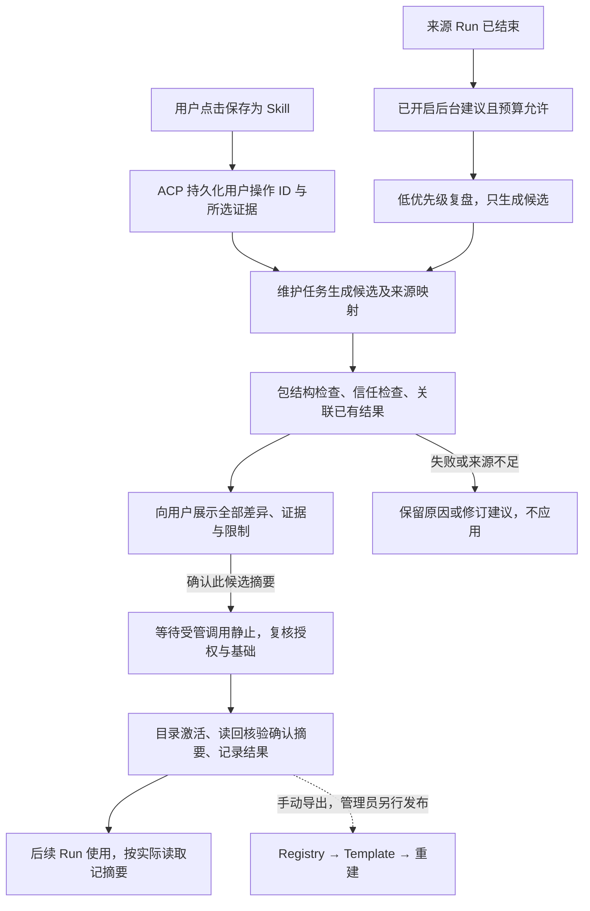

# Skill 驱动的经验学习与演进：技术方案草案

> 更新日期：2026-09-27；已按评审明确 L0 前的设计边界。
>
> 状态：可继续审阅的技术草案，尚未实现。本文只更新文档，不修改代码、协议
> schema、数据库或部署；所有交付批次和功能验收仍待启动。

逐项回应见 [评审处理记录](skill-design-review-20260927.md)。

## 1. 目标、首版范围与本轮决定

采用 **Skill 作为可复用策略与经验的载体**，参考 Hermes 的生成/维护方式，保留
Evolver 的“执行 → 复盘 → 检查 → 更新 → 再使用”闭环。Skill 正文描述适用场景、
步骤和注意事项；来源证据、确认记录与控制状态独立保存，不随每次 Skill 使用
全部进入模型上下文。

用户认可的是这个方向，不代表已经批准自动覆盖个人资产。本轮将首版收敛为：
**用户通过显式“保存为 Skill”操作发起整理，或获准后台复盘产生候选；展示完整
差异，用户确认后，在 Agent 空闲并满足受管调用静止条件时激活，再核验实际摘要。
后台自动应用不进入首版。** 静止不表示所有常驻进程退出，定义见第 7.3 节。

| 评审问题 | L0 的设计输入 |
| --- | --- |
| 后台占用 Run/Runtime | 独立维护任务，不占前景 Run；共享准入门，前景取消复盘后再准备 Run |
| 外部指令固化 | 证据分级、逐项可追溯；低可信内容不能独立支撑自动规则，首版应用必须先展示并确认 |
| 活动引用不兼容 Runtime | 真实目录、同卷候选；更新整体原子交换，新建不覆盖地 rename，不用符号链接/指针文件 |
| 验证无隔离环境 | 仅结构检查、来源 Run 已有结果和用户确认；首版不执行新候选来“自证” |
| Run 一致性与成本 | 空闲激活；记录实际读取的个人 Skill 内容身份，不逐 Run 哈希全部包 |
| 维护入口暴露给模型 | 独立受保护的 Runtime 维护端点，不进 tools/list；Runtime 拒绝普通 tools/call，ACP 来源校验作第二层 |
| 用户发起依据 | Agent UI 的原生“保存为 Skill”操作，ACP 持久化用户操作 ID；模型不能从对话推断出授权 |
| 配置与发布归属 | Controller 必须单独交付 Agent 学习配置；正式发布先手动导出、管理员上传 |

[Skill Registry 最小方案](skill-registry-minimal-design.md)继续负责托管、模板引用
和只读交付。本文不以 Registry 首版已实现为前提，也不使学习成为其依赖；不新增
阶段四第四个服务，不更改版本号选择。首版先交付用户在场的确认闭环，再单独
交付有界后台候选生成；后台未就绪不影响前一条链路使用。

## 2. 参考依据及边界

下述参考来自此前静态调研，固定源码快照，不是本平台已实现或上游效果已实测的
证明。也不直接嵌入 Evolver 引擎、GEP 资产选择器或 Hub 协议。

| 参考 | 采用的思路 | 保留的区别 |
| --- | --- | --- |
| Hermes，`cb399b56d964306bfad18b20edee30f88f777bf0` | 有条件生成、先读后改、优先已有主题、受限维护 | 使用本平台的前景准入、维护权限、证据分级和系统只读边界 |
| Evolver，`31b0691acd97ba18878019312e646f1f2d970d43` | 策略、案例、失败反馈、验证与过程记录分工 | 知识以 Skill 为主，不重复维护 Gene/Capsule 正文权威 |

Hermes 的触发条件包括工具迭代、可用工具、结束状态和配置，优先维护已有主题，
并非每轮创建 Skill；后台写入有资产范围及先读检查，Curator 模型合并默认关闭。
参见 [触发](https://github.com/NousResearch/hermes-agent/blob/cb399b56d964306bfad18b20edee30f88f777bf0/agent/turn_finalizer.py#L715-L745)、
[复盘](https://github.com/NousResearch/hermes-agent/blob/cb399b56d964306bfad18b20edee30f88f777bf0/agent/background_review.py#L417-L501)、
[写入检查](https://github.com/NousResearch/hermes-agent/blob/cb399b56d964306bfad18b20edee30f88f777bf0/tools/skill_manager_guards.py#L164-L242)、
[Curator 配置](https://github.com/NousResearch/hermes-agent/blob/cb399b56d964306bfad18b20edee30f88f777bf0/agent/curator.py#L30-L34)。

Evolver 的资产和实现限制见 [独立分析](evolver-technical-analysis.md)。本文采用
可观察的概念分工，不依赖尚未完整审计的混淆核心算法。本轮没有重新运行或接入
这两个项目。

## 3. 知识、证据和控制记录分开

| 信息 | 保存位置与用途 |
| --- | --- |
| Gene 的触发条件、前提、策略、反模式 | `SKILL.md` 的适用场景、步骤和注意事项 |
| Capsule 中可推广的案例、失败机制 | 提炼后的正文及少量 `references/`、`templates/`、`scripts/` |
| 原始对话、工具输出、一次任务的轨迹 | 原有 Session/Run 记录；不整段复制到 Skill |
| 为什么变更、谁批准、应用结果 | ACP 维护任务/候选/变更记录，关联来源和前后摘要 |
| 结构检查、来源结果、未来独立验证 | 分类型证据记录，绑定具体内容和适用范围 |

例如“超时后先查请求是否落地再重试”可以成为流程规则；当次请求 ID、日志全文
和凭据不能随规则进入共享包。普通事实、用户资料、短期任务状态仍按原上下文/
记忆职责处理，不因为引入学习就全部变成长流程 Skill。

文件在 Runtime 工作区，控制记录归 ACP；维护授权/预算配置归 Controller。工作区
文件不是可信审计存储，正文中的 `trusted`、`validated` 或自报来源不能提升权限。
检索索引是可重建派生数据，不成为第二份知识权威。

## 4. 资产格式、身份与模型可见范围

### 4.1 资产归属

本文统一称 Runtime `system` 来源为**系统 Skill**，`personal` 为**个人 Skill**。

| 资产 | 修改方式 |
| --- | --- |
| 模板交付的系统 Skill | Registry 新版本 → 模板修订 → 显式重建；Runtime 只读 |
| 用户维护的个人 Skill | 用户定向修改；不能仅因位于个人目录就允许后台维护 |
| 已授权维护的个人 Skill | 允许程序提出候选；首版仍须确认具体差异后激活 |
| 候选包 | 放在未被发现入口扫描的区域，不能自动成为普通 Run 的能力 |

包仍为 `SKILL.md` 加按需的 `references/`、`templates/`、`scripts/`、`assets/`。
较长背景放参考文件；优先更新主题，不按每次对话新增碎片。

### 4.2 候选从一开始使用可发布规则

候选结构检查**完整采用 Registry 第 3 节的包规则**：完整 `SKILL.md` ≤ 16 KiB，
包大小/路径/文件类型限制，frontmatter 无 BOM、精确分隔、单文档，以及 YAML AST
字符串类型检查，包括跨库数字拒绝并集、保守前缀/符号规则及禁止 merge key。
即使 Runtime 可以读取一个正文更长的文件，它也不能作为合规维护候选通过。
共享样例与包规则版本供 Registry、RC 和学习检查使用；不要求先有在线 Registry
才能运行本地校验。版本名明确如下，不能笼统记为“规范版本”或“规则版本”：

| 字段 | 定义及归属 | 记录方式 |
| --- | --- | --- |
| `package_rules_version` | 共享包准入规则及配套样例的版本；B0/L0 使用同一份规则，由共享合同登记 | 从 1 起的正整数；候选及每次结构检查记录所用版本，Registry/RC 校验记录同样保存 |
| `review_prompt_version` | ACP 内部复盘提示模板版本，标识提炼方法及其提示内容，不是包格式 | 从 1 起的正整数；ACP 保留不可变模板内容，任务创建时冻结；显式发起与后台建议都记录 |

两者均不是 Registry 集合的 `layout_version`，也不是 Skill 发布版本、Agent
配置修订或模型版本。任务同时记录包规则与提示版本，重试不静默改用新提示。
新包规则发布后，在当前规则下重新检查待应用候选，保留旧检查记录；不再合规
则阻止提交，需要修改字节时生成新候选并重新确认，不能沿用旧的通过标记。

个人候选最初是目录，也须检查将来导出 ZIP 的 8 MiB 压缩上限；以受限的实际
打包/编码计数验证，不能由解包大小猜测。打包不执行脚本，产物及临时空间也计入
候选预算。导出的文件清单必须与用户确认的候选一致。

托管时 ZIP 根只有包内容；个人活动目录使用 `name`。自动维护范围要求目录 basename
与 frontmatter `name` **完全相同**，固定到 `(organization, agent, personal, path)`
及维护授权修订，不能只依名称搜索后转移授权。新建前核对完整目录和 32 项容量，
不能仅用被截断的 Runtime 摘要推断没有重名。

用户改名、移动目录、修改 name 或改变内容基础时，原授权暂停，未应用候选变成
冲突/失效；明确重新绑定、读取新基础并重新确认后才能恢复。旧个人包不合规时
仍可按当前 Runtime 规则使用，但需要用户整理后才进入维护范围，不静默截断。

### 4.3 学习方法不是普通系统 Skill

复盘方法采用 ACP 内部、版本化的提示模板，只在维护上下文使用，不作为普通系统
Skill 出现在每个前景 Run 的摘要里。提示负责提炼方法，程序负责权限、预算、工具
范围和确认；提示不能授予发布权或改变系统只读边界。

L0 选择**独立的 Runtime 内部 HTTP 维护端点**，拟议路径为
`POST /internal/skill-maintenance/{action}`，动作限定为候选准备、检查、提交、
观察和取消；它不是 MCP Tool，不加入 `tools/list`、Runtime information 或模型
可调用定义。Runtime 的模型内置工具仍只有 `read/write/edit/bash`，现有 managed
MCP 工具继续按真实目录发现。[工具边界](runtime-context-and-managed-mcp.md)。

防护分为两层，不能只依赖 ACP 过滤：

1. Runtime 在普通 `tools/call` 上拒绝维护保留名称/别名，不为它们建立工具绑定；
   managed MCP 目录也不得注册保留名称。即使 ACP 漏过滤、模型猜名或重放历史
   调用，也无法从 Tool 通道提交。独立端点先验证维护凭据及 execution binding，
   再进入同一 Execution Actor，由降权 UID/GID 1000 的 executor 操作文件。
2. ACP 内部维护适配器只接受程序建立的维护上下文，模型 Tool dispatcher 没有
   转发到此端点的路由。调用来源不从参数、名称或 `role=maintenance` 文本取得；
   对意外出现在目录中的保留定义另行拒绝并报合同错误，作为第二层防护。

维护凭据采用 ACP 服务端签发、Runtime 校验的受限请求凭据，绑定 Agent、当前
`execution_id`、维护任务/世代、动作、请求及候选/参数摘要；重复请求只能恢复同一
效果，取消后的世代和旧 execution_id 不可续写。ACP 私钥留在 ACP，RC 通过受控
Runtime bootstrap 提供带 `kid` 的验证公钥集合；不把签发凭据交给模型、普通工具、
工作区或子进程。
当前 `X-Antnest-Expected-Execution-ID` 只是身份一致性字段，不能充当认证凭据。
凭据字段、下节的轮换/撤销边界、重放和取消观察在 L0 冻结，L1 Runtime、L1R RC 与 L3 ACP
分别交付；端点未配置有效验证身份时保持关闭。此增量不改变普通 MCP 当前的内网
信任模式，也不使维护端点成为浏览器或前景脚本的授权入口。

L0 同步登记独立控制通道与保留名称规则；`tools/list` 仍是**模型工具**定义的唯一
权威，不再提出“真实目录先混入维护能力，再依赖过滤”的方案。

普通 `write/edit/bash` 仍允许用户按既有权限编辑个人目录。这类编辑属于人工/
前景变更，会使维护基础失效，不能冒充经确认的学习提交。上述入口隔离不声称把用户
可写工作区变成防篡改存储；可信确认与提交结果只来自 ACP 控制记录，不能由包内
文件或普通工具输出制造。

### 4.4 公钥集合、部署身份与轮换

现有 Runtime 从 `ANTNEST_RUNTIME_SPEC` 环境变量一次性加载 bootstrap；Docker
创建请求（包括环境变量）计入部署摘要，RC 恢复操作时会重算并比较。
[Runtime 配置](../runtimes/antnest-runtime/src/config.rs)、
[部署摘要](../services/runtime-controller/internal/platform/docker/driver.go)、
[操作恢复](../services/runtime-controller/internal/control/service.go)。因此首版明确
采用**不可变 bootstrap 公钥集合＋显式重建换集合**，不假设 Runtime 能热更新信任。

| 项目 | L0 固定的设计输入 |
| --- | --- |
| 公钥身份 | 每把钥匙有不可复用的 `kid`，绑定算法与公钥字节；凭据携带 `kid`，Runtime 只在本地受信集合中匹配，不按请求提供的 URL 下载公钥 |
| 集合上限 | 启用维护时最多两把，即当前签发钥匙与预置的下一把；空集合表示维护关闭。重复 kid、同 kid 换字节及不支持的算法均拒绝配置，未知 kid 拒绝请求 |
| 当前签发选择 | ACP 的受保护配置指定唯一签发 `kid`。Runtime 的集合只有受信键，不靠可变的“当前”角色判定；在已预置的两把之间切换签发不修改部署摘要 |
| 部署身份 | 规范化排序的完整公钥集合及启用状态写入 RuntimeSpec，**计入 deployment/spec digest**。集合内容摘要只标识该信任集合，不是 layout_version 或包规则版本 |
| 配置所有权 | ACP 管签发私钥；RC 管平台 bootstrap 公钥配置及逐操作快照。它们不归用户 Agent 学习配置，也不把公钥配置版本塞入 Controller 请求摘要来追随全局换钥 |
| 已受理操作 | RC 在计算候选部署摘要时取得集合快照，与 BeginTransition 的操作受理原子持久化；请求重放、重启恢复、BeginTransition 并发重放均使用已存快照重建部署，不能重新读取当前 RC 配置 |

私有操作记录须保存公钥字节及其身份，只有一个配置修订号且旧配置不可找回不够。
新的全局配置只作用于之后新受理的创建/重建/Enable；已受理请求的输入摘要、
公钥快照和部署摘要不得回写。快照丢失或校验失败时明确阻止恢复并报告原因，
不能用最新公钥凑出目标，也不能跳过 `ErrRequestConflict` 检查。当前代码尚无
这些字段和恢复逻辑，属于 L1R 的必做增量；更换受信集合会改变实际部署身份，
但不自动改动 Skill、模板或 Agent 的业务配置。

正常轮换流程：

1. RC 为新目标预置 `{K_current, K_next}`；运维核对运行中 Runtime **及未结操作的
   冻结目标**所持集合。现有 Runtime 不会因 RC 配置改动自动获得新钥匙；缺少
   K_next 的实例先在维护窗口显式重建，或暂停该 Agent 的学习维护。
2. 已确认目标信任 K_next 后，ACP 才切换签发 `kid`。不支持该 kid 的目标拒绝
   维护请求并保留候选，普通 Run 不因换钥被阻塞；不以试签、自动降级或忽略验签
   兜底。仍在恢复的旧快照必须纳入切换清单，不能在稍后完成时带回未准备实例。
3. RC 配置更新为 `{K_next, K_future}`，逐个显式重建/后续受控 Enable，核验新的
   执行绑定与集合后才恢复维护。已受理操作先按原快照结算，再用新请求更新；
   仅切换 ACP 签发并不撤销运行中 Runtime 对 K_current 的信任。首版不承诺在线
   即时撤销，删除旧受信键须完成这轮重建。

私钥泄露时先关闭学习新准入/签发并结算在途维护；**停 ACP 签发不等于撤销泄露
密钥**。必须隔离受影响 Runtime 的维护入口；若现有部署无法可靠阻断所有入口
（包括 Runtime 内普通进程的直连），则由 Controller 停用受影响 Runtime 并确认
执行停止，接受该 Agent 前景中断，不能只封外部网络后宣称已撤销。在隔离/维护
窗口内，清点运行实例、disabled 配置及在途目标，换新密钥并重建为不含泄露 kid
的集合；按事实恢复/结算旧操作，不能改写冻结快照绕过摘要冲突，也不能重开带
旧钥匙的目标。新 `execution_id` 与新信任集合核验通过后才开放维护。

RC 公钥快照/部署记录和 ACP 受保护私钥配置需纳入各自备份及恢复清单，不把私钥
写入 RuntimeSpec、业务日志或仓库。恢复旧备份时先核对撤销记录；不能重新启用
已泄露钥匙或带有该钥匙的旧目标。轮换、配置修改时的在途恢复、空集合/未知 kid、
泄露隔离及恢复限制分别纳入 L1/L1R/L3 本地门禁和 LI1 集成，均尚未实现或演练。

## 5. 首版流程、状态与证据分级

首版用户入口固定为 **Agent UI 在会话中提供原生“保存为 Skill”操作**，不是模型
文本中的可执行链接，也不靠 LLM 判断出现了“记住”关键词。流程是：

1. 用户选择本会话的消息/已完成 Run，点击操作，查看来源范围，并可输入希望
   保存的流程或纠正。UI 通过自己的已认证 BFF 调用 ACP 的学习请求接口；不直连
   Runtime，不提供可由助手文本自动提交的隐藏入口。
2. ACP 使用可信用户身份核对组织、Agent/Session 权限、来源归属与学习预算，
   生成并持久化 `user_action_id`，保存用户实际输入、所选消息/Run ID 及请求
   幂等身份。不能接受客户端自报的 actor、用户角色或模型伪造的消息 ID。
3. 维护任务以 `trigger=user_action` 绑定这个不可伪造的操作 ID 和授权证据范围。
   被选择的助手回复、网页或工具输出仍保留原可信等级；“用户要求整理它”只
   证明整理意图，不把其每一句内容升级为用户事实。来源被删除/无权访问时明确
   拒绝或使候选失效，不跨会话搜索替代证据。
4. 维护任务生成候选，完成检查后展示差异；用户再确认具体候选摘要，才能进入
   激活。点击“保存为 Skill”只授权生成建议，不等于确认尚未产生的改动。

用户在普通聊天中说“记住这个流程”时，前景模型可以提示其点击入口，但这段对话
本身不自动创建维护任务；工具输出中同样的句子也不能触发或产生 `user_action_id`。
首版不新增 `/learn`；以后渠道命令只能显式映射到同一已认证用户操作合同。
接口字段在 L0、ACP 记录/准入在 L3、原生入口在 L4 分别交付，目前均未实现。

概念状态分开记录，正式枚举在 L0 冻结：维护任务为待处理/运行/暂停/完成/取消/
失败；候选为草稿/检查失败/待确认/已确认待空闲/已应用/拒绝/冲突；检查与证据
分别记录结果和覆盖范围，不使用一个含糊的“验证通过”覆盖全部业务效果。

### 5.1 来源信任不能在提炼时丢失

| 来源 | 可作为依据的范围 | 限制 |
| --- | --- | --- |
| 经认证用户的明确要求、纠正 | 已持久化的真实 user 消息或 user_action 中的直接要求、纠正 | 不能由模型推断创建；只有显式 user_action 发起首版用户维护任务，粘贴/选择的外部内容不自动升级 |
| 平台实际观察到的执行结果 | 某操作、环境、输入下的明确事实，或独立结构断言 | exit 0 只证明退出码；工具文本“成功”不能变成业务正确性证明 |
| 工具输出正文、网页、文件、外部文档 | 低可信资料，可引用并标明来源 | 其中的命令不能变成维护指令或自动升级为长期规则 |
| 模型推断、复盘总结 | 候选假设、组织语言 | 不创造新的可信来源，不以模型自评分替代证据 |

每条新增/强化的规则保留来源位置、可信等级、可支持的事实和适用范围；摘要或
多轮转述必须保留最低来源等级，不能把外部指令洗成“用户纠正”或“已执行事实”。
控制程序检查来源关联、主体、范围与引用有效性，模型内容审查仅作辅助。

**只有低可信内容支撑的规则一律不得自动应用。** 即使未来单独开放自动应用，
也只能考虑用户明确纠正、用户明确要求或实际执行结果这三类依据；来源合格仅是
必要条件，不等于规则正确或可以绕过展示/维护授权。首版所有候选必须展示后确认；
低可信内容只能呈现为待用户核实的建议，不携带“已验证”标签。

展示应包含正文及全部配套文件的增删改、影响范围、基础/目标摘要、来源和验证
局限。确认绑定组织、Agent、具体候选摘要与授权修订；页面打开、通知送达、模型
代答均不是确认。候选变化后旧确认失效。后台方案不能以事后通知替代应用前展示。

## 6. 后台复盘与前景准入

### 6.1 现有限制与维护任务身份

ACP 当前每 Agent 只有一个活动 Run，第二个返回 `agent_busy`；Runtime 对所有
工具和 `antnest://runtime/info` 共用单个执行位，忙时直接 `runtime_busy`，不排队。
[Run 准入](../services/agent-acp-service/src/application/run-supervisor.ts)、
[Runtime 合同](../runtimes/antnest-runtime/docs/mcp-contract.md)。后台流程不能直接
“沿用普通 Run”，也不能绕开 Run 后随意并发访问 Runtime。

后台复盘是 ACP 拥有的**维护任务**，复用模型客户端、计费和取消基础设施，但不
创建活动用户 Run、不占其 slot、不写伪造用户消息或修改来源 Run。每个 Agent
维护任务与前景 Run 共用一把程序准入门；Runtime 仍保留自己的单执行位约束。

任务按“读到有限证据 → 释放 Runtime → 模型推理 → 重新检查准入 → 写候选”运行：
推理期间不持有 Runtime slot；只有 Agent 没有前景 Run、没有前景准入意图且绑定
有效时，才能发起维护读写。资源读取也受同一门控制，不能在前景准备 `info` 时
偷偷读取个人目录。模型不持有通用 shell、外部业务工具或任意写路径能力。

### 6.2 前景、Drain 和取消的具体顺序

1. 前景提交先原子登记优先准入意图，禁止该 Agent 新的维护 Runtime 调用；如果
   原本已有另一个前景 Run，仍按既有 `agent_busy` 处理。
2. 取消复盘模型请求，使当前维护 generation/租约失效。晚到的模型响应只丢弃，
   不能重新写候选；无需等待模型服务把整次推理自然做完。
3. 对已发出的维护文件调用请求取消，并等待 Runtime 明确结束/观察结果。仅触发
   AbortSignal 或关闭 HTTP 不证明执行位已经释放。已进入短小原子提交的请求
   先完成或按目标摘要结算，不能把已完成交换说成取消未生效。
4. 确认维护调用已静止，才开始前景 Run 准备、读取 `info` 及进入正常执行。普通
   复盘不得导致 `agent_busy` 或让前景撞上 `runtime_busy`。
5. 取消/结算有独立短时限；超时且无法证明 Runtime 静止时，保留未结状态并报告
   可诊断的暂时不可用，不伪造成功、忙等或启动相撞的 Run。L1/L5 的取消时限须
   按真实文件操作验收确定；不承诺在未知副作用下仍强行接收前景。

Drain/停用/重建收到请求就封闭维护准入、撤销租约并取消复盘，**不等待复盘模型
自然结束**，也不把复盘加进前景 Run 的 Drain 等待列表。已经发出的短文件副作用
仍须有界结算或记为未结，再按既有生命周期语义处理；“直接取消”不能被解释为
忽略尚在写文件的子任务。新的 Runtime binding 必须使用新租约，旧任务无权续写。

ACP 当前一个数据库只有一个活动 worker，但不同 Agent 可以执行各自的 Run，
不是全库只能一个 Run。[worker 约束](../services/agent-acp-service/docs/architecture.md)。
首版后台上限固定从**全局 1 个复盘、每 Agent 1 个**开始；有界队列按 Agent 合并
重复触发，待确认候选也限制数量和磁盘量。等待的后台任务不能占前景名额；worker
失去所有权时停止新调用，取消在途任务，恢复先观察原提交，不重放不明副作用。

### 6.3 触发、预算与优先更新

后台触发默认关闭，Agent 显式开启后，才考虑纠错、重复问题或有复用价值的已结束
Run。调用次数/间隔只能限成本，不能单独证明值得学习。普通问答、状态查询、
未完成/取消任务不自动提炼“成功方案”；失败只能支持有依据的失败机制。维护
任务本身不递归触发复盘。

读取本次相关、获准维护的 Skill，优先更新已有主题，再考虑新建；每次修改基于
新读到的内容与摘要。输入只取授权来源片段，不复制完整历史、全部 Trace 或全部
Skill。全局进程预算归 ACP 部署配置；Agent 的开启、范围、模型选择与用量预算归
Controller，不能只在 UI 或 ACP 临时内存保存。

## 7. 候选、完整目录提交与恢复

### 7.1 内容和可信记录

| ACP 私有记录 | 至少包含 |
| --- | --- |
| 用户发起记录 | ACP 生成的 user_action_id、可信操作者、组织/Agent/Session、实际用户输入、消息/Run 范围、幂等请求 |
| 维护任务 | 组织、Agent、发起/归属主体、trigger 与 user_action_id（用户发起时必填）、来源消息/Run、review_prompt_version、package_rules_version、配置修订、预算、请求/worker 身份 |
| 候选 | 稳定个人路径、基础摘要、目标包清单/摘要、package_rules_version、原因、逐项来源等级、Runtime binding |
| 检查/确认 | 候选摘要、检查类型/覆盖及 package_rules_version、结果、证据引用，展示与用户确认的身份/时间/授权修订 |
| 提交意图/结果 | 请求身份、前后摘要、绑定与准入租约、预期基础、观察结果、旧包位置及回退关系 |

个人活动根仍是 `/workspace/.antnest/skills/`；候选和有界旧副本拟放同一工作区卷的
`/workspace/.antnest/skill-learning/`。这个位置不在 Skill 目录扫描下，也不是
`.cache/`。候选只是普通工作区数据，可能被用户改变；检查/展示/提交前须核验，
与 ACP 记录不符就使旧确认失效。Runtime 不新增业务数据库或拥有发布决策。

### 7.2 用真实目录原子替换

本节仅用于工作区内**个人 Skill** 的候选激活。系统 Skill 按
[Registry 方案](skill-registry-minimal-design.md)下载并将实际文件保存到专用 volume，
由 Runtime 只读挂载；更新通过准备目标卷和显式重建完成，不在 `/skills` 执行
本节的目录交换。

Runtime 用 `RESOLVE_NO_SYMLINKS` 解析路径，扫描只承认真目录。
[路径实现](../runtimes/antnest-runtime/src/roots.rs)。因此不采用软链接活动版本、
指针文件或另一套发现协议；候选和活动目录必须处于同一 mounted filesystem：

1. 在候选区准备**完整目录**，检查 Registry 包规则、配套文件、基础/目标摘要；
   保证候选停止写入。ACP 先持久化确认与提交意图，再发起条件提交。
2. 提交时取得维护准入门及 Runtime 文件执行位，复核身份/授权、目标真实目录、
   基础内容和第 7.3 节的受管静止条件。只哈希本次目标包，不扫描哈希全部个人库。
3. 更新用 Linux `renameat2(RENAME_EXCHANGE)` 交换完整候选目录与活动目录；旧包
   留在原候选位置供恢复/回退。新建用 `renameat2(RENAME_NOREPLACE)`，已存在则
   冲突，不能把意外出现的用户目录覆盖掉。这两个标志分开使用。
4. 保持执行位，对新活动目录重新读回完整文件清单/内容/模式，与用户确认的完整
   包摘要比较，再对新内容和相关父目录执行适用的持久化同步。匹配才向 ACP 报告
   已应用及核验时点；不匹配返回已发生交换的内容冲突，按第 7.3 节恢复。不得将
   多文件逐个 rename 或“先删旧再移动新”称为原子激活。

这些系统调用的原子交换/不覆盖语义来自
[Linux man-pages 的 rename(2)](https://man7.org/linux/man-pages/man2/rename.2.html)。
它们不支持跨挂载交换，也不保证每个文件系统支持所需标志。L1 必须在 Linux
Docker named volume 与 Docker Desktop 的真实卷上验证交换、新建、权限、同步
和崩溃观察；不支持时返回 `atomic_skill_replace_unsupported`、保留原包与候选，
不能降级为逐文件覆盖后仍报成功。本轮没有实测此组合。

### 7.3 受管调用静止、常驻进程与可重放边界

本方案将“静止”精确定义为**ACP 无前景 Run/优先准入意图，Runtime 除本次提交外
的受管调用已经结算，提交独占 Execution Actor，且没有下表所列阻塞项**。不再要求“所有
可写进程已经退出”，也不把此条件称为整个工作区没有写者。
[现有后台进程边界](runtime-context-and-managed-mcp.md)。

| 执行/进程状态 | 是否阻止激活 | 处理 |
| --- | --- | --- |
| 前景 Run、Tool/info、维护文件调用、未结取消 | 是 | 等待/取消结算；新前景优先，维护不能跨调用检查后再抢占提交 |
| managed MCP 有在途请求、已观察到的关联异步工作未结算，或取消结果未知 | 是 | 由 Runtime 观察结算；未知状态不能当空闲 |
| managed MCP 进程已初始化、无在途协议操作，仅常驻等待请求 | 否 | 不因 PID 存在就永远阻塞；提交期间不向其派发新调用；后置摘要核验仍必须做 |
| Bash 发起的仍存活后台任务/后代进程组，含 dev server、watcher | 是 | 首版不按 cwd 或自报“只读”豁免；用户自行停止，或保留候选稍后应用 |
| 发现来源不明的工作区执行进程、后台任务归属/退出无法确认 | 是 | `writers_unknown`，给出可诊断原因；补全 L1 观察能力前不默认放行 |
| 已确认退出的任务、已回收的僵尸记录 | 否 | 不能仅凭过期历史任务记录一直阻塞 |

检查后台状态、取得执行位以及封闭新派发必须在同一受管准入边界内完成；持有
执行位直至交换、后置摘要核验和结果观察结束。L1 必须补足可观察的 Bash 任务/
后代归属和 managed MCP 在途状态，不能仅拿“没有活动 Run”或某一刻的进程列表
代替这一机制。等待不占执行位，不杀用户进程，也不停止空闲 managed MCP。

空闲 managed MCP 仍与其它 executor 同为 UID 1000，理论上可以在协议调用之外
自行写文件；阻止派发并不撤销它的文件权限。因此本轮明确接受的是**受管调用
静止加前后内容核验**，不承诺强文件系统隔离或原子 CAS。提交后摘要必须匹配
用户确认内容；稍后任何人工/子进程修改仍按既有工作区漂移处理，维护授权暂停。
若某 MCP 会自主修改受管 Skill、持续导致核验冲突，应由管理员停用/调整该 MCP
后显式重建，或暂缓应用；不能将它标成普通空闲就宣称已经证明无写者。需要防止
所有自主写入时另立进程/文件系统隔离批次，不能把后置哈希冒充这种隔离。

后置核验不匹配时返回 `skill_content_changed_during_activation`，明确已可能发生
目录交换，保留旧目录和当前目录证据，标记候选冲突并暂停维护；不返回成功，也
不盲目反向交换覆盖并发用户修改。观察结果未知则先恢复观察，不能重新应用。

阻塞结果至少包含 `blocked_reason`、受影响任务/managed server 的稳定身份和
可采取操作。UI 显示“等待前景结束”“后台任务仍运行”“执行结果未确认”或
“内容被并发修改”，允许稍后重试、取消候选、查看任务身份及可访问的来源 Tool
记录。**首版不新增 kill API 或 UI 停止按钮**：用户需要停止 Bash 后台任务时，
在普通前景 Run 中明确要求 Agent 停止所指任务，由现有 `bash` 权限/授权流程
执行，不能按 UID 批量终止进程，也不能将工具中的指令当作用户授权。

候选等待时释放维护执行位，保证上述普通 Run 可进入；不能为了等待 dev server
退出而占住用户停止它的入口。前景结束后，L1 必须观察所关联任务及后代确实退出，
再重新检查静止条件和基础/候选摘要；字节有变则旧确认失效。managed MCP 的
停用/重配置沿用前述管理员显式重建路径，不把杀其子进程冒充配置变更。页面不
显示无限 spinner、不自动杀进程，也不展示完整命令或敏感进程参数。

提交幂等绑定稳定请求和完整目标摘要。应答丢失或进程重启后先观察活动目录：若
已为目标内容则结算为效果已达成，**不得再交换一次而换回旧版**；若仍是原基础且
候选完整，在重新取得有效准入/授权后继续；其它状态保留冲突/未结，不猜测成功。
工作区收据可辅助定位，不能替代 ACP 意图和真实字节核验。

回退也生成具体候选、展示并确认，按同一空闲/冲突规则应用，追加变更记录，不
抹掉历史。旧副本丢失或摘要错误必须报告无法回退；清理不能删在途候选、待结算
目录或被回退操作引用的副本。

## 8. 验证边界与 Run 使用记录

### 8.1 首版不执行候选自测

目前可用 Runtime 属于用户，挂载其工作区和 Egress，也只有一个执行位；不把它
临时当作无副作用验证沙箱。首版证据只含以下三类：

| 证据 | 可以证明 | 不能证明 |
| --- | --- | --- |
| 结构/身份/来源检查 | 包可解析，路径/大小/授权/引用满足规则 | 流程正确、没有危险脚本或未来结果正确 |
| 来源 Run 已有执行结果 | 原输入与环境下实际观察到的事实 | 新提炼或修改后的候选已经执行通过 |
| 用户确认具体差异 | 用户在所示范围内允许应用该内容 | 等于业务测试通过、允许突破其它权限 |

模型审查可辅助发现重复、泄露和明显错误，不是额外的事实验证等级。凭据/私人
资料应在候选检查时拦截或要求用户删去；不能认为模型说“无敏感信息”就足够。
结构结果绑定候选完整摘要；来源结果绑定来源执行及原内容身份，不能给新候选
复制一个“实测通过”徽标。

新的脚本或验证说明只作为文件，不在生成、结构检查和激活中执行。未来如需
可执行评估，另列 Controller/RC 所属批次提供隔离验证 Runtime、最小权限/网络/
临时存储及成本归属，之后再集成评估；不能塞进现有 L1 或占用用户执行位凑证据。

### 8.2 空闲激活，不做全库逐 Run 冻结

首版明确选择空闲激活，与新 Run 准入共用第 6 节门控。维护程序不能在前景运行中
替换活动包；新 Run 使用当时可发现的目录。**这不等于整个 Run 的工作区字节被
快照冻结**，前景自己的编辑、后台进程及人工编辑仍可能改变内容。

系统版本在 Registry 链路完成后，可从 Run 快照的 `agentSpecRevision` 追溯固定
引用，结合 RC 清单中的逐 Skill 摘要；旧共享卷只能标明 legacy 身份，不能虚构
其发布版本。[现有快照字段](../services/agent-acp-service/src/domain/run-snapshot.ts)。
学习链路不以 Runtime 新增系统版本字段为首版前提。

个人 Skill 只记录本次**实际读取**的 `SKILL.md` 内容摘要和路径；配套文件实际读到
时可同样记摘要。L1 为读取结果提供字节范围/完整性与内容身份，ACP 保存对应记录。
完整正文可在实际读取时对其字节计算摘要；截断或分页片段须标为片段，不能拿显示
文本、行号包装或部分内容冒充完整文件摘要。只看目录摘要没有读正文时，记录为
“仅发现”，不能说已经使用。

不在每个 Run 开始遍历 32 个、每包最大 32 MiB 的个人集合。完整包摘要仅在候选
检查、展示/提交校验和明确回退时计算本次目标。实际读取中同一路径变了就记录
新的观察身份/冲突，暂停对应维护；已进入上下文的旧文本不会因此被回写。首版
不承诺拦住任意外部写者或禁止前景主动编辑，不把“有摘要”描述为全包隔离。

### 8.3 系统只读、重名和正式发布

系统 Skill 继续由工具拒写及只读挂载保护。维护流程没有 Docker 控制、重新挂载
或系统卷可写别名。派生关系只能追溯来源，不能继承系统可信等级或覆盖权限。

重建新增系统 Skill 与已有受管个人 Skill 同名时，保留个人文件，但暂停其维护、
使待提交候选失效并提示用户选择改名/重新绑定。Runtime 当前两种来源均可展示，
不能静默遮蔽、删除或认为系统新增就自动批准个人改名。

Registry 首版**没有个人 Skill 发布/转换的产品流程**。可行路径是用户手动导出
选定内容，管理员按包规则检查并上传新版本，再保存模板修订、显式重建。本文
不承诺一键发布或后台自动推广，也不以普通用户确认替代组织发布权限。

## 9. 配置、身份、费用与服务所有权

Agent 的学习开关、维护路径、预算、模型选择和授权修订属于 **Agent Controller**，
必须单独交付配置、持久化及向 ACP 的投影，不能写成“必要时才适配”。首版默认
关闭后台建议，开启维护也不授权无确认应用；单次“记住”确认与长期维护范围分开。

复盘使用当前 Agent owner 的有效授权及 Controller 配置的模型凭据，通过现有
Provider 客户端调用，不用管理员兜底 Key，不保存一份复盘专用明文密钥。费用归
该组织/Agent/owner，区分前景与维护用途，同样受预算约束；后台取消已发生的费用
也应记录。owner 撤权、模型授权撤销、学习配置关闭或修订失效时停止新调用，
取消旧任务并使未提交确认失效。历史任务的归属不能随新 owner 重新标记。

当前投影的 `principal_ids` 只含 owner。
[现有投影](../services/agent-controller/internal/application/execution_projection.go)。
不能据此假设未来多人共享安全：个人 Skill 实际位于 Agent 工作区，不是按用户
隔离。多人共享、转移所有权或跨用户证据复用必须重新审视内容可见性与授权；
未交付相应策略前，不允许后台将一个主体的私有证据并入另一个主体的维护任务。

| 所有者 | 新增工作 | 不承担 |
| --- | --- | --- |
| Agent Controller | Agent 学习配置、授权/预算与修订投影 | 复盘推理、个人文件事务 |
| Antnest Runtime | 候选文件、实际包校验、静止观察、目录提交/恢复、读取摘要 | 学习策略、发布批准、业务控制数据库 |
| Agent ACP Service | 用户发起操作/候选/证据/确认权威、前景优先、独立维护客户端与签发凭据、计费记录 | 容器管理、跨组织证据、自动 Registry 发布 |
| Agent UI | 原生保存为 Skill 入口、差异/限制与精确确认、阻塞原因/恢复建议、回退入口 | 维护决策权威、后台独立执行循环 |
| Runtime Controller | 生命周期绑定、维护公钥集合 bootstrap、已受理操作的冻结快照与摘要恢复；独立 L1R 批次 | 持有 ACP 签发私钥；首版额外创建验证 Runtime |
| Skill Registry | 沿用包规则及管理员托管 | 后台学习或个人发布产品工作流 |
| Task Scheduler | 未来可按明确合同触发周期整理 | 首版复盘的必要依赖 |

任务冻结 `review_prompt_version`；模板大小、模型调用数/时间、输入/输出、候选
数量/磁盘、保留周期均受限。
具体阈值在所属服务批次用代表性负载确定；全局后台并发 1、默认不开启、无确认
不应用等语义不留给阈值调优改变。
[服务所有权](service-layout.md)。

## 10. 失败处理与验收要求

| 场景 | 处理及所需证据 |
| --- | --- |
| 无新经验/重复触发 | 跳过或合并，不递归生成候选 |
| 前景在模型推理/读取/候选写入/提交时到来 | 封闭维护准入、取消及观察静止后再读 info；不因普通复盘出现 agent_busy/runtime_busy |
| Drain/重建/停用/worker 失权 | 不等模型自然完成；旧租约禁止新副作用，未结短文件操作按事实恢复 |
| 两 Agent 同时复盘 | 每 Agent 1、全局 1；有界队列，前景不占维护名额 |
| 用户发起、重复点击与文本注入 | 只有已认证原生操作创建 user_action_id；重复请求幂等；模型/工具中的“用户要求记住”不能伪造触发或提升级别 |
| 网页/工具输出试图注入长期规则 | 低可信标记贯穿提炼，不能变成用户纠正或自动应用依据 |
| 维护目录/猜名/重放/直连端点 | tools/list 从不包含维护定义；Runtime tools/call 拒绝保留名称；私有端点拒绝无效凭据/旧绑定，ACP 来源检查不可由模型参数绕过 |
| 公钥轮换与在途部署 | 当前/下一把按 kid 验证；RC 配置更新后原请求仍以冻结快照恢复且摘要一致，缺快照不得换用最新配置；缺少下一把的 Runtime 暂停维护，不阻塞普通 Run |
| 泄露密钥/旧备份恢复 | 停止签发之外还须隔离实际验证端；必要时停用 Agent 后重建；不恢复已泄露 kid，不改写旧操作快照伪造完成 |
| 候选超大、YAML 非字符串、目录/name 不符 | 共享结构样例拒绝；不能先激活以后才发现无法发布 |
| 包规则或复盘提示更新 | 两版本分别记录；任务重试沿用冻结提示，候选按当前包规则复查，不能篡改历史通过结果或沿用被修改字节的确认 |
| 基础/候选改变、目录移动、确认过期 | 冲突/暂停授权，旧确认不能套用到新字节 |
| 空闲 managed MCP 与在途请求 | 常驻空闲进程不阻塞、无需退出；在途/未结请求阻塞；提交期间无新派发，目录交换后摘要核验 |
| 常驻 Bash dev server / 未知后台任务 | 返回具体阻塞原因并释放执行位；用户经普通 Run 请求停止，确认任务及后代退出后复核候选；无新增 kill API/按钮，不自动杀进程 |
| 交换前后有自主文件修改 | 基础变化则拒绝；后置不匹配标明已交换的冲突，不能成功或盲目换回；不能将观测静止说成强隔离 |
| 交换/新建/同步中断、应答丢失 | 观察前后摘要，避免重复交换回旧版；不出现逐文件混合活动包 |
| Docker 文件系统不支持 | 明确能力错误，保留旧包和候选，无不安全降级 |
| 重建后同名系统包/授权失效 | 个人资产保留，维护暂停，旧候选失效，用户显式重新绑定 |
| Registry 离线 | 本地建议、确认和使用不依赖它；管理员发布等待恢复 |

应用前展示、用户确认与实际激活分别验收，不能只测试 Markdown 看起来合理。
后续质量比较使用代表性任务和具体内容身份，记录成功、错误触发与回归；使用
次数、工具成功和模型自评分都不替代业务结果，不预先承诺收益。

## 11. 服务所属交付批次

所有批次未启动；按共享合同、单一服务本地门禁、显式集成推进。首版确认路径
与可选后台路径分别验收，不把一个 Runtime 文件工具完成说成学习业务完成。

| 批次 | 所有者 | 交付及边界 |
| --- | --- | --- |
| L0 | 共享合同 | 显式用户操作及证据身份、配置/授权、独立维护端点/凭据与保留名称、kid/公钥集合及部署身份/轮换、package_rules_version 与 review_prompt_version、静止分类/阻塞响应、前后摘要及恢复；同步 Runtime 工具边界和共享包样例 |
| L1 | Runtime | 私有维护端点、拒绝普通 tools/call、按 kid/有界 bootstrap 公钥集合验签、候选结构、受管调用/后台任务观察、目录交换及后置摘要；无新停止接口；Rust/合同/组件和 Docker/Desktop 门禁 |
| L1R | Runtime Controller | 公钥集合 bootstrap、规范化部署摘要、受理时冻结完整快照/恢复不读新配置、轮换及泄露/备份恢复步骤；所属服务文档/单元/合同/组件门禁，不夹带 ACP 实现 |
| L2 | Agent Controller | Agent 学习配置、范围/预算/owner 授权与投影修订；必做的独立服务批次 |
| L3 | ACP Service | 已认证 user_action 记录/幂等、候选与确认及两个版本记录、独立维护客户端/按 kid 签发和来源检查、换钥/停用维护、静止准入/冲突恢复；本地单元/合同/组件证据 |
| L4 | Agent UI | 原生保存为 Skill 入口、来源选择、差异与精确确认、阻塞原因/任务身份及普通 Run 停任务指引、回退状态；无 kill 按钮；后端先测，样式确认后界面回归 |
| LI1 | 显式集成 | Controller/RC/Runtime/ACP/UI 的显式入口到确认应用链路；工具入口拒绝、换钥与在途恢复/泄露隔离、静止/普通 Run 停任务/崩溃及适用 Docker E2E |
| L5 | ACP Service | 默认关闭的后台候选生成、全局 1/每 Agent 1、前景抢占/Drain 取消、成本及来源污染防护；不开放后台自动应用 |
| LI2 | 显式集成 | 在 LI1 已通过基础上检验真实前景/后台竞争、迟到响应和绑定变化；可复用 L4 候选入口 |

如果后台状态需新 UI，另列 UI 所属批次后再 LI2；执行验证环境、自动应用策略、
Registry 一键发布均另行立项，不夹进上述服务批次。Registry 交付后再补手动导出/
管理员上传/模板重建的衔接验收，不把它列为 LI1 的启动依赖。

新行为测试先行；单元归所属服务，集成/E2E 归根 `tests/integration/`、`tests/e2e/`，
共用工具归 `tests/support/`，私有持久证据归 `artifacts/verification/`，不进
`.cache/`。各批需单元、合同、组件和适用 Docker E2E 证据。
[测试存储规则](../tests/README.md)。

## 12. 仍可讨论的范围

本轮已决定的前景优先、显式用户入口、独立维护通道、首版确认、非执行验证、
真实目录、受管调用静止与内容核验、配置所有权不是悬而未决的实现选择。
公钥集合的不可变部署身份、正常轮换/泄露处置以及首版无新增停止接口同样已明确。
尚可调整的是触发阈值、输入/时间/磁盘预算、候选合并
和保留周期、用户展示细节，以及何时启动后台批次。

未来若开放自动应用，应另行明确可接受风险、逐项可信证据、应用前展示、撤销与
验证能力；若要全包 Run 快照或隔离执行验证，也须新增明确服务批次。本文提供
修订后的设计输入，不表示这些扩展已获实现或验收。
