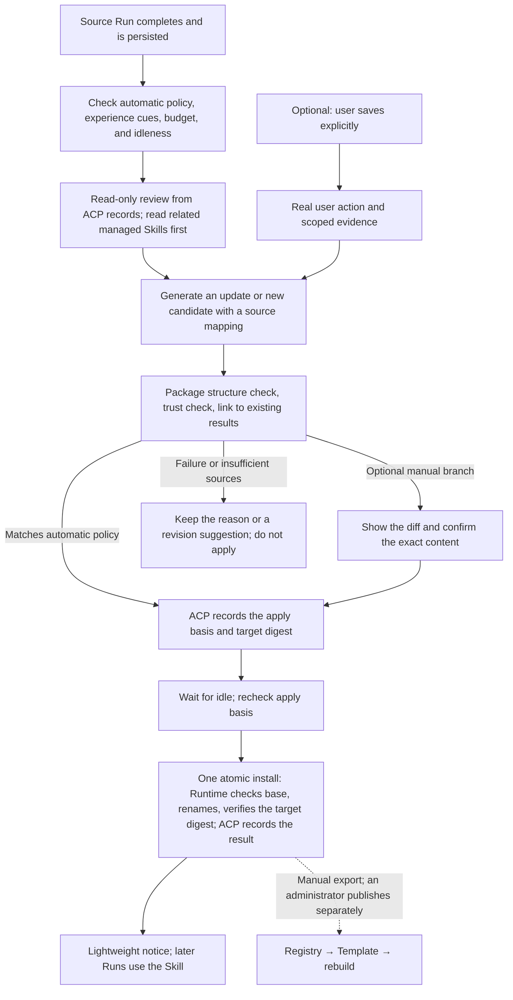

# Skill Learning and Evolution

This document describes how Antnest Platform turns completed work into reusable
experience. After a Run completes, the platform can review it, create or update a
managed personal Skill, activate the change when the Agent is idle, notify the
user, and use the updated Skill in later Runs. The shared contract is
[Skill learning shared contract v1](../contracts/skill-learning/learning-api.md).

Version 1 does not include undo after activation, change-detail diffs, or
retention of previous package versions.

Applied managed personal Skills are registered automatically in the Skill
Registry's dynamic source directory. Other Agents can find them through search
and load them temporarily from the source on demand. The content and its
lifecycle stay with the source Agent. A user with publish permission can promote
such a Skill to a formal system Skill. Only then does the Registry host the full
package, which is delivered through Templates and Runtime rebuilds.

## 1. Goals and Scope

A **Skill is the carrier for reusable strategy and experience**. Learning follows
a closed loop: execute, review, check, update, and use again. The Skill body
describes when it applies, the steps to follow, and the cautions. Source
evidence, the application basis, and control state are stored separately and do
not enter the model context each time the Skill is used.

The version 1 goal is: **after a task completes, the platform conditionally
reviews it and creates or updates a managed personal Skill. When checks pass,
the Agent's automatic learning policy activates the change once the Agent is
idle and managed invocations are quiescent. The platform verifies the actual
digest and notifies the user after the change takes effect. The normal path
does not require the user to start or confirm each change.**

Manual saving by the user is an optional path. The contract defines it
(`apply_basis=user_action`), but it is not implemented. Automatic maintenance
never takes over system packages or user personal packages outside its scope.
Quiescence does not mean that every long-running process has exited; Section 7.3
defines it.

| Concern | Design decision |
| --- | --- |
| Background work occupying a Run or Runtime | Maintenance is an independent, read-only task that occupies neither a foreground Run nor the Runtime. Its only Runtime call is one atomic install, sent when the Agent is idle; foreground work preempts it and never waits for it. |
| Persisting external instructions as rules | Evidence is graded and each item is traceable. Low-trust content cannot on its own support an automatic rule. Automatic candidates must pass scope and source checks. Semantic misjudgment remains a known limit. |
| Active references incompatible with the Runtime | Packages are real directories, and candidates live on the same volume. An update is an atomic whole-directory exchange. A new Skill is created with a non-overwriting rename. Symbolic links and pointer files are not used. |
| No isolated validation environment | Checks are limited to structural checks and results the source Run already produced. User confirmation is the application basis of the optional manual path, not business validation. A new candidate is never executed to validate itself. |
| Run consistency and cost | Activation happens only when idle. Each Run records the content identity of the personal Skills it actually read; the platform does not hash every package for every Run. |
| Maintenance entry points exposed to the model | Maintenance uses a separate protected Runtime endpoint that is not listed in `tools/list`. The Runtime rejects ordinary `tools/call` requests for it, and ACP source validation is a second layer. |
| Basis for automatic or manual initiation | An automatic task is bound to a real completed Run and a Controller policy revision. The optional user entry point is bound to a real operation ID. The model cannot create authorization. |
| No per-change confirmation | `apply_basis=policy` is bound to the automatic policy, the target scope, and the exact digest. Manual adoption uses `user_action`. Neither basis can impersonate the other. |
| Ownership of configuration and publication | Agent Controller owns the Agent learning configuration. Applied managed personal Skills are projected automatically into the Registry dynamic source directory. Promotion to a formal system Skill is a separate action by a user with publish permission. |

The [Skill Registry](skill-registry-minimal-design.md) provides hosting,
Template references, and read-only delivery. Learning is implemented inside the
existing services. It does not add another Stage 4 service and does not require
the Registry to be online. Learning is complete only when the path runs from the
automatic trigger to automatic activation. An implementation that only displays
candidates or exposes file tools does not count as automatic learning.

## 2. Design Constraints

The design does not embed an external learning engine, asset selector, or hub
protocol. It adopts the following rules:

| Rule | Reason |
| --- | --- |
| Conditional automatic creation and update of Skills, with managed ownership | Users get learned Skills without a confirmation step for each change. Managed ownership limits automatic writes to packages the learning system created. |
| Read before modify, and prefer extending an existing topic over creating a new Skill | This avoids duplicate or conflicting Skills for the same subject. |
| Notify the user after the change takes effect | The normal path does not wait for approval, so the user still learns what changed and why. |
| Review runs as an independent read-only ACP task; its single Runtime install yields to foreground work | Background learning must not compete with, delay, or corrupt foreground Runs. |
| Every applied change records its policy basis | Each automatic change can be traced to the policy revision, path, and digest that authorized it. |
| System Skills are read-only to learning | Template system Skills remain immutable; learning writes only managed personal Skills. |
| Strategies, cases, failure feedback, validation, and process records have separate roles | Each kind of information has one owner and one purpose (see Section 3). |
| Skills are the primary form of knowledge; no separate gene or capsule store holds an authoritative copy of the body | A single authoritative copy avoids drift between two knowledge stores. |
| Automatic merging of existing Skills by a curator model is a separate feature | Its default setting does not change whether automatic creation is enabled. |

## 3. Knowledge, Evidence, and Control Records Are Separate

| Information | Storage location and purpose |
| --- | --- |
| Trigger conditions, preconditions, strategies, and anti-patterns | The applicability, steps, and cautions sections of `SKILL.md` |
| Generalizable cases and failure mechanisms | The distilled body, plus a small number of files under `references/`, `templates/`, and `scripts/` |
| Raw conversations, tool output, and the trajectory of a single task | The existing Session and Run records; they are not copied wholesale into a Skill |
| Why a change was made, which policy or user action it relied on, and the result of applying it | ACP maintenance task, candidate, and change records, linked to the source and to the before and after digests |
| Structural checks, source results, and future independent validation | Typed evidence records, bound to specific content and an applicability scope |

For example, "after a timeout, check whether the request landed before
retrying" can become a procedure rule. The request ID from that occasion, full
logs, and credentials must not enter the shared package with the rule. Ordinary
facts, user profile data, and short-lived task state stay with their existing
context and memory owners. Learning does not turn all of them into long
procedural Skills.

Skill files live in the Runtime workspace. ACP owns the control records. Agent
Controller owns maintenance authorization and budget configuration. Workspace
files are not trusted audit storage, so `trusted`, `validated`, or self-reported
sources written in a Skill body cannot raise privileges. The search index is
rebuildable derived data and is not a second authority for knowledge.

## 4. Asset Format, Identity, and Model-Visible Scope

### 4.1 Asset Ownership

This document calls the Runtime `system` source a **system Skill** and the `personal` source a **personal Skill**.

| Asset                                                    | How it changes                                                                                                                         |
| -------------------------------------------------------- | -------------------------------------------------------------------------------------------------------------------------------------- |
| System Skill delivered by a template                     | New Registry version, then template revision, then explicit rebuild; read-only inside the Runtime                                     |
| Personal Skill maintained by the user                    | Targeted changes by the user; living in the personal directory alone does not permit background maintenance                          |
| Auto-generated personal Skill with a registered managed identity | Can be generated, and later updates applied automatically, while an automatic policy is in effect; pinning or a manual edit pauses it |
| Personal Skill the user explicitly puts under maintenance | Automatic takeover is not supported in the first version; supporting it later requires a separately defined authorization model and full package verification |
| Candidate package                                        | Stored in an area that discovery entry points do not scan; it cannot become a capability of a normal Run automatically                |

A package is still `SKILL.md` plus optional `references/`, `templates/`, `scripts/`, and `assets/`.
Longer background material goes into reference files. Prefer updating an existing topic over adding a new fragment for each conversation.

Permission to create Skills automatically comes from the Controller `auto_generated_personal` scope. ACP records per-package provenance from the creation intent and the verified result. A package with no control record is treated as user-maintained. A path prefix or a self-reported `created_by` field does not grant background permissions. A save initiated by the user creates a user-maintained personal package by default; enrolling it in continuous automatic maintenance is a separate, explicit choice.

### 4.2 Candidates Use Publishable Rules from the Start

Candidate structure checks **apply the Registry package rules in full** (see the [Registry API](../contracts/skill-registry/registry-api.md)): the complete `SKILL.md` is at most 16 KiB; package size, path, and file type limits apply; frontmatter has no BOM, exact delimiters, and a single document; and YAML AST string type checks apply, including the cross-library union of rejected numeric forms, conservative prefix and symbol rules, and the ban on merge keys.
Even if the Runtime can read a file with a longer body, that file cannot pass as a compliant maintenance candidate.
Registry, RC, and learning checks use shared samples and a shared package rules version. Local validation does not require an online Registry. The version names are explicit and are never recorded generically as "spec version" or "rules version":

| Field                   | Definition and owner                                                                                                         | How it is recorded                                                                                                                                      |
| ----------------------- | ---------------------------------------------------------------------------------------------------------------------------- | ------------------------------------------------------------------------------------------------------------------------------------------------------- |
| `package_rules_version` | Version of the shared package admission rules and their samples; the Registry and learning use the same rules, registered by the shared contract | Positive integer starting at 1; each candidate and each structure check records the version used, and Registry/RC validation records store it as well |
| `review_prompt_version` | Version of the ACP internal review prompt template; it identifies the distillation method and its prompt content, not the package format | Positive integer starting at 1; ACP keeps the immutable template content and freezes it when the task is created; both explicit requests and background suggestions record it |

Neither is the Registry collection `layout_version`, a Skill release version, an Agent configuration revision, or a model version. A task records both the package rules version and the prompt version, and a retry never silently switches to a newer prompt.
When new package rules are released, candidates waiting to be applied are rechecked under the current rules and the old check records are kept. A candidate that no longer complies is blocked from install. If its bytes must change, a new candidate is generated and the basis for applying it is re-evaluated; the old pass flag is not reused. A manual-confirmation branch must confirm the new content again.

A personal candidate starts as a directory, but it must also be checked against the 8 MiB compressed limit of a future ZIP export. This is verified by a bounded count of the actual packing and encoding, not estimated from the unpacked size. Packing never runs scripts, and the artifact and its temporary space count toward the candidate budget. The exported file list must match the candidate bound to the apply record.

In a hosted package, the ZIP root contains only the package contents. A personal active directory uses `name`. The automatic maintenance scope requires the directory basename to be **exactly equal** to the frontmatter `name`. The scope is pinned to `(organization, agent, personal, path)` and the maintenance authorization revision; authorization is never transferred by searching for a name. Before creating a package, check the complete directory and the 32-entry capacity; do not infer the absence of a duplicate name from the truncated Runtime summary.

When the user renames or moves the directory, changes `name`, or changes the content basis, the existing authorization is paused and any unapplied candidate becomes conflicted or invalid. Maintenance resumes only after the user explicitly re-enrolls the package, the new basis is read, and the candidate is re-evaluated. An older non-compliant personal package can still be used under the current Runtime rules, but the user must clean it up before it enters the maintenance scope. It is never truncated silently.

### 4.3 The Learning Method Is Not a Normal System Skill

The review method uses a versioned prompt template internal to ACP. It is used only in maintenance contexts and never appears as a normal system Skill in the summary of each foreground Run. The prompt distills the method; program code enforces permissions, budget, tool scope, and the apply basis. The prompt cannot grant publish rights or change the read-only boundary of system Skills.

Maintenance uses a **separate internal Runtime HTTP endpoint** with the fixed path `POST /internal/skill-maintenance/{action}`. The action is limited to `install` (atomic creation or replacement of one managed personal Skill) and `digest` (a read-only digest query used by dynamic Skill discovery). It is not an MCP Tool and is not added to `tools/list`, Runtime information, or any model-callable definition. The Runtime built-in model tools remain only `read/write/edit/bash`, and existing managed MCP tools are still discovered from the real catalog. See [tool boundaries](runtime-context-and-managed-mcp.md).

Protection has two layers and does not rely on ACP filtering alone:

1. The Runtime rejects reserved maintenance names and aliases on normal `tools/call` and never creates tool bindings for them. The managed MCP catalog must not register reserved names either. Even if ACP misses a filter, the model guesses a name, or a historical call is replayed, nothing can be committed through the Tool channel. The separate endpoint first verifies the maintenance credential and the execution binding, then enters the same Execution Actor, where an executor with dropped privileges (UID/GID 1000) operates on files.
2. The ACP internal maintenance adapter accepts only maintenance contexts that program code established. The model Tool dispatcher has no route that forwards to this endpoint. The call source is never taken from parameters, names, or `role=maintenance` text. As a second layer, a reserved definition that unexpectedly appears in the catalog is rejected separately and reported as a contract error.

The maintenance credential is a restricted request credential that ACP issues on the server side and the Runtime verifies. It is bound to the Agent, the current `execution_id`, the maintenance task and generation, the action, and the request and candidate/parameter digest. A repeated request can only reproduce the same digest-conditioned effect; an old `execution_id` is rejected, and ACP stops signing for a superseded task generation. The ACP private key stays in ACP. RC supplies the verification public key set, with a `kid` per key, through the controlled Runtime bootstrap. Issued credentials are never handed to the model, normal tools, the workspace, or child processes.
The current `X-Antnest-Expected-Execution-ID` header is only an identity consistency field and cannot serve as an authentication credential.
The credential fields, the rotation and revocation boundaries in the next section, and replay handling are fixed by the shared contract and implemented separately by the Runtime, RC, and ACP. When no valid verification identity is configured, the endpoint stays closed. This addition does not change the current internal-network trust model of normal MCP, and it does not make the maintenance endpoint an authorization entry point for browsers or foreground scripts.

The separate control channel and the reserved-name rules are registered in the shared contract. `tools/list` remains the only authority for **model tool** definitions. The design never mixes maintenance capabilities into the real catalog first and then relies on filtering.

Normal `write/edit/bash` still let the user edit the personal directory under existing permissions. Such edits are manual or foreground changes. They invalidate the maintenance basis and cannot pose as a learning commit made under policy. This entry-point isolation does not claim to turn the user-writable workspace into tamper-proof storage. The trusted apply basis and commit results come only from ACP control records and cannot be fabricated by files inside a package or by normal tool output.

### 4.4 Public Key Set, Deployment Identity, and Rotation

The Runtime loads its bootstrap once from the `ANTNEST_RUNTIME_SPEC` environment variable. The Docker create request, including environment variables, is part of the deployment digest, which RC recomputes and compares when it recovers an operation.
See [Runtime configuration](../runtimes/antnest-runtime/src/config.rs),
[deployment digest](../services/runtime-controller/internal/platform/docker/driver.go), and
[operation recovery](../services/runtime-controller/internal/control/service.go). The first version therefore uses an **immutable bootstrap public key set, changed only by an explicit rebuild**. It does not assume that the Runtime can hot-reload trust.

| Item                  | Fixed design input                                                                                                                                                                                       |
| --------------------- | -------------------------------------------------------------------------------------------------------------------------------------------------------------------------------------------------------- |
| Public key identity   | Each key has a non-reusable `kid` bound to an algorithm and public key bytes. The credential carries the `kid`; the Runtime matches it only against its local trusted set and never downloads a key from a URL supplied in a request |
| Set limit             | When maintenance is enabled, the set holds at most two keys: the current signing key and a pre-provisioned next key. An empty set means maintenance is off. Duplicate kids, the same kid with different bytes, and unsupported algorithms are rejected at configuration time; an unknown kid is rejected at request time |
| Current signer        | Protected ACP configuration names exactly one signing `kid`. The Runtime set holds only trusted keys and does not depend on a mutable "current" role; switching the signer between the two pre-provisioned keys does not change the deployment digest |
| Deployment identity   | The complete public key set, in canonical sort order, and its enabled state are written into the RuntimeSpec and **count toward the deployment/spec digest**. The set content digest identifies only that trust set; it is not `layout_version` or the package rules version |
| Configuration ownership | ACP owns the signing private key. RC owns the platform bootstrap public key configuration and its per-operation snapshots. Neither belongs to the user's Agent learning configuration, and the public key configuration version is not inserted into the Controller request digest to follow global key changes |
| Accepted operations   | RC takes a snapshot of the set when it computes the candidate deployment digest and persists it atomically with the BeginTransition acceptance. Request replay, restart recovery, and concurrent BeginTransition replay rebuild the deployment from the stored snapshot and never reread the current RC configuration |

The private operation record must store the public key bytes and their identities. Storing only a configuration revision number while old configurations cannot be retrieved is not enough.
A new global configuration applies only to create, rebuild, or Enable operations accepted after it. The input digest, public key snapshot, and deployment digest of an already accepted request are never rewritten. If the snapshot is missing or fails validation, recovery is blocked explicitly with the reason. The target is never reconstructed from the latest keys, and the `ErrRequestConflict` check is never skipped. Changing the trusted set changes the actual deployment identity, but it does not automatically change Skill, template, or Agent business configuration.

Normal rotation:

1. RC pre-provisions `{K_current, K_next}` for new targets. Operators check the sets held by running Runtimes **and by the frozen targets of unfinished operations**. An existing Runtime does not receive new keys when the RC configuration changes. An instance that lacks K_next is first rebuilt explicitly in a maintenance window, or learning maintenance for that Agent is paused.
2. ACP switches the signing `kid` only after it is confirmed that the targets trust K_next. A target that does not support the kid rejects maintenance requests, and ACP keeps its candidates; normal Runs are not blocked by the key change. There is no fallback through trial signing, automatic downgrade, or skipping signature verification. Old snapshots still under recovery must be included in the switch checklist, so that a late completion cannot bring back an unprepared instance.
3. RC configuration is updated to `{K_next, K_future}`. Instances are rebuilt explicitly one by one, or picked up by a later controlled Enable, and maintenance resumes only after the new execution binding and key set are verified. Accepted operations are settled under their original snapshot first and then updated with new requests. Switching the ACP signer alone does not revoke a running Runtime's trust in K_current. The first version does not promise online immediate revocation; removing an old trusted key requires completing this round of rebuilds.

If the private key leaks, first close new learning admission and signing, and abandon in-flight installs. **Stopping ACP signing does not revoke the leaked key.** The maintenance entry point of affected Runtimes must be isolated. If the current deployment cannot reliably block every entry point, including direct connections from normal processes inside the Runtime, the Controller disables the affected Runtime and confirms that execution has stopped, accepting the foreground interruption for that Agent. Blocking only the external network is not a revocation. Within the isolation or maintenance window, inventory running instances, disabled configurations, and in-flight targets; replace the key and rebuild with a set that does not contain the leaked kid. Recover or settle old operations according to the facts. Do not rewrite frozen snapshots to bypass digest conflicts, and do not reopen targets that carry the old key. Maintenance reopens only after the new `execution_id` and the new trust set are verified.

RC public key snapshots and deployment records, and the ACP protected private key configuration, must be included in their respective backup and restore checklists. The private key is never written into the RuntimeSpec, business logs, or the repository. When restoring an old backup, check the revocation records first; never re-enable a leaked key or an old target that carries it. Rotation, in-flight recovery during configuration changes, empty sets and unknown kids, leak isolation, and restore restrictions are each covered by the local gates of the Runtime, RC, and ACP and by cross-service integration tests. The manual leak-response path is exercised by `make e2e-skill-learning-key-compromise`. It does not provide automatic revocation or startup blocking, and it does not cover leak recovery with in-flight lifecycle operations; the operator performing a recovery must still inventory and settle unfinished targets as described in this section.

## 5. Flow, States, and Evidence Levels

The main path starts when ACP observes a real completed Run and checks the
automatic policy issued by the Controller. The task is recorded with
`trigger=run_completed`. The model cannot forge the completion event, the
source user role, or the policy. **The normal automatic path uses the policy
to authorize both generation and application. It does not depend on a
user_action_id, an online browser, a read notification, or per-change
approval.** A checked candidate is still internal staged content. When it
meets the conditions, it proceeds to activation automatically. A "candidate"
does not mean "waiting for a human".

An optional manual entry point can use a native "Save as Skill" action in
Agent UI. It is planned and not implemented:

1. The user selects messages or a completed Run in the current session, clicks
   the action, reviews the source scope, and can enter the procedure or
   correction to save. The UI calls the ACP learning request API through its
   own authenticated BFF. It does not call the Runtime directly, and it offers
   no hidden entry point that assistant text could submit automatically.
2. ACP uses the trusted user identity to check the organization, Agent and
   Session permissions, source ownership, and the learning budget. It then
   generates and persists a `user_action_id` and stores the user's actual
   input, the selected message and Run IDs, and the request idempotency
   identity. It does not accept a client-reported actor, a client-reported user
   role, or message IDs forged by the model.
3. The maintenance task uses `trigger=user_action` and binds this unforgeable
   action ID and the authorized evidence scope. Selected assistant replies,
   web pages, and tool output keep their original trust level. "The user asked
   to organize this" proves only the intent to organize it. It does not upgrade
   every sentence in that content to a user fact. If a source is deleted or no
   longer accessible, ACP rejects the request or invalidates the candidate
   explicitly. It does not search other sessions for substitute evidence.
4. After the manual branch generates a candidate, it shows the exact diff and
   activates the candidate after the user confirms the content. This branch
   serves targeted saving or maintenance of the user's own packages and
   adoption of exception suggestions. It is not a precondition for automatic
   generation of managed Skills.

When a user says "remember this procedure" in a normal chat, the foreground
model can suggest the entry point, but that conversation does not create a
`user_action_id`. An active automatic policy can treat real user corrections
as review evidence, but the trigger is still Run completion plus the policy.
The same sentence inside tool output does not gain user identity. The design
does not require a new `/learn` command. A future explicit command maps to the
same user action contract.

Conceptual states are recorded separately, and the formal enumerations are
fixed in the contract. A maintenance task is pending, running, paused,
completed, cancelled, failed, or skipped. A candidate is draft, check failed,
ready to apply when idle, applied, rejected, or conflict. The manual branch
adds awaiting confirmation. The apply basis distinguishes policy from user
action. Checks and evidence each record their result and coverage. A single
vague "verified" flag never stands in for the full business effect.

### 5.1 Source Trust Must Survive Distillation

| Source                                                     | What it can support                                                                              | Limits                                                                                                                                      |
| ---------------------------------------------------------- | ------------------------------------------------------------------------------------------------ | ------------------------------------------------------------------------------------------------------------------------------------------- |
| Explicit requests and corrections from an authenticated user | Direct requests and corrections in persisted real user messages or in a user_action              | Automatic tasks use this evidence under the policy. Explicit user tasks also need a user_action. Pasted or selected external content is not upgraded automatically. |
| Execution results the platform actually observed           | Specific facts about an operation, environment, and input, or an independent structural assertion | Exit code 0 proves only the exit code. Tool text that says "success" does not prove business correctness.                                 |
| Tool output body, web pages, files, external documents     | Low-trust material that can be cited with its source                                             | Commands inside it cannot become maintenance instructions or be promoted to long-term rules automatically.                                 |
| Model inference and review summaries                       | Candidate hypotheses and wording                                                                 | They create no new trusted source. A model self-score does not replace evidence.                                                           |

Every added or strengthened rule keeps its source location, trust level,
supported facts, and scope. A summary or multi-step paraphrase must keep the
lowest source level. It cannot launder an external instruction into a "user
correction" or an "executed fact". The control program checks source links,
subjects, scope, and reference validity. Model content review is only an aid.

**A rule supported only by low-trust content is never applied automatically.**
Automatic application accepts three kinds of basis: an explicit user
correction, an explicit user request, or an actual execution result. It must
also fall within the managed scope in section 4 and the current policy. A
qualified source is necessary but not sufficient, because the model can still
summarize the meaning incorrectly. The program can verify reference links,
roles, and scope, but the design never claims that the program proves the body
correct. When sources are insufficient, the task skips or keeps an optional
manual suggestion. It does not stop the user from continuing to use the Agent,
and it carries no "verified" label.

The display includes additions, deletions, and changes to the body and every
supporting file, the impact scope, the base and target digests, the sources,
and the verification limits. On the automatic path, ACP records
`apply_basis=policy`, the organization and Agent, the scope, the policy
revision, and the full candidate digest. It revalidates them before install,
and they remain reviewable afterwards. The manual branch records
`apply_basis=user_action` and binds the real confirmation, the candidate
digest, and the authorized revision. Opening a page, delivering a notice, or
the model answering on the user's behalf is not a human confirmation. Any
change to the candidate content invalidates both kinds of earlier apply basis.

### 5.2 Learning Completion Notices and System Messages

The notification design is described in
[SDK notice and reliable delivery](skill-learning-notifications-design.md). The
real-time path is **ACP SDK notice → Node Bridge → existing workspace SSE →
frontend system notice**. ACP first settles and persists the learning change,
and then sends a notice linked to the changeId. Node negotiates the
capability, receives and deduplicates notices, and rereads learning records
after a disconnect or restart. The recovery query is not a standing long poll
for notices. A normal automatic creation or update is reported as successful
only after the Runtime verifies it and ACP settles it persistently.

The system notice can be reviewed later. It does not enter the model context,
does not change the completion state or delivery watermark of the source Run,
and is not grouped under a Tool call in progress. After a disconnect, a
refresh, or a session switch, the notice is restored from the persisted
result. Notice delivery is not a condition for learning success. Notices are
scoped to the current Agent.

SDK 1.5.0 provides an UNSTABLE `notice` capability, and this design uses it.
ACP negotiates and publishes it. The Node Bridge receives and rereads notices
and projects them into the View and SSE. The frontend renders the notice,
links to its source, and deduplicates on recovery. The persistent identity
links to the platform change through a namespaced `_meta`. SDK HTTP routes by
Session, so a notice is delivered to the real session the connection is
associated with. The metadata separately records the real learning source,
and the Bridge handles notices independently of the Session transcript cache.
A standard notice is still only a real-time hint. Reliability comes from the
Server's persistent records and publication recovery, the Bridge's reread and
SSE recovery, and frontend deduplication together. The design adds no receipt
to the standard notice and does not insert notices into `session/load`
replay.

## 6. Background Review and Foreground Priority

### 6.1 Existing Limits and Maintenance Task Identity

ACP allows one active Run per Agent. A second Run returns `agent_busy`. The
Runtime shares a single execution slot across all tools and
`antnest://runtime/info`. When the slot is busy, the Runtime returns
`runtime_busy` immediately and does not queue the call. See
[Run admission](../services/agent-acp-service/src/application/run-supervisor.ts)
and the [Runtime contract](../runtimes/antnest-runtime/docs/mcp-contract.md).
A background flow therefore cannot simply reuse an ordinary Run, and it cannot
bypass Runs to access the Runtime concurrently.

Background review is a **maintenance task** owned by ACP. It reuses the model
client, billing, and cancellation infrastructure. It does not create an active
user Run, does not take the Run slot, does not write fabricated user messages,
and does not modify the source Run.

**Learning is read-only until its last step.** A task reads bounded evidence
from ACP persistence (the source Session messages, Run records, and ACP's
stored artifact of the related managed Skills), runs model inference,
validates the output, and stores the candidate in ACP. None of these steps
calls the Runtime, so they never compete with foreground work for the Runtime
slot, and they can stop at any point without leaving a side effect. The model
has no general shell, no external business tools, and no arbitrary write path.
The first version uses bounded structured generation: the program reads the
evidence and related Skills, the model outputs a target, a change, and the
evidence for each item, and the program validates the output and builds the
candidate. It does not run a free-form tool loop. Format correction counts
against the same task budget.

The only write is one Runtime `install` call (Section 7.2). It is the only step
that cannot be interrupted at an arbitrary instant, and its uninterruptible
part is a single rename system call.

### 6.2 Foreground Priority

Foreground work never waits for learning:

1. Run submission, preparation, `info` reads and tool calls do not check,
   cancel-and-observe, or settle learning work. When ACP admits a foreground
   Run, it aborts any in-flight install request for that Agent and does not
   wait for its result.
2. Review inference does not use the Runtime and keeps running when a
   foreground Run starts. Its cost is recorded separately and bounded by the
   learning budget.
3. ACP sends `install` only when the Agent has no active Run, no pending
   foreground admission, and no pending temporary-Skill scope. This check is
   not a lock and does not delay foreground admission.
4. The Runtime enforces priority. An install that finds the execution slot
   taken returns `blocked` with `foreground_running` at once. A foreground call
   that finds the slot held by an install preempts it: the Runtime terminates
   the maintenance executor and serves the foreground call within 2 seconds.
5. A preempted install, or one whose response was lost, keeps its candidate in
   ACP. The task sends the identical install again at the next idle window.
   Because install is conditioned on the base and target digests, a resend
   either finds the target already installed or performs the same conditional
   install (Section 7.4).

A collision is rare: it needs a foreground Run to start within the short
window between ACP's idle check and the end of the install call. In that
window an install can complete between two Runtime calls of a Run that just
started. The Runtime still never executes the two concurrently, and the Run's
read records show which version of the Skill it actually read (Section 8.2).

Lifecycle behavior:

- Drain, disable, and rebuild stop install dispatch for that Agent and abandon
  any in-flight install request. They **do not wait for the review or the
  install**. Learning never adds a Drain wait, never produces
  `runtime_barrier_required`, and never marks the Agent's execution unsafe.
  Runtime drain preempts an in-flight install the same way a foreground call
  does.
- A task interrupted by the lifecycle pauses with `lifecycle_closed` and keeps
  its candidate. No Skill change and no success notice is produced at that
  point. After a rebuild or Enable publishes a new Runtime execution, ACP
  sends the identical install with a ticket for that execution. The retained
  workspace volume decides the result: the target is already present
  (`applied`), the base is still present (install now), or anything else
  (`conflict`). The change is recorded exactly once.
- The temporary-Skill cleanup barrier is unchanged. Learning does not send an
  install while a temporary-Skill scope of that Agent is pending.

Deferred background learning does not make chat unavailable. The design is
foreground first with after-the-fact notification. An ordinary deferral
retries quietly and keeps its state. A notice is sent only after a change is
actually applied. There is no persistent "learning blocked" indicator and no
separate status polling. Diagnostics and guidance live in the learning results
view that the user opens explicitly. Asking an ordinary Run to stop a background
task is only an option for users who want learning to continue. It is never a
precondition for continuing to chat.

ACP has one active worker per database, but different Agents can run their own
Runs. It is not limited to one Run per database. See the
[worker constraint](../services/agent-acp-service/docs/architecture.md).
Background limits are fixed at **one review globally and one per Agent**. A
bounded queue merges duplicate triggers per Agent. Candidates waiting to be
installed are limited by count and stored in ACP. A waiting background task
never takes a foreground slot. When the worker loses ownership, it stops making
new calls and abandons in-flight requests. Recovery resends the identical
install, which is safe because it is conditioned on digests.

### 6.3 Triggers, Budgets, and Update Priority

New Agents default to the `automatic` policy, and users can turn it off. If the
technical configuration is invalid or there is no valid authorization, learning
pauses and ordinary Runs are not blocked. Only persisted `completed` Runs are
considered. A cheap filter first looks at real tool iterations, Skills used,
and user correction signals. Then a budgeted step decides whether the Run has
reuse value. Signals are not a source of permission. A "user request" that
appears in tool output cannot forge a role.
The Controller returns a read-only `activation_cut_at` in the policy read
result. A lazily created default policy uses the Agent's persisted creation
time, so Runs that completed while ACP was down are not missed because of the
first read time. The cut point is refreshed only when the policy changes from
`off` back to `automatic`. ACP resets the backfill cursor only when the cut
point changes. It does not rescan Runs from the period when learning was off,
and user requests cannot set this time.

Ordinary Q&A, status queries, and Runs that are incomplete, cancelled, failed,
or have unsettled side effects are never distilled into a successful
procedure. A completed source Run does not guarantee that every tool step was
correct, and failed attempts must not be packaged as a reliable approach. No
new experience, already covered, and insufficient evidence are all normal
skips. Maintenance tasks never trigger a review recursively.

Review first lists the names and descriptions of the managed, automatically
generated Skills of this Agent. It then reads a small number of `SKILL.md`
bodies linked by source signals from ACP's stored artifacts of the last applied
packages, checks them against the managed digests, and passes them to the model
as reference. Review never reads Skill files from the Runtime; a package edited
in the workspace since its last applied change is caught by the install base
check. When the model
proposes an update, ACP accepts only targets read during this task. ACP keeps
the existing body and appends the new rules that this task's evidence supports.
If a stored artifact is missing or does not match its managed digest, no update candidate is submitted. Input
includes only authorized source excerpts. It does not copy the full history,
all Traces, or all Skill bodies.
The global process budget belongs to the ACP deployment configuration. The
Agent's enablement, scope, model selection, and usage budget belong to the
Controller. They are not stored only in the UI or in ACP memory.

The task idempotency identity is fixed by organization, Agent, source Run, and
trigger type. Retries or prompt changes do not create duplicates. The policy
and prompt version are frozen, and the current policy is rechecked before
submission. Run completion and the reply do not wait for the review or for its
enqueue to succeed. The ACP worker performs a bounded backfill from its own
persisted terminal records, and the queue records the source coverage range.
A task whose install was preempted or blocked keeps its candidate for the next
idle opportunity, and its retry count and consumed budget are not reset. A
failure to build or install a candidate is not written back to the source Run's
success result, and it does not consume the model through unbounded retries.

Cooldown, idle, model, and disk budgets have initial values defined in the
[learning API contract](../contracts/skill-learning/learning-api.md). These
values are not tuned from measured results. One review globally, one per Agent,
foreground priority, and no per-change confirmation are fixed semantics that
tuning cannot change.

## 7. Candidates, Atomic Install, and Recovery

### 7.1 Content and Trusted Records

| ACP private record                | Minimum contents                                                                                                                                                                                                                         |
| --------------------------------- | ---------------------------------------------------------------------------------------------------------------------------------------------------------------------------------------------------------------------------------------- |
| User-initiated action             | ACP-generated user_action_id, trusted operator, organization/Agent/Session, the actual user input, message/Run scope, idempotent request                                                                                                 |
| Maintenance task                  | Organization, Agent, initiating/owning principal, trigger and user_action_id (required when user-initiated), source messages/Run, review_prompt_version, package_rules_version, configuration revision, budget, request/worker identity |
| Candidate                         | Stable personal path, base digest, target package manifest/digest, complete artifact bytes, package_rules_version, reason, per-item source level                                                                                         |
| Check/apply basis                 | Candidate digest, check type/coverage and package_rules_version, result, evidence references; for apply_basis=policy, the scope and policy revision; for user_action, the identity, time, and authorization revision of the specific confirmation |
| Managed personal package identity | Stable path, automatic-creation basis, last applied digest and its artifact (the review input for later updates), pause reason; ownership is never inferred from ordinary workspace files                                               |
| Install request/result            | Request identity, expected base and target digests, the Runtime executions it was sent to, and the settled receipt                                                                                                                       |

The active personal root is `/workspace/.antnest/skills/`. Candidates live in ACP,
not in the workspace. The only learning bytes outside the active root are the
staging tree of one install, under `/workspace/.antnest/skill-learning/` on the same
workspace volume. It exists while that call runs, or after an interruption until
the next install or Runtime startup removes it. This location is outside the Skill
directory scan and is not `.cache/`. The Runtime adds no business database and owns
no publication decision.

### 7.2 Atomic Install with Real Directories

This section applies only to candidate activation of **personal Skills** in the
workspace. System Skills are downloaded as described in the
[Registry design](skill-registry-minimal-design.md), their files are stored on a
dedicated volume, and the Runtime mounts that volume read-only. System Skill updates
prepare a target volume and require an explicit rebuild. They never use the directory
exchange in this section on `/skills`.

The Runtime resolves paths with `RESOLVE_NO_SYMLINKS`, and the scan accepts only
real directories. See the
[path implementation](../runtimes/antnest-runtime/src/roots.rs). The design therefore
uses no symlinked active version, no pointer file, and no separate discovery protocol.

ACP first persists the policy or user apply basis and the install request, then
sends one `install` call carrying the complete candidate artifact, the managed
path, the expected base digest (null for a new package), and the target digest.
Within that call, holding the Runtime execution slot, the Runtime:

1. Checks the writer conditions in Section 7.3. A blocker returns `blocked` and
   releases the slot.
2. Removes any staging tree left by an earlier interrupted install, then extracts
   the artifact into a fresh **complete directory** in the staging area on the same
   workspace volume. It checks the Registry package rules and requires the package
   digest to equal the target digest. Only the target package is hashed; the
   Runtime never scans or hashes the whole personal library.
3. Reads the active directory at the managed path and decides by digest. If it
   already holds the target, the effect is present: the Runtime syncs it and
   reports `applied` without renaming again. If it holds the expected base (or, for
   a new package, does not exist), installation continues. Otherwise the result is
   `conflict`, so an unexpected user directory is never overwritten.
4. For an update, uses Linux `renameat2(RENAME_EXCHANGE)` to swap the complete
   staged directory with the active directory. For a new package, uses
   `renameat2(RENAME_NOREPLACE)`. The two flags are used separately.
5. Reads back the full file list, contents, and modes of the new active directory,
   compares them with the target digest, and runs the applicable durability syncs on
   the new content and the relevant parent directories. Only on a match does the
   Runtime report `applied`. On a mismatch it returns a content conflict stating
   that the rename has already happened, and never renames back.
6. Removes the staging tree, which after an exchange holds the old package.

Renaming multiple files one by one, or deleting the old package and then moving the
new one, is never called atomic activation.

The atomic exchange and no-replace semantics of these system calls come from
[rename(2) in the Linux man-pages](https://man7.org/linux/man-pages/man2/rename.2.html).
They do not support exchange across mounts, and not every filesystem supports the
required flags. When the flags are unsupported, the Runtime returns
`atomic_skill_replace_unsupported` and keeps the original package. It never falls
back to per-file overwrite while still reporting success.

There are no separate `prepare`, `check`, `commit`, `observe`, `cancel`, `release`,
or `revert` operations, and the Runtime keeps no learning state between calls. A
separate read-only `digest` call reports the active digest of one managed path; it
serves dynamic Skill discovery, not learning.

### 7.3 Managed-Call Quiescence and Resident Processes

"Quiescence" has a precise meaning here: **the install holds the Execution Actor
exclusively, every other Runtime managed call has settled, and none of the blockers
in the table below is present.** It does not require that every process able to write has exited,
and it does not claim that the workspace has no writers. See
[background process boundaries](runtime-context-and-managed-mcp.md).

| Execution/process state                                                                                    | Blocks activation | Handling                                                                                                                                           |
| ---------------------------------------------------------------------------------------------------------- | ----------------- | -------------------------------------------------------------------------------------------------------------------------------------------------- |
| Foreground Tool/info call or temporary-Skill call                                                          | Yes               | The install returns `blocked` at once. A foreground call that arrives during an install preempts it (Section 6.2)                                  |
| Managed MCP with an in-flight request, observed related asynchronous work not yet settled, or an unknown cancellation result | Yes | The Runtime observes settlement. An unknown state is never treated as idle                                                                         |
| Managed MCP process initialized, with no in-flight protocol operation, only waiting for requests           | No                | A live PID does not block forever. No new calls are dispatched to it during the install. Post-rename digest verification still runs                 |
| Background task or descendant process group started by Bash that is still alive, including dev servers and watchers | Yes      | No exemption based on cwd or a self-declared "read-only" flag. The user stops it, or the candidate is kept for later application                    |
| Workspace execution process of unknown origin, or background task whose ownership or exit cannot be confirmed | Yes            | `writers_unknown` with a diagnosable reason. Not allowed by default                                                                                |
| Task confirmed as exited, reaped zombie record                                                             | No                | A stale historical task record cannot block indefinitely                                                                                           |

Checking background state, acquiring the execution slot, and closing new dispatch
happen inside the same managed admission boundary. The slot is held until the
rename, post-rename digest verification, and staging cleanup finish, unless
foreground work preempts the install. The Runtime
tracks Bash task and descendant ownership and managed MCP in-flight state; "no active
Run" or a single process listing does not substitute for this mechanism. Waiting does
not hold the execution slot, does not kill user processes, and does not stop idle
managed MCP servers.

An idle managed MCP server has its own UID but shares workspace GID 1000, so in
principle it can write group-writable workspace paths outside protocol calls. Blocking dispatch does not revoke
its file permissions. The design therefore accepts **managed-call quiescence plus
before/after content verification**. It does not promise strong filesystem isolation
or an atomic compare-and-swap. The post-rename digest must match the target content.
If a manual or child-process change is found later, during a normal read or
maintenance, automatic maintenance for that path is paused. There is no continuous
watcher and no per-Run scan of the whole library. If an MCP server autonomously
modifies managed Skills and keeps causing verification conflicts, an administrator
disables or reconfigures it and explicitly rebuilds, or the application is deferred.
Such a server is never labeled idle as proof that no writer exists. Preventing all
autonomous writes requires separate process or filesystem isolation; a post-rename
hash is not a substitute for that isolation.

When post-rename verification fails, the Runtime returns `conflict` with
`content_changed_during_activation`, which states that the rename has already
happened. ACP marks the candidate as conflicted and pauses maintenance of that path.
The Runtime does not return success, and it does not blindly exchange back over
concurrent user edits. If the result is unknown, ACP resends the identical install;
its digest check settles the result without a second rename.

The internal Runtime maintenance receipt keeps `blocked_reason` and the stable
identities of the known affected tasks or managed servers. The UI receives only the
bounded reasons defined by `learning_status`, the accessible source, and an optional
Skill name. It does not grow into task management, candidate cancellation, or a
process directory. Ordinary deferral stays quiet. Diagnostics and guidance are read
only when the user opens the learning results entry. **There is no kill API and no UI
stop button.** To stop a Bash background task, the user asks the Agent in an ordinary
foreground Run to stop that task, and the existing `bash` permission and authorization
flow carries it out. Processes are never terminated in bulk by UID, and instructions
inside tool output are never treated as user authorization. An unavailability
diagnostic describes a review that did not complete earlier; it is not live service
health. Its text does not promise to resend an unknown model request. After the
service recovers, new completion sources can be processed, still subject to idle,
cooldown, and budget constraints.

While a candidate waits, the maintenance execution slot is released so the ordinary
Run described above can enter. The slot is never held while waiting for a dev server
to exit, because that would block the user from stopping it. After the foreground
work ends, ACP resends the install, and the Runtime re-checks the writer conditions
and the base digest. A changed base is a conflict, and the old apply basis is
invalidated. Disabling or reconfiguring a
managed MCP server uses the explicit administrator rebuild path described above;
killing its child processes is not a configuration change. The page shows no endless
spinner, kills no processes automatically, and does not display full commands or
sensitive process arguments.

### 7.4 Interruption, Resend, and Staging Cleanup

Install idempotency comes from its digest conditions, not from a stored receipt.
After a preemption, a lost response, a Runtime restart, or a lifecycle replacement,
ACP sends the identical install request again with a fresh ticket. The Runtime reads
the active directory first. If it already holds the target content, the install
settles as `applied` and **is never exchanged again, which would swap the old version
back in**. If it still holds the original base, the install runs. Any other state is
`conflict`; success is never guessed.

Termination is safe at every point of an install. Before the rename, the active
directory is unchanged and only the staging tree is left behind. The rename is a
single atomic system call. After the rename, the active directory already holds the
target, so the next resend settles it, including the durability syncs, without
renaming again. A preempted call reports only that it did not settle; it does not
claim whether the rename happened.

The staging tree is removed at the end of every completed install, at the start of
the next install, and at Runtime startup before readiness. It never holds bytes
needed for recovery, because recovery reads only the active directory and ACP's
stored candidate. There is no `release` call, no candidate storage quota in the
Runtime, and no storage-full state for learning. No old version is kept for user
undo, and there is no undo entry point.

## 8. Verification Boundaries and Run Usage Records

### 8.1 Candidates Are Not Self-Tested

The available Runtime belongs to the user. It mounts the user's workspace and
Egress, and it has a single execution slot. The system does not borrow it as a
side-effect-free verification sandbox. Learning separates execution evidence
from the basis for applying a change:

| Evidence                                   | What it proves                                                                                   | What it does not prove                                                       |
| ------------------------------------------ | ------------------------------------------------------------------------------------------------ | ---------------------------------------------------------------------------- |
| Structure, identity, and source checks     | The package parses; paths, sizes, authorization, and references satisfy the rules               | That the procedure is correct, that no script is dangerous, or future results |
| Existing results of the source Run         | Facts actually observed with the original input and environment                                  | That a newly distilled or modified candidate has been executed successfully  |
| Automatic policy and its scope             | The Controller allows this class of managed personal update, and the candidate passes admission | That the body is semantically correct, or that it passed business testing    |
| The specific confirmation on a manual path | The user allows this content to be applied within the displayed scope                           | A passed business test, or permission to bypass any other control            |

Model review helps find duplicates, leaks, and obvious errors. It is not an
additional level of factual verification. Candidate checks must block
credentials and private data or ask the user to remove them. A model stating
that the content has no sensitive information is not sufficient. Structural
results bind to the full digest of the candidate. Source results bind to the
source execution and the identity of the original content. A new candidate
cannot inherit a "tested" badge from its source.

New scripts or verification instructions are stored only as files. Generation,
structural checks, and activation never execute them. Executable evaluation, if
added later, requires a separate Controller and Runtime Controller capability:
an isolated verification Runtime with least-privilege access, restricted
network, temporary storage, and cost attribution. Evaluation is integrated only
after that exists. It must not be folded into the existing Runtime tool layer
or use the user's execution slot to produce evidence.

### 8.2 Idle Activation Without Per-Run Freezing of the Whole Library

Learning installs only when the Agent is idle (Section 6.2), and the Runtime
never runs an install concurrently with a foreground call. In the rare race
described there, an install can complete between two calls of a Run that has
just started; otherwise a new Run uses the directory that is discoverable when
it starts. **This does not mean the workspace bytes are snapshotted and frozen for
the whole Run.** The foreground Run's own edits, background processes, and
manual edits can still change content.

For system Skills, the pinned reference is traceable through the
`agentSpecRevision` in the Run snapshot, combined with the per-Skill digests in
the Runtime Controller manifest. See the
[existing snapshot fields](../services/agent-acp-service/src/domain/run-snapshot.ts).
Learning does not require the Runtime to add a system version field.

For personal Skills, the system records only the content digest and path of the
`SKILL.md` that the Run **actually read**. Supporting files can be recorded the
same way when they are actually read. The Runtime tool layer provides the byte
range, completeness, and content identity of each read result, and ACP stores
the corresponding record. A full body read can be digested over its bytes. A
truncated or paged fragment must be marked as a fragment. Displayed text,
line-number wrapping, or partial content must never stand in for a full-file
digest. When a Run only saw the directory summary and did not read the body,
the record is "discovered only" and must not claim that the Skill was used.

The system does not walk the personal collection (up to 32 Skills, each up to
32 MiB) at the start of every Run. Full package digests are computed only for
the current target, during candidate checks and submission validation. If the
same path changes between reads, the system records a new observed identity or
a conflict and pauses the related maintenance. Old text that is already in the
model context is not written back. Learning does not promise to stop arbitrary
external writers or to forbid edits made by the foreground Run, and having a
digest is not described as full package isolation.

### 8.3 Read-Only System Skills, Name Collisions, and Formal Publication

System Skills remain protected by tool-level write refusal and read-only
mounts. The maintenance flow has no Docker control, no remount ability, and no
writable alias for the system volume. A derivation relationship only traces the
source. It does not inherit the system trust level or override permissions.

When a rebuild adds a system Skill with the same name as an existing managed
personal Skill, the personal files are kept. The system pauses maintenance of
that personal Skill, invalidates any pending candidates, and prompts the user
to rename or rebind it. The Runtime currently shows Skills from both sources.
The system must not silently shadow or delete the personal Skill, and a new
system Skill does not automatically approve renaming the personal one.

Learning itself has **no product flow for publishing or converting a personal
Skill** into a Registry Skill. The manual path is: the user exports the selected
content, an administrator checks it against the package rules and uploads a new
version, then saves a template revision and explicitly rebuilds.

Dynamic discovery and propagation, described in the
[discovery and promotion contract](../contracts/skill-registry/discovery-api.md),
adds automatic projection and user promotion on top of learning. After a
learned change takes effect, ACP asynchronously submits metadata and a source
reference, and the Registry stores the dynamic mapping. The body, package
files, and source lifecycle stay with the source Agent. A projection failure
does not roll back the local learning result. Other authorized Agents find the
Skill through search, fetch it through the source interface, and use it
temporarily in the current Run. When a user promotes it, the Registry fetches
the package on demand, validates it, and hosts an independent formal version.
Later learning in the source does not change that version, and target Agents
still receive the new preset through a template revision and rebuild.
Projection does not grant organization publishing permission and does not
change the base capabilities of every Agent.

ACP implements automatic projection and current source reads. The model-facing
search and body-loading tools are described in
[skill discovery tools](../contracts/agent-acp/skill-discovery-tools.md).
Consumers are the Runtime
[temporary Skills](../contracts/runtime/temporary-skills.md) support, the ACP
[temporary Skill consumer](../contracts/agent-acp/skill-temporary-consumer.md),
and the Admin Console
[Skill discovery](../contracts/admin-console/skill-discovery.md) surface. The
complete four-step flow covers real learning, temporary use, promotion by a
signed-in user, and template, rebuild, and Run integration. It does not widen
the scope of personal learning described in this document.

## 9. Configuration, Identity, Cost, and Service Ownership

**Agent Controller** owns the per-Agent learning switch, maintenance paths,
budget, model selection, and authorization revision. It persists this
configuration and projects it to ACP as a first-class feature, not as an
adapter added only when needed. The default mode is `automatic`; `off` is also
available. The automatic policy allows changes inside the managed scope to be
applied without per-change confirmation. The default scope is personal
packages that are created automatically and registered by ACP. Pinned paths
belong to Controller policy; ACP records generation ownership and any content
conflicts it observes. A one-off user save is separate from the continuously
maintained scope.

`adopted_paths` is a reserved field and is always empty in v1. Controller
rejects a non-empty list, and ACP does not register packages the user already
had. Explicit adoption and multi-file package updates, if the product needs
them, require their own design for full-package validation and service
contracts. They do not block automatic learning.

`pinned_paths` only revokes the right to update automatically; it never grants
the right to maintain. Controller saves a pin after it validates the owner and
the canonical path, so a user can pin a path before a package exists there.
ACP checks the exact path again before it applies a change. Pinning does not
depend on authoritative reads or full digests of adopted packages. ACP does
not send pinned packages to the review as existing managed Skill content. If
the model still proposes a pinned path, ACP checks the settled proposal
against the exact pin in the policy frozen for the task and settles the task as
skipped. It creates no candidate, no change, and no success notice.

Changes to the learning switch, scope, or budget produce a separate
configuration revision that ACP can re-check immediately. They do not require
a Runtime rebuild. Changes to the Runtime maintenance public keys or to system
Skills still follow their own explicit rebuild rules.

The review calls the model through the existing Provider client, using the
current Agent owner's effective authorization and the model credentials that
Controller configures. It never uses an administrator fallback key and never
stores a separate plaintext key for reviews. Cost is attributed to the
organization, Agent, and owner, with foreground and maintenance usage
recorded separately, and is subject to the same budget. Cost already incurred
by a background task that is later cancelled is also recorded. When the owner
loses access, the model authorization is revoked, learning is turned off, or
the configuration revision becomes stale, ACP stops new calls, cancels old
tasks, and invalidates the basis for any uncommitted application. Historical
tasks keep their original ownership and are not relabeled under a new owner.

The current projection puts only the owner in `principal_ids`
([current projection](../services/agent-controller/internal/application/execution_projection.go)).
This does not make future multi-user sharing safe: personal Skills live in the
Agent workspace and are not isolated per user. Multi-user sharing, ownership
transfer, or reuse of evidence across users requires a new review of content
visibility and authorization. Until such a policy exists, background work must
never merge one principal's private evidence into another principal's
maintenance task.

| Owner              | Responsibilities                                                                                                                                       | Not responsible for                                         |
| ------------------ | ------------------------------------------------------------------------------------------------------------------------------------------------------ | ----------------------------------------------------------- |
| Agent Controller   | Automatic learning configuration, scope, pins, budget, and revision projection                                                                         | Review reasoning, personal file transactions                |
| Antnest Runtime    | Install staging, real package validation, writer checks, atomic install with read-back digests, foreground preemption, read-only digests              | Learning policy, publish approval, business control database |
| Agent ACP Service  | Automatic triggers, candidates, sources, apply basis, and managed ownership records; foreground priority; dedicated maintenance client and issued credentials; billing | Container management, cross-organization evidence, automatic Registry publishing |
| Agent UI           | After-the-fact learning result notices, sources, and blocking reasons; an optional save entry point later                                              | Authority over maintenance decisions, an independent background execution loop |
| Runtime Controller | Lifecycle binding, bootstrap of the maintenance public key set, frozen snapshots of accepted operations, and digest-based recovery                    | Holding the ACP signing private key; creating an extra verification Runtime in v1 |
| Skill Registry     | Existing package rules and administrator-managed hosting                                                                                               | Background learning, a personal publishing workflow         |
| Task Scheduler     | In the future, may trigger periodic curation under an explicit contract                                                                               | Being a required dependency of the v1 review                |

Each task freezes `review_prompt_version`. Template size, model call count and
duration, input and output size, candidate count, and candidate disk usage are
all bounded. The concrete limits are defined in the
[learning contract](../contracts/skill-learning/learning-api.md). Automatic
application is the main path. Global background concurrency is 1, and neither
prompts nor parameter tuning can widen the policy scope. See also
[service ownership](service-layout.md).

## 10. Failure Handling and Correctness Requirements

Each row states an invariant that tests cover.

| Scenario                                                        | Required behavior                                                                                                                                                                                                                              |
| --------------------------------------------------------------- | ---------------------------------------------------------------------------------------------------------------------------------------------------------------------------------------------------------------------------------------------- |
| No new experience, or a repeated trigger                        | Skip or merge; never generate candidates recursively.                                                                                                                                                                                          |
| Browser closed, user never clicks save or confirm               | An eligible completed Run automatically creates or updates a managed Skill, and the next Run can discover it and read it on demand. This does not depend on notice delivery.                                                                    |
| Learning notices, refresh or disconnect, across sessions        | The SDK notice reports only settled results. The server recovers publication, the Bridge re-reads and deduplicates by stable identity, and the frontend recovers from the SSE snapshot. The real source is kept. Notices never enter model context or move the Run output watermark. |
| Automatic policy off, path pinned, or budget exhausted          | Stop new maintenance, cancel old tasks, and re-check in-flight results. Existing Skill use and the source Run status are unaffected.                                                                                                           |
| Automatic update, hand-written packages, duplicate topics       | Prefer a managed topic that is already in use. User packages, system packages, and pinned packages are never changed automatically. No new experience means no forced new Skill.                                                               |
| Terminal-state rescan, task retry, worker restart               | One task per source. Budget already used is not reset. An unsettled install is resent and settles by digest. A successful source Run never changes because the review failed.                                                                   |
| Foreground work arrives during review or install                | The Run starts without waiting. Review continues off the Runtime; the Runtime preempts an in-flight install within 2 seconds. Learning never causes `agent_busy`, and causes `runtime_busy` only if preemption exceeds its bound.              |
| Drain, rebuild, deactivation, or worker loss of authority       | Do not wait for the review or the install, and add no learning barrier. An abandoned install is resent on the next published Runtime and settles by digest.                                                                                  |
| Two Agents reviewing at the same time                           | At most 1 per Agent and 1 globally, with a bounded queue. Foreground work never consumes a maintenance slot.                                                                                                                                   |
| Optional user-initiated save, repeated clicks, and text injection | Only an authenticated native action creates a `user_action_id`. Automatic tasks bind to a real Run and policy. Model or tool text cannot forge either basis.                                                                                  |
| Web or tool output trying to inject long-term rules             | The low-trust marking is carried through extraction. Such content can never become a user correction or a basis for automatic application.                                                                                                     |
| Maintenance listing, name guessing, replay, direct endpoint access | `tools/list` never includes maintenance definitions. Runtime `tools/call` rejects reserved names. The private endpoint rejects invalid credentials and stale bindings. Model parameters cannot bypass the ACP source check.                 |
| Public key rotation during an in-flight deployment              | Verify the current and next keys by `kid`. After a Runtime Controller configuration update, the original request still recovers from its frozen snapshot with a matching digest. A missing snapshot must never fall back to the latest configuration. A Runtime without the next key pauses maintenance but does not block ordinary Runs. |
| Leaked key or restore from an old backup                        | Besides stopping issuance, isolate the actual verifier. If needed, deactivate the Agent and rebuild. Never restore a leaked `kid`, and never rewrite an old operation snapshot to fake completion.                                             |
| Oversized candidate, non-string YAML, directory and `name` mismatch | Rejected by the shared structure examples. A candidate is never activated first and found unpublishable later.                                                                                                                             |
| Package rules or review prompt updated                          | Both versions are recorded. A task retry keeps the frozen prompt, and the candidate is re-checked against the current package rules. Historical results are never altered, and an apply basis is never reused for modified bytes.              |
| Base or candidate changed, directory moved, policy invalidated  | Mark a conflict or pause automatic maintenance. An old basis never applies to new bytes, including for manual confirmation.                                                                                                                    |
| Idle managed MCP and in-flight requests                         | A resident idle process does not block and does not need to exit. In-flight or unsettled requests block. No new dispatch happens during an install, and digests are verified after the rename.                                            |
| Resident Bash dev server or unknown background task             | Learning is deferred and releases its execution slot; chat continues. When the user opens learning results, the reason is visible, and the user may stop the process through an ordinary Run request before learning resumes. There is no persistent warning, no new kill API or button, and no automatic process killing. |
| Autonomous file changes before or after the rename              | A changed base is rejected. A post-rename mismatch is reported as a conflict after the swap; it is never reported as success and never blindly swapped back. Observed quiescence is not strong isolation and is never described as such.        |
| Install preempted, interrupted, or response lost                | Resend the identical install; its base check finds the target and never renames twice. A partially updated, mixed active package never appears.                                                                                              |
| Docker file system not supported                                | Return an explicit capability error, keep the old package and the candidate, and never fall back to an unsafe mode.                                                                                                                           |
| Same-named system package after rebuild, or authorization invalidated | Personal assets are kept, maintenance pauses, old candidates become invalid, and the user must explicitly rebind.                                                                                                                       |
| Registry offline                                                | Local generation, automatic application, and use do not depend on it. Administrator publishing waits for recovery.                                                                                                                            |

Automatic generation, policy checks, actual activation, and result notices are
each tested separately. The manual entry point is tested on its own and never
substitutes for the automatic path that runs without per-change confirmation.
Tests check real behavior, not only whether the generated Markdown looks
reasonable. Quality comparisons use representative tasks and concrete content
identities and record successes, false triggers, and regressions. Usage
counts, tool success, and model self-scores never replace business outcomes,
and no benefit is promised in advance.

## 11. Service Ownership

- **Shared contracts:** automatic triggers and sources, the `automatic`/`off`
  policy, scope and budget, managed ownership and `apply_basis`, maintenance
  endpoints, credentials and reserved names, `kid` and public key sets with
  deployment identity and rotation, the two recorded versions, quiescence
  classification, before and after digests and effect recovery, SDK notice
  capability, correlation metadata and source routing, and learning record
  re-reads in the workspace View.
- **Antnest Runtime:** the private maintenance endpoint, rejection of ordinary
  `tools/call` on reserved names, signature verification against a bounded
  bootstrap public key set by `kid`, candidate structure checks, writer checks
  for managed calls and background tasks, single-call atomic install with
  post-rename digests, foreground preemption of maintenance calls, and the
  read-only digest query. It adds no new stop interface.
- **Runtime Controller:** public key set bootstrap, canonical deployment
  digests, complete snapshots frozen at acceptance so recovery never reads new
  configuration, and the rotation, key leak, and backup restore procedures.
- **Agent Controller:** the per-Agent automatic policy, default scope and pins,
  budget, owner authorization, and the separate projection revision. Explicit
  adoption is reserved but disabled in v1.
- **Agent ACP Service:** automatic triggering from completed Runs with rescan
  deduplication, bounded review that reads before it changes, managed
  ownership, source checks, policy application records, SDK notice negotiation,
  publication recovery and permission queries, idle-only install dispatch that
  never blocks foreground or lifecycle work, billing, and the dedicated
  maintenance client with credential issuance and resend-based recovery.
- **Agent UI:** Node SDK notice negotiation, receipt, and bounded re-reads; View
  and SSE system notices with frontend deduplication and recovery; and guidance
  on sources and blocking reasons. It has no kill button.
- **Skill Registry:** existing package rules and administrator-managed hosting.
  Local automatic learning does not depend on organization publishing.

Unit tests belong to the owning service. Integration and E2E tests belong in
root `tests/integration/` and `tests/e2e/`, shared tooling in `tests/support/`,
and durable private evidence in `artifacts/verification/`, never in `.cache/`.
See the [test storage rules](../tests/README.md).

## 12. Open Questions

Automatic generation is the main direction and is not reduced to per-change
manual initiation and confirmation. Foreground priority, the managed personal
scope, read-only system packages, the dedicated maintenance channel,
non-executing validation, real directories, content conflict handling, public
key bootstrap, and the absence of a new stop interface are settled boundaries.
The UI uses after-the-fact notices and on-demand viewing, with no routine
per-change approval.

The following remain open:

- **Initial limits.** The initial values for trigger screening and cooldown,
  model and daily quotas, queue and rescan, and storage budgets are defined in
  the [learning contract](../contracts/skill-learning/learning-api.md). Whether
  these values learn useful experience while avoiding duplicate generation
  needs checking against real behavior. Any change must update the contract
  first.
- **Manual save path.** An optional "save as Skill" entry with source selection
  and human confirmation, backed by real `user_action_id` handling and
  idempotency in ACP, including one-off saves while automatic learning is off.
  It reuses the existing maintenance pipeline and is a separate project.
- **Explicit adoption and multi-file updates.** Adopting existing user Skills
  through `adopted_paths` and updating multi-file packages need a full-package
  validation design and service contracts.
- **Multi-user sharing.** Sharing, ownership transfer, and cross-user evidence
  reuse need a content visibility and authorization policy.
- **Later features.** After-the-fact undo, whole-library curation (merge and
  retirement), full-package Run snapshots, isolated execution verification,
  periodic curation, and one-click Registry publishing are outside v1 and are
  planned as separate projects. The handoff to manual export, administrator
  upload, and template rebuild can be validated separately.
