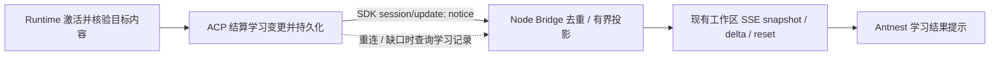

# Skill 学习完成提示：SDK notice 与可靠交付

> 更新日期：2026-09-30。
>
> 状态：技术方案；传输与字段已进入 [L0 合同](../contracts/skill-learning/learning-api.md)。
> 通知传输方式已按用户决定采用 SDK `notice`；可靠交付由 Server、Bridge 和 FE 负责。
> ACP 已发布持久结果；Node Bridge 已接收、去重、补读并投影 View/SSE。
> FE 呈现及去重已有组件测试，隔离 Docker 正常路径与部分故障路径已通过；
> 144项前端组件、5项基础浏览器及2项真实 Docker 浏览器回归通过，包含来源跳转、去重恢复与按需诊断。
> 按用户最新要求，开发阶段沿用已有样式；细调留在人类体验验收阶段，详见 [验收核对](skill-learning-acceptance-audit-20260930.md)。首版只提示已生效的学习结果。

## 1. 结论与协议事实

首版使用 **ACP SDK `session/update` 的 `notice`** 传递学习完成提示：ACP Service
先持久保存已确认的学习变更，再发 notice；Node Bridge 接收并投影到现有工作区
SSE，前端呈现 Antnest 系统消息。持久记录、恢复与去重由平台实现，后台学习
成功不依赖提示送达。上一版“内部 HTTP 长轮询作为实时通知主路径”的建议撤回。

“ACP 完全没有提示能力”需要修正。仓库 ACP Service 和 Agent UI 均固定使用
`@agentclientprotocol/sdk` **1.5.0**，本次核对安装包 `schema/schema.json`、
`dist/schema/types.gen.d.ts` 和连接 API，而不只依据文档列出的稳定类型。
[ACP 依赖](../services/agent-acp-service/package.json)、
[UI 依赖](../services/agent-ui/web/package.json)。

该 SDK 的 `SessionUpdate` 已包含 **UNSTABLE `notice`**。官方 RFD 当前为 Preview：
v1 客户端须声明 `clientCapabilities.session.notices: {}`；通知包含严重性、标题和
可选描述，但没有持久身份、回执或修改/撤销生命周期，也不应纳入 Session 回放。
平台采用其实时传输能力；业务记录负责持久身份与恢复，不将通知当作授权或
用户已读的证明，也不把学习记录混入 ACP 对话回放。
[官方 Session Notices](https://agentclientprotocol.com/rfds/session-notices)。

业务关联字段放在 notice 自带的 `_meta` 中，并通过现有 Bridge 能力约定版本，
不修改 SDK 的标准字段或另造推送方法。
[官方扩展机制](https://agentclientprotocol.com/protocol/v1/extensibility)。

Hermes 的完成提示从本次实际 Skill 工具结果提炼摘要，经 `_safe_print` 和
`background_review_callback` 输出。本平台应借鉴“依据真实变更报告结果”，
传递路径由当前架构决定。参考固定提交的
[汇总及回调](https://github.com/NousResearch/hermes-agent/blob/1b91b8eaa576b3c3dfe08e4592bdd698d1aca019/agent/background_review.py#L1210-L1280)
和 [源码研究](hermes-skill-learning-research-20260929.md)。

## 2. 当前系统能复用什么

| 现有部分 | 核对结果与需要补充的内容 |
| --- | --- |
| ACP SDK 接收链路 | [Node adapter](../services/agent-ui/web/server/src/adapters/acp-http.ts) 使用 SDK 的 `session/update` 回调，但 initialize 的 `clientCapabilities` 当前为空，没有协商 `notices` |
| ACP Server 发送链路 | [v1 agent](../services/agent-acp-service/src/transport/acp/v1/agent.ts) 已使用 SDK `connection.client.notify`，需要记录 notice 能力并增加学习结果发布；[SessionOutputStreams](../services/agent-acp-service/src/transport/acp/session-output.ts) 的读库/断连处理可参考，学习记录不进入它的对话游标 |
| Node 更新过滤 | [AgentOwner](../services/agent-ui/web/server/src/bridge/agent-owner.ts) 先找已缓存 Session，再过滤无交付标记的更新；notice 需在这两步之前独立分流，避免来源 Session 未缓存就被丢弃 |
| 系统消息样式 | [MessageView](../services/agent-ui/web/src/components/MessageView.tsx) 已有 `role=system` 的 Antnest 展示；它是前端表现类型，不是持久通知 API |
| 过程中的 notice | [CompactTranscript](../services/agent-ui/web/server/src/bridge/compact-transcript.ts) 用 `kind=notice` 保存中途回答，不等于 SDK Notice 或后台学习结果 |
| 浏览器传输 | [event-routes](../services/agent-ui/web/server/src/http/event-routes.ts) 和 [StreamJournal](../services/agent-ui/web/server/src/bridge/stream-journal.ts) 已提供 Agent 范围 SSE、游标、reset 和有界队列 |
| 网关路由 | [workspace bridge](../services/edge-gateway/internal/server/workspace_bridge.go) 已转发 Agent 范围的 GET/POST，并负责身份和 POST CSRF；学习结果查询沿用该前缀，具体业务路由由 Node 校验 |
| View 与客户端校验 | [Agent View](../services/agent-ui/web/server/src/protocol/agent-view-delta.ts) 是严格 schema，delta 字段也有白名单；[浏览器](../services/agent-ui/web/src/lib/bridge-stream.ts) 需要同步适配，不能只往 SSE 塞字段 |
| 独立后端读取 | [workspace observation](../services/agent-acp-service/src/transport/bridge-observation.ts) 已有受信身份下的内部 HTTP 查询先例；学习变更查询只承担恢复、历史及详情，不作为另一条常驻通知流 |

因此可以复用样式、认证和传输设施，但“发一条 system 文本”还不能完成持久、
去重和重连恢复的业务链路。尤其不能把通知塞进最后一个 Tool/Run 的过程列表。

### 2.1 Server 与 Bridge 两侧 SDK 核验

两侧分别核对各自的 package.json、lockfile、已安装 SDK 及运行时实现，不能只
根据 Bridge 类型声明推断 Server 支持。结果如下：

| 检查层 | ACP Server | Node Bridge |
| --- | --- | --- |
| 实际版本 | `services/agent-acp-service` 的 SDK 1.5.0 | `services/agent-ui/web` 的 SDK 1.5.0 |
| 类型及运行时 schema | `SessionUpdate`、`zSessionUpdate` 包含 notice；initialize 能解析 `session.notices` | 同样包含 notice，`onNotification` 能解析该更新并保留 `_meta` |
| 实际 API | `connection.client.notify(methods.client.session.update, params)` 可发送 | `client().onNotification(methods.client.session.update, handler)` 可接收 |
| 尚缺的业务接入 | 保存能力声明、发送前判断、从学习结果发布 | initialize 声明能力、独立分流 notice、投影/恢复及 FE |

本轮还分别加载两侧实际安装包，使用 Server SDK 的 `AcpServer.handleRequest`
与 Bridge SDK 的 `createHttpStream` 做串行能力探针。Fetch 在内存中转发真实
Request/Response 及 SSE 字节，没有开放端口或调用外部服务。5 项结果通过：

1. Server 收到 Bridge 的 `clientCapabilities.session.notices: {}`。
2. 模拟 prompt 已返回 `end_turn` 后，Server 发送的 notice 到达 Bridge SDK 回调；
   title、description 及命名空间 `_meta` 完整保留。
3. SDK 接受并保留未知 severity，前端仍需按协议中性展示。
4. 未打开 Session SSE 时，对该 Session 的 notice 不会通过连接级 SSE 送达；
   同连接打开该 Session 流后可读到待发消息，不能据此推断断连后的持久恢复。
5. 在隔离探针里省略能力声明后直接调用 `notify`，SDK 仍发送并解析了 notice。
   因此 **SDK 不自动执行发送前的能力门禁，Server 必须自行检查**。

记录：`artifacts/verification/skill-learning-sdk-notice-20260929/sdk-http-notice-probe.json`，
包含版本、入口摘要、执行时间及结果。源码另核对 SDK 的 `connection.js` 与
`http-stream.js`：前者按 sessionId 路由 mailbox，后者仅为已关联 Session 打开 SSE。
这验证了两侧 SDK 及其 HTTP/SSE 编解码能力，未验证本平台业务接入、真实网络、
故障恢复或 Docker 链路；这些仍属于 L3/L4/LI1。

## 3. SDK notice 主路径及能力协商



Node 在 initialize 中声明 `clientCapabilities.session.notices: {}`，并在既有
`_meta["antnest.dev/bridge"]` 中声明 L0 约定的 `learningNotices: 1`；Server 响应确认
后，双方采用下述关联字段与恢复合同。标准 notice 能力和平台恢复能力分别协商，
现有 `deliveryMark` 不隐含学习通知能力。字段已由 L0 冻结，ACP 和 Node Bridge
已实现；结果、来源跳转及按需诊断已通过组件与真实 Docker 浏览器回归，人类体验验收尚未进行。

L0 消息示例，业务字段全部位于 `update._meta`：

```json
{
  "sessionId": "delivery-session-id",
  "update": {
    "sessionUpdate": "notice",
    "severity": "info",
    "title": "已更新 Skill「接口故障排查」",
    "description": "补充了超时后的确认步骤。",
    "_meta": {
      "antnest.dev/skill-learning": {
        "version": 1,
        "changeId": "change-id",
        "sequence": "42",
        "agentId": "agent-id",
        "kind": "skill_updated",
        "sourceSessionId": "source-session-id",
        "sourceRunId": "source-run-id"
      }
    }
  }
}
```

SDK HTTP 传输不是 Agent 广播：只发给未订阅的来源 Session，Bridge 就收不到。
因此区分 **外层 sessionId（投递会话）** 与 **元数据 sourceSessionId（学习来源）**。
Skill 更新影响同 Agent 会话的后续执行，可作为已关联会话中的能力变化提示；
不能据此声称学习发生在投递会话。L0 固定以下平台路由约定：

- Server 记录连接经成功 new/load/resume 关联的真实 Session，close/delete/断连
  后清理；只向当前身份可访问、同 Agent 的关联会话发送。
- 来源会话仍关联时优先用它；否则选择该连接一个已关联会话承载提示。每个变更
  对每条连接只选一个投递会话；Bridge 收到后合并到 Agent 视图，按元数据标明
  来源。投递不依赖来源 transcript 是否仍在 Node 内存。
- 没有可用投递会话时保留学习记录，下一次关联会话/记录同步恢复；不为提醒
  创建伪会话，也不向所有历史 Session 盲发或强制订阅。
- 来源已删除或不可访问时，元数据省略来源 ID，查询按权限给出 Agent 级结果。
  多来源合并保留真实主要来源，详情仅列出当前有权查看的其它来源。

该路由及元数据属于平台协商的学习语义。普通 ACP 客户端仍接收属于其已关联
会话的标准 notice，不要求它实现 Agent 范围聚合。

未声明标准 notice 能力的客户端不接收该更新；只支持标准 notice 的客户端可以
呈现标题/描述，平台不承诺它具有历史恢复和撤销入口。Bridge 遇到没有平台关联
字段的普通 notice 时只作普通提示；未知 severity 作中性呈现，未知扩展版本不
推断业务操作权限。缺少恢复能力时明确显示学习记录功能不可用，不影响聊天。

浏览器继续只连 Node 的现有 SSE，实时提示不增加私有 ACP 推送、HTTP 长轮询或
第二条浏览器通知连接。学习不因 Node 无观察者或重启而停止。

## 4. 持久化、身份与成功边界

复用学习主方案的 **ACP 变更记录**，以已应用的记录生成通知投影；不新增
通用通知中心、消息队列或一套复制 Skill 正文的通知数据库。

1. Runtime 已完成目录操作并返回内容核验结果后，ACP 在本地事务中结算变更、
   保存来源和通知排序身份，再通过 SDK 发送成功 notice。Runtime 文件效果与 ACP
   数据库不是一个事务：应答丢失先按主方案观察恢复，不能先宣告学会。
2. 变更及投影身份稳定，重试/恢复不会再生成第二个成功事件。通知序号按 Agent
   的已提交顺序发布；不能把尚未提交的序号当作 high watermark，以免漏掉迟提交
   的记录。L0 已固定提交顺序与封闭水位语义，L3 落实同事务分配与查询。
   每次实际应用有独立 changeId；相同操作重试仍返回原 changeId，避免重复提示。
3. 只有 `applied` 才显示“已新增/更新 Skill”；生成候选、检查通过或等待空闲都
   不算完成。无新经验、正常抢占和冷却不产生成功提示。
   失败/暂停的原因在学习状态中展示，避免每次重试重复弹出警告。
4. 通知文本由固定模板和结构化事实生成；Skill 名称按纯文本处理。模型给出的
   总结不能直接宣称已应用，通知也不承载正文、密钥、原始工具输出或 Trace。

L0 已冻结的投影字段如下；类型见 [共享 schema](../contracts/skill-learning/learning-api.schema.json)：

| 字段 | 含义 |
| --- | --- |
| `changeId` / 前端 `noticeId` | 持久学习变更的稳定身份；Bridge/FE 用 changeId 作为本地 noticeId，不为标准 ACP Notice 添加顶层 ID |
| `sequence` / `occurredAt` | 前者用于同 Agent 排序/补读，后者只作展示，不按跨进程时间戳去重 |
| `agentId` / `kind` | Agent 范围，类型首版为 `skill_created`、`skill_updated` |
| `sourceSessionId` / `sourceRunId` | 主要来源，可以为空；来源被删除或无权访问时不提供跳转 |
| `skillName` / `changeSummary` | 有界纯文本，用于结果提示 |

关联元数据只携带呈现/定位需要的子集，其余从学习记录读取。它证明的是平台结果
关联，不是“SDK 已确认送达”；重复收到同 changeId 的 notice 由 Bridge/FE 合并。
费用、维护状态和全部证据以学习记录/当前权限为准；没有任何字段表示“用户已读”
或“用户已授权”。

## 5. Server、Bridge 和 FE 的可靠性职责

### 5.1 Server：先保存结果，再发布 notice

学习变更记录就是持久来源，不另建消息队列或通用通知中心。发布器按已提交记录
向符合能力/权限的连接发送 SDK notice，发送游标只表示连接处理进度，不表示
用户已读。学习事务提交后先唤醒发布器；唤醒只是加速信号，发布器还须在启动、
订阅建立和有界周期检查时核对持久水位，覆盖“已提交，但发送回调没有执行且
进程仍存活”的情况。周期检查只处理存在订阅的 Agent，共享读库、有界分页，
不为每个前端标签页建立一个扫描器；具体唤醒周期在 L3 的有界发布器实现中定值并测试。

发送失败保留待处理位置，有界重试；连接写入不能继续或队列超限时关闭故障
连接，让 Bridge 走既有重连和补读。后台发布不等待前景 Run，也不能因通知慢
拖住 Run 输出或无限积压。数据库提交后进程崩溃，由重连补读恢复；Runtime 已
写入但 ACP 未结算则先执行学习恢复，绝不能从模型摘要生成“成功”通知。

### 5.2 Bridge：接收 SDK notice，补齐业务记录

实时消息经过 SDK 回调，在 `AgentOwner.onUpdate` 中先独立分流 notice，再处理
原有 Session 缓存和输出 delivery mark。核对连接的组织/主体/Agent、已关联投递
会话、元数据版本及范围后合并到有界系统提示投影；来源 transcript 未缓存不应
导致消息消失，也不因此加载全部来源历史。关联会话状态与 transcript 缓存分开，
不能把“未缓存”推断为“SDK 已订阅”或“无权访问”。鉴权失败立即清除私有视图。

初次观察、新会话关联、ACP 重连、Node 重启、浏览器恢复前台或发现缺口时，
执行有界学习记录同步。L0 已固定学习结果查询端点：

```text
GET /rpc/agent-acp/workspace/agents/{agentId}/learning-changes
    ?after={opaqueCursor}&limit=20
```

请求沿用可信组织/主体/Agent 身份，并检查当前 Agent 访问权；不得使用管理审计
权限替代普通使用者权限。首次读取返回有界最近列表及已封闭的 high watermark，
后续按 `after` 补读，没有变化立即返回。**此查询用于业务记录恢复/历史，不是
通知长轮询**。学习游标不等于 Session appendVersion、outputWatermark 或 Node
SSE cursor，也不复用 `antnest.dev/delivery`。不在 `session/load` 中回放旧 notice；
恢复的是平台学习记录，标准 ACP notice 保持实时提示语义。

先建立 notice 接收，再同步快照/封闭水位，同步期间的实时消息进入有界暂存，
随后按 changeId 合并；不能让较旧的查询结果覆盖刚收到的新结果。到达的最大
sequence 只作为观察值，不能据此跳过尚未补读的较早记录；补读游标只按服务端
封闭水位/分页响应推进。权限过滤导致序号不连续时不误判丢包。

同一 Node owner（组织、主体、Agent）共用接收状态和一次在途同步，多页面不
各自读取。每页建议 20 条、每条投影最多 2 KiB，实时暂存、去重集合、列表和
分页都计入既有 owner/全局内存上限；首版按该上限实现。超过容量就要求重新
同步近期快照，旧记录按需分页，不保留无限 ID 集合，也不挤掉活动 Run 输出。
超过保留范围的游标明确要求重新取快照，不能假装没有漏项。无浏览器观察者时
不保留无界通知积压，再次进入从记录恢复；释放订阅不取消已受理 Run 或学习。

Node 将有界列表放进 L0 约定的 `AgentView.systemNotices`，同步扩展严格 DTO、delta
白名单及前端 reducer。继续使用现有 `snapshot/delta/reset`，无需新增 SSE 类型。
提示变化只推进工作区 stream revision，不推进 Prompt appendVersion、ACP 输出
交付水位、Run 状态或 permission generation。Node 重启重新读取学习记录；SSE
旧 cursor 失效按已有 reset 处理，不能把 Node 的内存日志当持久业务权威。

### 5.3 FE：从投影恢复、去重和呈现

初次快照/恢复补读显示历史记录，默认不逐条 toast；当前连接的新 notice 可轻量提示。
前端按 noticeId 去重，同一页面不出现重复行；多个页面各自展示是正常现象，首版
不建设跨设备已读回执或承诺 exactly-once 弹窗。读取暂时失败显示学习信息暂不可用，
保留已知记录并退避重试，不能让聊天或 Agent 执行状态变成失败。
浏览器 SSE 断线优先续接已有游标，失效就 reset/取快照；刷新不依赖 localStorage
作为权威。当前权限撤销或主体/Agent 切换时取消旧观察并清除对应展示。

可靠性的目标是已提交结果可恢复、重复交付不重复呈现业务条目；不把人是否
读到、是否关闭提示或是否离线当作 Skill 已应用的条件。

## 6. 系统消息展示与操作

建议文案示例：

> Antnest · 已更新 Skill「接口故障排查」，补充了超时后的确认步骤。

这里的系统消息是**产品展示项**，与发给模型的 `role=system` 完全分开。通知
不写入 ACP 对话消息、不进入 ContextBuilder、历史压缩或下一次学习证据。下一
Run 通过 Runtime 的正常 Skill 发现/读取获得新内容，避免提示本身再触发学习。
前端采用独立的 SystemNotice 展示数据及稳定 noticeId，复用样式，不通过伪造
普通 Message 或 Tool 来绕过当前 View/过程分组模型。

- 当前会话是来源会话时，显示独立的系统提示项，关联来源 Run；它不属于该 Run
  的工具过程，不会被过程折叠隐藏，也不延长“正在执行”。
- 学习可能延后完成。提示保留真实完成时间，不能伪造为来源回答完成时就已学会；
  渲染位置须稳定关联来源，不按“此刻最后一个 Run”自动归组。若来源轮次不在当前
  页，显示简短提示和来源跳转，不为通知自动加载全部历史或改变滚动位置。
- 用户已切到同 Agent 的另一会话时，使用 Agent 范围提示并标明来源；不往新会话
  追加一条伪造的助手回答。多个来源合并时只显示一条结果，详细页列出有权查看的来源。
- 当前只观察选中的 Agent；切到其他 Agent 后不串发，回来可从学习记录找回。
  首版不为全部 Agent 常驻订阅。会话已删除时，Agent 学习记录可保留，但链接及
  来源详情必须按当前权限处理。
- 简短通知使用非打断的 `role=status` / polite 提示，不抢焦点；操作是固定的
  站内按钮，不执行模型提供的 URL 或 HTML。视觉沿用 Antnest 系统样式，具体
  预览待 UI 批次给用户确认后再做界面回归。

首版只展示学习结果和来源，不从提示发起写操作。若未来增加其他操作，须另定
合同与权限检查；通知本身不是授权。

## 7. 交付位置与验收

并入学习批次：L0 已定义标准能力协商、平台关联元数据、投递/来源会话路由、学习记录
恢复及工作区字段；L3 交付 ACP 持久结果、SDK notice 发布/重试及权限查询；L4
交付 Node SDK 接收/补读、SSE 与前端展示；LI1 覆盖从真实应用到提示、刷新及
后续 Run 使用的完整链路。仍按服务批次本地通过后集成，不新增通知服务。

| 必须覆盖的情形 | 预期 |
| --- | --- |
| 候选生成但未激活 | 不出现“已学会/更新成功” |
| 标准/平台能力未协商、扩展版本未知 | 按协商边界发送/降级；未知元数据不能生成业务操作 |
| 应用成功后断线、Node/ACP 重启 | 从持久结果恢复同一 noticeId，不重做学习 |
| 结果提交后尚未发送、唤醒丢失、发送失败 | 持久水位核对/有界重试或重连恢复，不能永远静默丢失 |
| Runtime 已成功但 ACP 尚未结算 | 先观察结算；成功记录出现后才提示，不能靠模型总结推定 |
| notice 在补读期间到达、乱序及重复到达 | 同 changeId 合并；旧快照不覆盖新结果，不越过未补齐水位 |
| 切会话、跨 Agent、来源删除 | 正确归属和权限，不污染正在看的聊天，不暴露不可访问来源 |
| 来源 Session 未缓存或无活动 Run | notice 仍可独立投影，不加载整个 transcript，不改变 Run 状态 |
| 来源未订阅、投递会话关闭、连接无关联 Session | 使用同 Agent 的真实关联会话或等待记录恢复，不盲发到未打开的 Session 流；来源身份不变 |
| 重试、多个页面、慢 SSE、游标过期 | 结果幂等、单页去重、有界内存、reset/补读可恢复 |
| 最新 Run 已完成，之后才出现学习提示 | 原 Run stopReason、输出水位和完成时间保持原事实 |
| 通知展示后开始下一 Run | 通知不进入模型上下文/复盘证据，新 Skill 通过正常读取使用 |

SDK notice 是本轮选定的实时通道；Server/Bridge/FE 的持久化、补读与去重是
平台合同。两侧 SDK 能力探针、ACP/Node 局部门禁及隔离 Docker 正常/故障恢复
链路已通过；前端组件与真实 Docker 浏览器业务回归现已通过。功能验收不再以样式审批为前置条件，人类体验验收另行进行。
