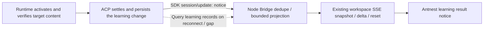

# Skill Learning Notifications

This document describes how Antnest tells users that background Skill learning
has produced an applied change. It covers the ACP SDK `notice` transport,
capability negotiation, delivery-session routing, and how the ACP Service, the
Node Bridge, and the browser keep delivery reliable through persistence,
deduplication, and recovery. The transport and field contract is defined in the
[Skill learning API contract](../contracts/skill-learning/learning-api.md). Only
learning results that have taken effect produce a notification.

## 1. Decisions and Protocol Facts

Learning completion notices travel as an **ACP SDK `session/update` `notice`**.
The ACP Service first persists the confirmed learning change and then sends the
notice. The Node Bridge receives it and projects it into the existing workspace
SSE stream, and the browser renders it as an Antnest system message. The platform
implements persistence, recovery, and deduplication itself. Background learning
succeeds whether or not the notice is delivered. Internal HTTP long polling is
not used as a real-time notification path.

ACP does provide a notification capability. The ACP Service and Agent UI both pin
`@agentclientprotocol/sdk` **1.5.0**. The capability was confirmed against the
installed package's `schema/schema.json`, `dist/schema/types.gen.d.ts`, and
connection API, not only the stable types listed in the documentation. See the
[ACP Service dependencies](../services/agent-acp-service/package.json) and the
[Agent UI dependencies](../services/agent-ui/web/package.json).

In this SDK, `SessionUpdate` includes an **UNSTABLE `notice`** variant. The
upstream RFD is in Preview. A v1 client must declare
`clientCapabilities.session.notices: {}`. A notice carries a severity, a title,
and an optional description. It has no durable identity, no receipt, and no
update or retraction lifecycle, and it should not be part of Session replay. The
platform uses notices only as a real-time transport. Business records own durable
identity and recovery. A notice is never treated as proof of authorization or
proof that the user has read it, and learning records are never mixed into ACP
conversation replay. See the upstream
[Session Notices RFD](https://agentclientprotocol.com/rfds/session-notices).

Business correlation fields live in the notice's own `_meta`. Their version is
negotiated through the existing Bridge capability object. The platform does not
change the SDK's standard fields and does not add a custom push method. See the
upstream [extensibility mechanism](https://agentclientprotocol.com/protocol/v1/extensibility).

The notice text reports the actual Skill change that learning committed. It is
derived from the persisted change record, not from a separate model summary.

## 2. Reused Building Blocks

| Component | Role in learning notices |
| --- | --- |
| ACP SDK receive path | The [Node adapter](../services/agent-ui/web/server/src/adapters/acp-http.ts) uses the SDK `session/update` callback. Its initialize request declares `clientCapabilities.session.notices: {}` and `learningNotices: 1` in `_meta["antnest.dev/bridge"]`. |
| ACP Server send path | The [v1 agent](../services/agent-acp-service/src/transport/acp/v1/agent.ts) records whether the client declared notice support, subscribes to persisted learning changes, and sends each one with SDK `connection.client.notify`. [SessionOutputStreams](../services/agent-acp-service/src/transport/acp/session-output.ts) handles database reads and disconnects for conversation output; learning records do not enter its conversation cursor. |
| Node update filtering | [AgentOwner](../services/agent-ui/web/server/src/bridge/agent-owner.ts) checks for a learning notice before it looks up the cached Session and before it filters updates without a delivery mark. A notice is therefore not dropped when its source Session is not cached. |
| System message styling | [MessageView](../services/agent-ui/web/src/components/MessageView.tsx) already renders Antnest messages with `role=system`. This is a frontend presentation type, not a durable notification API. |
| In-progress notices | [CompactTranscript](../services/agent-ui/web/server/src/bridge/compact-transcript.ts) uses `kind=notice` to store intermediate answers. This is unrelated to SDK notices and to background learning results. |
| Browser transport | [event-routes](../services/agent-ui/web/server/src/http/event-routes.ts) and [StreamJournal](../services/agent-ui/web/server/src/bridge/stream-journal.ts) provide Agent-scoped SSE with cursors, reset, and bounded queues. |
| Gateway routing | The [workspace bridge](../services/edge-gateway/internal/server/workspace_bridge.go) forwards Agent-scoped GET and POST requests and enforces identity and POST CSRF checks. Learning result queries use the same prefix; Node validates the specific business routes. |
| View and client validation | The [Agent View](../services/agent-ui/web/server/src/protocol/agent-view-delta.ts) is a strict schema with an allow-list of delta fields. The [browser stream client](../services/agent-ui/web/src/lib/bridge-stream.ts) must accept the same fields; new data cannot simply be added to the SSE payload. |
| Separate backend reads | [Workspace observation](../services/agent-acp-service/src/transport/bridge-observation.ts) is the precedent for internal HTTP queries under a trusted identity. Learning change queries serve only recovery, history, and detail views. They are not a second long-lived notification stream. |

These parts supply styling, authentication, and transport. Sending a plain system
text message is not enough to provide durable storage, deduplication, and
reconnect recovery. In particular, a notice must never be appended to the process
list of the last Tool call or Run.

### 2.1 SDK Support on the Server and Bridge

Each side was checked against its own `package.json`, lockfile, installed SDK, and
runtime implementation. Server support is not inferred from the Bridge type
declarations.

| Layer | ACP Server | Node Bridge |
| --- | --- | --- |
| Installed version | SDK 1.5.0 in `services/agent-acp-service` | SDK 1.5.0 in `services/agent-ui/web` |
| Types and runtime schema | `SessionUpdate` and `zSessionUpdate` include notice; initialize parses `session.notices` | Also includes notice; `onNotification` parses the update and keeps `_meta` |
| API | `connection.client.notify(methods.client.session.update, params)` sends | `client().onNotification(methods.client.session.update, handler)` receives |
| Platform integration | Stores the capability declaration, checks it before sending, publishes from persisted learning results | Declares the capability in initialize, routes notices separately, projects and recovers them, renders them in the browser |

A serial in-memory probe loaded both installed packages and connected the Server
SDK's `AcpServer.handleRequest` to the Bridge SDK's `createHttpStream`. Fetch
forwarded real Request/Response objects and SSE bytes in memory, without opening
ports or calling external services. The probe established these SDK behaviors:

1. The Server receives the Bridge's `clientCapabilities.session.notices: {}`.
2. After a simulated prompt returns `end_turn`, a notice sent by the Server
   reaches the Bridge SDK callback with its title, description, and namespaced
   `_meta` intact.
3. The SDK accepts and preserves an unknown severity. The frontend must still
   display it neutrally, as the protocol requires.
4. When the Session SSE stream is not open, a notice for that Session is not
   delivered over the connection-level SSE stream. Once the same connection opens
   that Session's stream, the pending message can be read. This does not imply
   durable recovery after a disconnect.
5. When the capability declaration is omitted and the Server calls `notify`
   anyway, the SDK still sends and parses the notice. **The SDK does not enforce a
   capability check before sending, so the Server must check it itself.**

The SDK sources confirm this: `connection.js` routes mailboxes by `sessionId`, and
`http-stream.js` opens SSE only for associated Sessions. The probe covers the two
SDKs and their HTTP/SSE encoding. It does not cover platform integration, real
networking, failure recovery, or the Docker deployment.

## 3. SDK Notice Path and Capability Negotiation



During initialize, Node declares `clientCapabilities.session.notices: {}` and
declares `learningNotices: 1` in the existing `_meta["antnest.dev/bridge"]` object.
After the Server confirms in its response, both sides use the correlation fields
and recovery contract below. The standard notice capability and the platform
recovery capability are negotiated separately. The existing `deliveryMark`
capability does not imply learning notice support.

Example message. All business fields are in `update._meta`:

```json
{
  "sessionId": "delivery-session-id",
  "update": {
    "sessionUpdate": "notice",
    "severity": "info",
    "title": "Added a confirmation step after timeouts.",
    "description": "Skill 学习结果已保存。",
    "_meta": {
      "antnest.dev/skill-learning": {
        "version": 1,
        "changeId": "change-id",
        "sequence": "42",
        "agentId": "agent-id",
        "kind": "skill_updated",
        "occurredAt": "2026-01-01T00:00:00.000Z",
        "skillName": "api-incident-triage",
        "changeSummary": "Added a confirmation step after timeouts.",
        "sourceSessionId": "source-session-id",
        "sourceRunId": "source-run-id"
      }
    }
  }
}
```

The ACP Service sets `title` to the change summary and uses a fixed
`description`. The Bridge accepts a learning notice only when `severity` is
`info`, `version` is `1`, `agentId` matches the Agent, `kind` is `skill_created`
or `skill_updated`, and `title` equals `changeSummary`.

SDK HTTP transport is not an Agent-wide broadcast. A notice sent to a source
Session that the Bridge has not subscribed to never reaches the Bridge. The
contract therefore separates the **outer `sessionId` (delivery Session)** from the
**metadata `sourceSessionId` (learning source)**. A Skill update affects later
execution in every Session of the same Agent, so it can be shown in any associated
Session as a capability change. That does not mean the learning happened in the
delivery Session. The platform routing rules are:

- The Server tracks the real Sessions that a connection has associated through a
  successful new, load, or resume, and removes them on close, delete, or
  disconnect. It sends only to associated Sessions of the same Agent that the
  current identity can access.
- If the source Session is still associated, it is preferred. Otherwise the
  Server picks one associated Session on that connection to carry the notice.
  Each change uses exactly one delivery Session per connection. The Bridge merges
  received notices into the Agent view and labels the source from the metadata.
  Delivery does not depend on the source transcript being in Node memory.
- If no delivery Session is available, the learning record is kept. It is
  recovered on the next Session association or record sync. The platform does not
  create placeholder Sessions for notices, does not send to every historical
  Session, and does not force subscriptions.
- If the source has been deleted or is no longer accessible, the metadata omits
  the source IDs and queries return Agent-level results according to permissions.
  When several sources are merged, the real primary source is kept, and details
  list only the other sources the viewer can currently access.

This routing and metadata are platform-negotiated learning semantics. A generic
ACP client still receives standard notices for its own associated Sessions and is
not required to implement Agent-scoped aggregation.

A client that does not declare the standard notice capability does not receive
the update. A client that supports only standard notices can show the title and
description; the platform does not promise it history recovery or a retraction
entry point. When the Bridge receives an ordinary notice without platform
correlation fields, it treats it as an ordinary message. An unknown severity is
displayed neutrally, and an unknown extension version never grants business
actions. When recovery support is missing, the UI states that learning records
are unavailable; chat is not affected.

The browser keeps connecting only to the existing Node SSE stream. Real-time
notices add no private ACP push, no HTTP long polling, and no second browser
notification connection. Learning continues when Node has no observers or
restarts.

## 4. Persistence, Identity, and the Success Boundary

Notifications reuse the **ACP change record** from the main learning design.
Applied records produce a notification projection. There is no general
notification center, no message queue, and no notification database that copies
Skill bodies.

1. The Runtime completes the catalog operation and returns the content
   verification result. ACP then settles the change in a local transaction and
   stores the source and the notice ordering identity. Only after that does it send
   the success notice through the SDK. The Runtime file effect and the ACP database
   are not one transaction. If the reply is lost, ACP first recovers by observation
   as the main design describes. It never announces that a Skill was learned before
   the change is settled.
2. The change and its projection have stable identities. Retries and recovery do
   not produce a second success event. Notice sequence numbers are published in the
   Agent's commit order. A sequence number that is not yet committed is never used
   as a high watermark, so late commits are not skipped. Commit order and sealed
   watermark semantics are fixed by the shared contract. ACP assigns sequence
   numbers and serves queries in the same transaction. Each actual application has
   its own `changeId`. A retry of the same operation returns the original
   `changeId`, so the user does not see a duplicate notice.
3. Only `applied` shows "Skill created" or "Skill updated". A generated candidate,
   a passed check, or a wait for idle does not count as completion. No new
   experience, normal preemption, and cooldown produce no success notice. The
   learning status shows failure and pause reasons, so retries do not raise the same
   warning again and again.
4. Notice text comes from fixed templates and structured facts. Skill names are
   treated as plain text. A model-written summary cannot claim that a change was
   applied. A notice never carries the Skill body, secrets, raw tool output, or
   traces.

The projection fields are fixed as follows. The types are defined in the
[shared schema](../contracts/skill-learning/learning-api.schema.json).

| Field | Meaning |
| --- | --- |
| `changeId` / frontend `noticeId` | Stable identity of the persisted learning change. The Bridge and frontend use `changeId` as the local `noticeId`. No top-level ID is added to the standard ACP notice |
| `sequence` / `occurredAt` | `sequence` orders and backfills notices within one Agent. `occurredAt` is for display only. Deduplication never uses timestamps across processes |
| `agentId` / `kind` | Agent scope. The supported kinds are `skill_created` and `skill_updated` |
| `sourceSessionId` / `sourceRunId` | Primary source. Both can be empty. If the source is deleted or not accessible, no link is offered |
| `skillName` / `changeSummary` | Bounded plain text used in the result notice |

The correlation metadata carries only the subset needed for presentation and
navigation. Everything else is read from the learning record. The metadata shows
that a notice is linked to a platform result. It does not prove that the SDK
delivered the notice. The Bridge and frontend merge repeated notices with the same
`changeId`. Cost, maintenance state, and full evidence come from the learning record
under the current permissions. No field means "read by the user" or "authorized by
the user".

## 5. Reliability Responsibilities of the Server, Bridge, and Frontend

### 5.1 Server: Persist the Result, Then Publish the Notice

The learning change record is the durable source. There is no separate message
queue or general notification center. The publisher sends SDK notices from
committed records to connections that have the required capability and
permissions. The send cursor tracks connection progress only. It does not mean the
user has read anything. After a learning transaction commits, it wakes the
publisher. The wakeup only speeds things up. The publisher also checks the
persisted watermark at startup, when a subscription is established, and on a
bounded periodic check (every 5 seconds). This covers the case where a record is
committed but the send callback never ran while the process stayed alive. The
periodic check covers only Agents that have subscriptions. It reads from a shared
database query with bounded pages. It does not create one scanner per browser tab.

A failed send keeps its pending position and is retried a bounded number of times.
If a connection cannot accept more writes, or its queue exceeds the limit, the
publisher closes the faulty connection. The Bridge then uses its existing reconnect
and backfill path. Background publishing does not wait for a foreground Run. A slow
notice never holds back Run output or builds an unbounded backlog. If the process
crashes after the database commit, reconnect backfill recovers the notice. If the
Runtime wrote the change but ACP has not settled it, learning recovery runs first.
A "success" notice is never generated from a model summary.

### 5.2 Bridge: Receive SDK Notices and Backfill Business Records

Live messages arrive through the SDK callback. `AgentOwner.onUpdate` routes notices
separately before it handles the existing Session cache and output delivery marks.
The Bridge checks the connection's organization, principal, and Agent, the linked
delivery session, the metadata version, and the scope. It then merges the notice
into a bounded system notice projection. A notice does not disappear because the
source transcript is not cached, and the Bridge does not load the full source
history to show it. Linked session state is tracked apart from the transcript
cache. "Not cached" does not imply "subscribed through the SDK" or "not
accessible". An authentication failure clears the private view at once.

The Bridge runs a bounded learning record sync on first observation, when a new
session is linked, after an ACP reconnect, after a Node restart, when the browser
returns to the foreground, and when it detects a gap. The learning result query
endpoint is:

```text
GET /rpc/agent-acp/workspace/agents/{agentId}/learning-changes
    ?after={opaqueCursor}&limit=20
```

The request uses the trusted organization, principal, and Agent identity, and it
checks current access to the Agent. Admin audit permissions never replace ordinary
user permissions. The first read returns a bounded list of recent changes and the
sealed high watermark. Later reads backfill with `after`, and return at once when
nothing has changed. **This query recovers business records and history. It is not
a notification long poll.** The learning cursor is not the Session
`appendVersion`, `outputWatermark`, or the Node SSE cursor, and it does not reuse
`antnest.dev/delivery`. Old notices are not replayed in `session/load`. Recovery
restores platform learning records. The standard ACP notice keeps its live-hint
meaning.

The Bridge starts receiving notices first, then syncs the snapshot and sealed
watermark. Live messages that arrive during the sync go into a bounded staging
buffer and are then merged by `changeId`. An older query result never overwrites a
newer notice that has just arrived. The highest `sequence` received is only an
observed value. It never justifies skipping earlier records that have not been
backfilled. The backfill cursor advances only from the server's sealed watermark
and page responses. Gaps in sequence numbers caused by permission filtering are not
treated as lost messages.

One Node owner (organization, principal, Agent) shares its receive state and one
in-flight sync. Multiple pages do not each read separately. A page holds 20 items,
and each projection is at most 2 KiB. The staging buffer, deduplication set, list,
and pages all count toward the existing per-owner and global memory limits. When
capacity is exceeded, the Bridge requests a fresh sync of the recent snapshot and
pages older records on demand. It does not keep an unbounded ID set, and it never
evicts active Run output. A cursor beyond the retention range explicitly requires a
new snapshot rather than pretending nothing was missed. With no browser observer,
the Bridge keeps no unbounded notice backlog. The next visit recovers from the
records. Releasing a subscription does not cancel an accepted Run or learning.

Node puts the bounded list in `AgentView.systemNotices` and extends the strict DTO,
the delta allowlist, and the frontend reducer to match. It keeps using the existing
`snapshot`/`delta`/`reset` events and adds no SSE type. A notice change advances
only the workspace stream revision. It does not advance the Prompt
`appendVersion`, the ACP output delivery watermark, the Run state, or the
permission generation. After a Node restart, Node reads the learning records again.
An invalid old SSE cursor is handled with the existing reset. Node's in-memory log
is never the durable business authority.

### 5.3 Frontend: Recover, Deduplicate, and Present from the Projection

The initial snapshot and recovery backfill show history and do not raise a toast
for each item by default. New notices on the current connection can show a light
hint. The frontend deduplicates by `noticeId`, so one page never shows the same row
twice. Several pages each showing the notice is expected. There are no cross-device
read receipts, and exactly-once popups are not promised. If a read fails for a
while, the frontend shows that learning information is temporarily unavailable,
keeps the known records, and retries with backoff. Chat and Agent execution state
are never marked as failed because of this. After a browser SSE disconnect, the
frontend first resumes from the existing cursor. If the cursor is invalid, it resets
and takes a snapshot. A refresh never treats `localStorage` as authoritative. When
current permissions are revoked, or the user switches principal or Agent, the
frontend cancels the old observation and clears the related display.

The reliability goal is that committed results can be recovered and that repeated
delivery never shows a business item twice. Whether a person read the notice,
dismissed it, or was offline is never a condition for a Skill being applied.

## 6. System Notice Display and Actions

Example text:

> Antnest · Updated Skill "API failure troubleshooting" with a confirmation step after timeouts.

A system notice here is a **product display item**. It is fully separate from the
`role=system` messages sent to the model. Notices are not written to ACP
conversation messages. They do not enter the ContextBuilder, history compaction,
or evidence for the next learning pass. The next Run gets the new content through
normal Runtime Skill discovery and reads, so the notice itself cannot trigger more
learning. The frontend uses separate SystemNotice display data with a stable
`noticeId` and reuses existing styles. It does not fake an ordinary Message or Tool
item to work around the current View and process grouping model.

- When the current session is the source session, the notice appears as its own
  system item linked to the source Run. It is not part of that Run's tool process,
  process folding does not hide it, and it does not extend the "running" state.
- Learning can finish later. The notice keeps the real completion time and never
  pretends the Skill was learned when the source answer finished. Its position is
  stably tied to the source and is not grouped under whichever Run is last at the
  moment. If the source turn is not on the current page, the frontend shows a short
  notice with a link to the source. It does not load the full history or change the
  scroll position for the notice.
- If the user has switched to another session of the same Agent, the frontend shows
  an Agent-scoped notice that names the source. It does not append a fake assistant
  reply to the new session. When several sources are merged, only one result is
  shown, and the detail view lists the sources the user may see.
- Only the selected Agent is observed. After switching to another Agent, notices do
  not leak across, and returning recovers them from the learning records. There is
  no permanent subscription for every Agent. If a session is deleted, the Agent's
  learning record can remain, but links and source details follow current
  permissions.
- Short notices use a non-interrupting `role=status` / polite announcement and do
  not take focus. Actions are fixed in-app buttons. Model-supplied URLs or HTML are
  never executed. The visuals follow the Antnest system style.

Notices show only the learning result and its source. No write action starts from a
notice. Any future action needs its own contract and permission checks. A notice is
never an authorization.

## 7. Service Ownership

Notifications are part of the learning feature and add no notification service.

| Owner | Responsibility |
| --- | --- |
| Shared contract ([learning API](../contracts/skill-learning/learning-api.md)) | Standard capability negotiation, platform correlation metadata, delivery and source session routing, learning record recovery, and workspace fields |
| `agent-acp-service` | Persisted learning results, SDK notice publishing and retry, and the permission-checked `learning-changes` query |
| `agent-ui` (Node Bridge and web) | SDK notice receipt and backfill, the `AgentView.systemNotices` projection over SSE, and frontend display |

The SDK notice is the live channel. Persistence, backfill, and deduplication across
the server, Bridge, and frontend form the platform contract.
