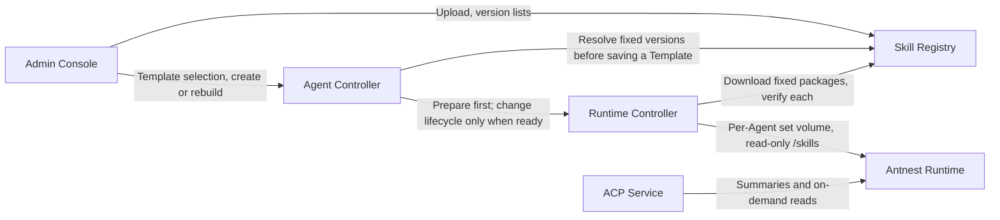

# Skill Registry Minimal Design

This document describes the minimal Skill Registry design: managed Skill
packages, frozen Skill references in Agent Templates, and read-only delivery of
those Skills to the Runtime. It is the design baseline for the
[Stage 4 services](stage-4-services.md) Skill contracts and implementation.

The design has three goals: the Registry hosts Skill packages, a template
revision freezes exact Skill versions, and the Runtime Controller delivers them
to the Runtime as read-only files.

Dynamic discovery extends this baseline with a four-step product flow: an
Agent's Skills are projected into the Registry automatically, other Agents
search and temporarily use them, a user promotes a projected Skill to a system
Skill, and Template/rebuild delivers it as a preset. A projection only records
a dynamic source mapping; its content and lifecycle stay with the source
Agent. Only promotion makes the Registry host the complete package with the
formal version lifecycle described here. See the
[discovery and promotion contract](../contracts/skill-registry/discovery-api.md)
and [Skill deployment](skill-deployment.md).

Deployments start from a fresh database. There is no data migration from
legacy shared Skill volumes (see section 9.1).

## 1. Goals and Decisions

The design delivers the following chain:

1. An administrator uploads a Skill package. The Registry stores immutable
   versions and serves internal downloads.
2. An Agent Template selects exact versions, which are frozen with the template
   revision and copied into the AgentSpec at creation.
3. The Runtime Controller (RC) prepares the complete set before any lifecycle
   change and then delivers it read-only to the Runtime. Updates happen through
   a new template revision and an explicit rebuild.

This document calls template-delivered assets with Runtime `source=system`
**system Skills**: the baseline capabilities preset by the template. Workspace
assets with `source=personal` are **personal Skills**. System Skills do not
upgrade automatically when a new package is published, the template is edited,
or a normal Run executes. A rebuild to the same revision keeps the same
versions. A rebuild can add, remove, upgrade, or roll back system Skills, and
always keeps the workspace and personal Skills.

The following choices are fixed by the shared contract and are not left to
individual service implementers:

| Question                              | Design decision                                                                                                         |
| ------------------------------------- | ----------------------------------------------------------------------------------------------------------------------- |
| Legacy instruction-text channel       | `skill_instructions` is deprecated and permanently empty; keeping the field does not mean it may be filled later        |
| Package and Runtime format agreement  | Check the real YAML node types and delimiter format; shared samples run through the actual Go and Rust parsing paths    |
| Registry failure and lifecycle        | Prepare sets independently, durably, and idempotently; before Initialize on create, before Drain/Fence on rebuild       |
| Timeouts and reuse                    | Preparation does not use the Runtime mutation timeout; per-package progress is saved; volumes reused by Agent and digest |
| Recovery                              | Verify the real volume on recovery; never treat a missing volume or legacy shared content as an empty set               |

The design does not include external synchronization, search recommendations,
community features, review or evaluation, dependency installation, release
tags, hot reload, or a Skill execution engine. Converting a personal Skill into
a system Skill outside the discovery flow is a manual step: export it and have
an administrator upload it. Projection, discovery, temporary use, and user
promotion map to the source on demand; after promotion the Skill is formally
hosted and follows the template freezing and explicit rebuild rules in this
document. Personal learning works on its own and does not require the Registry
to be online or a projection to succeed.

## 2. Existing Foundation and Service Ownership

| Existing implementation                                                                                                                                                                    | Boundary                                                                                       |
| ------------------------------------------------------------------------------------------------------------------------------------------------------------------------------------------ | ---------------------------------------------------------------------------------------------- |
| Template revisions are immutable; `skill_refs` resolve to exact versions and are frozen. [Controller contract](../contracts/agent-controller/control-api.md) / [schema](../contracts/agent-controller/control-api.schema.json) | AgentSpec copies the frozen references; publishing a Skill or template revision does not change existing Agents |
| RC has independent set preparation, idempotent requests, revision CAS, and interruption recovery. [Lifecycle contract](../services/runtime-controller/api/control-api.md)                   | Prepare runs before Environment lifecycle changes; lifecycle only consumes ready sets          |
| Docker mounts prepared read-only volumes by Agent and set identity. [Adapter](../services/runtime-controller/internal/platform/docker/driver.go)                                           | Each Agent has its own volume; same-set reuse, rematerialization, and deletion cleanup exist   |
| Runtime scans system and personal directories; file tools reject writes to the system root. [Discovery](../runtimes/antnest-runtime/src/information.rs) / [File roots](../runtimes/antnest-runtime/src/roots.rs) | Reuses the existing discovery path; delivery format and read-only behavior are verified        |
| ACP refreshes the catalog summary on every Run and reads Skill bodies on demand; legacy body concatenation is removed. [Context builder](../services/agent-acp-service/src/application/context-builder.ts) | Rejects non-empty legacy fields so there is a single delivery path                             |

| Owner                   | Responsibilities                                                                                                     |
| ----------------------- | -------------------------------------------------------------------------------------------------------------------- |
| Skill Registry          | Package validation, versions, metadata resolution, and downloads within an organization; owns its own database       |
| Agent Controller        | Frozen references in Template/AgentSpec, create/rebuild policy, orchestration before preparation; stores no package bytes |
| Runtime Controller      | Download, validation, preparation progress, volume reuse, read-only mounts, recovery, and cleanup; does not choose upgrade versions |
| Antnest Runtime         | Discovers system and personal Skills; keeps on-demand reading and existing tool execution                            |
| Agent ACP Service       | Uses only the Runtime summary and read path; closes the legacy body channel                                          |
| Admin Console           | Upload and versions, template selection, preparation and lifecycle progress; thin BFF without a business database    |
| Identity / Edge Gateway | Reuse organization, administrator admission, and the browser entry point; no new account or role system             |



## 3. Hosted Format, Shared Validation, and Storage

### 3.1 Storage Choice and Limits

The Registry is a **Go service with a private PostgreSQL database and account**.
ZIP artifacts are stored as `bytea`. Metadata, artifact bytes, and the publish
receipt commit in one transaction. The Registry adds no object store, search
index, or message queue. List queries do not read the artifact column. A single
download reads one bounded package; the Registry does not promise unbounded
streaming or zero-copy transfer. Uploads, downloads, and Runtime Controller (RC)
preparation all use bounded admission, and there is no whole-database in-memory
cache.

`SKILL.md` sits directly at the ZIP root. The package can include ordinary files
such as `scripts/`, `references/`, and `assets/`. An outer wrapper directory is
not accepted.

| Item              | Default limit                                                                                                       |
| ----------------- | ------------------------------------------------------------------------------------------------------------------- |
| ZIP size          | 8 MiB compressed; multipart metadata and extra fields have a separate HTTP limit                                    |
| Unpacked size     | 32 MiB per package; 128 MiB total for a template's complete set                                                     |
| Files/entries     | 256 ZIP entries per package, including directories; 8 MiB per file                                                  |
| `SKILL.md`        | 16 KiB for the **whole file**, UTF-8; the limit is not only on the frontmatter                                      |
| `name`            | 1-64 bytes of lowercase ASCII letters, digits, and single hyphens; starts and ends with a letter or digit; unique within the organization and cannot be renamed |
| `description`     | 1-512 UTF-8 bytes after trimming leading and trailing whitespace; no NUL                                            |
| Relative path     | UTF-8, 512 bytes, at most 16 levels, `/` separators only                                                            |
| System Skill count | 0-32, matching the Runtime per-source limit                                                                        |
| Concurrency       | Registry: 2 uploads, 4 downloads. RC: 2 sets prepared at once, packages within a set processed one at a time. All values are configurable and bounded |

The Registry rejects absolute paths, `.` and `..` path segments, backslashes,
NUL, duplicate or conflicting paths, encrypted ZIPs, symbolic links, hard links,
devices, and any other entry that is not a regular file or directory. It also
rejects bad CRCs, forged sizes, and archives whose actual decompressed size
exceeds the limits. Limits count bytes actually read and do not trust the sizes
declared in the ZIP directory. Scripts in the package never run during upload,
template save, or preparation. The Runtime image provides runtime dependencies;
nothing triggers an automatic network install.

### 3.2 Frontmatter Rules Shared With the Runtime

The Runtime uses `yaml-rust2 0.13` and reads `name` and `description` through
`as_str()`. Checking a name against a regular expression, or decoding it into a
Go `string` field, does not prove that the Runtime recognizes it. See the
[Runtime parser](../runtimes/antnest-runtime/src/information.rs) and the
[dependency version](../runtimes/antnest-runtime/Cargo.toml). The platform fixes
the following common subset:

- The file has no UTF-8 BOM. With LF or CRLF line endings, the first line must be
  exactly `---`, with no leading blank line, space, or comment. The line that
  closes the frontmatter must also be exactly `---`.
- The content between the two delimiter lines must be **a single YAML mapping
  document**. The validator rejects the YAML document end marker `...`, multiple
  parsed documents, duplicate keys, explicit type tags, anchors, and aliases. At
  every level it rejects a mapping key whose value is `<<`, including quoted keys
  and inline merge mappings that use no anchor. Fields are extracted only after
  the AST check; the validator never merges first or decodes into a struct.
  Parse depth and node count are limited. The body is not YAML, so a Markdown
  horizontal rule after the closing delimiter is not treated as an extra YAML
  document.
- The validator reads the YAML AST and scalar tags and confirms that `name` and
  `description` are both strings under the shared type rules. Only then does it
  check characters, length, and non-emptiness. It never coerces a bool, null, or
  number into a string.
- The shared rule is the **platform string admission rule** defined in the table
  below. For plain scalars, the set of rejected non-string values is the union of
  YAML 1.2 core, the Runtime's actual `Yaml::from_str` behavior, and go-yaml v3
  type inference, plus the conservative lexical limits described below.
  Implementing only the core number syntax is not enough. The validator keeps the
  scalar style and AST tag, then decides. If any consuming implementation cannot
  consistently recognize the value as a string, the value is rejected; there is no
  coercion fallback.
- The name has no leading or trailing whitespace. The description is trimmed by
  the rule above before it is stored and compared. Extra metadata may remain, but
  it is never interpreted as an install, authorization, or background learning
  instruction, and it cannot bypass the YAML limits above.

The platform defines the decision table below. It does not depend on the default
resolver of any Go or Rust library. "Allowed as string" means only that the type
stage passes; the name pattern or the description length and non-empty checks
still apply afterwards. Number rules are lexical: a plain value is not allowed
just because it overflows an integer or because some library does not recognize
it as a number.

| Example scalar content                                             | Plain (unquoted) scalar | Single- or double-quoted | Notes                                                                                   |
| ------------------------------------------------------------------ | ----------------------- | ------------------------ | --------------------------------------------------------------------------------------- |
| `true` / `True` / `TRUE`, `false` / `False` / `FALSE`              | Reject                  | Allowed as string        | Uppercase content still fails the lowercase name rule                                   |
| `null` / `Null` / `NULL` / `~`, empty value                        | Reject                  | Allowed as string        | A quoted empty string is still rejected by the non-empty check                          |
| `123` / `-42` / `+42` / `0x1f` / `0o17` / `1e3` / `1.5`            | Reject                  | Allowed as string        | Numeric types; for example, the name `"123"` is valid but plain `123` is not            |
| `0b101` / `-0b101` / `1_000` / `1_000.5`                           | Reject                  | Allowed as string        | The platform also excludes binary and `_` inside numbers; a quoted name with an underscore is still invalid |
| `0x-1` / `0x+1f` / `0o-7` / `++42` / `+-42`                        | Reject                  | Allowed as string        | The Runtime actually parses these as integers; `"0x-1"` and `"0o-7"` pass the name rule, the plain values do not |
| `0X-1` / `0O+7` / `0Btext` / `0xnote` / `--42` / `-+42` / `+1step` | Reject                  | Allowed as string        | Conservative lexical range; plain values are rejected even if every library parses them as strings |
| `2024-01-01` / `2024-01-01T12:30:00Z`                              | Reject                  | Allowed as string        | Date and time ambiguity; the name `"2024-01-01"` is accepted                            |
| `.inf` / `+.Inf` / `-.INF` / `.nan` / `.NaN` / `.NAN`              | Reject                  | Allowed as string        | Special float forms with a dot                                                          |
| `inf` / `nan`                                                      | Allowed as string       | Allowed as string        | Words without a dot are not treated as floats                                           |
| `yes` / `no` / `on` / `off`, `code-review`, Chinese description    | Allowed as string       | Allowed as string        | No YAML 1.1 bool coercion; non-ASCII text applies only to the description               |

The date rule excludes, at the platform level, plain dates shaped like
`YYYY-M-D` (one- or two-digit month and day) and the same shape followed by `T`,
`t`, or a space and a time. It does not rely on whether a library successfully
validates the date. The number lexer also rejects:

- Any plain value that, after removing at most one leading sign, starts with
  `0x`, `0o`, or `0b` (case-insensitive).
- Any plain value that starts with a sign followed by another sign or an ASCII
  digit.

As a result, a sign after a radix prefix, repeated signs, and non-numeric
suffixes cannot slip through. The digit separator rule covers any plain value
that becomes numeric once `_` is removed. An unsigned ordinary name such as
`1step` is still a string. `+word` passes the type stage but fails the name
pattern. The shared fixtures expand these rules into positive and negative
boundary cases, so implementations do not just hard-code the few strings in the
table.

Quoted and block string content is not re-inferred as a plain value, but explicit
tags such as `!!str` are still rejected as described above. For example, a
description that uses a block string to contain the text `true` passes the type
check. [YAML 1.2 core tag resolution](https://yaml.org/spec/1.2.2/#1032-tag-resolution)
provides the base. The extra limits on dates, radix prefixes, repeated signs,
underscores, and merge keys are platform compatibility rules, not YAML
requirements.

The libraries differ in ways that motivate these rules. yaml-rust2 0.13 treats
`True` and `TRUE` as bool, `Null` and `NULL` as strings, and `inf` and `nan`
without a dot as strings. go-yaml v3 infers different types for `Null`/`NULL`,
dates, binary numbers, and digit separators. The Runtime strips `0x`, `0o`, or
`+` and then uses an integer parser that accepts a sign, so it also accepts the
non-core number forms above. Go merges an anchor-free mapping such as
`<<: {name: x}`, while the Runtime provides no matching merge semantics. These
differences explain why the platform rule exists; they do not change the
admission results in the table.

The shared fixtures are language-neutral package and text cases with expected
results. Their source lives under root `tests/integration/`. Registry upload
validation, RC delivery validation, Runtime parsing, and learning candidate
checks all use them. The package rules and their fixtures share a
`package_rules_version` (a positive integer starting at 1), and validation
records store that version. It is not a Skill release version, and it is not the
set `layout_version` from Section 5.1. It is a set of test inputs; the languages
do not need to share runtime code.

| Fixture group                                                                  | Required result                                                                                         |
| ------------------------------------------------------------------------------ | ------------------------------------------------------------------------------------------------------- |
| The decision table for both fields, plus case, quoted/block string, and date/number boundaries | The platform result matches the table; underlying AST type differences are recorded, not hidden by Go string coercion |
| `0x-1`, `0x+1f`, `0o-7`, `++42`, `+-42`, and their case, sign, and non-numeric suffix variants | Plain values are rejected; quoted values are treated as strings and then checked against field rules; the valid names `0x-1` and `0o-7` must be covered |
| BOM, leading blank line, spaces on the first or closing delimiter, missing closing delimiter | Rejected, so an upload can never succeed and later become a Runtime `invalid_skill`                     |
| Multiple YAML documents, `...`, duplicate keys, aliases, tags, non-mapping     | Rejected; a valid Markdown horizontal rule in the body is kept                                           |
| `<<: {name: x}`, merge sequences, nested `<<`, a quoted `"<<"` key             | Rejected at the AST stage without merging; covers the anchor-free case, coexistence with direct fields, and both fields |
| LF/CRLF, Chinese description, valid extra metadata, boundary lengths           | All consumers agree, including the actual Runtime discovery result                                       |
| Whole `SKILL.md` over 16 KiB, directory that does not match the managed identity | Rejected by the Registry, RC, and learning candidates, even if the Runtime alone can read the header    |

The Registry and RC tests run the **actual Go validator** against these fixtures
and cross-check the results with the actual Rust parser. Asserting that a Go
struct ends up holding a string is not enough. Every package the platform
accepts must be discovered by the Runtime with the same strings. The raw Runtime
parser may accept wider input; it does not need to reject every case the
platform rejects on its own. The learning platform validator must match the
Registry and RC exactly. After the Runtime upgrades its YAML library, this
fixture set must run again. The
[`package-rules-v1.json`](../tests/integration/skill-registry/package-rules-v1.json)
fixture is executed by the Registry and RC Go validation tests and by the Runtime
Rust parser tests. Each case records both the platform admission result and the
raw Runtime parse result, and an accepted name and description must equal the
values the Runtime discovers. The [Skill learning](skill-learning-design.md)
candidate flow uses the Runtime platform package validator and follows the same
format and name rules.

### 3.3 Immutable Versions and Content Identity

| Registry private record | Minimum fields                                                                                                         |
| ----------------------- | ---------------------------------------------------------------------------------------------------------------------- |
| `skills`                | `skill_id`, organization, immutable name, current version, creator and creation time                                   |
| `skill_versions`        | Skill, positive integer version, description, ZIP, `artifact_digest`, `content_digest`, size, file manifest, publisher and publish time |
| `command_receipts`      | Organization, `request_id`, normalized request digest, frozen result                                                   |

`skill_id` has the form `skill_<32 lowercase hex characters>` and is registered
in the [resource identifier contract](../contracts/resource-identifiers.md).
Versions start at 1 and increase by one. The Registry has no SemVer, version
resource ID, range expression, or `latest`. `artifact_digest` is the SHA-256 of
the raw ZIP bytes. `content_digest` is the SHA-256 of the normalized file
manifest. The manifest is sorted by UTF-8 path bytes and includes each path, its
actual size, its file digest, and its normalized executable bit. The normalized
encodings of both digests and of the manifest are fixed, and both digests use
the form `sha256:<64 lowercase hex characters>`.

The first upload atomically creates the Skill and its version 1. Appending a
version requires `expected_version`; the Registry locks the head row and appends
with compare-and-swap. There is no API to overwrite, edit, or delete a committed
version. A `request_id` is unique within the organization across all publish
operations. Replaying the same parameters and ZIP digest returns the original
result; different content under the same `request_id` is a conflict. The
multipart boundary is not part of the request identity. Removing a template
reference does not delete historical versions. Section 9.3 describes the
operational response to a dangerous package; there is no withdrawal API.

## 4. Registry Interfaces and Network Boundary

The Registry owns the following routes. They are defined in the
[Registry API contract](../contracts/skill-registry/registry-api.md) and its JSON
schemas:

| Interface                                                     | Purpose                                                                                        |
| ------------------------------------------------------------- | ---------------------------------------------------------------------------------------------- |
| `POST /internal/skills`                                       | Multipart request with metadata (request, organization, operator) and one ZIP; creates the Skill at version 1 |
| `POST /internal/skills/{skill_id}/versions`                   | Same as above plus `expected_version`; appends an immutable version                           |
| `GET /internal/skills`                                        | Organization catalog with current-version metadata; paginated with `after_id/limit`           |
| `GET /internal/skills/{skill_id}/versions`                    | Version list within the organization with a stable cursor; excludes package content          |
| `POST /internal/skill-versions/resolve`                       | Organization plus up to 32 exact references; validates the whole set and returns frozen metadata |
| `GET /internal/skills/{skill_id}/versions/{version}/artifact` | Fixed ZIP scoped to the organization, with exact length and digest; never redirects off-site  |

Lists default to 50 items and allow at most 100. `resolve` returns the name,
description, both digests and the sizes. It does not return package bytes. Errors
distinguish a missing Skill, a missing version, a name conflict, a bad package, an
exceeded limit, a request conflict, a revision conflict and temporary
unavailability. A cross-organization lookup is treated as not found. Malformed
input, out-of-range values or an unavailable dependency must never be turned into an
empty collection.

The Gateway to Console BFF path reuses administrator admission. The BFF overwrites
the organization and operator submitted by the browser with the trusted Principal.
The Registry checks organization ownership on every list, resolve and download. It
does not rely on page-level filtering. The Controller and the Runtime Controller (RC)
use a configured internal address and a frozen organization context. They do not use
browser cookies, and they do not accept arbitrary download URLs from templates.

The Registry joins only the control network, the private database network and,
when needed, the observability network. **It does not join
`antnest-runtime-management`, does not expose public host ports, and is not attached
to any network that Runtimes can reach, even for debugging.** The RC download client
reaches the Registry over the `development` network in the development Compose
file. Runtimes are denied access to both the Registry service name and its actual
private IPv4 address. The current network does not enable IPv6, and IPv6 addresses
that have not been tested are rejected.

Neither the direct Runtime path nor the Egress exit may reach the Registry. A
deployment must place the Registry's actual IPv4 and IPv6 addresses inside the
control-plane isolation range, which tenant rules cannot open. Denying the domain
name alone is not enough. Isolation must not depend on an HTTP organization header,
and "not on the same Docker network" does not count as verified isolation. The
deployment constraint covers direct addresses, DNS resolution and access through
Egress.

## 5. Templates, AgentSpec and the Legacy Content Channel

### 5.1 Pinned References

Users submit only `skill_refs: [{skill_id, version}]`. Before the Controller saves a
template revision, it calls Registry `resolve`. It rejects cross-organization
references, duplicate Skills, multiple versions of one Skill, directory name
collisions, and sets that exceed the count or size limits. The name, description,
digests and sizes all come from the Registry. The references are sorted by Skill ID
and written into the template revision and its digest. An empty set is valid and
does not call the Registry. Reading an old revision or replaying a successful command
does not resolve newer versions.

Create and rebuild copy the pinned references from the target template into the
AgentSpec without selecting versions again. The pinned fields include at least
`skill_id/version/name/description/artifact_digest/content_digest/`
`archive_size_bytes/unpacked_size_bytes`. They do not include package content,
mutable download URLs or credentials. `skill_set_digest` covers the organization,
the complete normalized and ordered references, and `layout_version`. The RC
recomputes it independently and does not skip verification because the caller is the
Controller. The normalized byte encoding and the cross-language expected values are
defined in the [Controller contract](../contracts/agent-controller/control-api.md#templates)
and the [shared sample](../tests/integration/skill-registry/skill-set-digest-v1.json).

This document has a single set-version concept: `layout_version`. Its first value is
1. It governs the normalized encoding of the set digest, the directory layout inside
the volume, and the structure of `.antnest-skills.json`. There is no separate "set
format version". Changing any of these semantics requires a new value, applied
through a new template revision or an explicit rebuild. A Skill's published
`version` is an independent package version. The compute generation and the private
materialization sequence number are also distinct from `layout_version`.

### 5.2 `skill_instructions` Is Permanently Empty

The [execution snapshot schema](../contracts/agent-acp/execution-snapshot.schema.json)
constrains this array to a permanently empty list.
[ACP](../services/agent-acp-service/src/application/context-builder.ts) rejects
non-empty input and no longer concatenates content into the system prompt. The
[Controller](../services/agent-controller/internal/application/execution_projection.go)
always emits an empty list. **Registry integration must not reactivate this legacy
channel.**

The field is deprecated and constrained to `[]`. Its consumers are **ACP and the
Admin Console**:

- The Controller always emits an empty list.
- ACP rejects non-empty input and contains no content-concatenation logic.
- The Console execution audit response has no `skillInstructions` field and no
  content projection. The
  [projection implementation](../services/admin-console/internal/server/execution_snapshot_projection.go)
  uses an allowlisted structure without the content channel. This bypass is not kept
  merely because normal data is empty. Historical or abnormal non-empty input is
  never passed through to the browser. If Skill identity needs to be shown, it comes
  from allowlisted metadata derived from the frozen references.

The Controller to ACP wire field remains only to keep the original shape explicit.
There is no compatibility branch for non-empty values, and "fill it now, remove it
later" is not allowed. The Controller README and architecture document describe the
channel as permanently empty. The Console projection tests cover normal, historical
and abnormal input.

The only content path is Registry to RC volume delivery to on-demand reads by the
Runtime. Templates and snapshots carry only pinned identities. The system prompt
contains only the bounded summary provided by the Runtime. Up to 32 x 16 KiB of
content must not be injected into every Run. These legacy-channel constraints are
implemented in the contracts, ACP and the Console.

### 5.3 Lifecycle Configuration References a Ready Set

The complete RC configuration includes the organization and the frozen
`system_skills`, and it references the same Agent's `prepared_skill_set` (stable
preparation identity, logical set digest and layout version). These values are part
of the request digest and the deployment identity. Rematerializing the same set does
not change the expected configuration identity. Physical volume names and private
materialization sequence numbers are not exposed to the Controller. Each operation
also carries a durable `prepared_reference_id` bound to the set. This ID is part of
the lifecycle request identity. Consumability is not proven by a verification lease
that can expire.

The Controller first saves the preparation intent and the operation identity. After
the RC verifies the ready set, it atomically creates a **durable target reference**
for the operation and then returns a result that can enter the lifecycle. This
reference binds the selected materialization and prevents its reclamation. It
protects the set from before BeginAgentRebuild until after Drain, Fence, and the RC's
registration of the lifecycle reference. It has no TTL. It does not expire because of
a normal 5-minute Drain, a Controller restart or an expired worker lease. The worker
lease only coordinates the right to run preparation. It does not carry this retention
obligation.

The RC registers the lifecycle reference atomically in BeginTransition. It must not
release the target reference before registering the lifecycle reference. The
Controller's durable reference is released idempotently only after the operation is
confirmed complete, or explicitly abandoned with all in-flight side effects
confirmed. On success, the current configuration reference has already taken over.
After a process crash, recovery of the original operation performs the release. If
the owner cannot be reached, the reference is kept and an alert is raised; the
system does not guess from a timeout that the set can be reclaimed. Delete also
settles these references. Short-lived status observations do not replace durable
references.

Initialize, Update and Enable consume only a matching, verified ready set. They must
not download, add files or queue preparation inside a mutation. A preparation receipt
is not a permanent guarantee of existence. Consumption still validates the volume
identity and validity. Apart from explicit finalization or release, a normally
protected set does not expire on its own. External volume deletion or content drift
can still invalidate it. The RC first replays any existing lifecycle request. For a
request that has not been accepted, it checks the set inside `prepareOperation`,
before calling `BeginTransition`, at the same point as the existing revision and
image prechecks. This check must not create a terminally failed Environment or a
replayable lifecycle failure receipt.

The error `prepared_skill_set_invalidated` has `retryable=false` for the current
lifecycle call. It means the request has not entered the RC lifecycle and no side
effects have started, so recovery follows the Controller's current phase. It is not
a dependency error to be retried automatically while fenced, and it must not hide
side effects that the same request already caused. Section 7 describes recovery.
Unknown RPC or platform results keep the existing unknown semantics and are
observed. Disable and Delete use the recorded ownership. Enable keeps the original
configuration and does not upgrade automatically.

An invalidated `prepared_reference_id` must not become valid again by silently
pointing it elsewhere. Rematerialization produces a new reference. If the
preparation has not yet entered the lifecycle, a new preparation sub-request can be
created under the same business intent to replace the old reference. If the current
operation has already entered Drain or Fence, it first recovers and finishes as
described in Section 7.1. It must not switch references and continue in the isolated
state. Once the lifecycle accepts a request, its request and reference identities
stay unchanged for recovery.

## 6. Independent Preparation, Recoverable Progress, and Volume Reuse

### 6.1 Identity, State, and Idempotent Interfaces

The [delivery contract](../contracts/skill-registry/runtime-delivery-api.md)
defines separate preparation and query semantics. Preparation is exposed as
`POST /internal/runtimes/{agent_id}/skill-sets/prepare`, together with an
organization-scoped query for preparation status. The input carries the request
identity, the Agent, the organization, the pinned references, and the layout
version. **Preparation does not create an Environment, does not change the
Runtime revision, and does not hold the per-Agent lock that guards full
lifecycle mutations.**

The logical preparation key is `(controller_scope, organization_id, agent_id,
skill_set_digest, layout_version)`. It does not depend on the compute
generation. Requests with the same key share the same work. A request that
reuses its identity with different input is a conflict. Different requests can
reference the same ready result, and each keeps its own receipt. A preparation
record can exist before any Environment exists. Delete and expiry cleanup must
handle these resources that have no compute.

Each preparation request is also bound to the Controller's `owner_operation_id`.
Different operations each hold their own reference to the same set. A ready
result is committed together with its durable reference. If the response is
lost, the caller queries with the original preparation request. The contract
also defines idempotent query and reference-release semantics. If the
Controller crashes before it stores the reference, it recovers from the
original intent, so no untracked pin can appear. A candidate that has no ready
result yet is protected by its preparation record. A set that already has a
durable reference is not an "expired preparation result".

The conceptual states are `queued → preparing → ready`. The recoverable states
are `retry_wait` and `paused`. The other states are the deterministic
`rejected`, plus `invalidated` and `cleanup_pending`. Runtime Controller (RC)
persists the preparation key, the worker lease, per-package progress, the
ownership of physical resources, the failure classification, and the retry
time. This does not depend on Task Scheduler. A temporary outage is never
recorded as a failed Environment. The same preparation request can continue to
make progress, and a permanent failure result is not replayed as new work. An
HTTP request timeout does not cancel durable work that has already been
accepted.

### 6.2 Collection Volumes That Survive Generation Rebuilds

**System Skills must be downloaded, verified, and unpacked into real
directories and files inside a Docker named volume.** RC fetches the pinned
versions from the Registry and writes `SKILL.md` and its supporting files into
the target volume. After it reads the content back and verifies it, RC mounts
the whole volume read-only at `/skills` in the Runtime. Neither the packages
nor the delivered directories use symbolic links or hard links. Nothing links
to a host cache, another volume, or Registry storage. The volume must not
contain only download URLs, pointer manifests, or ZIP files that the Runtime
would have to unpack.

```text
/skills/                         # the whole mount is read-only
  code-review/SKILL.md
  code-review/references/...
  .antnest-skills.json            # set, per-Skill, and file identity; not a Skill directory

/workspace/.antnest/skills/       # existing personal Skills, writable
```

Each physical volume belongs to a logical preparation key. The first
materialization uses a deterministic resource name. A replacement copy, created
after the volume is lost or drifts, also carries an RC-private materialization
sequence number. It still maps to the same logical key and never overwrites a
volume that is in use. Volume labels include the scope, organization, Agent,
set digest, layout version, and materialization sequence number. Different
Agents never share a running volume, even when the content is identical. An
empty set still gets its own empty volume and verification record. It does not
fall back to an old shared volume.

When an Agent moves to a different set, RC first prepares the complete set of
real files in the target volume. An explicit rebuild then makes the new Runtime
mount the target volume. RC never switches symbolic links or swaps directories
inside a running `/skills`. When the same Agent already has a complete,
verified volume for the same set, RC reuses that volume and the real files it
holds.

The mounted `/skills/.antnest-skills.json` records the layout version, the set
digest, and, for each item, the Skill and version, `artifact_digest`,
`content_digest`, name, `SKILL.md` digest, and the normalized file list. The
manifest is limited to 8 MiB. It contains no Skill bodies or credentials, and
its presence alone is not proof of anything. RC accepts the record only after it
verifies the actual bytes. A future Runtime can use it to report the identity
of its system content. The current Runtime information output does not include
it.

Disable keeps the reference to the current effective set. Enable, or a rebuild
with the same set, reuses the volume directly once verification passes, and
**does not require the Registry to be online**. After a successful replacement
with a different set, RC releases the old reference and reclaims the old volume
with bounded cleanup. Reclamation is blocked by any unfinished preparation, a
durable Controller operation reference, an RC lifecycle reference, the current
run, or a reference from a disabled configuration. Expired preparation results
whose Agent no longer exists can be cleaned up. Delete first closes admission
for new preparations and cancels or takes over existing ones, and then removes
the sets it owns. This prevents background work from creating orphan volumes
after deletion.

### 6.3 Preparation and Progress Checkpoints

1. Runtime Controller (RC) persists the logical key, the worker lease, the target
   materialization and the resolved image before it creates any resource. The Docker
   preparation container carries its own label and does not appear in the compute
   directory returned by Runtime List/Watch.
2. The worker downloads one package at a time. It verifies the ZIP digest, the actual
   size and the rules in section 3, then produces a normalized tar. It never holds the
   full unpacked content of the set in memory. Directories are `0555`, regular files
   `0444` and executable files `0555`. Everything is owned by root, and setuid, setgid
   and other special bits are stripped.
3. Writes go through a **preparation container that is never started**, with
   `NetworkMode=none` and the volume mounted with `NoCopy=true`. Only the candidate
   volume is mounted writable. The container does not mount the workspace,
   credentials or the Docker socket, and it does not run an entrypoint or any package
   script.
4. The worker writes each package directory through the Docker archive API, reads the
   whole package back to verify content, ownership and permissions, and then persists
   the verified state of that package. An interrupted package is cleaned up and
   redone on its own. A completed package is reused after it passes a recheck; a new
   request or a timeout does not delete the whole candidate volume. When a checkpoint
   disagrees with the actual directory, the result of the new verification wins.
5. After all packages are done, the worker verifies the complete set and confirms that
   no extra files exist. It writes and verifies the manifest, confirms that the
   preparation container is removed, and only then marks the set ready. RC stores the
   verified manifest digest and the materialization identity so that lifecycle
   consumers can compare against them.

**A pre-create check does not replace the post-create start gate.** Docker creates a
missing named volume automatically. `NoCopy=true` only prevents copying image
content into the volume; it does not prevent an empty volume from being created. See
[Docker volume behavior](https://docs.docker.com/engine/storage/volumes/#mounting-a-volume-over-existing-data).
Inspecting the volume before `ContainerCreate` is therefore not enough: if the volume
is deleted after that check, Docker can mount an empty volume with the same name. The
[Docker adapter](../services/runtime-controller/internal/platform/docker/driver.go)
closes this gap with a mount gate:

- After each target container is created and before it starts, RC inspects **the
  actual `/skills` mount of that container**. It checks the mount type (volume), the
  actual volume name and target, read-only mode and the NoCopy setting. It then checks
  the RC ownership labels and the materialization identity on the actual volume, and
  the `.antnest-skills.json` file inside it. The manifest must match the manifest
  digest saved during preparation and the set and per-package identities exactly. An
  empty set also needs a valid manifest. The presence of a volume name alone is not
  sufficient.
- The same gate runs before starting or declaring success on every observation path:
  recovery of an accepted operation, takeover of a container with the same name, and
  observation after a lost create or start response. A replayed `prepareOperation`
  request does not mean the physical volume has been verified. If lifecycle
  observation finds that the mount or manifest identity of a started target has
  drifted, RC closes admission and recovers as described in section 9.2. It does not
  rewrite an earlier success receipt into a new result.
- On a mismatch, RC does not start the container or publish readiness, and it marks
  the materialization invalid. RC may delete a candidate container that it confirms
  belongs to this operation and has not started. It cleans up an unlabeled empty
  volume that Docker created automatically only when the create and observation
  records of this operation, the actual mount, the absence of extra content and the
  absence of other references together show that the volume is a side effect of this
  operation. A missing label or a matching name is not by itself permission to delete.
  When ownership or the cleanup result is unclear, RC keeps the isolation and cleanup
  record and recovers as unknown. It never deletes the original volume, a workspace or
  an external volume by mistake, and it never uses a global prune.
- At this point the lifecycle operation has already been accepted. RC reports the
  operation result `skill_mount_verification_failed` and classifies it as failed or
  unknown according to the side effects that already happened. It does not return the
  pre-admission error `prepared_skill_set_invalidated`, and it does not download
  missing content at this stage. An unclear create, cleanup or source-delete result is
  observed as unknown. A later `not_started` attempt for the same request does not
  erase an earlier unknown unless RC has positive proof that the original Runtime is
  intact and no destructive step began. Section 7.1 describes recovery per phase.

Full content readback stays in the separate preparation phase. The start gate is a
bounded recheck of the actual mount, labels and manifest. The collection manifest is
limited to 8 MiB. The gate relies on the earlier full verification and on the
protected materialization. It cannot prove that a Docker administrator never altered
the files. When the evidence for identity or content is insufficient, RC refuses to
consume the volume. It does not redo the download of the whole set inside a mutation,
and it does not treat an unknown volume as ready just by adding labels.

The design is based on the
[archive endpoints of Docker API v1.47](https://raw.githubusercontent.com/moby/moby/v27.5.1/docs/api/v1.47.yaml),
the [notes on copying into stopped containers](https://docs.docker.com/reference/cli/docker/container/cp/)
and the [volume options](https://docs.docker.com/engine/storage/volumes/). Writing to a
named volume through the archive API of a container that is never started is covered
by an [isolated Docker probe](../tests/e2e/skill-registry/docker-volume-archive.py):
the container stays `created`, and a second read-only mount of the `volume-nocopy`
volume can read the files. The
[Docker E2E test of the Go adapter](../tests/e2e/go/runtime-controller/internal/platform/docker/skill_archive_e2e_test.go)
covers normalized tar writes, readback of real files, ownership and permissions, the
set manifest and the not-started state.

The implementation includes per-package durable checkpoints, the background worker,
a recheck of extra files and content across the whole set root, and
rematerialization after a confirmed volume loss. The pre-start mount verifier is wired
into lifecycle creation and into takeover of running containers. Its behavior in the
failure cases is as follows:

- If the volume is deleted after `InspectVolume` and before `ContainerCreate`, the
  automatically created unlabeled volume cannot start a Runtime. The driver only
  removes a candidate container that it created in this attempt and that has not
  started. It does not infer from a matching name that it may delete the volume.
- After a fence, RC keeps the operation unknown, Agent Controller stays in
  `runtime_update`, and ACP admission stays closed. The candidate container is
  removed. A replay of the same accepted request that meets the unlabeled volume
  again returns `storage_ownership_conflict` and does not clear the unknown state.
- If Docker creates the candidate but the success response is lost, RC recovers by
  inspecting the container with the same name and rejects its unlabeled empty volume.
  The operation stays unknown and ACP admission stays closed. Because the container ID
  from the create response is lost, RC does not assume it may delete that candidate.
- If the start succeeds but the response is lost, RC verifies the actual mount, the
  volume labels and the manifest of the running candidate again. Only a valid volume
  completes the operation; a drifted volume keeps it unknown. A valid target is taken
  over, and later Rebuild and Skill runs proceed normally.
- If the verified preparation volume is deleted before the target container is
  created during the first Initialize, the same-named unlabeled empty volume that
  Docker creates does not start. RC keeps the operation unknown, and ACP does not
  publish ready.

Bounded cleanup of unreferenced volumes and the closing of admission on Delete are
implemented. PostgreSQL provides an exact read-only precheck for unreleased `ready`
references. Before admission, RC also verifies the ownership of the actual volume and
registers the lifecycle reference atomically inside `BeginTransition`. The post-create
start gate still covers the race in which a volume is deleted between the admission
check and the Docker create call. If a deployment engine does not support this
approach, the adapter design must be revised first. RC never falls back to running
uncontrolled package scripts.

### 6.4 Size, Queueing and Time Budgets

`withAgentLock` creates the mutation context before it waits for the lock. The default
is 2 minutes (`ANTNEST_RUNTIME_MUTATION_TIMEOUT`). See the
[implementation](../services/runtime-controller/internal/control/service.go) and the
[configuration](../services/runtime-controller/internal/config/config.go). For this
reason, set preparation, waiting for a global slot, downloads and the full volume
readback all run outside that context. Raising the global mutation timeout is not the
fix.

Preparation is durable work. The worker claims a set with a 6-minute lease and gives
each round a 5-minute work budget, independent of the lifecycle mutation timeout.
Recommended additional budgets are a 30-second no-progress timeout for network
transfers and a 30-minute total retry budget for continuous waiting on dependencies;
all budgets should be configurable. On a transient failure the worker keeps its
checkpoints, moves the set to `retry_wait` and retries later (currently after 15
seconds). It does not discard verified data. Failures that need intervention, and an
exhausted total budget, move the set to the `paused` state, which can be resumed
explicitly. They do not fail the Agent. A single package of up to 32 MiB unpacked must
be written and fully read back within one round budget of the deployment. When that is
not possible, RC reports clearly that the budget or capacity is insufficient. The
operator then raises the preparation budget or lowers the publication limit. RC does
not retry forever.

Queueing is bounded. A request that is not accepted gets an admission-busy response
with a retry hint. An accepted request shows `queued`. Waiting time is measured
separately. It does not consume the execution budget and is not counted as a platform
change failure. Progress includes the number of verified packages and bytes, so the
display is never just a repeating "create failed". Temporary files and streams are
closed promptly after cancellation. Durable checkpoints live in the owning volume and
in the RC database, never in the project `.cache/` directory.

A 128 MiB set includes the I/O for both writes and readback, and RC does not promise
to finish it within 2 minutes. Tests must cover a preparation that exceeds one
mutation timeout, resumes across rounds and restarts, and finally succeeds. Budget
evidence for the largest package and set on Docker Desktop is also required.
Verification of a ready volume happens in the preparation phase. A mutation performs
only bounded identity, mount and durable reference checks. An anomaly found between
the end of preparation and actual use must still be rejected. It is handled according
to whether the Runtime has already been drained or fenced, and RC never waits for a
download while the Runtime is isolated.

## 7. Lifecycle Orchestration and Error Classification

```mermaid
sequenceDiagram
    participant AC as Agent Controller
    participant RC as Runtime Controller
    participant SR as Skill Registry
    participant DK as Docker
    AC->>AC: Freeze the target and the preparation intent; the rebuild source keeps accepting Runs
    AC->>RC: Idempotent PrepareSystemSkills
    RC->>RC: Find and verify a reusable set; otherwise resume preparation package by package
    opt Candidates must be filled in
        RC->>SR: Download exact packages; back off while temporarily unavailable
        RC->>DK: Write the candidate volume, read it back, remove the preparation container
    end
    RC->>RC: Atomically create a durable Controller operation reference with no TTL
    RC-->>AC: ready and prepared_reference_id
    AC->>AC: CAS re-check of the source revision, target and deletion state
    Note over AC,RC: Only Create calls Initialize; only Rebuild runs Drain/Fence; only Enable runs NetworkEnsure
    AC->>RC: Lifecycle request carries the durable reference
    RC->>RC: Replay check, then set pre-check, then atomic registration of the lifecycle reference
    RC->>DK: Existing compute change; create the target container and mount the system volume read-only
    RC->>DK: Before start, verify the actual mounts, volume labels and manifest; recovery takeover does the same
    RC->>DK: Start the target container only after the gate passes
    RC-->>AC: provisioned; this does not mean MCP ready
    AC->>AC: Existing network restore and independent readiness publication
    AC->>RC: After the operation completes, idempotently release the durable Controller reference
```

The Controller has a separate **pre-preparation phase**. `BeginAgentRebuild`
already enters a lifecycle change, so the download cannot simply run at the
start of the Runtime Controller update. During preparation, the old ExecutionRevision and its
foreground admission stay valid. The preparation intent is stored separately.
It does not set lifecycle fields that affect `ExecutionReady()` and does not
start a DrainDeadline early. Only after preparation is ready does the
Controller use a CAS on the source revision to enter the existing Drain/Fence
workflow.

A target change, a disable or delete, or a concurrent lifecycle command can
invalidate the preparation intent. The Controller then releases the
preparation reference. It must not apply an old preparation receipt to a new
source state. Create may reserve the Agent identity and operation progress,
but it does not call Initialize. It also does not allocate and activate Egress
resources that are not yet needed.

**Enable has an equally explicit ordering.** The Controller first verifies the
retained volume against the stored AgentSpec and obtains a durable reference.
It then enters `EnsureAgentNetwork`/NetworkEnsure, and only after that calls
RC Enable. When the retained volume is intact, only a local RC verification
runs and the Registry is not contacted. When it is invalid, the Agent stays
disabled and the exact set is prepared again. The Controller must not allocate
or change the network first and then wait for the repository.
See the [current Enable ordering](../services/agent-controller/internal/application/lifecycle_enable.go).

### 7.1 Stage-Specific Recovery After Set Invalidation

`retryable=false` on `prepared_skill_set_invalidated` means "do not retry the
current lifecycle call". It does not mean the set can never be prepared again.
The Controller must handle the error by stage. It must not jump back to
Prepare in every case, and it must not use a generic retry branch that would
leave the source isolated for a long time:

| When the invalidation is detected                                   | Required path                                                                                                                                                                                                                               |
| ------------------------------------------------------------------- | ------------------------------------------------------------------------------------------------------------------------------------------------------------------------------------------------------------------------------------------- |
| Before Create calls Initialize, or before Rebuild runs BeginAgentRebuild/Drain | Mark the invalidated reference as not consumable and return to preparation. The source keeps running. Create does not produce a failed Environment.                                                                              |
| Rebuild has started Drain/Fence, but RC has not accepted the Update | First confirm that RC did not accept the original request and that the source binding and compute are intact and not revoked. Restore the source network. End this rebuild as failed, clear the active operation, and restore source execution admission. Only then release the reference. |
| Before Enable runs NetworkEnsure                                    | Stay disabled. Re-verify locally or prepare again, then start the network step.                                                                                                                                                             |
| After Enable NetworkEnsure, before RC accepts Enable                | End this Enable and settle or compensate the network side effects of this attempt. Keep the Agent disabled with admission and network closed. Do not retry preparation in a half-enabled state.                                             |
| Volume gate fails after container creation and before start (including original-request recovery) | Do not start the target. Clean up candidate side effects whose ownership is confirmed. Settle or observe according to the existing failed/unknown rules. If the old source is already deleted, do not claim that the old source network or admission can be restored. |
| RC already accepted the lifecycle request, the source has changed, or the result is unknown | Observe and recover the original request. Do not treat an admission error as proof of zero side effects. Do not reopen the source network automatically.                                                                       |

Invalidation after a rebuild has started follows an explicit failure-recovery
path. The Controller does not retry the invalidated set in a loop. The failed
result of the operation is kept. When the user starts a new rebuild, it uses a
new request identity and can reuse preparation checkpoints that are still
valid. If network restore or admission synchronization fails temporarily, only
the restore step is retried and the UI shows "restoring source". The operation
does not switch to downloading or to a new Drain. If the source has been
revoked, or the source compute has also drifted, the Controller does not force
the source open. It follows the existing uncertain/unavailable contract
instead.

In the current
[`handleRebuildDependencyFailure`](../services/agent-controller/internal/application/lifecycle_rebuild.go),
the retryable branch keeps the source isolated and the non-retryable branch
settles the operation as failed. The new error must be routed explicitly to
the recovery path that runs after the source facts are confirmed. Verification
must confirm that both the network and ACP admission are restored, not only
the HTTP response. The RC set pre-check sits in
[`prepareOperation`](../services/runtime-controller/internal/control/service.go).
A gate failure after container creation and a rejection before admission are
verified separately. In a rebuild failure where the source is already deleted,
RC currently keeps the state `unknown`. Even if the candidate container is
cleaned up, the whole operation must not be marked `not_started`. The original
request recovers only its frozen target and side effects and does not
repeatedly prepare the invalidated set while isolated. When it cannot
continue, the existing manual or lifecycle recovery flow applies.

### 7.2 Other Error Classes

| Fault or state                                        | Preparation-phase semantics                                                                  | Effect on the lifecycle                                                                                      |
| ----------------------------------------------------- | -------------------------------------------------------------------------------------------- | ------------------------------------------------------------------------------------------------------------ |
| Registry 503, connection timeout, transient DNS or network fault | `retry_wait`; bounded backoff, recovery with the same request, verified packages kept | Create waits; the rebuild source keeps running; no failed Environment is created                            |
| Preparation queue full or waiting in queue            | Retryable admission busy if not accepted, or `queued` if accepted                            | Not a platform failure; no Drain is started first                                                            |
| Version missing, cross-organization, corrupt package, digest mismatch | `rejected` with the specific reason; the same error is not retried automatically in a loop | The target configuration is rejected and the source is kept; no fallback to an empty set                 |
| Insufficient disk, preparation budget not met         | Paused with a note that operator action is required; verifiable progress is kept            | The lifecycle does not start automatically and is not retried indefinitely                                  |
| Preparation resource side effects cannot be confirmed | The preparation materialization is marked uncertain and isolated, then recovered after the actual facts are queried | Not reported as ready; does not occupy a lifecycle state for an Environment that does not exist |
| A protected set drifts externally before the lifecycle request is accepted | `prepared_skill_set_invalidated`; the current lifecycle call is not retryable | Recover as described in section 7.1; after Fence, do not wait for the repository; a normal Drain does not expire the reference |
| Volume identity or manifest mismatch when creating or taking over the target after acceptance | `skill_mount_verification_failed`; start and readiness publication are forbidden | Confirm side effects and cleanup results, then follow the existing failed/unknown handling; do not report the request as not accepted |
| An actual Initialize/Update side effect fails or is unknown | Follow the existing failed/unknown and per-Agent operation recovery contract           | The existing replay rules for failed requests do not change; a deleted source is not reported as `not_started` |

A deterministic Initialize failure currently leaves a failed Environment. The
same request returns only the original failure, and a new Initialize cannot
overwrite it; the only recovery is Delete. Separate preparation exists to keep
download failures out of this path. It does not silently retry on top of the
original failed receipt. `unknown` is used only for side effects that cannot
be confirmed. A Registry 503 must not be turned into an artificial uncertain
Runtime state.
See the [existing failure semantics](../services/runtime-controller/api/control-api.md).

Normal Runs and restarts of the original container use the mounted copy and do
not depend on the Registry. After a rebuild completes, only old sets that are
no longer referenced are released. Delete handles compute, the workspace,
preparation containers, and all owned sets. It does not delete Registry
versions. When a response is lost, recovery uses the original request, the
private generation and the set identity. It must not download again and
overwrite a target that is already mounted.

## 8. Read-Only Enforcement and Product Visibility

Runtime MCP `write/edit` rejects the system root. The Docker read-only mount
also blocks writes, deletes, renames, `chmod` and writes through workspace links
from Bash and child processes. Enforcement does not rely on file modes or hidden
buttons. The Agent never receives Docker control or a writable alias of the
volume. Host and Docker administrators are outside this permission boundary.
System scripts can still cause permitted side effects in the workspace.

A personal Skill with the same name keeps its own source and path. It cannot
overwrite system files or summaries. Read-only does not mean the model must use
or follow the Skill. The tool and network layers enforce actual permissions.

The Console adds only these surfaces: organization Skill upload and version
lists, pinned version selection in templates, and Agent configuration with
rebuild diff and progress. It shows "set preparation", "lifecycle change" and
"Runtime ready" as separate states. It lets an operator resume a preparation
that failed transiently, and it tells the operator that the old Agent stays
usable while a rebuild is preparing. A saved version, a frozen configuration, a
ready set, a set applied by the Runtime, and a set that a given Run actually
read are different results.

The configuration version comes from the Agent Controller and delivery
verification comes from the Runtime Controller. Runtime information is not
extended for display purposes.

## 9. Legacy Assets, Backup and Restore, and Operations

### 9.1 No Legacy Asset Migration

The release contains no legacy business data handling. It does not provide
shared-volume inventory, migration selection, protected export, proof signing
or dedicated recovery for legacy Skill assets. No hidden switch or extra binary
ships these capabilities.

Every new Agent uses the normal template freeze, Prepare and per-Agent
read-only set delivery rules. An empty set also has its own valid manifest. The
release assumes a fresh database deployment and includes no conversion step for
older development databases.

### 9.2 Recovery Set and Ready Drift

The recovery set includes the Registry database (with package bytes), Runtime
Controller preparation and reference records, and **every Agent system volume
still referenced by a running Agent, a disabled Agent or an unfinished
operation**, including empty-set manifests. These volumes are backed up so that
Enable works offline. Online re-download is not the only recovery path.
Unfinished candidate volumes can be backed up so preparation resumes. If they
are deliberately excluded, the restore must invalidate the matching progress
and return to preparation. It must not keep a fabricated ready state.

The write-quiesce window stops Registry publication, Controller orchestration
and Runtime Controller preparation and cleanup workers. This guarantees that
databases, manifests and volumes come from the same recovery set. Restore first
verifies ownership labels, full file checksums and modes, then opens
consumption. A `ready` flag in the Runtime Controller database does not by
itself prove that the volume exists.

| Restore or observed fact                                                                 | Handling                                                                                                                                                  |
| ---------------------------------------------------------------------------------------- | --------------------------------------------------------------------------------------------------------------------------------------------------------- |
| Ready record exists, volume missing or manifest mismatched, no active compute uses it    | Invalidate the materialization. Rebuild it in a new materialization from backup or the exact Registry version, verify fully, then issue a new preparation receipt |
| Registry is also unavailable                                                             | Stay pending preparation or unavailable and report the missing part. Never mount an empty volume and never rebuild from the "latest" version               |
| Lifecycle observes mount or manifest identity drift on a running target                  | Report unavailable and block new Runs. The Controller performs an explicit controlled recovery. Never make an active read-only volume writable to patch it |
| Both the old and new materializations exist                                              | Choose by durable ownership and references. Clean up only when unreferenced and confirmed not mounted by existing compute                                  |

The normal lifecycle provides these guarantees: full read-back during
preparation, a mount gate before start, a read-only mount in the Runtime, and
re-verification on restore. The system does not periodically scan all Skill
files while Agents run. Direct changes to a mounted volume by the host or
another privileged container are not continuously detected, and no detection
time is promised. If operators suspect such a change, they stop the affected
Agent first and restore from a trusted source. They do not patch an active
volume in place.

Global `docker volume prune` and manual database edits that fabricate a ready
state are forbidden. See
[Skill Registry and per-Agent Skill state](docker-backup-restore.md#skill-registry-and-per-agent-skill-state)
in the backup documentation.

### 9.3 Handling a Dangerous or Leaked Package

There is no takedown or delete API. Immutable versions cannot automatically
withdraw running copies. The operations procedure is:

1. In the management entry points, close new publication, template changes, and
   create, Enable and rebuild admission for the affected scope. If the existing
   controls cannot block by version, widen this to a maintenance window. Stopping
   only the Registry does not prevent reuse of ready volumes.
2. List affected Agents from pinned references and delivery records. Disable them
   and confirm runtime and network isolation. Rotate leaked credentials at once in
   the system that owns them. Restrict access to package downloads and backups, and
   do not copy sensitive bytes into logs.
3. An administrator publishes a clean new version or template, then explicitly
   rebuilds or reconfigures each affected Agent. Verify that each old running copy
   has exited, clean up volumes that are no longer referenced, and then reopen
   change admission.
4. Keep a controlled incident record. If the sensitive original must be removed,
   use an audited data and backup disposal with the service stopped. Block the
   matching old references and accept that they cannot be restored. Never mask
   the incident with new bytes under the same version, and never bypass service
   ownership to edit another service's database.

This is a manual maintenance procedure. It provides no fine-grained online
withdrawal guarantee. An immediate "no new references" version flag would need
its own contract and consumer changes that define how offline ready volumes and
historical templates respond.

Logs and traces record only organization, operation, version, digest and
result. They never record package bodies or credentials. Metrics count queueing,
download, write and verification, retries and reclamation separately. This
design does not change existing trace clock or NTP behavior.

## 10. Service Ownership

Each service owns its own part of this design, with its own code, documentation
and tests.

| Owner              | Owns                                                                                                                                                                                                                                                                |
| ------------------ | ------------------------------------------------------------------------------------------------------------------------------------------------------------------------------------------------------------------------------------------------------------------- |
| Shared contracts   | Library-independent YAML decision tables and samples with `package_rules_version`, the separate `layout_version`, the Registry API, pinned references, the permanently empty instruction body and its consumer list, durable preparation references and invalidation errors, start gate results and stage recovery |
| Skill Registry     | Go service with PostgreSQL. Upload, versions, resolution and download, idempotency and organization isolation                                                                                                                                                      |
| Agent Controller   | Template creation and revision resolve exact Registry versions, freeze metadata, serve historical reads and copy into the AgentSpec. Pinned references, durable reference hold and release, preparation before Enable networking, invalidation recovery of network and admission after Fence, and the permanently empty instruction body |
| Runtime Controller | Independent preparation, per-package resume, reusable volumes, Docker archive with `NoCopy`, atomic registration of durable references with `BeginTransition`, invalidation pre-checks and reclamation, and the pre-start volume gate with bounded cleanup after creation and after recovery takeover |
| Admin Console      | Registry management through a trusted-identity BFF: upload, version lists and pinned version download. Template pinned version selection and Agent preparation progress and retry. The execution audit projection never outputs the `skillInstructions` body, including for historical and malformed input |
| Agent ACP Service  | Rejects a non-empty `skill_instructions` and has no prompt concatenation path. Skills reach the model only through Runtime summaries and on-demand bodies                                                                                                          |
| Runtime            | Reuses existing Skill discovery and reading. It is covered by cross-language and real delivery checks                                                                                                                                                              |
| Deployment         | Network configuration, Skill volume backup and restore, and the end-to-end business flow across services                                                                                                                                                            |

The Edge Gateway and Egress keep their existing roles. The Runtime cannot reach
the Registry directly or through Egress.

## 11. Correctness Requirements

| Boundary                         | Invariant                                                                                                                                                                                                                                                                                                       |
| -------------------------------- | --------------------------------------------------------------------------------------------------------------------------------------------------------------------------------------------------------------------------------------------------------------------------------------------------------------- |
| Hosting and format               | Versions (v1, v2) keep stable download digests. Uploads are idempotent with CAS and isolated by organization. ZIP path traversal and size limits are rejected. Go and Rust interpret the shared YAML samples identically                                                                                       |
| Templates and instruction body   | Pinned and empty sets work. Duplicate and over-limit sets are rejected. Existing Agents do not change when a new version is published. A non-empty legacy instruction body is rejected, and the system prompt never receives bulk Skill bodies                                                               |
| Create and rebuild               | Prepare runs before Initialize, Drain and Fence. After a 503 and recovery, the same intent succeeds. While rebuild preparation fails, the source Agent can still run                                                                                                                                           |
| Ready protection and late reject | References stay valid across a 5-minute Drain, Fence, and Controller or Runtime Controller restarts. If an external party deletes the volume after Fence and before the Runtime Controller accepts the request, the source network and ACP admission are restored. A Registry outage does not block this recovery path |
| Create and volume deletion race  | If the volume is deleted after Fence or during first creation, after `InspectVolume` succeeds and before `ContainerCreate`, and Docker creates an unlabeled empty volume with the same name, the target does not start or become ready. This holds for accepted replays, takeover and lost responses. Candidates are cleaned up, external volumes are never deleted by mistake, and when the source is deleted or the result is unknown the state stays unknown without wrongly opening admission |
| Enable                           | Offline verification of the complete retained volume runs before `NetworkEnsure`. An invalidated set is prepared first. If the request is rejected after the network step, the network is compensated and the Agent stays disabled, with no half-enabled wait                                                   |
| Budget and resume                | Verification progress survives runs longer than 2 minutes, queueing, multiple rounds and restarts. A bad package is not retried forever. The preparation container can write the volume in a real deployment                                                                                                  |
| Reuse and read-only              | Disable and Enable, and a rebuild with the same set, reuse the volume while the Registry is offline. Tool and Bash write, delete, rename, `chmod` and link-write attempts all fail                                                                                                                            |
| Lifecycle and reclamation        | The set is replaced as a whole and personal assets are kept. Delete running in parallel with preparation leaks nothing. Reference and cleanup races are safe. A lost response recovers the original target                                                                                                   |
| Backup and restore               | Per-Agent system volumes restore offline. A ready record with a missing volume, and mount or manifest identity drift observed by the lifecycle, are handled by the classification in section 9.2                                                                                                              |
| Deployment and product           | Runtime access to the Registry, direct or through Egress, is rejected. The Console shows accurate state. A real ACP Run can discover Skills and use them on demand                                                                                                                                              |
| Audit projection                 | Console projections of normal, historical and malformed non-empty snapshots never output the `skillInstructions` body. Identities shown come only from the allowlisted fields of pinned references                                                                                                            |

Unit tests live in the owning service. Shared contract and integration tests
live in `tests/integration/`, E2E sources in `tests/e2e/`, shared tooling in
`tests/support/`, and private durable evidence in `artifacts/verification/`.
Follow the [test storage rules](../tests/README.md). Do not store any of this in
`.cache/`.

The Registry contract is in
[Registry API](../contracts/skill-registry/registry-api.md). The service source
and unit tests are described in the
[Skill Registry README](../services/skill-registry/README.md).

