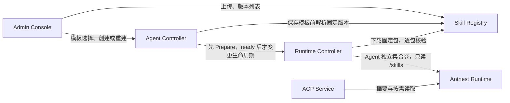
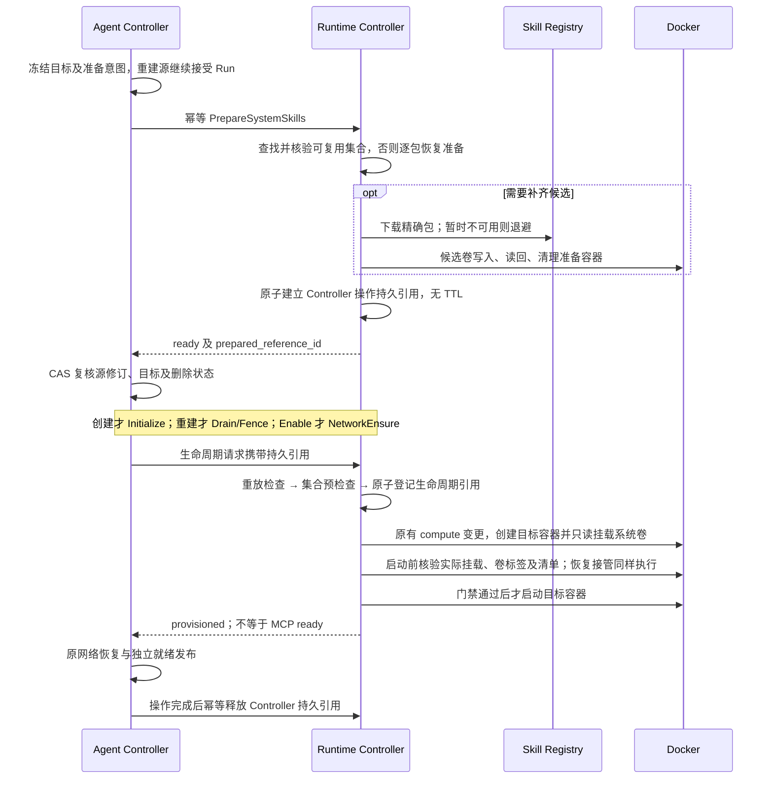

# Skill Registry 最小版本技术方案

> 更新日期：2026-09-28；已按评审修订设计决策，并同步当前验收状态。
>
> 后续范围补充（2026-10-01）：用户确定“Agent Skill 自动投影 → Registry 检索与
> 临时使用 → 用户提升为系统 Skill → Template/rebuild 预设交付”，详见
> [动态发现与传播设计](evolver-technical-analysis.md#112-用户确定的四步产品流程)。
> 投影仅登记动态来源映射，内容与生命周期归来源 Agent；提升时才由 Registry
> 托管完整包及正式版本生命周期。
> 本文记录已交付的首版基线；后续 Registry/source 合同与 Registry D1 已通过
> 门禁，详见[交付记录](skill-discovery-registry-delivery-20261001.md)。ACP D2 自动
> 投影与当前来源读取也已通过门禁，详见[ACP 交付记录](skill-discovery-acp-delivery-20261001.md)；
> [D3 模型搜索/正文加载](skill-discovery-tools-delivery-20261001.md)也已通过门禁；
> [Runtime D4](skill-discovery-runtime-delivery-20261001.md) 的临时文件接口及所属
> 门禁也已通过；[ACP D4A](skill-discovery-temporary-consumer-delivery-20261001.md)
> 已通过真实文件使用、持久回收与重启恢复门禁；[Console D6](skill-discovery-console-delivery-20261001.md)
> 的来源预览/用户提升和 [DI1](skill-propagation-integration-delivery-20261001.md)
> 完整四步集成也已通过。[DI2](skill-source-lifecycle-delivery-20261001.md)与
> [DI3](skill-discovery-caller-integration-delivery-20261001.md)进一步核对正常
> 来源生命周期、活动调用方检索和实际来源 Trace 父链。
>
> 当前交付范围：开发环境没有待迁移的业务数据，首版按全新部署验收。
> 第 9.1 节的旧共享卷迁移设计及相关实现/测试保留为历史记录，不构成
> Skill Registry 当前验收门槛；不再为异机受保护导出或旧来源异常恢复投入开发。
>
> 状态：Registry 自有 B0 API/schema 与 B1 服务代码、单测和隔离 PostgreSQL 发布组件测试已落地；RC 准备/交付
> [B0 合同](../contracts/skill-registry/runtime-delivery-api.md)与 B3 的集合身份、Docker archive/挂载观察、
> 持久准备意图、包校验/固定版本下载、准备工作者、逐包检查点、集合清单、丢卷再物化、准备 API 与 B3 生命周期消费、挂载门禁、引用转移和有界清理已落地。Registry 自有 Docker 门禁及 I1 基础业务、存储恢复已通过，满足当前全新部署的首版范围。
> Controller B2 的独立准备意图表、三个生命周期入口的前置准备、终态引用释放及
> 确定性拒绝后的槽位释放已落地并通过本地测试；前置失效的新准备请求及 Fence 后
> 源恢复已有 Controller 本地测试；旧 Agent 的迁移准入门禁已通过升级迁移组件测试。
> ACP B5 已拒绝非空旧正文通道并移除系统提示拼接，845 项本地测试及类型、lint、构建门禁通过。
> Registry→RC 准备及 Initialize 消费已有隔离 HTTP＋PostgreSQL＋Docker 候选容器证据；
> 真实 Runtime executor 的 `info` 摘要、按需 `read` 和系统根 `write/edit` 拒绝也已通过；
> 实际 Runtime 只读挂载还通过 root/UID 1000 的写、删、重命名、chmod、目录内建链接及
> 工作区链接写回拒绝检查，每次攻击后正文与清单摘要、权限均保持不变。
> RC PostgreSQL 组件回归已验证六分钟前的准备引用在新仓储连接中仍能原子转为
> 生命周期引用；独立 I1 Docker 回归已在 Fence 后重启 Controller 和 RC，并由原
> Rebuild 完成新 Skill 的真实 ACP Run、Trace 拓扑及资源清理。该回归不等待实际五分钟；
> 严格 Trace 只按精确验证的重启取消 span 与已评审的时钟告警例外处理。
> 另有隔离 Registry→RC→Docker 慢准备回归：五个固定版本下载分别延迟 25 秒，
> 一次集合准备耗时 126.654 秒，超过默认 120 秒 lifecycle mutation 时限，五个包的
> 核验进度及实际卷清单均通过，验证准备预算独立。另一个隔离门禁在首包持久
> 检查点后向 RC 发出 SIGTERM 并重启同一数据库上的进程；原集合在 143.292 秒内
> 完成五包准备，首包只下载一次，实际卷清单正确。RC 优雅退出现在等待工作者
> 结算中断轮次并释放租约；SIGKILL 不在该门禁范围内。
> 2026-09-27 隔离 I1 回归已覆盖 Registry 发布 v1、Template 冻结、Agent 创建、
> 真实 ACP Run 通过 Runtime 工具读取 v1、发布 v2 后重建与读取 v2、Disable/Enable、
> Delete 与资源清理。Trace 拓扑通过；严格时间告警只按已评审的时钟偏差例外处理。
> Runtime 经 `antnest0` 到 Registry 实际 IPv4 及服务名的访问拒绝已由隔离 I1 验证。
> 当前 Registry 网络未启用 IPv6，也无 IPv6 地址；未来启用时回归会要求实际地址拒绝测试。
> 八库多卷存储删除恢复与两个真实 Agent 的固定 Skill 离线 Enable、ACP Run
> 已通过隔离 I1 回归。RC 在 Prepare 回放 ready 时检查卷归属；若物理卷已丢失且
> Agent 无活跃 Runtime/生命周期操作，保留原逻辑引用并排入新物化。RC PostgreSQL
> 集成测试及隔离 Docker 故障注入均已通过：Disable 后删除唯一受管 Skill 卷，Enable
> 将同一冻结集合从 `m1` 重新物化为 `m2`，业务及 Trace 拓扑通过。
> ready 卷内容漂移在禁用 Agent 上的自动再物化也已通过隔离 Docker 回归。
> 源 Runtime 活跃期间、尚未挂载的重建目标集合内容漂移也已通过隔离全链路回归。Registry 暂时
> 不可用时，重建准备保持源 Agent 可执行：故障期间真实 ACP Run 读取旧版 Skill，
> 恢复后原重建请求与新版 Skill Run 成功；业务、Trace 拓扑和资源清理门禁通过。
> 严格 Trace 仅保留已评审的时钟偏差告警。RC 旧共享卷的
> 只读文件摘要及全部 Docker 挂载引用盘点已通过隔离 Docker 回归；Controller 逐 Agent
> 资产关联、管理员选择和受控迁移后的 ACP Run 已通过隔离 Docker 回归。迁移后的
> Controller/RC 容器重建也保留 `resolved` 标记；后续普通 Disable/Enable 复用同一
> 只读卷且不重开迁移门禁；普通 Rebuild 到同一冻结模板修订也复用该卷并保持固定
> Skill 引用。发布 v2 并修订模板不改变现有 Agent；显式 Rebuild 后换用 v2 集合，
> 实际 Runtime 正文及再次读取 Skill 的 Run 均已验证。其后停用、删除保留的 v2 卷
> 并启用会重新物化同一固定集合；新只读卷、`resolved` 标记和 ACP 再次读取 v2 均通过。
> 旧来源恢复的窄范围 C0 合同、Controller C1 持久日志、HTTP/Temporal 入口及
> C2 Docker 验收均已完成：仅当 RC 证明同一 Runtime 修订时，受控停用到仍受迁移
> 门禁保护的 disabled 状态，再以新证明受控 Enable。缺失或变化的 RC 来源保持人工
> 恢复；异机旧资产导出及迁移后异常恢复不纳入当前全新部署验收。
>
> 范围依据：托管 Skill、模板冻结引用、Runtime 只读交付三个目标。本文取代
> [首轮参考分析](skill-registry-responsibilities.md)中较宽的首批建议，是
> [阶段四](stage-4-services.md)后续合同和实现的设计基线。

逐项回应见 [评审处理记录](skill-design-review-20260927.md)。

## 1. 目标与本轮决定

首版完成以下链路：

1. 管理员上传 Skill 包，Registry 托管不可变版本和内部下载。
2. Agent Template 选择精确版本，随模板修订冻结；创建时复制到 AgentSpec。
3. Runtime Controller（RC）在生命周期变更前准备完整集合，再只读交付到 Runtime；
   更新通过新模板修订和显式重建完成。

本文统一称模板交付、Runtime `source=system` 的资产为**系统 Skill**，即模板预设
的基础能力；工作区 `source=personal` 的资产称**个人 Skill**。系统 Skill 不随
发布新包、修改模板或普通 Run 自动升级。重建到同一修订仍使用相同版本；重建可
增加、删除、升级或回退系统 Skill，继续保留工作区和个人 Skill。

本轮将以下选择确定为 B0 的输入，不再留给服务实现者自行决定：

| 问题                    | 设计决定                                                                      |
| ----------------------- | ----------------------------------------------------------------------------- |
| 旧正文交付通道          | `skill_instructions` 废弃且永久为空；保留字段不表示未来允许填充               |
| 包与 Runtime 格式一致性 | 检查 YAML 节点真实类型和分隔格式；共享样例在实际 Go/Rust 解析路径运行         |
| 仓库故障与生命周期      | 独立、持久、幂等地准备集合；创建在 Initialize 前，重建在 Drain/Fence 前       |
| 超时和复用              | 准备不使用 Runtime mutation 时限；逐包保存核验进度；按 Agent 与集合摘要复用卷 |
| 历史资产与恢复          | 先盘点备份、显式迁移；恢复时核验真实卷，禁止把缺失或旧共享内容当作空集合      |

首版不建设外部同步、搜索推荐、社区、审核评测、依赖安装、发布标签、热更新或
Skill 执行引擎。已交付首版没有个人 Skill 发布/转换的产品流程，当前可手动
导出后由管理员上传。后续将按上述四步设计增加自动投影、检索/临时使用与
用户提升：映射按需回源，提升后正式托管；正式版本仍沿用本方案的模板冻结
和显式重建规则。个人学习可独立
完成，不以 Registry 在线或投影成功为生效前提。

## 2. 当前基础与服务所有权

| 已核对的当前实现                                                                                                                                                                        | 首版边界                                                            |
| --------------------------------------------------------------------------------------------------------------------------------------------------------------------------------------- | ------------------------------------------------------------------- |
| Template 修订不可变；`skill_refs` 解析精确版本并冻结。[Controller 合同](../contracts/agent-controller/control-api.md) / [schema](../contracts/agent-controller/control-api.schema.json) | AgentSpec 复制冻结引用，发布新 Skill 或模板修订不自动更改现有 Agent |
| RC 有独立集合准备、幂等请求、修订 CAS 和中断恢复。[生命周期合同](../services/runtime-controller/api/control-api.md)                                                                     | Prepare 先于 Environment 生命周期变更；生命周期只消费 ready 集合    |
| Docker 按 Agent/集合身份挂载已准备的只读卷。[适配器](../services/runtime-controller/internal/platform/docker/driver.go)                                                                 | 首版全新部署使用独立卷；同集合复用、缺失再物化及删除清理已有证据    |
| Runtime 扫描系统/个人目录，文件工具拒绝系统根写入。[读取](../runtimes/antnest-runtime/src/information.rs) / [文件根](../runtimes/antnest-runtime/src/roots.rs)                          | 复用发现路径；实际交付格式和只读效果已验证                          |
| ACP 每 Run 刷新目录摘要、按需读正文，旧正文拼接已移除。[上下文](../services/agent-acp-service/src/application/context-builder.ts)                                                       | 拒绝非空旧字段，保证唯一交付路径                                    |

| 所有者                  | 首版职责                                                               |
| ----------------------- | ---------------------------------------------------------------------- |
| Skill Registry          | 组织内包校验、版本、元数据解析和下载；拥有自己的数据库                 |
| Agent Controller        | Template/AgentSpec 固定引用、创建/重建策略、准备前置编排；不保存包字节 |
| Runtime Controller      | 下载、校验、准备进度、卷复用、只读挂载、恢复及回收；不决定升级版本     |
| Antnest Runtime         | 发现系统/个人 Skill，继续按需读取和既有工具执行                        |
| Agent ACP Service       | 只使用 Runtime 摘要/读取路径，封闭旧正文通道                           |
| Admin Console           | 上传/版本、模板选择、准备/生命周期进度；薄 BFF，无业务数据库           |
| Identity / Edge Gateway | 复用组织、管理员准入和浏览器入口；不新增账号或角色体系                 |



这些箭头的基础业务链、恢复及当前网络边界已由隔离 I1 回归验证，证据对应第 11 节。
Channel Manager 和 Task Scheduler 不参与。

## 3. 托管格式、共享校验与存储

### 3.1 存储选择和上限

采用 **Go 服务 + PostgreSQL 私有数据库/账号**。首版 ZIP 制品用 `bytea` 保存，
元数据、字节和发布回执在同一事务提交，不新增对象存储、索引或消息队列。列表
不读取制品列；单次下载只读取一个受限包，不承诺无限流式或零拷贝。上传、下载
及 RC 准备均采用有界准入，无全库内存缓存。

ZIP 根目录直接包含 `SKILL.md`，可带 `scripts/`、`references/`、`assets/` 等普通
文件，不接受外层包装目录。

| 项目            | 首版默认上限                                                                       |
| --------------- | ---------------------------------------------------------------------------------- |
| ZIP 压缩大小    | 8 MiB；multipart 元数据和额外字段另设 HTTP 上限                                    |
| 解包后大小      | 每包 32 MiB，模板完整集合合计 128 MiB                                              |
| 文件/条目       | 每包 256 个 ZIP 条目，含目录；单文件 8 MiB                                         |
| `SKILL.md`      | **完整文件** 16 KiB，UTF-8；不是仅限制 frontmatter                                 |
| `name`          | 1–64 字节，小写 ASCII 字母、数字、单连字符，首尾为字母或数字；组织内唯一且不可改名 |
| `description`   | 去除首尾空白后 1–512 UTF-8 字节，不含 NUL                                          |
| 相对路径        | UTF-8，512 字节，最多 16 层，统一 `/`                                              |
| 系统 Skill 数量 | 0–32，与 Runtime 每来源上限对齐                                                    |
| 并发            | Registry 上传 2、下载 4；RC 同时准备集合 2，集合内逐包处理；均可配置且有界         |

拒绝绝对路径、`.`/`..` 路径段、反斜杠、NUL、重复或冲突路径、加密 ZIP、符号
链接、硬链接、设备等非普通文件/目录；拒绝错误 CRC、伪造大小和实际解压超限。
限制按实际读取计数，不能只信 ZIP 目录声明。包内脚本不在上传、模板保存或准备
阶段执行；运行依赖由 Runtime 镜像提供，不触发自动联网安装。

### 3.2 必须与 Runtime 相交的 frontmatter 规则

Runtime 使用 `yaml-rust2 0.13`，通过 `as_str()` 读取 `name/description`；仅通过
名称正则或在 Go 中解码到 `string` 字段，不能证明 Runtime 能识别。
[Runtime 解析实现](../runtimes/antnest-runtime/src/information.rs)、
[依赖版本](../runtimes/antnest-runtime/Cargo.toml)。B0 固定以下共同子集：

- 文件无 UTF-8 BOM；以 LF 或 CRLF 分行时，第一行必须恰好为 `---`，不得有
  前导空行、空格或注释。结束 frontmatter 的行也必须恰好为 `---`。
- 两个分隔行之间只能是**一个 YAML mapping 文档**；拒绝 YAML 文档结束标记
  `...`、多文档解析结果、重复键、显式类型标签、锚点和别名；所有层级都拒绝
  值为 `<<` 的 mapping key，包括加引号的键及不使用锚点的内联 merge mapping。
  在 AST 上检查后才提取字段，不能先合并或解码到 struct。限制解析深度和节点数。
  正文不是 YAML；结束分隔行后的 Markdown 分隔线不应被误判为额外 YAML 文档。
- 读取 YAML AST/scalar tag，确认 `name`、`description` 在共同类型规则下都是
  字符串，再做字符、长度和非空校验。禁止把 bool/null/number 强转为字符串。
- 共同规则采用下表明确的**平台字符串准入规则**。裸值的非字符串拒绝范围取
  YAML 1.2 core、Runtime 实际 `Yaml::from_str` 与 go-yaml v3 类型推断的并集，
  再加入下述保守词法限制；不能只实现 core 数字语法。先保留标量样式与 AST tag，
  再判断；任一消费实现不能一致识别为字符串就拒绝，不能强转兜底。
- 名称不含首尾空白；描述按既定规则 trim 后保存并比较。额外元数据可保留，但
  不解释为安装、授权或后台学习指令，也不得绕过上述 YAML 限制。

以下是 B0 必须固化的判定表，不由 Go/Rust 库的默认 resolver 决定。“允许字符串”
只表示类型阶段通过，之后仍检查 name 正则或 description 长度/非空等约束。
数字规则采用词法判断，不因整数溢出或某库没有识别该数值就允许裸值。

| 标量内容示例                                                       | 未加引号的 plain scalar | 单/双引号字符串 | 说明                                                                |
| ------------------------------------------------------------------ | ----------------------- | --------------- | ------------------------------------------------------------------- |
| `true` / `True` / `TRUE`，`false` / `False` / `FALSE`              | 拒绝                    | 允许字符串      | 大写内容仍不符合 name 的小写规则                                    |
| `null` / `Null` / `NULL` / `~`，空值                               | 拒绝                    | 允许字符串      | 引用后的空字符串仍被非空校验拒绝                                    |
| `123` / `-42` / `+42` / `0x1f` / `0o17` / `1e3` / `1.5`            | 拒绝                    | 允许字符串      | 数值类型；例如名称 `"123"` 合法，裸 `123` 不合法                    |
| `0b101` / `-0b101` / `1_000` / `1_000.5`                           | 拒绝                    | 允许字符串      | 平台额外排除二进制、数值中的 `_`；引用的下划线名称仍不合法          |
| `0x-1` / `0x+1f` / `0o-7` / `++42` / `+-42`                        | 拒绝                    | 允许字符串      | Runtime 实际识别为整数；`"0x-1"`、`"0o-7"` 可通过名称规则，裸值不可 |
| `0X-1` / `0O+7` / `0Btext` / `0xnote` / `--42` / `-+42` / `+1step` | 拒绝                    | 允许字符串      | 保守词法范围，即使库均按字符串解析也拒绝裸值                        |
| `2024-01-01` / `2024-01-01T12:30:00Z`                              | 拒绝                    | 允许字符串      | 日期/时间歧义；名称 `"2024-01-01"` 可接受                           |
| `.inf` / `+.Inf` / `-.INF` / `.nan` / `.NaN` / `.NAN`              | 拒绝                    | 允许字符串      | 带点的特殊浮点形式                                                  |
| `inf` / `nan`                                                      | 允许字符串              | 允许字符串      | 不将无点单词当作浮点数                                              |
| `yes` / `no` / `on` / `off`，`code-review`，中文描述               | 允许字符串              | 允许字符串      | 不引入 YAML 1.1 bool 强转；中文仍只适用于描述                       |

日期歧义规则在平台层排除以 `YYYY-M-D` 形状组成的裸日期，及其后接 `T`/`t` 或
空格加时间的形式（支持单/双位月日）；不靠当前库是否成功校验日期来放行。
数值词法额外拒绝：去掉至多一个前导正负号后，以 `0x`/`0o`/`0b`（大小写不敏感）
开头的任何裸值；以及以正负号开头、下一字符为正负号或 ASCII 数字的任何裸值。
因此符号出现在进制前缀后、重复符号、非数字后缀也不能漏过。数值分隔符规则
覆盖移除 `_` 后属于数值词法的裸值。无符号的普通名称 `1step` 仍可作为字符串，
`+word` 可通过类型阶段但不符合 name 正则。B0 将这些规则展开为正反边界样例，
避免只硬编码表中的几段文本。

引号/块字符串内容不再按裸值重新推断类型，但显式 `!!str` 等标签仍按上文拒绝。
例如 description 使用块字符串写入文字 `true` 可以通过类型检查。
[YAML 1.2 core 的类型解析](https://yaml.org/spec/1.2.2/#1032-tag-resolution)提供基础；
日期、进制前缀、重复符号、下划线及 merge key 的额外限制是本平台兼容规则，
不冒充 YAML 标准要求。

本地已核对：yaml-rust2 0.13 把 `True/TRUE` 作为 bool、`Null/NULL` 作为字符串，
无点 `inf/nan` 也为字符串；go-yaml v3 对 `Null/NULL`、日期、二进制及数字分隔符
有不同推断。Runtime 去掉 `0x`/`0o`/`+` 后使用允许符号的整数解析器，故还接受
上述非 core 数字写法；Go 则会合并 `<<: {name: x}` 这种不带锚点的 mapping，
Runtime 不提供同样的 merge 语义。上述差异只能解释为何需要平台规则，不能
改变表格的准入结果。

共享样例在 B0 登记为语言无关、带预期结果的包/文本样例，源文件归根
`tests/integration/`，供 Registry 上传校验、RC 交付校验、Runtime 解析及学习
候选检查使用。包规则与对应样例共同使用 `package_rules_version`（从 1 起的
正整数）标识，校验记录保存该版本；它不是 Skill 发布版本，也不是第 5.1 节的
集合 `layout_version`。它是一套测试输入，不要求跨语言共用运行时代码。

| 样例组                                                               | 必须检查的结果                                                                |
| -------------------------------------------------------------------- | ----------------------------------------------------------------------------- |
| 两字段的上述判定表及大小写、引号/块字符串、日期/数值边界             | 平台校验结果按表固定；记录底层 AST 类型差异，不以 Go string 强转掩盖          |
| `0x-1`、`0x+1f`、`0o-7`、`++42`、`+-42` 及大小写/符号/非数字后缀变体 | 裸值拒绝，引用值先按字符串再检查字段约束；名称合法的 `0x-1`/`0o-7` 也必须覆盖 |
| BOM、前置空行、首/末分隔行带空格、缺末分隔行                         | 拒绝，不能上传成功后变成 Runtime `invalid_skill`                              |
| 多 YAML 文档、`...`、重复键、别名、标签、非 mapping                  | 拒绝；正文中合法 Markdown 分隔线可保留                                        |
| `<<: {name: x}`、merge sequence、嵌套 `<<`、加引号的 `"<<"` 键       | AST 阶段拒绝，不执行合并；覆盖无锚点、与直接字段并存及两种字段的情况          |
| LF/CRLF、中文描述、合法额外元数据、边界长度                          | 所有消费者一致；包含 Runtime 实际发现结果                                     |
| 整个 `SKILL.md` 超过 16 KiB、目录与管理身份不一致                    | Registry/RC/学习候选拒绝，即使 Runtime 单独能读其头部                         |

B0 给出样例和期望；B1/B3 必须运行**实际 Go 校验实现**，并与实际 Rust 解析结果
交叉验证，不能只断言 Go struct 中最终有字符串。被平台接受的包必须被 Runtime
按同一字符串发现；Runtime 原始解析器可以接受更宽的输入，不要求其单独拒绝
所有平台拒绝样例。学习 L1 的平台校验器则须与 Registry/RC 完全一致。
Runtime 升级 YAML 库后也必须重跑该组证据。现有
[`package-rules-v1.json`](../tests/integration/skill-registry/package-rules-v1.json)
已由 Registry、RC 的 Go 校验测试及 Runtime 实际 Rust 解析测试共同执行；
样例分别记录平台准入和 Runtime 原始解析结果，平台接受的 name/description
必须与 Runtime 发现值一致。[学习 L1](skill-learning-design.md)的候选流程使用
Runtime 平台包校验器，继续遵守这组格式与名称约束。

### 3.3 不可变版本和内容身份

| Registry 私有记录  | 最小字段                                                                                       |
| ------------------ | ---------------------------------------------------------------------------------------------- |
| `skills`           | `skill_id`、组织、不可变名称、当前版本、创建人/时间                                            |
| `skill_versions`   | Skill、正整数版本、描述、ZIP、`artifact_digest`、`content_digest`、大小、文件清单、发布人/时间 |
| `command_receipts` | 组织、`request_id`、规范化请求摘要、冻结结果                                                   |

`skill_id` 为 `skill_<32 位小写十六进制>`，已登记到
[资源 ID 合同](../contracts/resource-identifiers.md)。版本从 1 递增；首版不引入
SemVer、版本资源 ID、范围表达式或 `latest`。`artifact_digest` 为原始 ZIP 字节
的 SHA-256；`content_digest` 为规范化文件清单的 SHA-256，清单按 UTF-8 路径字节
排序并包含路径、实际大小、文件摘要和规范化可执行位。两者及清单的规范化编码
在 B0 冻结，摘要均采用 `sha256:<64 位小写十六进制>`。

首次上传原子创建 Skill/v1；追加版本带 `expected_version`，锁头后 CAS 追加。
已提交版本无覆盖、编辑或删除 API。组织内 `request_id` 跨发布操作唯一：相同
参数和 ZIP 摘要重放原结果，不同内容冲突；multipart boundary 不进入请求身份。
移除模板引用不删除历史版本。危险包的首版运维处置见第 9.3 节，不假设已有下架 API。

## 4. Registry 接口与网络边界

下列 Registry 自有路由已登记到
[B0 合同](../contracts/skill-registry/registry-api.md)和 JSON schema，并由
B1 服务实现；跨服务生命周期与消费者的交付结果见本文开头的批次记录：

| 接口                                                          | 用途                                                          |
| ------------------------------------------------------------- | ------------------------------------------------------------- |
| `POST /internal/skills`                                       | multipart 元数据含请求、组织、操作者；一个 ZIP，创建 Skill/v1 |
| `POST /internal/skills/{skill_id}/versions`                   | 同上加 `expected_version`，追加不可变版本                     |
| `GET /internal/skills`                                        | 组织目录、当前版本元数据；`after_id/limit` 分页               |
| `GET /internal/skills/{skill_id}/versions`                    | 组织内版本列表、稳定游标；不含包正文                          |
| `POST /internal/skill-versions/resolve`                       | 组织及最多 32 个精确引用；整体校验并返回冻结元数据            |
| `GET /internal/skills/{skill_id}/versions/{version}/artifact` | 组织范围固定 ZIP、准确长度和摘要；不重定向外站                |

列表默认 50、最多 100。`resolve` 返回名称、描述、两个摘要及大小，不返回包字节。
错误区分不存在、版本不存在、名称冲突、坏包、超限、请求冲突、修订冲突及暂时
不可用；跨组织按不存在处理。不能将格式错误、越界或依赖不可用转换为空集合。

Gateway → Console BFF 复用管理员准入；BFF 用可信 Principal 覆盖浏览器提交的
组织/操作者。Registry 对每个列表、解析和下载校验组织归属，不能只靠页面过滤。
Controller/RC 使用配置的内部地址及冻结组织上下文，不使用浏览器 Cookie，也
不接受模板传入任意下载 URL。

Registry 只接控制网络、私有数据库网络及按需的观测网络，**不加入
`antnest-runtime-management`，不暴露主机公共端口，也不为方便调试接入 Runtime
可达的共享网络**。RC 下载客户端已通过开发 Compose 的 `development` 网络
访问 Registry，隔离 I1 回归证明了这条控制面路径；Runtime 对服务名和实际
私有 IPv4 的访问拒绝已实测；当前网络未启用 IPv6，回归会拒绝未测的 IPv6 地址。

Runtime 的直连路径和 Egress 出口都不能访问 Registry。部署必须把 Registry
实际 IPv4/IPv6 地址纳入不可被租户规则放行的控制面隔离范围；不能只拒绝域名、
依赖 HTTP 组织头或认为“不在同一 Docker 网络”就已验证隔离。B0 定义部署约束，
I1 覆盖直接地址、域名解析和经 Egress 的访问拒绝。

## 5. Template、AgentSpec 与旧正文通道

### 5.1 固定引用

用户仅提交 `skill_refs: [{skill_id, version}]`。Controller 保存模板修订前调用
Registry `resolve`，拒绝跨组织、重复 Skill、多版本、同名目录或集合数量/大小
超限。名称、描述、摘要、大小均来自 Registry；按 Skill ID 排序后写入模板修订
及其摘要。空集合合法且无需 Registry；旧修订读取和命令成功回放不实时解析新版本。

创建/重建从目标模板复制固定引用到 AgentSpec，不重新选版。固定字段至少包含
`skill_id/version/name/description/artifact_digest/content_digest/`
`archive_size_bytes/unpacked_size_bytes`；不含包正文、可变下载 URL 或凭据。
`skill_set_digest` 包含组织、规范化后的完整有序引用及 `layout_version`；RC 独立重算，
不因调用方来自 Controller 就跳过验证。
规范化字节编码及跨语言期望值见 [Controller 合同](../contracts/agent-controller/control-api.md#templates)
和 [共享样例](../tests/integration/skill-registry/skill-set-digest-v1.json)。

本文只有一个集合版本概念：`layout_version`，首版为 1，同时约束集合摘要的
规范化编码、卷内目录布局及 `.antnest-skills.json` 结构；不另设“集合格式版本”。
变更这些语义须升级此值，并通过新模板修订/显式重建应用。Skill 的发布 `version`
是独立的包版本；compute generation、私有物化序号也不等于 `layout_version`。

### 5.2 `skill_instructions` 永久为空

当前 [execution snapshot schema](../contracts/agent-acp/execution-snapshot.schema.json)
已将该数组约束为永久空列表；[ACP](../services/agent-acp-service/src/application/context-builder.ts)
拒绝非空输入且不再将正文拼进系统提示，[Controller](../services/agent-controller/internal/application/execution_projection.go)
继续输出空列表。**Registry 集成不能激活这个旧通道。**

B0 将字段标为废弃并约束为 `[]`，消费者清单包括 **ACP 和 Admin Console**：

- B2 保证 Controller 永久输出空列表。
- B5 使 ACP 拒绝非空输入并移除正文拼接逻辑。
- B4 删除 Console 执行审计响应的 `skillInstructions` 字段及其正文投影。当前
  [投影实现](../services/admin-console/internal/server/execution_snapshot_projection.go)
  已使用不含正文通道的白名单结构，不能因正常数据为空就保留这条旁路。历史/异常非空
  输入也不得向浏览器透传；如需展示 Skill 身份，另从冻结引用提供白名单元数据。

Controller → ACP wire 字段暂留仅为明确原形状，不保留非空兼容分支，不允许
“先填充，以后再删”。Controller README/架构同步说明永久空通道；Console 的
正常、历史及异常输入均纳入 B4 投影用例。

唯一正文路径为 Registry → RC 卷交付 → Runtime 按需读取。模板和快照只传固定
身份，系统提示只包含 Runtime 提供的有界摘要；不得每 Run 注入最多 32 × 16 KiB
正文。上述旧通道约束已在首版合同、ACP 和 Console 中实现并验收。

### 5.3 生命周期配置引用 ready 集合

RC 的完整 configuration 增加组织及冻结 `system_skills`，并引用同 Agent 的
`prepared_skill_set`（稳定准备身份、逻辑集合摘要、布局版本）。这些参与请求
摘要与部署身份。同集合重新物化不改变期望配置身份；物理卷名和私有物化序号不
暴露给 Controller。一次操作另携带绑定该集合的持久 `prepared_reference_id`，
进入生命周期请求身份，不靠会过期的核验租约证明集合可消费。

Controller 先保存准备意图和操作身份，RC 在核验 ready 集合后原子建立该操作的
**持久目标引用**，再返回可进入生命周期的结果。该引用绑定选定物化并禁止回收；
从 BeginAgentRebuild 前一直保护到 Drain、Fence 及 RC 登记生命周期引用之后。
它无 TTL，不会因正常 5 分钟 Drain、Controller 重启或工作者租约过期而失效。
工作者租约只协调准备执行权，不负责这个保留义务。

RC 在 BeginTransition 中原子登记生命周期引用，不能先释放目标引用再登记。
Controller 的持久引用只在操作确认完成或明确放弃、已确认在途副作用后幂等释放；
成功时已有当前配置引用接替。进程崩溃由原操作恢复释放；联系不上所有者时保留
并告警，不以超时猜测可回收。Delete 也须结算这些引用。短期状态观察不替代持久引用。

Initialize/Update/Enable 只消费匹配且已核验的 ready 集合，不能在 mutation 内
下载、补文件或排队准备。准备回执不是永久存在保证：消费时仍需校验卷身份和
有效性。除显式终结/释放外，正常受保护集合不会自然过期；外部删卷或内容漂移
仍可能使其无效。RC 先重放已存在的生命周期请求，再对尚未受理的请求在
`prepareOperation` 内、调用 `BeginTransition` 之前检查集合，沿用当前修订/镜像预检查的
位置；不得制造终态失败 Environment 或可重放的生命周期失败回执。

B0 固定 `prepared_skill_set_invalidated`：对当前生命周期调用 `retryable=false`，
表示该请求尚未进入 RC 生命周期、副作用未开始，须按 Controller 所处阶段恢复。
它不是在 Fence 状态下自动重试的依赖错误，也不能用于掩盖此前同请求已发生的
副作用。具体恢复见第 7 节；未知 RPC/平台结果仍按既有 unknown 语义观察。
Disable/Delete 使用已记录归属，Enable 固定原配置，不自动升级。

已经失效的 `prepared_reference_id` 不得通过静默改指向重新有效。重新物化产生
新的引用；前置准备尚未进入生命周期时可在同一业务意图下建立新的准备子请求，
替换旧引用。已经进入 Drain/Fence 的本次操作先按第 7.1 节恢复并结束，不能更换
引用后在隔离状态继续。生命周期一旦受理，其请求与引用身份保持原样用于恢复。

## 6. 独立准备、可恢复进度与卷复用

### 6.1 身份、状态与幂等接口

B0 [交付合同](../contracts/skill-registry/runtime-delivery-api.md)新增独立的 `PrepareSystemSkills`/查询语义，为
`POST /internal/runtimes/{agent_id}/skill-sets/prepare` 和组织范围的准备状态查询。
输入包含请求身份、Agent、组织、固定引用及布局版本。**准备不创建 Environment，
不改变 Runtime revision，也不占用整个生命周期 mutation 的 per-Agent 锁。**

逻辑准备键为 `(controller_scope, organization_id, agent_id, skill_set_digest,
layout_version)`，与 compute generation 无关。相同键合并工作；同一请求的不同
输入冲突。不同请求可引用同一个 ready 结果，仍各自保留回执。准备记录允许先于
Environment 存在；Delete 和过期回收须处理这种无 compute 的资源。

准备请求还绑定 Controller 的 `owner_operation_id`，不同操作对相同集合各持有
自己的引用。ready 结果与持久引用一起提交，回包丢失可按原准备请求查询；B0 同时
定义幂等查询/释放引用的语义。Controller 保存引用前崩溃仍由原意图恢复，不能
产生不受追踪的 pin。尚无 ready 结果的候选由准备记录保护；已持久引用的集合不
属于“过期准备结果”。

概念状态为 `queued → preparing → ready`，另有可恢复的 `retry_wait`/`paused`、
确定性 `rejected`、`invalidated` 与 `cleanup_pending`。准备键、工作者租约、逐包进度、
物理资源归属、失败分类和重试时间均持久化在 RC；不依赖 Task Scheduler。
暂时不可用不会写成失败的 Environment。同一准备请求可继续推进，不重放一个
永久失败结果；HTTP 请求超时不取消已经受理的持久工作。

### 6.2 不随 generation 重建的集合卷

**系统 Skill 必须下载、校验并解包为 Docker named volume 中的真实目录和文件。**
RC 从 Registry 获取固定版本，将 `SKILL.md` 及配套文件实际写入目标卷，读回核验
完成后，再把整个卷只读挂载到 Runtime 的 `/skills`。包内和交付目录均不使用
软链接或硬链接，也不通过链接指向宿主机缓存、其他卷或 Registry 存储。卷内不能
只有下载地址、指针清单或等待 Runtime 解包的 ZIP。

```text
/skills/                         # 整个挂载只读
  code-review/SKILL.md
  code-review/references/...
  .antnest-skills.json            # 集合、逐 Skill 及文件身份，不是 Skill 目录

/workspace/.antnest/skills/       # 既有个人 Skill，可写
```

物理卷归属于逻辑准备键。首次物化使用确定性资源名；丢失/漂移后的替代副本另带
RC 私有物化序号，仍对应相同逻辑键，不能覆盖被使用的卷。标签包含 scope、组织、
Agent、集合摘要、布局版本和物化序号。不同 Agent 即使内容相同也不共享运行卷。
空集合仍有独立空卷和验证记录，不回退旧共享卷。

更新到不同集合时，先在目标卷中准备完整的实际文件，再由显式重建让新 Runtime
挂载目标卷；不在运行中的 `/skills` 切换软链接或交换目录。同一 Agent 的相同
集合已有完整且核验通过的卷时，复用的是这个存有实际文件的卷。

挂载内的 `/skills/.antnest-skills.json`
记录布局版本、集合摘要及每项的 Skill/version、`artifact_digest`、`content_digest`、
名称、`SKILL.md` 摘要和规范化文件清单。清单上限 8 MiB；它不含正文/凭据，也不是凭标记即相信的证明。
RC 核验实际字节后才认可记录；未来 Runtime 可据此报告系统内容身份，首版不扩展
Runtime information 输出。

Disable 保留当前有效集合引用；Enable、相同集合的重建核验通过后直接复用，
**不要求 Registry 在线**。不同集合替换成功后释放旧引用并有界回收。未结束准备、
Controller 操作持久引用、RC 生命周期引用、当前运行或 disabled 配置引用都阻止回收；无 Agent 的
过期准备结果可清理。Delete 先封闭新准备准入并取消/接管已有准备，再清除所属
集合，防止删除后的后台任务重新产生孤立卷。

### 6.3 准备与进度检查点

1. 先持久化逻辑键、工作者租约、目标物化及镜像解析结果，再创建资源。Docker
   准备容器采用单独标签，不进入 Runtime List/Watch 的 compute 目录。
2. 每次下载一个包，核验 ZIP 摘要、实际大小和第 3 节规则，生成规范化 tar；
   不把全部解包内容聚合进内存。目录 `0555`、普通文件 `0444`、可执行文件 `0555`，
   root 归属，剥离 setuid/setgid 等特殊位。
3. 拟使用**不启动的准备容器**、`NetworkMode=none`、卷 `NoCopy=true`；只可写
   挂载候选卷，不挂工作区、凭据或 Docker socket，不运行入口或包脚本。
4. 用 Docker archive API 写入逐包目录，完整读回校验内容、归属和权限，持久化
   该包已核验状态。包中断只清理/重做该包；已完成包复查通过后复用，不因换一次
   请求或超时就删掉整个候选卷。检查点与实际目录不一致时以重新核验结果为准。
5. 所有包完成后核验完整集合及无额外文件，写入并核验清单，确认准备容器删除，
   最后标记 ready。保存核验清单摘要及物化身份，供生命周期消费时对照。

**创建前检查不能替代创建后的启动门禁。** Docker 会为不存在的 named volume
自动建卷，`NoCopy=true` 只防止镜像内容复制，不能阻止自动建空卷。
[Docker 卷行为](https://docs.docker.com/engine/storage/volumes/#mounting-a-volume-over-existing-data)。
现有 [Docker 适配器](../services/runtime-controller/internal/platform/docker/driver.go)
只在创建前 InspectVolume，检查后删卷仍可能让同名空卷被挂载。B3 必须补齐：

- 每次创建目标容器后、启动前，Inspect **该容器实际的 `/skills` 挂载**，核对
  volume 类型、实际卷名/目标、只读及 NoCopy 配置；再核对实际卷的 RC 归属标签、
  物化身份与卷内 `.antnest-skills.json`。清单必须与准备阶段保存的清单摘要、
  集合/逐包身份完全一致，空集合也必须有合法清单，不能只判断卷名存在。
- 对已受理操作的恢复、同名容器接管、创建/启动应答丢失后的观察路径，同样执行
  此门禁再启动或认定成功。`prepareOperation` 的请求重放不代表物理卷已核验；
  已启动目标在生命周期观察时若挂载或清单身份漂移，按 §9.2 封闭准入并恢复，
  不把历史成功回执改写为新结果。
- 不符时禁止启动/发布就绪，标记该物化失效。确认属于本操作且尚未启动的候选
  容器可删除；对于 Docker 自动生成的无标签空卷，仅在核对本次创建/观察记录、
  实际挂载、无额外内容及无其它引用，足以确认是本次副作用时清理。无标签或
  同名本身不是删除授权；归属或清理结果不明则保留隔离及清理记录，按 unknown
  恢复，不误删原卷、工作区或外部卷，不使用全局 prune。
- 此时生命周期已受理，报告 `skill_mount_verification_failed` 的操作结果，按
  已发生副作用判定 failed/unknown，不能返回准入前的
  `prepared_skill_set_invalidated` 或在此补下载。创建、清理或源删除结果不明
  都按 unknown 观察；同请求下一次尝试的 `not_started` 不能抹去此前的
  unknown，除非已正面证明原 Runtime 保留且破坏性步骤未开始。具体阶段恢复见 §7.1。

完整内容读回仍在独立准备阶段；上述门禁是有界的实际挂载/标签/清单复核，清单
大小上限须由 B0 按包数和文件数固定。它依赖先前完整核验与受保护物化，不能
证明 Docker 管理员从未篡改文件；身份或内容依据不足时拒绝消费，不能在 mutation
内重做整个集合下载，也不能仅补标签把未知卷认作 ready。

Docker API v1.47 的
[archive 接口](https://raw.githubusercontent.com/moby/moby/v27.5.1/docs/api/v1.47.yaml)、
[停止容器 copy 说明](https://docs.docker.com/reference/cli/docker/container/cp/)及
[卷选项](https://docs.docker.com/engine/storage/volumes/)是设计依据；**未启动容器
通过 archive API 写入 named volume 的组合已由
[隔离 Docker 探针](../tests/e2e/skill-registry/docker-volume-archive.py)验证：容器保持
`created`，`volume-nocopy` 卷在第二个只读挂载可读到文件。实际 Go 适配器的
[Docker E2E](../tests/e2e/go/runtime-controller/internal/platform/docker/skill_archive_e2e_test.go)
也已验证归一化 tar 写入、真实文件读回、所有者/权限、集合清单和未启动状态。
逐包持久检查点、后台工作者、整个集合根目录的额外文件/内容复核与已确认丢卷后的重新物化已实现。
Docker 启动前挂载核验器已通过真实卷及自动空卷竞态测试，并已接入生命周期创建及运行中容器接管。独立的 Driver Docker E2E 在 InspectVolume 通过后、ContainerCreate 前真实删卷，确认自动生成的无标签卷不能启动 Runtime；驱动只清理本次创建且仍未启动的候选容器，不凭同名推断可删除该卷。Fence 后的独立全链 Docker 用例也已通过：RC 保留 unknown，Controller 停在 runtime_update，ACP 准入保持关闭，候选容器被清理；同一已受理请求的重放再次遇到无标签卷时返回 storage_ownership_conflict，仍不抹除 unknown。另一隔离用例在 Docker 创建候选后丢失成功应答，RC 根据同名容器恢复检查、拒绝其无标签空卷，保持 unknown 与 ACP 准入关闭；由于创建响应中的 ID 丢失，RC 不推断有权删除该候选，测试只在核对 Agent、scope、实际挂载及未启动状态后清理。启动成功但应答丢失的路径也已修复：对已运行的候选再次验证实际挂载、卷标签和清单；有效卷才能完成，漂移卷保持 unknown。独立全链 Docker 用例确认合法目标被接管、Rebuild 与后续真实 Skill Run 成功，Trace 只接受可定位的单次 Start 传输故障。B3 的无引用卷有界清理和 Delete 准入关闭也已实现。
首次 Initialize 的独立全链故障注入也已通过：在 Agent ID 确定前布置一次性拦截，RC 创建目标容器前删掉已核验的准备卷；Docker 自动创建的同名无标签空卷未启动，RC 保留 unknown，ACP 没有发布 ready。测试确认该 Agent 无残留 Runtime 候选，并仅按精确回执删除无引用空卷。
PostgreSQL 已提供精确、未释放、`ready` 引用的只读预检；RC 准入前也核验实际卷归属，并在 `BeginTransition` 内原子登记生命周期引用。创建后的启动门禁仍覆盖准入检查与 Docker 创建之间的删卷竞态。
若部署引擎不支持，先修订适配器设计，
不能临时执行不受控包脚本。

### 6.4 大小、排队与时间预算

当前 `withAgentLock` 在等锁前创建 mutation context，默认 2 分钟。
[实现](../services/runtime-controller/internal/control/service.go)、
[配置](../services/runtime-controller/internal/config/config.go)。因此集合准备、
全局名额等待、下载和完整卷读回全部移出该 context；不靠提高它的全局值解决。

准备是持久工作：每轮持有名额的工作预算建议 5 分钟，网络无进展超时建议 30 秒，
连续等待依赖的总重试预算建议 30 分钟，均可配置。超时保存检查点并退避，不清空
已核验数据；总预算耗尽进入可显式恢复的暂停状态，不失败 Agent。单个 32 MiB 包
必须能在部署的单轮预算内写入/完整读回；不能完成时明确报告预算或容量不满足，
调大准备预算或降低发布上限，不进行无限重试。

排队有界；未受理时返回带重试提示的准入忙，已受理时展示 queued，等待时间单独
计量，既不消耗执行预算，也不归类平台变更失败。进度包括已核验包数/字节，不能
只显示循环中的“创建失败”。临时文件和流取消后及时关闭，持久检查点留在所属卷/
RC 数据库，不能存入项目 `.cache/`。

128 MiB 集合包括写入和读回的 I/O，不承诺 2 分钟完成。B3 必须提供“准备超过
一次 mutation 时限且跨轮/跨重启续作，最后成功”的测试，以及最大包/集合在
Docker Desktop 上的预算证据。核验 ready 卷本身也在准备阶段进行；mutation
仅做有界身份/挂载及持久引用检查。准备完成到实际使用间发现异常仍必须拒绝，
但要按是否已经 Drain/Fence 处理，不在隔离状态等待下载。

## 7. 生命周期编排和错误分类



Controller 要新增真正的**前置准备阶段**。当前 `BeginAgentRebuild` 就会进入生命周期
变化，不能只把下载提前到 RC 的 Update 开头。在准备期间，旧 ExecutionRevision
及前景准入保持有效；准备意图独立保存，不提前设置影响 `ExecutionReady()` 的
生命周期字段或启动 DrainDeadline。待 ready 后才以源修订 CAS 转入原 Drain/Fence
工作流。
目标变化、停用/删除或并行生命周期命令可使预备意图失效；释放准备引用，不能
把旧准备回执套到新的源状态。创建可预留 Agent 身份及操作进度，但不调用
Initialize；也不提前分配并激活无必要的 Egress 资源。

**Enable 的前置顺序同样明确**：先按保存的 AgentSpec 核验保留卷并取得持久引用，
再进入 `EnsureAgentNetwork`/NetworkEnsure，之后才调用 RC Enable。保留卷完整时
只需 RC 本地核验，不访问 Registry；失效则保持 disabled、重新准备精确集合，
不能先分配/修改网络再等待仓库。
[当前 Enable 顺序](../services/agent-controller/internal/application/lifecycle_enable.go)。

### 7.1 集合失效后的按阶段恢复

`prepared_skill_set_invalidated` 的 `retryable=false` 是“不得重试当前生命周期
调用”，不表示以后不能重新准备。Controller 必须有阶段化处理，不能笼统跳回
Prepare，也不能套入会让源长期停在隔离状态的通用重试分支：

| 发现时点                                                  | 必须执行的路径                                                                                                                          |
| --------------------------------------------------------- | --------------------------------------------------------------------------------------------------------------------------------------- |
| 创建 Initialize 之前，或重建 BeginAgentRebuild/Drain 之前 | 失效引用标记为不可消费，回到准备；源仍可运行，创建不产生 failed Environment                                                             |
| 重建已开始 Drain/Fence，但 RC Update 尚未受理             | 先确认 RC 原请求未受理、源绑定/compute 仍完整且未撤权，恢复源网络；结束本次重建为失败，清除活动操作并同步恢复源执行准入；之后才释放引用 |
| Enable NetworkEnsure 之前                                 | 保持 disabled，本地复核/重新准备后再发起网络步骤                                                                                        |
| Enable NetworkEnsure 之后、RC Enable 尚未受理             | 结束本次 Enable 并结算/补偿本次网络副作用，保留 disabled 及关闭的准入/网络；不在半启用状态重试准备                                      |
| 容器创建后、启动前的卷门禁失败（包括原请求恢复）          | 不启动目标；清理可确认归属的候选副作用，按既有 failed/unknown 结算或观察。旧源已删除时不得宣称可恢复旧源网络/准入                       |
| RC 生命周期已经受理、源有变更或结果未知                   | 观察并恢复原请求；不能使用准入错误假定零副作用，也不能自动开放源网络                                                                    |

重建后置失效使用明确的失败恢复路径，不循环重试失效集合。本次操作的失败结果
保留；用户重新发起重建用新请求身份，可复用仍有效的准备检查点。恢复网络或
准入同步暂时失败时仅重试恢复步骤，展示“正在恢复源”，不转为下载/重新 Drain。
源已撤权、源 compute 也漂移等情况不强行开放，而按原不确定/不可用合同处置。

当前 [`handleRebuildDependencyFailure`](../services/agent-controller/internal/application/lifecycle_rebuild.go)
的可重试分支会保留隔离，不可重试分支会结算失败；B2 必须将新错误明确路由至
确认源事实后的恢复路径，并验收网络与 ACP 准入都恢复，不能只检查 HTTP 返回。
RC 的集合预检查位置见 [prepareOperation](../services/runtime-controller/internal/control/service.go)。
创建后门禁失败与准入前拒绝须分别验收：当前 RC 在已删除源的重建失败中保留
unknown；即使候选容器清理成功，也不能把整次操作标成 not_started。原请求只
恢复其冻结目标和副作用，不在隔离中反复准备失效集合；无法继续时沿既有人工/
生命周期恢复流程处置。

### 7.2 其它错误分类

| 故障/状态                                 | 准备阶段语义                                           | 对生命周期的影响                                               |
| ----------------------------------------- | ------------------------------------------------------ | -------------------------------------------------------------- |
| Registry 503、连接超时、暂时 DNS/网络故障 | `retry_wait`，限次退避、同请求恢复，保留已核验包       | 创建等待；重建源继续运行；不制造 failed Environment            |
| 准备队列满或排队等待                      | 未受理的可重试准入忙，或已受理 queued                  | 不算平台失败，不先 Drain                                       |
| 版本不存在、跨组织、坏包、摘要不符        | `rejected`，具体原因；相同错误不自动循环重试           | 拒绝目标配置，保留源；不得空集合降级                           |
| 磁盘不足、准备预算不满足                  | 暂停并指明需运维恢复；保留可核验进度                   | 不自动开始生命周期，不无限重试                                 |
| 准备资源副作用无法确认                    | 该准备物化标记不确定并隔离，查询实际事实后恢复         | 不伪装 ready；不占一个不存在的 Environment 生命周期状态        |
| 受保护集合在生命周期受理前发生外部漂移    | `prepared_skill_set_invalidated`，当前生命周期不可重试 | 按 §7.1 恢复；Fence 后不等待仓库，正常 Drain 不使引用过期      |
| 受理后创建/接管目标时卷身份或清单不符     | `skill_mount_verification_failed`，禁止启动/发布就绪   | 确认副作用及清理结果，沿既有 failed/unknown 处理；不伪装未受理 |
| 真正 Initialize/Update 副作用失败或未知   | 沿现有 failed/unknown 及 per-Agent 操作恢复合同        | 不改变既有失败请求重放规则，不把已删源说成 not_started         |

当前 Initialize 的确定性失败会留下 failed Environment，同请求只返回原失败，
新 Initialize 不能覆盖，只能走 Delete 恢复。独立准备正是为了不让下载故障进入
这个通道；不是在原 failed 回执上偷偷重试。`unknown` 仅用于无法确认的副作用，
不为 Registry 503 人为制造 Runtime 不确定状态。
[现有失败语义](../services/runtime-controller/api/control-api.md)。

运行中普通 Run、原容器重启均使用已挂载副本，不依赖 Registry。重建完成后只释放
未再引用的旧集合；Delete 处理 compute、工作区、准备容器与全部所属集合，不
删除 Registry 版本。响应丢失时按原请求、私有 generation 和集合身份恢复，不能
重新下载并覆盖已挂载目标。

## 8. 只读与产品观察

Runtime MCP `write/edit` 继续拒绝系统根。Docker 只读挂载进一步阻止 Bash/子进程
写入、删除、重命名、chmod 和经工作区链接写入，不能只依靠 mode 或隐藏按钮。
不向 Agent 暴露 Docker 控制或该卷的可写别名。宿主机/Docker 管理员不在此执行
权限边界内；系统脚本仍可能产生获准的工作区副作用。

同名个人 Skill 保留独立来源和路径，不能覆盖系统文件或摘要。只读不等于模型
必然采用或遵守该 Skill，实际权限仍由工具/网络层执行。

Console 只增加：组织 Skills 上传/版本列表、模板固定版本选择、Agent 配置及
重建差异/进度。应单独展示“准备集合”“生命周期变更”“Runtime 就绪”，允许
暂时失败的准备恢复，并提示重建准备期间旧 Agent 仍可使用。版本保存、配置冻结、
ready 集合、Runtime 已应用和某次 Run 实际读取是不同结果。

配置版本来自 Controller、交付核验来自 RC，首版不为展示扩展 Runtime information。
后端逻辑测试先完成；样式先展示给用户，再按确认结果做界面回归。

## 9. 旧资产、备份恢复与运维处置

### 9.1 开发发布不含旧资产迁移

当前开发部署没有旧业务数据，不交付共享卷盘点、迁移选择、受保护导出、证明签名
或专项恢复能力。这些历史实现及其独立契约、迁移 SQL 和专用验收入口均从当前
发布目录移除；只在 Git 历史中保留，不通过隐藏开关或额外二进制发布。

所有新 Agent 都使用正常模板冻结、Prepare 和每 Agent 的只读集合交付规则，
空集合也必须具备自己的合法清单。当前版本按全新数据库部署，不追加旧开发数据库
转换批次。具体清理边界与回归见
[发布清理记录](legacy-skill-release-cleanup-20261001.md)。

### 9.2 恢复集与 ready 漂移

阶段四恢复集在现有基础上增加 Registry 数据库（含包字节）、RC 准备/引用记录，
并保存**所有仍被运行、disabled 或未完成操作引用的 Agent 系统卷**，包括空集合
清单。为了离线 Enable 可用，首版选择备份这些卷，不把在线重下作为唯一恢复路径。
未完成候选卷可一并备份续作；若明确排除，恢复时相应进度必须失效，回到准备，
不得保留伪造 ready。旧共享卷在迁移完成前继续纳入恢复集。

停写窗口要停止 Registry 发布、Controller 编排和 RC 准备/清理工作者，保证数据库、
清单与卷来自同一恢复集。恢复先核验归属标签、完整文件摘要和 mode，再开放消费；
RC 数据库 `ready` 标记本身不证明卷存在。

| 恢复或观察事实                                     | 处理                                                                               |
| -------------------------------------------------- | ---------------------------------------------------------------------------------- |
| ready 记录在，卷丢失/清单不符，无活跃 compute 使用 | 使该物化失效；从备份或精确 Registry 版本在新物化中重建、完整核验，再发新准备回执   |
| Registry 也不可用                                  | 保持待准备/不可用并说明缺件；不能挂空卷，也不重建为“最新”版本                      |
| 生命周期观察到运行中目标的挂载或清单身份漂移       | 报告不可用，阻止新 Run，由 Controller 执行显式受控恢复；不把活跃只读卷改为可写修补 |
| 旧/新物化均存在                                    | 依据持久归属与引用选择；无引用且确认不是现有 compute 挂载后才清理                  |

首版按常规生命周期保证：准备时完整读回、启动前挂载门禁、Runtime 只读挂载、
恢复时重新核验。运行中不周期扫描全部 Skill 文件；宿主机或其它高权限容器对
已挂载卷的直接改写不在首版持续检测范围，也不承诺检测时限。怀疑此类异常时，
运维应先停止受影响 Agent，再从可信来源恢复，不在活跃卷上就地修补。
现有目标漂移 E2E 操作的是尚未挂载的重建候选，见[验收审计](skill-registry-acceptance-audit-20260928.md)。

禁止全局 volume prune 和手工改库制造 ready。详见
[备份文档的阶段四增量](docker-backup-restore.md#stage-4-skill-registry-addendum)。

### 9.3 危险或泄露包的首版处置

首版没有下架/删除 API，也不声称不可变版本能够自动撤回运行副本。运维流程是：

1. 在管理入口关闭受影响范围的新发布、模板变更、创建/Enable/重建准入；现有
   设施不能按版本拦截时扩大为维护窗口，不依靠只停 Registry 阻止 ready 卷复用。
2. 按固定引用和交付记录列出受影响 Agent，停用并确认运行/网络隔离；泄露凭据
   立即在其所有者系统轮换。限制包下载与备份访问，不在日志复制敏感字节。
3. 管理员发布干净的新版本/模板，显式重建或重新配置受影响 Agent；逐个核验
   旧运行副本已退出，清理不再引用的卷，再开放变更入口。
4. 保留受控事件记录。确需移除敏感原件时走停服、受审计的数据/备份处置，阻断
   对应旧引用并接受其不可恢复；不得用同版本新字节掩盖事故，也不得绕过原服务
   所有权改其它数据库。

这是一份人工维护流程，不提供细粒度在线撤回保证；若产品需要“禁止新引用”的
即时版本标记，应另开合同与消费者批次，定义离线 ready 卷/历史模板如何响应。

日志/Trace 仅记录组织、操作、版本、摘要和结果，不记录包正文或凭据。指标分开
统计排队、下载、写入/核验、重试与回收；不扩展既有 Trace 时钟/NTP 工作范围。

## 10. 服务所属交付批次

Registry 自有合同和服务代码已交付；I1 的基础业务链、八库多卷存储恢复和
双 Agent 固定 Skill 离线恢复及停用后缺失 ready 卷的再物化已通过隔离回归；
当前全新部署范围的验收已经通过；旧资产异机导出及迁移后异常恢复不纳入本轮。
新行为测试先行；
同一批只改一个所属服务实现及其文档和测试。
生产者通过本地门禁后继续保留消费者待办，不提前报告业务完成。

| 批次               | 所有者             | 交付及门禁                                                                                                                                                                                                                           |
| ------------------ | ------------------ | ------------------------------------------------------------------------------------------------------------------------------------------------------------------------------------------------------------------------------------ |
| B0                 | 共享合同           | 库无关 YAML 判定表/样例及 package_rules_version、独立 layout_version、Registry API、固定引用、永久空正文及消费者清单、持久准备引用/失效错误、启动门禁结果和阶段恢复；不夹带多服务实现                                                |
| B1                 | Skill Registry     | Go/PG、上传/版本/解析/下载、幂等和组织隔离；实际 Go YAML 样例、单元/合同/PG 组件及适用 Docker 证据                                                                                                                                   |
| B2                 | Agent Controller   | 固定引用、持久引用持有/释放、Enable 网络前准备、Fence 后失效恢复网络和准入、永久空正文；本地单元/合同/组件，RC 消费待 B3。旧资产迁移准入是历史附加实现，不计入当前验收                                                               |
| B2a（B2 内部批次） | Agent Controller   | Template 创建/修订精确解析 Registry 版本、冻结元数据、历史读取和 AgentSpec 复制；在 B2 生命周期准备与 B3 交付完成前拒绝非空集合的 Agent 创建/重建，避免静默缺装。Controller 本地单元、合同、隔离 PG 组件通过；不宣称 B2 或业务链完成 |
| B3                 | Runtime Controller | 独立准备、逐包恢复、可复用卷、Docker archive/NoCopy、持久引用与 BeginTransition 原子登记、失效预检查/回收、创建后及恢复接管的启动前卷门禁/有界清理；真实 Docker/Desktop、竞态、超时和恢复证据                                        |
| B4a                | Admin Console      | Registry 管理模块：可信身份 BFF、上传/版本列表/固定版本下载；删除审计 skillInstructions 正文投影，覆盖历史/异常输入；后端门禁、样式确认、界面回归。开发 Compose 可先接入 Registry，不宣称 Agent 已安装 Skill                         |
| B4b                | Admin Console      | 在 B2/B3 消费合同可用后提供 Template 固定版本选择及 Agent 准备进度/重试；沿用 Console 后端先测、样式确认、界面回归门禁                                                                                                               |
| B5                 | Agent ACP Service  | 拒绝非空 `skill_instructions`、移除拼接分支；确认只有 Runtime 摘要/按需正文路径，单元/合同/组件门禁                                                                                                                                  |
| I1                 | 显式集成           | 统一候选及网络部署、当前 Skill 卷备份恢复、只读与完整业务链路，再做现有服务回归；旧资产迁移另记历史证据                                                                                                                              |

Runtime 首版预计只复用发现/读取，必须跑跨语言和真实交付门禁；如暴露代码缺口，
单独登记 Runtime 批次，不夹进 RC。Gateway/Egress 若需要代码增量也各立批次；
部署网络变更属于 I1。中间不匹配的候选不得覆盖共享验收环境。

## 11. 完成条件

| 边界              | 必须具备的证据                                                                                                                                                                                                                    |
| ----------------- | --------------------------------------------------------------------------------------------------------------------------------------------------------------------------------------------------------------------------------- |
| 托管与格式        | v1/v2、下载摘要、幂等/CAS、组织隔离、ZIP 越界/超限，Go/Rust 共享 YAML 样例实际运行                                                                                                                                                |
| 模板与正文        | 固定/空集合、重复/超量拒绝，旧 Agent 不随新版本改变；非空旧正文拒绝，系统提示无批量正文注入                                                                                                                                       |
| 创建/重建         | Prepare 先于 Initialize/Drain/Fence；503 恢复后同意图成功；重建准备失败期间源仍可 Run                                                                                                                                             |
| 就绪保护/后置拒绝 | 引用跨 5 分钟 Drain、Fence、Controller/RC 重启仍有效；Fence 后、RC 受理前外部删卷时恢复源网络及 ACP 准入，Registry 停机不阻塞这条恢复路径                                                                                         |
| 创建与删卷竞态    | 在 Fence 后及首次创建中注入 InspectVolume 通过后、ContainerCreate 前删卷；Docker 自动建同名无标签空卷时目标不得启动/就绪。覆盖已受理重放、接管和应答丢失；核验候选清理、不误删外部卷，源已删/结果未知保持 unknown，不错误开放准入 |
| Enable            | 完整保留卷离线核验先于 NetworkEnsure；失效先准备；网络步骤后被拒则补偿并保持 disabled，无半启用等待                                                                                                                               |
| 预算与恢复        | 超过 2 分钟、排队、跨轮/重启保留核验进度；坏包不无限重试，准备容器写卷组合真实可用                                                                                                                                                |
| 复用与只读        | Disable/Enable 和同集合重建在 Registry 离线时复用；工具及 Bash 写/删/rename/chmod/链接写均失败                                                                                                                                    |
| 生命周期与回收    | 集合完整替换，个人资产保留；Delete 与并行准备无泄漏，引用/清理竞争安全，响应丢失恢复原目标                                                                                                                                        |
| 备份/恢复         | 逐 Agent 系统卷离线恢复；ready 但卷缺失及生命周期观察到的挂载/清单身份漂移按分类处置。旧共享卷迁移不纳入全新部署验收                                                                                                              |
| 部署/产品         | Runtime 直连及经 Egress 访问 Registry 均拒绝；Console 状态准确，真实 ACP Run 可发现并按需使用                                                                                                                                     |
| 审计投影          | Console 的正常、历史及异常非空快照均不输出 skillInstructions 正文；只从固定引用显示白名单身份                                                                                                                                     |

单元测试位于所属服务；共享合同/集成、E2E 源码分别归根 `tests/integration/`、
`tests/e2e/`，工具归 `tests/support/`，私有持久证据归 `artifacts/verification/`。
遵守 [测试存储规则](../tests/README.md)，不使用 `.cache/` 保存这些内容。

本文仍是完整方案；Registry 自有 B0 边界见
[合同](../contracts/skill-registry/registry-api.md)，B1 源码与单测见
[服务说明](../services/skill-registry/README.md)。B1–B5 和 I1 基础链、存储恢复、
旧资产受控迁移及旧来源恢复的历史证据不计入当前全新部署验收。B5 旧正文通道的 ACP 本地测试、合同、
类型、lint 和构建门禁已通过，基础业务链也经真实 Run 验证。Docker 写卷能力及
最大集合预算已在所属批次实测，不能以本服务单测代替。
