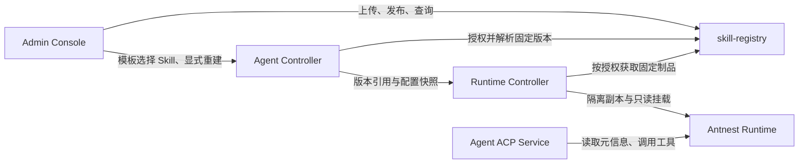

# Skill Registry 职责拆分与参考分析

> 日期：2026-09-26
>
> 状态：2026-09-26 首轮参考调研的历史记录，下文“当前”指当时状态。
> 首版托管、模板联动和 Runtime 只读交付现已落地并通过全新开发部署验收；
> 当前没有需迁移的旧业务数据。用户已将首版收缩为托管、模板联动和 Runtime
> 只读交付；当前范围、技术选择和交付批次以
> [最小版本技术方案](skill-registry-minimal-design.md)为准。
>
> 范围：参考 ClawHub 与用户确认的腾讯 SkillHub（skillhub.cn），细化
> [阶段四规划](stage-4-services.md)中的 `skill-registry`；本批仅更新文档。

## 1. 定位与调研口径

`skill-registry` 定位为：**平台内可复用 Skill 的托管、版本与分发权威**。
它回答“有哪些托管 Skill、哪个版本允许谁获取”，
Agent 配置与执行链路回答“哪个 Agent 选用哪个版本，以及何时应用和执行”。

本次只读查看了两个站点的公开页面和官方仓库文档：

- [ClawHub 首页](https://clawhub.ai/)与
  [Gog 详情](https://clawhub.ai/steipete/skills/gog)：目录、分类、安装提示、
  文件/版本/依赖入口，以及具体版本的下载入口。
- [SkillHub 首页](https://skillhub.cn/)与
  [钢联 AI 详情](https://skillhub.cn/skills/mysteel/mysteel-datasearch)：发布入口、
  文件树、版本历史、质量报告、签名展示和安装入口。
- 发布、组织私有库、审核管理等登录后能力依据官方文档；本次没有创建账号、
  上传、安装、执行 Skill 或实测这些写入流程。SkillHub 公开 Open API 文档只对
  部分产品能力给出具体接口，不能把产品介绍当作全部接口已核验的证据。
  见 [SkillHub API 总览](https://github.com/Tencent/skillhub/blob/main/docs/README.md)。

以下记录参考事实与调研阶段的能力候选；候选不代表上游要求、当前首版范围或
本仓库已有实现。最小方案已排除搜索推荐、导入和审核评测等扩展。

## 2. 两个产品的功能与取舍

| 功能 | ClawHub 参考事实 | 腾讯 SkillHub 参考事实 | Antnest 当前取舍 |
| --- | --- | --- | --- |
| 发现与浏览 | 分类、精选/趋势/官方/新发布目录；官方文档另有语义检索说明。[目录](https://clawhub.ai/skills) / [说明](https://github.com/openclaw/clawhub/blob/main/README.md) | 分类、中文描述、来源/标签筛选和榜单。[检索](https://github.com/Tencent/skillhub/blob/main/docs/api/skills.md) / [分类](https://github.com/Tencent/skillhub/blob/main/docs/api/categories.md) | 首版只做组织内有界列表供模板选择，不做搜索与推荐 |
| 包与发布 | 以 `SKILL.md` 和配套文件发布版本；本地发布与网页 GitHub 导入的来源限制不同。[包格式](https://github.com/openclaw/clawhub/blob/main/docs/skill-format.md) | 官方说明包含本地创作者发布、GitHub 导入和全球来源同步。[产品说明](https://github.com/Tencent/skillhub) / [能力](https://github.com/Tencent/skillhub/blob/main/docs/capabilities.md) | 首版只接受直接上传；外部导入与同步不在范围内 |
| 版本与检查 | SemVer、版本标签、变更说明和版本下载。[概览](https://github.com/openclaw/clawhub/blob/main/docs/clawhub.md) | 版本历史、逐文件清单、内容摘要和两个版本的差异接口。[文件](https://github.com/Tencent/skillhub/blob/main/docs/api/files.md) / [差异](https://github.com/Tencent/skillhub/blob/main/docs/api/versions-and-diff.md) | 首版正整数不可变版本、固定摘要和版本列表；不引入标签与包内容差异界面 |
| 权限与治理 | 发布者/组织管理、举报、隐藏和恢复等治理；不能据此推断具备 Antnest 所需私有租户模型。[治理](https://github.com/openclaw/clawhub/blob/main/docs/moderation.md) / [权限](https://github.com/openclaw/clawhub/blob/main/README.md) | 官方说明包含企业发布和组织内部技能库。[产品说明](https://github.com/Tencent/skillhub) | 复用现有管理员准入；Registry 保证组织隔离；首版没有审核/下架工作流 |
| 安全与质量 | 发布制品的安全审核、风险与结果分别展示。[审核](https://github.com/openclaw/clawhub/blob/main/docs/security-audits.md) | 安全报告与 TRACE 五维质量评测；结果对应具体版本，未评估是正常状态。[质量接口](https://github.com/Tencent/skillhub/blob/main/docs/api/evaluation.md) | 首版做包格式、路径与大小校验；不把校验称为质量评测或安全认证 |
| 安装与分发 | 客户端负责安装、更新、固定本地版本；仓库提供版本和内容。[概览](https://github.com/openclaw/clawhub/blob/main/docs/clawhub.md) / [说明](https://github.com/openclaw/clawhub/blob/main/README.md) | 下载按版本/tag 解析；详情有提示词与本地 Agent 安装入口。[下载](https://github.com/Tencent/skillhub/blob/main/docs/api/skills.md) / [页面](https://skillhub.cn/skills/mysteel/mysteel-datasearch) | Registry 分发固定制品，Controller/Runtime 链路负责应用，下载成功不能称为已安装 |
| 社区与运营 | 收藏、评论、下载统计。[说明](https://github.com/openclaw/clawhub/blob/main/README.md) | 收藏、评论、企业专区、推荐与下载榜。[首页](https://skillhub.cn/) / [页面](https://skillhub.cn/skills/mysteel/mysteel-datasearch) | 首批不引入社区运营体系；分发统计不能代替实际安装/运行统计 |
| 扩展产品 | 当前另有代码插件、Bundle 插件和实验性整 Agent 包。[说明](https://github.com/openclaw/clawhub/blob/main/README.md) | 当前页面另有插件广场、专家包与 SkillPay；官方能力说明还涉及沙箱运行。[首页](https://skillhub.cn/) / [能力](https://github.com/Tencent/skillhub/blob/main/docs/capabilities.md) | 这些能力不自动归入 Skill Registry；商业结算、Agent 运行和插件体系不纳入首批 |

SkillHub 的 TRACE 是 Skill 质量维度名称，与本仓库 OpenTelemetry/Jaeger Trace
验收无关。两站报告均应按其实际版本和状态解释，不能把“有分数”或“无报告”
转换成平台已批准使用。[SkillHub 结果语义](https://github.com/Tencent/skillhub/blob/main/docs/api/evaluation.md)、
[ClawHub 结果语义](https://github.com/openclaw/clawhub/blob/main/docs/security-audits.md)。

## 3. 调研能力与最小范围的映射

首轮调研曾提出六项内部职责；用户随后收缩首版范围，按下表取舍。这些维度
不是六个服务，也不再沿用原先宽泛的“首批”承诺。

| 调研维度 | 最小版本范围 | 范围外候选 |
| --- | --- | --- |
| 包托管 | 组织内 ZIP 上传、`SKILL.md` 校验、固定内容/摘要 | 外部来源转换、托管插件或整 Agent |
| 版本与发布 | 不可变正整数版本、幂等发布、固定下载 | SemVer/tag、草稿审核、下架与删除 |
| 检索与展示 | 有界目录和版本列表，供模板选择 | 搜索、分类、标签、文件预览、推荐 |
| 来源导入 | 无 | ClawHub/SkillHub/GitHub 导入与同步 |
| 访问与治理 | 现有管理员入口、组织隔离、路径/大小等包校验 | 质量评测、安全扫描、人工审核和跨组织共享 |
| 制品分发 | 明确版本与摘要，RC 按 Agent 交付只读集合 | 热更新、跨 Agent 缓存、运行中强制撤回 |

`SKILL.md` 配套脚本仅作为文件托管，不在发布或交付时执行；上游专用元数据不
转化为 Antnest 工具、网络、凭据授权或安装指令。包格式、存储、接口与版本
语义已在 [最小技术方案](skill-registry-minimal-design.md)中具体化，正式 schema
仍需合同批次登记。其他服务只通过接口获取内容，不读取 Registry 数据库或存储。

## 4. 与现有服务的分工

| 服务 | 拥有的职责 | 与 Registry 的边界 |
| --- | --- | --- |
| Identity Service / Edge Gateway | 现有身份、组织成员与入口认证 | Registry 使用可信主体，自己判断资源操作权限 |
| Admin Console | 上传、版本列表和模板选择页面及薄 BFF | 仓库操作调用 Registry；模板与 Agent 操作调用 Agent Controller |
| Agent Controller | Template/AgentSpec 的 Skill 选择、固定版本引用，以及显式应用/重建 | 保存引用和配置，不保存包字节，不访问 Registry 存储 |
| Runtime Controller | 将已授权的固定制品交付到相应 Runtime，管理隔离副本、挂载与清理 | 获取包走 Registry 合同；落盘和部署动作归自己的适配器 |
| Antnest Runtime | 读取已交付的系统 Skill、保留个人 Skill，并通过既有工具执行 | 不自行决定仓库发布、组织权限或 Agent 升级策略 |
| Agent ACP Service | 构建上下文、Session/Run、工具准入与执行审计 | 不把 Skill 包托管或后台安装搬到 ACP；不另建 Skill 执行循环 |
| Agent UI / Channel Manager | 当前 Skill 首版没有新增入口 | Registry 不保存对话状态或解析渠道消息；未来命令另行设计 |
| Task Scheduler | 用户定时任务与触发记录 | 不参与首版 Skill 托管和交付 |

Runtime Controller 的制品交付仍是待实现设计，当前只有只读卷挂载。
最小方案经 2026-09-27 评审修订，选择模板固定版本、每 Agent/集合摘要的独立
只读卷及显式重建更新；集合在 Initialize 或 Drain/Fence 前独立准备并可恢复，
不按 compute generation 重下，也不做跨 Agent 缓存。旧正文通道永久为空，
旧共享卷先盘点备份并显式迁移；正式接口和恢复规则仍须经 B0 落实。

建议的系统 Skill 应用流程如下，所有新增箭头均待实现：

这里至少有四种结果：包已发布、Agent 已保存引用、Runtime 已应用、某次 Run
已使用。页面和 API 应分别报告，不能把一次成功下载当成整条流程完成。
系统 Skill 升级通过模板修订与显式重建，保持运行中的配置快照稳定；首版不做
个人 Skill 发布或转换为系统 Skill 的产品流程，不自动接管工作区文件。

## 5. 当前实现提供的基础与缺口

| 当前事实 | 对后续设计的影响 |
| --- | --- |
| Controller 的 `skill_refs` 输出 schema 仍限定空列表。[合同](../contracts/agent-controller/control-api.schema.json) / [Template 语义](../contracts/agent-controller/control-api.md) | Registry 实现后仍需单独交付 Controller 引用和配置合同 |
| Runtime Controller 挂载部署级 system-Skill 卷，当前只检查存在性。[运维说明](../services/runtime-controller/docs/operations.md) | 现有共享卷不能直接承担各组织私有包与各 Agent 不同版本的分发；需明确隔离副本和生命周期 |
| Runtime 已区分 `/skills` 系统 Skill 与 `$HOME/.antnest/skills` 个人 Skill。[Runtime 合同](../runtimes/antnest-runtime/docs/mcp-contract.md) | 两个来源继续保留；仓库内容不覆盖个人目录，同名项不得静默覆盖 |
| Runtime 每源最多返回 32 项有效 Skill，完整内容按需读取；ACP 每 Run 刷新元信息。[现有链路](runtime-context-and-managed-mcp.md) / [Runtime 合同](../runtimes/antnest-runtime/docs/mcp-contract.md) | 配置准入与上下文预算须对齐这些上限；不能允许选用列表静默截断后仍显示全部生效 |
| 当前 Runtime Skill 摘要只携带来源、名称、描述和路径。[实现](../services/agent-acp-service/src/domain/runtime-information.ts) | 最小方案复用该接口；配置版本取自 Controller，交付结果由 RC 验证，不从目录名推断版本 |

## 6. 当前交付顺序

[最小技术方案](skill-registry-minimal-design.md)已替换本轮原先的 S0–S7 建议：
共享合同 B0 → Registry B1 → Agent Controller B2 → Runtime Controller B3 →
Admin Console B4 → ACP B5 → 显式集成 I1。B5 明确封闭 `skill_instructions`
旧正文通道；Runtime 复用发现/读取，并在真实交付和共享格式样例中验收。其它
缺口另开所属服务批次；外部导入、评测和搜索没有纳入这条交付链路。

所有批次均待启动。新行为测试先行，单元、合同、组件和适用 Docker E2E 分别
提供证据。发布、配置、实际交付和 Run 使用须独立验收。参考网站不代表已经接入；
本文和最小方案均未新增服务实现、部署项、协议 schema 或测试源码。
