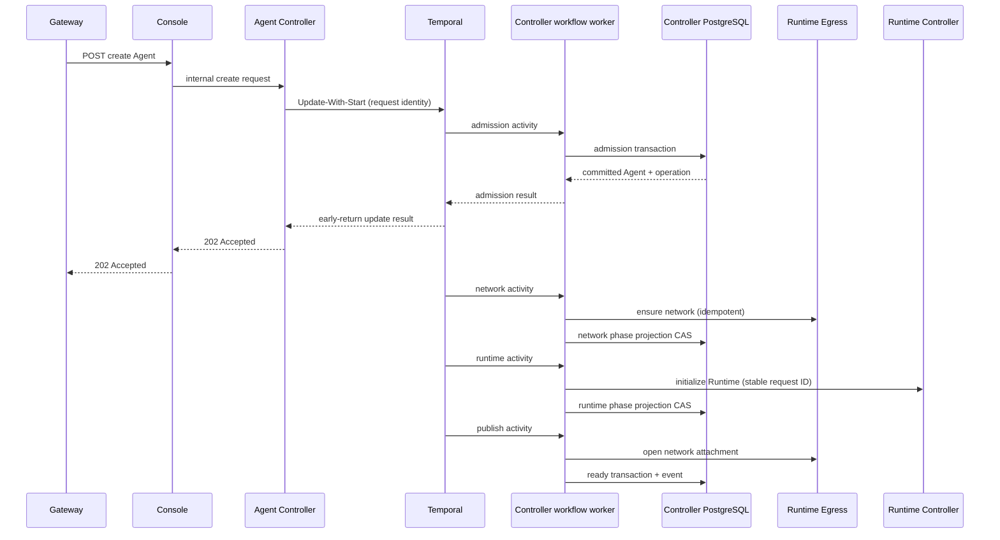

# Create Agent: durable workflow pilot

Status: implemented and locally verified on 2026-09-12; awaiting human Trace review.
Historical scope: Agent creation pilot. The current implementation covers all
five kinds; see [lifecycle workflows](lifecycle-workflows.md).

## Ownership

Temporal owns durable scheduling, activity retries and process-crash recovery.
The Agent Controller owns admission, immutable configuration, resource calls,
phase projection and failure semantics. PostgreSQL lifecycle rows remain the
business read model, not the creation work queue. All kinds now use Temporal; the PostgreSQL recovery worker and its
scheduling columns have been removed. This page retains the initial pilot
acceptance as historical context.

The workflow uses the official Go SDK and its OpenTelemetry interceptor. Neither
domain methods nor activities call Tracer.Start. SDK headers propagate the
Gateway request context into workflow and activity execution. Existing HTTP/RPC
and PostgreSQL instrumentation makes downstream calls children of activities.

## Admission And Execution

1. Gateway and Console forward the existing create request.
2. Controller uses Update-With-Start with a stable workflow ID derived from the
   request ID. The workflow exists durably before any local Agent write.
3. An admission activity validates identity/configuration and atomically stores
   Agent, spec, access, operation and requested event. Its idempotency fingerprint
   rejects reuse of a request ID with different input, including organization.
4. An early-return update waits for that activity, then returns the existing
   create result. HTTP 202 means local admission is committed and the durable
   workflow owns further execution. It does not mean the Runtime is ready.
5. Network ensure, Runtime initialization and publication execute as separate
   activities. Phase CAS and stable downstream request IDs make retry after an
   ambiguous response safe. A completed phase is replayed without repeating its
   side effects. A stale failure cannot overwrite an advanced phase.
6. Successful publication atomically records the execution revision, marks the
   Agent available and appends its ready event. Existing SSE projection is kept.



## Failure Boundaries

- HTTP cancellation does not cancel an admitted workflow. No detached in-process
  goroutine is the authority for accepted work.
- Temporary transport/database failure or an unresolved Runtime effect retries
  under Temporal. No second PostgreSQL poller schedules the same create.
- The SDK adapter heartbeats activities every five seconds with a 30-second
  heartbeat timeout; a crashed process need not consume the full 15-minute
  attempt budget. Worker shutdown cancels the dependency-call context. This is
  execution liveness, not a custom business queue or distributed lease.
- A definitive invalid input is returned before HTTP 202. A definitive build
  failure becomes the existing unavailable Agent and failed operation/event.
- Do not blindly compensate by deleting workspaces or allocated resources.
  Diagnostic retention and explicit deletion remain the product policy.
- Workflow history stores request identifiers and activity results, not model
  credentials or the resolved Agent spec. Engine storage is private infrastructure.
- The deterministic workflow command must remain replay-compatible while open
  workflows exist. Workflow history replay tests are required for future changes.

## Acceptance

- SDK tests: early admission, stage ordering, transient retry, definitive failure,
  duplicate requests, conflicting input and caller cancellation semantics.
- PostgreSQL tests: create excluded from old queue, phase CAS, duplicate stage
  delivery and stale failure rejection; other lifecycle lease tests still pass.
- Real engine test: worker restart continues durable creation, without changing
  request IDs or duplicating an Agent/Runtime.
- Gateway browser flow creates a usable Agent without invoking an LLM. After a
  six-second export grace, Jaeger has one Gateway-rooted trace with official
  workflow/activity spans, nested downstream RPC/SQL and no missing parents.
- Keep final counts and trace URL, not raw trace payloads containing credentials.

## References

- [Temporal Update-With-Start and early return](https://docs.temporal.io/develop/go/message-passing)
- [Official OpenTelemetry interceptor](https://github.com/temporalio/sdk-go/tree/main/contrib/opentelemetry)
- [Supported PostgreSQL Compose example](https://github.com/temporalio/samples-server/blob/main/compose/docker-compose-postgres.yml)

## Verification Result

- Official Go SDK 1.48.0, OpenTelemetry adapter 0.8.1, Server/admin-tools 1.31.0.
- `make -j1 fmt-check lint`: passed; golangci-lint reports zero issues.
- Full Controller race/PostgreSQL/HTTP/Temporal suite: 14 packages, 426 tests,
  385 subtests, zero failures or skipped tests. The real engine test replaces a
  Worker during a retryable dependency operation and cancels the HTTP caller's
  context; admission, network and publication execute once, Runtime twice.
- Deployment, lifecycle and observability script tests: 401 passed. These include
  missing-parent, duplicate-stage, wrong-dependency and failed-prefix fixtures.
- Normal browser creation: Agent `agent_7faa387fe726cd8091c330b642e134b4`,
  operation `lifecycle-ba8fff06db5a9e95f3067e294a7bc0ce876b6156666fec2b2cf6417dc70e1605`,
  completed in about 3.5 seconds, Available, Runtime assigned and configuration
  published. Legacy recovery attempt count remains zero and no lease is held.
- [Gateway-rooted Trace](http://127.0.0.1:16686/trace/e8ce24d85296149ba14472dc7e594c10):
  182 spans, four SDK activities, zero missing parents and zero Jaeger warnings.
  No ACP Run or external Provider invocation was performed.
- Controller image: `sha256:06cb0368b324124d7e689541690493b2fdda496b275b9fd0dfd0b7bbdb060168`.
  The isolated test database was removed; acceptance Agents remain for review.

Operational finding: adding a network to the existing shared PostgreSQL caused
a container restart. The unchanged Runtime Controller and ACP processes exited
on that disconnection and needed to be started again. After dependency recovery,
the first accepted creation resumed with its original request ID and became
Available. Its diagnostic trace is
`9c939b025e6385cbbb446b158d6d0289` and contains expected failed dependency attempts;
it is not the normal-path trace above. A deployment that recreates shared
PostgreSQL must verify all dependent services, not only the new engine. General
dependency-disconnection supervision is outside this creation pilot.

Run the reusable normal-path check after final publication:

```sh
node scripts/observability/check-create-workflow.mjs \
  --trace e8ce24d85296149ba14472dc7e594c10 \
  --request lifecycle-ba8fff06db5a9e95f3067e294a7bc0ce876b6156666fec2b2cf6417dc70e1605
```
