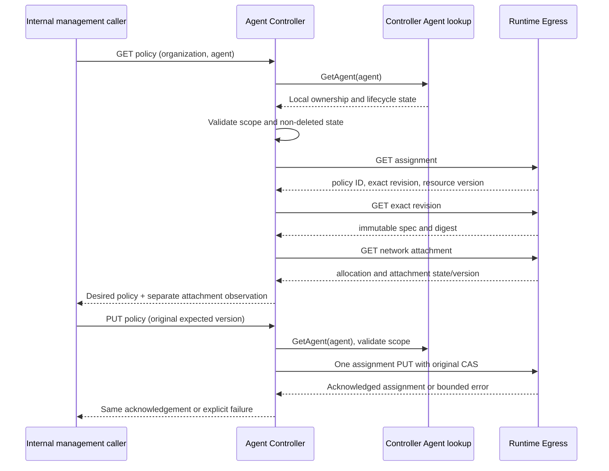

# Agent Network Policy Management

This document describes how Agent Controller exposes organization-scoped
network policy reads and assignment CAS through Runtime Egress, and how those
calls fail and recover.

## Ownership

Agent Controller provides organization-scoped management entrypoints; Runtime
Egress owns policy revisions, assignment versions, Tunnel allocation and packet
enforcement. Agent Controller uses only its own Agent lookup and Egress HTTP
RPC. It does not read Egress PostgreSQL tables or copy policies into AgentSpec.
These commands have no Controller table, migration, lifecycle operation,
generation, or event journal.

These are trusted internal RPCs. Edge/Console must authenticate administrators
and derive caller scope before forwarding them. Required organization checks
remain here even when the external caller has already been authenticated.

## Contract

The authoritative wire definitions are [control API](../../../contracts/agent-controller/control-api.md),
[machine contract](../../../contracts/agent-controller/control-contract.json) and
[JSON Schema](../../../contracts/agent-controller/control-api.schema.json).
Production composition requires the network policy service;
routes cannot start with a missing implementation.

- `GET /internal/agents/{agent_id}/network-policy?organization_id=...` returns
  the assignment's exact immutable policy revision, spec, digest and resource
  version, plus the independent lifecycle attachment state and version.
- `PUT /internal/agents/{agent_id}/network-policy` requires `request_id`,
  `organization_id`, `actor_principal_id`, `policy_id`, `revision` and
  `expected_resource_version`; it returns the acknowledged assignment.

Only schema-1 `allow_all` and `deny_all` specs are supported. Behavior comes
from the exact revision's spec, never from its name or the latest revision.
Policy IDs are opaque visible-ASCII keys and are URL-escaped as one path
segment. Agent identifiers follow the existing Controller identifier contract.

Both methods reject absent, foreign-organization, deleting, and deleted Agents
before any Egress request. A disabled Agent may save a desired policy, but this
does not reopen its attachment. All responses use `Cache-Control: no-store`.

## Call Sequence



The read is not a transaction across services, nor even an atomic snapshot of
the independent Egress resources. Concurrent lifecycle/configuration changes
are resolved by Egress assignment CAS and its independent attachment barrier.
Controller does not add another cross-service lock. A successful policy write
does not update the Agent aggregate, release Run occupancy, or rebuild Runtime.

## Failure And Recovery

- One incoming mutation makes one Egress mutation attempt, without automatic
  retry, redirect following, read repair, or a post-write GET that could hide an
  acknowledged success behind a later read failure.
- `request_id` correlates logs/traces; unlike lifecycle commands it is not a new
  Controller idempotency ledger. Retry the original Egress tuple
  `(agent_id, policy_id, revision, expected_resource_version)`.
- `409 resource_version_conflict` requires a fresh read and an explicit new
  administrator decision. Do not silently rebase the expected version.
- A truncated/lost response, timeout, cancellation, or `503 cleanup_failed`
  does not prove rollback. Preserve the original request for explicit replay.
  GET reads desired configuration only; even matching policy and an `open`
  persisted attachment do not prove that a failed packet cleanup recovered.
- `502 dependency_invalid_response` rejects malformed, oversized, mismatched,
  or unsupported dependency responses. Unknown upstream messages are never
  reflected to clients. `404` missing allocation/revision does not create one.
- A disabled Agent's attachment remains closed regardless of desired action.
  Policy changes made then take effect under the lifecycle open operation's
  normal Egress enforcement, not via an implicit enable here.

## Observability And Verification

Controller HTTP spans retain the incoming W3C parent. Each Egress policy call
adds a client span and propagates its context; response validation is inside
the span lifetime so malformed HTTP 200 responses are errors, not successes.
Policy mutation logs carry request, organization, Agent, actor, policy revision,
expected version and bounded outcome. No Provider secrets or packet spans are
introduced.

Coverage lives in application scope/CAS tests, Egress client wire tests,
server machine-contract tests and
[HTTP component tests](../internal/server/network_policy_flow_test.go) plus
[trace ancestry tests](../internal/server/network_policy_trace_test.go).
Tests cover wrong scope, disabled-state preservation, exact revision, repeated
CAS, response loss, conflict, invalid response, redirect rejection and context
cancellation. These tests use a synthetic Egress and do not verify deployed
packet enforcement.

```sh
go test -race -p=1 ./services/agent-controller/...
make test-agent-controller-postgres
make fmt-check lint
```

Deployed lifecycle and network operation in Docker is described in
[Docker single-node operations](../../../docs/docker-single-node-operations.md).
