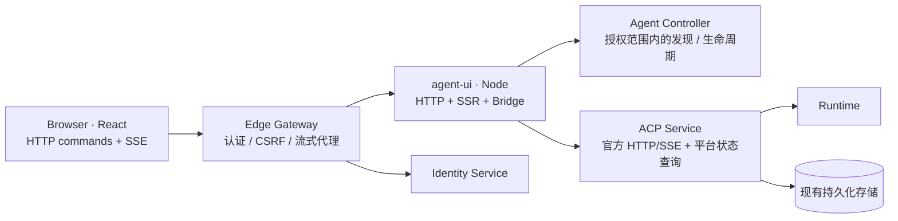

# Agent UI 全栈与 Bridge 重构方案

> 2026-09-25 实现对齐修订优先于本文早期交付记录。当前契约与门禁状态见
> [attyd 对齐修订](attyd-alignment-fixes.md) 和
> [Workspace API](../../../contracts/agent-ui/workspace-api.md)。

当前补充：异步 Prompt 在 HTTP 202 后失败时，ACP 的持久化 Run `error_class` 经授权回执、Node operation View/SSE 传到浏览器。最新失败轮次若是 `model_unsupported_content`，界面显示可操作的附件提示，并在 Agent 恢复 ready 时允许继续编辑和发送。旧 WebSocket 请求错误映射已移除；根目录 Chromium HTTP/SSE fixture 已覆盖这一路径。

日期：2026-09-25。状态：**B0–B5 的主路径与开发部署单一路径已接通；真实跨服务浏览器回归覆盖运行恢复、取消、权限重绑和部署重启，固定负载、十分钟限速 SSE 与生产容器冷启动门槛已通过。完整读屏器/键盘验收及超出固定样本的长期容量仍未完成，因此不宣称 I1/I2 全面验收通过**。

本方案将现有 `agent-ui` 扩展为 TypeScript/Node 全栈服务：Node 后端持有 ACP 客户端与 Bridge，浏览器通过业务 HTTP API 提交操作，通过 SSE 同步状态，React 提供交互与适量 SSR。沿用一个 `agent-ui` 服务、一个部署单元，不新建 Bridge 服务或数据库。ACP Service 继续独占 Session、Input、Run、消息和权限决定的持久化与执行权威。

这是现有服务的重构，不引入阶段四规划中的新服务，也不改变已记录的阶段三验收结论。本文覆盖目标架构、协议、恢复、安全、内存、SSR、部署和分批验收；现状仍以 [architecture.md](architecture.md) 为准。

当前工作进度：B0 共享契约、B1 ACP 受理与交付扩展、B2 Node Bridge、B3 Gateway 代理和 B4 浏览器 HTTP/SSE 主路径已有本地实现与测试。B5 Node 流式 SSR、请求级授权 bootstrap、CSP nonce 和 hydration 已通过服务内、Chromium 与生产容器 fixture 检查。开发阶段采用单一路径：标准 `agent-ui` Dockerfile 和根 Compose 直接构建 Node 服务；Gateway 通过 `ANTNEST_AGENT_UI_URL` 将 HTML、静态资源和业务 HTTP/SSE 统一送到它；开发入口也默认使用 Bridge。旧 Nginx 和浏览器 ACP 入口已移除，不设兼容或回滚模式。真实 Gateway/Identity/Node/ACP/Controller/Runtime 隔离 Docker 浏览器 E2E 已验证认证 SSR、Session 创建、Run 受理、页面关闭、Node 正常重启后的新 epoch、ACP 持续执行、结果恢复及模型单次请求；还验证 Stop 断开受控模型请求后可继续执行、旧 Run 的延迟取消请求不会中断新 Run、待批准工具请求跨页面关闭和 Node 正常重启后重新绑定并完成决定、Prompt 的浏览器响应延迟超过 30 秒后按原 intent 查询且模型仅执行一次，以及身份撤销使已打开页面清空私有内容、保留规范化 Agent/Session `return_to` 并返回登录入口。真实浏览器长历史回归已验证 `turnPage.nextCursor` 与 `newerCursor` 双向续页及 40 轮 DOM 窗口。服务内多身份测试现覆盖完整历史保留和独立空闲回收，累计历史字节配额已移除；固定六服务负载下的三次跨运行 SSR/内存门槛已通过；独立生产容器的三次未经健康检查的首次认证 HTML 测量也已通过。十分钟本地限速 SSE 曲线已覆盖三个慢观察者和每条事件的队列峰值；真实六服务已覆盖固定 80 Run 的限速观察。读屏器与键盘的完整无障碍验收，以及跨机器和更长周期的容量分布仍待完成。

## 1. 目标与范围

交付后必须满足：

1. 刷新、关闭页面、切换 Session、浏览器网络断开，不中止已经由 ACP 接受的执行；重新打开可恢复历史、运行状态和待批准请求。
2. 同一用户的多个页面观察同一执行。Bridge 统一持有连接、回放和权限请求，页面不再各自创建 ACP 客户端。
3. 命令请求快速返回受理状态；长时间运行通过 SSE 观察。普通 HTTP 超时不等于执行失败，也不触发自动重发。
4. 完整保留现有 Agent → Session 导航、配置选项、Provider fallback 提示、取消、权限、多模态输入、Usage、附件和无障碍行为。
5. 初始页面更快显示可用框架和已知状态；长历史按需展示过程，浏览器窗口和交付队列有明确的内存边界，Bridge 保留完整业务历史。
6. Bridge 重启后的执行继续、状态恢复和重复提交处理有明确保证，不把进程内幂等描述成跨重启 exactly-once。

本期不做：多副本 Bridge 主从协调、跨地域部署、离线执行队列、浏览器持久化业务数据、新项目层级、新的 Agent Runtime、ACP 原始历史的服务端分页协议、SSR 全量历史、复制 attyd 的本地进程启动/终端/文件系统管理能力。Bridge 的业务 API 已提供轮次续页，浏览器按需加载并限制可见 DOM 轮次。正式 UI 不使用 WebSocket；ACP 面向其他客户端的标准 WebSocket 接口保留。

## 2. 参考依据与适配结论

参考 `tf4fun/attyd` 的 `main`，已于本方案日期核对远端与本机源码，基线为 [`754ac145ab6d8a3437655e778f7a06fb04aa7239`](https://github.com/tf4fun/attyd/commit/754ac145ab6d8a3437655e778f7a06fb04aa7239)。借鉴其职责划分与经过测试的状态约束，按 Antnest 的远程 ACP、Identity 和 Gateway 边界重新实现 TypeScript 版本。

| attyd 机制 | 本仓库采用方式 |
| --- | --- |
| Bridge 持有 ACP 客户端，浏览器是可丢弃的视图 | 放入现有 agent-ui Node 后端；ACP 持久化权威不变 |
| 一个历史基线、一个活动执行覆盖层、至多一个回放候选 | 按身份和 Session 隔离；候选成功才原子替换，失败保留可读历史 |
| HTTP 命令与 SSE 观察分开 | 新增 UI 私有业务 API；不把 ACP JSON-RPC 原样透传给浏览器 |
| 版本检查、幂等键、进程 epoch、会话 incarnation | 采用；另补 ACP 持久化受理凭据，解决跨 Bridge 重启的受理识别 |
| 简化视图、过程分页、折叠后释放、慢订阅者容量控制 | 采用；先基于现有 ACP 完整回放做 Node 投影，无须先开发 ACP 历史分页 |
| 普通请求 30 秒/60 秒超时 | 作为浏览器/Node 初始默认值；不适用于 SSE 或 ACP 长 prompt |
| 无观察者且持续空闲后释放 | 只释放 UI 投影/连接；不自动调用具有业务含义的 `session/close` |
| 内存 Bridge、单写者、重启后可能 `Uncertain` | 保留诚实的不确定状态；不能直接当作可靠跨重启命令协议 |

attyd 的原始约束见 [Bridge 状态机](https://github.com/tf4fun/attyd/blob/754ac145ab6d8a3437655e778f7a06fb04aa7239/docs/bridge-state-machine-tdd.md)、[活动执行与内存](https://github.com/tf4fun/attyd/blob/754ac145ab6d8a3437655e778f7a06fb04aa7239/docs/active-turn-runtime.md)、[HTTP 超时](https://github.com/tf4fun/attyd/blob/754ac145ab6d8a3437655e778f7a06fb04aa7239/docs/http-request-timeouts.md)。其状态机明确不承诺未持久化 Bridge 跨重启的 exactly-once；Antnest 的增强点由下文单独的 ACP 批次负责。

### 重构前的基线与缺口

| 部分 | 重构前实现 | 目标差异 |
| --- | --- | --- |
| agent-ui 镜像 | Vite 构建，Nginx 提供 SPA | Node 24 提供静态资源、HTTP/SSE、Bridge、SSR |
| 浏览器连接 | `GatewayAgentConnection` 持有 SDK/WebSocket；另有状态 SSE | SDK 移到 Node；浏览器只有业务 fetch/SSE |
| Gateway `/workspace` | GET/HEAD 静态代理，无身份，移除 Cookie/Authorization | 资源仍可公开；文档入口需认证身份；增加认证 API/SSE 路由 |
| ACP v1 | 已支持官方 SDK Streamable HTTP `/v1/acp`、回放、断线不取消 Run、权限重绑 | 可复用，不需要再造 ACP 传输协议 |
| ACP 运行状态 | 可观察 busy、active_session_id、access/configuration revision | 缺少精确命令受理凭据、Run 终态与对应输出水位查询 |
| prompt 受理 | 服务端生成 requestId/runId；无稳定客户端意图键 | 增加可选平台扩展与持久化去重，不改变标准客户端默认行为 |
| React | 当前 `createRoot`；部分初始化访问 window | 分离浏览器依赖，增加 request-scoped SSR/hydration |

当前代码入口：[浏览器 Bridge 协调](../web/src/lib/use-bridge-workspace.ts)、[Node Bridge](../web/server/src/bridge/agent-owner.ts)、[Gateway 路由](../../edge-gateway/internal/server/handler.go)、[ACP 受理](../../agent-acp-service/src/application/prompt-coordinator.ts)、[当前执行状态契约](../../../contracts/agent-acp/agent-execution-state.schema.json)。

## 3. 目标架构与职责



Node 直接访问内网 ACP 和 Controller，避免形成 Gateway → UI → Gateway 的调用环。登录、登出与浏览器会话仍由 Gateway/Identity 管理；Node 不保存登录 Cookie、Provider 密钥或 Runtime 端点给浏览器。

| 所有者 | 职责 |
| --- | --- |
| 浏览器 | 路由、草稿、待发送附件、展开状态、焦点/滚动；消费版本化投影 |
| agent-ui Node | 每个授权作用域的 ACP 连接、命令协调、权限 inbox、可重建历史视图、SSE、SSR |
| Edge Gateway | 浏览器身份、同源边界、CSRF、路由、SSE 身份租约与吊销 |
| ACP Service | 访问复核、Agent 级运行锁、受理凭据、执行/取消、历史、权限决定、恢复 |
| Controller | Agent 目录、生命周期和配置发现；不成为消息或运行结果权威 |

首期一个 Node 进程、一个副本，不使用 cluster/PM2 多 worker。每个 `(organization, principal, agent)` 只创建一个连接所有者；Session actor 追加 `sessionId`。浏览器会话标识仅用于订阅授权，不能成为跨用户缓存共享的依据。Agent 的全局忙状态仍由 ACP 裁决，不能用每用户 Bridge 锁替代。

## 4. 服务内组织与技术选择

沿用 Node 24、TypeScript、React、Vite 和官方 ACP SDK，不为本次迁移同时引入 Next.js、React Server Components 或第二套前端路由体系。Node 使用显式 HTTP 路由与运行时 schema 校验；复用现有技术栈能满足 API、SSE 与流式 SSR。实现时统一服务入口脚本与锁文件，避免浏览器/服务端依赖版本漂移。

建议结构（下列目录为最终整理目标；B2 初期 Node 模块暂放在 `web/server/`，与浏览器代码共用现有依赖锁文件）：

```text
services/agent-ui/
  server/src/
    http/             # 路由、身份上下文、请求限额、SSE
    bridge/           # registry、Session actor、operation、交付水位
    adapters/         # 官方 ACP SDK、Controller、执行观察
    projection/       # baseline / overlay / replay / compact view
    ssr/              # React server entry、HTML 安全序列化
    lifecycle/        # readiness、drain、资源预算
  server/test/        # Node 单元与服务组件测试
  shared/             # 浏览器安全 DTO、schema、纯 reducer；无网络/Node/window
  web/src/
    lib/              # HTTP/SSE adapter、投影 store、浏览器交互状态
    components/       # 尽量保留现有组件
  docs/
tests/integration/agent-ui/  # 真实协议与浏览器 fixture
tests/e2e/agent-ui/          # Docker 跨服务验收
contracts/agent-ui/          # HTTP、SSE、DTO 的规范源
```

ACP SDK 移入 Node，浏览器产物不再包含 ACP transport。以当前精确锁定的 SDK 1.4.0 为迁移基线；现有实验入口 `@agentclientprotocol/sdk/experimental/http-client` 的 `createHttpStream` 支持 POST/SSE，配置内部身份 headers 与 `cookies: "omit"`。该入口的实验属性要求锁版本并保留真实 wire 契约测试；版本升级另行验证，不能仅依据落后的文档假定兼容。

浏览器组件依赖工作区 DTO 而非 ACP SDK 类型；`useBridgeWorkspace` 负责导航、投影订阅与本地交互编排，不保留旧 ACP 浏览器 adapter。涉及 `File`、Blob URL、DOM、EventSource 的对象不得进入 shared 或 SSR 模块。

## 5. 身份、访问控制与同源路径

对外保留 `/workspace/`、`?agent=`、`&session=`。新增业务前缀 **`/api/app/workspace/v1/`**；其名称体现工作区能力，不暴露 Bridge 实现细节。

- Gateway 每次 HTTP 请求验证 Identity 会话，剥离外部伪造的内部身份头，再注入已验证的组织、用户/principal、membership 与必要的请求关联信息。Node 拒绝缺失或非法身份；不采信 URL/body 中的身份字段。
- `/workspace/assets/*` 等构建资源可匿名缓存；HTML 文档入口认证后转发给 Node，响应 `private, no-store`。未登录按现有登录流程跳转，不输出其他用户 SSR 数据。
- 登录跳转保留经过规范化与同源校验的 Agent/Session `return_to` 深链接，不能退回默认会话或形成开放重定向。原生 EventSource 无法可靠提供 HTTP 状态，流失败后由认证 bootstrap 查询区分网络异常、401 与 403：401 停止重连并进入登录，403 清除被撤权范围，其余可恢复故障才退避重连。
- 非安全方法复用现有 CSRF 契约并检查 Origin；JSON 类型、body 大小、解码后附件总量、并发请求均有限制。代理 body 上限不得小于当前已支持的多模态上限。
- 新 SSE 路由允许作用域内的 `Last-Event-ID`，与目前拒绝该头的 Agent-state SSE 分开定义；不能直接继承旧路由限制。
- SSE 使用同源 HttpOnly Cookie 认证，无 URL bearer token。Gateway 周期复核会话/权限，即使流没有业务事件也必须在租约到期前复核；失效即关闭，前端清空对应私有状态。
- 现有内部可信网络与 ACP trusted identity headers 是本次基线。把 agent-ui 列为明确的内部调用方，并限制其内网入口与网络访问；不假称现有链路已有 mTLS/签名。新建公开 Node 直连入口不在方案内。

需要区分两种失效：**退出登录/浏览器会话过期**只撤销该观察者与后续命令，不取消已授权的 Run；**真实 Agent 访问撤销**遵循 ACP 现有 revoke 流程，可停止执行并撤销权限请求，Bridge 随即清理该作用域。缓存命中、幂等命中、过程分页和 SSR 都必须先验证访问，不能绕过授权。

## 6. Bridge 状态与所有权

三个维度分别建模，避免一个枚举同时表达连接、历史和执行：

| 维度 | 状态 |
| --- | --- |
| 连接所有者 | connecting / ready / reconnecting / draining / retired |
| Session 历史 | cold / loading / ready / reconciling / blocked |
| Operation | dispatching / accepted / running / awaiting_permission / cancelling / completed / failed / cancelled / uncertain |

执行状态来自 ACP；`dispatching` 只是 Bridge 已接收，`uncertain` 表示不能确认受理/完成，均不能伪装为 ACP Run 终态。权限是独立 inbox，可同时显示在非当前 Session 的导航中。

每个进程有随机 `bridgeEpoch`，每次 Session 物化有随机 `incarnation`，每次加载/连接尝试有 attempt token。异步回调发布前校验三者；旧连接、旧回放、旧权限答复不允许覆盖新状态。额外区分：

- `viewRevision`：UI 投影的单调版本，包含配置、Usage、权限等变化。
- `streamRevision`：当前 Agent 聚合订阅的连续发布序号，独立于各 Session 的 viewRevision；切换选定 Session 创建新的 subscription projection id。
- `appendVersion`：ACP 持久化的 Session 命令追加版本，控制下一条 prompt 的受理位置；不随 token 流增长。
- `outputWatermark`：ACP 已持久化输出的水位，用于回放与状态对齐。
- `historyToken`：opaque 条件令牌，绑定 scope、epoch、incarnation、appendVersion；不是消息数量或时间戳。

Session 保存一份确认历史 baseline、一份运行中的 overlay、至多一份 replay candidate。回放期间保留旧视图；候选成功且水位对齐后一次替换。活动执行完成时，按受理凭据/Run 标识合并一次，再清理 overlay。ACP 缺少的历史时间戳保持未知，不以接收时间补写。

页面消失只减少观察者。运行、待权限、取消中、回放中以及回放重试等待均持有工作引用，不受无观察者清理计时影响。空闲且无观察者持续 5 分钟后可释放投影；释放不是删除 Session，也不发送 `session/close`。后续通过标准 `initialize` → `session/load` 重建。

## 7. 浏览器 HTTP 契约

以下接口为 **拟定 v1 契约**，B0 的[机器路由清单](../../../contracts/agent-ui/workspace-api.json)、[schema](../../../contracts/agent-ui/workspace-api.schema.json)、[语义说明](../../../contracts/agent-ui/workspace-api.md)及[ACP 扩展契约](../../../contracts/agent-acp/workspace-bridge.md)固定了初始形状；服务实现和跨服务验收仍按后续批次执行。`A`、`S`、`O` 分别代表 Agent、Session、操作标识；所有资源都隐含当前授权 scope。

| 方法与相对路径 | 语义 |
| --- | --- |
| `GET /bootstrap` | 身份安全摘要、可访问 Agent、UI 能力；复用 Controller 授权发现 |
| `GET /agents/A/sessions?cursor=...` | ACP Session 目录分页，保留不完整目录的语义 |
| `POST /agents/A/sessions` | 创建 Session，保持 cwd `/workspace`、mcpServers `[]` |
| `GET /agents/A/view?sessionId=S` | 获取 Agent 可用性、活动 Session、跨相关 Session 的操作/权限摘要及可选 Session 投影；不选 Session 仍可观察 Agent |
| `GET /agents/A/sessions/S/view` | 获取该 Session 的 compact snapshot、运行/权限/配置/Usage、版本与 SSE 起点 |
| `GET /agents/A/sessions/S/turns?cursor=...` | 按固定历史切点读取轮次窗口；活动轮次另行包含，不把整个历史装入一次响应 |
| `GET /agents/A/sessions/S/turns/T/content?cursor=...` | 读取超出内联预算的 prompt/最终回答内容块，保留完整内容与顺序 |
| `GET /agents/A/events?sessionId=S&cursor=...` | 单个当前 Agent 的聚合 SSE；`sessionId` 可省略，快照包含 Agent 视图、相关操作/权限及可选的选定历史 |
| `POST /agents/A/sessions/S/prompts` | 有条件受理 prompt，返回 `202` 与 operation 资源 |
| `GET /agents/A/sessions/S/operations/O` | 查询并对账该意图的受理、进度与终态；O 为原 intentId，跨重启可查持久化凭据，无需旧 historyToken |
| `POST /agents/A/sessions/S/operations/O/cancel` | 仅取消对应的当前 Run；不误取消后续 Run |
| `POST /agents/A/sessions/S/configuration` | 应用服务器公布的 config option/value；返回权威配置 |
| `POST /agents/A/permissions/P/decision` | 提交服务器提供的 optionId 与权限 generation；拒绝旧请求 |
| `GET /agents/A/sessions/S/turns/T/process?cursor=...` | 按稳定 turn/process version 获取已完成过程分页 |

此批不新增 Session 删除、分叉、导出等目前 UI 没有的业务入口。能力按 ACP 协商结果发布；输入多模态类型也沿用现有协商，不能因更换传输而扩大或缩小。

命令使用 `Idempotency-Key`；prompt 另外要求 `If-Match: <historyToken>`，body 固定其最初的 `expectedAppendVersion`。浏览器点击发送时生成稳定 intentId；prompt 的 operationId 就是该 intentId，因此即使 POST 响应丢失也能查询。配置、创建等其他命令的 Bridge 去重默认只覆盖同一 epoch，不暗含跨重启保证。查询参数/HTTP 日志不含 prompt。结构化错误包含 `code`、安全的 `message`、`requestId`、`retryable`、可选 `operationId` 和当前恢复动作；不含内部地址、堆栈或凭据。

建议固定错误：未登录 `401`、不可访问 `403`（资源存在性按现有隐藏规则处理）、不存在 `404`、版本/作用域变化或繁忙 `409`、缺条件 `428`、过大 `413`、不支持内容 `422`、配额 `429`、依赖暂不可用 `503`、普通等待超时 `504`。同键不同内容是 `409 idempotency_conflict`；旧 epoch 是 `409 bridge_replaced`；不能确认提交结果是可查询的 `uncertain`，不转换成可盲重试的失败。

浏览器普通 JSON 请求默认 30 秒，Node handler 默认 60 秒；Gateway 对该路由的超时应留出 Node 返回结构化错误的余量。读取响应体也计入 deadline。读取超时可重取；命令超时先查原操作。用户离开页面的 AbortSignal 只取消等待，不传递给已脱离 HTTP handler 的执行监督器。SSE 单独采用心跳/身份租约；ACP prompt 跟随现有 Run deadline，不套用 30/60 秒。

未发出的草稿不成为服务端队列，仍只有页面内存生命周期，不承诺关闭页面后保存。刷新后从快照恢复当前执行与最近的受理摘要；不能因为页面遗失了本地 intentId 就重发文本。HTTP `202` 表示 Bridge 已接收并有可查询操作，响应明确 `acceptance: "bridge"`；只有 ACP 凭据确认后才显示已进入执行。首次创建 Session 的响应丢失或 Bridge 重启时，不自动再次 `session/new`；先刷新目录并提示结果待确认。首期不宣称所有变更都有跨重启幂等。

## 8. ACP 最小增强：持久化受理与重启查询

仅浏览器掉线，现有 ACP 能继续 Run、加载历史与重绑权限。**精确回答“刚才这一条是否被接受、最终如何结束”还需要 ACP 生产者改动**：现有 busy/active_session_id 不足以关联某次提交；重新 `session/load` 也不能补回丢失的原 prompt 响应。

本方案选择在 ACP 现有存储内增加受理凭据，不为 Bridge 建库，不引入新的执行系统：

1. 标准 `session/prompt` 的可选 `_meta` 携带命名空间 `antnest.dev/intent`，内容含 `intentId` 与 `expectedAppendVersion`。这是平台扩展，不能当作 ACP 官方必需字段；B0 用当前 SDK schema 验证透传，并定义 capability 协商。普通 ACP 客户端仍可省略。
2. ACP 在授权之后查去重凭据，再做新请求的 busy/版本检查。受理键作用域为 `(organization, principal, agent, session, intentId)`；服务端计算规范化输入摘要，覆盖有序内容块、资源内容和显式语义参数，不能相信客户端 digest。
3. 原子创建/关联 intent 凭据、Input/Run intent 与追加位置，确保并发重试最多产生一条持久化受理记录。随后 accepted/rejected/terminal 更新都可恢复；现有 createRunIntent/acceptRun 的分阶段事务必须显式覆盖崩溃窗口，不能只给应用层 Map 加去重。预期版本检查与追加提交在同一事务中完成。
4. 所有成功追加的 prompt，包括没有此扩展的标准客户端，也推进 `appendVersion`。同键同输入返回原凭据；同键不同输入拒绝。重复查询/重试不因该 Run 已完成或当前 Agent 已忙就遗失原结果，访问撤销仍优先。
5. 增加 **principal-scoped 内部执行观察契约**：查询 Session 当前运行摘要、近期受理摘要和指定 intent receipt，返回 runId、受理状态、终态/stopReason、appendVersion、outputWatermark、必要的权限/配置版本。沿用内部身份复核，不调用管理员审计 API 代替用户查询。共享契约固定配置修订摘要、`session/set_config_option` 的 `antnest.dev/configuration` 条件元数据，以及单独的 `configurationCas` 能力标志；ACP 生产者已从持久修订返回非空摘要，并通过元数据和数据库 CAS 拒绝过期写入。Node 消费者现在把浏览器 token 绑定的本地 View 与生产者修订分别核验，再向 ACP 转发原生产者修订；未声明 `configurationCas` 能力或缺少修订时拒绝配置写入。服务本地、生产镜像、隔离 PostgreSQL 和当前六服务浏览器 Mode 切换均通过；ACP 生产镜像已验证两个独立连接持同一修订并发写入时仅一方成功且数据库修订只增加一次。真实六服务 Docker/Chromium 回归现用两个独立 Node Bridge 容器对单独 Session 并发写入，验证一方成功、一方返回 `configuration_conflict` 409，且两端视图最终显示获胜值。Node 已修复忽略 ACP 无交付序号配置通知的问题，另一 Owner 可实时同步配置。
6. 重复的 SDK prompt 调用如何等待/返回同一个 Run 的结果在 ACP transport 测试中固定；任何重复分支均不得再次启动 Run。标准响应继续符合 SDK 类型，receipt 通过内部查询获取，不把自定义结构冒充标准 `PromptResponse`。
7. 操作取消需携带 `expectedRunId`，在 ACP 原子检查目标仍为当前 Run 后才取消。该约束必须贯穿持久化取消与内存 RunSupervisor 唤醒：slot 持有 runId，异步等待之后仍只 abort 匹配的 slot，不能再按 sessionId 取消新 Run。可选 namespaced metadata 与能力协商同样在 B0 定义；仅在 Bridge 本地先检查再发送无条件 `session/cancel` 存在竞态，不能作为最终实现。
8. 补齐 **可协商的交付 metadata**：现有 ACP replay/live update 不暴露持久化序号，仅在查询中返回数字不能证明 Node 收齐了输出。B0/B1 在不改变标准消息语义的前提下，为 Bridge 协商 `antnest.dev/delivery`：load 的封闭切点、输出事件 sequence、稳定 run/message 标识，以及一条持久事件拆为多个 ACP update 时的 part index/count 或明确 batch-end。过滤掉的状态事件需要 checkpoint；Node 只能在收到完整批次后推进水位。历史/实时转换均测试 metadata，不把 token 回调数量当序号。普通客户端未协商时维持原行为。

观察查询不另建长期事件数据库，复用 Inputs/Runs/消息事实。凭据至少保留到 Session 的既定保留周期；清理后的查询必须能表达 expired/unknown，不能把记录缺失当作从未执行。输出与终态按水位合并：终态已知而末尾输出尚未加载时，显示“同步结果中”，完成回放后再消除活动覆盖层。

有凭据可恢复 accepted/running/terminal；没有凭据仍可能是旧请求在途，必须暂留 `uncertain`。恢复入口就是 `GET .../operations/{intentId}`：按当前身份查询，返回当前 epoch 的操作视图，不要求旧 token，也不提交执行。不得自动换新 intentId 重发；显式重试先取新快照，再以新 `historyToken` 携带原 ID/输入/不可变 expectedAppendVersion 提交。新 token 只证明当前连接作用域，不能把原追加条件改为新的位置；ACP 先查既有凭据，缺失时按原 CAS 决定是否允许追加。旧 epoch 的命令未经此重新绑定不能直接进入新实例。

此保证是“同一受理意图不会产生多个 Run”，不是工具/模型外部副作用的 exactly-once，也不承诺重启后自动重跑被 ACP 判定中断的 Run。不同用户/非 Bridge 客户端的竞争仍由 ACP 权限和 Agent 运行锁决定。首期切换时不允许新旧 UI 同时拥有同一作用域的权限连接；支持多外部写者不作为 attyd 单写者假设的自然推论。

## 9. SSE 同步与背压

浏览器当前 Agent 使用一条聚合事件流，避免每个 Session 开一条 EventSource。切换 Agent 关闭旧观察流；Bridge 的已接受执行和工作引用独立存在。Agent 内切换 Session 重新订阅选定历史，待权限与运行摘要始终保留。

建议事件：`snapshot`、`delta`、`operation`、`permission`、`reset`、`access_revoked`；心跳使用注释，不修改业务版本。事件 envelope 携带 scope、epoch、subscription projection id、streamRevision 和 opaque cursor；Session delta 另带 sessionId/incarnation/viewRevision，不携带浏览器凭证。

1. 建立快照切点并注册其后缀订阅必须原子化；可以先返回 GET snapshot，再用其 cursor 订阅，但 Node 必须提供连续后缀或显式 reset，不能在两次请求间丢事件。
2. 浏览器按聚合流的 `fromStreamRevision → toStreamRevision` 检查连续性，再按 Session incarnation/viewRevision 应用内容；多个 Session 的本地版本不能混作全流序号。重复事件忽略，缺口、乱序、过期 suffix 或 epoch/projection id 改变触发 snapshot 重建。旧 incarnation 不得把已释放的 actor 复活。
3. SSE cursor 只用于范围内的恢复，不是授权凭据；不属于当前身份/Agent/Session 的 cursor 拒绝。原生 EventSource 首次连接无法设置自定义 header，故用 `cursor` 参数携带 GET snapshot 的切点；后续自动重连以 `Last-Event-ID` 为准，不反复使用原始切点。重启可返回 reset，不承诺把整个流永久落盘。
4. 每个订阅者使用有限个可替换状态槽和字节预算；token 增量合并后按有界批次发布，不为每个 token 复制完整 transcript，也不保存无界 overlay 版本日志。
5. 重要的 operation 终态、失败和权限待办写入当前可重建快照，不依赖某一个增量必达。超出队列预算时合并/发送 reset；写入持续阻塞则关闭该慢订阅者，不阻塞其他观察者或 ACP。
6. 交付水位仅在所有权移交/写入结果明确时推进；连接关闭、批次替换、失败释放的内存记账只结算一次。禁止把“已排队”误当“浏览器已收到”。

Gateway 必须禁用 SSE 缓冲与会滞留小事件的压缩，设置可写 deadline、透传 flush/Last-Event-ID，并定期复核身份。初始心跳建议 15 秒、身份租约最多 5 分钟，最终与既有 Gateway 约定一起在 B0 固化；这些是设计参数，不是已测得的能力。

## 10. 历史、过程与内存

Compact view 逻辑上保留每轮 prompt、**全部最终回答内容块**、outcome、Usage/必要 notices 与 process descriptor；传输上使用有界轮次窗口和必要的内容块分页，不能把整个 Session 塞进初始 snapshot。不能只保留最后一段文本，不能丢图片、音频、资源、失败提示或多个 assistant 回复块。工具参数/结果与中间过程按需获取，原始 ACP 历史仍在 ACP 中。

- 首屏默认最近 20 轮及活动轮次，向前分页；turnId 来自已协商的持久 run/message 标识，跨回放保持稳定，不能用数组下标或接收时间。游标固定读取切点，新输出不使历史页重复/跳过。大 prompt/最终回答保留内容描述与完整读取入口，不静默省略块；浏览器为历史页与内容页设置缓存窗口，用户回看时重取。
- 已完成过程默认每页 10 个逻辑项，并额外限制响应字节；游标绑定 scope、turn、process version。单项过大走明确的预览/继续读取契约，不能静默截断后当完整结果。
- 活动过程持续展示；浏览器已经观察/展开的活动轮次完成时，通过稳定 operation/turn anchor 保持可见，不突然折叠或换成另一个轮次。
- 首次不构建折叠过程 DOM。折叠 5 分钟后释放 DOM、原始过程页缓存与派生渲染数据；展开/运行中的过程不释放。重开按版本重取，晚到请求不能重新填充已释放的槽。
- Node compact API 减少的是 Node → 浏览器传输和浏览器保留量；Node 初次仍接收 ACP 完整回放。不能宣称已经减少 ACP → Node 历史流量。需要时再单独设计 ACP 历史分页，不作为本轮依赖。
- Bridge 不为每个观察者复制 baseline；SSR 也不复制全量历史。冷 Session 按各自持续空闲时间释放；回放不按累计正文大小拒绝，大历史并发加载限流。
- 交付队列达到预算时发送可重建 reset；回放队列、owner 或订阅者数量达到上限时，对新请求作明确限流。不能为回收内存而取消 Run、裁剪完整历史、丢权限或把未知状态标为完成。
- 2026-09-25 对齐修订：有效历史完整保留，不以累计历史字节拒绝加载、清除正文或禁用发送；工具与计划按当前实体替换，页面与大项仍按有界响应分页。
- 冷加载和明确交付缺口仍从 ACP 持久历史重建；正常本地 Run 根据持久回执与完整输出水位推进版本。回放并发、订阅者队列和 owner 数量有独立的准入限制，累计历史大小不参与准入。

当前交付预算：每订阅者待发送 1 MiB，每 owner 最多 16 个 Agent SSE 订阅、32 个 Agent selection journal 和 32 个 Session journal，每 journal 保留 256 KiB 可续接后缀；全部 journal 正被订阅时返回 `stream_capacity_exceeded`。process page 256 KiB，大项使用精确分片。每 owner 一个活动回放、八个排队加载，队列溢出返回 `replay_capacity_exceeded`。历史正文没有累计字节配额；以当前逻辑内容估算保留量，并单独观测 Node heap/RSS。空闲 Session 独立回收，运行和待决权限持有工作租约。

该容器测试还暴露 `loadSession` 响应可能先于部分通知的处理完成。Bridge 现在最多等待 5 秒让候选回放达到 sealed watermark；候选因容量或协议错误失败后忽略其晚到通知，保留原始错误并等待下一次安全对账。

参考 [按需过程](https://github.com/tf4fun/attyd/blob/754ac145ab6d8a3437655e778f7a06fb04aa7239/docs/lazy-turn-process.md)、[内存效率](https://github.com/tf4fun/attyd/blob/754ac145ab6d8a3437655e778f7a06fb04aa7239/docs/runtime-memory-efficiency.md)、[内存保留](https://github.com/tf4fun/attyd/blob/754ac145ab6d8a3437655e778f7a06fb04aa7239/docs/runtime-memory-retention.md)。

## 11. SSR 与前端交互

SSR 在 HTTP/SSE 主路径稳定后实施。使用现有 React 的 `renderToPipeableStream` 输出 shell，浏览器通过 `hydrateRoot` 接管；Vite 分别构建 client/server entry。无需引入新全栈框架。[React 流式服务端渲染](https://react.dev/reference/react-dom/server/renderToPipeableStream)、[hydrateRoot](https://react.dev/reference/react-dom/client/hydrateRoot)、[Vite SSR](https://vite.dev/guide/ssr.html) 提供此基础能力。

首屏渲染导航、登录用户安全摘要、已知 Agent/Session 元数据、连接状态、输入区框架；若已有可读 warm compact view，可带有限首屏内容。冷历史立即展示现有 skeleton，不等待全量 `session/load`；建议 warm 数据等待预算 150 ms，超时仍输出可 hydration 的 shell，后续通过 HTTP/SSE 补齐。该预算在真实栈测量后调整。

必须遵守：

- SSR 每个请求独立 store/身份上下文；Bridge registry 可跨请求复用，但访问必须按 scope 隔离。禁止模块级“当前用户”或跨身份 HTML 缓存。
- SSR 只读取已授权状态，不在 render 中创建 Session、提交 prompt 或修改配置。冷物化由显式读取协调层负责，不能每次 render 新建 ACP 连接。
- server/client 用同一 bootstrap 版本、`renderedAt` 与初始快照。相对时间、媒体查询与 `useSyncExternalStore` server snapshot 保持一致；`window`/File/Blob/布局测量仅在浏览器执行。
- hydration 前后的 composer 实例与 Session key 稳定，保留正在输入的草稿/附件，不因 history ready 重新挂载；滚动、焦点恢复与最新消息自动滚动只在正确的客户端阶段触发。
- 安全序列化初始 JSON，转义脚本结束标记等危险字符，使用 CSP nonce；Markdown/链接沿用安全渲染策略。所有 HTML/JSON 仅含浏览器安全 DTO，设置 `private, no-store`，错误页也不能泄露另一用户内容。
- HTML 请求取消只停止 SSR，不取消 ACP 工作。React 在输出 shell 前失败时返回无私有 bootstrap 的加载 shell；客户端识别该标记，用 `createRoot` 挂载并重新读取授权 bootstrap。成功 SSR 仍使用 `hydrateRoot`。身份失败不能降级成匿名私有数据读取。

SSR 的收益用冷/暖 TTFB、可读首屏、交互就绪与 hydration 错误测量；不把减少 JavaScript 或改善所有长历史性能当作天然结果。

## 12. 故障与恢复矩阵

| 场景 | 必须表现 |
| --- | --- |
| 浏览器关闭/刷新、SSE 掉线 | 执行继续；重连读 snapshot + 连续后缀/reset；不自动重发 prompt |
| POST 返回丢失/30 秒超时 | 原 intent 查询；展示结果待确认，不能直接显示执行失败 |
| Bridge 在 ACP 接受前后崩溃 | 新 epoch；查持久化 receipt；未查到仍 uncertain，显式同意图重试受 CAS/去重保护 |
| Bridge 重启时 ACP Run 正在输出 | ACP 继续；HTTP transport 重新 initialize/load，对齐输出水位和运行状态 |
| Run 完成时 Bridge 离线 | receipt 恢复终态，回放恢复末尾输出；不依赖丢失的 prompt promise |
| 待权限时浏览器/Bridge 重连 | ACP 重绑并重发；旧 generation 的按钮失效；无默认批准 |
| 取消响应丢失、旧 Stop 延迟到达 | 按目标 runId 查取消结果；旧 Stop 不能取消新 Run |
| 配置响应丢失 | 重新读取 configOptions；以权威版本为准，不自动重放旧配置覆盖新选择 |
| 重放失败/目录失败 | 已读历史与其他 Session 保留；分别提供重试，不回退成空会话 |
| Agent 访问撤销 | ACP 执行既有撤销策略；Bridge 拒绝命令、停止输出、清空作用域缓存 |
| 用户登出但另一个设备仍登录 | 只撤销原浏览器观察；有效设备可继续观察同一已授权 Run |
| 慢浏览器/事件突发 | 内存有界、可 reset/断开该观察者；不拖慢执行或其他观察者 |
| ACP/Runtime 自身崩溃 | 展示其权威恢复/失败状态；Bridge 不自行重跑，也不绕过 runtime barrier |

浏览器协议 fixture 已覆盖 ACP/Runtime 报告 `offline` 且 Turn/Operation 报告 `failed` 时的展示：会话明确提示 Run 失败、禁用发送，刷新后仍不重发原 Prompt。该用例只验证浏览器对权威状态的消费，不等同于真实 ACP/Runtime 崩溃恢复验收；服务侧恢复与 runtime barrier 仍以各自测试和独立故障注入为准。

浏览器 Operation 跟踪现在保留全部未终结与结果不确定的操作，只缓存最近 64 条终态操作；Controller 直接使用同一有界快照，不再另存一份只增不减的历史。单元测试灌入 200 条终态并检查活动/不确定操作仍保留。较早终态仍通过 Bridge 的原 intent 查询，不依赖浏览器进程长期持有。

SSE 断线时，浏览器保留已保存会话供阅读，但 Agent 状态立即转为 `Status unavailable`，不沿用旧 View 的 `ready`；发送仍禁用。Chromium fixture 主动切断流并暂时拒绝重连，确认状态、只读历史与禁用输入，再恢复流并确认状态回到 `Available`、没有重发 Prompt。

同一断线窗口中的权限卡片继续显示请求内容，但批准/拒绝按钮禁用；连接恢复并读取当前 generation 后重新启用。Controller 也拒绝从断线前 View 发起 Prompt、Stop、配置和权限写入，防止绕开界面的调用使用过时状态。服务单元与组件测试核对断线无写请求，Chromium fixture 核对按钮禁用及恢复。

正常回归采用 graceful shutdown。SIGKILL 仅用于独立、可重复的崩溃注入用例；记录注入边界与预期丢失的 telemetry，不把强杀后的完整 span 导出设为普通稳定性要求。

## 13. 部署、可观测性与回滚

替换 agent-ui 镜像的 Nginx runtime 为 Node runtime，保留同一服务名和端口 8080。只带编译产物/生产依赖，以非 root 用户运行。容器增加到 ACP/Controller 的最小内网访问与 Node telemetry 配置；不暴露新公网端口，不挂载业务数据卷。

提供健康入口并区分 liveness 与 readiness。依赖短暂离线时页面可显示离线状态，不能仅因单个 Agent 不可用把整个 UI 判死。drain 顺序：停止新命令 → 标记不可接新流 → 通知观察者重连 → 结束受理中的可控交接/释放连接 → flush telemetry → 退出。ACP Run 不等待 UI 生命周期，也不因 UI drain 被取消。根 Compose 当前给 Agent UI 30 秒终止宽限，覆盖 Node 的 15 秒 drain 预算；根集成测试固定这一配置下限。固定六服务重启场景的端到端耗时和正常退出时的 telemetry flush 已实测，见下文。

当前 Node 服务以 `/status` 作 readiness、`/live` 作 liveness；进入 drain 时先将 readiness 置为 503，并使新的业务请求返回带 `Retry-After` 的可重试 503，保持 liveness 可读，待 Bridge drain 完成后关闭监听。服务内测试固定这一时序，生产容器 E2E 和真实六服务浏览器回归已在改动后通过，其中六服务回归覆盖持久 Run 期间的 Bridge 正常重启。Compose 与镜像的健康检查继续使用 `/status`；本次没有改变依赖探测策略。生产容器 E2E 现单独计时 `docker stop -t 30` 到命令返回，并核对退出码和 OTLP 导出：本机空闲 owner 样本为 249 毫秒，低于 30 秒宽限，原始记录在 `artifacts/verification/agent-ui-capacity-20260923/normal-stop.json`。该值包括 Docker CLI 往返，是旧容器退出耗时的上界；持有 Run/权限时的 Compose 重启总耗时由下述六服务场景覆盖，不能从空闲样本推断任意负载下的停止时延。
六服务回归随后实测 `docker compose restart agent-ui`：持有运行中 Run 与待处理权限跨重启的首轮耗时分别为 15.716、15.837 秒，第二轮分别为 15.812、15.816 秒；业务恢复通过，持有 Run 的重启进入 Bridge 自身的强制 drain 分支。测试现要求这两种固定场景的 Compose 重启耗时低于 30 秒，并将数值保存到 `artifacts/verification/agent-ui-fullstack-20260923/metrics-*.json`。第二轮首次在工具写入后等待 Mode 菜单时超时：回答文本已显示，但设置控件仍可能处于禁用状态。浏览器断言现在等待控件可用后再进行键盘操作，随后整轮回归通过。这些数字包含容器重新启动，不是单独的 SIGTERM 到旧进程退出耗时，也不代表任意负载都能在宽限内退出。

Node Bridge 已接入 OTLP/HTTP 请求 span、请求计数与耗时指标，使用固定路由标签，不记录身份或 Prompt 内容；`OTEL_SDK_DISABLED=false` 且设置 collector endpoint 时启用。服务内测试用本地 collector 验证 SDK shutdown 导出；生产容器 E2E 在正常 `docker stop` 后断言退出码为 0，collector 收到非空 trace 与 metric 请求。这个检查证明当前固定负载的正常退出 flush，不能代表 Collector 长期故障下的交接时间；内部容量指标见下文。
Gateway 的代理 Transport 会注入 W3C `traceparent`；Node 入口现从经过长度限制的 `traceparent`/`tracestate` 提取父上下文，创建 HTTP server span。先写失败测试确认旧实现另起 trace，再由本地 collector 和生产容器 E2E 解析实际 OTLP JSON，断言 trace ID 与父 span ID 与入口一致。Controller 发现及 ACP SDK HTTP/内部观察调用使用同一出站包装：仅在原 HTTP 工作尚未结束时注入当前 trace，后台异步任务即使继承了 JavaScript 上下文也不再携带已结束父 span。服务内测试固定活动与过期两种情况，官方 ACP SDK HTTP 集成和生产容器 E2E 已通过。后台任务的独立 span 或 span link 关联仍需补充。

Bridge 容量指标现增加不带身份标签的 observable gauge：owner 数、观察租约、保留工作、当前逻辑历史估算字节、journal 订阅者与字节、活动和排队回放数，以及 Node heap/RSS。registry、Session 生命周期和回放门槛测试覆盖创建、排队、拒绝、释放和回收；本地 Collector 测试核对导出名称及具体数值。生产容器 E2E 已解析 OTLP 导出并确认运行中 owner、缓存历史和进程内存均有非零样本，原有 ACP 与容量断言同轮通过。跨重启显式同意图重试的业务结果现已纳入真实六服务验收；无受理凭据时的 `uncertain` 已由本地 Node HTTP 双实例故障注入和两种真实六服务故障窗口验证。ACP 生产者已在应用遥测装饰器增加固定 `hit|conflict` 标签的持久意图复用计数，服务测试验证两种结果且不含私有标识，生产镜像 Docker E2E 已验证该指标的实际 OTLP 导出。慢网容量补充了三分钟、多慢客户端、逐轮内存与每条事件队列峰值曲线；真实六服务仍只覆盖固定 80 Run 负载，跨机器和更长周期的容量分布不由这些样本证明。

首期采用单副本 Recreate/受控切换，避免新旧 Bridge 同时抢占权限连接。不承诺无缝滚动多副本；未来如需 HA，必须先增加 owner lease/fencing 与路由亲和，不能只加 replicas。

度量至少包括：活跃 owners/Sessions/观察者、冷加载时间、HTTP 受理耗时、SSE 延迟与 reset、队列字节、回放候选字节、幂等命中/冲突、uncertain 数量与年龄、权限重绑、drain 时间、Node heap/RSS。日志关联 requestId/intentId/runId，默认不记录 prompt、tool 内容或 Cookie。

HTTP 请求 span 在 HTTP 工作结束时结束；后台观察/执行有独立生命周期，使用明确的上下文或 span link 关联，不让长期异步任务错误地挂到已结束的短父 span 上。优先检查实际业务时序；已接受的跨进程时钟/NTP 非逻辑告警政策不因本次重构扩大范围。

开发部署只运行 Node Agent UI。失败恢复依赖修复当前版本或回退到保留相同持久化语义的已验证 Node 镜像，不恢复旧浏览器 ACP/Nginx 入口。重启或替换镜像前停止新提交并等待活动受理交接；ACP Run 不随 UI 重启取消。任何回退都不得删除受理凭据、重发 uncertain 操作，或回退造成持久化去重失效的数据库结构。

## 14. 按服务分批交付

遵守根 [AGENTS.md](../../../AGENTS.md)：先合同，后单服务实现；每批先编写失败测试，再实现，协调者串行运行验证；生产者通过不等于业务链路完成。下列每批都更新所属文档并记录尚未交付的消费者。

| 批次 | 唯一实现所有者/范围 | 产物与完成门槛 |
| --- | --- | --- |
| B0 共享契约 | `contracts/agent-ui`、`contracts/agent-acp`、`contracts/edge-gateway`；不改服务实现 | HTTP/SSE DTO、身份/错误、metadata capability、receipt/目标取消/交付批次水位、两级版本与资源限额；schema 与正反例校验通过 |
| B1 ACP 生产者 | `services/agent-acp-service` | receipt/append CAS、作用域查询、全链路目标取消、replay/live 交付 metadata、兼容 SDK；单元/事务并发/transport/服务 Docker 检查通过；记录 Node 未消费 |
| B2 Node Bridge | `services/agent-ui` 后端及服务内共享模块 | HTTP/SSE、SDK HTTP adapter、状态机、权限、compact/process、预算/drain；使用固定身份和 ACP/Controller fixture，单元/契约/组件/服务容器通过；Gateway/浏览器待接入 |
| B3 Gateway | `services/edge-gateway` | 认证 HTML 与新 API/SSE 代理、CSRF/Last-Event-ID/租约/flush；现有路由回归和 UI fixture 契约通过；真实 UI 待集成 |
| B4 浏览器消费者 | `services/agent-ui` 前端 | HTTP/SSE adapter 替换 ACP/WebSocket、投影 store、取消与权限、过程缓存；按当前产品验收矩阵验证业务行为，unit/component/browser wire 通过 |
| I1 跨服务集成 | 根部署配置、`tests/integration`、`tests/e2e`；需要服务修复则退回其专属批次 | 真 Gateway/Identity/Node/ACP/Controller/Runtime 验证断线、权限、受理重试、Bridge 重启与部署 drain；链路通过后才称主重构完成 |
| B5 SSR | `services/agent-ui` | server/client entry、request-scoped store、安全 bootstrap、shell fallback、hydration；单元/组件/浏览器隔离与视觉/性能对比通过 |
| I2 SSR 与部署验收 | 根集成/E2E/部署与验收文档 | 认证入口、真实代理流式 HTML/SSE、冷暖首屏、移动端、重启恢复与资源预算验证 |
| B6 旧实现清理 | 一次只清理一个所属服务；然后根资产清理 | 旧浏览器 WS adapter、重复状态逻辑、Nginx 镜像入口和专属 fixture 已移除；新路径的产品断言由 B4/I1/I2 持续验收 |

不得在 B2 顺手修改 ACP 或 Gateway 实现以让 fixture 通过；缺口回写合同并进入相应服务批次。所有服务本地门槛通过后再跑跨服务集成。开发阶段只部署 Node/HTTP/SSE 新路径；旧协议和旧入口不承担兼容验收。其他历史验收资产仍在新链路稳定后逐项整理。

## 15. 验收证据与完成标准

| 层级 | 必须覆盖的关键断言 |
| --- | --- |
| 单元 | 状态转换、baseline/overlay 原子合并、代际隔离、CAS/幂等、权限 generation、超时分类、内存记账与释放 |
| 契约 | 标准 SDK metadata/响应兼容、业务 HTTP/SSE schema、身份头、错误、cursor/reset、receipt 作用域、目标 Run 取消 |
| 组件 | 真实 SDK 连 fixture、回放失败保留、在途响应丢失、输出分批/checkpoint 与终态先于回放、多 Session SSE 缺口、慢观察者、SSR 跨用户隔离 |
| 浏览器集成 | 草稿/附件不丢、多个页面、切换 Agent/Session、重连不重发、过期会话停止重连与登录深链接、权限待办、配置/Usage/多模态、轮次/内容/过程分页与回收、hydration/移动端/无障碍 |
| Docker E2E | 真实身份代理和内网链路、退出/撤销、多端恢复、prompt 受理并发去重、Bridge 正常重启和独立故障注入、运行持续、权限重绑、取消竞态、部署恢复 |
| 容量与性能 | 固定输入规模下比较首屏、Node/浏览器峰值和回收后内存；长历史和大工具输出完整保留；慢网交付队列与并发回放有界；固定负载验证内存，过载有明确返回 |

测试位置遵循仓库政策：服务单元/服务组件测试放服务内；集成和端到端源码分别在根 `tests/integration/`、`tests/e2e/`，通用支撑在 `tests/support/`。持久私有证据在 `artifacts/verification/`，不得写入 `.cache/`。开发阶段不保留旧 ACP 浏览器协议测试作为兼容门槛；删除旧测试本身不代表当前产品行为已验收，仍须通过上表中的新链路断言。

实际读屏器和全键盘操作的待执行步骤见 [无障碍验收](accessibility-acceptance.md)；自动 axe/Chromium 检查不能替代其中的读出、焦点和状态体验记录。

验收门槛是 B0–B5 与 I1/I2 对应证据齐全：UI 不再直接持有 ACP/WS；关闭页面、Bridge 重启、超时与权限重绑的业务结果符合矩阵；单 intent 不产生重复 Run；旧取消不影响新 Run；身份与 cursor 无串扰；当前产品行为覆盖完整；内存与代理流式行为通过实际栈测量。旧入口已清理，不作为部署模式。

列出的超时、心跳、分页与等待预算仍是拟定默认值，尚非生产实测指标。B0 共享契约已建立；Gateway 的现行 Node HTML、业务 HTTP/SSE 与身份代理路由已并入正式 `session-contract.json` v13，原“计划中路由”副本已删除。B1 ACP 生产者通过本地验收。B2 Node Bridge 已实现官方 SDK HTTP adapter、受理/对账、权限、compact View/分页、SSE 和容器入口；本地服务测试、契约测试、生产容器 fixture 的活动态容量与慢观察者回归，以及真实 ACP/Controller 六服务主流程均已通过。真实 Run 在 Bridge 强制 drain 后的持久化读取与完成、选中另一个 Session 时的活动 Run 可见性，以及跨 Session 已完成与运行中两个 intent 的 Agent View 对账也已通过；慢网叠加真实 Run 的固定 80 Run 负载和十分钟本地 SSE 曲线已验证；跨机器与真实六服务更长周期尚未覆盖。B3 Gateway 的身份代理、CSRF、SSE 租约和关闭清理已通过本地 Go 回归；当前路由与 Compose 已统一指向 Node，真实六服务主流程、Bridge/Gateway 重启与两种无受理回执崩溃窗口均已覆盖；任意故障时序不由这些固定场景保证。

B4 浏览器消费者已有 HTTP 客户端、Agent/Session View/SSE 观察器、operation 跟踪器、权限 generation 决策、配置 token、Session 目录及轮次/内容续页。`BridgeApp` 复用从旧 App 抽出的 `WorkspacePage` 展示层；Prompt HTTP `202` 只清除本地草稿，Run 是否完成由 operation/View 更新决定。开发与生产构建均以 Bridge 作为唯一工作区入口；旧浏览器 ACP 路径不再参与部署。Bridge 构建产物不含浏览器 ACP WebSocket 路径。

当前浏览器证据：服务内 Node、浏览器逻辑和组件测试及 Bridge 生产构建通过；根目录 Chromium HTTP/SSE fixture 证明现有 Session 读取、单 intent 提交、SSE 完成、刷新不重发和没有 ACP WebSocket。双页面测试进一步验证一个页面提交 Prompt 后两个页面同步完成，以及提交页面关闭后另一个页面仍收到 Run 完成，刷新不重发；Session 切换测试验证独立草稿、前进／后退导航与单一当前 SSE 观察流，并验证图片、WAV、PDF、UTF-8 文本按能力协商与原始顺序进入 HTTP Prompt。图片与音频的 blob 预览 URL 在提交后实际释放；组件测试还验证附件移除时的回收。390px Chromium 移动视口验证了导航 dialog、Session 切换与无横向溢出。浏览器回归也验证折叠时不读取过程、展开后只读取第一页、用户要求后再读取下一页和截断内容，以及 SSE reset 后保留已读过程与较早轮次。布尔配置、带 token 的命令、权限 generation 决策、CSRF 和 Usage 显示已纳入回归；Node ACP 客户端按 SDK 要求给布尔配置添加 `type: "boolean"`，同一代权限决定会去重。同一 epoch/incarnation 内，已读取的完整轮次内容仅在原始预览和状态完全一致时保留；折叠过程五分钟后释放 store 中的过程条目，迟到的分页不再复活缓存。真实浏览器测试发现并修复原生 `fetch` 接收者绑定问题，以及开发 Bridge 路由参数在刷新前被清除的问题。撤权组件测试证明私有 Agent/会话从页面清除。长历史使用最近 20 轮与当前历史页的有界投影，换页后丢弃旧页并可通过 `newerCursor` 重取；DOM 始终不超过 40 轮。组件测试覆盖追加、双向续页和切换 Session 时的迟到请求，六服务浏览器测试覆盖两次旧页读取、向新页返回与跳到最新页。这个窗口只约束浏览器缓存与渲染，不约束 Node 的 ACP 完整回放。SSR/hydration 的双身份和失败回退、生产容器及真实 Gateway 路径已通过；无障碍自动审计和多条键盘路径亦已通过。完整读屏器/键盘验收与超出固定负载的长期容量仍未完成，因此 I1/I2 不得视为全面验收通过。

无障碍补充：消息滚动区现在是可键盘聚焦的命名 `region`，组件和 Chromium 测试确认它出现在无障碍角色树中，历史分页按钮消失后仍可恢复焦点。该检查只覆盖消息区域，不等于完整无障碍验收。

身份边界回归发现：授权 bootstrap 切换到另一用户但复用同一个 Agent ID 时，旧用户的草稿在重新选择该 Agent/Session 后会重新出现。现在初始 SSR bootstrap 校正和手动刷新都在身份变化时清空本地展示状态；刷新也不再让旧 Controller 重选旧 Session。服务组件测试覆盖两条切换路径。

浏览器观察者的断线恢复现在采用 1 秒起、最高 30 秒的有界退避，SSE 建立后才重置失败次数；手动选择仍立即读取。单元测试用虚拟时钟覆盖连续故障和恢复，Chromium fixture 主动断开 SSE 后验证同一范围重连且不重发 Prompt。移动导航也新增键盘断言：打开时焦点进入 dialog，Escape 关闭后焦点回到触发按钮。

新建 Session 的组件回归发现三个同源竞态：创建成功后的导航曾覆盖刚加入目录的条目，迟到创建响应曾夺回用户随后选择的 Session，迟到的同身份 SSR bootstrap 曾清除刚创建的条目。现在导航在最新状态上应用，创建响应受导航代际约束，同身份 bootstrap 合并目录。服务测试、Chromium 回归及真实六服务 Docker 浏览器 E2E 已在修复后通过。六服务回归还在模型维持真实 Run 未完成时重启 Bridge，断言旧进程报告 drain 超时后的强制交接；释放模型之前经新 Bridge 读取原 intent 的持久化 operation，确认 Run ID 不变、状态仍为运行中且模型只收到一次请求。选中另一个 Session 的 Agent View 在重启前后也都显示原活动 Run；释放模型后结果恢复成功。随后第二个 Session 受理另一 intent 并保持运行，选中第一个 Session 的 Agent View 同时包含原已完成 operation 和第二个运行中 operation，活动 Session ID 指向第二个；释放后第二个 Run 也完成。

同一真实六服务回归现在还在 Bridge 重启、原 Run 被模型保持期间，以新 Bridge 的历史 token、原 intent ID、原始 `expectedAppendVersion` 与原 Prompt 显式重试。HTTP 返回 Bridge 受理，随后按原 operation ID 查询仍是同一个运行中的 Run ID；受控模型只收到一次该阶段请求，原有 Gateway 重启和最终结果恢复断言继续通过。这验证了已有 ACP 持久受理凭据时的跨 Bridge 重试对账，不把无凭据或未知网络分区情形描述成 exactly-once。

无凭据的另一侧也增加了根目录 Node HTTP 双实例故障注入：第一个实例返回 Bridge `202` 后让向 ACP 的 Prompt 保持在途且不写入 receipt，强制 drain 并启动新实例。新实例两次按原 intent 查询都返回 `acceptance: unknown`、`phase: uncertain`，没有自动再次提交；因为没有已确认的 Run ID，目标取消被拒绝。完整 Bridge HTTP/SSE 集成组 9 项通过。独立真实六服务 Docker E2E 覆盖两个窗口：其一，测试专用 HTTP 门闸在转发前拦住指定 `session/prompt`，Bridge 返回 `202` 后被 SIGKILL；新 Bridge 两次查询保持 `uncertain`，恢复查询不触发模型请求，原 intent 显式重试后只有一次 ACP 提交和一次模型请求。其二，请求已转发到 ACP 后，测试锁住 Session 行，并在 `pg_stat_activity` 确认 ACP 受理事务等待该锁、数据库尚无 receipt；此时强杀 Bridge。锁等待超过 ACP 数据库超时会按现有持久化不确定规则 fail-stop，Compose 替换 ACP 后，新 Bridge 对账而不自动重发；若无凭据，再以原 intent 显式重试，最终只有一个持久 Run 和一次模型请求。Agent UI 现在在 ACP transport 关闭时退休 Owner，下一次观察重建连接；服务测试和该跨服务验收已通过。上述固定故障不代表任意网络分区都能保证 exactly-once。

独立故障注入现覆盖非正常的 Bridge 进程退出，以及 Run 在 Bridge 离线期间完成：先确认旧 Run 的取消请求不能中断后续运行中的 Run，再对仅承载 UI 的容器发送 SIGKILL，并核对它确已停止；此时释放模型请求，让 ACP/Runtime 在没有 Bridge 的情况下完成执行，随后用同一 Node 镜像启动新实例。真实六服务 Docker/Chromium E2E 检查新 `bridgeEpoch`、持久 operation 以原 Run ID 恢复为完成态、模型请求仍只有一次，原浏览器最终收到结果。正常重启时的运行中恢复由前述独立场景覆盖。故障测试验证业务恢复，不把被终止进程的 span 导出作为要求；开发阶段也不设置旧浏览器 ACP 入口的回滚模式。测试通过后临时容器已清理。

同一六服务负载现对首个真实大输出 Run 同时提交两个内容与条件完全相同、共享 intent ID 的 Prompt 请求。断言至少一个 HTTP 202 受理；另一个只可返回同一 operation 的 202，或因受理后条件已变化而返回明确的 `409 stale_history`。随后按原 intent 查询到完成态，整批 80 个模型阶段各恰好执行一次，包括该并发阶段。新断言与 Bridge 异常退出、慢网、浏览器恢复等场景同轮通过；它验证固定并发双请求下的实际栈去重，不宣称任意并发规模或所有网络分区下的 exactly-once。

B5 本地进度：Node 生产入口已对认证 `/workspace/` 返回 React 流式 SSR，逐请求读取有 150 ms 等待预算的授权 bootstrap；React 渲染失败时返回不含私有 bootstrap 的通用加载 shell，并由客户端重新读取授权状态。服务端从 Vite manifest 选择带 hash 的 client JS/CSS；正常 SSR 使用相同 bootstrap 与路由执行 `hydrateRoot`，失败 shell 使用 `createRoot`。初始 JSON 进行了脚本安全转义，HTML 设置 `private, no-store` 和请求独立的 CSP nonce；React 流式 Suspense 恢复脚本也使用该 nonce。静态构建资源可公开缓存，Bridge 镜像只复制 SSR 客户端与服务端产物，不包含旧 SPA 产物。服务内测试、生产构建、双身份 Chromium hydration 和生产容器 SSR/资源/ACP HTTP E2E 通过；真实 Gateway 身份代理与六服务浏览器回归也已通过。根目录生产构建 Chromium 测试还对两个身份分别禁用 JavaScript，确认认证 HTML 已包含各自的 Agent 导航、没有混入另一身份，也没有退化为通用加载壳；随后在启用 JavaScript 时继续验证 hydration。独立生产容器三次未经健康检查的首次认证 HTML 测量已通过，更多 SSR 故障/无障碍场景及 I1/I2 剩余场景尚待验收。

真实 Gateway 六服务浏览器回归已补认证 SSR 首次及暖请求计时、首次可交互时间、FCP 和容器内存采样，最近一次运行证据在 `artifacts/verification/agent-ui-fullstack-20260923/metrics.json`。每次回归均测量启动及 Bridge 重启后的首个 HTML 请求、各 12 次暖请求和浏览器首次可交互时间；该文件会随回归覆盖，因此不将单次数字作为固定性能门槛。390px 视口通过无横向溢出、可读文本对比度、44px 主要触控目标、跳转到主内容及导航 dialog 的键盘关闭检查。两组暖请求来自同一次六服务运行，首次请求也不代表未经过健康检查的绝对冷启动；现已对同一源码进行三次独立六服务运行，测试断言启动及重启后首个 HTML 首包低于 1 秒、每组 12 次暖请求首包 p90 低于 100 毫秒、FCP 低于 2 秒、首次可交互低于 5 秒、固定 40 个 Run 加长历史后的 Bridge 采样峰值低于 384 MiB，慢观察者断开并空闲后的采样低于 256 MiB。三次实测首包 234–252 毫秒、重启后 149–166 毫秒，暖 p90 为 11–14 毫秒，FCP 为 124–140 毫秒，首次可交互为 463–574 毫秒，Bridge 采样峰值为 151–278 MiB；逐次证据保存在同目录带时间戳的 `metrics-*.json`。这些首个请求已受容器健康检查影响，不代表绝对冷启动；样本仍不覆盖浏览器进程总内存、任意规模历史或更长慢网负载，更不等于完整无障碍审计。

现有 `artifacts/verification/agent-ui-browser/` 保存了重构前的桌面和移动截图，但它们与当前浏览器 fixture 的身份、会话和内容不一致，不能直接做像素级前后差异。仓库也没有找到同一负载、同一环境下旧 SPA 的 TTFB/FCP/交互就绪原始指标。因此另行构建旧版并运行受控对比；不为兼容而恢复旧部署入口。

已从 Git `ee3afefc` 在 `/private/tmp` 隔离构建旧 SPA，并与当前工作区使用同一套已安装的 Node 依赖和本机 Vite 构建器比较浏览器产物。初始入口 JS 加 CSS 的 gzip 字节数由 129,009 降至 121,808（约 5.6%）；懒加载的 Conversation 模块分别为 51,003 与 51,500 字节。原始文件名、字节数和构建基线保存在 `artifacts/verification/agent-ui-bundle-comparison-20260925.json`。这只证明传输资源体积变化，不能替代同一 fixture 的视觉、FCP 或交互耗时对比。

同一双 Agent 目录 fixture 已对隔离旧 SPA 生产构建和当前 SSR 生产构建各进行 2 次预热、10 次交替测量，均使用本机 Node HTTP、新 Chromium 浏览器上下文。1440×900 桌面和 390×844 移动截图各自前后 SHA-256 完全相同。最新一轮桌面旧版与新版 FCP 中位数分别为 92 与 56 毫秒，目录内容可见中位数为 103.2 与 12.9 毫秒，刷新按钮完成 React 绑定的中位数为 107 与 73.5 毫秒；移动对应为 92/52、104.2/13.3、106.6/73.9 毫秒。每轮绑定后还实际点击刷新并等待授权 bootstrap 响应。TTFB 中位数桌面为 1.3/5.1 毫秒，移动为 1.3/4.9 毫秒。原始样本、截图和哈希在 `artifacts/verification/agent-ui-directory[-mobile]-comparison-20260925.*`，可用 `tests/integration/agent-ui/legacy-directory-benchmark.mjs` 对已构建的旧版重测。React 绑定时间只是可交互的代理指标，实际点击检查验证该按钮可用；本机目录结果不能代表真实 Gateway/Nginx 网络下的全工作区或跨机器性能分布，会话、权限及长历史页面仍未做同 fixture 视觉对比。

浏览器 JS heap 的固定负载门槛现已加入同一六服务 E2E：保持选中 Session 的页面持续打开，在新增 40 个轮次期间每 4 轮采样一次，并在主动垃圾回收后测保留量。门槛为采样峰值低于 64 MiB、回收后相对起点增量低于 16 MiB；三次独立运行分别测得峰值 15.03、17.10、12.58 MiB，回收后增量 1.84、1.79、1.74 MiB。测试同时确认服务端 operation 完成与浏览器轮次同步；完整回答仍按需读取，不能把未展开内容算作已驻留浏览器。该指标仅是 Chromium 精确 JS heap，不包含浏览器进程其他内存。

生产镜像的首次页面验收现从 `docker run` 前开始计时，不预先请求 `/status` 或 `/bootstrap`：发现映射端口后反复请求带可信身份头的 `/workspace/?agent=agent-1`，直到读取完整且包含授权 Agent 名称的 SSR HTML。三个独立容器样本分别为 1188、1252、1108 毫秒，均低于新增的 5 秒门槛；逐次私有证据保存在 `artifacts/verification/agent-ui-cold-start-20260924/run-*.json`。这个数字包含 Docker 启动命令、端口发现、重试间隔、Node 启动、Controller fixture 查询和 HTML 完整传输，不是单次 HTTP 首包或浏览器 FCP；样本在本机、已构建镜像与本机 Controller fixture 上取得，不能推断其他部署环境的冷启动分布。

页面级自动无障碍审计采用 [`@axe-core/playwright`](https://playwright.dev/docs/accessibility-testing) 4.13.0，按 WCAG 2.0/2.1 A、AA 与 2.2 AA 标签检查。根目录 Chromium 集成测试覆盖 Agent 目录、桌面对话、展开过程、受限历史与移动导航弹窗；真实六服务 Docker 浏览器 E2E 覆盖初始工作区、待处理工具权限和移动导航弹窗，当前均无自动规则违规。检查源码位于 `tests/support/agent-ui/accessibility.mjs`。目录页使用 Enter 选 Agent；真实六服务回归还用 Enter 提交 Prompt、键盘打开 Mode 菜单并验证 Escape 恢复焦点、用 Enter 决定跨 Bridge 重启的工具权限。更多键盘流程、读屏器体验和未覆盖页面状态仍需继续验收，自动审计通过不等于完整无障碍合规。

移动导航的键盘回归进一步发现：按 Enter 选中另一会话后，dialog 虽关闭且内容切换成功，焦点仍停在原导航位置。现在仅从移动导航选中会话时，在路由和弹窗更新后把焦点移到可聚焦的“Conversation messages”区域；Chromium 集成测试先复现失败、修复后通过。配置 combobox 同时以 `aria-describedby` 明确暴露当前选项，避免 `aria-label` 覆盖可见值后只剩配置名称；组件测试和真实六服务 Mode 选择器断言通过。同轮服务测试、构建、Chromium 集成与六服务 Docker/Chromium E2E 均通过。此处验证了具体键盘与语义路径，未代替完整读屏器体验验收。

权限卡的键盘回归又复现：焦点落在决定按钮时，该请求完成并从 DOM 移除，会让焦点退回页面 body。现在只在原决定仍持有焦点且请求确实消失时恢复焦点；若还有待批准请求则进入下一张卡的第一个决定按钮，否则进入消息区域，用户已转向别处时不抢占。组件测试覆盖连续两张卡到消息区域的路径；真实六服务回归在待批准请求跨 Bridge 正常重启后按 Enter 决定，断言卡片消失后焦点进入消息区域。服务内、Chromium 集成和六服务 Docker/Chromium E2E 均通过，临时容器已清理。

历史验收记录（已被 2026-09-25 对齐修订取代）：本段原来的拒绝/截断容量策略不再适用。原始私有测量保留在 `artifacts/verification/`，当前测试改为完整历史、多身份隔离、精确大项分页与空闲回收；本轮门禁状态见 [attyd 对齐修订](attyd-alignment-fixes.md)。

历史记录（旧历史配额/预览机制已移除，以下仅为此前证据）：同一生产容器容量 E2E 又验证预算回收：保持 16 个 owner 上限，在历史预算已拒绝新读取后，以 20 个新身份只读取 Agent View，逐出空闲 owner；随后新身份读取先前被容量限制的 Session 返回 200。原始指标中，驱逐前后 RSS 分别为 112.5 MB 和 118.1 MB，因此这项断言证明共享历史预算可再次分配，不证明进程 RSS 立即下降。带真实 Run 与慢客户端的长期内存回收仍需单独验收。

生产镜像又以 100 ms owner 空闲期、50 ms 扫描期执行同一 Session 的二次读取：第一次请求释放观察租约后，后续请求读到新的 incarnation，且历史仍可用。运行时新增 `ANTNEST_AGENT_UI_BRIDGE_IDLE_MS` 和 `ANTNEST_AGENT_UI_BRIDGE_SWEEP_INTERVAL_MS`，默认分别保持 5 分钟和 30 秒。该场景证明定时回收确实连到生产入口；是否释放了预期字节仍需堆与预算的更长时段测量。

历史验收记录（已被 2026-09-25 对齐修订取代）：本段原来的拒绝/截断容量策略不再适用。原始私有测量保留在 `artifacts/verification/`，当前测试改为完整历史、多身份隔离、精确大项分页与空闲回收；本轮门禁状态见 [attyd 对齐修订](attyd-alignment-fixes.md)。

根目录 HTTP 集成 fixture 又补充真实 Node socket 背压：一个 SSE 客户端暂停读取，另一个持续读取；发布 500 个约 16 KiB 的事件后，慢订阅者按队列上限重置，快订阅者仍收到最终事件，断开两端均释放订阅。`npm run test:bridge:integration` 的 5 项检查通过。这验证 Node 写流和订阅队列的组合；大量输出与真实 ACP Run 叠加时的生产容器长期内存曲线仍未测量。

真实六服务浏览器回归进一步在第二个 Session 的真实 Run 期间保持一个暂停读取的 Gateway SSE 客户端，正常浏览器仍收到完成结果；同一 Bridge 进程提交前、运行中、完成后的容器内存样本保存在 `artifacts/verification/agent-ui-fullstack-20260923/metrics.json`。这个 Run 只有少量输出，三点短时采样不能证明大量输出下的队列重置、长期回收或峰值上限；这些仍需较长输入和重复运行验证。

后续六服务回归在同一 Bridge 进程中运行两批各 20 个独立的真实 ACP Run，每次模型返回 32 KiB 文本，每批约 640 KiB；各批均有暂停读取的 SSE 客户端，40 个 Run 全部完成且模型各执行一次。未启用堆诊断的运行中，第一批容器内存从 44.8 MB 升至 118.4 MB，断开慢客户端并空闲 10 秒后为 49.8 MB；第二批在新 Session 中从 51.5 MB 升至 131.1 MB，同样断开并空闲 10 秒后为 88.5 MB，原始样本保存在 `artifacts/verification/agent-ui-fullstack-20260923/metrics-rss-two-batches.json`。

另一次使用 Node 诊断报告的同规模六服务运行中，第一批开始、结束、空闲后的 JS 堆使用量分别为 31.6、40.1、34.4 MB；第二批为 35.1、56.0、40.0 MB。报告中的环境信息从未输出，容器内报告读出堆数字后即删除；私有原始统计保存在 `artifacts/verification/agent-ui-fullstack-20260923/metrics-heap-diagnostics.json`。报告生成本身会扰动 RSS，因此常规回归默认关闭该选项，仅在设置 `ANTNEST_UI_E2E_HEAP_DIAGNOSTICS=1` 时采集。两批空闲后的堆增长远小于运行时 RSS 峰值，但仍需更多批次及历史释放后的证据，才能判断是否存在持续增长并设定长期容量门槛。

扩展后的同一六服务回归把真实 32 KiB 模型回答增至 80 个独立 Run：第一批 20 个，第二批所在 Session 的慢 Gateway SSE 连接暂停读取期间再完成 60 个。全部 intent 均在 ACP 结束、模型各执行一次；Bridge 每 4 个 Run 采样一次 RSS。两次常规运行第二批峰值约 279–293 MiB，断开慢连接并空闲 10 秒后约 62–73 MiB；启用 Node 诊断报告的两次运行第二批 used heap 在空闲后分别由批次起点约 41.2→35.5 MiB、42.1→33.9 MiB。测试现断言固定负载 RSS 峰值低于 384 MiB、空闲采样低于 256 MiB，诊断模式还断言 used heap 相对批次起点增量低于 32 MiB；逐次原始指标保存在同目录 `metrics-2026-09-23T22-*.json`。这覆盖约 2.5 MiB 的累计真实大输出和暂停观察者，但没有把其队列推到 reset 阈值；网络限速、更多并发受限 Session 与任意长运行仍未由这组固定样本证明。

2026-09-24 的六服务回归增加第二个 Session 的 20 轮短消息，形成 41 轮历史。浏览器从最近一页连续读取两页较早轮次，确认 `turnPage.nextCursor` 与 Session View 的 `olderTurnsCursor` 各自按契约使用，且每次 DOM 渲染不超过 40 轮；此检查同时重跑了恢复、取消、权限、超时与撤权流程。相同的两批 32 KiB Run 在首次采样中，第一批 RSS 从 49.6 MB 升至 121.8 MB，空闲 10 秒后为 137.4 MB；第二批从 137.2 MB 升至 214.7 MB，同样空闲后为 77.0 MB。首次样本保存在 `artifacts/verification/agent-ui-fullstack-20260923/metrics-rss-long-history.json`。跨运行波动明显，现有数据不足以设定稳定的 RSS 上限或证明长期无增长；DOM 窗口验证也不能代替 JS 堆与 Bridge 历史预算的长期测量。

同一 41 轮场景启用 Node 诊断报告后再次通过六服务回归。两批大输出各自空闲 10 秒后的 JS 已用堆为 45.2 MB 和 40.3 MB；追加 20 轮短消息后为 60.7 MB，浏览器读取两页旧历史后为 66.6 MB。诊断运行的 RSS 受报告生成扰动，不与常规运行的 RSS 直接比较；原始数字在 `artifacts/verification/agent-ui-fullstack-20260923/metrics-heap-long-history.json`，常规运行备份在 `metrics-rss-long-history.json`。这些样本没有显示两批大输出后堆持续累积，但后续历史仍被 Bridge 持有，尚未验证该历史在 owner 释放后实际回收或浏览器加载更多页时的长期上界。

浏览器回归又发现，同一 Session 新输出会使固定水位的旧页游标过期。前端保留仍有重叠的当前历史页，从新 View 的游标重新对齐并跳过重复页；无法证实连续性的快照则重新从最新页开始，避免伪造完整历史。服务测试覆盖已加载页、在途请求和无重叠场景，Chromium 与六服务浏览器回归均通过。历史页换页时释放旧页内容与过程缓存，向新页返回时按游标重新获取。常规运行的两批大输出、短消息及双向翻页后 RSS 样本保存在 `artifacts/verification/agent-ui-fullstack-20260923/metrics.json`；跨运行波动尚不能证明长期内存上界。

有界浏览器历史的共享契约已补 `turnPage.newerCursor`，同一 `/turns` 路由的签名游标可向前或向后读取相邻页，仍绑定身份、Session incarnation 和固定输出水位。Node Bridge 生产者和浏览器消费者均已接入：浏览器保留最近 View 与单个历史页，最多约 40 轮；页面间的缺口通过 `newerCursor` 重取，用户也可直接跳至最新页。游标循环检测记忆限制为 128 个。服务内 153 个 Node 测试、109 个浏览器逻辑测试、70 个组件测试、12 个共享契约测试、3 个 Chromium 集成测试，以及真实六服务 Docker/Chromium E2E 均通过。E2E 验证真实旧页两次读取、向新页返回、跳至最新页与每步 DOM 轮次上限。该结果完成双向分页链路，不代表整体重构的长期容量、性能和无障碍验收完成。

分页后的过程读取复核发现：翻页会中止旧请求，但过程请求去重表仍保留已中止的 Promise，最近窗口中仍可见的轮次再次展开时可能等待旧请求。现在换页或跳回最新页时同步清空在途过程请求记录，旧响应继续受 generation 校验阻止写回。服务内回归先复现请求未重发；修复后服务测试、生产构建、Chromium 集成和真实六服务 E2E 再次通过。

分页键盘回归发现：加载中的旧页按钮被禁用时 Chromium 会先把焦点退到 body；当最后一页替换掉按钮后，键盘用户失去导航位置。现在点击分页或“最新消息”时记录原焦点，待按钮确实离开 DOM 后将焦点交给可键盘操作的消息区域；若焦点已经转向其他控件则不抢占。组件测试先复现最后旧页与缺口关闭两种失焦，真实 Chromium fixture 复现了按钮禁用时的时序差异；修复后服务、生产浏览器和六服务 Docker/Chromium E2E 全部通过，后者覆盖最后旧页、向新页返回和跳至最新页三个实际动作。此为分页控件的焦点验收，不代替整个工作区的完整无障碍审计。

历史验收记录（已被 2026-09-25 对齐修订取代）：本段原来的拒绝/截断容量策略不再适用。原始私有测量保留在 `artifacts/verification/`，当前测试改为完整历史、多身份隔离、精确大项分页与空闲回收；本轮门禁状态见 [attyd 对齐修订](attyd-alignment-fixes.md)。

ACP 生产者现对标准消息文本按最多 64 Ki UTF-16 码元分片，避开代理对的中间位置，并沿用原持久事件的交付序号。服务内官方 SDK 与真实 HTTP/SSE 测试验证了重组和完整的 part 标记；非文本块与工具输入等字段仍未获得统一的单帧上限；正常 Runtime 工具结果本身已有 64 KiB 截断约束。上述 17 MiB 容量 fixture 直接向 Bridge 发单帧，因此仍保留为未遵守生产者分片约束时的峰值证据。

Prompt 受理现先按实际 `session/prompt` JSON-RPC 包装（含 intent metadata）计算 ACP POST 大小，默认 16 MiB；超出上限直接返回 `413 request_too_large`，不会先返回 `202` 再由 ACP 拒绝。根 Compose 将同一个 `ANTNEST_ACP_MAX_PROMPT_BYTES` 值传给 ACP 和 Node；Node HTTP 原始读取仍有 64 MiB 绝对上限。服务内、真实 Node HTTP、Compose 默认/覆盖值和生产镜像 E2E 已分别验证此边界。该限制处理的是请求受理，与上文 ACP→Bridge 输出帧的大小约束不同。

ACP 模型适配器的非流式响应过去直接 `response.json()`，缺少读取上限；现在按 4 MiB 字节数逐块读取并在超限时取消响应，和既有流式路径的 4 Mi 字符聚合限制对齐。服务内测试覆盖声明长度超限及无长度头的实际读取超限，828 项 ACP 单元测试与重新构建后的低预算六服务真实 Run 回归通过。这个约束限制模型来源的单次非流式输出，仍不代表所有 ACP 非文本事件已有统一的帧上限。

历史记录（旧历史配额/预览机制已移除，以下仅为此前证据）：低预算六服务 E2E 进一步保留一条暂停读取的 Gateway SSE 连接，同时让另一浏览器接收两个真实大输出 Run 的受限 View、终态和完整输出水位；第二个 Run 的模型文本约为 96 KiB，实际经过 ACP 生产者分片。最近一次 Bridge 容器采样从 159.5 MB 升至 167.7 MB，断开慢连接并空闲 10 秒后为 91.0 MB；私有原始值在 `artifacts/verification/agent-ui-limited-capacity/metrics.json`。这证明固定的两个 Run 没有被暂停连接阻塞，也没有在短时采样中持续保留峰值；它尚未把慢客户端推到队列重置阈值，不能替代更长时间、更多受限 Session 与大更新叠加的容量验收。

Node Bridge 现额外导出全局 SSE 订阅者数、journal 待发送队列字节和保留后缀字节的无身份 OTel gauge。计数从每个订阅者队列汇总到 owner 与 runtime，断开、重置和 drain 时释放；服务内测试覆盖慢观察者队列重置及 owner 释放。生产容器验收检查这三个指标被导出。它们让后续慢网容量运行能区分历史缓存和待发送队列的增长，尚未形成长期容量曲线。

回放门槛也导出活动与排队 Session 回放数的无身份 gauge。服务内测试确认正在执行、等待、超额拒绝与结束后的数值，owner/runtime 聚合后由本地 Collector 核对，生产容器检查指标可用。冷 Session 首次回放另记录 `antnest.ui.bridge.cold_replay_duration` 直方图，从开始申请回放槽位到回放成功或失败结束，包含排队与 ACP `session/load`，仅以 `success`/`error` 为标签，不记录身份；热读取不计入，失败后再次尝试另记一次。本地 Collector 测试验证两种结果，生产容器 E2E 验证真实冷读取导出成功样本。这个时长不包含随后执行状态核验与完整页面首屏，不能代替端到端冷启动指标。

Bridge 本地 operation 观测新增 `local_intent_reuse` 计数器，按 `hit`/`conflict` 区分同一实例内的重复 intent 与内容冲突；`uncertain_operations` 和 `oldest_uncertain_ms` gauge 汇总当前 owner 中仍未由 receipt 澄清的本地 operation。持续时间使用进程单调时钟，receipt 到达或 owner 退出即释放计数。状态转换、runtime 聚合和本地 Collector 测试已通过，生产容器确认 gauge 可导出。这些值不含用户、Agent、Session 或 intent 标签；本地命中计数不能代表 ACP 持久层去重，Bridge 重启前的 uncertain operation 也不在新进程的 gauge 中。ACP 持久意图复用计数另由生产镜像 Docker E2E 验证真实 OTLP/HTTP 导出：`hit` 与 `conflict` 各一个数据点，新增指标自身仅有 `result` 标签；此验收使用隔离的应用装饰器和本地 Collector，不代表完整跨服务崩溃场景。

慢网验收现把根目录 HTTP 集成 fixture 从完全暂停读取扩展为每 10 ms 最多读取 1 KiB，连续发布三轮共约 24 MiB 的 SSE 事件。测试断言正常观察者收到末尾事件，慢观察者发生 reset，每轮 journal 队列与保留后缀均不越过各自上限，两端断开后订阅者与队列字节归零。真实六服务浏览器回归把 Gateway SSE 慢客户端改为每 50 ms 最多读取 1 KiB，并在两批共 80 个真实 Run 期间持续连接：本次样本分别读取 275,456 与 759,808 字节，Bridge 两批采样峰值分别为 120 MiB 和约 338 MiB，断开并空闲 10 秒后约 54 MiB 和 169 MiB，均通过固定负载门槛。原始证据位于 `artifacts/verification/agent-ui-fullstack-20260923/metrics-2026-09-24T00-32-59-689Z.json`。此结果补齐固定限速负载的真实链路证据；它没有覆盖任意长运行、更多慢客户端或不同机器的容量分布。

Node HTTP/SSE 集成测试先执行至少一分钟的持续限速场景：12 轮共 6,012 条事件、约 96 MiB 输出，慢客户端约读取 5.65 MiB，正常客户端收到最后一条事件；每轮待发送队列低于两端各 32 KiB 的预算、保留后缀低于 256 KiB，断开后订阅者与队列字节归零。断开并空闲 10 秒后，默认运行的托管堆相对基线增加约 19.7 MiB，低于测试固定的 32 MiB 上限；显式 GC 的独立运行从 22.5 MiB 回到 23.9 MiB，低于 16 MiB 增长上限。两组私有曲线分别保存在 `artifacts/verification/agent-ui-sustained-sse/metrics-default-20260924.json` 和 `metrics-gc-20260924.json`。随后运行三分钟扩展模式：36 轮共 18,036 条事件，三个慢观察者分别每 10/20/50 ms 最多读取 1 KiB，累计读取约 16.7/8.6/3.5 MiB，发生 1037/575/268 次 reset；正常观察者收到末尾事件。测试新增每次发布后的预算检查，逐轮最大队列约 65 KiB（四个观察者合计上限 128 KiB），最大保留后缀约 245 KiB（上限 256 KiB）；堆采样峰值约 68.6 MiB，首尾样本约 34.8/31.6 MiB，断连、空闲并显式 GC 后约 21.6 MiB，接近 22.7 MiB 基线，订阅者与队列归零。私有逐轮曲线在 `artifacts/verification/agent-ui-sustained-sse/metrics-soak.json`。RSS 仍受 Node 分配器与宿主影响，不能从堆回落推断其即时回收；本测试是单进程固定负载，不代表真实六服务的任意长期容量上界。

2026-09-25 又执行 120 轮扩展模式，约 619 秒、60,120 条事件（约 0.92 GiB 原始事件内容），三名慢观察者每 10/20/50 ms 最多读取 1 KiB，分别累计读取约 59.6/30.5/12.4 MB，发生 3300/1736/752 次 reset；正常观察者收到最终事件。每次发布后均检查容量，逐轮队列峰值 66,932 字节（四名观察者合计上限 131,072 字节），保留后缀峰值 251,335 字节（上限 262,144 字节）。采样堆峰值约 71.4 MB，RSS 峰值约 196.8 MB；断连并显式 GC 后堆从 23.9 MB 基线回到约 22.8 MB，订阅者和队列均归零。私有逐轮曲线在 `artifacts/verification/agent-ui-sustained-sse/metrics-soak-120-waves.json`。测试源码现允许用 `ANTNEST_UI_SSE_SOAK_WAVES` 指定 12–240 轮，默认三分钟档和原证据文件名不变。本轮同跑的双身份 12 轮隔离回归也通过。十分钟本机 Node HTTP/SSE fixture 补充了持续限速证据，仍不能代替跨机器或真实六服务任意长期负载的分布测量。

跨身份测试另增加扩展容量档：两个不同 principal 的 Session 各有一名正常观察者和一名每 10/50 ms 最多读取 1 KiB 的慢观察者，连续 12 轮、每个作用域 6,012 条事件，约运行 72 秒。慢观察者分别读取约 6.01/1.25 MB 并发生 388/114 次 reset；正常观察者各自收到本作用域的末尾结果，未看到另一身份标记。测试在每次发布后检查各自队列与后缀预算，峰值队列每作用域约 33.5 KiB（两观察者上限 64 KiB）、保留后缀约 251.5 KiB（上限 256 KiB）；断连、空闲并显式 GC 后堆从 22.7 MB 基线回到约 23.1 MB，两个作用域订阅者与队列均归零。私有逐轮证据在 `artifacts/verification/agent-ui-sustained-sse/metrics-scoped-soak.json`；该本地双身份限速负载仍不代表真实六服务的跨身份长期容量分布。

根目录 HTTP/SSE 集成测试还在同一 Node 入口建立两个不同 principal、不同 Session 的流，每个作用域同时有暂停读取的慢观察者与正常观察者，并交错发布各 500 条 16 KiB 事件。两个慢观察者各自进入 reset，两个正常观察者只收到自己作用域的最终事件；每个 journal 的待发送队列与保留后缀仍在预算内，断开后两边订阅者和队列字节归零。完整 Bridge 集成组 9 项通过。这是跨身份固定突发负载，不能代替不同身份长期慢网或真实六服务持续容量曲线。

三分钟容量档可用 `npm --prefix services/agent-ui/web run test:bridge:soak` 重现。Bridge 在慢观察者队列溢出后延迟构造 reset View，把尚未消费的多次 reset 合并到下一次实际读取；单元测试验证重置前不反复投影，读取时游标指向最新修订。生产容器 fixture 和包含双 Bridge 配置竞争的六服务 Docker/Chromium 回归曾在此优化后通过；本次加强了逐条发布检查并重跑本地扩展负载，未因此重跑那两组 Docker 用例。

历史记录（旧历史配额/预览机制已移除，以下仅为此前证据）：生产容器的官方 ACP HTTP fixture 进一步验证了真实 Node 网络栈的慢 SSE 背压：同一 Session 先交付带标题和更新时间的无水位 `session_info_update`，再连续交付 3000 个 8 KiB 文本更新，每次等待正常观察者看到新水位后再发下一次；另一观察者每 200 ms 最多读 1 KiB。正常观察者得到最终水位，慢观察者在预算溢出后跳过积压修订，本轮收到 950 个 reset 帧并恢复到最终水位。Session 转为受限 View 后仍保留 ACP 标题和更新时间。容器内存从约 77.1 MB 升至约 253.4 MB，两个观察者断开并空闲 10 秒后约 59.7 MB；固定负载的绝对峰值低于 384 MiB、断连后相对基线的保留增长低于 64 MiB。相对起点的峰值增长随 GC 时点变化，故不用它作为固定门槛。原始样本在 `artifacts/verification/agent-ui-capacity-20260923/metrics.json`。先前用 1600 次短更新、随后用 3000 次短更新均未形成 Bridge 背压，因为更新合并与 HTTP/TCP 缓冲吸收了积压；最终场景使用文本块才触发 reset。此测试接官方 ACP HTTP fixture，不包含真实 Runtime Run 或多机长期运行。

旧元数据浏览器脚本的业务断言已迁至 HTTP/SSE：共享 Session View 契约要求可空标题与更新时间；Node 同时处理回放批次和 ACP 实际发送的无水位 `session_info_update` sideband，浏览器优先采用这些字段，并按服务器更新时间阻止迟到目录页或旧 View 回退标题。Chromium fixture 验证两个页面在 SSE 更新后与刷新后的标题、时间一致、刷新不重发 Prompt，以及音频能力拒绝后的可操作提示与编辑器恢复。真实六服务 Docker/Chromium 进一步验证 ACP 元数据、持久失败回执、刷新恢复及受控提供者未收到被拒音频。旧 Vite/WebSocket driver、fixture 和专属配置 profile 已退役；历史源码与原报告留在迁移归档，不作为当前协议的兼容门槛。

真实六服务固定负载进一步让第二批 60 个真实 Run 同时维持两条按每 50 ms 最多读取 1 KiB 的 Gateway SSE 连接。两端各读取 769,024 字节，正常浏览器持续收到结果，80 个模型阶段仍各执行一次；第二批 Bridge 容器采样峰值约 284.8 MiB，双慢连接断开并空闲 10 秒后约 63.2 MiB，浏览器 JS heap 采样峰值约 32.5 MiB，现有固定门槛与整轮 Docker/Chromium 回归通过。原始证据位于 `artifacts/verification/agent-ui-fullstack-20260923/metrics.json`。这覆盖同一 Session 的两个并发慢观察者，不代表不同身份/Session、多机或任意长时间负载下的容量上界。

随后将第二批真实负载改为两个 Session 交错执行：60 个 Run 中 12 个进入已有历史的 Session，48 个进入新 Session，两条限速 Gateway SSE 连接分别观察其中一个。已有历史的 Session 观察者读取 762,880 字节，新 Session 观察者读取 739,328 字节；80 个模型阶段仍各执行一次，正常浏览器结果和加深后的历史双向分页均通过。第二批 Bridge 采样峰值约 273.3 MB，慢连接断开并空闲后的采样约 90.0 MB，低于既有固定门槛。第一次运行在旧分页用例把 `volume-00` 固定为第一页时失败：交错负载增加了 12 轮历史，使其移到下一页；按实际分页切点调整断言后完整六服务 Docker/Chromium 回归通过。最新原始值在 `artifacts/verification/agent-ui-fullstack-20260923/metrics.json`。这补上同一用户跨两个 Session 的实际栈慢观察者负载，仍不代表跨身份或任意时长的生产容量上界。

故障矩阵中的 HTML 请求取消现有直接集成断言：Node 已受理并持有 ACP Prompt 时，客户端在流式 SSR 输出中断开连接；SSR 请求结束，但 Bridge 的持有工作仍存在，原 operation 可按 ID 查询为运行中，模型命令未重发。React SSR 文档流自身的关闭/停止也由服务组件测试覆盖。这验证 HTML 生命周期与 ACP Run 生命周期分离，不把连接关闭误当作 Run 取消。

配置响应丢失的浏览器行为已修正：POST 后无论成功或网络响应丢失，都仅对当前选择代际重新读取权威 Session View，不自动重发配置；若刷新确认目标值已生效则完成操作，仍为旧值或刷新失败则保留错误。迟到结果不能重新打开用户已切离的 Session。服务单元测试覆盖确认成功、未生效与导航竞态；Chromium fixture 在服务端已应用后丢弃交给应用的 `fetch` 结果，验证 UI 同步且单次命令；真实六服务 Mode 切换与后续工具权限回归也通过。直接在 TCP 层强断响应会触发 Chromium 的传输重试，因此该验收在应用层注入结果丢失；服务端配置 token 仍负责阻止重复旧条件产生二次修改。

Stop 响应丢失也按目标 Run 恢复：浏览器只发送一次带 `expectedRunId` 的取消 POST；若其响应在应用层丢失或返回 5xx，则只读查询原 intent 的 operation，并且只接受相同 Session、intent 与 Run ID 的权威结果。查到其他 Run 或查询失败时保留原错误，不自动重发 Stop；身份拒绝也不会被恢复查询吞掉。服务单元测试覆盖成功查询、Run ID 不匹配和不重复提交。六服务 Docker/Chromium 在真实模型持有的 Run 上，于服务端执行 Stop 后丢弃浏览器响应，确认注入确实触发、原 operation 被查询、取消 POST 仅一次、模型请求断开，随后新 Run 仍完成且旧 Run 的延迟取消仍被拒绝。测试在页面启动前安装可开关的 `fetch` 包装，避免晚于客户端绑定的注入造成假阳性。

工具权限决定的模糊响应按 generation 复核：一次决定 POST 若已被 ACP 接受但浏览器丢失结果，只重新读取当前 Agent View；权威待办已消失则结束该操作，同一请求仍待批准则保留错误，绝不自动重复决定。401/403 与导航代际变化不被当作成功。服务测试覆盖已接受和仍待批准两条路径；Chromium fixture 在应用层丢弃已应用的决定结果，检查单次提交和重新读取。真实六服务在待批准请求跨 Bridge 重启并重新绑定后执行相同注入，确认一次决定、Agent View 复核、卡片消失、焦点恢复及后续 Run 完成；原有 Stop、配置、容量、身份和部署恢复断言同轮通过。

替换回放失败时，已有成功封存的 Session 历史现在以 `blocked` View 经 HTTP 与 SSE 继续提供；Node 每次重新核验访问后才返回旧切面，移除发送、配置与历史分页令牌。浏览器显示旧消息和明确的只读提示，禁用提交及详情读取，并允许手动重试；重放恢复后重新进入 `ready`。对含未完整内容或未加载过程的旧切面，组件也隐藏内容、过程和服务端分页入口，避免展示点击后必然失败的控件；服务内组件与 Chromium SSE 回归覆盖这个状态。Chromium 键盘回归又确认编辑器在切为只读时会失焦，现仅在焦点原位于编辑器时将其交给重试按钮；重试恢复后把焦点还给编辑器，用户已移到消息区域时不抢焦点。冷 Session 无封存历史或访问校验失败时仍返回错误，不暴露缓存。共享契约、Node 生产者、浏览器 store/Hook、Chromium SSE/重试和生产容器均已通过回归。六服务固定负载在并发重复提交处曾有一次临时 `503 upstream_unavailable`，重跑两次通过；测试现接受这个带 `retry_read` 的拒绝结果，同时继续要求至少一笔 `202` 且对应真实模型请求只执行一次。长期容量与未覆盖的无障碍场景仍待后续验收。

六服务 E2E 现另用独立登录会话启动真实持有中的 Run，待 ACP 记录运行中状态后通过 Gateway 正常登出该浏览器会话。原页面在 SSE 断开与认证复核后清空私有消息、进入登录页并保留 Agent/Session 深链接；受控模型请求在登出期间仍保持连接。释放模型后，另一有效会话按原 operation ID 查询到完成结果，模型请求恰好一次。该场景连同原有身份撤销、Bridge 重启、超时、权限和固定负载门槛在同轮 Docker/Chromium 回归通过，临时容器已清理。

同一登出场景又增加了第二个真实浏览器观察者：它用同一用户新签发且不同于登出页面的 `antnest_session` Cookie 打开同一 Session，在模型保持运行时看到 Prompt。第一浏览器登出后，第二页面仍保留该轮消息，并通过自己的 SSE 观察到最终回答；ACP 回执完成且受控模型请求仍恰好一次。整轮六服务 Docker/Chromium 回归通过。这验证了两个独立登录会话的观察与登出隔离，不把浏览器会话当作 Run 的所有者。

自然过期也已加入验收：根目录 Chromium HTTP/SSE fixture 先让观察流断开，再使认证 View 返回 `401`，验证前端停止重连、清空旧消息并保留深链接。随后六服务 E2E 在其他业务断言完成后单独以 15 秒 TTL 重建临时 Identity 容器，签发新会话并打开已有消息的工作区；令牌自然到期后，Gateway 关闭 SSE 观察并拒绝原 Cookie，浏览器进入登录页且不保留私有消息。原有长效会话仍可完成后续身份撤销断言；短期配置只用于隔离测试，不改变开发 Compose 默认令牌寿命。该结果覆盖一次确定的自然过期链路，不代表所有网络故障与令牌刷新时序都已穷尽。

Gateway 部署恢复现纳入同一六服务 E2E：在真实 ACP Run 被模型维持运行时重启 Gateway，等待新实例恢复授权 bootstrap，并确认原浏览器重新建立 SSE；释放模型前核对 Run 仍在运行且模型只收到一次请求，释放后原页面收到完成结果。这验证 HTTP/SSE 浏览器观察链路可在 Gateway 正常重启后恢复，而无需重新提交 Prompt。最近一轮包含该场景及自然过期、登出、Bridge 重启等断言的 Docker/Chromium 回归通过；重启耗时样本为 620 毫秒，原始数据在 `artifacts/verification/agent-ui-fullstack-20260923/metrics.json`。该单次耗时不作为性能门槛。

无障碍状态验收扩展到 `blocked` 只读历史和恢复后的页面，Chromium fixture 中两次进入 `blocked` 均通过 WCAG A/AA 自动规则检查。移动导航的连续 Tab 检查发现原生 `<dialog>` 在正向遍历末端会把焦点落到 `body`；现显式循环首尾可见控件，并检查 Tab 与 Shift+Tab 各 12 步始终留在弹窗内。浏览器 fixture、类型检查、组件测试与真实六服务 Docker/Chromium 回归通过。根目录 Chromium HTTP/SSE fixture 现还在观察流断开、权限按钮禁用与 Runtime 失败状态执行 WCAG A/AA 自动规则检查，并以键盘 Enter 完成一次工具权限决定，验证卡片移除后焦点回到会话消息区；这些断言已通过。顶栏 Agent 状态现用单一 `role="status"` live region 播报断线与离线变化，侧栏重复状态不设 live region；组件和 Chromium 检查通过，最终六服务 Docker/Chromium 回归也通过。自动规则和现有键盘路径仍不能代替读屏器及其余交互状态的完整验收。

键盘发送 Prompt 时还发现：输入框在 Run 期间禁用会让浏览器焦点落到 `body`，终态后虽然可继续输入，却不会返回原位置。Composer 现在只在按 Enter 或键盘激活发送按钮时记录恢复意图；Run 完成且输入框重新可用、焦点仍在 `body` 时恢复输入框。用户转到其他控件或点击页面时取消恢复。组件测试覆盖恢复与不抢焦点，Chromium HTTP/SSE fixture 覆盖成功和音频能力拒绝两种终态，并对拒绝页面执行 WCAG A/AA 自动检查。完整读屏器与键盘验收仍待继续。

多张待批准工具卡可能同时提供同名的“Allow once”或“Reject”按钮，原先在读屏器按按钮浏览时缺少会话和工具上下文。现在每张卡、可聚焦的工具输入区及决定按钮都以可访问描述关联现有的会话标题和工具标题，保持可见按钮名称与原决定语义不变。组件测试先以两个同名请求复现描述缺失，再验证两个按钮、卡片与工具输入区可按各自描述区分；Chromium HTTP/SSE 回归及真实六服务 Docker/Chromium 在 Bridge 重启后的权限重绑页面验证浏览器计算出的描述。88 项组件测试、TypeScript 检查和整轮六服务回归通过，临时容器已清理。该语义检查是读屏器验收的一部分，不代替实际读屏器操作。

权限列表的实时播报也已收敛：原来 `aria-live="polite"` 包住整张权限卡，新请求可能连长篇工具输入 JSON 一起播报。现在整卡不再作为 live region，独立 `role="status"` 从空待办时就保持挂载；新请求只更新待办数量和最近请求的工具／会话标题，各标题压到最多 64 个 Unicode 字符。工具原始输入仍可在具名区域主动阅读。组件测试先以约 20 KB 原始输入复现缺失的简短播报，再验证空状态到新请求、数量和最近上下文更新；Chromium HTTP/SSE 检查原始输入不在 live region，真实六服务 Docker/Chromium 在 Bridge 重启后的权限页面验证生产构建。完整服务测试（89 项组件测试）、构建、浏览器 fixture 和整轮六服务回归通过，临时容器已清理；实际读屏器操作仍待验收。

历史记录（旧历史配额/预览机制已移除，以下仅为此前证据）：受限历史视图原先也把最近输出预览嵌在 `role="status"` 内，较长预览可能被整段播报。现将持续挂载的状态节点限制为简短告警，预览保留在可聚焦的具名区域供主动阅读。组件测试以约 20 KB 预览先复现问题，再检查空状态到受限状态的更新；Chromium HTTP/SSE fixture 和真实 Gateway/Identity/ACP Run 的 Docker/Chromium 回归均通过。回归过程中还修正了两个测试时序：浏览器 fixture 等待刷新后的 SSE 观察者接入，生产容器测试按当前轮 `outcome` 判断完成，不再把前一轮完成误作当前轮完成。完整服务测试、生产构建和上述浏览器回归通过，临时容器已清理；实际读屏器操作仍待验收。

复制结果的实时提示原先嵌在复制按钮内，按钮后代在无障碍树中可能被合并，导致“Copied”或失败重试反馈不可靠。现在保持按钮的“Copy response”动作名称不变，将持续挂载的 `role="status"` 移为按钮同级节点；文本变化时清空旧结果。组件测试先复现嵌套结构，再覆盖复制成功、失败及内容变更；Chromium HTTP/SSE fixture 和真实六服务 Docker/Chromium 均验证点击后的提示与剪贴板内容。完整服务测试（91 项组件测试）、生产构建及两轮浏览器回归通过，临时容器已清理；读屏器实际播报仍待人工验收。

Composer 的状态提示原先仅在有文案时挂载，断线或受限历史发生时，新插入的 `role="status"` 不一定被读屏器当成内容更新。现在保留一个从空状态起持续挂载的节点；输入框只有在提示非空时引用它作描述，避免正常状态读出空描述。组件测试先复现无节点，再覆盖连接断开、历史受限及恢复正常；HTTP/SSE Chromium fixture 验证断线与重连，真实六服务 Docker/Chromium 验证运行中“Agent is working”到完成后清空。完整服务测试（92 项组件测试）、生产构建和两轮浏览器回归通过，临时容器已清理；实际读屏器播报仍待验收。

Usage 弹层的 Escape 键盘回归发现：弹层打开后焦点若已移到另一控件，全局 Escape 处理器仍把焦点夺回 Usage 按钮。现在关闭弹层时仅在焦点仍位于 Usage 内或页面空白处时恢复按钮焦点；焦点已在其他控件时保留原位，也不阻止该控件处理 Escape。组件测试先复现失焦再通过，根目录 Chromium HTTP/SSE 测试验证切换到 Safe mode 开关后关闭 Usage 不抢焦点；完整组件组 87 项和 TypeScript 检查通过。

附件与配置的键盘焦点也补上了实际状态转换：移除当前附件后聚焦下一个附件；最后一个移除后聚焦可用的编辑器，编辑器禁用时聚焦展开按钮。选择新的配置值后，若请求期间选择器禁用导致失焦，恢复可用且焦点仍在页面空白处时回到选择器；用户已移到别处则不抢焦点。组件测试先复现失焦，再验证恢复与不抢焦点；HTTP/SSE Chromium fixture 验证附件移除，真实六服务 Docker/Chromium E2E 验证附件移除和配置响应丢失后 Mode 选择器的焦点恢复。服务测试、构建、浏览器/SSR 和实际栈回归通过。这些是已覆盖的键盘路径，不能代替完整读屏器验收。

移动端导航弹窗的跨 Agent 键盘路径也已补齐：选择另一个 Agent 后聚焦新工作区主区域，返回全部 Agent 列表后聚焦搜索框；已有的 Session 选择继续聚焦打开的消息区域。Chromium fixture 先复现 Agent 切换后焦点未进入新工作区。真实部署回归又发现仅在导航时安排一次聚焦会与原生 dialog 关闭后的焦点恢复竞争；现在记录目标，在弹窗实际关闭后聚焦。agent-ui 服务测试、组件测试、浏览器/SSR 回归及包含真实 Gateway、Identity、Controller、ACP 和 Runtime 的六服务 Docker/Chromium 回归均通过；完整读屏器验收仍待执行。

长期运行状态审查发现：ACP 可为尚未加载历史的 Session 逐个发出临时权限请求，权限结束后每个 Session 的 `viewRevision` 仍留在 owner 映射中；运行时刷新任务表也保留完成的 Session 项。现在权限结束时，未被历史、journal、活动 Run 或 operation 使用的修订记录会释放；仍有观察者的 Session 保留单调版本。刷新任务完成后按任务对象身份删除其条目，避免旧任务删除同键的新任务。服务测试先复现修订滞留，再用 100 个顺序临时权限请求验证回收与已观察 Session 的版本连续性；完整 agent-ui 服务测试、当时的 8 项 Bridge HTTP/SSE 集成测试及六服务 Docker/Chromium 回归通过；当前集成组已增至 9 项并通过。该修复约束长期重复权限请求留下的 Node 映射，不改变 ACP 对权限和 Run 的持久权威。

浏览器 HTTP/SSE fixture 现提供两个 Agent 和各自独立的 Session。Chromium 在同一 Agent 的两个 Session 间切换后，再跨 Agent 往返，检查两个 Agent 的草稿分别恢复、未选 Session 的 Agent View 可用，并确认离开的 Agent 关闭旧 SSE、当前 Agent 只保留一条观察流。构建、四项 Chromium/SSR 浏览器回归和双向草稿补充断言通过。真实六服务 Docker/Chromium 回归还创建第二个由同一用户拥有的 Agent 和独立 Session，在固定 80 Run 负载采样之后验证跨 Agent 选择、浏览器前进/后退和双向草稿恢复。Peer Agent 的 Run 保持运行时，原 Agent 接受另一个 Run 并登出其一个浏览器会话；两边模型请求同时保持连接，先释放 Peer Run 后原 Run 仍在运行，Peer 浏览器由 SSE 得到结果，随后原 Run 也完成。两边持久 operation 均达到完成态，每个模型阶段仅收到一次请求，Peer 内容未混入原 Agent View。该固定场景补上真实部署的双 Agent 执行隔离，但不代表跨身份或多 Agent 长期并发负载的容量验收。

2026-09-24 的整轮六服务 Docker/Chromium 回归在 SDK 1.4.0 精确锁定、Gateway v13 正式契约及新增 SSR/键盘测试后再次通过，用时约 366 秒，临时容器已清理。该轮覆盖 80 个真实 Run 的固定容量负载、两个 Session 的慢观察者、Bridge/Gateway 正常重启、双浏览器会话登出隔离、取消与权限重绑、模糊响应、自然过期和撤权。私有原始指标保存在 `artifacts/verification/agent-ui-fullstack-20260923/metrics.json`：首次认证 HTML 首包约 203 ms，重启后约 166 ms，FCP 128 ms，可交互约 1.34 s；浏览器采样堆峰值约 30.3 MB，Bridge 固定负载采样峰值约 340.2 MB，均低于现有门槛。这一轮证明当前源码组合的固定实际栈门槛仍成立，不把单次样本外推为跨机器或无限期容量保证。
