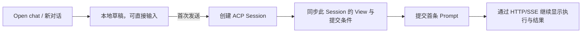

# Agent UI 人工体验验收整改记录

日期：2026-09-26。状态：**第一版整改已通过隔离 C4；后续工作环境导航已部署，待用户确认样式**。
下方 C4 结论属于前一版整改。
用户要求：**样式修改优先展示修改后的页面，经用户确认样式通过，再执行测试回归**。
本次导航调整在收到该要求前已运行的本地测试保留，后续回归等待样式确认。
无 Session 输入禁用已现场复现并修复；运行态 Tool 间距问题按用户澄清修复，
浏览器集成已在 Run 运行期间测量 Process 标题与内容的间距并保存截图。
下文第 1 节保留整改前的问题定位，第 2–5 节记录目标和验收边界。

本轮实现覆盖本地草稿、首发创建并等待权威 View、创建结果不确定时暂停重试、
明确的新对话入口与可收起侧栏、运行态间距及 Turn 仍在运行时防止误折叠。
服务端 219 项、前端单元与组件、浏览器 HTTP/SSE 与 SSR 集成均通过。
隔离 C4 的 11 项业务检查通过且清理完成；原 strict Trace 只因既有时钟偏移告警
返回非零（本轮非时钟告警 0）。证据位于 Git 忽略的
`artifacts/verification/c4-browser-2026-09-25T18-06-00-481Z/` 和
`artifacts/verification/agent-ui/process-live-spacing.png`。
第一版整改曾定向部署到人工验收项目，镜像为
`sha256:c7fe29a7e6151f714871f2b84e9f5f69e1d8d9ba17b361f9c2c923ff5a44819b`；
原业务数据与其他服务保持不变。

工作环境副标题预览曾使用 `antnest/agent-ui:workspace-subtitle-20260926`，镜像为
`sha256:ede010f601310314194c4280eea1c2f95844cfe09e0860e9b5a6a8140085a021`。
侧栏保留 Antnest 主标题，将“当前 Agent 名称 ⌄”作为可切换副标题；下方为 New conversation、搜索与历史，
保留用户当前会话。此版本的后续回归等待样式确认，尚未运行隔离 C4。
标题融合版只执行了页面预览所需的构建与定向部署，未执行测试回归。

后续 URL 层级整改已部署为 `workspace-paths-20260926`，覆盖 Agent UI、Console
与 Gateway 三个服务。Agent UI 镜像为
`sha256:5476c08807b3afe4f62e4eb51b0a76169b3f5496083e76be3856371eef237d96`。
工作环境目录使用 `/workspace/`，新对话草稿使用 `/workspace/{agentId}/`，
已有会话使用 `/workspace/{agentId}/sessions/{sessionId}`。Console 的 Open chat、
Gateway 的登录返回与 Node SSR 共用此约定；开发阶段不兼容旧查询式文档 URL，
业务 HTTP/SSE API 的查询参数不变。详见
[导航契约](../../../contracts/agent-ui/workspace-navigation.md)。

本次只进行路由必要验证：Agent UI 路由/Node 9 项、相关 hook/BridgeApp 组件 17 项，
Console 返回路径 4 项与 Open chat 定向组件 1 项、Gateway `internal/server` 包测试通过；
生产 SSR/Node HTTP 集成 9 项通过，另新增的浏览器路由检查 1 项通过，验证刷新、
前进后退、未发送草稿保留与零 Session/Prompt 写入。三个镜像构建和定向部署健康检查通过。
在部署环境观察到 Open chat 生成工作环境路径，未登录请求 303 保留完整会话返回路径，
Chrome 的原“你好”会话能够直接加载、刷新及前进后退。未发送新的模型请求。
现有集成/E2E 的文档路径及 URL 断言已同步，12 个改动脚本语法通过；
**完整样式、HTTP/SSE 浏览器与 C4 回归仍等用户确认后执行，本轮未宣称最终验收通过**。

### Slash 命令补全预览

后续经用户授权，已增加 [阶段四命令前置准备](../../../docs/stage4-command-preparation-20260926.md)：
Node 提供 11 个控制命令及独立目录。当前预览中，无 Session 可以使用帮助、状态与
会话导航；已有 Session 按配置能力提供模型/模式/thinking，运行期间可查询与停止。
控制结果在输入框上方显示并可关闭，不写入模型会话。下面原生 ACP 补全的初版记录
保留为历史，其中“首条消息之后才有任何命令”的限制已由新的 Agent 级控制目录解除。
服务端 242 项及官方 SDK/HTTP/SSE 集成 16 项通过。按用户进一步明确的顺序，
生产容器回归和真实服务链路后端 Docker 验收也已完成，全部 11 个命令通过，
临时资源已清理。界面回归仍等待样式确认。

根据用户的 `/` 命令识别反馈，对照本机 attyd `754ac14` 的
`web/src/components/acp/prompt-composer.tsx`：使用 ACP 命令列表、前导 `/`
筛选、上下选择、Enter 填入和 Escape 关闭。本次也支持 Tab 补全，菜单放在
输入框内部上方，显示命令、说明、参数提示及快捷键。

根因有两层：Node Bridge 原先丢弃 `available_commands_update` 的 Session
元数据，前端 Composer 也没有读取命令列表或呈现候选项。现已补通
ACP → CompactTranscript → HTTP/SSE Session View → Composer，普通通知与
replay checkpoint 携带的目录均可更新；新列表替换旧列表，空列表清除，内存
统计只保留当前目录，ACP 私有 `_meta` 不暴露。命令不会变成聊天 Turn。

候选来源限定为当前已同步的 Session；未知命令保留普通 Prompt 行为。
未发送过首条消息的新对话尚无 Session 目录，输入 `/` 会明确提示命令在
首条消息之后可用，不借用其他会话的命令，也不为发现命令创建空 Session。
这沿用已确认的“首发创建 Session”约束；如需首发前提供权威命令目录，
需另定义 Agent 级发现契约。

预览已部署：`antnest/agent-ui:slash-commands-20260926`，镜像
`sha256:dd712647e4cb995e0a4cab53f3bd2162b70a7d67a92b28b93fd00c643a74dc20`。
Node/TypeScript/浏览器与 SSR 构建及定向部署健康检查通过。Chrome 中当前
`/help` 会话输入 `/` 显示来自后端的命令；输入 `/he` 后 Enter 只完成为
`/help`，聊天仍为原来的一个 Exchange，没有提交新 Prompt。
已将页面留在菜单展开状态供用户确认。

行为测试已先行补充，覆盖目录替换/清空、checkpoint、Session 隔离、SSE
增量和内存统计，以及键盘、鼠标、IME、未知命令和新对话边界；**本轮尚未
执行这些测试或全面回归，按用户要求等待样式确认**。输入框改为具有候选列表的
combobox，现有相关测试的可访问角色选择器已同步；历史归档源码未改动。
构建和部署记录位于 `artifacts/verification/agent-ui-slash-commands/`。

## 1. 人工反馈与现状

用户完成登录、Provider、模板和 Agent 创建后，从 Console 点击 Open chat，
发送了“你好”。机器回归已经通过，但这条人工使用路径仍有三项体验问题：

| 编号 | 问题与复现 | 定位 | 优先级 |
| --- | --- | --- | --- |
| UX-01 | Open chat 进入无 Session 的页面：底部已经显示输入框，却不能输入，提示 `Conversation not yet synchronized`；必须先找到 New conversation 才能开始 | `conversationReady` 必须有选中的 Session；Composer 将它作为编辑和发送的共同前提，`submit()` 也直接拒绝没有 Session 的情况 | P0 |
| UX-02 | 侧边栏强调品牌、Agent 区块和分割线；“新对话”同时藏在侧栏标题旁及右上角的加号中；桌面不能收起侧栏 | Sidebar 的多区块结构、重复入口和 NavigationPanel 的桌面固定 aside | P1 |
| UX-03 | 用户明确指出：执行过程中 Tool 栏缺少间距、贴在一起；反馈针对运行态，不是执行结束后的折叠样式 | Process 标题与内容间的 12px 上间距只在 `data-complete="true"` 时生效；运行态不匹配。内部虽有 gap，不能补上这一层的间距；其他相邻位置需用运行态帧继续核对 | P1 |

依据：
[WorkspacePage](../web/src/WorkspacePage.tsx)、
[useBridgeWorkspace](../web/src/lib/use-bridge-workspace.ts)、
[Composer](../web/src/components/Composer.tsx)、
[Sidebar](../web/src/components/Sidebar.tsx)、
[NavigationPanel](../web/src/components/NavigationPanel.tsx)、
[Conversation](../web/src/components/Conversation.tsx)、
[ToolActivity](../web/src/components/ToolActivity.tsx)、
[样式](../web/src/styles.css)。

整改前的 [C4 浏览器流程](../../../tests/e2e/workspace-closeout/c4-browser.mjs)
先点击 New conversation 才输入；本轮已将正常首发改为直接发送，另测新对话入口。
本轮“你好”中的一次 Tool 参数错误及随后成功调用是真实执行记录，排版整改须保留这些记录。
初次复查拿到了完成后展开状态的 44px 行高、16px 条目 gap；这些数值仅能作为对照，
不能据此将 UX-03 写成“间距过大”，也不能用压缩全局 gap 作为修复方向。

## 2. 首次发送创建 Session

前端称为“对话”，持久化实体仍是 ACP Session。
“输入即创建对话”落实为：**无 Session 时直接编辑，首次发送时创建 Session**。
打开页面、打字、添加本地附件以及点击“新对话”都不分配服务端 Session。

### 用户流程

1. Open chat 携带 Agent ID、没有 Session ID 时进入该 Agent 的新对话草稿。
   即使侧栏已有历史，也保持此入口语义；带 Session ID 的链接继续打开对应历史。
2. 空页面将简短欢迎语和输入框放在主区中部，输入框可直接编辑。
   新对话没有历史要同步，不显示历史同步错误。Agent 状态尚未确认、忙碌或离线时，
   保留草稿编辑，仅禁用发送并解释实际原因。
3. 首次 Enter 或点击发送，立即显示“正在准备对话”；
   在同一次用户动作内串行完成创建 Session、取得可提交的 Session View、提交 Prompt。
4. 获得 Session ID 后更新当前 URL、转移草稿所属对象并加入历史列表。
   首条提交经服务端确认后清空对应草稿；标题采用服务端元数据。
5. 对话区进入普通布局，输入框移到主区底部。尽量复用同一 Composer，保持焦点与附件预览。



### 状态与恢复约定

| 状态 | 页面行为 | 提交约束 |
| --- | --- | --- |
| 新对话草稿 | 输入与本地附件可编辑，无同步告警 | 授权有效、Agent ready、内容有效时可首发 |
| 创建中 / 同步新 Session | 显示明确进度，保留此次发送的文本与附件 | 单次提交锁，阻止连击及重复 Enter；不靠固定延时猜测就绪 |
| 已有 Session 正在加载或恢复 | 展示历史加载或恢复状态 | 继续要求此 Session 的有效 historyToken / appendVersion |
| 创建明确被拒绝 | 回到可编辑草稿，说明原因 | 修正问题后由用户重试 |
| Session 已创建、Prompt 明确未受理 | 保留该 Session 和未发送内容 | 后续提交复用该 Session |
| 创建结果不确定 | 保留草稿，刷新目录并提示用户核对 | 不自动再次创建，不按“最新对话”猜测所属 Session |
| Prompt 结果不确定 | 显示正在核对原消息状态 | 使用原 intentId 查询；不自动生成新意图重发 |

具体实现：

- 将“草稿可编辑”“可以创建并首发”“可以向已有 Session 提交”分开判定。
  无 Session 的正常空态不能复用 `historyReady=false` 的错误含义。
- 将当前 `newConversation()` 改为选择该 Agent 的本地草稿并聚焦输入框。
  同一 Agent 只维护一个尚未提交的新对话草稿；重复点击不新增空 Session，也不清掉已有草稿。
- 复用 [Session presentation](../web/src/lib/session-presentation.ts) 已有的
  `(agentId, sessionId=null)` 草稿槽与 `move` 能力，原子转移文本和附件。
  提交记录绑定身份、Agent、草稿版本、Session、intentId；异步返回不能清除后来编辑的内容。
- 创建成功后等待所创建 Session 的权威 View，再调用现有 Prompt 受理链路。
  保留 `If-Match`、appendVersion 和稳定 intentId；已有 Session 的防重与历史条件不能放宽。
- 创建尚未完成时切换 Agent/对话，迟到响应不抢回页面，也不向新选中的会话发送文本。
  如果已创建而尚未提交，保留原归属和草稿供恢复；Prompt 已受理后的执行继续由 Node Bridge 承接。
- 首次发送前按 Agent 的默认模型、模式和 thinking 配置执行，草稿界面展示默认设置提示。
  Session 建立后才展示其权威配置选项。此方案不从其他 Session 借用选项，也不为打开设置菜单
  提前创建空 Session。若要求首条发送前选择非默认配置，需另定义无 Session 的权威选项读取契约。
- 草稿与附件保持页面内存生命周期；切换身份时清除，Session 转移后释放旧槽。
  不引入浏览器持久化或额外的全局历史缓存。

### 后端范围

正常路径可以复用现有接口，主要改动归 Agent UI 前端所有：
`POST /agents/A/sessions` → 同步 Session View → `POST /agents/A/sessions/S/prompts`。
ACP 继续持久化 Session，Node Bridge 继续独立于页面执行；HTTP/SSE 和 SSR 架构延续现状。

需要遵守现有 [Workspace API 契约](../../../contracts/agent-ui/workspace-api.md)：
当前 [Session 创建接口](../web/server/src/http/session-routes.ts) 没有创建意图键，
不承诺响应丢失或 Bridge 重启后的创建去重。不能把两步浏览器调用描述为原子事务，
也不能宣称任何故障下都不会留下空 Session。本批通过明确的结果待确认状态恢复。
如后续要求首次创建跨重启自动恢复，另拆 ACP/Bridge 契约与服务批次。

## 3. 侧边栏与空态布局

依据用户后续检阅，采用 **工作环境 → 对话操作 → 对话历史** 的导航层级。
当前一个 Agent 对应一个工作环境；工作环境选择是整个侧栏的上下文，
New conversation、搜索与历史全部归属于当前环境。持久化与 API 继续使用 Agent / Session。

| 区域 | 调整目标 |
| --- | --- |
| 侧栏顶部 | 按用户进一步澄清保留 Antnest 主标题及标志，将当前 Agent 名称与下拉箭头作为可切换副标题；收起按钮位于右侧 |
| 工作环境选择 | 独立浮层列出可访问的 Agent 环境；展开不挤动历史；保留 All workspaces 目录入口 |
| 对话操作 | 位于环境选择之下，依次显示 New conversation 和当前环境内搜索；首次发送才创建 Session |
| 历史区域 | 占据主要高度，扁平行、清晰选中态；可按今日/近期/更早分组，分组只使用服务端更新时间 |
| 历史行 | 以标题为主，长标题截断但保留完整可访问名称；时间作为次要信息，不挤占标题 |
| 底部 | 账号及控制台入口固定在底部，视觉上弱化维护操作 |
| 桌面 | 展开宽度 272px，收为 64px 窄导航；窄栏也按环境选择、新对话的顺序排列；收起保留草稿、选中项与搜索条件 |
| 移动端 | 保留已有模态抽屉、Escape、焦点约束与关闭后焦点恢复；当前场景只保留一个明确的新对话主入口 |
| 主区空态 | 欢迎语紧邻可编辑 Composer，避免中间巨幅留白、输入框孤立在页底 |
| 主区有消息 | 对话和 Composer 使用一致内容宽度；顶部保留 Agent/状态，减少重复的加号、刷新按钮 |

不为日期分组一次性加载全部历史；沿用目录分页。浏览历史不改变更新时间，不打断后台 Run。

工作环境切换遵循现有 Agent 导航：显示目标 Agent 的本地草稿与历史，清除原环境的搜索条件；
切换回去仍可取回原 Agent 的草稿。重复选择当前环境只关闭浮层，保留当前 Session。
浮层支持 Tab、Escape、点击外部关闭；Escape 恢复环境入口焦点，移动端先关闭浮层，
再按 Escape 才关闭导航抽屉。目录统一使用 Your workspaces / Find a workspace 文案。
品牌与环境选择共用一个顶部标题区：Antnest 为主标题，当前 Workspace 为可切换副标题；
状态继续显示在主区标题和切换列表内。
这一轮仍先展示样式，等待用户确认后再更新并执行适用回归。

## 4. 运行中的 Tool / Process 间距

本项优先解决 **Run 执行中条目缺少间距**，保留完成后折叠样式的基本布局。
不能只在完成后展开历史来验收，也不先缩小行高或全局 gap。

代码中已有一个明确差异：

```css
.turn-process-content { display: flex; flex-direction: column; gap: 16px; }
.turn-process[data-complete="true"] .turn-process-content:not([hidden]) {
  margin-top: 12px;
  /* 其余完成态装饰省略 */
}
```

`ConversationTurn` 将 `folded` 写入 `data-complete`，运行时为 false。
Process 标题和内容是兄弟节点，因此内容内部的 16px gap 不会隔开标题与第一条记录。
12px 上间距当前只覆盖完成后的特定状态，运行态没有对应基础间距。
这能解释该位置贴合；是否还存在 Tool 与说明文字、连续 Tool 等位置的间距遗漏，
须在运行态逐项测量，不能从完成态截图推断。

实施步骤：

1. 使用可控的 HTTP/SSE fixture 将 Run 保持在 running，依次推送 Thinking、
   中间说明、Tool pending/running、输出更新、第二次 Tool 及完成事件。
   在执行途中分别截图和测量，先补能在现状失败的布局用例。
2. 将 Process 标题到可见内容的基础间距作用于所有展开状态，建议沿用 12px。
   完成态仅负责其额外装饰与折叠表现，不能独占必要的结构间距。
3. 统一每层间距的负责者：过程列表控制相邻记录，Tool 内部控制标题/输入/输出分区。
   如同一个 Message 同时含活动与正文，核对 `message-main` 中这些块之间的间距。
   保留已正确生效的 gap；修复缺失位置，避免多个 margin 与 gap 重复叠加。
4. 运行中、成功、失败沿用同一行结构。图标、标题、状态与展开箭头保持对齐，
   内容增长不挤掉间距；长标题、多行输出和窄屏时保持可读，触屏操作区域至少 44px。
5. 将 running → completed 的同一段过程在保持展开时对比：结构间距应稳定，
   不应到执行结束才突然补上 margin。再独立核对正常折叠行为与滚动锚点。

失败状态保留文字、图标和错误详情，区分单次 Tool 失败与整轮 Run 失败。
按需加载、完整内容入口、过程分页和折叠后的释放策略继续生效。
不裁剪输出、不重排记录，也不提前渲染所有历史过程来修补视觉问题。

## 5. 实施批次与验收

先确定上述状态约定和 UI 验收用例，再按 Agent UI 所有权串行交付：

| 批次 | 范围 | 完成条件 |
| --- | --- | --- |
| A | 无 Session 草稿、首次发送创建、状态恢复与文案 | 先写失败用例，再修改 hook / presentation / Composer / 空态布局；逻辑与组件门禁通过 |
| B | Sidebar、NavigationPanel、顶部入口与响应式布局 | 桌面收起、移动抽屉、键盘焦点、历史分页、草稿保持通过 |
| C | 运行态 Process / Tool 间距与状态切换 | 先保持 Run 为 running 复现贴合，再验证结构间距、长输出、连续 Tool 与完成态转换 |
| I | 明确的集成与真实服务验收批次 | HTTP/SSE、SSR、浏览器和适用 Docker E2E 通过后，定向部署 Agent UI，重新人工走 Open chat → 直接发送 |

关键验收用例：

1. 没有任何 Session 时，Open chat 后可直接输入“你好”；无须点击新对话。
2. 只打开、输入、清空或多次点击新对话：Session 数均不增长。
3. 首次发送：正常路径恰好一个新 Session、一个 Prompt/Run；连续 Enter、双击发送不重复提交。
4. IME 确认候选词不发送；附件首发与文本首发共用创建流程，创建前完成可用的本地校验。
5. 创建明确失败保留草稿；已创建后的提交失败复用 Session；响应丢失不自动另建或重发。
6. 创建期间导航、权限失效或身份变化：内容不串到其他 Agent/Session/账号。
7. 首发后 URL 指向真实 Session；刷新恢复服务端历史；已受理执行不因关页或折叠侧栏中断。
8. 新对话与已有对话分别保留草稿；已有会话历史加载/恢复的提交条件继续生效。
9. 320px、390px、820px、1440px，以及短视口下，输入区和抽屉可操作，无页面横向滚动。
10. Run 仍为 running 时，Process 标题与首条记录、说明文字与 Tool、连续 Tool 的边界均有设计规定的正间距；通过 DOM 几何断言与运行中截图确认。
11. 长命令、多行输出、流式更新以及同一过程 running → completed 保持对齐和间距稳定，展开/折叠不破坏滚动锚点。
12. 保留 Stop、权限请求、重连、分页与内存边界的现有回归；截图覆盖空态、正常对话、运行中和完成后，不能以最终截图替代运行中检查。

单元/组件测试归 `services/agent-ui/web/`；跨模块/浏览器集成归
`tests/integration/agent-ui/`；真实栈验收扩展 `tests/e2e/workspace-closeout/`。
修改 C4 的正常首发路径以直接输入发送，并单独保留“新对话”入口的语义测试。
验证串行执行，私有结果归 `artifacts/verification/`。

本轮验收环境及已有 Agent、Session 保留，部署整改时不通过重置业务数据获得通过结果。
最终人工判定以用户重新检阅这三项体验为准，不用既有机器验收结论替代。
